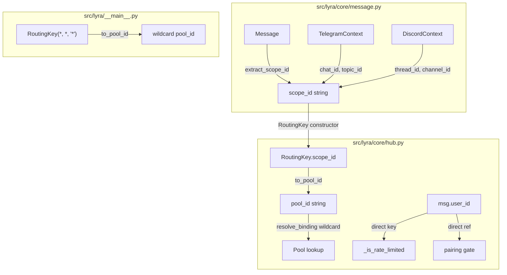
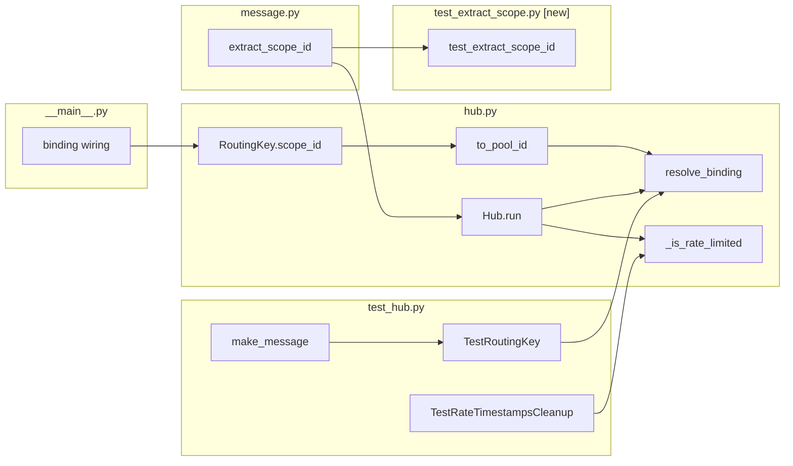

## Summary

Replace `RoutingKey.user_id` with `RoutingKey.scope_id` across the hub, adapters, and tests. Add `Message.extract_scope_id()` for scope extraction from platform context. Update rate limiting to key on `user_id` directly (not RoutingKey). Update ADR-001 and ADR-005. This is Slice 1 of 3 for #112.

## Architecture

### Data flow



### File x function map



## Bootstrap Context

From analysis: RoutingKey ripple is the primary risk. Pyright catches field renames on NamedTuple. Rate limiting key type change is the most likely silent semantic bug — must test cross-scope rate limiting explicitly.

## Agents

| Agent | Tasks | Files |
|-------|-------|-------|
| backend-dev | 6 | `message.py`, `hub.py`, `__main__.py` |
| tester | 5 | `test_hub.py`, `test_extract_scope.py` [new], `test_telegram.py`, `test_discord.py` |
| doc-writer | 1 | ADR-001, ADR-005 |

## Reference Patterns

- `RoutingKey` NamedTuple pattern: `src/lyra/core/hub.py:55-68`
- `TelegramContext` / `DiscordContext` dataclasses: `src/lyra/core/message.py:64-87`
- Test helper `make_message()`: `tests/core/test_hub.py:48-65`

## Consistency Report

| Metric | Value |
|--------|-------|
| Spec criteria (Slice 1) | 11 |
| Tasks covering criteria | 11/11 |
| Uncovered criteria | 0 |
| Untraced tasks | 0 |

## Micro-Tasks

### Phase: RED (tests first)

---

**T1. Add `extract_scope_id()` tests** `[P]`
- **Agent:** tester
- **Spec trace:** SC: `Message.extract_scope_id()` returns correct scope for all 5 contexts
- **File:** `tests/core/test_extract_scope.py` [new]
- **Description:** Write tests for `Message.extract_scope_id()` covering all 5 platform contexts (TG DM, TG group, TG forum, DC thread, DC channel).
- **Code snippet:**
```python
class TestExtractScopeId:
    def test_telegram_dm(self):
        msg = make_message(platform_context=TelegramContext(chat_id=555))
        assert msg.extract_scope_id() == "chat:555"

    def test_telegram_group(self):
        msg = make_message(platform_context=TelegramContext(chat_id=888, is_group=True))
        assert msg.extract_scope_id() == "chat:888"

    def test_telegram_forum(self):
        msg = make_message(platform_context=TelegramContext(chat_id=888, topic_id=42))
        assert msg.extract_scope_id() == "chat:888:topic:42"

    def test_discord_thread(self):
        msg = make_message(platform_context=DiscordContext(guild_id=1, channel_id=2, message_id=3, thread_id=111))
        assert msg.extract_scope_id() == "thread:111"

    def test_discord_channel(self):
        msg = make_message(platform_context=DiscordContext(guild_id=1, channel_id=222, message_id=3))
        assert msg.extract_scope_id() == "channel:222"
```
- **Verify:** `uv run pytest tests/core/test_extract_scope.py -x`
- **Expected output:** 5 FAILED (method not implemented yet)
- **Time estimate:** 3 min
- **Difficulty:** 1

---

**T2. Update `TestRoutingKey` for `scope_id`** `[P]`
- **Agent:** tester
- **Spec trace:** SC: `RoutingKey` uses `scope_id`; `to_pool_id()` format is `{platform}:{bot_id}:{scope_id}`
- **File:** `tests/core/test_hub.py`
- **Description:** Update all `TestRoutingKey` test methods: change `user_id=` kwarg to `scope_id=` (or positional). Update `make_message()` to accept scope info. Update pool_id assertions to use scope-based IDs.
- **Verify:** `uv run pytest tests/core/test_hub.py::TestRoutingKey -x`
- **Expected output:** FAILED (RoutingKey.scope_id doesn't exist yet)
- **Time estimate:** 5 min
- **Difficulty:** 2

---

**T3. Add cross-scope rate limit bypass test** `[P]`
- **Agent:** tester
- **Spec trace:** SC: User cannot bypass rate limit by switching chats
- **File:** `tests/core/test_hub.py`
- **Description:** Add test: same `user_id` sends `RATE_LIMIT+1` messages across 2 different scopes within the rate window. The last message must be rate-limited.
- **Code snippet:**
```python
def test_rate_limit_spans_scopes(self):
    hub = Hub(rate_limit=3, rate_window=60)
    # 2 messages in scope A, 1 in scope B = 3 total for this user
    for scope in ["chat:1", "chat:1", "chat:2"]:
        msg = make_message(user_id="alice", scope_id=scope)
        hub._is_rate_limited(msg)
    msg4 = make_message(user_id="alice", scope_id="chat:2")
    assert hub._is_rate_limited(msg4) is True
```
- **Verify:** `uv run pytest tests/core/test_hub.py -k "rate_limit_spans_scopes" -x`
- **Expected output:** FAILED
- **Time estimate:** 3 min
- **Difficulty:** 2

---

**T4. Add scope-isolated pool test** `[P]`
- **Agent:** tester
- **Spec trace:** SC: Same user in two different TG chats gets two separate pools
- **File:** `tests/core/test_hub.py`
- **Description:** Add test: same user_id, different scope_ids via wildcard binding → two distinct pools with independent histories.
- **Verify:** `uv run pytest tests/core/test_hub.py -k "scope_isolated_pool" -x`
- **Expected output:** FAILED
- **Time estimate:** 3 min
- **Difficulty:** 2

---

### RED-GATE: Run all RED tests — all must FAIL for expected reasons

```bash
uv run pytest tests/core/test_extract_scope.py tests/core/test_hub.py -k "extract_scope or scope_id or rate_limit_spans or scope_isolated" --tb=line 2>&1 | tail -5
```

---

### Phase: GREEN (implementation)

---

**T5. Implement `extract_scope_id()` on Message**
- **Agent:** backend-dev
- **Spec trace:** S1-1
- **File:** `src/lyra/core/message.py`
- **Description:** Add `extract_scope_id()` method to `Message` dataclass. Dispatch on `platform_context` type.
- **Code snippet:**
```python
def extract_scope_id(self) -> str:
    ctx = self.platform_context
    if isinstance(ctx, TelegramContext):
        if ctx.topic_id is not None:
            return f"chat:{ctx.chat_id}:topic:{ctx.topic_id}"
        return f"chat:{ctx.chat_id}"
    if isinstance(ctx, DiscordContext):
        if ctx.thread_id is not None:
            return f"thread:{ctx.thread_id}"
        return f"channel:{ctx.channel_id}"
    raise ValueError(f"Unknown platform context type: {type(ctx)}")
```
- **Verify:** `uv run pytest tests/core/test_extract_scope.py -x`
- **Expected output:** 5 PASSED
- **Time estimate:** 3 min
- **Difficulty:** 1

---

**T6. Rename `RoutingKey.user_id` → `scope_id`**
- **Agent:** backend-dev
- **Spec trace:** S1-2, S1-3
- **File:** `src/lyra/core/hub.py`
- **Description:** Rename `user_id` field to `scope_id` in `RoutingKey` NamedTuple. Update `to_pool_id()`. Update docstrings. Update `resolve_binding()` wildcard path (line 176) to use `msg.extract_scope_id()` instead of `msg.user_id`. Update `Hub.run()` to construct RoutingKey with `msg.extract_scope_id()`.
- **Key changes:**
  - Line 56: docstring → "Routing key: (platform, bot_id, scope_id)"
  - Line 60: `user_id: str` → `scope_id: str`
  - Line 63-68: `self.user_id` → `self.scope_id`
  - Line 167: `RoutingKey(msg.platform, msg.bot_id, msg.user_id)` → `RoutingKey(msg.platform, msg.bot_id, msg.extract_scope_id())`
  - Line 171: wildcard `RoutingKey(msg.platform, msg.bot_id, "*")`  — unchanged (wildcard is scope-level)
  - Line 176-178: concrete pool synthesis must use `msg.extract_scope_id()`
  - Line 275: `RoutingKey(msg.platform, msg.bot_id, msg.user_id)` → `RoutingKey(msg.platform, msg.bot_id, msg.extract_scope_id())`
  - `register_binding()` line 138: parameter name `user_id` → `scope_id`, update collision guard field refs
- **Verify:** `uv run pyright src/lyra/core/hub.py`
- **Expected output:** 0 errors
- **Time estimate:** 5 min
- **Difficulty:** 3

---

**T7. Update `_is_rate_limited()` to key on `user_id`**
- **Agent:** backend-dev
- **Spec trace:** S1-4, SC: rate limiting keys on `(platform, bot_id, user_id)` tuple
- **File:** `src/lyra/core/hub.py`
- **Description:** Change `_rate_timestamps` type from `dict[RoutingKey, deque[float]]` to `dict[tuple[str, str, str], deque[float]]` (platform.value, bot_id, user_id). Update `_is_rate_limited()` to construct key from `msg.user_id` directly.
- **Code snippet:**
```python
self._rate_timestamps: dict[tuple[str, str, str], deque[float]] = {}

def _is_rate_limited(self, msg: Message) -> bool:
    key = (msg.platform.value, msg.bot_id, msg.user_id)
    # ... rest unchanged
```
- **Verify:** `uv run pytest tests/core/test_hub.py::TestRateTimestampsCleanup -x`
- **Expected output:** PASSED (after updating test)
- **Time estimate:** 3 min
- **Difficulty:** 2

---

**T8. Update `__main__.py` binding wiring**
- **Agent:** backend-dev
- **Spec trace:** SC: all existing tests pass
- **File:** `src/lyra/__main__.py`
- **Description:** Update `RoutingKey()` constructor calls at lines 264-265 to use `scope_id` kwarg. Update `register_binding()` calls at lines 266-269 to use `scope_id` parameter.
- **Verify:** `uv run pyright src/lyra/__main__.py`
- **Expected output:** 0 errors
- **Time estimate:** 2 min
- **Difficulty:** 1

---

**T9. Update all test fixtures**
- **Agent:** tester
- **Spec trace:** SC: all existing tests pass
- **Files:** `tests/core/test_hub.py`, `tests/adapters/test_telegram.py`, `tests/adapters/test_discord.py`, `tests/test_main.py`, `tests/test_health_endpoint.py`
- **Description:** Update `make_message()` helpers and all test code that constructs `RoutingKey` with `user_id=` to use `scope_id=`. Update pool_id string assertions. Update `TestRateTimestampsCleanup` to use user-keyed rate limiting. Ensure `make_message()` now takes `scope_id` or derives it from `platform_context`.
- **Verify:** `uv run pytest --tb=short`
- **Expected output:** All tests PASSED
- **Time estimate:** 8 min
- **Difficulty:** 3

---

**T10. Run full test suite + typecheck**
- **Agent:** tester
- **Spec trace:** SC: all existing tests pass
- **Description:** Run full quality gate.
- **Verify:**
```bash
uv run ruff check . && uv run pyright && uv run pytest
```
- **Expected output:** All green
- **Time estimate:** 2 min
- **Difficulty:** 1

---

### Phase: DOCS

---

**T11. Update ADR-001 and ADR-005**
- **Agent:** doc-writer
- **Spec trace:** S1-6, SC: ADRs updated
- **Files:** `docs/architecture/adr/001-routing-key-platform-bot-id-user-id.mdx`, `docs/architecture/adr/005-wildcard-binding-concurrency-and-per-user-pools.mdx`
- **Description:** Add "Superseded by" or amendment section noting `user_id` → `scope_id` rename. Update ADR-001 title reference. Update ADR-005 code examples to show `scope_id`. Note: `user_id` remains on `Message` for auth/rate-limiting — only `RoutingKey` changes.
- **Verify:** `grep -c "scope_id" docs/architecture/adr/001-*.mdx docs/architecture/adr/005-*.mdx`
- **Expected output:** Both files contain scope_id references
- **Time estimate:** 5 min
- **Difficulty:** 1
