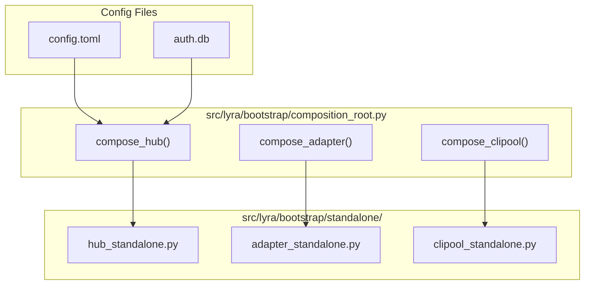
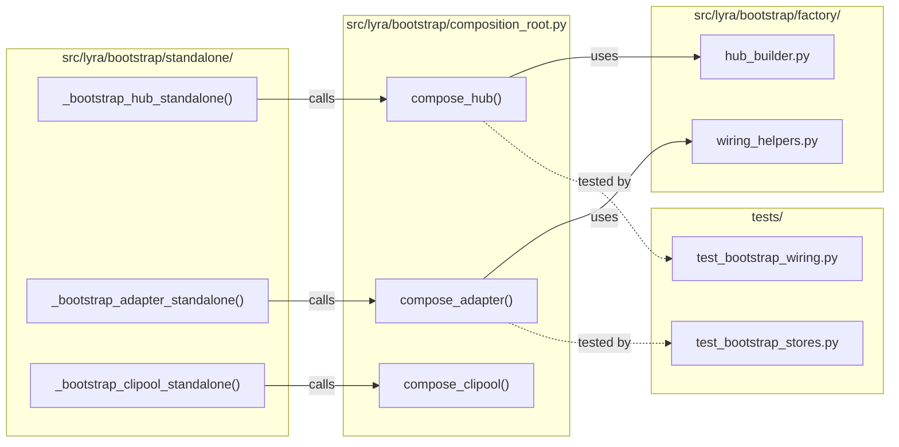

## Summary

Flatten standalone-vs-wired bootstrap duplication into a shared composition root, reduce `wiring-bootstrap-deps` from 15 to ≤5 by constructor injection, migrate 42 monkeypatch sites in `tests/factories/bootstrap.py` to DI fixtures, and verify all 5 entry points via smoke tests. Split across 4 agents ∥ to respect per-instance caps.

## Architecture

### Data Flow

### File × Function Map

## Agents

| Agent | Task count | Files |
|-------|-----------|-------|
| backend-dev-A | 5 | `standalone/adapter_standalone.py`, `standalone/hub_standalone.py`, `standalone/clipool_standalone.py`, `factory/hub_builder.py`, `factory/unified.py` |
| backend-dev-B | 5 | `factory/wiring_helpers.py`, `wiring/bootstrap_wiring.py`, `wiring/nats_wiring.py`, `factory/agent_factory.py`, `standalone/adapter_standalone.py` |
| tester-A | 4 | `tests/factories/bootstrap.py`, `tests/bootstrap/test_*.py`, `.importlinter` |
| tester-B | 5 | CLI smoke tests, RED-GATEs |

## Wave Structure

3 waves, max 4 agents ∥. Elapsed ~5 days sequential → ~2 days parallel.

| Wave | Trigger | Agents | Tasks |
|------|---------|--------|-------|
| 1 | start | backend-dev-A, backend-dev-B, tester-A | backend-dev-A: T1-T3 · backend-dev-B: T6-T9 · tester-A: T12-T15 |
| 2 | Wave 1 done | backend-dev-A, backend-dev-B, tester-A, tester-B | backend-dev-A: T4-T5 · backend-dev-B: T10-T11 · tester-A: T16 · tester-B: T17 |
| 3 | Wave 2 done | tester-B | tester-B: T18-T22 |

### Budget — per task

| Task | Items | Class | Est. ops | Split? |
|------|-------|-------|----------|--------|
| T1-T3 | 3 | judgmental | 5 each | — |
| T4-T5 | 2 | bounded | 3 each | — |
| T6-T9 | 4 | judgmental | 4 each | — |
| T10-T11 | 2 | bounded | 3 each | — |
| T12-T15 | 4 | judgmental | 6 each | — |
| T16 | 1 | trivial | 2 | — |
| T17-T22 | 6 | bounded | 3 each | — |

**Total estimated ops: 78**

### Budget — per agent instance

| Instance | Tasks | Σ ops | Subjects | Split? |
|----------|-------|-------|----------|--------|
| backend-dev-A | T1-T5 | 21 | bootstrap, composition | — |
| backend-dev-B | T6-T11 | 19 | wiring, annotations | — |
| tester-A | T12-T16 | 20 | tests, fixtures, config | — |
| tester-B | T17-T22 | 18 | smoke, regression | — |

## Consistency Report

- Criteria covered: 7/7
- Uncovered criteria: none
- Tasks without spec backing: none
- Gold plating exemptions applied: 0

## Micro-Tasks

### Slice V1: Flatten standalone-vs-wired

#### Task 1: Extract `compose_hub()` from standalone + builder [P]
- **File:** `src/lyra/bootstrap/composition_root.py` (new)
- **Snippet:** `def compose_hub(config: Config, deps: DependencyGraph) -> HubSubsystem:`
- **Verify:** `grep -q 'def compose_hub' src/lyra/bootstrap/composition_root.py`
- **Expected:** match found
- **Time:** 8 min
- **Difficulty:** 3
- **Traces:** SC-1, SC-6
- **Phase:** RED

#### Task 2: Extract `compose_adapter()` from standalone + wiring [P]
- **File:** `src/lyra/bootstrap/composition_root.py`
- **Snippet:** `def compose_adapter(config: Config, deps: DependencyGraph, platform: str) -> AdapterSubsystem:`
- **Verify:** `grep -q 'def compose_adapter' src/lyra/bootstrap/composition_root.py`
- **Expected:** match found
- **Time:** 8 min
- **Difficulty:** 3
- **Traces:** SC-1, SC-6
- **Phase:** RED

#### Task 3: Extract `compose_clipool()` from standalone + unified [P]
- **File:** `src/lyra/bootstrap/composition_root.py`
- **Snippet:** `def compose_clipool(config: Config, deps: DependencyGraph) -> ClipoolSubsystem:`
- **Verify:** `grep -q 'def compose_clipool' src/lyra/bootstrap/composition_root.py`
- **Expected:** match found
- **Time:** 5 min
- **Difficulty:** 2
- **Traces:** SC-1, SC-6
- **Phase:** RED

#### Task 4: Create standalone wrappers calling composition root [P]
- **File:** `src/lyra/bootstrap/standalone/hub_standalone.py`, `src/lyra/bootstrap/standalone/adapter_standalone.py`, `src/lyra/bootstrap/standalone/clipool_standalone.py`
- **Snippet:** `subsystem = composition_root.compose_hub(config, deps)`
- **Verify:** `grep -q 'compose_hub' src/lyra/bootstrap/standalone/hub_standalone.py`
- **Expected:** match found
- **Time:** 5 min
- **Difficulty:** 2
- **Traces:** SC-1
- **Phase:** RED

#### Task 5: Remove duplicate setup logic from standalone files [P]
- **File:** `src/lyra/bootstrap/standalone/hub_standalone.py`, `src/lyra/bootstrap/standalone/adapter_standalone.py`
- **Snippet:** delete inlined config-loading, store-init, NATS-connect
- **Verify:** `wc -l src/lyra/bootstrap/standalone/hub_standalone.py` and `wc -l src/lyra/bootstrap/standalone/adapter_standalone.py`
- **Expected:** ≤150 lines each
- **Time:** 5 min
- **Difficulty:** 2
- **Traces:** SC-1
- **Phase:** RED

#### RED-GATE V1: Tests pass after flattening
- **Verify:** `uv run pytest tests/bootstrap/ -q`
- **Expected:** 0 failures
- **Phase:** RED-GATE

### Slice V2: Reduce wiring-bootstrap-deps annotations

#### Task 6: Inject deps via constructor in `wiring_helpers.py` [P]
- **File:** `src/lyra/bootstrap/factory/wiring_helpers.py`
- **Snippet:** `def build_router(nats_client: NATSClient, store: Store) -> Router:`
- **Verify:** `grep -c 'wiring-bootstrap-deps' src/lyra/bootstrap/factory/wiring_helpers.py`
- **Expected:** 0
- **Time:** 6 min
- **Difficulty:** 3
- **Traces:** SC-1
- **Phase:** RED

#### Task 7: Inject deps via constructor in `bootstrap_wiring.py` [P]
- **File:** `src/lyra/bootstrap/wiring/bootstrap_wiring.py`
- **Snippet:** `def bootstrap_wiring(graph: DependencyGraph) -> WiredSubsystem:`
- **Verify:** `grep -c 'wiring-bootstrap-deps' src/lyra/bootstrap/wiring/bootstrap_wiring.py`
- **Expected:** 0
- **Time:** 5 min
- **Difficulty:** 2
- **Traces:** SC-1
- **Phase:** RED

#### Task 8: Inject deps via constructor in `nats_wiring.py` [P]
- **File:** `src/lyra/bootstrap/wiring/nats_wiring.py`
- **Snippet:** `def nats_wiring(client: NATSClient) -> NATSSubsystem:`
- **Verify:** `grep -c 'wiring-bootstrap-deps' src/lyra/bootstrap/wiring/nats_wiring.py`
- **Expected:** 0
- **Time:** 5 min
- **Difficulty:** 2
- **Traces:** SC-1
- **Phase:** RED

#### Task 9: Inject deps via constructor in `agent_factory.py` [P]
- **File:** `src/lyra/bootstrap/factory/agent_factory.py`
- **Snippet:** `def build_agent(graph: DependencyGraph) -> Agent:`
- **Verify:** `grep -c 'wiring-bootstrap-deps' src/lyra/bootstrap/factory/agent_factory.py`
- **Expected:** 0
- **Time:** 5 min
- **Difficulty:** 2
- **Traces:** SC-1
- **Phase:** RED

#### Task 10: Reduce annotations in `adapter_standalone.py` wrapper [P]
- **File:** `src/lyra/bootstrap/standalone/adapter_standalone.py`
- **Snippet:** remove `wiring-bootstrap-deps` where DI handles it
- **Verify:** `grep -c 'wiring-bootstrap-deps' src/lyra/bootstrap/standalone/adapter_standalone.py`
- **Expected:** ≤2 (justified inline)
- **Time:** 4 min
- **Difficulty:** 2
- **Traces:** SC-1
- **Phase:** RED

#### RED-GATE V2: Annotation count ≤5
- **Verify:** `grep -r 'wiring-bootstrap-deps' src/lyra/bootstrap/ --include='*.py' | wc -l`
- **Expected:** ≤5
- **Phase:** RED-GATE

### Slice V3: Extract test fakes to DI fixtures

#### Task 12: Rewrite `tests/factories/bootstrap.py` monkeypatch → DI fixtures [P]
- **File:** `tests/factories/bootstrap.py`
- **Snippet:** `def fake_hub(graph: DependencyGraph) -> Hub: ...`
- **Verify:** `grep -c 'monkeypatch' tests/factories/bootstrap.py`
- **Expected:** 0
- **Time:** 10 min
- **Difficulty:** 4
- **Traces:** SC-4, SC-5
- **Phase:** RED

#### Task 13: Update `tests/bootstrap/test_bootstrap_wiring.py` to DI fixtures [P]
- **File:** `tests/bootstrap/test_bootstrap_wiring.py`
- **Snippet:** `def test_bootstrap_wiring(fake_hub): ...`
- **Verify:** `grep -c 'monkeypatch' tests/bootstrap/test_bootstrap_wiring.py`
- **Expected:** 0
- **Time:** 5 min
- **Difficulty:** 2
- **Traces:** SC-4
- **Phase:** RED

#### Task 14: Update `tests/bootstrap/test_bootstrap_stores.py` to DI fixtures [P]
- **File:** `tests/bootstrap/test_bootstrap_stores.py`
- **Snippet:** `def test_bootstrap_stores(fake_store): ...`
- **Verify:** `grep -c 'monkeypatch' tests/bootstrap/test_bootstrap_stores.py`
- **Expected:** 0
- **Time:** 5 min
- **Difficulty:** 2
- **Traces:** SC-4
- **Phase:** RED

#### Task 15: Update `tests/bootstrap/test_bootstrap_lifecycle.py` to DI fixtures [P]
- **File:** `tests/bootstrap/test_bootstrap_lifecycle.py`
- **Snippet:** `def test_bootstrap_lifecycle(fake_system): ...`
- **Verify:** `grep -c 'monkeypatch' tests/bootstrap/test_bootstrap_lifecycle.py`
- **Expected:** 0
- **Time:** 5 min
- **Difficulty:** 2
- **Traces:** SC-4
- **Phase:** RED

#### Task 16: Add `.importlinter` rule for `tests/factories` [P]
- **File:** `.importlinter`
- **Snippet:** `[importlinter:contract:tests-factories-isolated] sources = tests.factories forbidden = src.lyra.bootstrap`
- **Verify:** `grep -q 'tests-factories-isolated' .importlinter`
- **Expected:** match found
- **Time:** 3 min
- **Difficulty:** 1
- **Traces:** SC-4
- **Phase:** RED

### Slice V5: Verify all entry points still work

#### Task 17: Smoke test `lyra hub` [P]
- **Verify:** `uv run lyra hub --help`
- **Expected:** exit 0
- **Time:** 2 min
- **Difficulty:** 1
- **Traces:** SC-6
- **Phase:** GREEN

#### Task 18: Smoke test `lyra adapter telegram` [P]
- **Verify:** `uv run lyra adapter telegram --help`
- **Expected:** exit 0
- **Time:** 2 min
- **Difficulty:** 1
- **Traces:** SC-6
- **Phase:** GREEN

#### Task 19: Smoke test `lyra adapter discord` [P]
- **Verify:** `uv run lyra adapter discord --help`
- **Expected:** exit 0
- **Time:** 2 min
- **Difficulty:** 1
- **Traces:** SC-6
- **Phase:** GREEN

#### Task 20: Smoke test `lyra adapter clipool` [P]
- **Verify:** `uv run lyra adapter clipool --help`
- **Expected:** exit 0
- **Time:** 2 min
- **Difficulty:** 1
- **Traces:** SC-6
- **Phase:** GREEN

#### Task 21: Smoke test `lyra start` [P]
- **Verify:** `uv run lyra start --help`
- **Expected:** exit 0
- **Time:** 2 min
- **Difficulty:** 1
- **Traces:** SC-6
- **Phase:** GREEN

#### Task 22: Run full bootstrap test suite [P]
- **Verify:** `uv run pytest tests/bootstrap/ -q`
- **Expected:** 0 failures
- **Time:** 3 min
- **Difficulty:** 1
- **Traces:** SC-6
- **Phase:** GREEN

## Task Seeding Blueprint

### Wave 1 — no deps, 3 agents ∥

| Task | Agent instance | blockedBy | Subject |
|------|---------------|-----------|---------|
| T1 | backend-dev-A | — | bootstrap |
| T2 | backend-dev-A | — | bootstrap |
| T3 | backend-dev-A | — | bootstrap |
| T6 | backend-dev-B | — | wiring |
| T7 | backend-dev-B | — | wiring |
| T8 | backend-dev-B | — | wiring |
| T9 | backend-dev-B | — | wiring |
| T12 | tester-A | — | fixtures |
| T13 | tester-A | — | fixtures |
| T14 | tester-A | — | fixtures |
| T15 | tester-A | — | fixtures |

### Wave 2 — after Wave 1, 4 agents ∥

| Task | Agent instance | blockedBy | Subject |
|------|---------------|-----------|---------|
| T4 | backend-dev-A | T1,T2,T3 | composition |
| T5 | backend-dev-A | T1,T2,T3 | composition |
| T10 | backend-dev-B | T6,T7,T8,T9 | annotations |
| T11 | backend-dev-B | T6,T7,T8,T9 | annotations |
| T16 | tester-A | T12,T13,T14,T15 | config |
| T17 | tester-B | T4,T5 | smoke |

### Wave 3 — after Wave 2, 1 agent ∥

| Task | Agent instance | blockedBy | Subject |
|------|---------------|-----------|---------|
| T18 | tester-B | T17 | smoke |
| T19 | tester-B | T17 | smoke |
| T20 | tester-B | T17 | smoke |
| T21 | tester-B | T17 | smoke |
| T22 | tester-B | T17 | smoke |

## Task IDs

<!-- Generated by /implement. Used by /implement to resume tasks on session restart. -->
