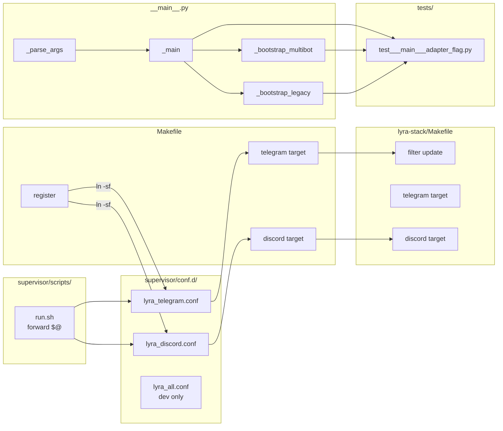

## Summary

Split `python -m lyra` into independently-restartable `lyra_telegram` and `lyra_discord`
supervisor processes by adding an `--adapter` CLI flag to `__main__.py`, creating two new
supervisor confs, and updating Makefiles on both local and lyra-stack.

---

## Architecture

```mermaid
flowchart TD
    subgraph "S1 — __main__.py change"
        ARGS[_parse_args\n--adapter flag]
        MAIN[_main\nadapter_filter]
        MULTIBOT[_bootstrap_multibot\ntg_multi_cfg / dc_multi_cfg]
        LEGACY[_bootstrap_legacy\ntg_auth / dc_auth]
        ARGS --> MAIN
        MAIN -->|filter dc_multi_cfg=[] or tg_multi_cfg=[]| MULTIBOT
        MAIN -->|skip AuthMiddleware.from_config| LEGACY
    end

    subgraph "S2 — Supervisor"
        RUNSH[run.sh\nexec ... -m lyra '\"$@\"']
        TG_CONF[lyra_telegram.conf\n--adapter telegram\nport 8443]
        DC_CONF[lyra_discord.conf\n--adapter discord\nport 8444]
        RUNSH --> TG_CONF
        RUNSH --> DC_CONF
    end

    subgraph "S3 — Makefiles"
        LYRA_MK[lyra/Makefile\ntelegram / discord targets\nregister update]
        STACK_MK[lyra-stack/Makefile\nfilter + telegram / discord targets]
    end

    subgraph "S4 — ADR"
        ADR[docs/architecture/adr/021-hub-per-adapter.mdx]
    end

    TG_CONF -->|supervisorctl| LYRA_MK
    DC_CONF -->|supervisorctl| LYRA_MK
    LYRA_MK --> STACK_MK
```



---

## Bootstrap Context

Reference patterns:
- `supervisor/conf.d/lyra.conf` — base supervisor conf to clone for new confs
- `Makefile` `lyra` target — pattern for `telegram`/`discord` targets (ifeq chain with `LYRA_CMD`)
- `~/projects/lyra-stack/Makefile` `stt`/`tts` targets — pattern for new service targets
- `src/lyra/__main__.py` `_main()` lines 965–1006 — entry point to add argparse to
- `src/lyra/__main__.py` `_bootstrap_multibot()` lines 400–693 — multibot filter point
- `src/lyra/__main__.py` `_bootstrap_legacy()` lines 695–962 — legacy filter point
- `docs/architecture/adr/020-cli-entry-point-dispatch-strategy.mdx` — ADR format reference

---

## Agents

| Agent | Tasks | Key files |
|-------|-------|-----------|
| backend-dev | 4 | `src/lyra/__main__.py` |
| devops | 8 | `supervisor/conf.d/`, `supervisor/scripts/run.sh`, `Makefile`, `lyra-stack/Makefile` |
| doc-writer | 2 | `docs/architecture/adr/021-hub-per-adapter.mdx` |
| tester | 3 | `tests/test___main___adapter_flag.py` |

---

## Consistency Report

| Metric | Value |
|--------|-------|
| Spec criteria covered | 27 / 27 |
| Slices covered | 5 / 5 (S1–S5) |
| Uncovered criteria | none |
| Untraced tasks | none |
| Exemptions | S5 (production provision) — documented as manual operational step; no automated test possible |

---

## Micro-Tasks

---

### S1 — `--adapter` flag in `__main__.py`

**RED-GATE S1**: All S1 tasks must pass before S2 begins.

---

#### T-S1-1 — Add `_parse_args()` to `__main__.py`

| Field | Value |
|-------|-------|
| **File** | `src/lyra/__main__.py` |
| **Agent** | backend-dev |
| **Phase** | GREEN |
| **Slice** | S1 |
| **Parallel-safe** | N (sequential with T-S1-2, T-S1-3) |
| **Time** | 5 min |
| **Difficulty** | 2 |
| **Spec trace** | SC: adapter-flag-1, SC: adapter-flag-4, SC: adapter-flag-5 |

Add `_parse_args()` function immediately above `_main()`:

```python
def _parse_args() -> argparse.Namespace:
    """Parse daemon startup arguments."""
    parser = argparse.ArgumentParser(
        description="Lyra daemon — start Telegram/Discord adapters",
        add_help=True,
    )
    parser.add_argument(
        "--adapter",
        choices=["telegram", "discord", "all"],
        default="all",
        help=(
            "Which adapter(s) to start. "
            "'telegram' starts only Telegram adapters, "
            "'discord' starts only Discord adapters, "
            "'all' starts both (default)."
        ),
    )
    return parser.parse_args()
```

Add `import argparse` at the top of the imports block.

**Verify:**
```bash
cd ~/projects/lyra && python -m lyra --adapter invalid 2>&1 | grep -q "invalid choice"
echo $?   # expected: 0
python -m lyra --help | grep -q "adapter"
echo $?   # expected: 0
```

---

#### T-S1-2 — Wire `--adapter` filter in `_main()` for multibot path

| Field | Value |
|-------|-------|
| **File** | `src/lyra/__main__.py` |
| **Agent** | backend-dev |
| **Phase** | GREEN |
| **Slice** | S1 |
| **Parallel-safe** | N |
| **Time** | 8 min |
| **Difficulty** | 3 |
| **Spec trace** | SC: adapter-flag-1, SC: adapter-flag-2, SC: adapter-flag-7 |

In `_main()`, call `_parse_args()` at the top and apply the filter **before** calling
`_bootstrap_multibot()`. The filter replaces the bots list in the config object so the
existing empty-adapter guard evaluates the post-filter state:

```python
async def _main(*, _stop: asyncio.Event | None = None) -> None:
    args = _parse_args()          # ← add at top of function
    load_dotenv()
    ...
    try:
        tg_multi_cfg, dc_multi_cfg = load_multibot_config(raw_config)
    except ValueError as exc:
        sys.exit(str(exc))

    # Apply adapter filter BEFORE bootstrap — guard at line 462 sees post-filter state
    if args.adapter == "telegram":
        dc_multi_cfg = DiscordMultiConfig(bots=[])
    elif args.adapter == "discord":
        tg_multi_cfg = TelegramMultiConfig(bots=[])

    use_multibot = bool(tg_multi_cfg.bots or dc_multi_cfg.bots)
    if use_multibot:
        await _bootstrap_multibot(...)
```

**Verify:**
```bash
cd ~/projects/lyra
# Start with telegram only — should see no "Registered Discord bot" in first 3 lines of log
timeout 3 python -m lyra --adapter telegram 2>&1 | grep -i "registered" || true
# Start with discord only — should see no "Registered Telegram bot"
timeout 3 python -m lyra --adapter discord 2>&1 | grep -i "registered" || true
```

---

#### T-S1-3 — Wire `--adapter` filter in `_main()` for legacy path

| Field | Value |
|-------|-------|
| **File** | `src/lyra/__main__.py` |
| **Agent** | backend-dev |
| **Phase** | GREEN |
| **Slice** | S1 |
| **Parallel-safe** | N |
| **Time** | 8 min |
| **Difficulty** | 3 |
| **Spec trace** | SC: adapter-flag-6 |

In `_bootstrap_legacy()`, add an `adapter` parameter and apply the filter before
`AuthMiddleware.from_config()` is called (lines 720–726). The filter must prevent
`sys.exit()` if the excluded platform's env vars are absent:

```python
async def _bootstrap_legacy(
    raw_config: dict,
    circuit_registry: CircuitRegistry,
    admin_user_ids: set[str],
    *,
    adapter: str = "all",       # ← new parameter
    _stop: asyncio.Event | None = None,
) -> None:
    ...
    try:
        tg_auth = (
            None
            if adapter == "discord"
            else AuthMiddleware.from_config(raw_config, "telegram", store=auth_store_legacy)
        )
        dc_auth = (
            None
            if adapter == "telegram"
            else AuthMiddleware.from_config(raw_config, "discord", store=auth_store_legacy)
        )
    except ValueError as exc:
        sys.exit(str(exc))
```

Also update `_main()` to pass `adapter=args.adapter` when calling `_bootstrap_legacy()`.

**Verify:**
```bash
cd ~/projects/lyra
# Legacy path is triggered when config has no [[telegram.bots]] arrays
# With a legacy-style config.toml and missing DISCORD_TOKEN:
DISCORD_BOT_TOKEN="" python -m lyra --adapter telegram 2>&1 | grep -v "discord" | head -5
# Expected: no sys.exit, no Discord-related error
```

---

#### T-S1-4 — Tests for `--adapter` flag behavior [P]

| Field | Value |
|-------|-------|
| **File** | `tests/test___main___adapter_flag.py` (new) |
| **Agent** | tester |
| **Phase** | GREEN |
| **Slice** | S1 |
| **Parallel-safe** | Y (after T-S1-1 is merged) |
| **Time** | 10 min |
| **Difficulty** | 3 |
| **Spec trace** | SC: adapter-flag-1 through SC: adapter-flag-7 |

Write unit tests covering:
- `_parse_args()` default → `adapter="all"`
- `_parse_args(["--adapter", "telegram"])` → `adapter="telegram"`
- `_parse_args(["--adapter", "invalid"])` → raises `SystemExit`
- `_main()` with `--adapter telegram` sets `dc_multi_cfg.bots = []` before bootstrap
- `_main()` with `--adapter discord` sets `tg_multi_cfg.bots = []` before bootstrap
- `_bootstrap_legacy()` with `adapter="telegram"` does not call `AuthMiddleware.from_config`
  for discord

Use `unittest.mock.patch` to mock `_bootstrap_multibot` and `_bootstrap_legacy` to capture
the config objects passed.

**Verify:**
```bash
cd ~/projects/lyra && uv run pytest tests/test___main___adapter_flag.py -v
# Expected: all tests pass
```

---

**RED-GATE S1 CHECK:**
```bash
uv run pytest tests/test___main___adapter_flag.py -v
timeout 5 python -m lyra --adapter telegram 2>&1 | grep -c "Registered Telegram bot" || true
timeout 5 python -m lyra --adapter discord 2>&1 | grep -c "Registered Telegram bot" | grep -q "^0$"
```

---

### S2 — Supervisor confs + `run.sh` + `register`

**RED-GATE S2**: S1 must pass before S2 begins.

---

#### T-S2-1 — Update `run.sh` to forward `$@`

| Field | Value |
|-------|-------|
| **File** | `supervisor/scripts/run.sh` |
| **Agent** | devops |
| **Phase** | GREEN |
| **Slice** | S2 |
| **Parallel-safe** | N (must ship with T-S2-2 and T-S2-3 atomically) |
| **Time** | 2 min |
| **Difficulty** | 1 |
| **Spec trace** | SC: supervisor-8, Expected Behavior: run.sh |

Change the last line of `run.sh`:

```bash
# Before:
exec "$HOME/projects/lyra/.venv/bin/python" -m lyra

# After:
exec "$HOME/projects/lyra/.venv/bin/python" -m lyra "$@"
```

**Verify:**
```bash
bash supervisor/scripts/run.sh --adapter telegram --help 2>&1 | grep -q "adapter"
echo $?  # expected: 0
```

---

#### T-S2-2 — Create `lyra_telegram.conf`

| Field | Value |
|-------|-------|
| **File** | `supervisor/conf.d/lyra_telegram.conf` (new) |
| **Agent** | devops |
| **Phase** | GREEN |
| **Slice** | S2 |
| **Parallel-safe** | Y (parallel with T-S2-3) |
| **Time** | 5 min |
| **Difficulty** | 2 |
| **Spec trace** | SC: supervisor-1, SC: supervisor-2, SC: supervisor-6, SC: health-1 |

```ini
[program:lyra_telegram]
command=%(ENV_HOME)s/projects/lyra/supervisor/scripts/run.sh --adapter telegram
directory=%(ENV_HOME)s/projects/lyra
environment=HOME="%(ENV_HOME)s",PATH="%(ENV_HOME)s/.local/bin:%(ENV_HOME)s/projects/lyra/.venv/bin:%(ENV_PATH)s",LYRA_HEALTH_PORT="8443"
autostart=true
autorestart=true
startsecs=5
startretries=3
stopwaitsecs=10
stopasgroup=true
killasgroup=true
stdout_logfile=%(ENV_HOME)s/projects/lyra/supervisor/logs/lyra_telegram.log
stdout_logfile_maxbytes=10MB
stdout_logfile_backups=3
stderr_logfile=%(ENV_HOME)s/projects/lyra/supervisor/logs/lyra_telegram_error.log
stderr_logfile_maxbytes=5MB
stderr_logfile_backups=3
```

**Verify:**
```bash
grep -q "LYRA_HEALTH_PORT=\"8443\"" supervisor/conf.d/lyra_telegram.conf
grep -q -- "--adapter telegram" supervisor/conf.d/lyra_telegram.conf
```

---

#### T-S2-3 — Create `lyra_discord.conf` [P]

| Field | Value |
|-------|-------|
| **File** | `supervisor/conf.d/lyra_discord.conf` (new) |
| **Agent** | devops |
| **Phase** | GREEN |
| **Slice** | S2 |
| **Parallel-safe** | Y (parallel with T-S2-2) |
| **Time** | 5 min |
| **Difficulty** | 2 |
| **Spec trace** | SC: supervisor-1, SC: supervisor-3, SC: supervisor-7, SC: health-2 |

```ini
[program:lyra_discord]
command=%(ENV_HOME)s/projects/lyra/supervisor/scripts/run.sh --adapter discord
directory=%(ENV_HOME)s/projects/lyra
environment=HOME="%(ENV_HOME)s",PATH="%(ENV_HOME)s/.local/bin:%(ENV_HOME)s/projects/lyra/.venv/bin:%(ENV_PATH)s",LYRA_HEALTH_PORT="8444"
autostart=true
autorestart=true
startsecs=5
startretries=3
stopwaitsecs=10
stopasgroup=true
killasgroup=true
stdout_logfile=%(ENV_HOME)s/projects/lyra/supervisor/logs/lyra_discord.log
stdout_logfile_maxbytes=10MB
stdout_logfile_backups=3
stderr_logfile=%(ENV_HOME)s/projects/lyra/supervisor/logs/lyra_discord_error.log
stderr_logfile_maxbytes=5MB
stderr_logfile_backups=3
```

**Verify:**
```bash
grep -q "LYRA_HEALTH_PORT=\"8444\"" supervisor/conf.d/lyra_discord.conf
grep -q -- "--adapter discord" supervisor/conf.d/lyra_discord.conf
```

---

#### T-S2-4 — Rename `lyra.conf` → `lyra_all.conf`

| Field | Value |
|-------|-------|
| **File** | `supervisor/conf.d/lyra.conf` → `supervisor/conf.d/lyra_all.conf` |
| **Agent** | devops |
| **Phase** | GREEN |
| **Slice** | S2 |
| **Parallel-safe** | N (coordinate with T-S2-5 register update) |
| **Time** | 2 min |
| **Difficulty** | 1 |
| **Spec trace** | Expected Behavior: lyra.conf retirement |

```bash
git mv supervisor/conf.d/lyra.conf supervisor/conf.d/lyra_all.conf
```

Update the `[program:lyra_all]` name in the renamed file header (optional dev convenience — not registered in prod).

**Verify:**
```bash
ls supervisor/conf.d/lyra.conf 2>/dev/null && echo "ERROR: old file still exists" || echo "OK"
ls supervisor/conf.d/lyra_all.conf && echo "OK"
```

---

#### T-S2-5 — Update `make register` target

| Field | Value |
|-------|-------|
| **File** | `Makefile` |
| **Agent** | devops |
| **Phase** | GREEN |
| **Slice** | S2 |
| **Parallel-safe** | N |
| **Time** | 5 min |
| **Difficulty** | 2 |
| **Spec trace** | SC: register-1, SC: register-2, SC: register-3 |

Replace the single `ln -sf` line in the `register` target with:

```makefile
register:
	@echo "Registering lyra with lyra-stack..."
	@if [ ! -d "$(LYRA_STACK_DIR)" ]; then \
		echo "Error: lyra-stack not found at $(LYRA_STACK_DIR)"; \
		echo "       Clone it or set LYRA_STACK_DIR=/path/to/lyra-stack"; \
		exit 1; \
	fi
	@mkdir -p "$(LYRA_STACK_DIR)/conf.d"
	@ln -sf "$(abspath supervisor/conf.d/lyra_telegram.conf)" "$(LYRA_STACK_DIR)/conf.d/lyra_telegram.conf"
	@ln -sf "$(abspath supervisor/conf.d/lyra_discord.conf)"  "$(LYRA_STACK_DIR)/conf.d/lyra_discord.conf"
	@if [ -L "$(LYRA_STACK_DIR)/conf.d/lyra.conf" ]; then rm "$(LYRA_STACK_DIR)/conf.d/lyra.conf"; fi
	@mkdir -p supervisor/logs
	@if [ -S "$(LYRA_STACK_DIR)/supervisor.sock" ]; then \
		$(SUPERVISORCTL) reread && $(SUPERVISORCTL) update; \
	fi
	@echo "Done. Run 'make telegram' and 'make discord' to start."
```

**Verify:**
```bash
make register
ls -la ~/projects/lyra-stack/conf.d/lyra_telegram.conf | grep -q "lyra_telegram.conf"
ls -la ~/projects/lyra-stack/conf.d/lyra_discord.conf  | grep -q "lyra_discord.conf"
ls ~/projects/lyra-stack/conf.d/lyra.conf 2>/dev/null && echo "ERROR: stale symlink present" || echo "OK"
make register  # second run — must be idempotent, no error
```

---

#### T-S2-6 — Verify health endpoints after supervisor start [P]

| Field | Value |
|-------|-------|
| **File** | n/a (integration verification) |
| **Agent** | tester |
| **Phase** | GREEN |
| **Slice** | S2 |
| **Parallel-safe** | Y (after T-S2-1 through T-S2-5 complete) |
| **Time** | 5 min |
| **Difficulty** | 2 |
| **Spec trace** | SC: supervisor-6, SC: supervisor-7, SC: health-1, SC: health-2 |

Start both processes and verify health endpoints:

```bash
make register
make telegram   # start lyra_telegram
make discord    # start lyra_discord
sleep 10        # wait for startsecs=5
curl -sf http://127.0.0.1:8443/health | python3 -c "import sys,json; d=json.load(sys.stdin); assert d['ok']==True"
curl -sf http://127.0.0.1:8444/health | python3 -c "import sys,json; d=json.load(sys.stdin); assert d['ok']==True"
echo "Both health endpoints OK"
```

---

### S3 — Makefile targets (lyra + lyra-stack)

**RED-GATE S3**: S2 must pass before S3 begins.

---

#### T-S3-1 — Add `telegram` target to lyra Makefile

| Field | Value |
|-------|-------|
| **File** | `Makefile` |
| **Agent** | devops |
| **Phase** | GREEN |
| **Slice** | S3 |
| **Parallel-safe** | N (same file as T-S3-2) |
| **Time** | 5 min |
| **Difficulty** | 2 |
| **Spec trace** | SC: supervisor-4, SC: supervisor-4a, SC: makefile-3 |

Add at the top of Makefile (before the `LYRA_STACK_DIR` line), mirroring the existing
`lyra` and `remote` ifeq blocks:

```makefile
ifeq (telegram,$(firstword $(MAKECMDGOALS)))
  TELEGRAM_CMD := $(wordlist 2,$(words $(MAKECMDGOALS)),$(MAKECMDGOALS))
  $(eval $(TELEGRAM_CMD):;@:)
endif
```

Add the `telegram` target body mirroring the `lyra` target with program name `lyra_telegram`:

```makefile
telegram:
ifeq ($(TELEGRAM_CMD),stop)
	$(ensure_hub)
	@$(SUPERVISORCTL) stop lyra_telegram
else ifeq ($(TELEGRAM_CMD),reload)
	$(ensure_hub)
	@$(SUPERVISORCTL) stop lyra_telegram
	@sleep 1
	@$(SUPERVISORCTL) start lyra_telegram
else ifeq ($(TELEGRAM_CMD),logs)
	$(ensure_hub)
	@$(SUPERVISORCTL) tail -f lyra_telegram
else ifeq ($(TELEGRAM_CMD),errors)
	$(ensure_hub)
	@$(SUPERVISORCTL) tail -f lyra_telegram stderr
else ifeq ($(TELEGRAM_CMD),status)
	$(ensure_hub)
	@$(SUPERVISORCTL) status lyra_telegram
else ifeq ($(TELEGRAM_CMD),)
	@$(SUPERVISOR_START)
	@$(SUPERVISORCTL) start lyra_telegram
else
	$(ensure_hub)
	@$(SUPERVISORCTL) $(TELEGRAM_CMD) lyra_telegram
endif
```

**Verify:**
```bash
make telegram status 2>&1 | grep -q "lyra_telegram"
```

---

#### T-S3-2 — Add `discord` target to lyra Makefile [P]

| Field | Value |
|-------|-------|
| **File** | `Makefile` |
| **Agent** | devops |
| **Phase** | GREEN |
| **Slice** | S3 |
| **Parallel-safe** | Y (after T-S3-1, same edit pass) |
| **Time** | 5 min |
| **Difficulty** | 2 |
| **Spec trace** | SC: supervisor-5, SC: supervisor-5a, SC: makefile-4 |

Add `discord` ifeq block at top (same location as `telegram` block):

```makefile
ifeq (discord,$(firstword $(MAKECMDGOALS)))
  DISCORD_CMD := $(wordlist 2,$(words $(MAKECMDGOALS)),$(MAKECMDGOALS))
  $(eval $(DISCORD_CMD):;@:)
endif
```

Add `discord` target body (symmetric with `telegram`, program name `lyra_discord`):

```makefile
discord:
# ... same pattern as telegram target, s/TELEGRAM_CMD/DISCORD_CMD/g, s/lyra_telegram/lyra_discord/g
```

**Verify:**
```bash
make discord status 2>&1 | grep -q "lyra_discord"
```

---

#### T-S3-3 — Update `.PHONY` in lyra Makefile

| Field | Value |
|-------|-------|
| **File** | `Makefile` |
| **Agent** | devops |
| **Phase** | GREEN |
| **Slice** | S3 |
| **Parallel-safe** | Y (same edit pass as T-S3-1/2) |
| **Time** | 1 min |
| **Difficulty** | 1 |
| **Spec trace** | SC: makefile-3 |

Change:
```makefile
# Before:
.PHONY: lyra register deploy remote test lint typecheck format

# After:
.PHONY: lyra telegram discord register deploy remote test lint typecheck format
```

**Verify:**
```bash
grep ".PHONY" Makefile | grep -q "telegram" && grep ".PHONY" Makefile | grep -q "discord"
echo $?  # expected: 0
```

---

#### T-S3-4 — Update lyra-stack Makefile (separate repo)

| Field | Value |
|-------|-------|
| **File** | `~/projects/lyra-stack/Makefile` |
| **Agent** | devops |
| **Phase** | GREEN |
| **Slice** | S3 |
| **Parallel-safe** | N |
| **Time** | 10 min |
| **Difficulty** | 3 |
| **Spec trace** | SC: global-1, SC: global-2, SC: makefile-4 |

> **Note:** `lyra-stack` is a separate git repository (`~/projects/lyra-stack`).
> Changes must be committed in that repo separately.

**Step 1 — Extend service name filter** (line ~15):
```makefile
# Before:
ifneq (,$(filter lyra stt tts,$(firstword $(MAKECMDGOALS))))

# After:
ifneq (,$(filter lyra stt tts telegram discord,$(firstword $(MAKECMDGOALS))))
```

**Step 2 — Add `telegram` target** (after `lyra:` target, before `stt:`):
```makefile
telegram:
	$(ensure_supervisor)
ifeq ($(SVC_CMD),reload)
	$(SUPERVISORCTL) restart lyra_telegram
else ifeq ($(SVC_CMD),logs)
	$(SUPERVISORCTL) tail -f lyra_telegram
else ifeq ($(SVC_CMD),errlogs)
	$(SUPERVISORCTL) tail -f lyra_telegram stderr
else ifeq ($(SVC_CMD),stop)
	$(SUPERVISORCTL) stop lyra_telegram
else ifeq ($(SVC_CMD),start)
	$(SUPERVISORCTL) start lyra_telegram
else
	$(SUPERVISORCTL) status lyra_telegram
endif
```

**Step 3 — Add `discord` target** (symmetric, maps to `lyra_discord`).

**Step 4 — Update `.PHONY`**:
```makefile
.PHONY: setup start stop status ps lyra stt tts telegram discord help
```

**Step 5 — Update help text**:
```makefile
	@echo "  telegram start|stop|reload|logs|errlogs|status"
	@echo "  discord  start|stop|reload|logs|errlogs|status"
```

**Verify:**
```bash
cd ~/projects/lyra-stack
make telegram status 2>&1 | grep -q "lyra_telegram"
make discord status 2>&1 | grep -q "lyra_discord"
```

---

### S4 — ADR

> Parallel with S1–S3.

---

#### T-S4-1 — Write ADR-021: hub-per-adapter model

| Field | Value |
|-------|-------|
| **File** | `docs/architecture/adr/021-hub-per-adapter.mdx` (new) |
| **Agent** | doc-writer |
| **Phase** | GREEN |
| **Slice** | S4 |
| **Parallel-safe** | Y |
| **Time** | 10 min |
| **Difficulty** | 2 |
| **Spec trace** | SC: adr-1, SC: adr-2 |

Follow the format of `docs/architecture/adr/020-cli-entry-point-dispatch-strategy.mdx`.
The ADR must document:

- **Decision:** each adapter process embeds its own Hub + agent pool
- **Status:** accepted
- **Context:** phase 1b tail nearly complete; process split is infra-only
- **Consequence:** cross-platform in-process state sharing is permanently eliminated.
  A future cross-platform feature (e.g., bridge Telegram ↔ Discord session) cannot use
  in-process state; it requires a shared backing store (e.g., SQLite `~/.lyra/sessions.db`)
  or Option B (hub-as-a-service, Unix socket IPC)
- **Upgrade path:** Option B is the named next step when N > 3 adapters or cross-platform
  bridging is required
- **Alternatives rejected:** Option B (hub service) — medium complexity, deferred;
  Option C (Redis) — overkill, new dependency

**Verify:**
```bash
ls docs/architecture/adr/021-hub-per-adapter.mdx
grep -q "cross-platform" docs/architecture/adr/021-hub-per-adapter.mdx
grep -q "Option B" docs/architecture/adr/021-hub-per-adapter.mdx
```

---

#### T-S4-2 — Update `meta.json` for new ADR

| Field | Value |
|-------|-------|
| **File** | `docs/architecture/adr/meta.json` |
| **Agent** | doc-writer |
| **Phase** | GREEN |
| **Slice** | S4 |
| **Parallel-safe** | Y |
| **Time** | 2 min |
| **Difficulty** | 1 |
| **Spec trace** | SC: adr-1 |

Add entry for ADR-021 to `meta.json` following the existing format.

---

### S5 — Production voiceCLI provisioning (parallel slice)

> Manual operational steps for Machine 1. No automated test possible.

---

#### T-S5-1 — Document voiceCLI provisioning steps

| Field | Value |
|-------|-------|
| **File** | `docs/GETTING-STARTED.md` or `lyra-stack/docs/supervisor-pattern.md` |
| **Agent** | doc-writer |
| **Phase** | GREEN |
| **Slice** | S5 |
| **Parallel-safe** | Y |
| **Time** | 8 min |
| **Difficulty** | 2 |
| **Spec trace** | SC: production-1, SC: production-2, SC: production-3 |

Add a "Production: Enable Voice Daemons" section:

```markdown
## Production: Enable Voice Daemons on Machine 1

1. SSH to Machine 1: `ssh mickael@192.168.1.16`
2. Clone voiceCLI: `cd ~/projects && git clone <voicecli-repo>`
3. Install: `cd voiceCLI && uv sync`
4. Validate env (no WSL vars): `grep -E "WSL_INTEROP|WSL_DISTRO_NAME|WSLENV" .env && echo "REMOVE WSL VARS" || echo "OK"`
5. Register: `make register` (creates symlinks in lyra-stack/conf.d/)
6. Start: `cd ~/projects/lyra-stack && make tts && make stt`
7. Verify: `make tts status && make stt status`
```

**Verify:**
```bash
grep -q "voicecli_tts" docs/GETTING-STARTED.md || grep -q "voicecli_tts" ~/projects/lyra-stack/docs/supervisor-pattern.md
```
