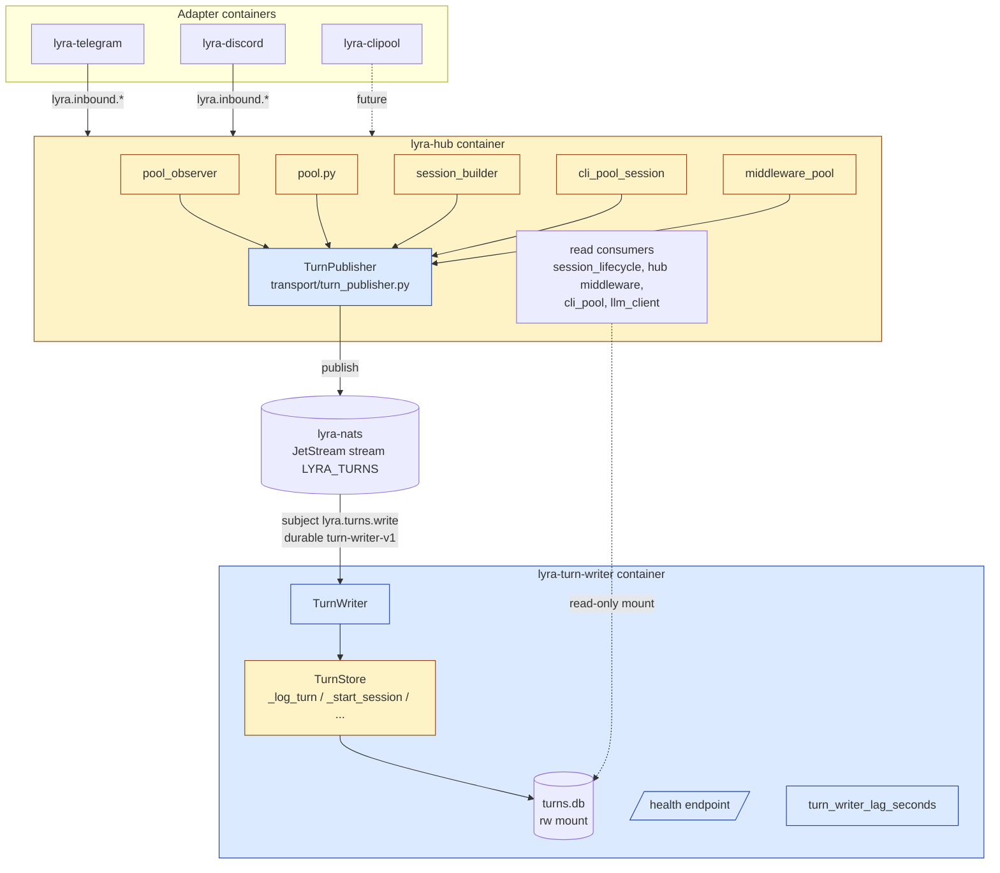
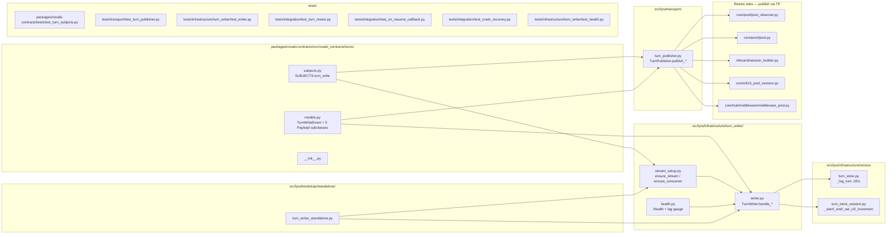

## Summary

Convert `TurnStore` mutators to publish `TurnWriteEvent` over `lyra.turns.write`; a single `TurnWriter` subscriber (Quadlet sibling `lyra-turn-writer.container`) consumes and persists. Slice 0 lands ADR-074 (governance), Slices 1–3 land contracts/publisher/writer/rewire, Slice 4 lands Quadlet + bind-mount swap, Slice 5 lands observability.

## Architecture

### Data flow

### File × function map

## Agents

| Instance | Tasks | Subject | Notes |
|---|---|---|---|
| doc-writer-A | T1, T32 | docs | ADR-074 + CLAUDE.md hygiene |
| backend-dev-A | T2, T3, T4, T5 | contracts | roxabi-contracts/turns/ package |
| backend-dev-B | T6, T7 | publisher | TurnPublisher transport wrapper |
| backend-dev-C | T8, T9, T10 | store | DDL + rename + test fix |
| backend-dev-D | T11, T12, T13, T14 | writer | TurnWriter + stream setup + RED-GATE |
| backend-dev-E | T15, T16, T17 | pool | pool_observer / pool / session_builder rewire |
| backend-dev-F | T18, T19, T20 | cli+middleware | cli_pool_session / middleware_pool rewire + grep RED-GATE |
| backend-dev-G | T28 | bootstrap | turn_writer_standalone + CLI subcommand |
| backend-dev-H | T30, T31 | observability | health endpoint + lag gauge + test |
| devops-A | T23, T26, T27 | quadlet | container units + hub mount swap + NATS auth |
| devops-B | T24, T25 | install-secrets | quadlet.toml + install.sh secret provisioning |
| tester-A | T21, T22, T29 | integration | cross-adapter + callback + crash-recovery RED-GATE |

## Wave Structure

8 waves, max 4 parallel instances. Elapsed ~2 days vs ~4 sequential.

| Wave | Trigger | Agents ∥ | Tasks |
|---|---|---|---|
| 1 | start | 4 ∥ | doc-writer-A: T1 · backend-dev-A: T2→T3→T4 · backend-dev-C: T8, T9 · backend-dev-D (deferred until W2 due to T11 dep on T4+T8+T9) |
| 2 | W1 done | 4 ∥ | backend-dev-A: T5 · backend-dev-B: T6 · backend-dev-C: T10 · backend-dev-D: T11→T12 |
| 3 | W2 done | 2 ∥ | backend-dev-B: T7 · backend-dev-D: T13 |
| 4 | W3 done | 1 | backend-dev-D: T14 RED-GATE |
| 5 | W4 done | 4 ∥ | backend-dev-E: T15→T16→T17 · backend-dev-F: T18→T19 · devops-A: T23, T26, T27 · devops-B: T24, T25 |
| 6 | W5 done | 2 ∥ | backend-dev-F: T20 RED-GATE · backend-dev-G: T28 |
| 7 | W6 done | 4 ∥ | tester-A: T21, T22 · tester-A: T29 RED-GATE · backend-dev-H: T30 |
| 8 | W7 done | 2 ∥ | backend-dev-H: T31 · doc-writer-A: T32 |

### Budget — per task

| Task | Items | Class | Est. ops |
|---|---|---|---|
| T1 ADR-074 | 1 ADR | judgmental | 5 |
| T2 contracts/__init__.py | 1 file | trivial | 1 |
| T3 subjects.py | 1 file + test pattern | bounded | 2 |
| T4 models.py (5 payloads + envelope) | 1 file | judgmental | 4 |
| T5 test_turn_subjects.py | 1 test file | bounded | 2 |
| T6 turn_publisher.py | 1 file | judgmental | 4 |
| T7 test_turn_publisher.py | 1 test file | bounded | 2 |
| T8 DDL migration | 2 schema changes | bounded | 3 |
| T9 rename 5 methods | 2 files | bounded | 3 |
| T10 update mocking tests | 2-3 files | judgmental | 5 |
| T11 writer.py (5 kind handlers) | 1 file | judgmental | 6 |
| T12 stream_setup.py | 1 file | bounded | 3 |
| T13 writer integration test | 1 file (8 cases) | judgmental | 6 |
| T14 RED-GATE Slice 2 | run pytest | trivial | 1 |
| T15 pool_observer rewire | 1 file | bounded | 3 |
| T16 pool.py rewire | 1 file | bounded | 3 |
| T17 session_builder rewire | 1 file | bounded | 3 |
| T18 cli_pool_session rewire | 1 file | bounded | 3 |
| T19 middleware_pool rewire | 1 file + await audit | judgmental | 5 |
| T20 RED-GATE grep | run grep | trivial | 2 |
| T21 cross-adapter integration test | 1 file | judgmental | 6 |
| T22 _on_resume_fn integration test | 1 file | judgmental | 5 |
| T23 lyra-turn-writer.container | 1 unit file | bounded | 3 |
| T24 quadlet.toml entry | 1 edit | trivial | 2 |
| T25 install.sh secret provisioning | 1 edit | bounded | 3 |
| T26 hub mount rw→ro | 1 edit | bounded | 3 |
| T27 NATS auth rule for turn-writer | 1 edit | bounded | 3 |
| T28 turn_writer_standalone + CLI | 1 file + cli wire | judgmental | 6 |
| T29 RED-GATE crash-recovery + lsof | 1 test file | judgmental | 6 |
| T30 health.py + lag gauge | 1 file | judgmental | 4 |
| T31 test_health.py | 1 test file | bounded | 2 |
| T32 CLAUDE.md updates | 2 files | bounded | 3 |

**Total estimated ops: 102**

### Budget — per agent instance

| Instance | Tasks | Σ ops | Subjects | Split? |
|---|---|---|---|---|
| doc-writer-A | T1, T32 | 8 | docs | — |
| backend-dev-A | T2, T3, T4, T5 | 9 | contracts | — |
| backend-dev-B | T6, T7 | 6 | publisher | — |
| backend-dev-C | T8, T9, T10 | 11 | store | — |
| backend-dev-D | T11, T12, T13, T14 | 16 | writer | — |
| backend-dev-E | T15, T16, T17 | 9 | pool | — |
| backend-dev-F | T18, T19, T20 | 10 | cli+middleware | — |
| backend-dev-G | T28 | 6 | bootstrap | — |
| backend-dev-H | T30, T31 | 6 | observability | — |
| devops-A | T23, T26, T27 | 9 | quadlet | — |
| devops-B | T24, T25 | 5 | install-secrets | — |
| tester-A | T21, T22, T29 | 17 | integration | — |

All within cap (|tasks| ≤ 4, Σops ≤ 50, subjects ≤ 2).

## Consistency Report

- **Spec criteria → tasks coverage:** 13/13 covered.
  - SC-1 (ADR-074 merged) → T1
  - SC-2 (grep enforces privatization) → T9, T20
  - SC-3 (subject literal + assertion test) → T3, T5
  - SC-4 (cross-adapter test) → T21
  - SC-5 (log_turn idempotence) → T13
  - SC-6 (increment_resume_count idempotence) → T13
  - SC-7 (start/end/set_cli idempotence) → T13
  - SC-8 (crash-recovery test) → T29
  - SC-9 (per-pool ordering) → T21
  - SC-10 (_on_resume_fn callback wiring) → T22
  - SC-11 (read API unchanged grep diff) → T20 (negative grep)
  - SC-12 (sole-writer lsof) → T29
  - SC-13 (writer observability) → T30, T31
- **Affordances → tasks:** A0→T1 · N1→T3 · N2,N3→T12 · S1→T2,T3,T4 · S2→T6 · S3→T11 · S4→T8 · S5→T15,T16 · S6→T17,T18,T19 · S7→T9,T10 · S8→T28,T23 · S9→T30
- **Out of scope (intentionally):** L2 stores, migration tooling, read-path changes, `lyra.*` subject renaming.

## Bootstrap Context

- **NATS infra**: `roxabi-nats` SDK (ADR-045), `roxabi-contracts` schemas (ADR-049). Stream/consumer creation pattern reference: `packages/roxabi-contracts/src/roxabi_contracts/voice/subjects.py` + `gh/subjects.py`.
- **Quadlet container pattern**: `deploy/quadlet/lyra-gh-helper.container` (BindsTo, ReadOnly, secret mount, NoNewPrivileges).
- **Manifest**: `deploy/quadlet.toml` `[component.*]` table; install via `deploy/install.sh`.
- **Existing TurnStore writes** (confirmed via grep): `pool_observer.py:106` (log_turn), `:83` (end_session), `pool.py:245` (start_session), `pool_processor_streaming.py:81`, `pool_processor_exec.py:244` (both via `pool._observer`), `session_builder.py:108` (start_session), `cli_pool_session.py:48` (set_cli_session), `middleware_pool.py:119` (increment_resume_count as callback ref).
- **Tests touching public mutators** (must update in T10): `tests/core/test_pool_observer.py` (mocks `store.log_turn`), `tests/core/test_middleware.py` (mocks `_turn_store.increment_resume_count`), grep for others in T10.

## Micro-Tasks

### Slice 0 — Governance

**T1 — Write ADR-074: TurnWriter subscriber-writer sublayer** *(doc-writer-A · judgmental · 5 ops)*
- File: `docs/architecture/adr/074-turn-writer-subscriber.mdx`
- Shape: standard ADR (Context, Decision, Consequences). Status `accepted`. Sections: (1) authorises `infrastructure/turn_writer/` subdir per `infrastructure/CLAUDE.md` Governance rule; (2) codifies future-split contract — only changes needed for Quadlet route are mount config + bootstrap variant, no domain-code change; (3) explicit reference to ADR-068 deviation + ADR-073 three-strikes prevention.
- Verify: `ls docs/architecture/adr/074-turn-writer-subscriber.mdx && grep -E "^status:\s*accepted" docs/architecture/adr/074-turn-writer-subscriber.mdx`
- Expected: file exists, frontmatter `status: accepted`
- Spec trace: SC-1, A0
- Slice: V0 · Phase: GREEN · Difficulty: 2

### Slice 1 — Contracts + Publisher

**T2 — Create roxabi_contracts/turns/ package** *(backend-dev-A · trivial · 1 op)*
- File: `packages/roxabi-contracts/src/roxabi_contracts/turns/__init__.py`
- Shape: re-export `SUBJECTS` and `TurnWriteEvent` + payload classes.
- Verify: `python -c "from roxabi_contracts.turns import SUBJECTS, TurnWriteEvent; print(SUBJECTS.turn_write)"`
- Expected: prints `lyra.turns.write`
- Spec trace: S1 · Slice: V1 · Phase: GREEN · Difficulty: 1

**T3 — Subjects literal** *(backend-dev-A · bounded · 2 ops)* `[P]`
- File: `packages/roxabi-contracts/src/roxabi_contracts/turns/subjects.py`
- Shape: mirrors `gh/subjects.py` — `@dataclass(frozen=True, slots=True)` with `turn_write: Literal["lyra.turns.write"]`. No dynamic helper needed (subject is static).
- Verify: `uv run pytest packages/roxabi-contracts/tests/test_turn_subjects.py -v` (after T5)
- Expected: subject assertion passes
- Spec trace: SC-3, N1, S1 · Slice: V1 · Phase: GREEN · Difficulty: 1

**T4 — Event + payload models** *(backend-dev-A · judgmental · 4 ops)* `[P]`
- File: `packages/roxabi-contracts/src/roxabi_contracts/turns/models.py`
- Shape: Pydantic `TurnWriteEvent` (envelope with `event_id: UUID4`, `kind: Literal[...]`, `pool_id`, `session_id`, `platform`, `user_id`, `timestamp`, `payload: Union[...] = Field(discriminator='kind')`). Payload subclasses: `LogTurnPayload` (role, content, message_id, reply_message_id, metadata), `StartSessionPayload` (empty), `EndSessionPayload` (empty), `SetCliSessionPayload` (cli_session_id), `IncrementResumeCountPayload` (target_count: int).
- Reference: `packages/roxabi-contracts/src/roxabi_contracts/voice/models.py` for Pydantic conventions.
- Verify: `uv run python -c "from roxabi_contracts.turns.models import TurnWriteEvent, LogTurnPayload; e = TurnWriteEvent(event_id='...', kind='log_turn', ...); print(e.payload.__class__.__name__)"`
- Expected: prints `LogTurnPayload`; discriminator round-trips
- Spec trace: S1 · Slice: V1 · Phase: GREEN · Difficulty: 3

**T5 — Subject assertion test** *(backend-dev-A · bounded · 2 ops)* `[P]`
- File: `packages/roxabi-contracts/tests/test_turn_subjects.py`
- Shape: mirrors `test_voice_subjects.py` — `assert SUBJECTS.turn_write == "lyra.turns.write"`.
- Verify: `uv run pytest packages/roxabi-contracts/tests/test_turn_subjects.py -v`
- Expected: 1 passed
- Spec trace: SC-3 · Slice: V1 · Phase: GREEN · Difficulty: 1

**T6 — TurnPublisher** *(backend-dev-B · judgmental · 4 ops)*
- File: `src/lyra/transport/turn_publisher.py`
- Shape: `class TurnPublisher` with one method per kind: `publish_log_turn(...)`, `publish_start_session(...)`, `publish_end_session(...)`, `publish_set_cli_session(...)`, `publish_increment_resume_count(target_count, ...)`. Each constructs a `TurnWriteEvent`, calls underlying `roxabi-nats` JetStream publish, **awaits `PubAck`** before returning. Constructor takes an `nc` (NATS connection) ref.
- Reference: `src/lyra/transport/nats_request_response.py` for JetStream usage patterns; `roxabi-nats` SDK README.
- Verify: import succeeds + see T7.
- Spec trace: S2 · Slice: V1 · Phase: GREEN · Difficulty: 3

**T7 — Publisher unit test** *(backend-dev-B · bounded · 2 ops)*
- File: `tests/transport/test_turn_publisher.py`
- Shape: mock JetStream context, verify each `publish_*` method emits to `lyra.turns.write` with correct payload shape, awaits `PubAck`.
- Verify: `uv run pytest tests/transport/test_turn_publisher.py -v`
- Expected: 5 passed (one per kind)
- Spec trace: S2 · Slice: V1 · Phase: GREEN · Difficulty: 2

### Slice 2 — DDL + Private Rename + Writer Service (atomic)

**T8 — Dedupe DDL migration** *(backend-dev-C · bounded · 3 ops)* `[P]`
- File: `src/lyra/infrastructure/stores/turn_store.py`
- Shape: in `connect()` after existing migrations, add two new idempotent DDL statements:
  - `CREATE UNIQUE INDEX IF NOT EXISTS idx_turns_dedupe ON conversation_turns(platform, message_id) WHERE message_id IS NOT NULL;`
  - `CREATE TABLE IF NOT EXISTS processed_events (event_id TEXT PRIMARY KEY, processed_at TEXT NOT NULL);`
- Verify: `uv run python -c "import asyncio; from lyra.infrastructure.stores.turn_store import TurnStore; ts=TurnStore('/tmp/test.db'); asyncio.run(ts.connect()); ts._db_or_raise()..."` + `sqlite3 /tmp/test.db ".indexes" | grep idx_turns_dedupe && sqlite3 /tmp/test.db ".tables" | grep processed_events`
- Expected: index + table created
- Spec trace: SC-5, S4 · Slice: V2 · Phase: GREEN · Difficulty: 2

**T9 — Privatize TurnStore mutators** *(backend-dev-C · bounded · 3 ops)* `[P]`
- Files: `src/lyra/infrastructure/stores/turn_store.py`, `src/lyra/infrastructure/stores/turn_store_session.py`
- Shape: rename public mutators to single-underscore: `log_turn` → `_log_turn`, `start_session` → `_start_session`, `end_session` → `_end_session`, `set_cli_session` → `_set_cli_session`, `increment_resume_count` → `_increment_resume_count`. Internal call references inside store modules also updated.
- Verify: `grep -rE "def (_)?(log_turn|start_session|end_session|set_cli_session|increment_resume_count)\(" src/lyra/infrastructure/stores/`
- Expected: only `_`-prefixed defs remain
- Spec trace: SC-2, S7 · Slice: V2 · Phase: REFACTOR · Difficulty: 2

**T10 — Update tests mocking public mutators** *(backend-dev-C · judgmental · 5 ops)*
- Files: `tests/core/test_pool_observer.py`, `tests/core/test_middleware.py`, + any others (`grep -rE "(_turn_store|turn_store|store)\.(log_turn|start_session|end_session|set_cli_session|increment_resume_count)" tests/`)
- Shape: replace `store.log_turn = AsyncMock(...)` with `store._log_turn = AsyncMock(...)`. Same for all 5 mutators. Tests that were verifying direct calls should now verify through the writer (those tests will likely move/morph in T13 — for this slice, just keep them passing on the rename).
- Verify: `uv run pytest tests/core/test_pool_observer.py tests/core/test_middleware.py -v`
- Expected: all pre-existing tests green
- Spec trace: SC-2 · Slice: V2 · Phase: REFACTOR · Difficulty: 3

**T11 — TurnWriter** *(backend-dev-D · judgmental · 6 ops)*
- Files: `src/lyra/infrastructure/turn_writer/__init__.py`, `src/lyra/infrastructure/turn_writer/writer.py`
- Shape: `class TurnWriter` constructed with `(turn_store: TurnStore, nc: NATSConnection)`. Method `start()` subscribes to `lyra.turns.write` via the durable consumer set up by `stream_setup.ensure_consumer()`. Per-message: deserialize `TurnWriteEvent`, dispatch by `kind` to a handler:
  - `log_turn`: `INSERT OR IGNORE` via `_log_turn` (UNIQUE constraint dedupes by `(platform, message_id)`)
  - `start_session`: `_start_session` (already INSERT OR IGNORE)
  - `end_session`: `_end_session` (idempotent via WHERE ended_at IS NULL)
  - `set_cli_session`: `_set_cli_session` (idempotent via INSERT OR REPLACE)
  - `increment_resume_count`: check `processed_events` for `event_id`; if absent, `UPDATE pool_sessions SET resume_count=max(resume_count, ?target_count) WHERE session_id=?` + `INSERT INTO processed_events(event_id, processed_at) VALUES (?, ?)` atomically; if present, no-op. Ack after success; nak after exception.
- Verify: import succeeds; see T13.
- Spec trace: SC-5, SC-6, SC-7, S3 · Slice: V2 · Phase: GREEN · Difficulty: 4

**T12 — Stream + consumer bootstrap** *(backend-dev-D · bounded · 3 ops)*
- File: `src/lyra/infrastructure/turn_writer/stream_setup.py`
- Shape: `async def ensure_stream(js)` creates `LYRA_TURNS` stream (subjects `lyra.turns.>`, retention `WorkQueue`, MaxAge=24h, MaxBytes=256MiB) idempotently. `async def ensure_consumer(js)` creates durable `turn-writer-v1` with queue group `turn-writer`, `AckExplicit`, `AckWait=60s`, `MaxDeliver=5`. Both safe to call on each writer boot.
- Verify: import + unit test with mock JetStream context.
- Spec trace: N2, N3 · Slice: V2 · Phase: GREEN · Difficulty: 2

**T13 — Writer integration test** *(backend-dev-D · judgmental · 6 ops)*
- File: `tests/infrastructure/turn_writer/test_writer.py`
- Shape: spin up in-process NATS (use `nats-server` test fixture if available, else `pytest-asyncio` + embedded NATS). 8 test cases covering each spec criterion:
  - publish 5 `log_turn` events (1 with duplicate msg_id) → 4 rows
  - publish 2 `start_session` events with same session_id → 1 row
  - publish 2 `end_session` events with same session_id → first sets ended_at, second is no-op
  - publish 2 `set_cli_session` events with same session_id (different cli_session_id) → last write wins (INSERT OR REPLACE)
  - publish 2 `increment_resume_count` with same `event_id` → counter incremented once
  - publish 2 `increment_resume_count` with same `target_count` but different `event_id` → counter ends at target_count
  - publish 10 mixed-pool events interleaved → per-pool order preserved (asserts via timestamps)
  - kill consumer mid-batch (5 unacked) + restart → 5 rows persisted, no dups
- Verify: `uv run pytest tests/infrastructure/turn_writer/test_writer.py -v`
- Expected: 8 passed
- Spec trace: SC-5, SC-6, SC-7, SC-8, SC-9 · Slice: V2 · Phase: RED-GATE · Difficulty: 4

**T14 — RED-GATE: Slice 2 green** *(backend-dev-D · trivial · 1 op)*
- Verify: `uv run pytest packages/roxabi-contracts/tests/test_turn_subjects.py tests/transport/ tests/infrastructure/turn_writer/ tests/core/test_pool_observer.py tests/core/test_middleware.py`
- Expected: 0 failures
- Spec trace: — · Slice: V2 · Phase: RED-GATE · Difficulty: 1

### Slice 3 — Rewire call-sites

**T15 — Rewire pool_observer** *(backend-dev-E · bounded · 3 ops)*
- File: `src/lyra/core/pool/pool_observer.py`
- Shape: `log_turn_async()` and `end_session_async()` now call `self._publisher.publish_log_turn(...)` / `publish_end_session(...)` instead of `await self._turn_store.log_turn(...)`. `register_turn_store` becomes `register_publisher(publisher: TurnPublisher)`. Wire `publisher` via bootstrap.
- Verify: `grep -n "_turn_store\|turn_store" src/lyra/core/pool/pool_observer.py | grep -vE "Optional|None|publisher"`
- Expected: no direct mutator calls remain
- Spec trace: SC-2, S5 · Slice: V3 · Phase: REFACTOR · Difficulty: 2

**T16 — Rewire pool.py** *(backend-dev-E · bounded · 3 ops)*
- File: `src/lyra/core/pool/pool.py:245`
- Shape: `await self._observer._turn_store.start_session(...)` → `await self._observer._publisher.publish_start_session(...)`. Also check `pool_processor_streaming.py` and `pool_processor_exec.py` for indirect calls — they call `pool._observer.end_session_async()` and `pool._observer.log_turn_async()` which already go through observer (T15 handles them).
- Verify: `grep -rnE "_turn_store\.(start_session|log_turn|end_session)" src/lyra/core/pool/`
- Expected: 0 matches
- Spec trace: SC-2, S5 · Slice: V3 · Phase: REFACTOR · Difficulty: 2

**T17 — Rewire session_builder** *(backend-dev-E · bounded · 3 ops)*
- File: `src/lyra/inbound/session_builder.py:108`
- Shape: `await _ts.start_session(...)` → `await _publisher.publish_start_session(...)`. Wire `_publisher` ref from bootstrap.
- Verify: `grep -nE "(\.|_)start_session\(" src/lyra/inbound/session_builder.py`
- Expected: only `publish_start_session(` matches
- Spec trace: SC-2, S6 · Slice: V3 · Phase: REFACTOR · Difficulty: 2

**T18 — Rewire cli_pool_session** *(backend-dev-F · bounded · 3 ops)* `[P]`
- File: `src/lyra/core/cli/cli_pool_session.py:48`
- Shape: `self._turn_store.set_cli_session(...)` → `await self._publisher.publish_set_cli_session(...)`. Note: read-after-write semantics analyzed in spec §7 — bounded by next inbound message, acceptable.
- Verify: `grep -nE "_turn_store\.set_cli_session\|set_cli_session" src/lyra/core/cli/cli_pool_session.py`
- Expected: only `publish_set_cli_session` matches
- Spec trace: SC-2, S6 · Slice: V3 · Phase: REFACTOR · Difficulty: 2

**T19 — Rewire middleware_pool _on_resume_fn** *(backend-dev-F · judgmental · 5 ops)*
- File: `src/lyra/core/hub/middleware/middleware_pool.py:119`
- Shape: `pool._on_resume_fn = ctx.hub._turn_store.increment_resume_count` → a new function wrapping `await ctx.hub._publisher.publish_increment_resume_count(session_id=..., target_count=current+1, event_id=uuid4())`. The call-site invoking `_on_resume_fn(session_id)` MUST `await` it (search for the invocation site — it may currently be sync). Audit and fix.
- Verify: `grep -rn "_on_resume_fn" src/lyra/` then read each call-site to confirm `await`.
- Expected: all call-sites await
- Spec trace: SC-10, S6 · Slice: V3 · Phase: REFACTOR · Difficulty: 3

**T20 — RED-GATE: grep clean** *(backend-dev-F · trivial · 2 ops)*
- Verify: `grep -rE "(_turn_store|turn_store)\.(log_turn|start_session|end_session|set_cli_session|increment_resume_count)" src/lyra/ --include='*.py'`
- Expected: matches only inside `src/lyra/infrastructure/turn_writer/`
- Also verify read-API unchanged: `grep -rlE "\.(get_turns|get_last_session|get_session_pool_id|get_cli_session|get_cli_session_by_pool|list_sessions)\(" src/lyra/ --include='*.py' | xargs git diff staging..HEAD --` → no mutation
- Spec trace: SC-2, SC-11 · Slice: V3 · Phase: RED-GATE · Difficulty: 1

**T21 — Cross-adapter integration test** *(tester-A · judgmental · 6 ops)*
- File: `tests/integration/test_turn_rewire.py`
- Shape: spin up hub with publisher wired + writer service. Simulate telegram inbound → publishes 3 `log_turn` events on `pool_A`. Simulate discord inbound → publishes 3 `log_turn` events on `pool_B`. Assert `turn_store.get_turns(pool_A)` returns 3 in order; same for `pool_B`. Assert per-pool ordering preserved across interleaved publishes (10+10).
- Verify: `uv run pytest tests/integration/test_turn_rewire.py -v`
- Expected: passes
- Spec trace: SC-4, SC-9 · Slice: V3 · Phase: RED-GATE · Difficulty: 3

**T22 — _on_resume_fn callback wiring test** *(tester-A · judgmental · 5 ops)*
- File: `tests/integration/test_on_resume_callback.py`
- Shape: trigger session resume via simulated inbound → assert `TurnWriteEvent{kind:'increment_resume_count', target_count: prev+1}` published on `lyra.turns.write` → assert `pool_sessions.resume_count` reflects increment after writer ack.
- Verify: `uv run pytest tests/integration/test_on_resume_callback.py -v`
- Expected: passes
- Spec trace: SC-10 · Slice: V3 · Phase: RED-GATE · Difficulty: 3

### Slice 4 — Quadlet sibling

**T23 — lyra-turn-writer.container** *(devops-A · bounded · 3 ops)*
- File: `deploy/quadlet/lyra-turn-writer.container`
- Shape: mirrors `lyra-discord.container` shape (Service with `Restart=on-failure RestartSec=10`, `ReadOnly=true`, `NoNewPrivileges=true`, `DropCapability=all`, `After=lyra-nats.service`). Image `ghcr.io/roxabi/lyra:staging`. Secret `lyra-nats-turn-writer` mounted at standard path. Bind-mount `~/.lyra/turns.db` rw. ExecStart `lyra turn-writer` (CLI subcommand from T28).
- Verify: `systemctl --user daemon-reload && systemctl --user cat lyra-turn-writer.service`
- Expected: unit parsed without error
- Spec trace: S8 · Slice: V4 · Phase: GREEN · Difficulty: 2

**T24 — quadlet.toml entry** *(devops-B · trivial · 2 ops)* `[P]`
- File: `deploy/quadlet.toml`
- Shape: add `[component.turn-writer]` table: `container = "lyra-turn-writer.container"`, `required_secrets = ["lyra-nats-turn-writer"]`, `host_roles = ["lyra-hub"]`.
- Verify: `grep -A3 "\[component\.turn-writer\]" deploy/quadlet.toml`
- Expected: entry present
- Spec trace: S8 · Slice: V4 · Phase: GREEN · Difficulty: 1

**T25 — install.sh secret provisioning** *(devops-B · bounded · 3 ops)*
- File: `deploy/install.sh`
- Shape: extend secret-provisioning loop to handle `lyra-nats-turn-writer` (nkey seed pattern same as `lyra-nats-hub`). Document creation step in script comment.
- Verify: `bash -n deploy/install.sh && grep "lyra-nats-turn-writer" deploy/install.sh`
- Expected: syntax OK, secret name referenced
- Spec trace: S8 · Slice: V4 · Phase: GREEN · Difficulty: 2

**T26 — Hub mount rw→ro** *(devops-A · bounded · 3 ops)*
- File: `deploy/quadlet/lyra-hub.container`
- Shape: change the bind-mount of `~/.lyra/turns.db` (or its parent dir) from `rw` to `ro`. Hub only reads `turns.db` post-refactor (`get_turns`, `get_last_session`, etc. are pure reads).
- Verify: `grep -E "turns\.db|\.lyra" deploy/quadlet/lyra-hub.container`
- Expected: `:ro` flag on the relevant mount
- Spec trace: SC-12, S8 · Slice: V4 · Phase: REFACTOR · Difficulty: 2

**T27 — NATS auth for turn-writer** *(devops-A · bounded · 3 ops)*
- File: `deploy/quadlet/lyra-nats.container` or its mounted nats config
- Shape: add NATS user `turn-writer` with publish permission on `_INBOX.>` and subscribe permission on `lyra.turns.>` (+ stream/consumer-create permissions for `LYRA_TURNS`). Pattern: same as existing `lyra-hub` user definition.
- Verify: `grep -A5 "turn-writer" deploy/quadlet/lyra-nats.container` (or the auth conf path)
- Expected: user with correct ACL present
- Spec trace: S8 · Slice: V4 · Phase: GREEN · Difficulty: 2

**T28 — Bootstrap entry + CLI** *(backend-dev-G · judgmental · 6 ops)*
- Files: `src/lyra/bootstrap/standalone/turn_writer_standalone.py`, `src/lyra/cli.py` (subcommand registration)
- Shape: `_bootstrap_turn_writer_standalone()` opens NATS connection, opens TurnStore (rw), calls `stream_setup.ensure_stream()` + `ensure_consumer()`, instantiates `TurnWriter`, calls `start()`, waits for shutdown signal. CLI subcommand `lyra turn-writer` invokes this.
- Verify: `uv run lyra turn-writer --help`
- Expected: subcommand registered and prints help
- Spec trace: S8 · Slice: V4 · Phase: GREEN · Difficulty: 4

**T29 — RED-GATE: crash-recovery + lsof** *(tester-A · judgmental · 6 ops)*
- File: `tests/integration/test_crash_recovery.py`
- Shape: deploy writer Quadlet (or in-test simulation) + spin up hub. Publish 5 events. Kill writer process. Wait < AckWait=60s. Restart writer. Assert all 5 events persisted in DB exactly once. Then verify sole-writer via `subprocess.run(['lsof', os.path.expanduser('~/.lyra/turns.db')])` and grep for `w` mode count == 1.
- Verify: `uv run pytest tests/integration/test_crash_recovery.py -v`
- Expected: passes
- Spec trace: SC-8, SC-12 · Slice: V4 · Phase: RED-GATE · Difficulty: 4

### Slice 5 — Observability

**T30 — Health endpoint + lag gauge** *(backend-dev-H · judgmental · 4 ops)*
- File: `src/lyra/infrastructure/turn_writer/health.py`
- Shape: tiny FastAPI/Starlette app exposing `GET /health` (returns 200 if writer task is alive + NATS connected + DB connected) and `GET /metrics` (Prometheus-format `turn_writer_lag_seconds` gauge = `now - oldest_pending_event_timestamp`). Wire into `turn_writer_standalone.py` to start the HTTP server on a port from env `LYRA_TURN_WRITER_HEALTH_PORT` (default 8083).
- Verify: `uv run lyra turn-writer &` then `curl localhost:8083/health`
- Expected: 200 OK
- Spec trace: SC-13, S9 · Slice: V5 · Phase: GREEN · Difficulty: 3

**T31 — Health + gauge test** *(backend-dev-H · bounded · 2 ops)* `[P]`
- File: `tests/infrastructure/turn_writer/test_health.py`
- Shape: start writer in test fixture, GET /health → 200, GET /metrics → contains `turn_writer_lag_seconds`. Publish event, advance time, assert lag value reflects.
- Verify: `uv run pytest tests/infrastructure/turn_writer/test_health.py -v`
- Expected: passes
- Spec trace: SC-13 · Slice: V5 · Phase: GREEN · Difficulty: 2

### Hygiene

**T32 — CLAUDE.md updates** *(doc-writer-A · bounded · 3 ops)*
- Files: `src/lyra/infrastructure/CLAUDE.md` (register new `turn_writer/` subdir with its invariants), `CLAUDE.md` (root: add `src/lyra/infrastructure/turn_writer/CLAUDE.md` to the Key files table)
- Shape: per `CLAUDE.md hygiene` rule (`File/rename → update P immediately`).
- Verify: `grep -q "turn_writer" CLAUDE.md && grep -q "turn_writer" src/lyra/infrastructure/CLAUDE.md`
- Expected: both grep succeed
- Spec trace: — · Slice: Hygiene · Phase: REFACTOR · Difficulty: 1

## Task Seeding Blueprint

<!-- Used by /implement to seed TaskCreate calls on session start.
     Format: T{n} | agent-instance | blockedBy | subject
     blockedBy refs T-numbers within this list (not session task IDs). -->

### Wave 1 — no deps, 4 ∥

| Task | Agent instance | blockedBy | Subject |
|------|---------------|-----------|---------|
| T1 | doc-writer-A | — | docs |
| T2 | backend-dev-A | — | contracts |
| T3 | backend-dev-A | T2 | contracts |
| T4 | backend-dev-A | T2 | contracts |
| T8 | backend-dev-C | — | store |
| T9 | backend-dev-C | — | store |

### Wave 2 — after Wave 1, 4 ∥

| Task | Agent instance | blockedBy | Subject |
|------|---------------|-----------|---------|
| T5 | backend-dev-A | T3 | contracts |
| T6 | backend-dev-B | T3, T4 | publisher |
| T10 | backend-dev-C | T9 | store |
| T11 | backend-dev-D | T4, T8, T9 | writer |
| T12 | backend-dev-D | T3 | writer |

### Wave 3 — after Wave 2, 2 ∥

| Task | Agent instance | blockedBy | Subject |
|------|---------------|-----------|---------|
| T7 | backend-dev-B | T6 | publisher |
| T13 | backend-dev-D | T11, T12 | writer |

### Wave 4 — after Wave 3, 1

| Task | Agent instance | blockedBy | Subject |
|------|---------------|-----------|---------|
| T14 | backend-dev-D | T13, T7, T5, T10 | writer |

### Wave 5 — after Wave 4, 4 ∥

| Task | Agent instance | blockedBy | Subject |
|------|---------------|-----------|---------|
| T15 | backend-dev-E | T6, T9 | pool |
| T16 | backend-dev-E | T15 | pool |
| T17 | backend-dev-E | T6 | pool |
| T18 | backend-dev-F | T6 | cli+middleware |
| T19 | backend-dev-F | T6 | cli+middleware |
| T23 | devops-A | T1 | quadlet |
| T26 | devops-A | T23 | quadlet |
| T27 | devops-A | T23 | quadlet |
| T24 | devops-B | T1 | install-secrets |
| T25 | devops-B | T1 | install-secrets |

### Wave 6 — after Wave 5, 2 ∥

| Task | Agent instance | blockedBy | Subject |
|------|---------------|-----------|---------|
| T20 | backend-dev-F | T15, T16, T17, T18, T19 | cli+middleware |
| T28 | backend-dev-G | T11, T12, T24, T25 | bootstrap |

### Wave 7 — after Wave 6, 4 ∥

| Task | Agent instance | blockedBy | Subject |
|------|---------------|-----------|---------|
| T21 | tester-A | T20 | integration |
| T22 | tester-A | T19, T20 | integration |
| T29 | tester-A | T28, T26, T23 | integration |
| T30 | backend-dev-H | T11, T28 | observability |

### Wave 8 — after Wave 7, 2 ∥

| Task | Agent instance | blockedBy | Subject |
|------|---------------|-----------|---------|
| T31 | backend-dev-H | T30 | observability |
| T32 | doc-writer-A | T11 | docs |

## Task IDs

<!-- Generated by /plan Step 6b. /implement uses this to resume across sessions. -->
- T1: 13 — docs (ADR-074)
- T2: 14 — contracts (package init)
- T3: 15 — contracts (subjects)
- T4: 16 — contracts (models)
- T5: 17 — contracts (subject test)
- T6: 18 — publisher (TurnPublisher)
- T7: 19 — publisher (test)
- T8: 20 — store (DDL)
- T9: 21 — store (rename)
- T10: 22 — store (test mock updates)
- T11: 23 — writer (TurnWriter)
- T12: 24 — writer (stream/consumer bootstrap)
- T13: 25 — writer (integration test)
- T14: 26 — writer (RED-GATE Slice 2)
- T15: 27 — pool (pool_observer rewire)
- T16: 28 — pool (pool.py rewire)
- T17: 29 — pool (session_builder rewire)
- T18: 30 — cli+middleware (cli_pool_session rewire)
- T19: 31 — cli+middleware (middleware_pool rewire)
- T20: 32 — cli+middleware (RED-GATE grep)
- T21: 33 — integration (cross-adapter test)
- T22: 34 — integration (_on_resume_fn test)
- T23: 35 — quadlet (lyra-turn-writer.container)
- T24: 36 — install-secrets (quadlet.toml entry)
- T25: 37 — install-secrets (install.sh secret)
- T26: 38 — quadlet (hub mount ro)
- T27: 39 — quadlet (NATS ACL)
- T28: 40 — bootstrap (turn-writer CLI + standalone)
- T29: 41 — integration (RED-GATE crash-recovery + lsof)
- T30: 42 — observability (health + lag gauge)
- T31: 43 — observability (test)
- T32: 44 — docs (CLAUDE.md hygiene)
