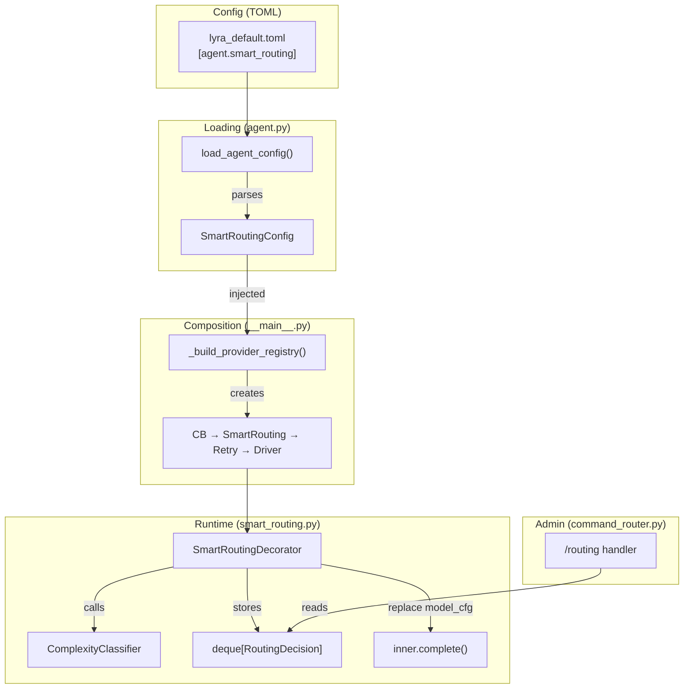
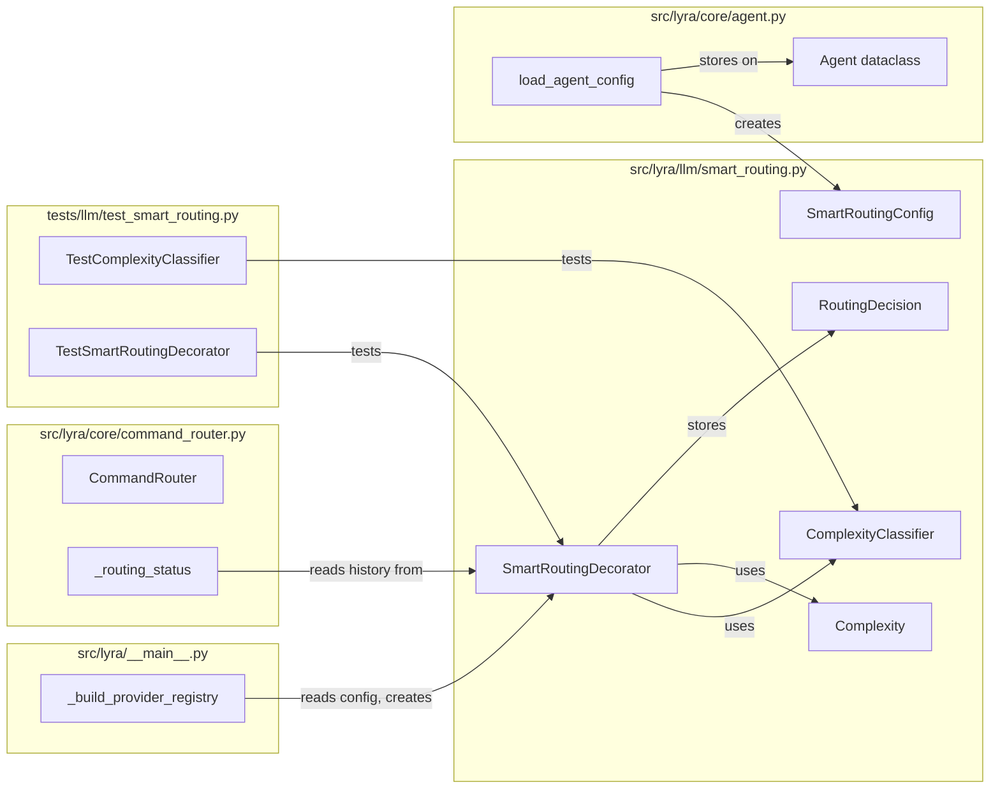

## Summary

Implement a `SmartRoutingDecorator` that classifies message complexity via heuristics and routes to the cheapest model capable of handling it. Add `/routing` admin command for observability. 6 files (2 new, 4 modified), 2 slices.

## Architecture





## Agents

| Agent | Tasks | Files |
|-------|-------|-------|
| backend-dev | 9 | `smart_routing.py`, `agent.py`, `__main__.py`, `command_router.py`, `lyra_default.toml`, `test_smart_routing.py` |

## Consistency Report

| Metric | Value |
|--------|-------|
| Success criteria covered | 12/12 |
| Uncovered | 0 |
| Untraced tasks | 0 |

## Micro-Tasks

### Slice 1 — Classifier + Decorator Core

#### T1. Create Complexity enum and RoutingDecision dataclass [P]
- **File:** `src/lyra/llm/smart_routing.py` (NEW)
- **Code snippet:**
  ```python
  class Complexity(Enum):
      TRIVIAL = "trivial"
      SIMPLE = "simple"
      MODERATE = "moderate"
      COMPLEX = "complex"

  @dataclass(frozen=True)
  class RoutingDecision:
      complexity: Complexity
      original_model: str
      routed_model: str
      reason: str
      timestamp: float
      message_preview: str
  ```
- **Verify:** `uv run python -c "from lyra.llm.smart_routing import Complexity, RoutingDecision; print('ok')"`
- **Expected output:** `ok`
- **Spec trace:** SC-1, SC-7
- **Phase:** RED
- **Difficulty:** 1

#### T2. Implement ComplexityClassifier with heuristic rules [P]
- **File:** `src/lyra/llm/smart_routing.py`
- **Code snippet:**
  ```python
  class ComplexityClassifier:
      def classify(self, text: str) -> tuple[Complexity, str]:
          # Heuristics: token count, question markers, keyword signals
          ...
  ```
- **Heuristic rules:**
  - TRIVIAL: ≤5 words, greetings, yes/no, single emoji
  - SIMPLE: ≤20 words, direct factual questions, simple commands
  - MODERATE: 20–100 words, multi-part questions, "explain", "summarize"
  - COMPLEX: >100 words OR code keywords OR "analyze", "compare", "design"
- **Verify:** `uv run python -c "from lyra.llm.smart_routing import ComplexityClassifier, Complexity; c = ComplexityClassifier(); assert c.classify('hello')[0] == Complexity.TRIVIAL; assert c.classify('Explain the decorator pattern in Python with examples and edge cases')[0] in (Complexity.MODERATE, Complexity.COMPLEX); print('ok')"`
- **Expected output:** `ok`
- **Spec trace:** SC-2
- **Phase:** RED
- **Difficulty:** 3

#### T3. Implement SmartRoutingConfig dataclass [P]
- **File:** `src/lyra/llm/smart_routing.py`
- **Code snippet:**
  ```python
  @dataclass(frozen=True)
  class SmartRoutingConfig:
      enabled: bool = False
      routing_table: dict[Complexity, str] = field(default_factory=dict)
      history_size: int = 50
  ```
- **Verify:** `uv run python -c "from lyra.llm.smart_routing import SmartRoutingConfig; c = SmartRoutingConfig(); assert c.enabled is False; print('ok')"`
- **Expected output:** `ok`
- **Spec trace:** SC-4, SC-6
- **Phase:** RED
- **Difficulty:** 1

#### T4. Implement SmartRoutingDecorator
- **File:** `src/lyra/llm/smart_routing.py`
- **Depends on:** T1, T2, T3
- **Code snippet:**
  ```python
  class SmartRoutingDecorator:
      def __init__(self, inner: LlmProvider, config: SmartRoutingConfig,
                   classifier: ComplexityClassifier | None = None) -> None:
          self._inner = inner
          self._config = config
          self._classifier = classifier or ComplexityClassifier()
          self._history: deque[RoutingDecision] = deque(maxlen=config.history_size)
          self.capabilities: dict = inner.capabilities

      async def complete(self, pool_id, text, model_cfg, system_prompt, *, messages=None):
          if not self._config.enabled:
              return await self._inner.complete(...)
          try:
              complexity, reason = self._classifier.classify(text)
              target = self._config.routing_table.get(complexity, model_cfg.model)
              routed_cfg = dataclasses.replace(model_cfg, model=target)
          except Exception:
              log.warning("Classifier failed, falling back to default model")
              routed_cfg = model_cfg
              ...
          result = await self._inner.complete(..., model_cfg=routed_cfg, ...)
          # store RoutingDecision in self._history
          return result
  ```
- **Verify:** `uv run python -c "from lyra.llm.smart_routing import SmartRoutingDecorator; print('ok')"`
- **Expected output:** `ok`
- **Spec trace:** SC-3, SC-4, SC-5, SC-7, SC-9, SC-10, SC-11
- **Phase:** RED
- **Difficulty:** 3

#### T5. Parse `[agent.smart_routing]` in load_agent_config
- **File:** `src/lyra/core/agent.py`
- **Depends on:** T3
- **Changes:**
  - Import `SmartRoutingConfig`, `Complexity` from `lyra.llm.smart_routing`
  - Add `smart_routing: SmartRoutingConfig | None = None` field to `Agent` dataclass
  - In `load_agent_config()`: parse `data.get("agent", {}).get("smart_routing", {})` → build `SmartRoutingConfig`
  - Map TOML keys (`trivial`, `simple`, `moderate`, `complex`) to `Complexity` enum
- **Verify:** `uv run python -c "from lyra.core.agent import load_agent_config; print('ok')"`
- **Expected output:** `ok`
- **Spec trace:** SC-6
- **Phase:** GREEN
- **Difficulty:** 2

#### T6. Insert SmartRoutingDecorator into provider stack
- **File:** `src/lyra/__main__.py`
- **Depends on:** T4, T5
- **Changes:**
  - In `_build_provider_registry()`: accept `smart_routing_config` param
  - After creating `retry`, before wrapping with CB: `if smart_routing_config: provider = SmartRoutingDecorator(retry, smart_routing_config)`
  - Stack becomes: `CB → SmartRouting → Retry → Driver`
  - Store SmartRoutingDecorator reference for `/routing` command access
- **Verify:** `uv run pytest tests/llm/test_smart_routing.py -x -q`
- **Spec trace:** SC-9
- **Phase:** GREEN
- **Difficulty:** 2

#### T7. Write unit tests for classifier and decorator
- **File:** `tests/llm/test_smart_routing.py` (NEW)
- **Depends on:** T4
- **Test cases:**
  - `TestComplexityClassifier`:
    - `test_trivial_greeting` — "hello" → TRIVIAL
    - `test_trivial_yes_no` — "yes" → TRIVIAL
    - `test_simple_factual` — "What time is it?" → SIMPLE
    - `test_moderate_explain` — "Explain the decorator pattern in detail" → MODERATE
    - `test_complex_long_text` — 150+ word message → COMPLEX
    - `test_complex_code_keywords` — "Write a Python function that..." → COMPLEX
  - `TestSmartRoutingDecorator`:
    - `test_disabled_passthrough` — enabled=False → inner called with original model_cfg
    - `test_routes_trivial_to_haiku` — enabled=True, trivial text → model_cfg.model == haiku
    - `test_routes_complex_to_sonnet` — enabled=True, complex text → model_cfg.model == sonnet
    - `test_model_cfg_not_mutated` — original model_cfg unchanged after routing
    - `test_classifier_exception_fallback` — classifier raises → original model used
    - `test_history_stored` — after complete(), history deque has 1 entry
    - `test_history_capped` — history_size=2 → deque never exceeds 2
    - `test_capabilities_forwarded` — decorator.capabilities == inner.capabilities
- **Verify:** `uv run pytest tests/llm/test_smart_routing.py -x -q`
- **Expected output:** all tests pass
- **Spec trace:** SC-12
- **Phase:** RED → GREEN
- **Difficulty:** 3

---
**RED-GATE V1:** `uv run pytest tests/llm/test_smart_routing.py -x -q` — all tests pass before proceeding to Slice 2.

---

### Slice 2 — Admin Command + Config

#### T8. Add `/routing` builtin command to CommandRouter
- **File:** `src/lyra/core/command_router.py`
- **Changes:**
  - Add `/routing` to `_DEFAULT_BUILTINS` dict
  - Accept `smart_routing_decorator: SmartRoutingDecorator | None = None` in `__init__`
  - Add `_routing_status(msg)` method (admin-only, reads `self._smart_routing._history`)
  - Format: table with complexity, original→routed model, message preview (truncated 40 chars), timestamp
  - Add dispatch case for `/routing`
- **Verify:** `uv run pytest tests/ -k "routing" -x -q`
- **Spec trace:** SC-8
- **Phase:** GREEN
- **Difficulty:** 2

#### T9. Add smart_routing config to lyra_default.toml
- **File:** `src/lyra/agents/lyra_default.toml`
- **Changes:**
  ```toml
  [agent.smart_routing]
  enabled = false

  [agent.smart_routing.models]
  trivial  = "claude-haiku-4-5-20251001"
  simple   = "claude-haiku-4-5-20251001"
  moderate = "claude-sonnet-4-6"
  complex  = "claude-sonnet-4-6"
  ```
- **Verify:** `uv run python -c "from lyra.core.agent import load_agent_config; a = load_agent_config('lyra_default'); print(a.smart_routing)"`
- **Spec trace:** SC-6
- **Phase:** GREEN
- **Difficulty:** 1
