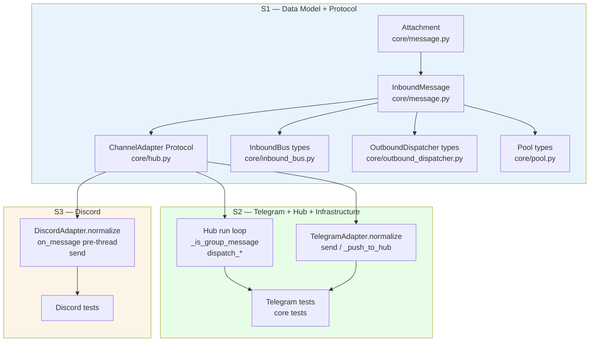
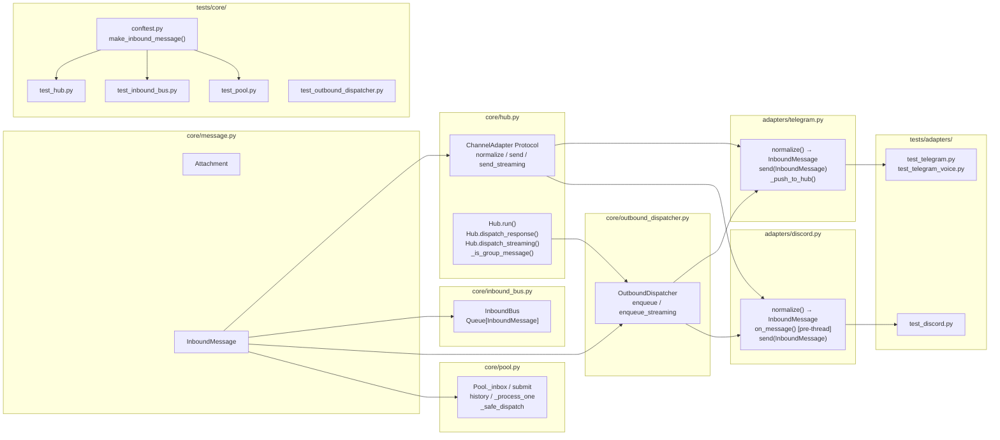

## Summary

Migrate the inbound message contract from `Message` (mutable, platform-specific contexts) to `InboundMessage` (frozen, platform-agnostic) across the full stack: data model, Protocol, bus, hub, dispatcher, pool, and both adapters. Wide type propagation across ~14 files; core logic is straightforward, main risk is the Discord auto-thread ordering change.

## Architecture





## Agents

| Agent | Tasks | Files |
|---|---|---|
| backend-dev | T1.1–T1.6, T2.1–T2.4, T3.1–T3.2 | `core/message.py`, `core/hub.py`, `core/inbound_bus.py`, `core/outbound_dispatcher.py`, `core/pool.py`, `adapters/telegram.py`, `adapters/discord.py` |
| tester | T2.5–T2.8, T3.3–T3.4 | `tests/core/conftest.py`, `tests/core/test_hub.py`, `tests/core/test_inbound_bus.py`, `tests/core/test_pool.py`, `tests/core/test_outbound_dispatcher.py`, `tests/adapters/test_telegram.py`, `tests/adapters/test_discord.py` |

## Consistency Report

| Check | Result |
|---|---|
| Breadboard nodes covered | 11/11 (N1–N11) |
| Success criteria traced | 7/7 (SC-1 → SC-7) |
| Uncovered breadboard | none |
| Untraced criteria | none |
| Exemptions | `test_extract_scope.py` — tests `Message.extract_scope_id()` which stays in place; no change needed |

---

## Micro-Tasks

---

### Slice S1 — Data model + Protocol

---

#### T1.1 — Define `Attachment` frozen dataclass [RED]

**Agent:** backend-dev | **Difficulty:** 1 | **Time:** 3 min | **[P]** after T1.0 | **Spec trace:** SC-2, N2

**File:** `src/lyra/core/message.py`

**Description:** Add `Attachment` frozen dataclass after the `MessageContent` type alias.

```python
@dataclass(frozen=True)
class Attachment:
    """A file or media attachment on an InboundMessage."""
    type: str                      # "image" | "audio" | "video" | "file"
    url_or_bytes: str | bytes      # URL string or raw bytes
    mime_type: str
    filename: str | None = None
```

**Verify:** `uv run python -c "from lyra.core.message import Attachment; a = Attachment(type='image', url_or_bytes='http://x', mime_type='image/png'); assert a.filename is None"`
**Expected:** no error

---

#### T1.2 — Define `InboundMessage` frozen dataclass [RED]

**Agent:** backend-dev | **Difficulty:** 2 | **Time:** 5 min | **Depends:** T1.1 | **Spec trace:** SC-1, N1

**File:** `src/lyra/core/message.py`

**Description:** Add `InboundMessage` frozen dataclass. Keep existing `Message` class in place — tests will be migrated incrementally. Add `InboundMessage` to module exports.

```python
@dataclass(frozen=True)
class InboundMessage:
    """Normalized inbound envelope. All adapters must produce this type.

    platform_meta carries platform-specific routing fields needed by send().
    See spec §platform_meta required keys table.
    Security: trust is always 'user' — never set by callers above the adapter layer.
    """
    id: str
    platform: str                       # "telegram" | "discord" | ...
    bot_id: str
    scope_id: str                       # canonical routing scope (computed by adapter)
    user_id: str
    user_name: str
    is_mention: bool
    text: str                           # normalized plain text (markup stripped)
    text_raw: str                       # original text with platform-specific markup
    attachments: list[Attachment] = field(default_factory=list)
    reply_to_id: str | None = None
    thread_id: str | None = None
    timestamp: datetime = field(default_factory=lambda: datetime.now(timezone.utc))
    locale: str | None = None
    trust: Literal["user", "system"] = "user"
    platform_meta: dict = field(default_factory=dict)
```

**Verify:** `uv run python -c "from lyra.core.message import InboundMessage; m = InboundMessage(id='x', platform='telegram', bot_id='main', scope_id='chat:1', user_id='u', user_name='Alice', is_mention=False, text='hi', text_raw='hi'); print(m.trust)"`
**Expected:** `user`

---

#### T1.3 — Add `normalize()` to `ChannelAdapter` Protocol; update `send/send_streaming` signatures [RED]

**Agent:** backend-dev | **Difficulty:** 2 | **Time:** 4 min | **Depends:** T1.2 | **[P]** with T1.4–T1.6 | **Spec trace:** SC-3, N3, N4

**File:** `src/lyra/core/hub.py`

**Description:** Update `ChannelAdapter` Protocol: add `normalize()`, change `send/send_streaming` to accept `InboundMessage`. Update imports.

```python
from .message import InboundMessage, Response  # add InboundMessage

class ChannelAdapter(Protocol):
    def normalize(self, raw: Any) -> InboundMessage: ...

    async def send(self, original_msg: InboundMessage, response: Response) -> None: ...

    async def send_streaming(
        self, original_msg: InboundMessage, chunks: AsyncIterator[str]
    ) -> None: ...
```

Remove `Message` from hub.py imports (unless still used by `_is_group_message` — will be removed in T2.1).

**Verify:** `uv run pyright src/lyra/core/hub.py 2>&1 | head -20`
**Expected:** 0 errors in hub.py (adapters will fail until T2/T3)

---

#### T1.4 — Update `InboundBus` type annotations [RED]

**Agent:** backend-dev | **Difficulty:** 1 | **Time:** 3 min | **Depends:** T1.2 | **[P]** with T1.3, T1.5, T1.6 | **Spec trace:** N7

**File:** `src/lyra/core/inbound_bus.py`

**Description:** Replace `Message` with `InboundMessage` throughout. Update imports.

```python
from .message import InboundMessage, Platform  # remove Message

class InboundBus:
    def __init__(self) -> None:
        self._queues: dict[Platform, asyncio.Queue[InboundMessage]] = {}
        self._staging: asyncio.Queue[InboundMessage] = asyncio.Queue()

    def put(self, platform: Platform, msg: InboundMessage) -> None: ...

    async def get(self) -> InboundMessage: ...

    async def _feeder(self, platform: Platform, queue: asyncio.Queue[InboundMessage]) -> None: ...
```

**Verify:** `uv run pyright src/lyra/core/inbound_bus.py 2>&1 | head -10`
**Expected:** 0 errors

---

#### T1.5 — Update `OutboundDispatcher` type annotations [RED]

**Agent:** backend-dev | **Difficulty:** 1 | **Time:** 3 min | **Depends:** T1.2 | **[P]** with T1.3, T1.4, T1.6 | **Spec trace:** N10

**File:** `src/lyra/core/outbound_dispatcher.py`

**Description:** Replace `Message` with `InboundMessage` throughout. Update comment and imports.

```python
from .message import InboundMessage, Response  # remove Message

# Queue item: (kind: "send"|"streaming", msg: InboundMessage, payload)
_ITEM = tuple

class OutboundDispatcher:
    def enqueue(self, msg: InboundMessage, response: Response) -> None: ...
    def enqueue_streaming(self, msg: InboundMessage, chunks: AsyncIterator[str]) -> None: ...

    async def _worker_loop(self) -> None:
        # kind, msg, payload = item   (msg is InboundMessage)
        ...
        await self._adapter.send(msg, payload)          # msg: InboundMessage
        await self._adapter.send_streaming(msg, payload) # msg: InboundMessage
```

**Verify:** `uv run pyright src/lyra/core/outbound_dispatcher.py 2>&1 | head -10`
**Expected:** 0 errors (adapter Protocol conformance checked separately)

---

#### T1.6 — Update `Pool` type annotations [RED]

**Agent:** backend-dev | **Difficulty:** 2 | **Time:** 4 min | **Depends:** T1.2 | **[P]** with T1.3, T1.4, T1.5 | **Spec trace:** N11

**File:** `src/lyra/core/pool.py`

**Description:** Replace `Message` with `InboundMessage` throughout. Update imports.

```python
from .message import GENERIC_ERROR_REPLY, InboundMessage, Response  # remove Message

class Pool:
    def __init__(self, ...):
        self.history: list[InboundMessage] = []
        self._inbox: asyncio.Queue[InboundMessage] = asyncio.Queue()

    def submit(self, msg: InboundMessage) -> None: ...

    async def _process_one(self, msg: InboundMessage, agent: "AgentBase") -> None: ...

    async def _safe_dispatch(self, msg: InboundMessage, response: Response) -> None: ...
```

**Verify:** `uv run pyright src/lyra/core/pool.py 2>&1 | head -10`
**Expected:** 0 errors

---

### ⛔ RED-GATE S1

**Command:** `uv run pyright src/lyra/core/message.py src/lyra/core/hub.py src/lyra/core/inbound_bus.py src/lyra/core/outbound_dispatcher.py src/lyra/core/pool.py`
**Expected:** 0 errors across all 5 files. Adapters not checked yet (they still use `Message`).

---

### Slice S2 — Telegram + Hub run loop

---

#### T2.1 — Rewrite `Hub.run()` loop + `_is_group_message()` + `dispatch_*` signatures [GREEN]

**Agent:** backend-dev | **Difficulty:** 3 | **Time:** 8 min | **Depends:** T1.3–T1.6 | **Spec trace:** SC-6, N8

**File:** `src/lyra/core/hub.py`

**Description:**
1. Update `Hub.run()` to use `msg.scope_id` directly (remove `msg.extract_scope_id()` call).
2. Update `Hub.dispatch_response(msg: InboundMessage, ...)` and `Hub.dispatch_streaming(msg: InboundMessage, ...)` signatures.
3. Rewrite `_is_group_message(msg: InboundMessage)` — replace `isinstance` checks:
4. Update `Hub.resolve_binding(msg: InboundMessage)` — use `Platform(msg.platform)` for registry lookup.
5. Remove `TelegramContext`, `DiscordContext` imports from hub.py.

```python
# Hub.run() — replace extract_scope_id
scope = msg.scope_id  # was: scope = msg.extract_scope_id()
key = RoutingKey(Platform(msg.platform), msg.bot_id, scope)

# _is_group_message() rewrite
def _is_group_message(msg: InboundMessage) -> bool:
    if msg.platform == "telegram":
        return bool(msg.platform_meta.get("is_group", False))
    if msg.platform == "discord":
        return msg.platform_meta.get("guild_id") is not None
    return False

# resolve_binding update
def resolve_binding(self, msg: InboundMessage) -> Binding | None:
    scope = msg.scope_id
    key = RoutingKey(Platform(msg.platform), msg.bot_id, scope)
    ...
```

**Verify:** `uv run pyright src/lyra/core/hub.py`
**Expected:** 0 errors; no `isinstance(ctx, TelegramContext/DiscordContext)` patterns remaining: `grep -n "TelegramContext\|DiscordContext\|extract_scope_id" src/lyra/core/hub.py` → empty

---

#### T2.2 — Implement `TelegramAdapter.normalize()` [GREEN]

**Agent:** backend-dev | **Difficulty:** 3 | **Time:** 8 min | **Depends:** T1.2, T2.1 | **Spec trace:** SC-4, N5

**File:** `src/lyra/adapters/telegram.py`

**Description:** Rename `_normalize()` → `normalize()`. Change return type to `InboundMessage`. Compute `scope_id` inline. Populate `platform_meta`. Handle text and audio paths (audio path in `_on_voice_message` also produces `InboundMessage`). Remove `Message`, `TelegramContext`, `MessageType` imports; add `InboundMessage`, `Attachment`.

```python
from lyra.core.message import (
    GENERIC_ERROR_REPLY,
    Attachment,
    InboundMessage,
    Platform,
    Response,
)

def normalize(self, raw: Any) -> InboundMessage:
    """Convert aiogram Message to InboundMessage. Security: trust='user' always."""
    chat_type = raw.chat.type
    is_group = chat_type != "private"
    is_mention = False
    if is_group and raw.entities:
        for entity in raw.entities:
            if entity.type == "mention":
                if raw.text[entity.offset:entity.offset + entity.length] == f"@{self._bot_username}":
                    is_mention = True
                    break

    chat_id: int = raw.chat.id
    topic_id: int | None = raw.message_thread_id
    scope_id = f"chat:{chat_id}:topic:{topic_id}" if topic_id else f"chat:{chat_id}"

    text = raw.text or ""
    timestamp = raw.date
    if timestamp.tzinfo is None:
        timestamp = timestamp.replace(tzinfo=timezone.utc)

    user_id = f"tg:user:{raw.from_user.id}"

    return InboundMessage(
        id=f"telegram:{user_id}:{int(timestamp.timestamp())}",
        platform="telegram",
        bot_id=self._bot_id,
        scope_id=scope_id,
        user_id=user_id,
        user_name=raw.from_user.full_name,
        is_mention=is_mention,
        text=text,
        text_raw=text,  # Telegram delivers text already stripped
        timestamp=timestamp,
        trust="user",
        platform_meta={
            "chat_id": chat_id,
            "topic_id": topic_id,
            "message_id": getattr(raw, "message_id", None),
            "is_group": is_group,
        },
    )
```

For audio path in `_on_voice_message`, produce `InboundMessage` with `attachments=[Attachment(type="audio", url_or_bytes=str(tmp_path), mime_type="audio/ogg", filename=None)]`.

**Verify:** `uv run pyright src/lyra/adapters/telegram.py`
**Expected:** 0 errors

---

#### T2.3 — Update `TelegramAdapter.send()` and `send_streaming()` to use `platform_meta` [GREEN]

**Agent:** backend-dev | **Difficulty:** 2 | **Time:** 4 min | **Depends:** T2.2 | **[P]** with T2.4 | **Spec trace:** SC-4, N5

**File:** `src/lyra/adapters/telegram.py`

**Description:** Replace `platform_context` access with `platform_meta` dict access. Replace `isinstance` guard with `platform` string check.

```python
async def send(self, original_msg: InboundMessage, response: Response) -> None:
    if original_msg.platform != "telegram":
        log.error("send() called with non-telegram message id=%s", original_msg.id)
        return
    chat_id: int = original_msg.platform_meta["chat_id"]
    sent = await self.bot.send_message(chat_id=chat_id, text=response.content)
    response.metadata["reply_message_id"] = sent.message_id

async def send_streaming(self, original_msg: InboundMessage, chunks: AsyncIterator[str]) -> None:
    if original_msg.platform != "telegram":
        log.error("send_streaming() called with non-telegram message id=%s", original_msg.id)
        return
    ctx_chat_id: int = original_msg.platform_meta["chat_id"]
    # ... rest of streaming logic using ctx_chat_id
```

**Verify:** `uv run pyright src/lyra/adapters/telegram.py`
**Expected:** 0 errors; no `platform_context` references: `grep -n "platform_context" src/lyra/adapters/telegram.py` → empty

---

#### T2.4 — Update `TelegramAdapter._push_to_hub()` backpressure ack [GREEN]

**Agent:** backend-dev | **Difficulty:** 1 | **Time:** 3 min | **Depends:** T2.2 | **[P]** with T2.3 | **Spec trace:** N5

**File:** `src/lyra/adapters/telegram.py`

**Description:** Replace `getattr(hub_msg.platform_context, "chat_id")` with `hub_msg.platform_meta["chat_id"]`.

```python
async def _push_to_hub(self, hub_msg: InboundMessage, on_drop: ...) -> None:
    ...
    except asyncio.QueueFull:
        ...
        chat_id = hub_msg.platform_meta["chat_id"]  # was: getattr(hub_msg.platform_context, "chat_id")
        await self.bot.send_message(chat_id, text)
```

**Verify:** `grep -n "platform_context" src/lyra/adapters/telegram.py` → empty
**Expected:** no matches

---

#### T2.5 — Update `tests/core/conftest.py` — add `make_inbound_message()` [GREEN]

**Agent:** tester | **Difficulty:** 2 | **Time:** 5 min | **Depends:** T1.2 | **[P]** with T2.6–T2.8 | **Spec trace:** SC-7

**File:** `tests/core/conftest.py`

**Description:** Add `make_inbound_message()` helper for hub/pool tests. Keep `make_message()` for existing tests that haven't been migrated yet.

```python
from lyra.core.message import InboundMessage, Message, ...

def make_inbound_message(
    platform: str = "telegram",
    bot_id: str = "main",
    user_id: str = "alice",
    scope_id: str | None = None,
    text: str = "hello",
    is_mention: bool = False,
    platform_meta: dict | None = None,
) -> InboundMessage:
    if scope_id is None:
        scope_id = "chat:42" if platform == "telegram" else "channel:333"
    if platform_meta is None:
        platform_meta = {"chat_id": 42, "is_group": False} if platform == "telegram" else {"guild_id": 111, "channel_id": 333, "message_id": 555, "thread_id": None, "channel_type": "text"}
    return InboundMessage(
        id=f"{platform}:{user_id}:0",
        platform=platform,
        bot_id=bot_id,
        scope_id=scope_id,
        user_id=user_id,
        user_name="Alice",
        is_mention=is_mention,
        text=text,
        text_raw=text,
    )
```

**Verify:** `uv run pytest tests/core/ -x -q 2>&1 | tail -5`
**Expected:** conftest imports cleanly; existing tests still pass

---

#### T2.6 — Migrate `tests/core/test_hub.py` to `InboundMessage` [GREEN]

**Agent:** tester | **Difficulty:** 3 | **Time:** 10 min | **Depends:** T2.1, T2.5 | **Spec trace:** SC-6, SC-7

**File:** `tests/core/test_hub.py`

**Description:**
- Update `MockAdapter.send/send_streaming` signatures to `InboundMessage`
- Replace `make_message()` with `make_inbound_message()` across all test functions
- Remove imports: `Message`, `TelegramContext`, `DiscordContext` where they're only used for creating hub test messages
- Update `test_extract_scope.py` — no changes needed (tests `Message.extract_scope_id()` which stays)

**Verify:** `uv run pytest tests/core/test_hub.py -x -q`
**Expected:** all tests pass

---

#### T2.7 — Write Telegram roundtrip tests [GREEN]

**Agent:** tester | **Difficulty:** 3 | **Time:** 8 min | **Depends:** T2.2 | **Spec trace:** SC-7, N5

**File:** `tests/adapters/test_telegram.py`

**Description:** Update existing `_normalize()` tests to call `normalize()` and assert `InboundMessage` fields. Add new roundtrip assertions.

Key test cases:
1. **Text message in private chat** → `scope_id="chat:{chat_id}"`, `platform="telegram"`, `text="hello"`, `platform_meta["chat_id"]==chat_id`, `platform_meta["is_group"]==False`
2. **Text message in group with topic** → `scope_id="chat:{chat_id}:topic:{topic_id}"`
3. **Audio/voice message** → `len(attachments)==1`, `attachments[0].type=="audio"`, `text==""`
4. **Bot-authored message** → filtered before `normalize()` is called (guard test)

```python
def test_normalize_text_private_chat():
    adapter = TelegramAdapter(bot_id="main", token="t", hub=MagicMock())
    raw = SimpleNamespace(
        chat=SimpleNamespace(id=42, type="private"),
        from_user=SimpleNamespace(id=10, full_name="Alice", is_bot=False),
        text="hello",
        entities=None,
        message_thread_id=None,
        date=datetime.now(timezone.utc),
        message_id=99,
    )
    msg = adapter.normalize(raw)
    assert msg.scope_id == "chat:42"
    assert msg.platform == "telegram"
    assert msg.text == "hello"
    assert msg.platform_meta["chat_id"] == 42
    assert msg.platform_meta["is_group"] is False
    assert msg.trust == "user"
```

**Verify:** `uv run pytest tests/adapters/test_telegram.py -x -q`
**Expected:** all tests pass

---

#### T2.8 — Update `test_inbound_bus.py`, `test_pool.py`, `test_outbound_dispatcher.py` [GREEN]

**Agent:** tester | **Difficulty:** 2 | **Time:** 6 min | **Depends:** T2.5 | **[P]** across 3 files | **Spec trace:** SC-6, N7, N10, N11

**Files:** `tests/core/test_inbound_bus.py`, `tests/core/test_pool.py`, `tests/core/test_outbound_dispatcher.py`

**Description:** Replace `Message` construction with `make_inbound_message()`. Update `MockAdapter` signatures in `test_outbound_dispatcher.py`. Fix type annotations in assertions.

**Verify:** `uv run pytest tests/core/test_inbound_bus.py tests/core/test_pool.py tests/core/test_outbound_dispatcher.py -x -q`
**Expected:** all tests pass

---

### ⛔ RED-GATE S2

**Command:** `uv run pytest tests/core/ tests/adapters/test_telegram.py tests/adapters/test_telegram_voice.py -x -q && uv run pyright src/lyra/adapters/telegram.py src/lyra/core/`
**Expected:** all tests pass; 0 pyright errors; no `isinstance(ctx, TelegramContext)` in `hub.py` or `telegram.py`

---

### Slice S3 — Discord adapter

---

#### T3.1 — Implement `DiscordAdapter.normalize()` + move auto-thread pre-creation [GREEN]

**Agent:** backend-dev | **Difficulty:** 4 | **Time:** 10 min | **Depends:** T1.2, T2.1 | **Spec trace:** SC-5, N6, N9

**File:** `src/lyra/adapters/discord.py`

**Description:** Rename `_normalize()` → `normalize()`. Refactor `on_message()` to create thread BEFORE calling `normalize()`. Pass thread context into `normalize()` via a helper parameter or by operating on raw message with a pre-resolved channel_id.

Key constraint: `platform_meta["message_id"]` must be `raw_message.id` (original message), never `thread.id`.

```python
from lyra.core.message import InboundMessage, Platform, Response  # remove Message, DiscordContext, MessageType, TextContent

def normalize(self, raw: Any, *, thread_id: int | None = None, channel_id: int | None = None) -> InboundMessage:
    """Convert discord.py Message to InboundMessage.

    thread_id and channel_id can be pre-resolved by on_message() after auto-thread
    creation so normalize() always receives the final routing context.
    platform_meta["message_id"] is always raw.id (original message, never thread).
    """
    is_mention = self._bot_user is not None and self._bot_user in raw.mentions
    text = raw.content
    if is_mention and self._mention_re:
        text = self._mention_re.sub("", text).strip()

    resolved_channel_id = channel_id or raw.channel.id
    resolved_thread_id = thread_id or (raw.channel.id if isinstance(raw.channel, discord.Thread) else None)
    scope_id = f"thread:{resolved_thread_id}" if resolved_thread_id else f"channel:{resolved_channel_id}"

    channel_type = "text"
    if isinstance(raw.channel, discord.Thread):
        channel_type = "thread"
    elif isinstance(raw.channel, discord.ForumChannel):
        channel_type = "forum"

    timestamp = raw.created_at

    return InboundMessage(
        id=f"discord:dc:user:{raw.author.id}:{int(timestamp.timestamp())}",
        platform="discord",
        bot_id=self._bot_id,
        scope_id=scope_id,
        user_id=f"dc:user:{raw.author.id}",
        user_name=getattr(raw.author, "display_name", None) or raw.author.name,
        is_mention=is_mention,
        text=text,
        text_raw=raw.content,
        timestamp=timestamp,
        trust="user",
        platform_meta={
            "guild_id": raw.guild.id if raw.guild else None,
            "channel_id": resolved_channel_id,
            "message_id": raw.id,        # INVARIANT: original message id, never thread.id
            "thread_id": resolved_thread_id,
            "channel_type": channel_type,
        },
    )

async def on_message(self, message: Any) -> None:
    if message.author.bot:
        return
    if message.author == self._bot_user:
        return

    # Detect mention before potential thread creation
    is_mention = self._bot_user is not None and self._bot_user in message.mentions

    # S5: Auto-thread — create thread BEFORE normalize() (frozen dataclass invariant)
    resolved_thread_id: int | None = None
    resolved_channel_id: int = message.channel.id
    if (
        self._auto_thread
        and is_mention
        and not isinstance(message.channel, discord.Thread)
        # channel_type check: only create thread in text channels
        and hasattr(message.channel, "create_thread")
    ):
        try:
            thread = await message.create_thread(
                name=f"Chat with {message.author.display_name}"[:100].strip()
            )
            resolved_thread_id = thread.id
            resolved_channel_id = thread.id
        except Exception:
            log.exception("Failed to create Discord thread for message id=%s", message.id)

    try:
        hub_msg = self.normalize(
            message,
            thread_id=resolved_thread_id,
            channel_id=resolved_channel_id,
        )
    except Exception:
        log.exception("Failed to normalize discord message id=%s", message.id)
        return

    # Hub circuit guard + backpressure (unchanged logic, uses hub_msg.user_id)
    ...
    try:
        self._hub.inbound_bus.put(Platform(hub_msg.platform), hub_msg)
    except asyncio.QueueFull:
        ...
```

**Verify:** `uv run pyright src/lyra/adapters/discord.py`
**Expected:** 0 errors; no `platform_context` references: `grep -n "platform_context" src/lyra/adapters/discord.py` → empty

---

#### T3.2 — Update `DiscordAdapter.send()` and `send_streaming()` to use `platform_meta` [GREEN]

**Agent:** backend-dev | **Difficulty:** 2 | **Time:** 5 min | **Depends:** T3.1 | **Spec trace:** SC-5, N6

**File:** `src/lyra/adapters/discord.py`

**Description:** Replace `platform_context` access with `platform_meta`. Replace `isinstance` guard.

```python
async def send(self, original_msg: InboundMessage, response: Response) -> None:
    if original_msg.platform != "discord":
        log.error("send() called with non-discord message id=%s", original_msg.id)
        return
    channel_id: int = original_msg.platform_meta["channel_id"]
    channel = self.get_channel(channel_id) or await self.fetch_channel(channel_id)
    content = response.content[:DISCORD_MAX_LENGTH]
    messageable = cast(discord.abc.Messageable, channel)
    if original_msg.is_mention:
        msg_id: int = original_msg.platform_meta["message_id"]
        msg = await messageable.fetch_message(msg_id)
        sent = await msg.reply(content)
    else:
        sent = await messageable.send(content)
    response.metadata["reply_message_id"] = sent.id
```

**Verify:** `uv run pyright src/lyra/adapters/discord.py && grep -n "platform_context\|DiscordContext" src/lyra/adapters/discord.py`
**Expected:** 0 pyright errors; no matches for grep

---

#### T3.3 — Write Discord roundtrip tests [GREEN]

**Agent:** tester | **Difficulty:** 3 | **Time:** 8 min | **Depends:** T3.1 | **Spec trace:** SC-7, N6

**File:** `tests/adapters/test_discord.py`

**Description:** Update existing `_normalize()` tests to call `normalize()` and assert `InboundMessage` fields. Add key roundtrip assertions per spec.

Key test cases:
1. **Non-mention message** → `is_mention=False`, `scope_id="channel:{id}"`, `text==original_content`, `platform_meta["message_id"]==raw.id`
2. **@mention message** → `is_mention=True`, `text` has mention stripped
3. **Thread message** → `scope_id="thread:{thread_id}"`
4. **message_id invariant** → after mock auto-thread creation, `platform_meta["message_id"]` still equals `raw_message.id`, not thread id

```python
def test_normalize_message_id_is_original_not_thread():
    """platform_meta['message_id'] must be raw_message.id, not thread.id."""
    adapter = DiscordAdapter(hub=MagicMock(), bot_id="main", intents=discord.Intents.none())
    adapter._bot_user = SimpleNamespace(id=999, bot=True)
    raw_msg_id = 5001
    thread_id = 9999
    discord_msg = SimpleNamespace(
        guild=SimpleNamespace(id=111),
        channel=SimpleNamespace(id=333, send=AsyncMock()),
        author=SimpleNamespace(id=42, name="Alice", display_name="Alice", bot=False),
        content="hello",
        created_at=datetime.now(timezone.utc),
        id=raw_msg_id,
        mentions=[],
    )
    msg = adapter.normalize(discord_msg, thread_id=thread_id, channel_id=thread_id)
    assert msg.platform_meta["message_id"] == raw_msg_id   # not thread_id
    assert msg.scope_id == f"thread:{thread_id}"
```

**Verify:** `uv run pytest tests/adapters/test_discord.py -x -q`
**Expected:** all tests pass

---

#### T3.4 — Update existing Discord test assertions [GREEN]

**Agent:** tester | **Difficulty:** 2 | **Time:** 5 min | **Depends:** T3.1 | **Spec trace:** SC-7

**File:** `tests/adapters/test_discord.py`

**Description:** Replace all `assert msg.platform_context == DiscordContext(...)` with equivalent `InboundMessage` field assertions. Remove imports of `DiscordContext` in test file.

```python
# Before:
assert msg.platform_context == DiscordContext(guild_id=111, channel_id=333, message_id=555)

# After:
assert msg.platform == "discord"
assert msg.platform_meta["guild_id"] == 111
assert msg.platform_meta["channel_id"] == 333
assert msg.platform_meta["message_id"] == 555
```

**Verify:** `uv run pytest tests/adapters/test_discord.py -v -q`
**Expected:** all tests pass; no `DiscordContext` in test assertions

---

### ⛔ RED-GATE S3 (Final)

**Command:** `uv run pytest && uv run pyright`
**Expected:** all tests pass (7 success criteria met); 0 pyright errors; no `isinstance(ctx, TelegramContext/DiscordContext)` or `platform_context` references in adapter files or hub.py
