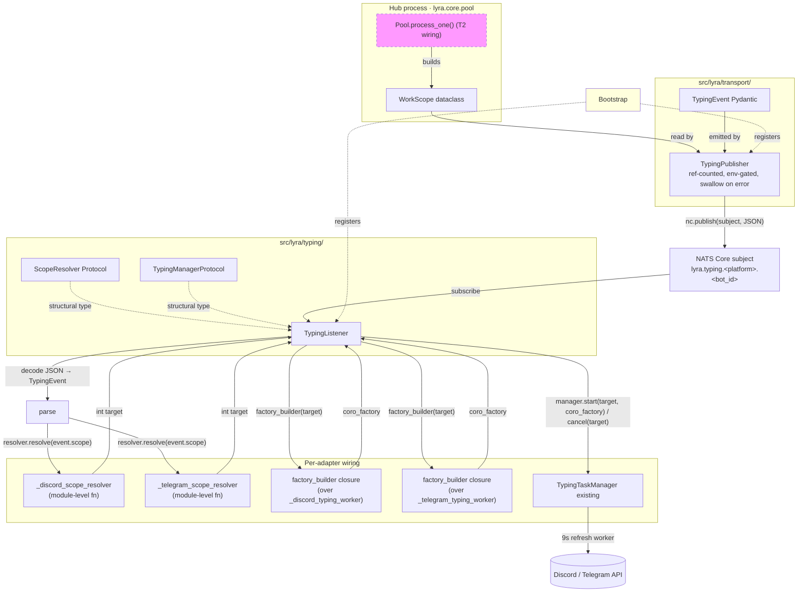
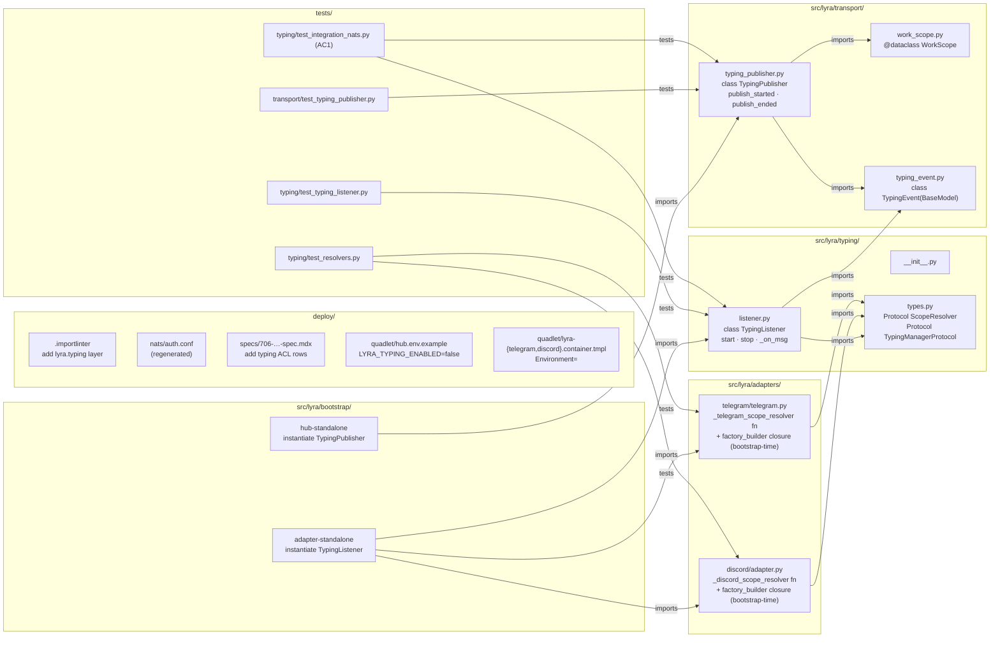

## Summary

Land 22 micro-tasks across 3 slices (Contracts+Publisher → Listener+stage-axis+resolvers → Bootstrap+ACL+deploy) for T1 of the typing-indicator NATS plane. 7 new files + 8 modified + 1 regenerated. 5 waves, up to 4 parallel agent instances. Foundational machinery only — no migration of imperative `_start_typing/_cancel_typing` call sites (T2 territory).

## Architectural Refinement from Spec

The spec left `TypingEvent` placement open ("if not in transport"). **This plan decides `TypingEvent` lives in `src/lyra/transport/typing_event.py`** alongside `WorkScope`. Reason: `TypingPublisher` (in `lyra.transport`) must import `TypingEvent`, but `lyra.transport` is at the BOTTOM of the layer stack — importing from `lyra.typing` (which sits above) would invert the layer direction. Placing the wire payload at the transport bottom keeps both `TypingPublisher` (transport) and `TypingListener` (typing) able to import it cleanly. The stage-logic Protocols (`ScopeResolver`, `TypingManagerProtocol`) remain in `src/lyra/typing/types.py`.

## Architecture

### Data flow



### File × Function map



## Agents

| Agent instance | Tasks | Subjects | Σ ops |
|---|---|---|---|
| backend-dev-A | T1, T2, T3 | contracts, publisher | 10 |
| backend-dev-B | T4, T5, T6 | typing-types, listener | 10 |
| backend-dev-C | T7, T8, T9, T10 | adapter-resolvers, bootstrap-wiring | 12 |
| tester-A | T11 | publisher-tests | 5 |
| tester-B | T12, T13 | listener-tests, resolver-tests | 8 |
| tester-C | T14 | integration-test | 6 |
| devops-A | T15, T16, T17, T18 | acl, env-config | 8 |
| devops-B | T19 | importlinter | 2 |

Subject-surface cap: ≤2 subjects per instance. All instances within cap. backend-dev-C has 4 tasks at the |tasks|=4 cap (not >4).

## Wave Structure

5 waves, max 4 parallel agent instances. Elapsed ~2–3 sessions vs ~6–8 sequential.

| Wave | Trigger | Agents (∥) | Tasks |
|---|---|---|---|
| 1 | start | 4 ∥ | backend-dev-A: T1, T2 · backend-dev-B: T4, T5 · devops-B: T19 · tester-A: T11 (RED) |
| 2 | Wave 1 done | 4 ∥ | backend-dev-A: T3 · backend-dev-B: T6 · devops-A: T15, T17, T18 · tester-B: T12, T13 (RED) |
| 3 | Wave 2 done | 2 ∥ | backend-dev-C: T7, T8 · T20 RED-GATE (S1 publisher tests pass) |
| 4 | Wave 3 done | 3 ∥ | backend-dev-C: T9, T10 · tester-C: T14 (RED→GREEN) · devops-A: T16 (regen auth.conf) · T21 RED-GATE (S2 listener + resolver tests pass) |
| 5 | Wave 4 done | 1 | T22 RED-GATE (S3 integration test + ACL grep verification) |

RED-phase tests in Wave 1/2 are written against the not-yet-existing imports — they will fail (import errors). RED-GATE assertions check both pre-impl failure AND post-impl success.

### Budget — per task

| Task | Class | Est. ops | Split? |
|---|---|---|---|
| T1 WorkScope dataclass | trivial | 2 | — |
| T2 TypingEvent Pydantic | trivial | 2 | — |
| T3 TypingPublisher ref-count + flag + swallow | judgmental | 6 | — |
| T4 typing/__init__.py | trivial | 1 | — |
| T5 typing/types.py (Protocols) | bounded | 3 | — |
| T6 typing/listener.py | judgmental | 6 | — |
| T7 Discord resolver + factory_builder | bounded | 3 | — |
| T8 Telegram resolver + factory_builder | bounded | 3 | — |
| T9 Hub bootstrap wiring | bounded | 3 | — |
| T10 Adapter bootstrap wiring | bounded | 3 | — |
| T11 test_typing_publisher.py | judgmental | 5 | — |
| T12 test_typing_listener.py | bounded | 4 | — |
| T13 test_resolvers.py | bounded | 4 | — |
| T14 test_integration_nats.py (AC1) | judgmental | 6 | — |
| T15 ACL spec doc update | bounded | 3 | — |
| T16 Regen auth.conf | trivial | 2 | — |
| T17 hub.env.example stub | trivial | 1 | — |
| T18 Adapter Quadlet templates Environment= | bounded | 2 | — |
| T19 .importlinter layer | bounded | 2 | — |
| T20 RED-GATE S1 | trivial | 1 | — |
| T21 RED-GATE S2 | trivial | 1 | — |
| T22 RED-GATE S3 | trivial | 1 | — |

**Total estimated ops: 64**

### Budget — per agent instance

| Instance | Tasks | Σ ops | Subjects | Split? |
|---|---|---|---|---|
| backend-dev-A | T1, T2, T3 | 10 | contracts, publisher | — |
| backend-dev-B | T4, T5, T6 | 10 | typing-types, listener | — |
| backend-dev-C | T7, T8, T9, T10 | 12 | adapter-resolvers, bootstrap-wiring | — |
| tester-A | T11 | 5 | publisher-tests | — |
| tester-B | T12, T13 | 8 | listener-tests, resolver-tests | — |
| tester-C | T14 | 6 | integration-test | — |
| devops-A | T15, T16, T17, T18 | 8 | acl, env-config | — |
| devops-B | T19 | 2 | importlinter | — |

All within caps (|tasks|≤4, Σ ops ≤50, subjects ≤2).

## Consistency Report

- **Acceptance criteria covered:** 8/8 (AC1→T14; AC2→T11; AC3→T11; AC4→T11+T14; AC5→T11; AC6→T15+T16; AC7→T19+T6+T5+T4; AC8→T13)
- **Untraced tasks:** 0 (every micro-task maps to AC or RED-GATE)
- **Slice coverage:** S1 → T1-T3, T11, T20 · S2 → T4-T8, T12-T13, T21 · S3 → T9, T10, T14-T19, T22
- **Exemptions:** none

## Micro-Tasks

### Slice S1: Contracts + Publisher

#### T1 — Create `WorkScope` dataclass

- **File:** `src/lyra/transport/work_scope.py` (new)
- **Snippet:**
  ```python
  from dataclasses import dataclass

  @dataclass(frozen=True, slots=True)
  class WorkScope:
      platform: str   # "discord" | "telegram"
      bot_id: str
      scope_id: int   # platform-native typing target (parent channel.id / chat_id)
      trace_id: str   # inherited from inbound; required, non-empty
  ```
- **Verify:** `uv run python -c "from lyra.transport.work_scope import WorkScope; print(WorkScope(platform='telegram', bot_id='x', scope_id=1, trace_id='abc'))"`
- **Expected:** `WorkScope(platform='telegram', bot_id='x', scope_id=1, trace_id='abc')`
- **Time:** 3 min · **Agent:** backend-dev-A · **Subject:** contracts · **Trace:** AC1, AC2 · **Phase:** GREEN · **Difficulty:** 1
- **[P]** with T2, T4, T5, T19, T11

#### T2 — Create `TypingEvent` Pydantic wire model

- **File:** `src/lyra/transport/typing_event.py` (new)
- **Snippet:**
  ```python
  from typing import Literal
  from pydantic import BaseModel
  from lyra.transport.work_scope import WorkScope  # local layer import

  class TypingEvent(BaseModel):
      kind: Literal["started", "ended"]
      scope: WorkScope
      ts: float   # time.time() unix seconds
  ```
- **Verify:** `uv run python -c "from lyra.transport.typing_event import TypingEvent; from lyra.transport.work_scope import WorkScope; e = TypingEvent(kind='started', scope=WorkScope(platform='telegram', bot_id='x', scope_id=1, trace_id='abc'), ts=1.0); print(e.model_dump_json())"`
- **Expected:** Valid JSON string with kind/scope/ts.
- **Time:** 3 min · **Agent:** backend-dev-A · **Subject:** contracts · **Trace:** AC1, AC2 · **Phase:** GREEN · **Difficulty:** 1
- **[P]** with T1, T4, T5, T19, T11
- **Note:** Pydantic auto-deserializes `WorkScope` because it's a `@dataclass` — confirmed by sibling pattern in `turn_publisher.py`'s payload pydantic models. If pyright complains, add `from pydantic.dataclasses import dataclass` variant; verify at impl time.

#### T3 — Create `TypingPublisher` with ref-count + flag + swallow

- **File:** `src/lyra/transport/typing_publisher.py` (new)
- **Snippet:**
  ```python
  from __future__ import annotations
  import logging, os, time
  from typing import TYPE_CHECKING

  from lyra.transport.typing_event import TypingEvent
  from lyra.transport.work_scope import WorkScope

  if TYPE_CHECKING:
      from nats.aio.client import Client as NATS

  log = logging.getLogger(__name__)

  class TypingPublisher:
      def __init__(self, nc: "NATS", *, enabled: bool | None = None) -> None:
          self._nc = nc
          self._enabled = (
              enabled if enabled is not None
              else os.getenv("LYRA_TYPING_ENABLED", "false").lower() == "true"
          )
          self._refcount: dict[tuple[str, str, int], int] = {}

      async def publish_started(self, scope: WorkScope) -> None:
          if not self._enabled:
              return
          key = (scope.platform, scope.bot_id, scope.scope_id)
          new = self._refcount.get(key, 0) + 1
          self._refcount[key] = new
          if new != 1:
              return  # sub-scope, no wire emit
          await self._publish(TypingEvent(kind="started", scope=scope, ts=time.time()))

      async def publish_ended(self, scope: WorkScope) -> None:
          if not self._enabled:
              return
          key = (scope.platform, scope.bot_id, scope.scope_id)
          current = self._refcount.get(key, 0)
          if current <= 0:
              log.debug("typing_publisher: ended for absent scope key=%r", key)
              return  # idempotent no-op
          self._refcount[key] = current - 1
          if self._refcount[key] != 0:
              return
          del self._refcount[key]
          await self._publish(TypingEvent(kind="ended", scope=scope, ts=time.time()))

      async def _publish(self, event: TypingEvent) -> None:
          subject = f"lyra.typing.{event.scope.platform}.{event.scope.bot_id}"
          try:
              await self._nc.publish(subject, event.model_dump_json().encode("utf-8"))
          except Exception as exc:
              log.warning("typing_publisher: publish failed: %s", exc)
  ```
- **Verify:** `uv run pytest tests/transport/test_typing_publisher.py -x -q`
- **Expected:** All publisher tests pass (after T11 in Wave 1 wrote them).
- **Time:** 8 min · **Agent:** backend-dev-A · **Subject:** publisher · **Trace:** AC2, AC3, AC4, AC5 · **Phase:** GREEN · **Difficulty:** 3
- **Depends on:** T1, T2
- **Note:** Ref-count is in-process only — wiped on hub restart (Edge Case in spec). Underflow on ended-without-started is the resilience path post-restart.

#### T11 — `test_typing_publisher.py` (RED)

- **File:** `tests/transport/test_typing_publisher.py` (new)
- **Snippet outline:**
  ```python
  import pytest
  from unittest.mock import AsyncMock
  from lyra.transport.typing_publisher import TypingPublisher
  from lyra.transport.work_scope import WorkScope

  @pytest.fixture
  def scope():
      return WorkScope(platform="telegram", bot_id="x", scope_id=1, trace_id="abc")

  @pytest.mark.asyncio
  async def test_refcount_two_started_one_publish(scope):
      nc = AsyncMock()
      pub = TypingPublisher(nc, enabled=True)
      await pub.publish_started(scope)
      await pub.publish_started(scope)
      assert nc.publish.call_count == 1   # AC2

  @pytest.mark.asyncio
  async def test_two_ended_one_publish(scope):
      nc = AsyncMock()
      pub = TypingPublisher(nc, enabled=True)
      await pub.publish_started(scope); await pub.publish_started(scope)
      nc.publish.reset_mock()
      await pub.publish_ended(scope)
      assert nc.publish.call_count == 0
      await pub.publish_ended(scope)
      assert nc.publish.call_count == 1   # AC2

  @pytest.mark.asyncio
  async def test_ended_unknown_scope_noop(scope):
      nc = AsyncMock()
      pub = TypingPublisher(nc, enabled=True)
      await pub.publish_ended(scope)   # AC3
      nc.publish.assert_not_called()

  @pytest.mark.asyncio
  async def test_flag_off_no_publish(scope):
      nc = AsyncMock()
      pub = TypingPublisher(nc, enabled=False)
      await pub.publish_started(scope)
      await pub.publish_ended(scope)
      assert nc.publish.call_count == 0   # AC4

  @pytest.mark.asyncio
  async def test_publish_error_swallow(scope):
      nc = AsyncMock()
      nc.publish.side_effect = RuntimeError("boom")
      pub = TypingPublisher(nc, enabled=True)
      await pub.publish_started(scope)   # AC5 — must not raise
  ```
- **Verify:** `uv run pytest tests/transport/test_typing_publisher.py -x -q --collect-only` (Wave 1 RED: imports fail; Wave 2 GREEN: all pass).
- **Expected:** Wave 1 RED: collect errors with `ImportError: No module named lyra.transport.typing_publisher`. Wave 2 GREEN: 5 tests collected and passing.
- **Time:** 10 min · **Agent:** tester-A · **Subject:** publisher-tests · **Trace:** AC2, AC3, AC4, AC5 · **Phase:** RED then GREEN-verify · **Difficulty:** 3
- **[P]** in Wave 1

#### T20 — RED-GATE S1

- **Verify:** `uv run pytest tests/transport/test_typing_publisher.py -x -q` returns 5 passed.
- **Expected:** 5 passed, 0 failed.
- **Time:** 1 min · **Agent:** tester-A · **Phase:** RED-GATE · **Difficulty:** 1
- **Depends on:** T1, T2, T3, T11

### Slice S2: Listener + stage-axis + per-platform resolvers

#### T4 — `src/lyra/typing/__init__.py`

- **File:** `src/lyra/typing/__init__.py` (new)
- **Snippet:** empty or re-export `TypingListener`, `ScopeResolver`, `TypingManagerProtocol`.
- **Verify:** `uv run python -c "import lyra.typing"`
- **Time:** 1 min · **Agent:** backend-dev-B · **Subject:** typing-types · **Trace:** AC7 · **Phase:** GREEN · **Difficulty:** 1
- **[P]** in Wave 1

#### T5 — `src/lyra/typing/types.py` (Protocols)

- **File:** `src/lyra/typing/types.py` (new)
- **Snippet:**
  ```python
  from collections.abc import Callable, Coroutine
  from typing import Any, Protocol, runtime_checkable

  from lyra.transport.work_scope import WorkScope

  @runtime_checkable
  class ScopeResolver(Protocol):
      """Per-platform: WorkScope → platform-native typing target int.

      Implementations are module-level functions in src/lyra/adapters/{platform}/
      (NOT closures over adapter instance) so they are import-time testable
      without instantiating the adapter.
      """
      def __call__(self, scope: WorkScope) -> int: ...

  @runtime_checkable
  class TypingManagerProtocol(Protocol):
      """Structural Protocol satisfied by lyra.adapters.shared.TypingTaskManager.

      Defined here in stage-axis module so TypingListener depends ONLY on this
      Protocol — never imports lyra.adapters directly (would invert layer
      stack: lyra.typing must not depend on lyra.adapters).
      """
      def start(self, target: int, coro_factory: Callable[[], Coroutine[Any, Any, None]]) -> None: ...
      def cancel(self, target: int) -> None: ...
  ```
- **Verify:** `uv run python -c "from lyra.typing.types import ScopeResolver, TypingManagerProtocol; print(ScopeResolver, TypingManagerProtocol)"`
- **Expected:** prints both Protocol classes.
- **Time:** 5 min · **Agent:** backend-dev-B · **Subject:** typing-types · **Trace:** AC7 · **Phase:** GREEN · **Difficulty:** 2
- **[P]** in Wave 1

#### T6 — `src/lyra/typing/listener.py`

- **File:** `src/lyra/typing/listener.py` (new)
- **Snippet:**
  ```python
  from __future__ import annotations
  import logging
  import os
  from collections.abc import Callable, Coroutine
  from typing import TYPE_CHECKING, Any

  from lyra.transport.typing_event import TypingEvent
  from lyra.typing.types import ScopeResolver, TypingManagerProtocol

  if TYPE_CHECKING:
      from nats.aio.client import Client as NATS
      from nats.aio.msg import Msg
      from nats.aio.subscription import Subscription

  log = logging.getLogger(__name__)

  CoroFactory = Callable[[], Coroutine[Any, Any, None]]
  FactoryBuilder = Callable[[int], CoroFactory]

  class TypingListener:
      def __init__(
          self,
          nc: "NATS",
          subject: str,
          resolver: ScopeResolver,
          factory_builder: FactoryBuilder,
          manager: TypingManagerProtocol,
          *,
          enabled: bool | None = None,
      ) -> None:
          self._nc = nc
          self._subject = subject
          self._resolver = resolver
          self._factory_builder = factory_builder
          self._manager = manager
          self._enabled = (
              enabled if enabled is not None
              else os.getenv("LYRA_TYPING_ENABLED", "false").lower() == "true"
          )
          self._sub: "Subscription | None" = None

      async def start(self) -> None:
          if not self._enabled:
              log.debug("typing_listener: disabled, subscription skipped subject=%s", self._subject)
              return
          self._sub = await self._nc.subscribe(self._subject, cb=self._on_msg)

      async def stop(self) -> None:
          if self._sub is not None:
              await self._sub.unsubscribe()
              self._sub = None

      async def _on_msg(self, msg: "Msg") -> None:
          target: int | None = None
          try:
              event = TypingEvent.model_validate_json(msg.data)
              target = self._resolver(event.scope)
              if event.kind == "started":
                  self._manager.start(target, self._factory_builder(target))
              else:
                  self._manager.cancel(target)
          except Exception:
              log.exception("typing_listener: dispatch failed subject=%s", self._subject)
              if target is not None:
                  try:
                      self._manager.cancel(target)
                  except Exception:
                      log.exception("typing_listener: defensive cancel failed")
  ```
- **Verify:** `uv run pytest tests/typing/test_typing_listener.py -x -q`
- **Expected:** All listener tests pass after T12.
- **Time:** 8 min · **Agent:** backend-dev-B · **Subject:** listener · **Trace:** AC1, AC4 · **Phase:** GREEN · **Difficulty:** 3
- **Depends on:** T2, T5

#### T7 — Discord module-level resolver + factory_builder wiring

- **File:** `src/lyra/adapters/discord/adapter.py` (modify)
- **Snippet additions (module level, NOT inside class):**
  ```python
  # ── Typing plane (#1376) ─────────────────────────────────────────────────
  from lyra.transport.work_scope import WorkScope

  def _discord_scope_resolver(scope: WorkScope) -> int:
      """Return parent channel.id. WorkScope.scope_id IS the parent channel.id
      by T2 construction (inbound capture keys on message.channel.id pre-pre-session-hook).
      Identity-with-shape-guarantee."""
      return scope.scope_id
  ```
  **Plus** (inside adapter class, used at bootstrap-time by adapter-standalone):
  ```python
  def _build_discord_typing_factory(self, channel_id: int) -> Callable[[], Coroutine[Any, Any, None]]:
      def _factory():
          return self._discord_typing_worker(channel_id)
      return _factory
  ```
- **Verify:** `uv run python -c "from lyra.adapters.discord.adapter import _discord_scope_resolver; from lyra.transport.work_scope import WorkScope; print(_discord_scope_resolver(WorkScope(platform='discord', bot_id='x', scope_id=42, trace_id='t')))"`
- **Expected:** `42`
- **Time:** 5 min · **Agent:** backend-dev-C · **Subject:** adapter-resolvers · **Trace:** AC8 · **Phase:** GREEN · **Difficulty:** 2
- **Depends on:** T5
- **Note:** `_discord_typing_worker` is the existing 9s-refresh worker (cf. adapter CLAUDE.md). Re-uses adapter's existing channel-resolution path.

#### T8 — Telegram module-level resolver + factory_builder wiring

- **File:** `src/lyra/adapters/telegram/telegram.py` (modify)
- **Snippet additions:** mirror of T7, named `_telegram_scope_resolver` and `_build_telegram_typing_factory`. Telegram's typing worker pings the Bot API; the factory closure captures `self.bot` plus the chat_id.
- **Verify:** `uv run python -c "from lyra.adapters.telegram.telegram import _telegram_scope_resolver; from lyra.transport.work_scope import WorkScope; print(_telegram_scope_resolver(WorkScope(platform='telegram', bot_id='x', scope_id=-100, trace_id='t')))"`
- **Expected:** `-100` (Telegram chat_id can be negative for groups — Edge Case in spec).
- **Time:** 5 min · **Agent:** backend-dev-C · **Subject:** adapter-resolvers · **Trace:** AC8 · **Phase:** GREEN · **Difficulty:** 2
- **Depends on:** T5

#### T12 — `tests/typing/test_typing_listener.py` (RED)

- **File:** `tests/typing/test_typing_listener.py` (new)
- **Snippet outline:**
  ```python
  import asyncio, json
  import pytest
  from unittest.mock import AsyncMock, MagicMock
  from lyra.transport.work_scope import WorkScope
  from lyra.transport.typing_event import TypingEvent
  from lyra.typing.listener import TypingListener

  def _make_msg(event: TypingEvent):
      m = MagicMock(); m.data = event.model_dump_json().encode("utf-8"); return m

  @pytest.mark.asyncio
  async def test_dispatch_started_calls_manager_start_with_factory():
      nc = AsyncMock(); mgr = MagicMock()
      resolver = lambda scope: scope.scope_id
      built_factories: list[int] = []
      def builder(target: int):
          built_factories.append(target)
          async def _factory(): pass
          return _factory
      listener = TypingListener(nc, "lyra.typing.discord.x", resolver, builder, mgr, enabled=True)
      scope = WorkScope(platform="discord", bot_id="x", scope_id=42, trace_id="t")
      await listener._on_msg(_make_msg(TypingEvent(kind="started", scope=scope, ts=1.0)))
      mgr.start.assert_called_once()
      args, _ = mgr.start.call_args
      assert args[0] == 42                   # AC1 — resolved target
      assert callable(args[1])               # AC1 — coro_factory present
      assert built_factories == [42]         # factory_builder was called with target

  @pytest.mark.asyncio
  async def test_dispatch_ended_calls_manager_cancel():
      nc = AsyncMock(); mgr = MagicMock()
      listener = TypingListener(nc, "s", lambda s: s.scope_id, lambda t: lambda: None, mgr, enabled=True)
      scope = WorkScope(platform="telegram", bot_id="x", scope_id=7, trace_id="t")
      await listener._on_msg(_make_msg(TypingEvent(kind="ended", scope=scope, ts=1.0)))
      mgr.cancel.assert_called_once_with(7)

  @pytest.mark.asyncio
  async def test_resolver_exception_calls_defensive_cancel():
      nc = AsyncMock(); mgr = MagicMock()
      def bad_resolver(scope): raise RuntimeError("boom")
      listener = TypingListener(nc, "s", bad_resolver, lambda t: lambda: None, mgr, enabled=True)
      scope = WorkScope(platform="discord", bot_id="x", scope_id=1, trace_id="t")
      await listener._on_msg(_make_msg(TypingEvent(kind="started", scope=scope, ts=1.0)))
      # target never resolved, so no defensive cancel call expected
      mgr.cancel.assert_not_called()

  @pytest.mark.asyncio
  async def test_factory_builder_exception_triggers_defensive_cancel():
      nc = AsyncMock(); mgr = MagicMock()
      def bad_builder(target): raise RuntimeError("boom")
      listener = TypingListener(nc, "s", lambda s: s.scope_id, bad_builder, mgr, enabled=True)
      scope = WorkScope(platform="discord", bot_id="x", scope_id=99, trace_id="t")
      await listener._on_msg(_make_msg(TypingEvent(kind="started", scope=scope, ts=1.0)))
      mgr.cancel.assert_called_once_with(99)

  @pytest.mark.asyncio
  async def test_flag_off_no_subscribe():
      nc = AsyncMock()
      listener = TypingListener(nc, "s", lambda s: s.scope_id, lambda t: lambda: None, MagicMock(), enabled=False)
      await listener.start()
      nc.subscribe.assert_not_called()    # AC4
  ```
- **Verify:** `uv run pytest tests/typing/test_typing_listener.py -x -q`
- **Expected:** Wave 2 RED: ImportError. Wave 2 GREEN (after T6): 5 tests pass.
- **Time:** 10 min · **Agent:** tester-B · **Subject:** listener-tests · **Trace:** AC1, AC4 · **Phase:** RED then GREEN-verify · **Difficulty:** 3

#### T13 — `tests/typing/test_resolvers.py` (RED)

- **File:** `tests/typing/test_resolvers.py` (new)
- **Snippet:**
  ```python
  """AC8 verification — resolvers are module-level functions, import-only test."""

  def test_discord_resolver_is_module_level():
      # Import without instantiating DiscordAdapter
      from lyra.adapters.discord.adapter import _discord_scope_resolver
      from lyra.transport.work_scope import WorkScope
      assert callable(_discord_scope_resolver)
      assert _discord_scope_resolver(WorkScope(
          platform="discord", bot_id="x", scope_id=12345, trace_id="t",
      )) == 12345

  def test_telegram_resolver_is_module_level():
      from lyra.adapters.telegram.telegram import _telegram_scope_resolver
      from lyra.transport.work_scope import WorkScope
      assert callable(_telegram_scope_resolver)
      assert _telegram_scope_resolver(WorkScope(
          platform="telegram", bot_id="x", scope_id=-100123, trace_id="t",
      )) == -100123    # negative chat_id for Telegram groups
  ```
- **Verify:** `uv run pytest tests/typing/test_resolvers.py -x -q`
- **Expected:** Wave 2 RED: ImportError. Wave 3 GREEN (after T7+T8): 2 tests pass.
- **Time:** 6 min · **Agent:** tester-B · **Subject:** resolver-tests · **Trace:** AC8 · **Phase:** RED then GREEN-verify · **Difficulty:** 2

#### T19 — `.importlinter` — add `lyra.typing` layer

- **File:** `.importlinter` (modify)
- **Edit:** Add `lyra.typing` between `lyra.streaming` and `lyra.core` in the `layers =` block of the `clean-architecture-layers` contract:
  ```
  layers =
      lyra.bootstrap
      lyra.adapters | lyra.blobstore
      lyra.outbound
      lyra.infrastructure
      lyra.llm | lyra.nats
      lyra.core
      lyra.typing       ; ADD — #1376
      lyra.streaming
      lyra.transport
  ```
- **Verify:** `uv run lint-imports`
- **Expected:** Exit 0 (no contracts violated).
- **Time:** 4 min · **Agent:** devops-B · **Subject:** importlinter · **Trace:** AC7 · **Phase:** GREEN · **Difficulty:** 2
- **[P]** with all Wave 1 tasks

#### T21 — RED-GATE S2

- **Verify:** `uv run pytest tests/typing/ -x -q && uv run lint-imports`
- **Expected:** All listener + resolver tests pass. lint-imports exit 0.
- **Time:** 1 min · **Phase:** RED-GATE · **Difficulty:** 1
- **Depends on:** T4, T5, T6, T7, T8, T12, T13, T19

### Slice S3: Bootstrap wiring + ACL + deploy

#### T9 — Hub bootstrap: instantiate `TypingPublisher`

- **File:** locate hub-standalone bootstrap module (likely `src/lyra/bootstrap/_bootstrap_hub_standalone.py` per project CLAUDE.md `## Production entry points`); read first, then add wiring.
- **Snippet (insert after NATS client `nc` is constructed, before hub instantiation):**
  ```python
  from lyra.transport.typing_publisher import TypingPublisher
  typing_publisher = TypingPublisher(nc)   # reads LYRA_TYPING_ENABLED at __init__
  # Pass into hub container (T2 will consume — T1 ships the instance only)
  ```
- **Verify:** `uv run pyright src/lyra/bootstrap/` and `uv run python -m lyra hub --help` (subcommand exists and imports succeed).
- **Expected:** Pyright clean, subcommand runs.
- **Time:** 5 min · **Agent:** backend-dev-C · **Subject:** bootstrap-wiring · **Trace:** AC4 · **Phase:** GREEN · **Difficulty:** 2
- **Depends on:** T3

#### T10 — Adapter bootstrap: instantiate `TypingListener` per adapter

- **File:** locate adapter-standalone bootstrap module (likely `src/lyra/bootstrap/_bootstrap_adapter_standalone.py`); read first.
- **Snippet (after adapter instance + nc are constructed):**
  ```python
  from lyra.typing.listener import TypingListener
  if platform == "discord":
      from lyra.adapters.discord.adapter import _discord_scope_resolver
      resolver = _discord_scope_resolver
      factory_builder = adapter._build_discord_typing_factory
  elif platform == "telegram":
      from lyra.adapters.telegram.telegram import _telegram_scope_resolver
      resolver = _telegram_scope_resolver
      factory_builder = adapter._build_telegram_typing_factory
  listener = TypingListener(
      nc=nc,
      subject=f"lyra.typing.{platform}.{adapter.bot_id}",
      resolver=resolver,
      factory_builder=factory_builder,
      manager=adapter._typing,
  )
  await listener.start()   # no-op when LYRA_TYPING_ENABLED=false
  ```
- **Verify:** `uv run pyright src/lyra/bootstrap/` and `uv run python -m lyra adapter discord --help` + same for telegram.
- **Expected:** Pyright clean, subcommands run.
- **Time:** 8 min · **Agent:** backend-dev-C · **Subject:** bootstrap-wiring · **Trace:** AC1 · **Phase:** GREEN · **Difficulty:** 3
- **Depends on:** T6, T7, T8

#### T14 — `tests/typing/test_integration_nats.py` (AC1 end-to-end)

- **File:** `tests/typing/test_integration_nats.py` (new)
- **Snippet outline:**
  ```python
  """AC1 — plane reachable end-to-end via in-process NATS."""
  import asyncio
  import pytest
  from unittest.mock import MagicMock
  from nats.aio.client import Client as NATS   # uses in-process or nats-server fixture
  # Use existing tests/nats/conftest.py fixture if it provides an in-process server

  from lyra.transport.typing_publisher import TypingPublisher
  from lyra.transport.work_scope import WorkScope
  from lyra.typing.listener import TypingListener

  @pytest.mark.asyncio
  async def test_publisher_to_listener_e2e_discord(nats_server):
      nc_pub = NATS(); await nc_pub.connect(nats_server.url)
      nc_sub = NATS(); await nc_sub.connect(nats_server.url)
      mgr = MagicMock()
      def resolver(scope): return scope.scope_id
      def builder(target):
          async def _f(): pass
          return _f
      listener = TypingListener(nc_sub, "lyra.typing.discord.x", resolver, builder, mgr, enabled=True)
      await listener.start()
      pub = TypingPublisher(nc_pub, enabled=True)
      scope = WorkScope(platform="discord", bot_id="x", scope_id=42, trace_id="t")
      await pub.publish_started(scope)
      await asyncio.sleep(0.05)   # NATS round-trip
      mgr.start.assert_called_once()
      assert mgr.start.call_args[0][0] == 42
      await pub.publish_ended(scope)
      await asyncio.sleep(0.05)
      mgr.cancel.assert_called_once_with(42)
      await listener.stop()
  ```
- **Verify:** `uv run pytest tests/typing/test_integration_nats.py -x -q`
- **Expected:** Test passes (1 test, ~1s with NATS round-trip).
- **Time:** 12 min · **Agent:** tester-C · **Subject:** integration-test · **Trace:** AC1 · **Phase:** RED then GREEN-verify · **Difficulty:** 4
- **Depends on:** T3, T6, T9, T10
- **Note:** Look at `tests/nats/conftest.py` for the existing in-process NATS fixture pattern. If no fixture, look at `tests/nats/test_nats_bus.py` for the connection setup pattern. Mirror existing tests, don't invent a new harness.

#### T15 — Update ACL spec doc

- **File:** `artifacts/specs/706-per-role-nkeys-acls-spec.mdx` (modify)
- **Snippet additions (in the role-permissions matrix):**
  - `hub`: `publish.allow` row gains `lyra.typing.>`
  - `telegram-adapter`: `subscribe.allow` row gains `lyra.typing.telegram.>`
  - `discord-adapter`: `subscribe.allow` row gains `lyra.typing.discord.>`
  - `code-worker` row: **omit for T1** (placeholder deferred to T3 per spec Open Q 3)
- **Verify:** `grep -E "lyra\.typing" artifacts/specs/706-per-role-nkeys-acls-spec.mdx | wc -l`
- **Expected:** ≥ 3 lines (one per role).
- **Time:** 5 min · **Agent:** devops-A · **Subject:** acl · **Trace:** AC6 · **Phase:** GREEN · **Difficulty:** 2

#### T16 — Regenerate `deploy/nats/auth.conf`

- **File:** `deploy/nats/auth.conf` (regenerated, do NOT edit by hand)
- **Process:**
  1. `git pull --ff-only origin staging` (verify no fragment-splice drift from #1379 cascade)
  2. `test -s deploy/nats/auth.conf` (sanity)
  3. `ls deploy/nats/fragments/ 2>/dev/null` (if fragments exist, log state pre-regen)
  4. `make nats-regen-authconf` (runs `lyra-acl genkeys --regen-authconf` + secret refresh + NATS restart)
- **Verify:** `grep -E "lyra\.typing\." deploy/nats/auth.conf | wc -l`
- **Expected:** ≥ 3 lines (hub publish + telegram subscribe + discord subscribe).
- **Time:** 4 min · **Agent:** devops-A · **Subject:** acl · **Trace:** AC6 · **Phase:** GREEN · **Difficulty:** 2
- **Depends on:** T15

#### T17 — `deploy/quadlet/hub.env.example` — add `LYRA_TYPING_ENABLED=false`

- **File:** `deploy/quadlet/hub.env.example` (modify)
- **Snippet append:**
  ```bash
  # Typing-indicator NATS plane (#1376) — flip to true to enable lyra.typing.* publish
  LYRA_TYPING_ENABLED=false
  ```
- **Verify:** `grep LYRA_TYPING_ENABLED deploy/quadlet/hub.env.example`
- **Expected:** prints the stub line.
- **Time:** 2 min · **Agent:** devops-A · **Subject:** env-config · **Trace:** AC4, C1 · **Phase:** GREEN · **Difficulty:** 1

#### T18 — Adapter Quadlet templates `Environment=LYRA_TYPING_ENABLED=false`

- **Files:** `deploy/quadlet/lyra-telegram.container.tmpl`, `deploy/quadlet/lyra-discord.container.tmpl` (modify both)
- **Snippet:** Add to `[Container]` section, near existing `Environment=` lines:
  ```
  Environment=LYRA_TYPING_ENABLED=false
  ```
- **Verify:** `grep LYRA_TYPING_ENABLED deploy/quadlet/lyra-*.container.tmpl | wc -l`
- **Expected:** ≥ 2 (one per template).
- **Time:** 3 min · **Agent:** devops-A · **Subject:** env-config · **Trace:** AC4, C1 · **Phase:** GREEN · **Difficulty:** 1

#### T22 — RED-GATE S3 + spec verification

- **Verify:**
  ```bash
  # All tests pass:
  uv run pytest tests/transport/test_typing_publisher.py tests/typing/ -x -q
  # ACL regen contains typing rows:
  grep -E "lyra\.typing\." deploy/nats/auth.conf | wc -l   # ≥ 3
  grep -E "lyra\.typing\." artifacts/specs/706-per-role-nkeys-acls-spec.mdx | wc -l   # ≥ 3
  # Env propagation in place:
  grep LYRA_TYPING_ENABLED deploy/quadlet/hub.env.example
  grep LYRA_TYPING_ENABLED deploy/quadlet/lyra-telegram.container.tmpl
  grep LYRA_TYPING_ENABLED deploy/quadlet/lyra-discord.container.tmpl
  # Layers contract:
  uv run lint-imports
  ```
- **Expected:** All checks green.
- **Time:** 3 min · **Phase:** RED-GATE · **Difficulty:** 1
- **Depends on:** T9, T10, T14, T15, T16, T17, T18

## Task Seeding Blueprint

<!-- Used by /implement to seed TaskCreate calls on session start.
     Format: T{n} | agent-instance | blockedBy | subject
     blockedBy refs T-numbers within this list (not session task IDs).
     Agent instances are named so parallel tasks map to distinct spawned agents.
     Seed in wave order; within a wave all rows are parallel (∥). -->

### Wave 1 — no deps, 4 agents ∥

| Task | Agent instance | blockedBy | Subject |
|------|---------------|-----------|---------|
| T1 | backend-dev-A | — | contracts |
| T2 | backend-dev-A | — | contracts |
| T4 | backend-dev-B | — | typing-types |
| T5 | backend-dev-B | — | typing-types |
| T11 | tester-A | — | publisher-tests |
| T19 | devops-B | — | importlinter |

### Wave 2 — after Wave 1, 4 agents ∥

| Task | Agent instance | blockedBy | Subject |
|------|---------------|-----------|---------|
| T3 | backend-dev-A | T1, T2 | publisher |
| T6 | backend-dev-B | T2, T5 | listener |
| T12 | tester-B | — | listener-tests |
| T13 | tester-B | — | resolver-tests |
| T15 | devops-A | — | acl |
| T17 | devops-A | — | env-config |
| T18 | devops-A | — | env-config |

### Wave 3 — after Wave 2, 2 agents ∥

| Task | Agent instance | blockedBy | Subject |
|------|---------------|-----------|---------|
| T7 | backend-dev-C | T5 | adapter-resolvers |
| T8 | backend-dev-C | T5 | adapter-resolvers |
| T20 | tester-A | T1, T2, T3, T11 | publisher-tests |

### Wave 4 — after Wave 3, 3 agents ∥

| Task | Agent instance | blockedBy | Subject |
|------|---------------|-----------|---------|
| T9 | backend-dev-C | T3 | bootstrap-wiring |
| T10 | backend-dev-C | T6, T7, T8 | bootstrap-wiring |
| T14 | tester-C | T3, T6, T9, T10 | integration-test |
| T16 | devops-A | T15 | acl |
| T21 | tester-B | T4, T5, T6, T7, T8, T12, T13, T19 | listener-tests |

### Wave 5 — after Wave 4, 1 agent

| Task | Agent instance | blockedBy | Subject |
|------|---------------|-----------|---------|
| T22 | tester-C | T9, T10, T14, T15, T16, T17, T18 | integration-test |

## Task IDs

<!-- Generated by /plan. Used by /implement to resume tasks on session restart. -->

- T1: 13 — contracts (WorkScope)
- T2: 14 — contracts (TypingEvent)
- T3: 15 — publisher
- T4: 16 — typing-types (__init__)
- T5: 17 — typing-types (Protocols)
- T6: 18 — listener
- T7: 19 — adapter-resolvers (Discord)
- T8: 20 — adapter-resolvers (Telegram)
- T9: 21 — bootstrap-wiring (hub)
- T10: 22 — bootstrap-wiring (adapter)
- T11: 23 — publisher-tests
- T12: 24 — listener-tests
- T13: 25 — resolver-tests
- T14: 26 — integration-test
- T15: 27 — acl (spec doc)
- T16: 28 — acl (auth.conf regen)
- T17: 29 — env-config (hub)
- T18: 30 — env-config (adapters)
- T19: 31 — importlinter
- T20: 32 — RED-GATE S1
- T21: 33 — RED-GATE S2
- T22: 34 — RED-GATE S3

## Reference Patterns

Implementers should read these before starting:

- `src/lyra/transport/turn_publisher.py` — publisher pattern (Pydantic JSON, awaiting publish, structural skeleton). T3 (TypingPublisher) mirrors with ref-count + swallow + no PubAck.
- `src/lyra/infrastructure/turn_writer/writer.py` — JetStream subscriber pattern. T6 (TypingListener) is the NATS Core analog.
- `src/lyra/inbound/` — stage-axis module shape. T4-T6 (`src/lyra/typing/`) mirror this layout (`types.py` + `*.py` impls).
- `src/lyra/adapters/shared/_shared.py:164` — existing `TypingTaskManager` (signature `start(chat_id, coro_factory)`). T6's `TypingManagerProtocol` is the structural dual.
- `tests/nats/conftest.py` and `tests/nats/test_nats_bus.py` — in-process NATS fixture + connection setup. T14 mirrors.
