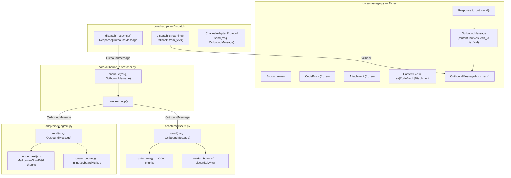
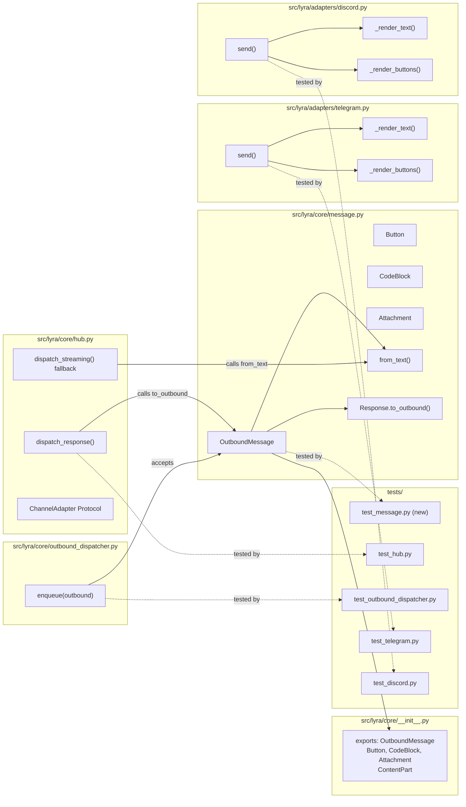

## Summary

Introduce `OutboundMessage` (and supporting types `Button`, `CodeBlock`, `Attachment`) in
`core/message.py`, wire it through hub dispatch and `OutboundDispatcher`, then update both
channel adapters to implement MarkdownV2/2000-char rendering against the new contract.
`Response` is retained as a backward-compat shim via `.to_outbound()`.

## Architecture

### Data Flow



### File × Function Map



## Agents

| Agent | Task count | Files |
|-------|-----------|-------|
| tester | 4 RED + 4 RED-GATE | tests/core/test_message.py, tests/core/test_hub.py, tests/adapters/test_telegram.py, tests/adapters/test_discord.py |
| backend-dev | 12 GREEN | src/lyra/core/message.py, src/lyra/core/__init__.py, src/lyra/core/hub.py, src/lyra/core/outbound_dispatcher.py, src/lyra/adapters/telegram.py, src/lyra/adapters/discord.py |

## Consistency Report

- Criteria covered: 18/18
- Uncovered criteria: none
- Tasks without spec backing: none
- Gold plating exemptions applied: 0

## Micro-Tasks

### Slice V1: Core types

#### Task 1: Write RED tests for OutboundMessage types → tester

- **File:** `tests/core/test_message.py` (new)
- **Snippet:**
  ```python
  from lyra.core.message import OutboundMessage, Button, CodeBlock, Attachment, ContentPart

  def test_outbound_message_from_text():
      msg = OutboundMessage.from_text("hello world")
      assert msg.content == ["hello world"]
      assert msg.buttons == []
      assert msg.edit_id is None
      assert msg.is_final is True

  def test_response_to_outbound():
      from lyra.core.message import Response
      r = Response(content="x")
      out = r.to_outbound()
      assert out.content == ["x"]

  def test_outbound_message_importable_from_core():
      from lyra.core import OutboundMessage, Button  # noqa
  ```
- **Verify:** `uv run pytest tests/core/test_message.py -x 2>&1 | head -5` (deferred — RED expected)
- **Expected:** ImportError or AttributeError until GREEN
- **Time:** 5 min | **Difficulty:** 2
- **Traces:** SC-1, SC-2, SC-3
- **Phase:** RED

#### Task 2: Implement OutboundMessage and supporting types → backend-dev

- **File:** `src/lyra/core/message.py`
- **Snippet:**
  ```python
  ContentPart = str | "CodeBlock" | "Attachment"

  @dataclass(frozen=True)
  class Button:
      text: str
      callback_data: str

  @dataclass(frozen=True)
  class CodeBlock:
      code: str
      language: str | None = None

  @dataclass(frozen=True)
  class Attachment:
      url: str
      media_type: str
      caption: str | None = None

  @dataclass
  class OutboundMessage:
      content: list[ContentPart]
      buttons: list[Button] = field(default_factory=list)
      edit_id: str | None = None
      is_final: bool = True
      metadata: dict[str, Any] = field(default_factory=dict)

      @classmethod
      def from_text(cls, text: str) -> "OutboundMessage":
          return cls(content=[text])
  ```
  Also add `Response.to_outbound()`:
  ```python
  def to_outbound(self) -> OutboundMessage:
      return OutboundMessage.from_text(self.content)
  ```
- **Verify:** `uv run pyright src/lyra/core/message.py` (ready)
- **Expected:** No errors
- **Time:** 8 min | **Difficulty:** 2
- **Traces:** N1, N2, N3, N4, N5, N6 → SC-1, SC-2, SC-3
- **Phase:** GREEN

#### Task 3: Export new types from core/__init__.py → backend-dev

- **File:** `src/lyra/core/__init__.py`
- **Snippet:**
  ```python
  from .message import (
      ...
      Attachment,
      Button,
      CodeBlock,
      ContentPart,
      OutboundMessage,
      ...
  )
  __all__ = [..., "Attachment", "Button", "CodeBlock", "ContentPart", "OutboundMessage"]
  ```
- **Verify:** `uv run python -c "from lyra.core import OutboundMessage, Button, CodeBlock, Attachment, ContentPart; print('ok')"` (ready)
- **Expected:** `ok`
- **Time:** 3 min | **Difficulty:** 1
- **Traces:** SC-1
- **Phase:** GREEN

#### RED-GATE: RED complete V1 → tester

- **Verify:** All Task 1 RED tests collected; `uv run pytest tests/core/test_message.py --collect-only` exits 0
- **Phase:** RED-GATE

---

### Slice V2: Hub + dispatcher wiring

#### Task 4: Write RED tests for hub dispatch with OutboundMessage → tester

- **File:** `tests/core/test_hub.py` (extend), `tests/core/test_outbound_dispatcher.py` (extend)
- **Snippet:**
  ```python
  # test_hub.py — add
  async def test_dispatch_response_accepts_outbound_message():
      from lyra.core.message import OutboundMessage
      hub = Hub()
      received = []
      class MockAdapterV2:
          async def send(self, msg, outbound):
              received.append(outbound)
      hub.register_adapter(Platform.TELEGRAM, "main", MockAdapterV2())
      outbound = OutboundMessage.from_text("hi")
      await hub.dispatch_response(make_message(), outbound)
      assert len(received) == 1
      assert received[0].content == ["hi"]

  # test_outbound_dispatcher.py — add
  def test_enqueue_accepts_outbound_message():
      from lyra.core.message import OutboundMessage
      dispatcher = OutboundDispatcher(platform_name="tg", adapter=MagicMock())
      outbound = OutboundMessage.from_text("test")
      dispatcher.enqueue(MagicMock(), outbound)  # must not raise TypeError
  ```
- **Verify:** `uv run pytest tests/core/test_hub.py tests/core/test_outbound_dispatcher.py -x 2>&1 | head -5` (deferred)
- **Expected:** Tests collected; failures deferred until GREEN
- **Time:** 5 min | **Difficulty:** 2
- **Traces:** SC-4, U1, U2, U3
- **Phase:** RED

#### Task 5: Update ChannelAdapter Protocol, dispatch_response(), dispatch_streaming() fallback → backend-dev

- **File:** `src/lyra/core/hub.py`
- **Snippet:**
  ```python
  # ChannelAdapter Protocol
  async def send(self, original_msg: Message, outbound: OutboundMessage) -> None: ...

  # dispatch_response — accept union, convert internally
  async def dispatch_response(
      self, msg: Message, response: Response | OutboundMessage
  ) -> None:
      outbound = response if isinstance(response, OutboundMessage) else response.to_outbound()
      dispatcher = self.outbound_dispatchers.get(...)
      if dispatcher is not None:
          dispatcher.enqueue(msg, outbound)
          ...
          return
      adapter = self.adapter_registry.get(...)
      await adapter.send(msg, outbound)

  # dispatch_streaming fallback (line ~308):
  await adapter.send(msg, OutboundMessage.from_text(text))  # was Response(content=text)
  ```
- **Verify:** `uv run pyright src/lyra/core/hub.py` (ready)
- **Expected:** No new errors
- **Time:** 8 min | **Difficulty:** 3
- **Traces:** U1, U2, U4 → SC-4, SC-12, SC-15, SC-16
- **Phase:** GREEN

#### Task 6: Update OutboundDispatcher.enqueue() type annotation → backend-dev

- **File:** `src/lyra/core/outbound_dispatcher.py`
- **Snippet:**
  ```python
  def enqueue(self, msg: Message, response: OutboundMessage) -> None:
      self._queue.put_nowait(("send", msg, response))
  ```
  (Also update `_ITEM` type alias comment and `_worker_loop` local variable `payload` reference.)
- **Verify:** `uv run pyright src/lyra/core/outbound_dispatcher.py` (ready)
- **Expected:** No errors
- **Time:** 3 min | **Difficulty:** 1
- **Traces:** U3 → SC-4
- **Phase:** GREEN

#### RED-GATE: RED complete V2 → tester

- **Verify:** `uv run pytest tests/core/test_hub.py tests/core/test_outbound_dispatcher.py --collect-only` exits 0
- **Phase:** RED-GATE

---

### Slice V3: Telegram render

#### Task 7: Write RED tests for Telegram MarkdownV2, chunking, buttons → tester

- **File:** `tests/adapters/test_telegram.py` (extend)
- **Snippet:**
  ```python
  from lyra.core.message import OutboundMessage, Button

  async def test_send_accepts_outbound_message(make_tg_adapter):
      outbound = OutboundMessage.from_text("hello")
      make_tg_adapter.bot = AsyncMock()
      make_tg_adapter.bot.send_message = AsyncMock(return_value=MagicMock(message_id=42))
      await make_tg_adapter.send(make_tg_message(), outbound)
      make_tg_adapter.bot.send_message.assert_called_once()

  def test_render_text_escapes_markdownv2():
      adapter = _make_adapter()
      chunks = adapter._render_text("hello_world")
      assert chunks == [r"hello\_world"]

  def test_render_text_chunks_at_4096():
      adapter = _make_adapter()
      text = "x" * 5000
      chunks = adapter._render_text(text)
      assert len(chunks) == 2
      assert all(len(c) <= 4096 for c in chunks)

  async def test_buttons_only_on_last_chunk(make_tg_adapter):
      outbound = OutboundMessage(content=["x" * 5000], buttons=[Button("Yes","yes")])
      calls = []
      make_tg_adapter.bot.send_message = AsyncMock(
          side_effect=lambda **kw: (calls.append(kw), MagicMock(message_id=1))[1]
      )
      await make_tg_adapter.send(make_tg_message(), outbound)
      assert "reply_markup" not in calls[0]
      assert "reply_markup" in calls[1]
  ```
- **Verify:** `uv run pytest tests/adapters/test_telegram.py -x 2>&1 | head -5` (deferred)
- **Expected:** Tests collected
- **Time:** 6 min | **Difficulty:** 3
- **Traces:** SC-5, SC-6, SC-7, SC-8, SC-12, SC-13
- **Phase:** RED

#### Task 8: Implement Telegram render — send(), _render_text(), _render_buttons(), multi-chunk loop → backend-dev

- **File:** `src/lyra/adapters/telegram.py`
- **Snippet:**
  ```python
  _MARKDOWNV2_ESCAPE = re.compile(r'([_*\[\]()~`>#\+\-=|{}.!\\])')

  def _render_text(self, text: str) -> list[str]:
      escaped = _MARKDOWNV2_ESCAPE.sub(r'\\\1', text)
      return [escaped[i:i+TELEGRAM_MAX_LENGTH]
              for i in range(0, max(len(escaped), 1), TELEGRAM_MAX_LENGTH)]

  def _render_buttons(self, buttons: list[Button]):
      if not buttons:
          return None
      from aiogram.types import InlineKeyboardButton, InlineKeyboardMarkup
      kb = [[InlineKeyboardButton(text=b.text, callback_data=b.callback_data)
             for b in buttons]]
      return InlineKeyboardMarkup(inline_keyboard=kb)

  async def send(self, original_msg: Message, outbound: OutboundMessage) -> None:
      ctx = original_msg.platform_context  # TelegramContext check
      chunks = self._render_text(
          "".join(p if isinstance(p, str) else
                  f"```{p.language or ''}\n{p.code}\n```" if isinstance(p, CodeBlock)
                  else f"[{p.media_type}: {p.url}]"
                  for p in outbound.content)
      )
      keyboard = self._render_buttons(outbound.buttons)
      last_idx = len(chunks) - 1
      for i, chunk in enumerate(chunks):
          kw = dict(chat_id=ctx.chat_id, text=chunk,
                    parse_mode="MarkdownV2",
                    reply_markup=keyboard if i == last_idx else None)
          sent = await self.bot.send_message(**{k: v for k, v in kw.items() if v is not None})
          if i == last_idx:
              outbound.metadata["reply_message_id"] = sent.message_id
  ```
- **Verify:** `uv run pytest tests/adapters/test_telegram.py -x` (ready after RED-GATE)
- **Expected:** All Telegram render tests green
- **Time:** 10 min | **Difficulty:** 4
- **Traces:** S1, S2, S3, S4 → SC-5, SC-6, SC-7, SC-8, SC-12, SC-13, SC-14
- **Phase:** GREEN

#### RED-GATE: RED complete V3 → tester

- **Verify:** `uv run pytest tests/adapters/test_telegram.py --collect-only` exits 0
- **Phase:** RED-GATE

---

### Slice V4: Discord render [P with V3 after V2]

#### Task 9: Write RED tests for Discord 2000 chunking and buttons → tester [P]

- **File:** `tests/adapters/test_discord.py` (extend)
- **Snippet:**
  ```python
  from lyra.core.message import OutboundMessage, Button

  async def test_send_accepts_outbound_message(make_dc_adapter):
      outbound = OutboundMessage.from_text("hello")
      # mock channel.send
      make_dc_adapter.get_channel = MagicMock(return_value=AsyncMock())
      await make_dc_adapter.send(make_dc_message(), outbound)

  def test_render_text_chunks_at_2000():
      adapter = _make_discord_adapter()
      chunks = adapter._render_text("x" * 2500)
      assert len(chunks) == 2
      assert all(len(c) <= 2000 for c in chunks)

  async def test_buttons_only_on_last_chunk(make_dc_adapter):
      outbound = OutboundMessage(content=["x" * 2500], buttons=[Button("Yes","yes")])
      calls = []
      channel = MagicMock()
      channel.send = AsyncMock(
          side_effect=lambda *a, **kw: (calls.append(kw), MagicMock(id=1))[1]
      )
      make_dc_adapter.get_channel = MagicMock(return_value=channel)
      await make_dc_adapter.send(make_dc_message(), outbound)
      assert "view" not in calls[0] or calls[0].get("view") is None
      assert calls[1].get("view") is not None
  ```
- **Verify:** `uv run pytest tests/adapters/test_discord.py -x 2>&1 | head -5` (deferred)
- **Expected:** Tests collected
- **Time:** 6 min | **Difficulty:** 3
- **Traces:** SC-9, SC-10, SC-11, SC-13
- **Phase:** RED

#### Task 10: Implement Discord render — send(), _render_text(), _render_buttons(), multi-chunk loop → backend-dev [P]

- **File:** `src/lyra/adapters/discord.py`
- **Snippet:**
  ```python
  def _render_text(self, text: str) -> list[str]:
      # No escaping needed — standard Markdown
      return [text[i:i+DISCORD_MAX_LENGTH]
              for i in range(0, max(len(text), 1), DISCORD_MAX_LENGTH)]

  def _render_buttons(self, buttons: list[Button]):
      if not buttons:
          return None
      import discord
      view = discord.ui.View()
      for b in buttons:
          view.add_item(discord.ui.Button(label=b.text, custom_id=b.callback_data))
      return view

  async def send(self, original_msg: Message, outbound: OutboundMessage) -> None:
      ctx = original_msg.platform_context  # DiscordContext check
      text = "".join(p if isinstance(p, str) else
                     f"```{p.language or ''}\n{p.code}\n```" if isinstance(p, CodeBlock)
                     else f"[{p.media_type}: {p.url}]"
                     for p in outbound.content)
      chunks = self._render_text(text)
      view = self._render_buttons(outbound.buttons)
      channel = self.get_channel(ctx.channel_id) or await self.fetch_channel(ctx.channel_id)
      messageable = cast(discord.abc.Messageable, channel)
      last_idx = len(chunks) - 1
      for i, chunk in enumerate(chunks):
          kw: dict = {"content": chunk}
          if i == last_idx and view:
              kw["view"] = view
          if original_msg.is_mention and i == 0:
              msg_obj = await messageable.fetch_message(ctx.message_id)
              sent = await msg_obj.reply(**kw)
          else:
              sent = await messageable.send(**kw)
          if i == last_idx:
              outbound.metadata["reply_message_id"] = sent.id
  ```
- **Verify:** `uv run pytest tests/adapters/test_discord.py -x` (ready after RED-GATE)
- **Expected:** All Discord render tests green
- **Time:** 10 min | **Difficulty:** 4
- **Traces:** S5, S6, S7, S8 → SC-9, SC-10, SC-11, SC-13, SC-14
- **Phase:** GREEN

#### RED-GATE: RED complete V4 → tester [P]

- **Verify:** `uv run pytest tests/adapters/test_discord.py --collect-only` exits 0
- **Phase:** RED-GATE

---

### Final validation

#### Task 11: Full test suite + typecheck → tester

- **File:** (global)
- **Snippet:** N/A
- **Verify:** `uv run pytest && uv run pyright` (ready after all GREEN tasks)
- **Expected:** All tests pass; pyright reports no new errors
- **Time:** 5 min | **Difficulty:** 1
- **Traces:** SC-15, SC-16, SC-17, SC-18
- **Phase:** REFACTOR
