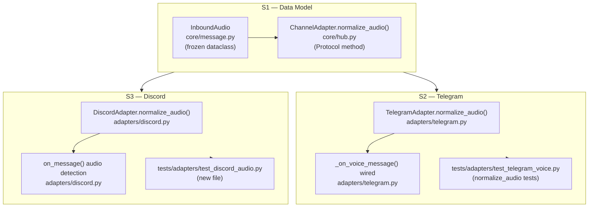
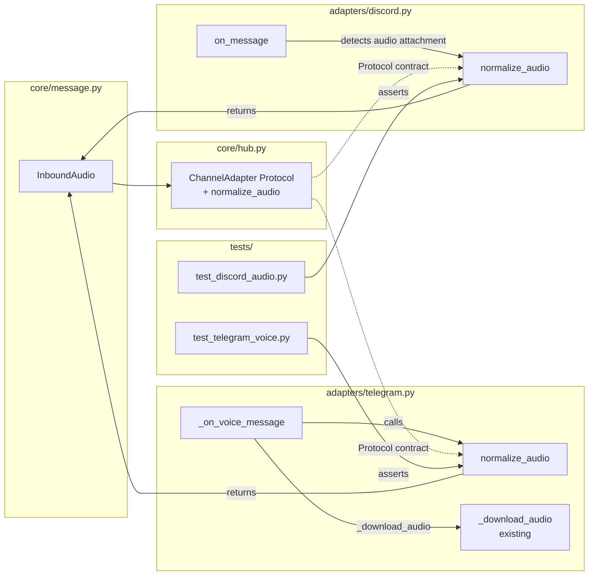

## Summary

Add `InboundAudio` frozen dataclass to `core/message.py` and `normalize_audio()` to the `ChannelAdapter` Protocol, then implement the method in both adapters (Telegram + Discord) with unit tests. Purely additive — mirrors the `InboundMessage` pattern from #137. Bus enqueue and STT integration are out of scope.

**Dependency:** #137 must be merged to `staging` before S1 begins (both issues update `ChannelAdapter` in `core/hub.py`).

## Architecture





## Agents

| Agent | Tasks | Files |
|---|---|---|
| backend-dev | T1.1, T1.2, T2.2, T2.3, T3.2, T3.3 | `core/message.py`, `core/hub.py`, `adapters/telegram.py`, `adapters/discord.py` |
| tester | T2.1, T2.4 (Telegram tests), T3.1, T3.4 (Discord tests) | `tests/adapters/test_telegram_voice.py`, `tests/adapters/test_discord_audio.py` |

## Reference Patterns

- `src/lyra/core/message.py` — frozen dataclass pattern (`TelegramContext`, `DiscordContext`)
- `src/lyra/adapters/telegram.py:183` — `_normalize()` for scope_id derivation pattern
- `src/lyra/adapters/telegram.py:269` — `_on_voice_message()` for existing temp-file lifecycle
- `tests/adapters/test_telegram_voice.py` — fixture pattern (`SimpleNamespace`, `patch.object`)

## Consistency Report

| Criterion | Task coverage |
|---|---|
| SC-1: `InboundAudio` dataclass in `core/message.py` | T1.1 |
| SC-2: `ChannelAdapter.normalize_audio()` Protocol | T1.2 |
| SC-3: `TelegramAdapter.normalize_audio()` voice + audio file | T2.2, T2.3 |
| SC-4: `_on_voice_message()` wired with try/finally | T2.3 |
| SC-5: `DiscordAdapter.normalize_audio()` audio attachment | T3.2 |
| SC-6: `on_message()` audio attachment detection | T3.3 |
| SC-7: Unit tests both adapters | T2.1, T2.4, T3.1, T3.4 |

Covered: 7/7. Untraced: none.

---

## Micro-Tasks

### Slice S1 — InboundAudio dataclass + ChannelAdapter Protocol

---

#### T1.1 [RED] Add `InboundAudio` frozen dataclass to `core/message.py`

**Description:** Add `InboundAudio` frozen dataclass alongside `InboundMessage` (post #137 merge). Add `InboundAudio` to module exports.

**File:** `src/lyra/core/message.py`

**Code snippet:**
```python
@dataclass(frozen=True)
class InboundAudio:
    platform: str
    bot_id: str
    scope_id: str
    user_id: str
    audio_bytes: bytes
    mime_type: str
    duration_ms: int | None
    file_id: str | None
    timestamp: datetime
```

**Verify:**
```bash
uv run python -c "from lyra.core.message import InboundAudio; from datetime import datetime, timezone; a = InboundAudio(platform='telegram', bot_id='main', scope_id='chat:1', user_id='tg:user:42', audio_bytes=b'data', mime_type='audio/ogg', duration_ms=3000, file_id='abc', timestamp=datetime.now(timezone.utc)); print(a.platform)"
```
**Expected output:** `telegram`

**Time estimate:** 3 min | **Agent:** backend-dev | **Spec trace:** SC-1, N1 | **Slice:** S1 | **Phase:** RED | **Difficulty:** 1

---

#### T1.2 [GREEN] Add `normalize_audio()` to `ChannelAdapter` Protocol in `core/hub.py`

**Description:** Add `normalize_audio(self, raw: Any, audio_bytes: bytes, mime_type: str) -> InboundAudio` as a Protocol method. Update imports to include `InboundAudio`.

**File:** `src/lyra/core/hub.py`

**Code snippet:**
```python
# In imports:
from .message import (
    ...,
    InboundAudio,   # add
)

# In ChannelAdapter Protocol:
def normalize_audio(
    self, raw: Any, audio_bytes: bytes, mime_type: str
) -> InboundAudio: ...
```

**Verify:**
```bash
uv run pyright src/lyra/core/hub.py
```
**Expected output:** `0 errors, 0 warnings`

**Time estimate:** 3 min | **Agent:** backend-dev | **Spec trace:** SC-2, N2 | **Slice:** S1 | **Phase:** GREEN | **Difficulty:** 1

---

#### T1.3 [RED-GATE] Verify S1 static checks pass

**Description:** Run typecheck + import smoke test for `InboundAudio` and `ChannelAdapter`.

**Verify:**
```bash
uv run pyright src/lyra/core/message.py src/lyra/core/hub.py && uv run python -c "from lyra.core.message import InboundAudio; from lyra.core.hub import ChannelAdapter; print('ok')"
```
**Expected output:** `0 errors` + `ok`

**Time estimate:** 2 min | **Agent:** tester | **Spec trace:** SC-1, SC-2 | **Slice:** S1 | **Phase:** RED-GATE | **Difficulty:** 1

---

### Slice S2 — Telegram normalize_audio() + _on_voice_message() wiring

---

#### T2.1 [RED] Write failing tests for `TelegramAdapter.normalize_audio()`

**Description:** Add tests to `test_telegram_voice.py` for `normalize_audio()`. Tests must fail (method not yet implemented). Cover: voice fixture → correct `scope_id`, `mime_type`, `duration_ms`, `file_id`; audio file fixture → `mime_type` from `msg.audio.mime_type`; private chat `scope_id="chat:42"`; topic chat `scope_id="chat:42:topic:7"`.

**File:** `tests/adapters/test_telegram_voice.py`

**Code snippet:**
```python
def _make_voice_msg_for_normalize(
    file_id="FILE1", duration=3, chat_id=42, user_id=7,
    topic_id=None, chat_type="private",
):
    return SimpleNamespace(
        chat=SimpleNamespace(id=chat_id, type=chat_type),
        from_user=SimpleNamespace(id=user_id, full_name="Alice", is_bot=False),
        voice=SimpleNamespace(file_id=file_id, duration=duration),
        audio=None,
        date=datetime.now(timezone.utc),
        message_thread_id=topic_id,
    )

def test_normalize_audio_voice_fields() -> None:
    adapter, _ = _make_adapter()
    msg = _make_voice_msg_for_normalize(file_id="F1", duration=3, chat_id=42)
    result = adapter.normalize_audio(msg, b"data", "audio/ogg")
    from lyra.core.message import InboundAudio
    assert isinstance(result, InboundAudio)
    assert result.scope_id == "chat:42"
    assert result.mime_type == "audio/ogg"
    assert result.duration_ms == 3000
    assert result.file_id == "F1"
    assert result.user_id == "tg:user:7"
    assert result.platform == "telegram"
```

**Verify:**
```bash
uv run pytest tests/adapters/test_telegram_voice.py::test_normalize_audio_voice_fields -x 2>&1 | grep -E "FAILED|AttributeError|passed"
```
**Expected output:** `FAILED` or `AttributeError` (RED phase — method does not exist yet)

**Time estimate:** 5 min | **Agent:** tester | **Spec trace:** SC-3, SC-7, N3 | **Slice:** S2 | **Phase:** RED | **Difficulty:** 2

---

#### T2.2 [GREEN] Implement `TelegramAdapter.normalize_audio()`

**Description:** Add `normalize_audio(self, msg, audio_bytes: bytes, mime_type: str) -> InboundAudio` to `TelegramAdapter`. Derive `scope_id` (same rules as `_normalize`), `user_id`, `duration_ms` (from `msg.voice.duration × 1000` if voice else `msg.audio.duration × 1000`), `file_id`, `timestamp`.

**File:** `src/lyra/adapters/telegram.py`

**Code snippet:**
```python
def normalize_audio(self, msg: Any, audio_bytes: bytes, mime_type: str) -> InboundAudio:
    chat_id = msg.chat.id
    topic_id = getattr(msg, "message_thread_id", None)
    scope_id = (
        f"chat:{chat_id}:topic:{topic_id}" if topic_id is not None
        else f"chat:{chat_id}"
    )
    voice = msg.voice or msg.audio or msg.video_note
    duration_ms: int | None = None
    if voice is not None:
        d = getattr(voice, "duration", None)
        if d is not None:
            duration_ms = int(d) * 1000
    file_id: str | None = getattr(voice, "file_id", None) if voice else None
    timestamp = msg.date
    if timestamp.tzinfo is None:
        timestamp = timestamp.replace(tzinfo=timezone.utc)
    return InboundAudio(
        platform=Platform.TELEGRAM.value,
        bot_id=self._bot_id,
        scope_id=scope_id,
        user_id=f"tg:user:{msg.from_user.id}",
        audio_bytes=audio_bytes,
        mime_type=mime_type,
        duration_ms=duration_ms,
        file_id=file_id,
        timestamp=timestamp,
    )
```

**Verify:**
```bash
uv run pytest tests/adapters/test_telegram_voice.py -x -k "normalize_audio"
```
**Expected output:** all `normalize_audio` tests pass

**Time estimate:** 5 min | **Agent:** backend-dev | **Spec trace:** SC-3, N3 | **Slice:** S2 | **Phase:** GREEN | **Difficulty:** 2

---

#### T2.3 [GREEN] Wire `_on_voice_message()` to call `normalize_audio()` with try/finally

**Description:** After `_download_audio()` returns `(tmp_path, duration_seconds)`, read bytes from `tmp_path` in a `try/finally` block (delete temp in `finally`). Derive `mime_type` (voice → `"audio/ogg"`; audio file → `msg.audio.mime_type or "audio/ogg"`). Call `normalize_audio(msg, audio_bytes, mime_type)`. Store result as local `inbound_audio` (currently unused — bus enqueue is future).

**File:** `src/lyra/adapters/telegram.py`

**Code snippet:**
```python
# After _download_audio() call:
try:
    audio_bytes = tmp_path.read_bytes()
finally:
    tmp_path.unlink(missing_ok=True)

voice = msg.voice or msg.audio or msg.video_note
if msg.voice or msg.video_note:
    mime_type = "audio/ogg"
else:
    mime_type = getattr(msg.audio, "mime_type", None) or "audio/ogg"

inbound_audio = self.normalize_audio(msg, audio_bytes, mime_type)
# TODO(#140-follow-on): enqueue inbound_audio onto InboundAudioBus
```

**Verify:**
```bash
uv run pytest tests/adapters/test_telegram_voice.py -x
```
**Expected output:** all Telegram voice tests pass (existing + new normalize_audio tests)

**Time estimate:** 5 min | **Agent:** backend-dev | **Spec trace:** SC-4, N4 | **Slice:** S2 | **Phase:** GREEN | **Difficulty:** 2

---

#### T2.4 [RED-GATE] Run all Telegram voice tests

**Verify:**
```bash
uv run pytest tests/adapters/test_telegram_voice.py -v
```
**Expected output:** all tests pass, 0 failures

**Time estimate:** 2 min | **Agent:** tester | **Spec trace:** SC-3, SC-4, SC-7 | **Slice:** S2 | **Phase:** RED-GATE | **Difficulty:** 1

---

### Slice S3 — Discord normalize_audio() + on_message() audio detection

---

#### T3.1 [RED] Write failing tests for `DiscordAdapter.normalize_audio()`

**Description:** Create `tests/adapters/test_discord_audio.py`. Tests must fail (method not yet implemented). Cover: audio attachment fixture → correct `scope_id`, `mime_type`, `duration_ms=None`, `file_id=None`; channel scope `scope_id="channel:333"`; thread scope `scope_id="thread:555"`; `on_message()` calls `normalize_audio()` when audio attachment detected; non-audio attachment does not trigger `normalize_audio()`.

**File:** `tests/adapters/test_discord_audio.py` (new)

**Code snippet:**
```python
"""Tests for Discord audio attachment normalization (issue #140)."""
from __future__ import annotations
from datetime import datetime, timezone
from types import SimpleNamespace
from unittest.mock import AsyncMock, MagicMock
import discord
import pytest
from lyra.adapters.discord import DiscordAdapter
from lyra.core.message import InboundAudio

def _make_audio_attachment(content_type="audio/ogg"):
    return SimpleNamespace(content_type=content_type, url="https://cdn.example/audio.ogg")

def _make_discord_msg(attachments=None, channel_type="text", thread_id=None):
    channel = SimpleNamespace(
        id=333,
        send=AsyncMock(),
        type=discord.ChannelType.text,
    )
    if channel_type == "thread":
        channel = discord.Thread.__new__(discord.Thread)
        object.__setattr__(channel, "id", thread_id or 555)
        object.__setattr__(channel, "send", AsyncMock())
    return SimpleNamespace(
        guild=SimpleNamespace(id=111),
        channel=channel,
        author=SimpleNamespace(id=42, name="Alice", display_name="Alice", bot=False),
        content="",
        created_at=datetime.now(timezone.utc),
        id=777,
        mentions=[],
        attachments=attachments or [],
    )

def test_normalize_audio_attachment_fields() -> None:
    hub = MagicMock()
    adapter = DiscordAdapter(hub=hub, bot_id="main", intents=discord.Intents.none())
    msg = _make_discord_msg(attachments=[_make_audio_attachment("audio/ogg")])
    result = adapter.normalize_audio(msg, b"bytes", "audio/ogg")
    assert isinstance(result, InboundAudio)
    assert result.scope_id == "channel:333"
    assert result.mime_type == "audio/ogg"
    assert result.duration_ms is None
    assert result.file_id is None
    assert result.user_id == "dc:user:42"
    assert result.platform == "discord"
```

**Verify:**
```bash
uv run pytest tests/adapters/test_discord_audio.py::test_normalize_audio_attachment_fields -x 2>&1 | grep -E "FAILED|AttributeError|passed"
```
**Expected output:** `FAILED` or `AttributeError` (RED phase)

**Time estimate:** 5 min | **Agent:** tester | **Spec trace:** SC-5, SC-7, N5 | **Slice:** S3 | **Phase:** RED | **Difficulty:** 2

---

#### T3.2 [GREEN] Implement `DiscordAdapter.normalize_audio()`

**Description:** Add `normalize_audio(self, message, audio_bytes: bytes, mime_type: str) -> InboundAudio` to `DiscordAdapter`. Derive `scope_id` (same rules as `_normalize`), `user_id`, `timestamp`. `duration_ms=None`, `file_id=None`.

**File:** `src/lyra/adapters/discord.py`

**Code snippet:**
```python
def normalize_audio(self, message: Any, audio_bytes: bytes, mime_type: str) -> InboundAudio:
    # Derive scope_id (mirrors _normalize logic)
    if isinstance(message.channel, discord.Thread):
        scope_id = f"thread:{message.channel.id}"
    else:
        scope_id = f"channel:{message.channel.id}"
    return InboundAudio(
        platform=Platform.DISCORD.value,
        bot_id=self._bot_id,
        scope_id=scope_id,
        user_id=f"dc:user:{message.author.id}",
        audio_bytes=audio_bytes,
        mime_type=mime_type,
        duration_ms=None,
        file_id=None,
        timestamp=message.created_at,
    )
```

**Verify:**
```bash
uv run pytest tests/adapters/test_discord_audio.py -x -k "normalize_audio"
```
**Expected output:** `normalize_audio` tests pass

**Time estimate:** 4 min | **Agent:** backend-dev | **Spec trace:** SC-5, N5 | **Slice:** S3 | **Phase:** GREEN | **Difficulty:** 2

---

#### T3.3 [GREEN] Add audio attachment detection to `DiscordAdapter.on_message()`

**Description:** After bot-message filter and before `_normalize()` call, detect audio attachments. If any attachment has `content_type.startswith("audio/")`, download bytes (using `aiohttp` session or `attachment.read()`), call `normalize_audio(message, audio_bytes, mime_type)`. Store result as local `inbound_audio` (currently unused — bus enqueue is future). Non-audio messages proceed unchanged through existing `_normalize()` path.

**File:** `src/lyra/adapters/discord.py`

**Code snippet:**
```python
# In on_message(), after bot filter:
audio_attachment = next(
    (a for a in (message.attachments or [])
     if getattr(a, "content_type", "") and a.content_type.startswith("audio/")),
    None,
)
if audio_attachment is not None:
    try:
        audio_bytes = await audio_attachment.read()
        mime_type = audio_attachment.content_type
        inbound_audio = self.normalize_audio(message, audio_bytes, mime_type)
        # TODO(#140-follow-on): enqueue inbound_audio onto InboundAudioBus
    except Exception:
        log.exception("Failed to read audio attachment message_id=%s", message.id)
```

**Verify:**
```bash
uv run pytest tests/adapters/test_discord_audio.py -v
```
**Expected output:** all Discord audio tests pass

**Time estimate:** 5 min | **Agent:** backend-dev | **Spec trace:** SC-6, N6 | **Slice:** S3 | **Phase:** GREEN | **Difficulty:** 2

---

#### T3.4 [RED-GATE] Run full test suite

**Verify:**
```bash
uv run pytest
```
**Expected output:** all tests pass, 0 failures

**Time estimate:** 2 min | **Agent:** tester | **Spec trace:** SC-5, SC-6, SC-7 | **Slice:** S3 | **Phase:** RED-GATE | **Difficulty:** 1
