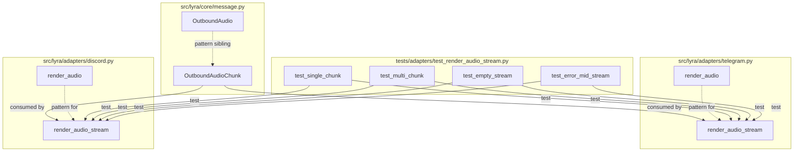
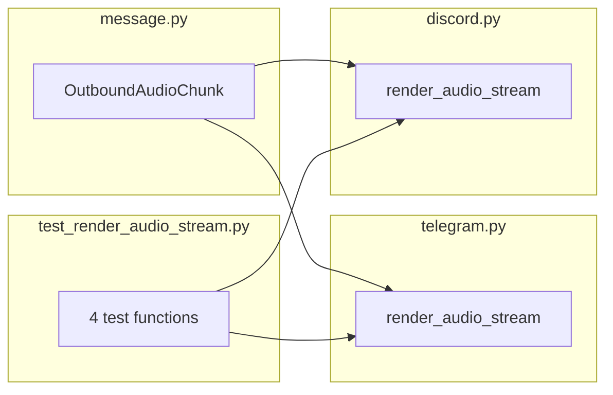

## Summary

Add `OutboundAudioChunk` frozen dataclass to the bus message types, then implement `render_audio_stream()` on both Telegram and Discord adapters using buffer-and-send strategy. Unit tests follow the `test_render_audio.py` pattern.

## Architecture





## Agents

| Agent | Tasks | Files |
|-------|-------|-------|
| backend-dev | 3 | `message.py`, `telegram.py`, `discord.py` |
| tester | 1 | `test_render_audio_stream.py` |

## Reference Patterns

- `render_audio()` in `src/lyra/adapters/telegram.py:731` — buffer + send_voice pattern
- `render_audio()` in `src/lyra/adapters/discord.py:633` — buffer + discord.File pattern
- `tests/adapters/test_render_audio.py` — test structure, helpers, mocking conventions

## Consistency Report

| Spec criterion | Task(s) |
|----------------|---------|
| SC-1: OutboundAudioChunk dataclass | T1 |
| SC-2: render_audio_stream on both adapters | T2, T3 |
| SC-3: Telegram buffer-and-send | T2 |
| SC-4: Discord buffer-and-send | T3 |
| SC-5: Partial stream error handling | T2, T3 |
| SC-6: Unit tests | T4 |
| SC-7: caption/reply_to_id from final chunk | T2, T3 |
| SC-8: pyright passes | all (verify) |

**Coverage: 8/8 criteria mapped. 0 uncovered. 0 untraced.**

## Micro-Tasks

### Slice 1 — Chunk dataclass

#### T1: Add OutboundAudioChunk to message.py [P] — backend-dev
**Spec trace:** SC-1
**Phase:** RED → GREEN
**Difficulty:** 1
**Time:** 2 min

**Description:** Add `OutboundAudioChunk` frozen dataclass after `OutboundAudio` in `src/lyra/core/message.py`.

**File:** `src/lyra/core/message.py`

**Code snippet:**
```python
@dataclass(frozen=True)
class OutboundAudioChunk:
    """A single chunk of streamed outbound audio.

    Produced incrementally by TTS pipelines; consumed by adapter
    render_audio_stream(). Adapters buffer chunks and send when is_final=True.
    """

    chunk_bytes: bytes = field(repr=False)
    session_id: str
    chunk_index: int
    is_final: bool = False
    mime_type: str = "audio/ogg"
    caption: str | None = None
    reply_to_id: str | None = None
```

**Verify:**
```bash
uv run python -c "from lyra.core.message import OutboundAudioChunk; c = OutboundAudioChunk(chunk_bytes=b'x', session_id='s1', chunk_index=0, is_final=True); print(c)"
```
**Expected:** Prints frozen dataclass repr without error.

---

### Slice 2 — Telegram buffer-and-send

#### T2: Implement Telegram render_audio_stream() — backend-dev
**Spec trace:** SC-2, SC-3, SC-5, SC-7
**Phase:** GREEN
**Difficulty:** 3
**Time:** 5 min
**Depends on:** T1

**Description:** Add `render_audio_stream()` to `TelegramAdapter` in `src/lyra/adapters/telegram.py`, following the `render_audio()` pattern. Buffer all chunks into BytesIO, send as voice note on `is_final`. Wrap `async for` in try/except for error recovery. Use `caption` and `reply_to_id` from final chunk.

**File:** `src/lyra/adapters/telegram.py`

**Code snippet:**
```python
async def render_audio_stream(
    self,
    chunks: AsyncIterator[OutboundAudioChunk],
    inbound: InboundMessage,
) -> None:
    """Buffer streamed audio chunks and send as a single Telegram voice note."""
    if inbound.platform != Platform.TELEGRAM.value:
        log.error("render_audio_stream() called with non-telegram msg id=%s", inbound.id)
        return
    chat_id = inbound.platform_meta.get("chat_id")
    if chat_id is None:
        log.error("render_audio_stream: missing 'chat_id' for msg id=%s", inbound.id)
        return

    buf = BytesIO()
    caption: str | None = None
    reply_to_id_raw: str | None = None
    mime_type = "audio/ogg"

    try:
        async for chunk in chunks:
            buf.write(chunk.chunk_bytes)
            caption = chunk.caption
            reply_to_id_raw = chunk.reply_to_id
            mime_type = chunk.mime_type
            if chunk.is_final:
                break
    except Exception:
        log.warning("Audio stream interrupted, sending partial buffer for msg id=%s", inbound.id)

    if buf.tell() == 0:
        return

    buf.seek(0)
    # Reuse render_audio() by constructing OutboundAudio from buffered data
    assembled = OutboundAudio(
        audio_bytes=buf.read(),
        mime_type=mime_type,
        caption=caption,
        reply_to_id=reply_to_id_raw,
    )
    await self.render_audio(assembled, inbound)
```

**Verify:**
```bash
uv run pyright src/lyra/adapters/telegram.py
```
**Expected:** 0 errors.

---

### Slice 2 (parallel) — Discord buffer-and-send

#### T3: Implement Discord render_audio_stream() [P with T2] — backend-dev
**Spec trace:** SC-2, SC-4, SC-5, SC-7
**Phase:** GREEN
**Difficulty:** 3
**Time:** 5 min
**Depends on:** T1

**Description:** Add `render_audio_stream()` to `DiscordAdapter` in `src/lyra/adapters/discord.py`, same buffer-and-send pattern. Delegate to `render_audio()` after assembling.

**File:** `src/lyra/adapters/discord.py`

**Code snippet:**
```python
async def render_audio_stream(
    self,
    chunks: AsyncIterator[OutboundAudioChunk],
    inbound: InboundMessage,
) -> None:
    """Buffer streamed audio chunks and send as a single Discord file attachment."""
    if inbound.platform != Platform.DISCORD.value:
        log.error("render_audio_stream() called with non-discord msg id=%s", inbound.id)
        return

    buf = BytesIO()
    caption: str | None = None
    reply_to_id_raw: str | None = None
    mime_type = "audio/ogg"

    try:
        async for chunk in chunks:
            buf.write(chunk.chunk_bytes)
            caption = chunk.caption
            reply_to_id_raw = chunk.reply_to_id
            mime_type = chunk.mime_type
            if chunk.is_final:
                break
    except Exception:
        log.warning("Audio stream interrupted, sending partial buffer for msg id=%s", inbound.id)

    if buf.tell() == 0:
        return

    buf.seek(0)
    assembled = OutboundAudio(
        audio_bytes=buf.read(),
        mime_type=mime_type,
        caption=caption,
        reply_to_id=reply_to_id_raw,
    )
    await self.render_audio(assembled, inbound)
```

**Verify:**
```bash
uv run pyright src/lyra/adapters/discord.py
```
**Expected:** 0 errors.

---

### Slice 3 — Tests

#### T4: Unit tests for render_audio_stream() — tester
**Spec trace:** SC-6
**Phase:** GREEN
**Difficulty:** 3
**Time:** 8 min
**Depends on:** T2, T3

**Description:** Create `tests/adapters/test_render_audio_stream.py` following `test_render_audio.py` conventions. Cover:
1. Single-chunk stream (is_final=True on first chunk) → sends voice note / file
2. Multi-chunk stream (3 chunks, last is_final) → buffers all, sends once
3. Empty stream (no chunks yielded) → no send call
4. Error mid-stream (producer raises after 2 chunks) → sends partial buffer with warning log

Use same `_tg_msg()` / `_dc_msg()` helpers from test_render_audio.py (or duplicate).

**File:** `tests/adapters/test_render_audio_stream.py`

**Verify:**
```bash
uv run pytest tests/adapters/test_render_audio_stream.py -v
```
**Expected:** All tests pass.

---

### RED-GATE: Slice 3 complete → run full verify

```bash
uv run pyright && uv run pytest tests/ -x -q
```
**Expected:** 0 pyright errors, all tests pass.
