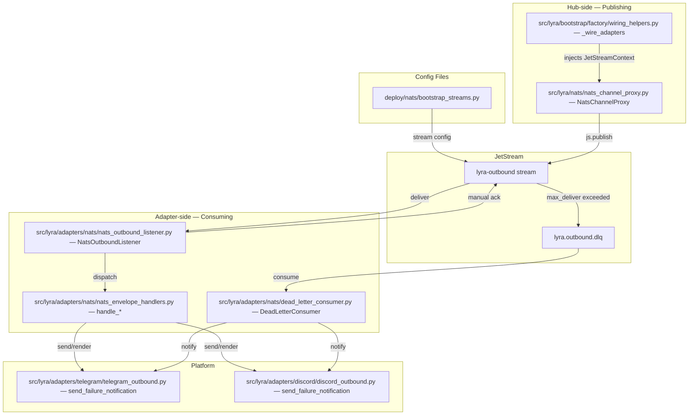
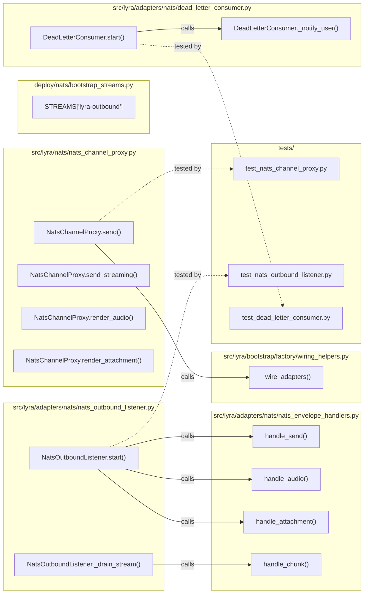

## Summary

Implement JetStream persistence for outbound NATS topics with explicit adapter ack, bounded retry, and dead-letter user notification. Three slices: hub-side publish (V1), adapter subscribe + ack (V2), dead-letter + notification (V3).

## Architecture

### Data Flow

### File × Function Map

## Bootstrap Context

Shape 1 from [analysis](artifacts/analyses/1482-outbound-audio-reliability-analysis.mdx): JetStream persistence + explicit ack + retry + dead-letter user notification. JetStream already in stack (`TurnPublisher`, `JetStreamAuditSink`). Outbound topics currently use core NATS `nc.publish()` / `nc.subscribe()`.

## Agents

| Agent | Task count | Files |
|-------|-----------|-------|
| devops-A | 1 | `deploy/nats/bootstrap_streams.py` |
| backend-dev-A | 2 | `src/lyra/nats/nats_channel_proxy.py`, `src/lyra/bootstrap/factory/wiring_helpers.py` |
| backend-dev-B | 4 | `src/lyra/adapters/nats/nats_outbound_listener.py`, `src/lyra/adapters/nats/nats_envelope_handlers.py`, `src/lyra/bootstrap/factory/wiring_helpers.py` |
| backend-dev-C | 2 | `src/lyra/adapters/nats/dead_letter_consumer.py`, `src/lyra/bootstrap/factory/wiring_helpers.py` |
| backend-dev-D | 2 | `src/lyra/adapters/telegram/telegram_outbound.py`, `src/lyra/adapters/discord/discord_outbound.py` |
| backend-dev-E | 2 | `src/lyra/outbound/error_handler.py`, `src/lyra/nats/nats_channel_proxy.py` |
| tester-A | 2 | `tests/nats/test_nats_channel_proxy.py` |
| tester-B | 3 | `tests/adapters/nats/test_nats_outbound_listener.py` |
| tester-C | 3 | `tests/adapters/nats/test_dead_letter_consumer.py` |
| tester-D | 2 | `tests/integration/test_outbound_delivery.py` |

## Wave Structure

6 waves, max 4 parallel agents. Elapsed ~1 sprint vs ~3 sprints sequential.

| Wave | Trigger | Agents | Tasks |
|------|---------|--------|-------|
| 1 | start | 4 ∥ | tester-A: T1, T2 · tester-B: T6, T7, T8 · tester-C: T13, T14, T15 · devops-A: T3 |
| 2 | Wave 1 done | 1 | backend-dev-A: T4, T5 |
| 3 | Wave 2 done | 1 | backend-dev-B: T9, T10, T11, T12 |
| 4 | Wave 3 done | 1 | backend-dev-C: T16, T17 |
| 5 | Wave 4 done | 2 ∥ | backend-dev-D: T18, T19 · backend-dev-E: T20, T21 |
| 6 | Wave 5 done | 1 | tester-D: T22, T23 |

### Budget — per task

| Task | Items | Class | Est. ops | Split? |
|------|-------|-------|----------|--------|
| T1 | 1 | bounded | 2 | — |
| T2 | 1 | bounded | 2 | — |
| T3 | 1 | bounded | 2 | — |
| T4 | 1 | judgmental | 4 | — |
| T5 | 1 | bounded | 3 | — |
| T6 | 1 | bounded | 2 | — |
| T7 | 1 | bounded | 3 | — |
| T8 | 1 | bounded | 3 | — |
| T9 | 1 | judgmental | 4 | — |
| T10 | 3 | judgmental | 6 | — |
| T11 | 1 | judgmental | 4 | — |
| T12 | 1 | bounded | 3 | — |
| T13 | 1 | bounded | 2 | — |
| T14 | 1 | bounded | 2 | — |
| T15 | 1 | bounded | 2 | — |
| T16 | 1 | judgmental | 5 | — |
| T17 | 1 | bounded | 3 | — |
| T18 | 1 | bounded | 3 | — |
| T19 | 1 | bounded | 3 | — |
| T20 | 1 | bounded | 3 | — |
| T21 | 1 | judgmental | 5 | — |
| T22 | 1 | bounded | 3 | — |
| T23 | 1 | bounded | 3 | — |

**Total estimated ops: 70**

### Budget — per agent instance

| Instance | Tasks | Σ ops | Subjects | Split? |
|----------|-------|-------|----------|--------|
| devops-A | T3 | 2 | stream | — |
| backend-dev-A | T4, T5 | 7 | transport, wiring | — |
| backend-dev-B | T9, T10, T11, T12 | 17 | adapter, wiring | — |
| backend-dev-C | T16, T17 | 8 | deadletter, wiring | — |
| backend-dev-D | T18, T19 | 6 | telegram, discord | — |
| backend-dev-E | T20, T21 | 8 | error_handler, compat | — |
| tester-A | T1, T2 | 4 | transport_test | — |
| tester-B | T6, T7, T8 | 8 | adapter_test | — |
| tester-C | T13, T14, T15 | 6 | notification_test | — |
| tester-D | T22, T23 | 6 | integration_test | — |

## Consistency Report

- Criteria covered: 12/12
- Uncovered criteria: none
- Tasks without spec backing: none
- Gold plating exemptions applied: 0

## Micro-Tasks

### Slice V1: JetStream stream + hub publish

#### Task 1: Write test for lyra-outbound stream config [P] → tester-A
- **File:** `tests/nats/test_bootstrap_streams.py`
- **Snippet:** `def test_lyra_outbound_stream_exists(): assert "lyra-outbound" in STREAMS`
- **Verify:** `grep -q 'lyra-outbound' tests/nats/test_bootstrap_streams.py` (ready)
- **Expected:** Test file references lyra-outbound stream
- **Time:** 2 min
- **Difficulty:** 1
- **Traces:** AC-1
- **Phase:** RED

#### Task 2: Write test for NatsChannelProxy js.publish [P] → tester-A
- **File:** `tests/nats/test_nats_channel_proxy.py`
- **Snippet:** `async def test_send_uses_jetstream(): ...`
- **Verify:** `grep -q 'js.publish' tests/nats/test_nats_channel_proxy.py` (ready)
- **Expected:** Test mocks JetStreamContext.publish
- **Time:** 2 min
- **Difficulty:** 2
- **Traces:** AC-2
- **Phase:** RED

#### RED-GATE: RED complete V1
- **Verify:** T1 and T2 marked complete
- **Phase:** RED-GATE

#### Task 3: Add lyra-outbound stream config [P] → devops-A
- **File:** `deploy/nats/bootstrap_streams.py`
- **Snippet:** `"lyra-outbound": {"subjects": ["lyra.outbound.>"], ...}`
- **Verify:** `grep -q 'lyra-outbound' deploy/nats/bootstrap_streams.py` (ready)
- **Expected:** Stream config present with correct subjects and retention
- **Time:** 2 min
- **Difficulty:** 1
- **Traces:** AC-1, S1
- **Phase:** GREEN

#### Task 4: Switch NatsChannelProxy to js.publish → backend-dev-A
- **File:** `src/lyra/nats/nats_channel_proxy.py`
- **Snippet:** `await self._js.publish(subject, payload)` in send(), send_streaming(), render_audio(), render_attachment()
- **Verify:** `grep -q '_js.publish' src/lyra/nats/nats_channel_proxy.py` (ready)
- **Expected:** All publish calls use JetStreamContext
- **Time:** 5 min
- **Difficulty:** 3
- **Traces:** AC-2, N2
- **Phase:** GREEN

#### Task 5: Wire JetStreamContext into NatsChannelProxy → backend-dev-A
- **File:** `src/lyra/bootstrap/factory/wiring_helpers.py`
- **Snippet:** `js = nc.jetstream(); proxy = NatsChannelProxy(nc, ..., js=js)`
- **Verify:** `grep -q 'jetstream()' src/lyra/bootstrap/factory/wiring_helpers.py` (ready)
- **Expected:** JetStreamContext injected into NatsChannelProxy constructor
- **Time:** 3 min
- **Difficulty:** 2
- **Traces:** AC-2, N2
- **Phase:** GREEN

### Slice V2: Adapter subscribe + manual ack

#### Task 6: Write test for js.subscribe with manual ack [P] → tester-B
- **File:** `tests/adapters/nats/test_nats_outbound_listener.py`
- **Snippet:** `async def test_subscribe_uses_jetstream(): assert sub.manual_ack is True`
- **Verify:** `grep -q 'manual_ack' tests/adapters/nats/test_nats_outbound_listener.py` (ready)
- **Expected:** Test asserts manual_ack config
- **Time:** 2 min
- **Difficulty:** 1
- **Traces:** AC-3
- **Phase:** RED

#### Task 7: Write test for ack after successful dispatch [P] → tester-B
- **File:** `tests/adapters/nats/test_nats_outbound_listener.py`
- **Snippet:** `async def test_ack_on_success(): assert msg.ack.called`
- **Verify:** `grep -q 'ack.called' tests/adapters/nats/test_nats_outbound_listener.py` (ready)
- **Expected:** Test asserts ack called after successful send
- **Time:** 3 min
- **Difficulty:** 2
- **Traces:** AC-4
- **Phase:** RED

#### Task 8: Write test for nak on dispatch failure [P] → tester-B
- **File:** `tests/adapters/nats/test_nats_outbound_listener.py`
- **Snippet:** `async def test_nak_on_failure(): assert msg.nak.called`
- **Verify:** `grep -q 'nak.called' tests/adapters/nats/test_nats_outbound_listener.py` (ready)
- **Expected:** Test asserts nak called on send failure
- **Time:** 3 min
- **Difficulty:** 2
- **Traces:** AC-5
- **Phase:** RED

#### RED-GATE: RED complete V2
- **Verify:** T6, T7, T8 marked complete
- **Phase:** RED-GATE

#### Task 9: Switch NatsOutboundListener to js.subscribe with manual ack → backend-dev-B
- **File:** `src/lyra/adapters/nats/nats_outbound_listener.py`
- **Snippet:** `self._sub = await self._js.subscribe(self._subject, ..., config=ConsumerConfig(manual_ack=True))`
- **Verify:** `grep -q 'js.subscribe' src/lyra/adapters/nats/nats_outbound_listener.py` (ready)
- **Expected:** Subscription uses JetStream with manual_ack
- **Time:** 4 min
- **Difficulty:** 3
- **Traces:** AC-3, N3
- **Phase:** GREEN

#### Task 10: Add ack in envelope handlers after successful dispatch → backend-dev-B
- **File:** `src/lyra/adapters/nats/nats_envelope_handlers.py`
- **Snippet:** `await listener._adapter.send(...); msg.ack()` in handle_send, handle_audio, handle_attachment
- **Verify:** `grep -q 'ack()' src/lyra/adapters/nats/nats_envelope_handlers.py` (ready)
- **Expected:** ack() called after successful platform API dispatch
- **Time:** 6 min
- **Difficulty:** 3
- **Traces:** AC-4, N3
- **Phase:** GREEN

#### Task 11: Add ack in _drain_stream after successful streaming → backend-dev-B
- **File:** `src/lyra/adapters/nats/nats_outbound_listener.py`
- **Snippet:** `await self._adapter.send_streaming(...); msg.ack()` in _drain_stream
- **Verify:** `grep -q 'ack()' src/lyra/adapters/nats/nats_outbound_listener.py` (ready)
- **Expected:** ack() called after successful streaming dispatch
- **Time:** 4 min
- **Difficulty:** 3
- **Traces:** AC-4, AC-9, N3
- **Phase:** GREEN

#### Task 12: Wire JetStreamContext into NatsOutboundListener → backend-dev-B
- **File:** `src/lyra/bootstrap/factory/wiring_helpers.py`
- **Snippet:** `js = nc.jetstream(); listener = NatsOutboundListener(nc, ..., js=js)`
- **Verify:** `grep -q 'NatsOutboundListener.*js=' src/lyra/bootstrap/factory/wiring_helpers.py` (ready)
- **Expected:** JetStreamContext injected into NatsOutboundListener constructor
- **Time:** 3 min
- **Difficulty:** 2
- **Traces:** AC-3, N3
- **Phase:** GREEN

### Slice V3: Dead-letter + user notification

#### Task 13: Write test for DeadLetterConsumer subscribe [P] → tester-C
- **File:** `tests/adapters/nats/test_dead_letter_consumer.py`
- **Snippet:** `async def test_subscribe_dlq(): assert consumer._sub is not None`
- **Verify:** `grep -q 'DeadLetterConsumer' tests/adapters/nats/test_dead_letter_consumer.py` (ready)
- **Expected:** Test references DeadLetterConsumer
- **Time:** 2 min
- **Difficulty:** 1
- **Traces:** AC-6
- **Phase:** RED

#### Task 14: Write test for Telegram failure notification [P] → tester-C
- **File:** `tests/adapters/nats/test_dead_letter_consumer.py`
- **Snippet:** `async def test_notify_telegram(): assert adapter.send_failure_notification.called`
- **Verify:** `grep -q 'send_failure_notification' tests/adapters/nats/test_dead_letter_consumer.py` (ready)
- **Expected:** Test asserts notification sent on Telegram
- **Time:** 2 min
- **Difficulty:** 1
- **Traces:** AC-7
- **Phase:** RED

#### Task 15: Write test for Discord failure notification [P] → tester-C
- **File:** `tests/adapters/nats/test_dead_letter_consumer.py`
- **Snippet:** `async def test_notify_discord(): assert adapter.send_failure_notification.called`
- **Verify:** `grep -q 'send_failure_notification' tests/adapters/nats/test_dead_letter_consumer.py` (ready)
- **Expected:** Test asserts notification sent on Discord
- **Time:** 2 min
- **Difficulty:** 1
- **Traces:** AC-8
- **Phase:** RED

#### RED-GATE: RED complete V3
- **Verify:** T13, T14, T15 marked complete
- **Phase:** RED-GATE

#### Task 16: Create DeadLetterConsumer class → backend-dev-C
- **File:** `src/lyra/adapters/nats/dead_letter_consumer.py`
- **Snippet:** `class DeadLetterConsumer: async def start(self): self._sub = await self._js.subscribe(...) async def _notify_user(self, msg): ...`
- **Verify:** `grep -q 'class DeadLetterConsumer' src/lyra/adapters/nats/dead_letter_consumer.py` (ready)
- **Expected:** DeadLetterConsumer class with start(), stop(), _notify_user()
- **Time:** 5 min
- **Difficulty:** 3
- **Traces:** AC-6, N4
- **Phase:** GREEN

#### Task 17: Wire DeadLetterConsumer into bootstrap → backend-dev-C
- **File:** `src/lyra/bootstrap/factory/wiring_helpers.py`
- **Snippet:** `dlq = DeadLetterConsumer(js, ...); await dlq.start()`
- **Verify:** `grep -q 'DeadLetterConsumer' src/lyra/bootstrap/factory/wiring_helpers.py` (ready)
- **Expected:** DeadLetterConsumer instantiated and started in bootstrap
- **Time:** 3 min
- **Difficulty:** 2
- **Traces:** AC-6, N4
- **Phase:** GREEN

#### Task 18: Add send_failure_notification to Telegram → backend-dev-D
- **File:** `src/lyra/adapters/telegram/telegram_outbound.py`
- **Snippet:** `async def send_failure_notification(adapter, original_msg, reason): ...`
- **Verify:** `grep -q 'send_failure_notification' src/lyra/adapters/telegram/telegram_outbound.py` (ready)
- **Expected:** send_failure_notification function present
- **Time:** 3 min
- **Difficulty:** 2
- **Traces:** AC-7, S2
- **Phase:** GREEN

#### Task 19: Add send_failure_notification to Discord → backend-dev-D
- **File:** `src/lyra/adapters/discord/discord_outbound.py`
- **Snippet:** `async def send_failure_notification(adapter, original_msg, reason): ...`
- **Verify:** `grep -q 'send_failure_notification' src/lyra/adapters/discord/discord_outbound.py` (ready)
- **Expected:** send_failure_notification function present
- **Time:** 3 min
- **Difficulty:** 2
- **Traces:** AC-8, S3
- **Phase:** GREEN

#### Task 20: Add failure notification callback to error_handler → backend-dev-E
- **File:** `src/lyra/outbound/error_handler.py`
- **Snippet:** `def get_failure_notification_text(self): return self._get_msg("error_delivery_failed", "⚠️ Message delivery failed...")`
- **Verify:** `grep -q 'error_delivery_failed' src/lyra/outbound/error_handler.py` (ready)
- **Expected:** Notification text helper in OutboundErrorHandler
- **Time:** 3 min
- **Difficulty:** 2
- **Traces:** AC-7, AC-8
- **Phase:** GREEN

#### Task 21: Add backward compatibility dual-publish mode → backend-dev-E
- **File:** `src/lyra/nats/nats_channel_proxy.py`
- **Snippet:** `if self._dual_publish: await self._nc.publish(subject, payload); await self._js.publish(subject, payload)`
- **Verify:** `grep -q 'dual_publish' src/lyra/nats/nats_channel_proxy.py` (ready)
- **Expected:** Dual-publish flag present, both core NATS and JetStream publish
- **Time:** 5 min
- **Difficulty:** 3
- **Traces:** AC-10
- **Phase:** GREEN

### REFACTOR: Backward compatibility + metrics

#### Task 22: Write integration test for backward compatibility → tester-D
- **File:** `tests/integration/test_outbound_delivery.py`
- **Snippet:** `async def test_old_adapter_receives_message(): ...`
- **Verify:** `grep -q 'backward_compat' tests/integration/test_outbound_delivery.py` (ready)
- **Expected:** Integration test covers dual-publish migration
- **Time:** 3 min
- **Difficulty:** 2
- **Traces:** AC-10
- **Phase:** GREEN

#### Task 23: Write test for delivery metrics → tester-D
- **File:** `tests/integration/test_outbound_delivery.py`
- **Snippet:** `async def test_delivery_metrics(): assert metrics.success_count > 0`
- **Verify:** `grep -q 'delivery_metrics' tests/integration/test_outbound_delivery.py` (ready)
- **Expected:** Test asserts delivery metrics exposed
- **Time:** 3 min
- **Difficulty:** 2
- **Traces:** AC-12
- **Phase:** GREEN

## Task Seeding Blueprint

<!-- Used by /implement to seed TaskCreate calls on session start.
     Format: T{n} | agent-instance | blockedBy | subject
     blockedBy refs T-numbers within this list (not session task IDs).
     Agent instances are named (tester-A/B, backend-dev-A/B/C, devops-A/B)
     so parallel tasks map to distinct spawned agents.
     Seed in wave order; within a wave all rows are parallel (∥). -->

### Wave 1 — no deps, 4 agents ∥

| Task | Agent instance | blockedBy | Subject |
|------|---------------|-----------|---------|
| T1 | tester-A | — | transport_test |
| T2 | tester-A | — | transport_test |
| T3 | devops-A | — | stream |
| T6 | tester-B | — | adapter_test |
| T7 | tester-B | — | adapter_test |
| T8 | tester-B | — | adapter_test |
| T13 | tester-C | — | notification_test |
| T14 | tester-C | — | notification_test |
| T15 | tester-C | — | notification_test |

### Wave 2 — after Wave 1 (T1, T2, T3), 1 agent

| Task | Agent instance | blockedBy | Subject |
|------|---------------|-----------|---------|
| T4 | backend-dev-A | T1, T2, T3 | transport |
| T5 | backend-dev-A | T1, T2, T3 | wiring |

### Wave 3 — after Wave 2 (T4, T5) + Wave 1 (T6, T7, T8), 1 agent

| Task | Agent instance | blockedBy | Subject |
|------|---------------|-----------|---------|
| T9 | backend-dev-B | T4, T5, T6, T7, T8 | adapter |
| T10 | backend-dev-B | T4, T5, T6, T7, T8 | adapter |
| T11 | backend-dev-B | T4, T5, T6, T7, T8 | adapter |
| T12 | backend-dev-B | T4, T5, T6, T7, T8 | wiring |

### Wave 4 — after Wave 3 (T9, T10, T11, T12) + Wave 1 (T13, T14, T15), 1 agent

| Task | Agent instance | blockedBy | Subject |
|------|---------------|-----------|---------|
| T16 | backend-dev-C | T9, T10, T11, T12, T13, T14, T15 | deadletter |
| T17 | backend-dev-C | T9, T10, T11, T12, T13, T14, T15 | wiring |

### Wave 5 — after Wave 4 (T16, T17), 2 agents ∥

| Task | Agent instance | blockedBy | Subject |
|------|---------------|-----------|---------|
| T18 | backend-dev-D | T16, T17 | telegram |
| T19 | backend-dev-D | T16, T17 | discord |
| T20 | backend-dev-E | T16, T17 | error_handler |
| T21 | backend-dev-E | T16, T17 | compat |

### Wave 6 — after Wave 5 (T18, T19, T20, T21), 1 agent

| Task | Agent instance | blockedBy | Subject |
|------|---------------|-----------|---------|
| T22 | tester-D | T18, T19, T20, T21 | integration_test |
| T23 | tester-D | T18, T19, T20, T21 | integration_test |

## Task IDs

<!-- Generated by /plan. Used by /implement to resume tasks on session restart. -->
- T1: task 14 — transport_test
- T2: task 15 — transport_test
- T3: task 16 — stream
- T4: task 17 — transport
- T5: task 18 — wiring
- T6: task 19 — adapter_test
- T7: task 20 — adapter_test
- T8: task 21 — adapter_test
- T9: task 22 — adapter
- T10: task 23 — adapter
- T11: task 24 — adapter
- T12: task 25 — wiring
- T13: task 26 — notification_test
- T14: task 27 — notification_test
- T15: task 28 — notification_test
- T16: task 29 — deadletter
- T17: task 30 — wiring
- T18: task 31 — telegram
- T19: task 32 — discord
- T20: task 33 — error_handler
- T21: task 34 — compat
- T22: task 35 — integration_test
- T23: task 36 — integration_test
