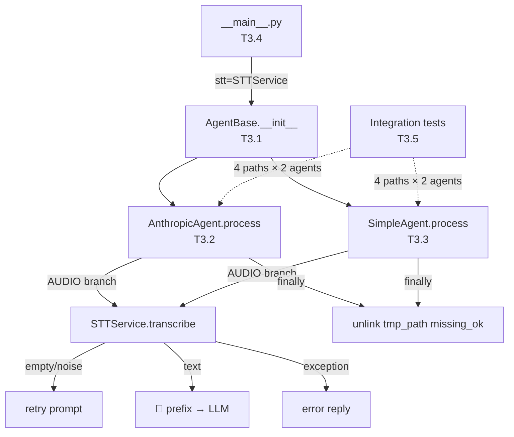

## Summary

Wire `STTService` into both agents (V3 of the STT epic). T3.1–T3.5 are fully detailed in the parent plan at `artifacts/plans/80-voice-stt-whisper-plan.mdx` (lines 488–655). This document is a navigation aid and gate tracker — all code shapes live in the parent.

---

## Architecture

---

## Tasks

| ID | File | Description | Depends | Agent | Time |
|----|------|-------------|---------|-------|------|
| T3.1 | `core/agent.py` | Add `stt: STTService \| None = None` to `AgentBase.__init__`, store as `self._stt` | — | backend-dev | 3 min |
| T3.2 | `agents/anthropic_agent.py` | AUDIO branch: transcribe, empty check, grounding prefix, history split, finally cleanup | T3.1 | backend-dev | 10 min |
| T3.3 | `agents/simple_agent.py` | AUDIO branch: transcribe, empty check, prefix, return Response, finally cleanup | T3.1 | backend-dev | 8 min |
| T3.4 | `__main__.py` | Instantiate STTService from env vars; catch ValueError → SystemExit; pass stt= to agents | T3.2, T3.3 | backend-dev | 5 min |
| T3.5 | `tests/agents/test_anthropic_agent.py` `tests/agents/test_simple_agent.py` `tests/test_main.py` | 4 paths × 2 agents + invalid-config SystemExit test | T3.4 | tester | 10 min |

**Full code shapes:** see parent plan §V3 (lines 488–655).

---

## Agents

| Agent | Tasks | Files |
|-------|-------|-------|
| backend-dev | T3.1, T3.2, T3.3, T3.4 | `core/agent.py`, `agents/anthropic_agent.py`, `agents/simple_agent.py`, `__main__.py` |
| tester | T3.5 | `tests/agents/test_anthropic_agent.py`, `tests/agents/test_simple_agent.py`, `tests/test_main.py` |

---

## Gate

**🔴 RED-GATE V3:** `uv run pytest tests/ -v` → all pass. Voice → LLM reply. Prefix stripped from history. Tmp file deleted in all paths.
