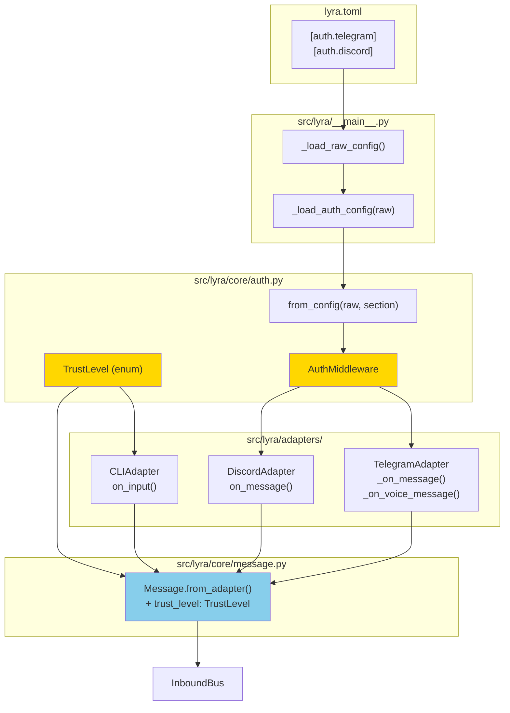
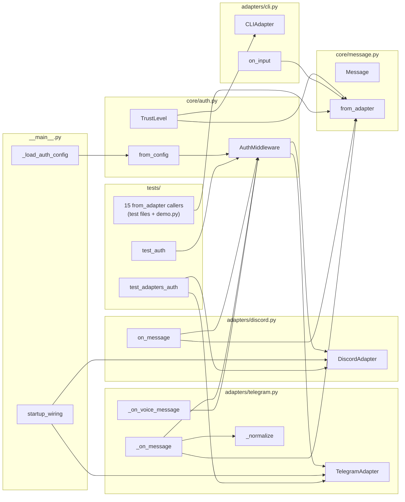

## Summary

Implement `AuthMiddleware` + `TrustLevel` enum as shared core infrastructure, integrate into `TelegramAdapter` and `DiscordAdapter` (rejecting BLOCKED users before `_normalize()`), create a minimal `CLIAdapter` stub, and wire everything via `lyra.toml` config. 17 acceptance criteria across 6 slices; 15 `from_adapter()` call sites updated in S2.

## Architecture





## Bootstrap Context

From `artifacts/analyses/151-auth-middleware-trust-level-analysis.mdx`:
- Config pattern: `raw.get("auth", {}).get("telegram", {})` — matches `_load_circuit_config()` style
- `_normalize()` call sites in telegram: lines 224 + 305; discord: line 146
- All `Message.from_adapter()` callers: see S2 task list (15 sites)
- `ChannelAdapter` protocol requires `send()` + `send_streaming()` — `CLIAdapter` does NOT implement this protocol in this issue (inbound-only stub)

## Agents

| Agent | Task count | Primary files |
|-------|-----------|---------------|
| backend-dev | 18 | `core/auth.py`, `core/message.py`, `adapters/telegram.py`, `adapters/discord.py`, `adapters/cli.py`, `__main__.py` |
| tester | 8 | `tests/test_auth.py`, `tests/test_adapters_auth.py`, 7 updated test files |

## Consistency Report

| Criteria | Count |
|----------|-------|
| Success criteria covered | 17/17 |
| Slices covered | 6/6 (+ test slice T) |
| `[NEEDS CLARIFICATION]` | 0 |

All 17 `- [ ]` items in spec `## Success Criteria` traced to at least one task below.

---

## Micro-Tasks

### S1 — TrustLevel + AuthMiddleware core

---

**T-S1-1** `[backend-dev]` `[Phase: GREEN]` `[Slice: S1]` `[P: N]`
Create `src/lyra/core/auth.py` with `TrustLevel` enum and `AuthMiddleware` class.

```python
# src/lyra/core/auth.py
from __future__ import annotations
import logging
from enum import Enum

log = logging.getLogger(__name__)

class TrustLevel(Enum):
    OWNER   = "owner"
    TRUSTED = "trusted"
    PUBLIC  = "public"
    BLOCKED = "blocked"

class AuthMiddleware:
    def __init__(self, trust_map: dict[str, TrustLevel], default: TrustLevel) -> None:
        self._trust_map = trust_map
        self._default = default

    def check(self, user_id: str | None) -> TrustLevel:
        if user_id is None:
            return self._default
        return self._trust_map.get(user_id, self._default)

    @classmethod
    def from_config(cls, config: dict, section: str) -> "AuthMiddleware":
        """Parse config["auth"][section] → AuthMiddleware.
        Fails closed (SystemExit) for networked sections if absent or malformed.
        Returns fixed-OWNER middleware for "cli" section if absent.
        """
        auth_root = config.get("auth", {})
        section_cfg = auth_root.get(section)
        if section_cfg is None:
            if section == "cli":
                return cls(trust_map={}, default=TrustLevel.OWNER)
            raise SystemExit(
                f"Missing required [auth.{section}] section in lyra.toml. "
                "Service refuses to start without auth config."
            )
        raw_default = section_cfg.get("default")
        if raw_default is None:
            raise SystemExit(f"[auth.{section}] missing 'default' field in lyra.toml")
        try:
            default = TrustLevel(raw_default)
        except ValueError:
            raise SystemExit(
                f"[auth.{section}] 'default' value {raw_default!r} is not a valid TrustLevel. "
                f"Valid values: {[t.value for t in TrustLevel]}"
            )
        trust_map: dict[str, TrustLevel] = {}
        for uid in section_cfg.get("owner_users", []):
            trust_map[uid] = TrustLevel.OWNER
        for uid in section_cfg.get("trusted_users", []):
            trust_map.setdefault(uid, TrustLevel.TRUSTED)
        return cls(trust_map=trust_map, default=default)
```

Verify: `uv run python -c "from lyra.core.auth import TrustLevel, AuthMiddleware; print('ok')"`
Expected: `ok`
Time: 8 min | Difficulty: 2
Spec trace: SC-1, SC-2, SC-3, SC-4, SC-5, SC-6, SC-7

---

**RED-GATE S1** — verify core auth tests green before proceeding.
`uv run pytest tests/test_auth.py -x -q` → all pass

---

### S2 — Message.from_adapter() update + all callers

---

**T-S2-1** `[backend-dev]` `[Phase: GREEN]` `[Slice: S2]` `[P: N]`
Add `trust_level: TrustLevel` as required field to `Message` dataclass and update `from_adapter()` signature.

```python
# src/lyra/core/message.py — additions
from lyra.core.auth import TrustLevel  # new import

@dataclass
class Message:
    # ... existing fields ...
    trust_level: TrustLevel  # NEW — required, no default
    trust: Literal["user", "system"] = "user"  # unchanged
    metadata: dict[str, Any] = field(default_factory=dict)

    @classmethod
    def from_adapter(
        cls,
        *,
        platform: Platform,
        bot_id: str,
        user_id: str,
        user_name: str,
        content: MessageContent,
        type: MessageType,
        timestamp: datetime,
        trust_level: TrustLevel,  # NEW required param
        is_mention: bool = False,
        is_from_bot: bool = False,
        platform_context: PlatformContext,
    ) -> "Message":
        return cls(
            ...
            trust_level=trust_level,  # NEW
            trust="user",  # SECURITY: never caller-controlled
        )
```

Verify: `uv run python -c "from lyra.core.message import Message; import inspect; sig = inspect.signature(Message.from_adapter); assert 'trust_level' in sig.parameters; print('ok')"`
Expected: `ok`
Time: 5 min | Difficulty: 2
Spec trace: SC-11, SC-12

---

**T-S2-2** `[backend-dev]` `[Phase: GREEN]` `[Slice: S2]` `[P: N]` (depends on T-S2-1)
Update all 15 `from_adapter()` call sites to pass `trust_level=TrustLevel.TRUSTED` (test fixtures) or the resolved trust level (production code).

Files and locations:

| File | Lines | Value to pass |
|------|-------|--------------|
| `src/lyra/adapters/telegram.py` | 224, 305 | `trust_level=trust_level` (param from caller) |
| `src/lyra/adapters/discord.py` | 146 | `trust_level=trust_level` (param from caller) |
| `tests/adapters/test_discord.py` | 885, 957, 1024, 1092 | `trust_level=TrustLevel.TRUSTED` |
| `tests/adapters/test_telegram.py` | ~155 | `trust_level=TrustLevel.TRUSTED` |
| `tests/core/test_inbound_bus.py` | ~27 | `trust_level=TrustLevel.TRUSTED` |
| `tests/core/test_outbound_dispatcher.py` | ~23 | `trust_level=TrustLevel.TRUSTED` |
| `tests/core/test_pool.py` | ~71 | `trust_level=TrustLevel.TRUSTED` |
| `tests/test_health_endpoint.py` | ~69, ~104 | `trust_level=TrustLevel.TRUSTED` |
| `demo.py` | ~55 | `trust_level=TrustLevel.TRUSTED` |

Note: `telegram.py` and `discord.py` `from_adapter()` calls are inside `_normalize()`. After S4/S5, `_normalize()` receives `trust_level` as a parameter from `_on_message()`. Update the call to pass it through in S4/S5 rather than hardcoding here.

Verify: `uv run pytest -x -q --tb=short` → no `TypeError: from_adapter() missing ... trust_level`
Expected: All pre-existing tests pass (or fail for new reasons only)
Time: 8 min | Difficulty: 2
Spec trace: SC-17

---

**RED-GATE S2** — all existing tests green after signature change.
`uv run pytest -x -q` → zero failures related to `from_adapter`

---

### S3 — CLIAdapter stub

---

**T-S3-1** `[backend-dev]` `[Phase: GREEN]` `[Slice: S3]` `[P: Y]` (parallel with S4, S5 after S2)
Create `src/lyra/adapters/cli.py` — minimal inbound-only adapter with hardcoded `OWNER` trust.

```python
# src/lyra/adapters/cli.py
from __future__ import annotations

from datetime import datetime, timezone

from lyra.core.auth import TrustLevel
from lyra.core.message import Message, MessageType, Platform, TextContent, TelegramContext


class CLIAdapter:
    """Minimal inbound-only CLI adapter. Always OWNER trust (local use only).

    NOT a ChannelAdapter — does not implement send()/send_streaming().
    Not registered with hub.register_adapter() in this issue.
    """

    def __init__(self, bot_id: str = "cli") -> None:
        self._bot_id = bot_id

    def on_input(self, text: str, user_id: str = "cli:user:local") -> Message:
        """Convert a CLI text input to a Message with TrustLevel.OWNER."""
        return Message.from_adapter(
            platform=Platform.TELEGRAM,  # placeholder — CLI has no platform
            bot_id=self._bot_id,
            user_id=user_id,
            user_name="local",
            content=TextContent(text=text),
            type=MessageType.TEXT,
            timestamp=datetime.now(timezone.utc),
            trust_level=TrustLevel.OWNER,
            platform_context=TelegramContext(chat_id=0),
        )
```

Verify: `uv run python -c "from lyra.adapters.cli import CLIAdapter; from lyra.core.auth import TrustLevel; a = CLIAdapter(); m = a.on_input('hello'); assert m.trust_level == TrustLevel.OWNER; print('ok')"`
Expected: `ok`
Time: 5 min | Difficulty: 1
Spec trace: SC-14

---

**RED-GATE S3** — `uv run pytest tests/ -k "cli" -x -q` → all cli-related tests pass

---

### S4 — TelegramAdapter auth gate

---

**T-S4-1** `[backend-dev]` `[Phase: GREEN]` `[Slice: S4]` `[P: Y]` (parallel with S5 after S2)
Add `auth: AuthMiddleware` parameter to `TelegramAdapter.__init__()` and add early-return auth gate in `_on_message()` and `_on_voice_message()`.

```python
# src/lyra/adapters/telegram.py — __init__ update
from lyra.core.auth import AuthMiddleware, TrustLevel

def __init__(
    self,
    bot_id: str,
    token: str,
    hub: Hub,
    auth: AuthMiddleware,          # NEW required param
    bot_username: str = "lyra_bot",
    webhook_secret: str = "",
    circuit_registry: CircuitRegistry | None = None,
    msg_manager: MessageManager | None = None,
) -> None:
    ...
    self._auth = auth              # NEW

# _on_message() gate — insert before _normalize()
async def _on_message(self, msg) -> None:
    if msg.from_user and getattr(msg.from_user, "is_bot", False):
        return
    user_id = f"tg:user:{msg.from_user.id}" if msg.from_user else None
    trust = self._auth.check(user_id)
    if trust == TrustLevel.BLOCKED:
        log.info(
            '{"event": "auth_reject", "user": "%s", "channel": "telegram", "ts": "%s"}',
            user_id, datetime.now(timezone.utc).isoformat(),
        )
        return
    hub_msg = self._normalize(msg, trust_level=trust)
    await self._push_to_hub(hub_msg)

# _on_voice_message() — same gate pattern before normalize
async def _on_voice_message(self, msg) -> None:
    user_id = f"tg:user:{msg.from_user.id}" if msg.from_user else None
    trust = self._auth.check(user_id)
    if trust == TrustLevel.BLOCKED:
        log.info(
            '{"event": "auth_reject", "user": "%s", "channel": "telegram", "ts": "%s"}',
            user_id, datetime.now(timezone.utc).isoformat(),
        )
        return
    # ... existing voice handling with trust_level=trust passed to from_adapter

# _normalize() signature update — add trust_level param
def _normalize(self, msg, *, trust_level: TrustLevel) -> Message:
    ...
    return Message.from_adapter(
        ...
        trust_level=trust_level,
    )
```

Verify: `uv run pytest tests/adapters/test_telegram.py -x -q`
Expected: existing telegram tests pass; auth gate tests added in T slice
Time: 8 min | Difficulty: 3
Spec trace: SC-7, SC-8, SC-10, SC-12

---

**RED-GATE S4** — `uv run pytest tests/adapters/test_telegram.py -x -q` → all pass

---

### S5 — DiscordAdapter auth gate

---

**T-S5-1** `[backend-dev]` `[Phase: GREEN]` `[Slice: S5]` `[P: Y]` (parallel with S4 after S2)
Add `auth: AuthMiddleware` parameter to `DiscordAdapter.__init__()` and gate in `on_message()`.

```python
# src/lyra/adapters/discord.py — __init__ update
from lyra.core.auth import AuthMiddleware, TrustLevel

def __init__(
    self,
    hub: "Hub",
    bot_id: str = "main",
    *,
    auth: AuthMiddleware,          # NEW required param
    intents: discord.Intents | None = None,
    circuit_registry: CircuitRegistry | None = None,
    msg_manager: MessageManager | None = None,
    auto_thread: bool = True,
) -> None:
    ...
    self._auth = auth              # NEW

# on_message() gate — insert before _normalize()
async def on_message(self, message: Any) -> None:
    if message.author.bot:
        return
    if message.author == self._bot_user:
        return
    user_id = f"dc:user:{message.author.id}"
    trust = self._auth.check(user_id)
    if trust == TrustLevel.BLOCKED:
        log.info(
            '{"event": "auth_reject", "user": "%s", "channel": "discord", "ts": "%s"}',
            user_id, datetime.now(timezone.utc).isoformat(),
        )
        return
    try:
        hub_msg = self._normalize(message, trust_level=trust)
    except Exception:
        log.exception("Failed to normalize discord message id=%s", message.id)
        return
    ...

# _normalize() signature update
def _normalize(self, message: Any, *, trust_level: TrustLevel) -> Message:
    ...
    return Message.from_adapter(
        ...
        trust_level=trust_level,
    )
```

Verify: `uv run pytest tests/adapters/test_discord.py -x -q`
Expected: existing discord tests pass
Time: 8 min | Difficulty: 3
Spec trace: SC-9, SC-10, SC-12

---

**RED-GATE S5** — `uv run pytest tests/adapters/test_discord.py -x -q` → all pass

---

### S6 — __main__.py wiring + lyra.toml

---

**T-S6-1** `[backend-dev]` `[Phase: GREEN]` `[Slice: S6]` `[P: N]` (depends on S4, S5)
Add `_load_auth_config(raw)` to `__main__.py` and inject into both adapters at startup.

```python
# src/lyra/__main__.py — new function (after _load_pairing_config)
from lyra.core.auth import AuthMiddleware

def _load_auth_config(raw: dict) -> tuple[AuthMiddleware, AuthMiddleware]:
    """Load [auth.telegram] and [auth.discord] from raw config dict.
    Fails closed (SystemExit) if either section is absent.
    Returns (telegram_auth, discord_auth).
    """
    tg_auth = AuthMiddleware.from_config(raw, "telegram")
    dc_auth = AuthMiddleware.from_config(raw, "discord")
    return tg_auth, dc_auth

# In main startup sequence — after _load_raw_config():
raw = _load_raw_config()
tg_auth, dc_auth = _load_auth_config(raw)

# Inject into adapters:
tg_adapter = TelegramAdapter(
    ...,
    auth=tg_auth,   # NEW
)
dc_adapter = DiscordAdapter(
    ...,
    auth=dc_auth,   # NEW
)
```

Verify: `uv run python -c "import lyra.__main__; print('import ok')" 2>&1 | head -3`
Expected: `import ok` (no TypeError on import)
Time: 8 min | Difficulty: 2
Spec trace: SC-15, SC-16

---

**T-S6-2** `[backend-dev]` `[Phase: GREEN]` `[Slice: S6]` `[P: N]`
Add `[auth.telegram]` and `[auth.discord]` sections to `lyra.toml` (create if absent, extend if present).

```toml
# lyra.toml — auth sections
[auth.telegram]
owner_users   = ["7377831990"]   # Mickael
trusted_users = ["7377831990"]
default       = "blocked"

[auth.discord]
trusted_roles = []
default       = "blocked"
```

Verify: `uv run python -c "import tomllib; f=open('lyra.toml','rb'); d=tomllib.load(f); assert 'auth' in d; print('ok')"`
Expected: `ok`
Time: 3 min | Difficulty: 1
Spec trace: SC-15

---

**RED-GATE S6** — full startup test.
`uv run pytest tests/test_main.py -x -q` → all pass
`uv run python -m lyra --help 2>&1 | head -1` → no SystemExit on startup with valid lyra.toml

---

### T — Tests (unit + integration)

---

**T-T-1** `[tester]` `[Phase: RED]` `[Slice: T]` `[P: N]` (write before S1)
Create `tests/test_auth.py` with unit tests for `AuthMiddleware`.

```python
# tests/test_auth.py
import pytest
from lyra.core.auth import AuthMiddleware, TrustLevel

class TestTrustLevel:
    def test_has_four_values(self):
        assert set(TrustLevel) == {TrustLevel.OWNER, TrustLevel.TRUSTED, TrustLevel.PUBLIC, TrustLevel.BLOCKED}

class TestAuthMiddlewareCheck:
    def test_known_owner(self):
        auth = AuthMiddleware({"user:1": TrustLevel.OWNER}, TrustLevel.BLOCKED)
        assert auth.check("user:1") == TrustLevel.OWNER

    def test_unknown_returns_default(self):
        auth = AuthMiddleware({}, TrustLevel.BLOCKED)
        assert auth.check("user:99") == TrustLevel.BLOCKED

    def test_none_user_id_returns_default(self):
        auth = AuthMiddleware({}, TrustLevel.BLOCKED)
        assert auth.check(None) == TrustLevel.BLOCKED

class TestAuthMiddlewareFromConfig:
    def test_valid_telegram_config(self):
        raw = {"auth": {"telegram": {"owner_users": ["u1"], "trusted_users": ["u2"], "default": "blocked"}}}
        auth = AuthMiddleware.from_config(raw, "telegram")
        assert auth.check("u1") == TrustLevel.OWNER
        assert auth.check("u2") == TrustLevel.TRUSTED
        assert auth.check("unknown") == TrustLevel.BLOCKED

    def test_missing_telegram_section_raises(self):
        with pytest.raises(SystemExit):
            AuthMiddleware.from_config({}, "telegram")

    def test_missing_cli_section_returns_owner(self):
        auth = AuthMiddleware.from_config({}, "cli")
        assert auth.check("anything") == TrustLevel.OWNER

    def test_invalid_default_raises(self):
        raw = {"auth": {"telegram": {"default": "open"}}}
        with pytest.raises(SystemExit):
            AuthMiddleware.from_config(raw, "telegram")

    def test_missing_lyra_toml_equivalent(self):
        # empty raw dict = lyra.toml absent → fail closed
        with pytest.raises(SystemExit):
            AuthMiddleware.from_config({}, "telegram")
```

Verify: `uv run pytest tests/test_auth.py -x -q` → RED (module not yet created)
Time: 5 min | Difficulty: 2
Spec trace: SC-1 through SC-7, SC-16

---

**T-T-2** `[tester]` `[Phase: RED]` `[Slice: T]` `[P: N]` (write before S4/S5)
Create `tests/test_adapters_auth.py` — integration tests verifying `_normalize()` is NOT called for BLOCKED.

```python
# tests/test_adapters_auth.py
from unittest.mock import AsyncMock, MagicMock, patch
import pytest
from lyra.core.auth import AuthMiddleware, TrustLevel

@pytest.fixture
def blocked_auth():
    return AuthMiddleware({}, TrustLevel.BLOCKED)

@pytest.fixture
def owner_auth():
    return AuthMiddleware({"tg:user:1": TrustLevel.OWNER}, TrustLevel.BLOCKED)

class TestTelegramAdapterAuthGate:
    async def test_blocked_user_skips_normalize(self, blocked_auth):
        # Arrange: adapter with blocked_auth
        # Act: call _on_message() with any message
        # Assert: self._normalize is never called
        ...  # use MagicMock to spy on _normalize

    async def test_allowed_user_calls_normalize(self, owner_auth):
        ...

    async def test_blocked_message_never_reaches_bus(self, blocked_auth):
        ...

    async def test_voice_blocked_skips_normalize(self, blocked_auth):
        ...

class TestDiscordAdapterAuthGate:
    async def test_blocked_user_skips_normalize(self, blocked_auth):
        ...

    async def test_allowed_user_calls_normalize(self, owner_auth):
        ...
```

Verify: `uv run pytest tests/test_adapters_auth.py -x -q` → RED (adapters not yet updated)
Time: 8 min | Difficulty: 3
Spec trace: SC-7, SC-8, SC-9, SC-10, SC-13

---

**RED-GATE T** — full suite green.
`uv run pytest -x -q`
Expected: all 17 acceptance criteria covered, 0 failures

---

## Final Gate

`uv run pytest -q` → all pass
`uv run ruff check .` → no errors
`uv run pyright` → no type errors
