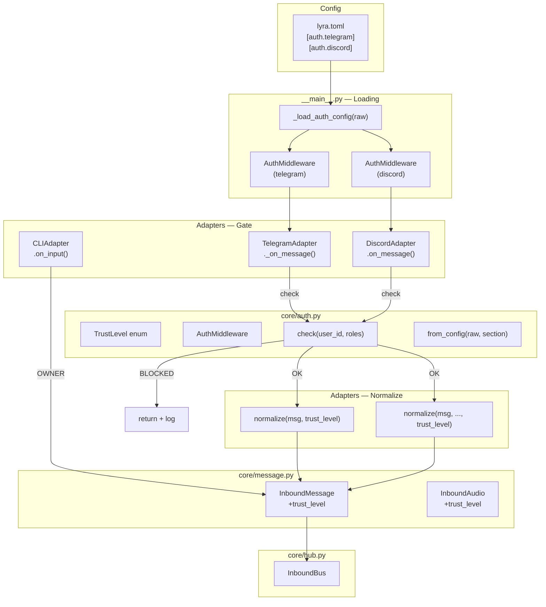
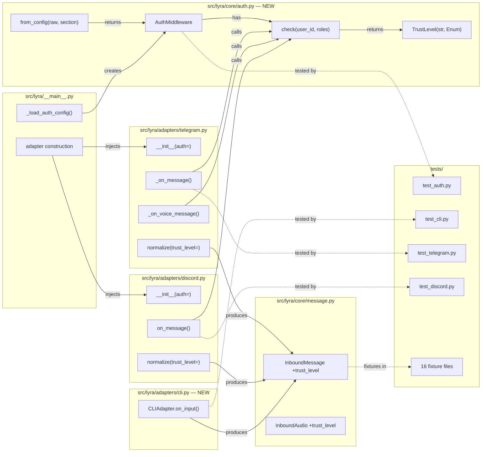

## Summary

Add `TrustLevel` enum and `AuthMiddleware` class to gate inbound messages at the adapter layer before `normalize()`. Propagate `trust_level` as a required field on `InboundMessage` and `InboundAudio`, wire auth config from `lyra.toml`, and create a minimal `CLIAdapter` stub.

## Architecture

### Data Flow

### File x Function Map

## Bootstrap Context

From [analysis](../analyses/151-auth-middleware-trust-level-analysis.mdx): Shape 2 (AuthMiddleware class) selected — centralized, injected, testable. Shape 1 (inline) eliminated for duplication; Shape 3 (hub-level) eliminated as contra-spec (runs after normalize). `trust: Literal["user","system"]` is orthogonal to `TrustLevel` — both coexist, `trust` deprecated.

## Agents

| Agent | Task count | Files |
|-------|-----------|-------|
| backend-dev | 12 | `core/auth.py`, `core/message.py`, `adapters/telegram.py`, `adapters/discord.py`, `adapters/cli.py`, `__main__.py` |
| tester | 12 | `tests/core/test_auth.py`, `tests/adapters/test_cli.py`, `tests/adapters/test_telegram.py`, `tests/adapters/test_discord.py`, `tests/test_main.py`, + 16 fixture files |

## Consistency Report

- Criteria covered: 18/18
- Uncovered criteria: none
- Tasks without spec backing: none
- Gold plating exemptions applied: 2 (fixture updates, deprecation comment)

## Micro-Tasks

### Slice S1: TrustLevel enum + AuthMiddleware core

#### Task 1: Create TrustLevel enum [P] → backend-dev
- **File:** `src/lyra/core/auth.py`
- **Snippet:** `class TrustLevel(str, Enum): OWNER = "owner"; TRUSTED = "trusted"; PUBLIC = "public"; BLOCKED = "blocked"`
- **Verify:** `uv run python -c "from lyra.core.auth import TrustLevel; assert len(TrustLevel) == 4"` (ready)
- **Expected:** No error, 4 members
- **Time:** 3 min | **Difficulty:** 1
- **Traces:** SC-1 | **Phase:** GREEN

#### Task 2: Create AuthMiddleware class [P] → backend-dev
- **File:** `src/lyra/core/auth.py`
- **Snippet:** `class AuthMiddleware: def __init__(self, user_map, role_map, default): ... def check(self, user_id, roles=()): ...`
- **Verify:** `uv run python -c "from lyra.core.auth import AuthMiddleware, TrustLevel; a = AuthMiddleware({}, {}, TrustLevel.BLOCKED); assert a.check('x') == TrustLevel.BLOCKED"` (ready)
- **Expected:** Returns BLOCKED for unknown user
- **Time:** 5 min | **Difficulty:** 2
- **Traces:** SC-2, SC-3, SC-4, SC-5, N1b, N1c | **Phase:** GREEN

#### Task 3: Implement from_config classmethod → backend-dev
- **File:** `src/lyra/core/auth.py`
- **Snippet:** `@classmethod def from_config(cls, raw, section): ...`
- **Verify:** `uv run python -c "from lyra.core.auth import AuthMiddleware; AuthMiddleware.from_config({}, 'telegram')"` (ready)
- **Expected:** SystemExit raised
- **Time:** 5 min | **Difficulty:** 3
- **Traces:** SC-6, SC-7, SC-8, N1d, N1e | **Phase:** GREEN

#### Task 4: Write unit tests for AuthMiddleware → tester
- **File:** `tests/core/test_auth.py`
- **Snippet:** `class TestTrustLevel: ... class TestAuthMiddleware: ... class TestFromConfig: ...`
- **Verify:** `uv run pytest tests/core/test_auth.py -v` (ready)
- **Expected:** All tests pass
- **Time:** 8 min | **Difficulty:** 3
- **Traces:** SC-1 through SC-8 | **Phase:** GREEN

#### RED-GATE: S1 complete → tester
- **Verify:** `uv run pytest tests/core/test_auth.py -v` passes
- **Phase:** RED-GATE

### Slice S2: InboundMessage + InboundAudio trust_level field

#### Task 5: Add trust_level field to InboundMessage → backend-dev
- **File:** `src/lyra/core/message.py`
- **Snippet:** Add `trust_level: TrustLevel` field (required, no default) + deprecation comment on `trust`
- **Verify:** `uv run python -c "from lyra.core.message import InboundMessage"` (ready)
- **Expected:** Import succeeds
- **Time:** 3 min | **Difficulty:** 2
- **Traces:** SC-13, N2a | **Phase:** GREEN

#### Task 6: Add trust_level field to InboundAudio → backend-dev
- **File:** `src/lyra/core/message.py`
- **Snippet:** Add `trust_level: TrustLevel` field (required, no default)
- **Verify:** `uv run python -c "from lyra.core.message import InboundAudio"` (ready)
- **Expected:** Import succeeds
- **Time:** 2 min | **Difficulty:** 1
- **Traces:** SC-14, N2b | **Phase:** GREEN

#### Task 7: Update all test fixtures to include trust_level → tester
- **File:** 16 test files
- **Snippet:** Add `trust_level=TrustLevel.TRUSTED` to every `InboundMessage(...)` and `InboundAudio(...)` constructor
- **Verify:** `uv run pytest --co -q 2>&1 | tail -1` (ready)
- **Expected:** Collection succeeds (no construction errors)
- **Time:** 10 min | **Difficulty:** 2
- **Traces:** SC-15 | **Phase:** GREEN

Files: `tests/core/conftest.py`, `tests/core/test_hub.py`, `tests/core/test_inbound_bus.py`, `tests/core/test_outbound_dispatcher.py`, `tests/core/test_pool.py`, `tests/core/test_command_router.py`, `tests/core/test_pairing.py`, `tests/adapters/test_telegram.py`, `tests/adapters/test_discord.py`, `tests/adapters/test_streaming.py`, `tests/adapters/test_render_audio.py`, `tests/adapters/test_discord_audio.py`, `tests/adapters/test_telegram_voice.py`, `tests/agents/test_anthropic_agent.py`, `tests/agents/test_simple_agent.py`, `tests/agents/test_anthropic_agent_stt.py`, `tests/agents/test_simple_agent_stt.py`, `tests/test_health_endpoint.py`

#### RED-GATE: S2 complete → tester
- **Verify:** `uv run pytest -x -q` — full suite passes
- **Phase:** RED-GATE

### Slice S3: CLIAdapter stub

#### Task 8: Create CLIAdapter class [P] → backend-dev
- **File:** `src/lyra/adapters/cli.py`
- **Snippet:** `class CLIAdapter: def on_input(self, text: str) -> InboundMessage: ...` with `trust_level=TrustLevel.OWNER`
- **Verify:** `uv run python -c "from lyra.adapters.cli import CLIAdapter"` (ready)
- **Expected:** Import succeeds
- **Time:** 5 min | **Difficulty:** 2
- **Traces:** SC-16, N5a, N5b, N5c | **Phase:** GREEN

#### Task 9: Write CLIAdapter tests [P] → tester
- **File:** `tests/adapters/test_cli.py`
- **Snippet:** `def test_on_input_returns_owner_trust(): ...`
- **Verify:** `uv run pytest tests/adapters/test_cli.py -v` (ready)
- **Expected:** All tests pass
- **Time:** 5 min | **Difficulty:** 2
- **Traces:** SC-16 | **Phase:** GREEN

#### RED-GATE: S3 complete → tester
- **Verify:** `uv run pytest tests/adapters/test_cli.py -v` passes
- **Phase:** RED-GATE

### Slice S4: TelegramAdapter auth gate

#### Task 10: Add _auth parameter to TelegramAdapter.__init__ → backend-dev
- **File:** `src/lyra/adapters/telegram.py`
- **Snippet:** Add `auth: AuthMiddleware | None = None` param, store as `self._auth`
- **Verify:** `uv run python -c "from lyra.adapters.telegram import TelegramAdapter"` (ready)
- **Expected:** Import succeeds
- **Time:** 3 min | **Difficulty:** 1
- **Traces:** N3a | **Phase:** GREEN

#### Task 11: Add auth gate to _on_message → backend-dev
- **File:** `src/lyra/adapters/telegram.py`
- **Snippet:** Before `normalize()`: `trust = self._auth.check(str(msg.from_user.id))` / BLOCKED → return + log
- **Verify:** `uv run pytest tests/adapters/test_telegram.py -v -k auth` (deferred)
- **Expected:** Auth gate tests pass
- **Time:** 5 min | **Difficulty:** 3
- **Traces:** SC-9, SC-12, N3b, N3d | **Phase:** GREEN

#### Task 12: Add auth gate to _on_voice_message → backend-dev
- **File:** `src/lyra/adapters/telegram.py`
- **Snippet:** Before voice handling: same `check()` + BLOCKED early return
- **Verify:** `uv run pytest tests/adapters/test_telegram.py -v -k voice_auth` (deferred)
- **Expected:** Voice auth gate tests pass
- **Time:** 3 min | **Difficulty:** 2
- **Traces:** SC-10, SC-12, N3c | **Phase:** GREEN

#### Task 13: Pass trust_level through normalize() → backend-dev
- **File:** `src/lyra/adapters/telegram.py`
- **Snippet:** Add `trust_level` param to `normalize()` + `normalize_audio()`, pass to `InboundMessage()`/`InboundAudio()`
- **Verify:** `uv run pytest tests/adapters/test_telegram.py -v` (deferred)
- **Expected:** All telegram tests pass
- **Time:** 5 min | **Difficulty:** 2
- **Traces:** SC-13, SC-14, N3e | **Phase:** GREEN

#### Task 14: Write Telegram auth gate tests → tester
- **File:** `tests/adapters/test_telegram.py`
- **Snippet:** `class TestTelegramAuth: test_blocked_user_skips_normalize, test_allowed_user_has_trust_level, test_voice_blocked_skips_normalize`
- **Verify:** `uv run pytest tests/adapters/test_telegram.py -v -k auth` (ready)
- **Expected:** All auth tests pass
- **Time:** 8 min | **Difficulty:** 3
- **Traces:** SC-9, SC-10, SC-12 | **Phase:** GREEN

#### RED-GATE: S4 complete → tester
- **Verify:** `uv run pytest tests/adapters/test_telegram.py -v` passes
- **Phase:** RED-GATE

### Slice S5: DiscordAdapter auth gate + role support

#### Task 15: Add _auth parameter to DiscordAdapter.__init__ → backend-dev
- **File:** `src/lyra/adapters/discord.py`
- **Snippet:** Add `auth: AuthMiddleware | None = None` param, store as `self._auth`
- **Verify:** `uv run python -c "from lyra.adapters.discord import DiscordAdapter"` (ready)
- **Expected:** Import succeeds
- **Time:** 3 min | **Difficulty:** 1
- **Traces:** N4a | **Phase:** GREEN

#### Task 16: Add auth gate to on_message with role extraction → backend-dev
- **File:** `src/lyra/adapters/discord.py`
- **Snippet:** Before `normalize()`: extract roles via `hasattr(message.author, "roles")`, call `self._auth.check(user_id, roles=role_names)` / BLOCKED → return + log
- **Verify:** `uv run pytest tests/adapters/test_discord.py -v -k auth` (deferred)
- **Expected:** Auth gate tests pass
- **Time:** 5 min | **Difficulty:** 3
- **Traces:** SC-11, SC-12, N4b, N4c, N4d | **Phase:** GREEN

#### Task 17: Pass trust_level through normalize() → backend-dev
- **File:** `src/lyra/adapters/discord.py`
- **Snippet:** Add `trust_level` param to `normalize()` + `normalize_audio()`, pass to `InboundMessage()`/`InboundAudio()`
- **Verify:** `uv run pytest tests/adapters/test_discord.py -v` (deferred)
- **Expected:** All discord tests pass
- **Time:** 5 min | **Difficulty:** 2
- **Traces:** SC-13, SC-14, N4e | **Phase:** GREEN

#### Task 18: Write Discord auth gate tests → tester
- **File:** `tests/adapters/test_discord.py`
- **Snippet:** `class TestDiscordAuth: test_blocked_user_skips_normalize, test_role_match_returns_trust, test_dm_fallback_user_id_only`
- **Verify:** `uv run pytest tests/adapters/test_discord.py -v -k auth` (ready)
- **Expected:** All auth tests pass
- **Time:** 8 min | **Difficulty:** 3
- **Traces:** SC-11, SC-12 | **Phase:** GREEN

#### RED-GATE: S5 complete → tester
- **Verify:** `uv run pytest tests/adapters/test_discord.py -v` passes
- **Phase:** RED-GATE

### Slice S6: __main__.py wiring + config

#### Task 19: Create _load_auth_config function → backend-dev
- **File:** `src/lyra/__main__.py`
- **Snippet:** `def _load_auth_config(raw: dict) -> tuple[AuthMiddleware, AuthMiddleware]: ...`
- **Verify:** `uv run python -c "from lyra.__main__ import _load_auth_config"` (ready)
- **Expected:** Import succeeds
- **Time:** 5 min | **Difficulty:** 2
- **Traces:** SC-17, SC-18, N6a | **Phase:** GREEN

#### Task 20: Wire auth into adapter construction → backend-dev
- **File:** `src/lyra/__main__.py`
- **Snippet:** `tg_auth, dc_auth = _load_auth_config(raw_config)` + pass `auth=tg_auth` / `auth=dc_auth` to adapter constructors
- **Verify:** `uv run pytest tests/test_main.py -v` (deferred)
- **Expected:** Main tests pass
- **Time:** 5 min | **Difficulty:** 2
- **Traces:** SC-17, SC-18, N6b, N6c | **Phase:** GREEN

#### Task 21: Write _load_auth_config tests → tester
- **File:** `tests/test_main.py`
- **Snippet:** `class TestLoadAuthConfig: test_valid_config, test_missing_section_exits, test_invalid_default_exits`
- **Verify:** `uv run pytest tests/test_main.py -v -k auth` (ready)
- **Expected:** All auth config tests pass
- **Time:** 5 min | **Difficulty:** 2
- **Traces:** SC-17, SC-18 | **Phase:** GREEN

#### Task 22: Update existing test_main.py fixtures → tester
- **File:** `tests/test_main.py`
- **Snippet:** Mock `_load_auth_config` in existing `_main()` tests to avoid SystemExit on missing auth config
- **Verify:** `uv run pytest tests/test_main.py -v` (ready)
- **Expected:** All main tests pass
- **Time:** 5 min | **Difficulty:** 2
- **Traces:** SC-15 | **Phase:** GREEN

#### Task 23: Full test suite green check → tester
- **File:** (all)
- **Verify:** `uv run pytest -x -q` (ready)
- **Expected:** All tests pass, 0 failures
- **Time:** 3 min | **Difficulty:** 1
- **Traces:** SC-15 | **Phase:** GREEN

#### Task 24: Pyright typecheck → tester
- **File:** (all)
- **Verify:** `uv run pyright` (ready)
- **Expected:** 0 errors
- **Time:** 3 min | **Difficulty:** 1
- **Traces:** SC-15 | **Phase:** GREEN

#### RED-GATE: S6 complete → tester
- **Verify:** `uv run pytest -x -q && uv run pyright` passes
- **Phase:** RED-GATE
