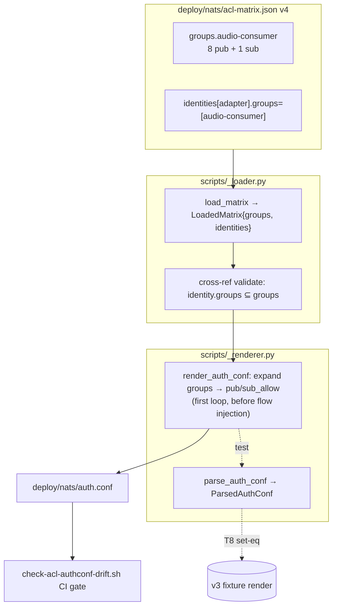
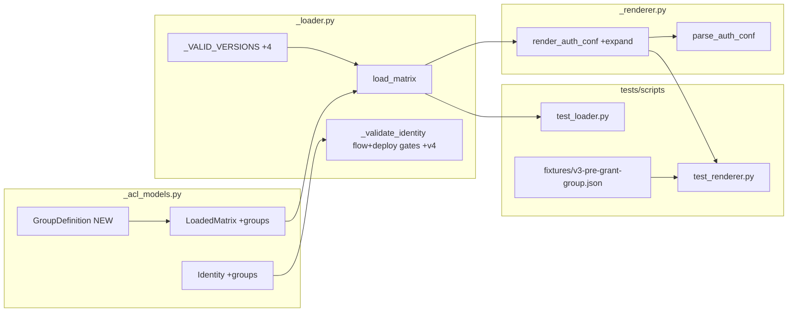

## Summary

Add `audio-consumer` ACL grant-group support to the generator (`_acl_models.py`,
`_loader.py`, `_renderer.py`), migrate `deploy/nats/acl-matrix.json` to schema v4
(audio grants defined once, referenced by both adapters), regenerate the committed
`auth.conf`, and prove `frozenset(parse(render_v4).users) == frozenset(parse(render_v3).users)`.

## Architecture

### Data flow



### File × Function map



## Agents

| Agent instance | Tasks | Files |
|---|---|---|
| backend-dev-A | T1–T3 | `scripts/_acl_models.py`, `scripts/_loader.py`, `scripts/_renderer.py` |
| devops-A | T4–T6 | `deploy/nats/acl-matrix.json`, `deploy/nats/auth.conf`, acl CI gates |
| tester-A | T7–T10 | `tests/scripts/fixtures/`, `tests/scripts/test_renderer.py`, `test_loader.py` |

## Bootstrap Context

- Render-equality is enforced two ways: (a) CI drift gate `scripts/check-acl-authconf-drift.sh`
  regenerates auth.conf via `lyra-acl genkeys --template-only` and textually diffs the
  committed file → committed `auth.conf` MUST be regenerated + committed (T5); (b) the
  T8 regression test proves v4≡v3 set-equality.
- `parse_auth_conf` returns `ParsedAuthConf.users: tuple[...]` (order-sensitive). T8 wraps
  in `frozenset(...)` for order-independent set-equality (ParsedUser is `frozen=True`,
  `nkey` excluded via `compare=False`).
- `audio-consumer` = the 8 `$JS.*`/`$KV.*` publish + 1 `$KV.*` subscribe subjects
  duplicated across telegram+discord today (enumerated in spec §"Group Definition").
  `lyra.outbound.audio.>` and non-audio shared grants STAY inline.
- Other matrix consumers (`check-acl-matrix-spec.sh`, `check_subject_literals.py`,
  `check_request_reply_flows.py`, `check_acl_matrix_retired.py`,
  `tools/check_renderer_roundtrip.sh`) compute effective grants WITHOUT group expansion.
  Since the group holds only `$JS`/`$KV` subjects and the spec-table gate filters to
  `lyra.*`/`_inbox.*`, they are expected unaffected — T6 VERIFIES this, fixing any
  consumer that needs group-expansion rather than assuming.
- Ref pattern: `tests/scripts/test_renderer.py` (uses `prod_matrix` fixture, `_fake_pubkeys`,
  `render_auth_conf`/`parse_auth_conf`); `tests/scripts/conftest.py` fixture style;
  fixtures `tests/scripts/fixtures/v1-legacy.json`, `v2-with-retired.json`.

## Wave Structure

6 waves, max 2 parallel agents. Elapsed ~1.5 sessions vs ~3 sequential.

| Wave | Trigger | Agents | Tasks |
|------|---------|--------|-------|
| 1 | start | 2 ∥ | backend-dev-A: T1 · tester-A: T7 |
| 2 | W1 done | 1 | backend-dev-A: T2 |
| 3 | W2 done | 2 ∥ | backend-dev-A: T3 · tester-A: T10 |
| 4 | W3 done | 2 ∥ | devops-A: T4 · tester-A: T9 |
| 5 | W4 done | 1 | devops-A: T5 |
| 6 | W5 done | 2 ∥ | devops-A: T6 · tester-A: T8 |

### Budget — per task

| Task | Items | Class | Est. ops | Split? |
|------|-------|-------|----------|--------|
| T1 models | 3 types | bounded | 4 | — |
| T2 loader | 4 edits | judgmental | 8 | — |
| T3 renderer | 1 loop | judgmental | 6 | — |
| T4 matrix migrate | 2 adapters + group | bounded | 6 | — |
| T5 auth.conf regen | 1 cmd | trivial | 2 | — |
| T6 consumer-compat verify | 6 gates | judgmental | 12 | — |
| T7 v3 fixture snapshot | 1 file | trivial | 2 | — |
| T8 equality test | 1 test | judgmental | 6 | — |
| T9 v3-valid test | 1 test | bounded | 4 | — |
| T10 loader tests | 3 cases | judgmental | 6 | — |

**Total estimated ops: ~56**

### Budget — per agent instance

| Instance | Tasks | Σ ops | Subjects | Split? |
|----------|-------|-------|----------|--------|
| backend-dev-A | T1,T2,T3 | 18 | acl-codegen | — |
| devops-A | T4,T5,T6 | 20 | acl-deploy | — |
| tester-A | T7,T8,T9,T10 | 18 | acl-tests | — (\|tasks\|=4, ≤cap) |

## Consistency Report

Covered: 11/11 success criteria. Untraced tasks: 0. Exemptions: none.

| SC | Task |
|---|---|
| GroupDefinition + LoadedMatrix.groups + Identity.groups | T1 |
| version "4" + 1/2/3 still valid | T2, T10 |
| v4 flow-parse inherited | T2, T10 |
| v4 deploy-guard inherited | T2, T10 |
| parse top-level groups (default {}) | T2, T10 |
| dangling group-ref → exit non-zero | T2, T10 |
| render_auth_conf expands before flow injection | T3, T8 |
| v3 byte-identical (no regression) | T3, T9 |
| matrix v4, group-only audio grants, adapters reference | T4 |
| committed auth.conf regenerated + parse-equal | T5, T6 |
| frozenset(parse(v4).users)==frozenset(parse(v3).users) | T8 |
| ruff/pyright/pytest pass | T6 (gates), all |

## Micro-Tasks

### Slice 1 — Generator supports groups (backend-dev-A · subject: acl-codegen)

**T1 [GREEN] · diff 2 · SC: models** — `scripts/_acl_models.py`
Add `class GroupDefinition(TypedDict)` with `description: NotRequired[str]`,
`publish: list[str]`, `subscribe: list[str]`. Add `groups: NotRequired[dict[str, GroupDefinition]]`
to `LoadedMatrix`; add `groups: NotRequired[list[str]]` to `Identity`.
Verify: `uv run pyright scripts/_acl_models.py` → 0 errors.

**T2 [GREEN] · diff 3 · dep T1 · SC: loader** — `scripts/_loader.py`
- `_VALID_VERSIONS` → add `"4"`.
- line ~71 deploy guard: `elif version in {"3", "4"} and data.get("status") == "active":`.
- line ~93 flow parse: `if version in {"2", "3", "4"}:`.
- After identities loop: parse `raw.get("groups", {})` → `dict[str, GroupDefinition]`;
  validate each is a dict with `publish`/`subscribe` lists.
- Cross-ref: for each identity with `groups`, every name ∈ parsed groups else `_die(...)`.
- Add `groups` to returned `LoadedMatrix` (default `{}`).
Verify: `uv run pytest tests/scripts/test_loader.py -q`.

**T3 [GREEN] · diff 3 · dep T1,T2 · SC: renderer** — `scripts/_renderer.py`
In `render_auth_conf`, read `groups = matrix.get("groups", {})`. In the FIRST identity
loop (where `pub_allow`/`sub_allow` are seeded, before the flow-injection loop), after
seeding from inline `publish`/`subscribe`:
```python
for gname in identity.get("groups", []):
    g = groups[gname]
    pub_allow[name].extend(g.get("publish", []))
    sub_allow[name].extend(g.get("subscribe", []))
```
Verify: `uv run pytest tests/scripts/test_renderer.py -q`.

### Slice 2 — Matrix migration + regen + consumer-compat (devops-A · subject: acl-deploy)

**T4 [GREEN] · diff 3 · dep T3 · SC: matrix** — `deploy/nats/acl-matrix.json`
- `"version": "4"`.
- Add top-level `"groups": { "audio-consumer": { "description": ..., "publish": [<8>], "subscribe": ["$KV.lyra_outbound_audio_sent.>"] } }` — exact 8 publish per spec §"Group Definition".
- `telegram-adapter` + `discord-adapter`: add `"groups": ["audio-consumer"]`; REMOVE the
  8 publish + 1 subscribe (`$KV.lyra_outbound_audio_sent.>`) audio subjects from inline
  arrays. KEEP `lyra.outbound.audio.>` and all non-audio grants inline.
Verify: `uv run python -c "from pathlib import Path; from scripts._loader import load_matrix; m=load_matrix(Path('deploy/nats/acl-matrix.json')); print(m['version'], list(m['groups']))"` → `4 ['audio-consumer']`.

**T5 [GREEN] · diff 1 · dep T4 · SC: auth.conf** — `deploy/nats/auth.conf`
Run `uv run lyra-acl genkeys --template-only > deploy/nats/auth.conf`.
Verify: `bash scripts/check-acl-authconf-drift.sh` → exit 0.

**T6 [VERIFY] · diff 3 · dep T4,T5 · SC: gates** — acl CI gates
Run each and confirm green; fix any consumer that computes effective grants without
group-expansion (expected: none, since group is `$JS`/`$KV`-only and spec-table filters
to `lyra.*`/`_inbox.*`):
- `bash scripts/check-acl-authconf-drift.sh`
- `bash scripts/check-acl-matrix-spec.sh`
- `uv run pytest tests/scripts/ -q`
- `bash tools/check_renderer_roundtrip.sh acl` (if nats-server available; else note skip)
Verify: all gates exit 0 (or roundtrip skipped with note).

### Slice 3 — Tests (tester-A · subject: acl-tests)

**T7 [setup] · diff 1 · no dep · Wave 1** — `tests/scripts/fixtures/v3-pre-grant-group.json`
Snapshot the pre-migration v3 matrix (ordering-robust):
`git show origin/staging:deploy/nats/acl-matrix.json > tests/scripts/fixtures/v3-pre-grant-group.json`.
This is the v3 baseline (audio grants inline) for the equality proof.
Verify: `jq .version tests/scripts/fixtures/v3-pre-grant-group.json` → `"3"`.

**T8 [GREEN] · diff 3 · dep T3,T7,T4 · SC: equality** — `tests/scripts/test_renderer.py`
Add `TestGrantGroupEquality`:
- Load v4 = `load_matrix(deploy/nats/acl-matrix.json)`; v3 = `load_matrix(fixtures/v3-pre-grant-group.json)`.
- Shared `_fake_pubkeys` keyed off identity names (same for both).
- `assert frozenset(parse_auth_conf(render_auth_conf(v4, pk)).users) == frozenset(parse_auth_conf(render_auth_conf(v3, pk)).users)`.
- Assert the 8 audio publish subjects are ABSENT from v4 `identities['telegram-adapter']['publish']` (inline) yet PRESENT in the rendered telegram block.
Verify: `uv run pytest tests/scripts/test_renderer.py::TestGrantGroupEquality -q`.

**T9 [GREEN] · diff 2 · dep T3 · SC: v3-valid** — `tests/scripts/test_renderer.py`
Assert an unmodified v3 matrix (`v1-legacy.json` / `v2-with-retired.json` / v3 fixture)
loads and renders without error and contains expected inline grants (no `groups`
regression for group-less matrices).
Verify: `uv run pytest tests/scripts/test_renderer.py -q -k v3 or legacy`.

**T10 [GREEN] · diff 3 · dep T2 · SC: loader** — `tests/scripts/test_loader.py`
Add: (a) `version:"4"` loads OK; (b) top-level `groups` parsed into `LoadedMatrix.groups`;
(c) identity referencing undefined group → `pytest.raises(SystemExit)`; (d) v4 active
identity missing `deploy` → `SystemExit` (deploy-guard inherited).
Verify: `uv run pytest tests/scripts/test_loader.py -q`.

## RED-GATE

- After Slice 1 (T3): `uv run pyright scripts/ && uv run pytest tests/scripts/test_loader.py tests/scripts/test_renderer.py -q` green.
- After Slice 2 (T6): all acl gates green.
- After Slice 3 (T8,T9,T10): `uv run pytest tests/scripts/ -q` green; T8 equality passes.

## Task Seeding Blueprint

<!-- Used by /implement. T-numbers ref this list; instances map to spawned agents. -->

### Wave 1 — no deps, 2 agents ∥

| Task | Agent instance | blockedBy | Subject |
|------|---------------|-----------|---------|
| T1 | backend-dev-A | — | acl-codegen |
| T7 | tester-A | — | acl-tests |

### Wave 2 — after T1, 1 agent

| Task | Agent instance | blockedBy | Subject |
|------|---------------|-----------|---------|
| T2 | backend-dev-A | T1 | acl-codegen |

### Wave 3 — after T2, 2 agents ∥

| Task | Agent instance | blockedBy | Subject |
|------|---------------|-----------|---------|
| T3 | backend-dev-A | T2 | acl-codegen |
| T10 | tester-A | T2 | acl-tests |

### Wave 4 — after T3, 2 agents ∥

| Task | Agent instance | blockedBy | Subject |
|------|---------------|-----------|---------|
| T4 | devops-A | T3 | acl-deploy |
| T9 | tester-A | T3 | acl-tests |

### Wave 5 — after T4, 1 agent

| Task | Agent instance | blockedBy | Subject |
|------|---------------|-----------|---------|
| T5 | devops-A | T4 | acl-deploy |

### Wave 6 — after T5, 2 agents ∥

| Task | Agent instance | blockedBy | Subject |
|------|---------------|-----------|---------|
| T6 | devops-A | T5 | acl-deploy |
| T8 | tester-A | T3, T7, T4 | acl-tests |

## Task IDs

<!-- Generated by /plan. Used by /implement to resume tasks on session restart. -->
- T1: 12 — acl-codegen (backend-dev-A)
- T2: 13 — acl-codegen (backend-dev-A)
- T3: 14 — acl-codegen (backend-dev-A)
- T4: 15 — acl-deploy (devops-A)
- T5: 16 — acl-deploy (devops-A)
- T6: 17 — acl-deploy (devops-A)
- T7: 18 — acl-tests (tester-A)
- T8: 19 — acl-tests (tester-A)
- T9: 20 — acl-tests (tester-A)
- T10: 21 — acl-tests (tester-A)
