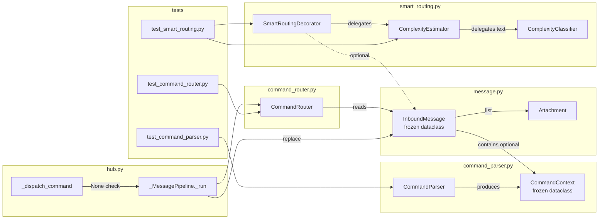

## Summary

Introduces `CommandParser` + `CommandContext` as the single parse point for `/` and `!` prefixes, attaches `CommandContext` to `InboundMessage`, and replaces text-only `ComplexityClassifier` with a signal-rich `ComplexityEstimator` that factors in attachments, turn count, and command identity for model selection.

---

## Architecture

```mermaid
flowchart TD
    subgraph command_parser.py [NEW: src/lyra/core/command_parser.py]
        CP[CommandParser.parse]
        CC[CommandContext\nprefix, name, args, raw]
    end

    subgraph message.py [MOD: src/lyra/core/message.py]
        IM[InboundMessage\n+ command: CommandContext | None]
    end

    subgraph hub.py [MOD: src/lyra/core/hub.py]
        PL[_MessagePipeline._run\nparse → replace → route]
        DC[_dispatch_command\nNone sentinel → submit_to_pool]
    end

    subgraph command_router.py [MOD: src/lyra/core/command_router.py]
        IC[is_command\nmsg.command != None]
        GC[get_command_name\nreads msg.command]
        DI[dispatch\nreads msg.command.name+args]
    end

    subgraph smart_routing.py [MOD: src/lyra/llm/smart_routing.py]
        CE[ComplexityEstimator.estimate\ntext+attachments+cmd+turns]
        SR[SmartRoutingDecorator.complete\n+ msg param]
        CL[ComplexityClassifier\nexisting text heuristic]
    end

    subgraph agent.py [MOD: src/lyra/core/agent.py]
        SC[SmartRoutingConfig\n+ high_complexity_commands]
        LO[TOML loader\nsr_section.get high_complexity_commands]
    end

    CP --> CC
    CC --> IM
    PL -->|parse+replace| IM
    PL --> IC
    IC --> DI
    DI -->|None sentinel| DC
    DC -->|fallthrough| PL
    SR --> CE
    CE --> CL
    CE -.->|command_name in| SC
    LO --> SC
```



---

## Agents

| Agent | Tasks | Files |
|-------|-------|-------|
| backend-dev | T1–T11 | command_parser.py (new), message.py, command_router.py, hub.py, smart_routing.py, agent.py |
| tester | T12–T15 | test_command_parser.py (new), test_command_router.py, test_smart_routing.py |

---

## Consistency Report

| Criterion | Covered by |
|-----------|-----------|
| SC-1: CommandParser("/imagine a cat") | T1, T12 |
| SC-2: CommandParser("!help") | T1, T12 |
| SC-3: CommandParser("hello world") → None | T1, T12 |
| SC-4: InboundMessage.command field; existing tests pass | T2, T15 |
| SC-5: Hub pipeline attaches CommandContext via replace() | T5, T13 |
| SC-6: is_command reads msg.command (no re-parse) | T3, T13 |
| SC-7: !-prefixed unknown → pool, not error | T6, T7, T13 |
| SC-8: SmartRoutingDecorator backward compat (msg=None) | T11, T14 |
| SC-9: attachment signal raises complexity | T9, T14 |
| SC-10: high_complexity_commands config routes COMPLEX | T8, T10, T14 |
| SC-11: pytest passes | T15 |
| SC-12: RoutingDecision.reason reflects signals | T11, T14 |

Covered: 12/12 | Uncovered: 0 | Untraced: 0

---

## Micro-Tasks

### V1 — CommandParser + CommandContext

---

**T1** `[backend-dev]` `[V1]` `[RED]` `[parallel-safe: N — foundation]`

Create `src/lyra/core/command_parser.py` with `CommandContext` frozen dataclass and `CommandParser.parse()`.

**File:** `src/lyra/core/command_parser.py` (NEW)

```python
from __future__ import annotations
from dataclasses import dataclass

COMMAND_PREFIXES = ("/", "!")

@dataclass(frozen=True)
class CommandContext:
    prefix: str   # "/" or "!"
    name: str     # lowercased command name, no prefix
    args: str     # remainder after name, stripped
    raw: str      # original full text

class CommandParser:
    """Stateless parser for / and ! command prefixes."""
    def parse(self, text: str) -> CommandContext | None:
        for prefix in COMMAND_PREFIXES:
            if text.startswith(prefix) and len(text) > len(prefix):
                remainder = text[len(prefix):]
                if remainder and not remainder[0].isspace():
                    parts = remainder.split(None, 1)
                    return CommandContext(
                        prefix=prefix,
                        name=parts[0].lower(),
                        args=parts[1] if len(parts) > 1 else "",
                        raw=text,
                    )
        return None
```

**Verify:** `python -c "from lyra.core.command_parser import CommandParser; p = CommandParser(); assert p.parse('/imagine a cat').name == 'imagine'"`
**Expected:** exits 0
**Time:** 5 min | **Difficulty:** 1 | **Spec trace:** SC-1, SC-2, SC-3, N1, N2

---

### V2 — Hub pipeline enrichment + dispatch rewrite

---

**T2** `[backend-dev]` `[V2]` `[RED]` `[parallel-safe: N — depends T1]`

Add `command: CommandContext | None = None` to `InboundMessage` in `message.py`.

**File:** `src/lyra/core/message.py`

```python
# Add import at top
from lyra.core.command_parser import CommandContext

# In InboundMessage dataclass, after existing fields:
command: CommandContext | None = None
```

**Verify:** `uv run python -c "from lyra.core.message import InboundMessage; print(InboundMessage.__dataclass_fields__['command'])"`
**Expected:** shows field with default None
**Time:** 3 min | **Difficulty:** 1 | **Spec trace:** SC-4, N3

---

**T3** `[backend-dev]` `[V2]` `[RED]` `[parallel-safe: N — depends T2]`

Update `CommandRouter.is_command()` and `get_command_name()` to read `msg.command` instead of regex/re-parse.

**File:** `src/lyra/core/command_router.py`

```python
def is_command(self, msg: InboundMessage) -> bool:
    return msg.command is not None

def get_command_name(self, msg: InboundMessage) -> str | None:
    if msg.command is None:
        return None
    return f"{msg.command.prefix}{msg.command.name}"
```

Remove `_COMMAND_RE` usage from these methods (keep regex if used elsewhere or remove entirely).

**Verify:** `uv run python -c "from lyra.core.command_router import CommandRouter; print('ok')"`
**Expected:** ok
**Time:** 5 min | **Difficulty:** 2 | **Spec trace:** SC-6, S3

---

**T4** `[backend-dev]` `[V2]` `[RED]` `[parallel-safe: N — depends T3]`

Rewrite `CommandRouter.dispatch()` to read `msg.command.name` and `msg.command.args` instead of `msg.text.split()`.

**File:** `src/lyra/core/command_router.py`

```python
async def dispatch(self, msg: InboundMessage, pool: Pool | None = None) -> Response | None:
    # Read pre-parsed command — msg.command is set by Hub pipeline
    if msg.command is None:
        raise ValueError("dispatch() called on non-command message")
    command_name = f"{msg.command.prefix}{msg.command.name}"
    args = msg.command.args.split() if msg.command.args else []

    # /clear and /new — async session reset
    if command_name in ("/clear", "/new"):
        return await self._cmd_clear(pool)

    # Workspace switching
    ws_key = msg.command.name  # already stripped of prefix
    if msg.command.prefix == "/" and ws_key in self._workspaces:
        ...  # existing workspace logic using msg.command.args

    builtin_response = self._dispatch_builtin(command_name, args, msg, pool)
    if builtin_response is not None:
        return builtin_response

    plugin_handlers = self._plugin_loader.get_commands(self._enabled_plugins)
    handler = plugin_handlers.get(command_name)
    if handler is None:
        if msg.command.prefix == "!":
            return None  # sentinel: !-prefixed unknown → fallthrough to pool
        _reply_text = ...  # existing unknown command reply
        return Response(content=_reply_text)
    ...  # existing plugin dispatch
```

**Verify:** Existing `/help` dispatch still works after refactor.
**Time:** 8 min | **Difficulty:** 3 | **Spec trace:** SC-6, SC-7, S4

---

**T5** `[backend-dev]` `[V2]` `[RED]` `[parallel-safe: N — depends T2]`

Update `Hub._MessagePipeline._run()` to parse `CommandContext` and attach to `InboundMessage` before routing branch. Also update `_pairing_gate_drop` call site consistency.

**File:** `src/lyra/core/hub.py`

```python
# In _MessagePipeline._run() — add CommandParser import at module top:
from lyra.core.command_parser import CommandParser
_command_parser = CommandParser()  # module-level singleton

# In _run(), before the is_command() check:
cmd_ctx = _command_parser.parse(msg.text)
if cmd_ctx is not None:
    msg = dataclasses.replace(msg, command=cmd_ctx)
```

`_pairing_gate_drop` already calls `router.get_command_name(msg)` which will now read `msg.command` — no additional change needed as long as T3 is applied first.

**Verify:** `uv run pytest tests/core/test_hub.py -x -q`
**Expected:** passes
**Time:** 8 min | **Difficulty:** 3 | **Spec trace:** SC-5, S1

---

**RED-GATE V2** — Run `uv run pytest tests/core/ -x -q` — all must pass before V3.

---

### V3 — ! prefix fallthrough

---

**T6** `[backend-dev]` `[V3]` `[RED]` `[parallel-safe: N — depends T4]`

Verify `CommandRouter.dispatch()` returns `None` sentinel for unfound `!cmd` (should already be done in T4). Add explicit test hook in `_dispatch_command()` wrapper documentation comment.

**File:** `src/lyra/core/command_router.py` — confirm the `return None` path for `!`-prefix unknown.

**Verify:** `python -c "print('T4 covers this')"` — this task is a gate/verification step.
**Time:** 2 min | **Difficulty:** 1 | **Spec trace:** SC-7, S4

---

**T7** `[backend-dev]` `[V3]` `[RED]` `[parallel-safe: N — depends T5, T6]`

Update `Hub._dispatch_command()` to check for `None` return from `dispatch()` and fall through to `_submit_to_pool()`.

**File:** `src/lyra/core/hub.py`

```python
async def _dispatch_command(self, msg, router, pool, key) -> PipelineResult:
    try:
        response = await router.dispatch(msg, pool)
    except Exception as exc:
        ...  # existing error handling
        return PipelineResult(action=Action.COMMAND_HANDLED, response=response)

    if response is None:
        # !-prefixed command not found — treat as plain text
        return await self._submit_to_pool(msg, pool, key)

    return PipelineResult(action=Action.COMMAND_HANDLED, response=response)
```

**Verify:** `uv run pytest tests/core/test_hub.py -x -q`
**Expected:** passes
**Time:** 5 min | **Difficulty:** 2 | **Spec trace:** SC-7, S5

---

**RED-GATE V3** — Run `uv run pytest tests/core/ -x -q` — all must pass before V4.

---

### V4 — ComplexityEstimator + config wiring

---

**T8** `[backend-dev]` `[V4]` `[RED]` `[parallel-safe: Y vs V3]`

Add `high_complexity_commands: tuple[str, ...]` to `SmartRoutingConfig` and update TOML loader in `agent.py`.

**File:** `src/lyra/core/agent.py`

```python
@dataclass(frozen=True)
class SmartRoutingConfig:
    enabled: bool = False
    routing_table: dict[Complexity, str] = field(default_factory=dict)
    history_size: int = 50
    high_complexity_commands: tuple[str, ...] = ()  # NEW

# In TOML loader (agent.py:~400):
hcc = sr_section.get("high_complexity_commands", [])
smart_routing = SmartRoutingConfig(
    enabled=bool(sr_section.get("enabled", False)),
    routing_table=routing_table,
    history_size=int(sr_section.get("history_size", 50)),
    high_complexity_commands=tuple(hcc),  # NEW
)
```

Note: using `tuple` not `list` for immutability in frozen dataclass.

**Verify:** `uv run python -c "from lyra.core.agent import SmartRoutingConfig; sc = SmartRoutingConfig(high_complexity_commands=('imagine',)); print(sc.high_complexity_commands)"`
**Expected:** `('imagine',)`
**Time:** 5 min | **Difficulty:** 1 | **Spec trace:** SC-10, N5, S6

---

**T9** `[backend-dev]` `[V4]` `[RED]` `[parallel-safe: N — depends T8]`

Add `ComplexityEstimator` class to `smart_routing.py` with multi-signal scoring.

**File:** `src/lyra/llm/smart_routing.py`

```python
class ComplexityEstimator:
    """Multi-signal complexity estimator wrapping ComplexityClassifier.

    Signals (additive score):
      COMPLEX text heuristic → +2
      MODERATE text heuristic → +1
      len(attachments) > 0 → +1
      command_name in high_complexity_commands → +2
      turn_count > 10 → +1
      turn_count > 20 → +1 (stacks with above)

    Score → Complexity: 0=TRIVIAL, 1=SIMPLE, 2-3=MODERATE, 4+=COMPLEX
    """
    def __init__(
        self,
        text_classifier: ComplexityClassifier | None = None,
        high_complexity_commands: tuple[str, ...] = (),
    ) -> None:
        self._text_classifier = text_classifier or ComplexityClassifier()
        self._high_complexity_commands = high_complexity_commands

    def estimate(
        self,
        text: str,
        attachments: list,
        command_name: str | None,
        turn_count: int,
    ) -> tuple[Complexity, str]:
        text_complexity, text_reason = self._text_classifier.classify(text)
        score = 0
        signals: list[str] = []

        if text_complexity == Complexity.COMPLEX:
            score += 2
            signals.append(f"text:{text_reason}")
        elif text_complexity == Complexity.MODERATE:
            score += 1
            signals.append(f"text:{text_reason}")

        if attachments:
            score += 1
            signals.append(f"attachment +1")

        if command_name is not None and command_name in self._high_complexity_commands:
            score += 2
            signals.append(f"command:{command_name} +2")

        if turn_count > 20:
            score += 2
            signals.append(f"turns:{turn_count} +2")
        elif turn_count > 10:
            score += 1
            signals.append(f"turns:{turn_count} +1")

        reason = ", ".join(signals) if signals else "no signals"
        if score == 0:
            return Complexity.TRIVIAL, reason
        if score == 1:
            return Complexity.SIMPLE, reason
        if score <= 3:
            return Complexity.MODERATE, reason
        return Complexity.COMPLEX, reason
```

**Verify:** `uv run python -c "from lyra.llm.smart_routing import ComplexityEstimator; print('ok')"`
**Expected:** ok
**Time:** 8 min | **Difficulty:** 2 | **Spec trace:** SC-9, SC-12, N4

---

**T10** `[backend-dev]` `[V4]` `[RED]` `[parallel-safe: N — depends T9]`

Update `SmartRoutingDecorator.__init__()` to accept and store a `ComplexityEstimator`, constructed from `SmartRoutingConfig.high_complexity_commands`.

**File:** `src/lyra/llm/smart_routing.py`

```python
class SmartRoutingDecorator:
    def __init__(
        self,
        inner: LlmProvider,
        config: SmartRoutingConfig,
        classifier: ComplexityClassifier | None = None,
    ) -> None:
        self._inner = inner
        self._config = config
        self._classifier = classifier or ComplexityClassifier()  # keep for backward compat
        self._estimator = ComplexityEstimator(
            text_classifier=self._classifier,
            high_complexity_commands=getattr(config, "high_complexity_commands", ()),
        )
        ...
```

**Verify:** `uv run python -c "from lyra.llm.smart_routing import SmartRoutingDecorator; print('ok')"`
**Expected:** ok
**Time:** 5 min | **Difficulty:** 2 | **Spec trace:** SC-10

---

**T11** `[backend-dev]` `[V4]` `[RED]` `[parallel-safe: N — depends T10]`

Update `SmartRoutingDecorator.complete()` to accept optional `msg: InboundMessage | None = None` and delegate to `ComplexityEstimator`. Update `RoutingDecision.reason` format.

**File:** `src/lyra/llm/smart_routing.py`

```python
from lyra.core.message import InboundMessage  # add import (TYPE_CHECKING guard ok)

async def complete(
    self,
    pool_id: str,
    text: str,
    model_cfg: ModelConfig,
    system_prompt: str,
    *,
    messages: list[dict] | None = None,
    on_intermediate: ... | None = None,
    msg: InboundMessage | None = None,  # NEW — optional
) -> LlmResult:
    if not self._config.enabled:
        return await self._inner.complete(...)

    original_model = model_cfg.model
    if msg is not None:
        turn_count = len(messages) if messages else 0
        attachments = list(msg.attachments)
        command_name = msg.command.name if msg.command else None
        complexity, reason = self._estimator.estimate(
            text, attachments, command_name, turn_count
        )
    else:
        # backward compat: text-only
        complexity, reason = self._classifier.classify(text)

    target_model = self._config.routing_table.get(complexity, original_model)
    routed_cfg = dataclasses.replace(model_cfg, model=target_model) if target_model != original_model else model_cfg

    result = await self._inner.complete(pool_id, text, routed_cfg, system_prompt, ...)

    self._history.append(RoutingDecision(
        complexity=complexity,
        original_model=original_model,
        routed_model=routed_cfg.model,
        reason=reason,  # now contains signal list e.g. "attachment +1, command:imagine +2"
        timestamp=time.time(),
        message_preview=text[:40] + ("..." if len(text) > 40 else ""),
    ))
    return result
```

**Verify:** `uv run pytest tests/llm/test_smart_routing.py -x -q`
**Expected:** existing tests pass (backward compat path)
**Time:** 10 min | **Difficulty:** 3 | **Spec trace:** SC-8, SC-9, SC-12, S2

---

**RED-GATE V4** — Run `uv run pytest -x -q` — full suite must pass before tests.

---

### Tests

---

**T12** `[tester]` `[V1]` `[GREEN]` `[parallel-safe: N — depends T1]`

Write `tests/core/test_command_parser.py` — unit tests for `CommandParser`.

**File:** `tests/core/test_command_parser.py` (NEW)

Cover:
- `/imagine a cat` → `CommandContext(prefix="/", name="imagine", args="a cat", raw="...")`
- `!help` → `CommandContext(prefix="!", name="help", args="", raw="!help")`
- `!cmd args` → `CommandContext(prefix="!", name="cmd", args="args", ...)`
- `hello world` → `None`
- `/` alone → `None`
- `!` alone → `None`
- `/CMD` → name lowercased to `cmd`
- Whitespace-only text → `None`

**Verify:** `uv run pytest tests/core/test_command_parser.py -v`
**Expected:** all pass
**Time:** 8 min | **Difficulty:** 1 | **Spec trace:** SC-1, SC-2, SC-3

---

**T13** `[tester]` `[V2+V3]` `[GREEN]` `[parallel-safe: N — depends T3, T4, T6, T7]`

Update `tests/core/test_command_router.py` for new `is_command()`/`dispatch()` behavior and `!`-fallthrough.

**File:** `tests/core/test_command_router.py` (MOD)

Key new tests:
- `is_command(msg_with_command_ctx)` → True; `is_command(msg_no_ctx)` → False
- `get_command_name(msg_with_ctx)` → `"/imagine"`
- `dispatch()` reads `msg.command.name` — patch `msg.command` directly
- `dispatch("!unknown")` → returns `None` (sentinel)
- `dispatch("/unknown")` → returns "Unknown command" Response (not None)

Update existing tests that call `make_message("/help")` to pre-set `command` field.

**Verify:** `uv run pytest tests/core/test_command_router.py -v`
**Expected:** all pass
**Time:** 10 min | **Difficulty:** 3 | **Spec trace:** SC-6, SC-7

---

**T14** `[tester]` `[V4]` `[GREEN]` `[parallel-safe: N — depends T9, T11]`

Add `ComplexityEstimator` unit tests to `tests/llm/test_smart_routing.py` and test `SmartRoutingDecorator` with `msg=` param.

**File:** `tests/llm/test_smart_routing.py` (MOD)

Key new tests:
- `ComplexityEstimator.estimate("hi", [], None, 0)` → `(TRIVIAL, "no signals")`
- `estimate("hi", [attachment], None, 0)` → `(SIMPLE, "attachment +1")`
- `estimate("hi", [], "imagine", 0)` where `high_complexity_commands=("imagine",)` → `(MODERATE, "command:imagine +2")`
- `estimate(complex_text, [att], "imagine", 15)` → `(COMPLEX, ...)`
- `SmartRoutingDecorator.complete(msg=None)` → same behavior as before (backward compat)
- `SmartRoutingDecorator.complete(msg=InboundMessage(..., attachments=[att]))` → `RoutingDecision.reason` contains "attachment"
- `RoutingDecision.reason` format check (contains signal labels)

**Verify:** `uv run pytest tests/llm/test_smart_routing.py -v`
**Expected:** all pass
**Time:** 10 min | **Difficulty:** 2 | **Spec trace:** SC-8, SC-9, SC-12

---

**T15** `[tester]` `[REFACTOR]` `[parallel-safe: N — depends all]`

Full regression run. Fix any remaining test failures from `InboundMessage` field addition (tests that construct `InboundMessage` directly may need `command=None` added if not using keyword args, though the default handles most cases).

**Verify:** `uv run pytest -x -q`
**Expected:** all tests pass, 0 failures
**Time:** 5 min | **Difficulty:** 2 | **Spec trace:** SC-4, SC-11

---

## Task Summary

| Task | Agent | Slice | Phase | Parallel | Spec trace |
|------|-------|-------|-------|----------|------------|
| T1 Create command_parser.py | backend-dev | V1 | RED | N | SC-1,2,3 |
| T2 InboundMessage.command field | backend-dev | V2 | RED | N | SC-4 |
| T3 is_command + get_command_name | backend-dev | V2 | RED | N | SC-6 |
| T4 dispatch() reads msg.command | backend-dev | V2 | RED | N | SC-6,7 |
| T5 Hub pipeline enrichment | backend-dev | V2 | RED | N | SC-5 |
| T6 Verify !-sentinel (gate) | backend-dev | V3 | RED | N | SC-7 |
| T7 _dispatch_command None check | backend-dev | V3 | RED | N | SC-7 |
| T8 SmartRoutingConfig + loader | backend-dev | V4 | RED | Y | SC-10 |
| T9 ComplexityEstimator class | backend-dev | V4 | RED | N | SC-9,12 |
| T10 SmartRoutingDecorator init | backend-dev | V4 | RED | N | SC-10 |
| T11 complete() + msg param | backend-dev | V4 | RED | N | SC-8,9,12 |
| T12 test_command_parser.py | tester | V1 | GREEN | N | SC-1,2,3 |
| T13 test_command_router updates | tester | V2+V3 | GREEN | N | SC-6,7 |
| T14 ComplexityEstimator tests | tester | V4 | GREEN | N | SC-8,9,12 |
| T15 Full regression | tester | all | REFACTOR | N | SC-4,11 |
