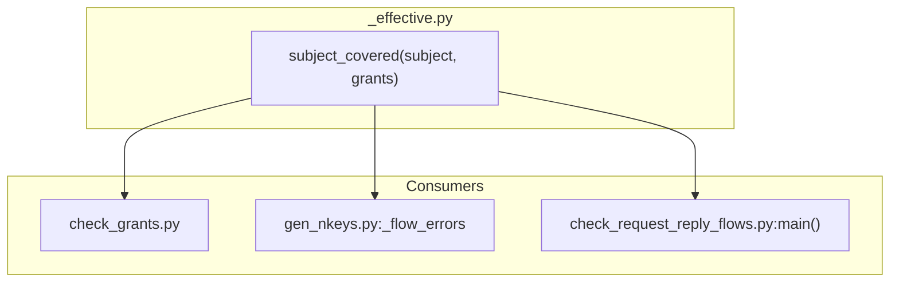
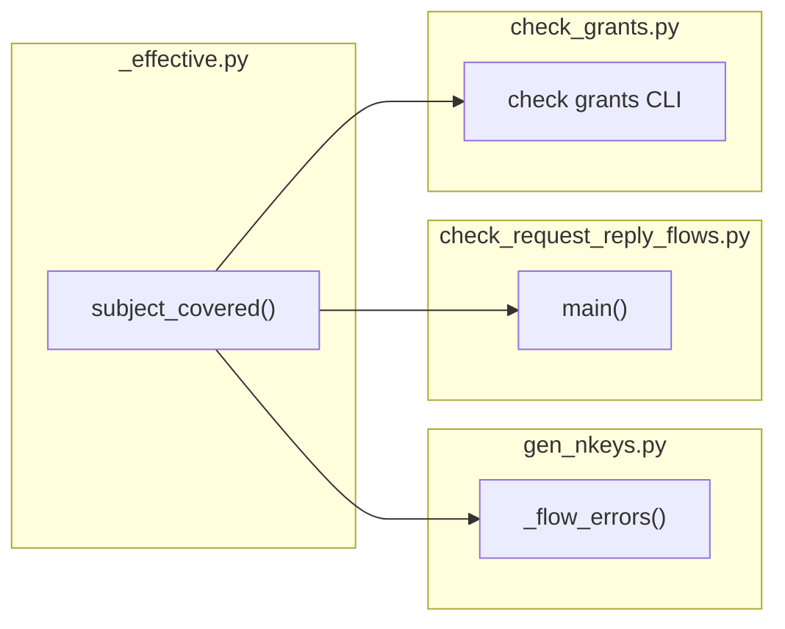

## Summary

Consolidate `subject_covered` to `scripts/_effective.py`, fix `.*` and `.>` NATS semantics, add parametric tests, and migrate `gen_nkeys.py` + `check_request_reply_flows.py` to import from the canonical location.

## Architecture

### Data flow

### File × Function map

## Wave Structure

3 waves, max 2 parallel agents. Elapsed ~1 day sequential.

| Wave | Trigger | Agents | Tasks |
|------|---------|--------|-------|
| 1 | start | backend-dev-A | T1: Harden `subject_covered` + add tests |
| 2 | Wave 1 done | backend-dev-A | T2: Migrate `gen_nkeys.py` · T3: Migrate `check_request_reply_flows.py` |
| 3 | Wave 2 done | tester-A | T4: Verify all CI gates green |

### Budget — per task

| Task | Items | Class | Est. ops | Split? |
|------|-------|-------|----------|--------|
| T1 | 2 files | bounded | 6 | — |
| T2 | 1 file | trivial | 2 | — |
| T3 | 1 file | trivial | 2 | — |
| T4 | 3 checks | exploratory | 8 | — |

**Total estimated ops: 18**

### Budget — per agent instance

| Instance | Tasks | Σ ops | Subjects | Split? |
|----------|-------|-------|----------|--------|
| backend-dev-A | T1, T2, T3 | 10 | acl | — |
| tester-A | T4 | 8 | test | — |

## Micro-Tasks

### T1 — Harden `subject_covered` in `_effective.py` + add parametric tests

| Field | Value |
|-------|-------|
| Description | Update `subject_covered` in `_effective.py` to add `.*` handling and remove bare-prefix `.>` match. Add parametric tests `TestSubjectCovered` in `test_effective.py`. |
| Files | `scripts/_effective.py`, `tests/scripts/test_effective.py` |
| Code snippet | Add `if grant.endswith(".*"):` block; remove `subject == bare` from `.>` block. Add `@pytest.mark.parametrize` tests. |
| Verify command | `uv run pytest tests/scripts/test_effective.py -k TestSubjectCovered -v` |
| Expected output | All tests pass (8–12 cases) |
| Time estimate | 5–8 min |
| [P] | N |
| Agent | backend-dev-A |
| Subject | acl |
| Spec trace | SC1–SC3, SC7 |
| Slice | S1 |
| Phase | GREEN |
| Difficulty | 3 |

### T2 — Migrate `gen_nkeys.py` to import from `_effective.py`

| Field | Value |
|-------|-------|
| Description | Remove private `_subject_covered` from `gen_nkeys.py`. Add `from scripts._effective import subject_covered`. Update `_flow_errors` to use `subject_covered` (no underscore). |
| Files | `scripts/gen_nkeys.py` |
| Code snippet | Delete `def _subject_covered(...)` block. Add import. Change `_subject_covered(...)` → `subject_covered(...)` in `_flow_errors`. |
| Verify command | `uv run pytest tests/scripts/test_check_request_reply_flows.py -v` |
| Expected output | All tests pass |
| Time estimate | 3 min |
| [P] | Y |
| Agent | backend-dev-A |
| Subject | acl |
| Spec trace | SC4 |
| Slice | S2 |
| Phase | REFACTOR |
| Difficulty | 2 |

### T3 — Migrate `check_request_reply_flows.py` to import from `_effective.py`

| Field | Value |
|-------|-------|
| Description | Remove private `_subject_covered` from `check_request_reply_flows.py`. Add `from scripts._effective import subject_covered`. Update `main()` to use `subject_covered` (no underscore). |
| Files | `scripts/check_request_reply_flows.py` |
| Code snippet | Delete `def _subject_covered(...)` block. Add import. Change `_subject_covered(...)` → `subject_covered(...)` in `main()`. |
| Verify command | `uv run pytest tests/scripts/test_check_request_reply_flows.py -v` |
| Expected output | All tests pass |
| Time estimate | 3 min |
| [P] | Y |
| Agent | backend-dev-A |
| Subject | acl |
| Spec trace | SC5 |
| Slice | S3 |
| Phase | REFACTOR |
| Difficulty | 2 |

### T4 — Verify all CI gates green

| Field | Value |
|-------|-------|
| Description | Run the 3 CI ACL checks locally to confirm no regression: `lyra-check-flows`, `lyra-check-acl-retired`, `lyra-acl check grants`. |
| Files | CI workflows (read-only) |
| Verify command | `uv run lyra-check-flows && uv run lyra-check-acl-retired && uv run lyra-acl check grants --matrix deploy/nats/acl-matrix.json --code-subjects deploy/nats/code-subjects.json` |
| Expected output | All exit 0 |
| Time estimate | 5 min |
| [P] | N |
| Agent | tester-A |
| Subject | test |
| Spec trace | SC8–SC10 |
| Slice | S4 |
| Phase | RED-GATE |
| Difficulty | 2 |

## Consistency Report

| Criterion | Covered | Trace |
|-----------|---------|-------|
| SC1: `subject_covered` handles exact/`>`/`.*`/`.` | ✓ | T1 |
| SC2: `.>` matches sub-levels, not bare prefix | ✓ | T1 |
| SC3: `.*` matches single token, not multi/bare | ✓ | T1 |
| SC4: `gen_nkeys.py` imports from `_effective.py` | ✓ | T2 |
| SC5: `check_request_reply_flows.py` imports from `_effective.py` | ✓ | T3 |
| SC6: `check_grants.py` unchanged | ✓ | T1 (already imports) |
| SC7: Parametric tests in `test_effective.py` | ✓ | T1 |
| SC8: `test_check_request_reply_flows.py` passes | ✓ | T2, T3 |
| SC9: `lyra-check-flows` CI green | ✓ | T4 |
| SC10: `lyra-acl check grants` CI green | ✓ | T4 |

**Coverage:** 10/10 ✓

## Task Seeding Blueprint

### Wave 1 — no deps, 1 agent

| Task | Agent instance | blockedBy | Subject |
|------|---------------|-----------|---------|
| T1 | backend-dev-A | — | acl |

### Wave 2 — after T1, 1 agent, 2 tasks ∆

| Task | Agent instance | blockedBy | Subject |
|------|---------------|-----------|---------|
| T2 | backend-dev-A | T1 | acl |
| T3 | backend-dev-A | T1 | acl |

### Wave 3 — after T2+T3, 1 agent

| Task | Agent instance | blockedBy | Subject |
|------|---------------|-----------|---------|
| T4 | tester-A | T2, T3 | test |

## Task IDs

<!-- Generated by /plan. Used by /implement to resume tasks on session restart. -->
- T1: 13 — acl
- T2: 14 — acl
- T3: 15 — acl
- T4: 16 — test
