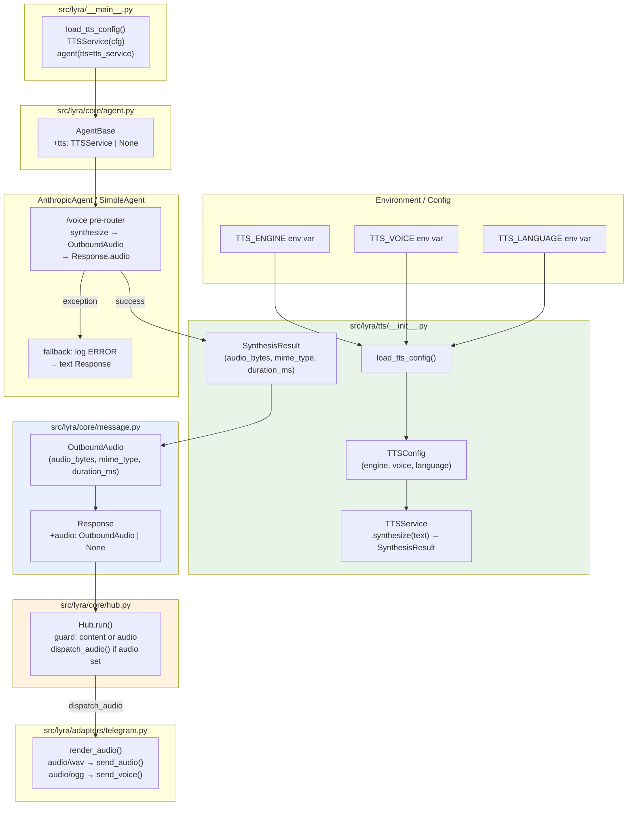
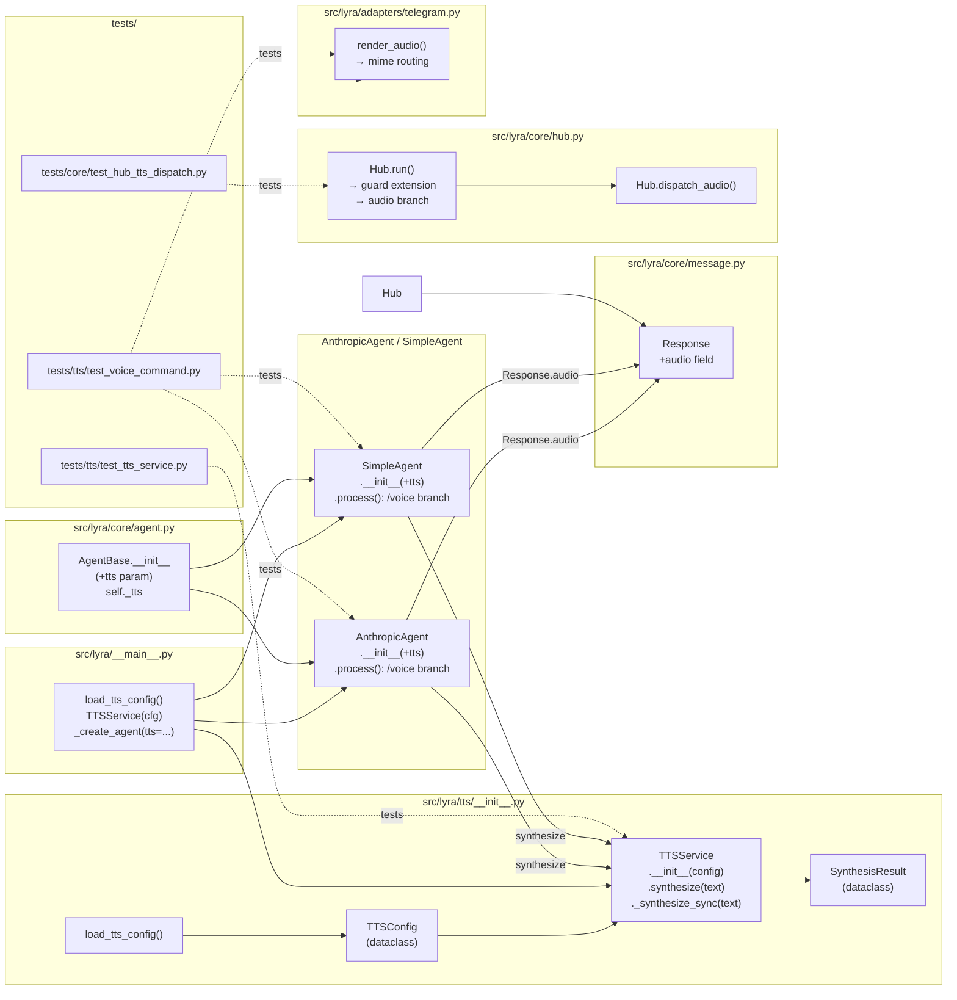

## Summary

Create `src/lyra/tts/` service module mirroring `src/lyra/stt/`, extend `Response` with an optional
`audio` field, wire `TTSService` into the DI chain (AgentBase only, not Hub), and add a `/voice`
built-in command that synthesizes speech via voiceCLI and dispatches it through the existing audio
pipeline. Four slices, sequential dependencies, 12 implementation tasks.

---

## Architecture

### Data Flow



### File × Function Map



---

## Parallel vs Sequential

```
V1 (TTSService)
 └─► V2 (Response.audio + Hub)        ← sequential: hub uses Response.audio
      └─► V3 (Agent DI wiring)        ← sequential: agents need Response with audio
           └─► V4 (/voice + routing)  ← sequential: agents need self._tts

Within V3:  T07a (AnthropicAgent) ‖ T07b (SimpleAgent)   [P — independent files]
Within V4:  T09 (AnthropicAgent)  ‖ T10 (SimpleAgent)    [P — independent files]
            T11 (Telegram routing) ‖ T09/T10             [P — independent files]

Testing:    T02 starts after T01; T05 after T03+T04; T12 after T09+T10+T11
```

---

## Bootstrap Context

Pattern reference: `src/lyra/stt/__init__.py` + `tests/stt/test_stt_service.py`

Key patterns to mirror:
- `STTService._transcribe_sync()` → `TTSService._synthesize_sync()` (blocking, called via `asyncio.to_thread`)
- `load_stt_config()` → `load_tts_config()` (env var loading)
- `stt: STTService | None` in AgentBase → `tts: TTSService | None`
- `__main__.py` STT block (lines 365–372) → TTS block mirrors it exactly

Key difference from STT: temp file is **TTSService-owned** (TTS creates + deletes it internally).
STT temp file is agent-owned per ADR-013. TTS temp file is an output created by the service itself.

---

## Agents

| Agent | Tasks | Files |
|-------|-------|-------|
| backend-dev | T01, T03, T04, T06, T07a, T07b, T08, T09, T10, T11 | tts/__init__.py, message.py, hub.py, agent.py, anthropic_agent.py, simple_agent.py, __main__.py, telegram.py |
| tester | T02, T05, T12 | tests/tts/test_tts_service.py, tests/core/test_hub_tts_dispatch.py, tests/tts/test_voice_command.py |

---

## Consistency Report

| Criteria | Covered | Notes |
|----------|---------|-------|
| SC-01 synthesize() returns SynthesisResult | T01, T02 | |
| SC-02 duration_ms populated | T01, T02 | |
| SC-03 TTSConfig env vars | T01, T02 | |
| SC-04 temp WAV deleted | T01, T02 | success + failure paths |
| SC-05 /voice → audio message | T09, T10, T12 | |
| SC-06 /voice on Discord | T09, T10 | Discord adapter unchanged |
| SC-07 TTS failure → text fallback | T09, T10, T12 | |
| SC-08 non-voice regression | T12 | |
| SC-09 load_tts_config() factory | T01, T08 | |
| SC-10 tts injected into AgentBase | T06, T07a, T07b, T08 | |
| SC-11 Telegram format routing | T11, T12 | WAV→send_audio, OGG→send_voice |

Covered: 11/11 ✓ | Uncovered: 0 | Untraced: 0

---

## Micro-Tasks

### V1 — TTSService module (sub-issue #234)

---

**T01** [RED] Create `src/lyra/tts/__init__.py`
- **File:** `src/lyra/tts/__init__.py` (CREATE)
- **Agent:** backend-dev
- **Spec trace:** SC-01, SC-02, SC-03, SC-04 / N1, C1
- **Slice:** V1
- **Difficulty:** 2
- **Time:** 8 min
- **Parallel-safe:** N (foundational)
- **Code shape:**
```python
"""TTS service — thin wrapper around voiceCLI (Qwen TTS + daemon queue)."""
from __future__ import annotations
import asyncio, logging, os, wave
from dataclasses import dataclass
from pathlib import Path
import tempfile

log = logging.getLogger(__name__)

@dataclass
class SynthesisResult:
    audio_bytes: bytes
    mime_type: str
    duration_ms: int | None

@dataclass
class TTSConfig:
    engine: str | None = None
    voice: str | None = None
    language: str | None = None

def load_tts_config() -> TTSConfig:
    return TTSConfig(
        engine=os.environ.get("TTS_ENGINE") or None,
        voice=os.environ.get("TTS_VOICE") or None,
        language=os.environ.get("TTS_LANGUAGE") or None,
    )

class TTSService:
    def __init__(self, config: TTSConfig) -> None: ...
    async def synthesize(self, text: str) -> SynthesisResult:
        return await asyncio.to_thread(self._synthesize_sync, text)
    def _synthesize_sync(self, text: str) -> SynthesisResult:
        tmp = Path(tempfile.mktemp(suffix=".wav"))
        try:
            from voicecli import generate
            result = generate(text, engine=..., voice=..., output=tmp, ...)
            audio_bytes = result.wav_path.read_bytes()
            duration_ms = _wav_duration_ms(result.wav_path)
            return SynthesisResult(audio_bytes=audio_bytes, mime_type="audio/wav", duration_ms=duration_ms)
        finally:
            tmp.unlink(missing_ok=True)

def _wav_duration_ms(path: Path) -> int | None:
    try:
        with wave.open(str(path)) as wf:
            return int(wf.getnframes() / wf.getframerate() * 1000)
    except Exception:
        return None
```
- **Verify:** `uv run python -c "from lyra.tts import TTSService, TTSConfig, SynthesisResult, load_tts_config; print('ok')"`
- **Expected output:** `ok`

---

**T02** [GREEN] Create `tests/tts/test_tts_service.py`
- **File:** `tests/tts/__init__.py` (CREATE), `tests/tts/test_tts_service.py` (CREATE)
- **Agent:** tester
- **Spec trace:** SC-01, SC-02, SC-03, SC-04
- **Slice:** V1
- **Difficulty:** 2
- **Time:** 8 min
- **Parallel-safe:** Y (after T01)
- **Tests to include:**
  - `test_config_defaults` — TTSConfig() has None for all fields
  - `test_load_tts_config_env_vars` — monkeypatch TTS_ENGINE/TTS_VOICE/TTS_LANGUAGE
  - `test_synthesize_returns_synthesis_result` — mock voicecli.generate, mock WAV file, assert SynthesisResult fields
  - `test_synthesize_cleans_up_temp_file_on_success` — assert tmp file deleted
  - `test_synthesize_cleans_up_temp_file_on_failure` — mock generate raises, assert tmp still deleted
  - `test_wav_duration_ms_none_on_bad_file` — assert _wav_duration_ms returns None on corrupt header
- **Verify:** `uv run pytest tests/tts/ -v`
- **Expected output:** 6 passed

---

**─── RED-GATE V1 → V2 ──────────────────────────────────────────────────**
`uv run pytest tests/tts/ -v` must pass before V2 starts.

---

### V2 — Response.audio + Hub dispatch (sub-issue #235)

---

**T03** [RED] Add `audio` field to `Response` in `src/lyra/core/message.py`
- **File:** `src/lyra/core/message.py` (MODIFY)
- **Agent:** backend-dev
- **Spec trace:** SC-05 / N3
- **Slice:** V2
- **Difficulty:** 1
- **Time:** 3 min
- **Parallel-safe:** N (T04 depends on this)
- **Change:** Add `audio: "OutboundAudio | None" = None` to Response dataclass (as `field(default=None)` with TYPE_CHECKING import guard if needed for forward ref)
- **Verify:** `uv run python -c "from lyra.core.message import Response; r = Response(content=''); assert r.audio is None; print('ok')"`
- **Expected output:** `ok`

---

**T04** [RED] Extend `Hub.run()` guard + add audio dispatch branch in `src/lyra/core/hub.py`
- **File:** `src/lyra/core/hub.py` (MODIFY)
- **Agent:** backend-dev
- **Spec trace:** SC-05 / N4
- **Slice:** V2
- **Difficulty:** 2
- **Time:** 5 min
- **Parallel-safe:** N (requires T03)
- **Change:**
```python
# hub.py line ~789 — replace:
if result.response and result.response.content:
    await self.dispatch_response(msg, result.response)
# with:
if result.response and (result.response.content or result.response.audio):
    if result.response.audio:
        await self.dispatch_audio(msg, result.response.audio)
    if result.response.content:
        await self.dispatch_response(msg, result.response)
```
- **Verify:** `uv run pytest tests/test_hub.py tests/core/ -v -k "not slow"`
- **Expected output:** all existing hub tests pass

---

**T05** [GREEN] Create `tests/core/test_hub_tts_dispatch.py`
- **File:** `tests/core/test_hub_tts_dispatch.py` (CREATE)
- **Agent:** tester
- **Spec trace:** SC-05
- **Slice:** V2
- **Difficulty:** 2
- **Time:** 6 min
- **Parallel-safe:** Y (after T03, T04)
- **Tests:**
  - `test_audio_only_response_dispatches_audio` — Response(content="", audio=OutboundAudio(...)) → dispatch_audio called
  - `test_text_only_response_dispatches_text` — Response(content="hello") → dispatch_response called, dispatch_audio not called
  - `test_audio_and_text_response_dispatches_both` — Response with both → both dispatch methods called
  - `test_empty_response_dispatches_nothing` — Response(content="") with no audio → neither called (existing behavior)
- **Verify:** `uv run pytest tests/core/test_hub_tts_dispatch.py -v`
- **Expected output:** 4 passed

---

**─── RED-GATE V2 → V3 ──────────────────────────────────────────────────**
`uv run pytest tests/core/test_hub_tts_dispatch.py tests/test_hub.py -v` must pass.

---

### V3 — Agent DI wiring (sub-issue #236)

---

**T06** [RED] Add `tts: TTSService | None` param to `AgentBase.__init__()` in `src/lyra/core/agent.py`
- **File:** `src/lyra/core/agent.py` (MODIFY)
- **Agent:** backend-dev
- **Spec trace:** SC-10
- **Slice:** V3
- **Difficulty:** 1
- **Time:** 4 min
- **Parallel-safe:** N (T07a, T07b depend on this)
- **Change:** Add `tts: "TTSService | None" = None` to `AgentBase.__init__()` signature after `stt`; store `self._tts = tts`. Add TYPE_CHECKING import for TTSService.
- **Pattern:** Mirror `stt: STTService | None = None` / `self._stt = stt` at line ~413–428
- **Verify:** `uv run python -c "from lyra.core.agent import AgentBase; print('ok')"`

---

**T07a** [RED] Add `tts` param to `AnthropicAgent.__init__()` [P]
- **File:** `src/lyra/agents/anthropic_agent.py` (MODIFY)
- **Agent:** backend-dev
- **Spec trace:** SC-10
- **Slice:** V3
- **Difficulty:** 1
- **Time:** 3 min
- **Parallel-safe:** Y (parallel with T07b, independent files)
- **Change:** Add `tts: TTSService | None = None` to `AnthropicAgent.__init__()` after `stt`, pass to `super().__init__(..., tts=tts)`
- **Verify:** `uv run python -c "from lyra.agents.anthropic_agent import AnthropicAgent; print('ok')"`

---

**T07b** [RED] Add `tts` param to `SimpleAgent.__init__()` [P]
- **File:** `src/lyra/agents/simple_agent.py` (MODIFY)
- **Agent:** backend-dev
- **Spec trace:** SC-10
- **Slice:** V3
- **Difficulty:** 1
- **Time:** 3 min
- **Parallel-safe:** Y (parallel with T07a)
- **Change:** Same pattern as T07a for SimpleAgent
- **Verify:** `uv run python -c "from lyra.agents.simple_agent import SimpleAgent; print('ok')"`

---

**T08** [RED] Wire `TTSService` in `src/lyra/__main__.py`
- **File:** `src/lyra/__main__.py` (MODIFY)
- **Agent:** backend-dev
- **Spec trace:** SC-09, SC-10
- **Slice:** V3
- **Difficulty:** 2
- **Time:** 5 min
- **Parallel-safe:** N (requires T07a, T07b)
- **Change:** After STT block (line ~365–372), add:
```python
tts_service: TTSService | None = None
if os.environ.get("TTS_ENGINE") or True:  # always enabled; voicecli daemon-first fallback handles availability
    tts_cfg = load_tts_config()
    tts_service = TTSService(tts_cfg)
    log.info("TTS enabled (engine=%s voice=%s, via voiceCLI)", tts_cfg.engine or "default", tts_cfg.voice or "default")
```
Then add `tts=tts_service` to `_create_agent()` call.
- **Verify:** `uv run pytest tests/test_main.py -v -k "not integration"`
- **Expected output:** existing main tests pass

---

**─── RED-GATE V3 → V4 ──────────────────────────────────────────────────**
`uv run pytest tests/ -v -k "not integration and not slow"` must pass.

---

### V4 — /voice trigger + format routing + fallback (sub-issue #237)

---

**T09** [RED] Add `/voice` pre-router in `AnthropicAgent.process()` [P]
- **File:** `src/lyra/agents/anthropic_agent.py` (MODIFY)
- **Agent:** backend-dev
- **Spec trace:** SC-05, SC-07, SC-08 / U1, N1, N2, N3, E1
- **Slice:** V4
- **Difficulty:** 2
- **Time:** 6 min
- **Parallel-safe:** Y (parallel with T10, T11)
- **Change:** At the start of `process()`, before CommandRouter dispatch:
```python
if self._tts is not None and msg.content.strip().startswith("/voice "):
    text = msg.content.strip()[len("/voice "):].strip()
    try:
        result = await self._tts.synthesize(text)
        audio = OutboundAudio(
            audio_bytes=result.audio_bytes,
            mime_type=result.mime_type,
            duration_ms=result.duration_ms,
        )
        return Response(content="", audio=audio)
    except Exception:
        log.error("TTS synthesis failed for /voice command", exc_info=True)
        return Response(content="Sorry, I couldn't generate audio.")
```
- **Verify:** `uv run python -c "from lyra.agents.anthropic_agent import AnthropicAgent; print('ok')"`

---

**T10** [RED] Add `/voice` pre-router in `SimpleAgent.process()` [P]
- **File:** `src/lyra/agents/simple_agent.py` (MODIFY)
- **Agent:** backend-dev
- **Spec trace:** SC-05, SC-07 / U1, N1, N2, N3, E1
- **Slice:** V4
- **Difficulty:** 2
- **Time:** 5 min
- **Parallel-safe:** Y (parallel with T09)
- **Change:** Same pattern as T09 in SimpleAgent.process()
- **Verify:** `uv run python -c "from lyra.agents.simple_agent import SimpleAgent; print('ok')"`

---

**T11** [RED] Update `TelegramAdapter.render_audio()` for MIME routing [P]
- **File:** `src/lyra/adapters/telegram.py` (MODIFY)
- **Agent:** backend-dev
- **Spec trace:** SC-11 / N6
- **Slice:** V4
- **Difficulty:** 2
- **Time:** 6 min
- **Parallel-safe:** Y (parallel with T09, T10)
- **Change:** In `render_audio()` (~line 934–950), replace hardcoded `send_voice()` with MIME routing:
```python
audio_buf = BytesIO(msg.audio_bytes)
if msg.mime_type in ("audio/wav", "audio/mpeg", "audio/mp3"):
    # send_audio: file player UI (no voice bubble)
    kwargs = {"chat_id": chat_id, "audio": audio_buf}
    if msg.caption:
        kwargs["caption"] = msg.caption[:1024]
    if msg.reply_to_id:
        kwargs["reply_to_message_id"] = int(msg.reply_to_id)
    await self.bot.send_audio(**kwargs)
else:
    # send_voice: voice bubble UI (requires OGG/Opus)
    kwargs = {"chat_id": chat_id, "voice": audio_buf}
    # ... existing caption/duration/reply logic ...
    await self.bot.send_voice(**kwargs)
```
- **Verify:** `uv run pytest tests/test_render_audio.py -v`
- **Expected output:** existing render_audio tests pass

---

**T12** [GREEN] Tests: `/voice` command + fallback + Telegram format routing
- **File:** `tests/tts/test_voice_command.py` (CREATE)
- **Agent:** tester
- **Spec trace:** SC-05, SC-06, SC-07, SC-08, SC-11
- **Slice:** V4
- **Difficulty:** 3
- **Time:** 10 min
- **Parallel-safe:** Y (after T09, T10, T11)
- **Tests:**
  - `test_voice_command_returns_audio_response` — mock TTSService.synthesize(), send `/voice hello`, assert Response.audio is set
  - `test_voice_command_tts_failure_returns_text` — mock synthesize raises → Response.content non-empty, Response.audio is None
  - `test_non_voice_message_unaffected` — send regular message, assert TTSService.synthesize not called
  - `test_telegram_render_audio_wav_uses_send_audio` — mock bot, send OutboundAudio(mime_type="audio/wav"), assert send_audio called
  - `test_telegram_render_audio_ogg_uses_send_voice` — send audio/ogg, assert send_voice called
  - `test_no_tts_service_skips_voice_handler` — agent with tts=None, /voice command → falls through to CommandRouter (unknown command)
- **Verify:** `uv run pytest tests/tts/test_voice_command.py tests/test_render_audio.py -v`
- **Expected output:** all pass

---

**[REFACTOR]** Run full suite, fix any import issues from new module:
```bash
uv run pytest --tb=short -q
```
