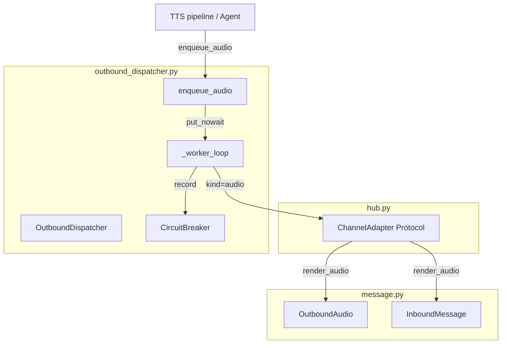
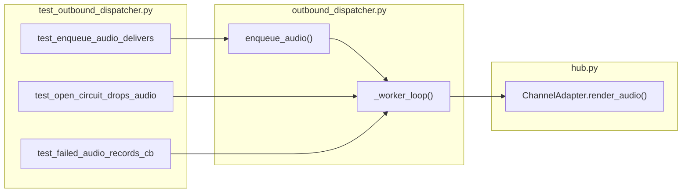

## Summary

Add `render_audio()` to the `ChannelAdapter` protocol and wire audio delivery through `OutboundDispatcher` via a new `enqueue_audio()` method, giving audio the same circuit breaker ownership as text and streaming sends.

## Architecture





## Agents

| Agent | Tasks | Files |
|-------|-------|-------|
| backend-dev | 4 | `hub.py`, `outbound_dispatcher.py` |
| tester | 3 | `tests/core/test_outbound_dispatcher.py` |

## Consistency Report

| Metric | Value |
|--------|-------|
| Success criteria covered | 8/8 |
| Uncovered | 0 |
| Untraced tasks | 0 |

## Micro-Tasks

### Slice V1 — Protocol + dispatcher method

#### Task 1 · [P] · backend-dev · SC-1

**Add `render_audio` to `ChannelAdapter` protocol**

File: `src/lyra/core/hub.py`

Add `OutboundAudio` to the imports from `message.py`, then add the method stub to the protocol class after `send_streaming`:

```python
async def render_audio(
    self, audio: OutboundAudio, inbound: InboundMessage
) -> None: ...
```

Verify:
```bash
uv run pyright src/lyra/core/hub.py
```
Expected: no errors (adapters already implement `render_audio` with matching signature)

Spec trace: SC-1
Difficulty: 1

---

#### Task 2 · [P] · backend-dev · SC-1, SC-2

**Add `OutboundAudio` import to `outbound_dispatcher.py`**

File: `src/lyra/core/outbound_dispatcher.py`

Add `OutboundAudio` to the import from `.message`:

```python
from .message import InboundMessage, OutboundAudio, OutboundMessage
```

Update the `_ITEM` comment:

```python
# Queue item: (kind, msg, payload) for send; (kind, msg, chunks, outbound) for streaming; (kind, inbound, audio) for audio
```

Verify:
```bash
uv run ruff check src/lyra/core/outbound_dispatcher.py
```
Expected: no violations

Spec trace: SC-1, SC-2
Difficulty: 1

---

#### Task 3 · backend-dev · SC-2

**Add `enqueue_audio()` method**

File: `src/lyra/core/outbound_dispatcher.py`

Add after `enqueue_streaming()`:

```python
def enqueue_audio(
    self, inbound: InboundMessage, audio: OutboundAudio
) -> None:
    """Enqueue an audio response for delivery.

    Fire-and-forget: returns immediately. The worker task calls
    adapter.render_audio() asynchronously with CB ownership.
    """
    self._queue.put_nowait(("audio", inbound, audio))
```

Verify:
```bash
uv run pyright src/lyra/core/outbound_dispatcher.py
```
Expected: no errors

Spec trace: SC-2
Difficulty: 1

---

#### Task 4 · backend-dev · SC-3, SC-4, SC-5, SC-6

**Add `elif kind == "audio"` branch in `_worker_loop()`**

File: `src/lyra/core/outbound_dispatcher.py`

In `_worker_loop()`, replace the current unpacking logic to handle three kinds explicitly. The audio tuple is `("audio", inbound, audio)` — a 3-tuple like `"send"`, but dispatches to `render_audio(audio, inbound)` instead of `send(msg, payload)`.

Key changes:
1. Unpack: `elif kind == "audio": _, inbound, audio = item`
2. CB open check: log drop, continue (no iterator to drain, no outbound metadata to clear)
3. CB closed dispatch: `await self._adapter.render_audio(audio, inbound)`
4. Success/failure recording: same pattern as send/streaming

Verify:
```bash
uv run pyright src/lyra/core/outbound_dispatcher.py && uv run ruff check src/lyra/core/outbound_dispatcher.py
```
Expected: no errors, no violations

Spec trace: SC-3, SC-4, SC-5, SC-6
Difficulty: 3

---

### RED-GATE V1

```bash
uv run pyright src/lyra/core/hub.py src/lyra/core/outbound_dispatcher.py && uv run ruff check .
```

---

### Slice V2 — Tests

#### Task 5 · [P] · tester · SC-7

**Test: `enqueue_audio` delivers via `adapter.render_audio()`**

File: `tests/core/test_outbound_dispatcher.py`

Add `render_audio = AsyncMock()` to the adapter mock in `_make_adapter()`. Add test:

```python
async def test_enqueue_audio_delivers_via_adapter(self) -> None:
    adapter, dispatcher = _make_adapter()
    await dispatcher.start()
    try:
        inbound = _make_msg()
        audio = OutboundAudio(audio_bytes=b"fake-ogg", mime_type="audio/ogg")
        dispatcher.enqueue_audio(inbound, audio)
        await asyncio.sleep(0.05)
        adapter.render_audio.assert_awaited_once_with(audio, inbound)
    finally:
        await dispatcher.stop()
```

Verify:
```bash
uv run pytest tests/core/test_outbound_dispatcher.py -k "enqueue_audio_delivers" -x
```
Expected: 1 passed

Spec trace: SC-7 (CB closed + success path)
Difficulty: 2

---

#### Task 6 · [P] · tester · SC-7

**Test: open circuit drops audio item**

File: `tests/core/test_outbound_dispatcher.py`

```python
async def test_open_circuit_drops_audio(self) -> None:
    adapter = MagicMock()
    adapter.render_audio = AsyncMock()
    cb = CircuitBreaker(name="telegram", failure_threshold=1)
    cb.record_failure()
    assert cb.is_open()
    dispatcher = OutboundDispatcher(
        platform_name="telegram", adapter=adapter, circuit=cb
    )
    await dispatcher.start()
    try:
        inbound = _make_msg()
        audio = OutboundAudio(audio_bytes=b"fake-ogg", mime_type="audio/ogg")
        dispatcher.enqueue_audio(inbound, audio)
        await asyncio.sleep(0.05)
        adapter.render_audio.assert_not_awaited()
    finally:
        await dispatcher.stop()
```

Verify:
```bash
uv run pytest tests/core/test_outbound_dispatcher.py -k "drops_audio" -x
```
Expected: 1 passed

Spec trace: SC-7 (CB open path)
Difficulty: 2

---

#### Task 7 · [P] · tester · SC-7

**Test: failed audio records CB failure**

File: `tests/core/test_outbound_dispatcher.py`

```python
async def test_failed_audio_records_cb_failure(self) -> None:
    adapter = MagicMock()
    adapter.render_audio = AsyncMock(side_effect=Exception("tts error"))
    cb = CircuitBreaker(name="telegram", failure_threshold=5)
    dispatcher = OutboundDispatcher(
        platform_name="telegram", adapter=adapter, circuit=cb
    )
    await dispatcher.start()
    try:
        inbound = _make_msg()
        audio = OutboundAudio(audio_bytes=b"fake-ogg", mime_type="audio/ogg")
        dispatcher.enqueue_audio(inbound, audio)
        await asyncio.sleep(0.05)
        assert cb._failure_count >= 1
    finally:
        await dispatcher.stop()
```

Verify:
```bash
uv run pytest tests/core/test_outbound_dispatcher.py -k "failed_audio" -x
```
Expected: 1 passed

Spec trace: SC-7 (CB failure path)
Difficulty: 2

---

### RED-GATE V2

```bash
uv run pytest tests/core/test_outbound_dispatcher.py -x && uv run ruff check . && uv run pyright
```

### Final gate

```bash
uv run pytest && uv run ruff check . && uv run pyright
```

Expected: SC-8 (all quality gates pass)

## Reference Patterns

- `enqueue_streaming()` at `src/lyra/core/outbound_dispatcher.py:69-80` — direct pattern to mirror
- `test_enqueue_streaming_delivers_via_adapter` at `tests/core/test_outbound_dispatcher.py:63-78` — test pattern to mirror
- `test_open_circuit_drops_streaming_and_sets_sentinel` at `tests/core/test_outbound_dispatcher.py:137-161` — CB open test pattern
