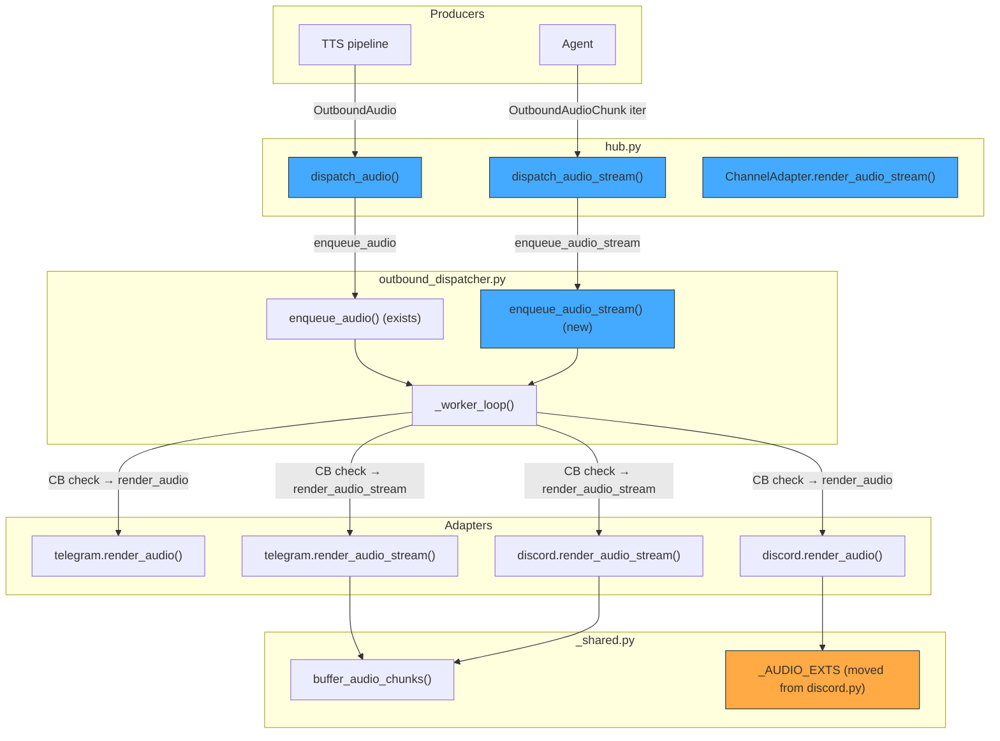
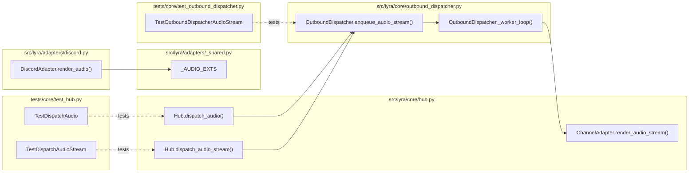

## Summary

Add `dispatch_audio()` and `dispatch_audio_stream()` to Hub, wire streaming audio through OutboundDispatcher with CB ownership, add `render_audio_stream` to the ChannelAdapter protocol, and move `_AUDIO_EXTS` to `_shared.py`. Two slices: dispatcher foundation first, then Hub dispatch methods.

## Architecture

### Data flow diagram



### File x function map



## Agents

| Agent | Tasks | Files |
|-------|-------|-------|
| backend-dev | T1–T11 | `outbound_dispatcher.py`, `hub.py`, `_shared.py`, `discord.py`, test files |

## Consistency Report

| Metric | Value |
|--------|-------|
| Spec criteria covered | 11/11 |
| Uncovered criteria | 0 |
| Untraced tasks | 0 |

| SC | Description | Tasks |
|----|-------------|-------|
| SC-1 | dispatch_audio routes through dispatcher | T7, T9 |
| SC-2 | dispatch_audio_stream routes through dispatcher | T8, T10 |
| SC-3 | enqueue_audio_stream handles streaming in worker loop | T1, T3 |
| SC-4 | CB open drains streaming iterator | T2, T3 |
| SC-5 | ChannelAdapter protocol includes render_audio_stream | T4 |
| SC-6 | Fallback: no dispatcher → direct adapter call | T8, T9, T10 |
| SC-7 | _AUDIO_EXTS moved to _shared.py | T5 |
| SC-8 | Test: dispatcher streaming delivery | T1 |
| SC-9 | Test: CB open drain | T2 |
| SC-10 | Test: hub dispatch routing | T7 |
| SC-11 | Test: hub dispatch_audio_stream fallback | T8 |

## Micro-Tasks

### Slice 1: Dispatcher + protocol foundation

---

**T1 — RED: Test enqueue_audio_stream delivers via adapter** `[P]`
- **File:** `tests/core/test_outbound_dispatcher.py`
- **Agent:** backend-dev
- **Spec trace:** SC-3, SC-8
- **Difficulty:** 2
- **Time:** 3 min

```python
# In TestOutboundDispatcherAudioStream
async def test_enqueue_audio_stream_delivers_via_adapter(self) -> None:
    adapter = MagicMock()
    adapter.render_audio_stream = AsyncMock()
    dispatcher = OutboundDispatcher(platform_name="telegram", adapter=adapter)
    await dispatcher.start()
    try:
        inbound = _make_msg()
        async def chunks() -> AsyncIterator[OutboundAudioChunk]:
            yield OutboundAudioChunk(chunk_bytes=b"data", session_id="s1", chunk_index=0, is_final=True)
        dispatcher.enqueue_audio_stream(inbound, chunks())
        await asyncio.sleep(0.05)
        adapter.render_audio_stream.assert_awaited_once()
        call_args = adapter.render_audio_stream.call_args[0]
        assert call_args[1] is inbound  # second arg is inbound
    finally:
        await dispatcher.stop()
```

**Verify:** `uv run pytest tests/core/test_outbound_dispatcher.py::TestOutboundDispatcherAudioStream::test_enqueue_audio_stream_delivers_via_adapter -x`
**Expected:** FAILED (enqueue_audio_stream doesn't exist yet)

---

**T2 — RED: Test CB open drains streaming audio iterator** `[P]`
- **File:** `tests/core/test_outbound_dispatcher.py`
- **Agent:** backend-dev
- **Spec trace:** SC-4, SC-9
- **Difficulty:** 2
- **Time:** 3 min

```python
async def test_open_circuit_drops_audio_stream_and_drains(self) -> None:
    adapter = MagicMock()
    adapter.render_audio_stream = AsyncMock()
    cb = CircuitBreaker(name="telegram", failure_threshold=1)
    cb.record_failure()
    assert cb.is_open()
    dispatcher = OutboundDispatcher(platform_name="telegram", adapter=adapter, circuit=cb)
    await dispatcher.start()
    try:
        inbound = _make_msg()
        drained = []
        async def chunks() -> AsyncIterator[OutboundAudioChunk]:
            for i in range(3):
                drained.append(i)
                yield OutboundAudioChunk(chunk_bytes=b"x", session_id="s1", chunk_index=i, is_final=(i==2))
        dispatcher.enqueue_audio_stream(inbound, chunks())
        await asyncio.sleep(0.05)
        adapter.render_audio_stream.assert_not_awaited()
        assert len(drained) == 3  # iterator fully consumed
    finally:
        await dispatcher.stop()
```

**Verify:** `uv run pytest tests/core/test_outbound_dispatcher.py::TestOutboundDispatcherAudioStream::test_open_circuit_drops_audio_stream_and_drains -x`
**Expected:** FAILED (enqueue_audio_stream doesn't exist yet)

---

**T3 — GREEN: Add enqueue_audio_stream + worker loop branch**
- **File:** `src/lyra/core/outbound_dispatcher.py`
- **Agent:** backend-dev
- **Spec trace:** SC-3, SC-4
- **Difficulty:** 3
- **Time:** 5 min

```python
# New method on OutboundDispatcher (after enqueue_audio):
def enqueue_audio_stream(
    self, inbound: InboundMessage, chunks: AsyncIterator["OutboundAudioChunk"],
) -> None:
    """Enqueue a streaming audio response for delivery.
    Fire-and-forget. Worker calls adapter.render_audio_stream() with CB ownership.
    """
    self._queue.put_nowait(("audio_stream", inbound, chunks))

# Worker loop: add "audio_stream" branch alongside existing "audio" handling.
# CB open → drain iterator (async for _ in payload: pass), same as "streaming".
# CB closed → await self._adapter.render_audio_stream(payload, msg)
```

Import `OutboundAudioChunk` from `.message`. Update `_ITEM` comment. Worker loop `kind == "audio_stream"` unpacks as `(_, msg, payload)` with `outbound = None`. CB open → drain with `async for _ in payload: pass`. CB closed → `await self._adapter.render_audio_stream(payload, msg)`.

**Verify:** `uv run pytest tests/core/test_outbound_dispatcher.py::TestOutboundDispatcherAudioStream -x`
**Expected:** 2 passed

---

**T4 — GREEN: Add render_audio_stream to ChannelAdapter protocol** `[P]`
- **File:** `src/lyra/core/hub.py`
- **Agent:** backend-dev
- **Spec trace:** SC-5
- **Difficulty:** 1
- **Time:** 2 min

```python
# Add after render_audio in ChannelAdapter protocol:
async def render_audio_stream(
    self,
    chunks: AsyncIterator["OutboundAudioChunk"],
    inbound: InboundMessage,
) -> None:
    """Stream outbound audio chunks to the channel.
    Adapters buffer chunks via buffer_audio_chunks() and send when complete.
    """
    ...
```

Add `OutboundAudioChunk` to the imports from `.message`.

**Verify:** `uv run pyright src/lyra/core/hub.py`
**Expected:** 0 errors

---

**T5 — GREEN: Move _AUDIO_EXTS to _shared.py** `[P]`
- **File:** `src/lyra/adapters/_shared.py`, `src/lyra/adapters/discord.py`
- **Agent:** backend-dev
- **Spec trace:** SC-7
- **Difficulty:** 1
- **Time:** 2 min

Add to `_shared.py`:
```python
_AUDIO_EXTS = frozenset({"ogg", "mp3", "mp4", "mpeg", "opus", "wav", "flac", "aac"})
```

In `discord.py`: remove the local `_AUDIO_EXTS` definition, add `from ._shared import _AUDIO_EXTS` (or add to existing import).

**Verify:** `uv run ruff check src/lyra/adapters/ && uv run pytest tests/adapters/ -x`
**Expected:** No lint errors, all adapter tests pass

---

**T6 — RED-GATE: Verify Slice 1**
- **Agent:** backend-dev
- **Spec trace:** SC-3, SC-4, SC-5, SC-7

**Verify:** `uv run pytest tests/core/test_outbound_dispatcher.py tests/adapters/ -x && uv run pyright src/lyra/core/hub.py src/lyra/core/outbound_dispatcher.py`
**Expected:** All tests pass, 0 type errors

---

### Slice 2: Hub dispatch methods

---

**T7 — RED: Test dispatch_audio routes to dispatcher** `[P]`
- **File:** `tests/core/test_hub.py`
- **Agent:** backend-dev
- **Spec trace:** SC-1, SC-10
- **Difficulty:** 2
- **Time:** 3 min

```python
class TestDispatchAudio:
    async def test_routes_to_dispatcher(self) -> None:
        hub = Hub()
        adapter = MagicMock()
        adapter.render_audio = AsyncMock()
        hub.register_adapter(Platform.TELEGRAM, "main", adapter)
        dispatcher = MagicMock()
        dispatcher.enqueue_audio = MagicMock()
        hub.register_outbound_dispatcher(Platform.TELEGRAM, "main", dispatcher)
        msg = make_inbound_message(platform="telegram")
        audio = OutboundAudio(audio_bytes=b"ogg", mime_type="audio/ogg")
        await hub.dispatch_audio(msg, audio)
        dispatcher.enqueue_audio.assert_called_once_with(msg, audio)
        adapter.render_audio.assert_not_awaited()

    async def test_fallback_to_adapter(self) -> None:
        hub = Hub()
        adapter = MagicMock()
        adapter.render_audio = AsyncMock()
        hub.register_adapter(Platform.TELEGRAM, "main", adapter)
        msg = make_inbound_message(platform="telegram")
        audio = OutboundAudio(audio_bytes=b"ogg", mime_type="audio/ogg")
        await hub.dispatch_audio(msg, audio)
        adapter.render_audio.assert_awaited_once_with(audio, msg)

    async def test_missing_adapter_raises(self) -> None:
        hub = Hub()
        msg = make_inbound_message(platform="telegram", bot_id="ghost")
        audio = OutboundAudio(audio_bytes=b"ogg", mime_type="audio/ogg")
        with pytest.raises(KeyError):
            await hub.dispatch_audio(msg, audio)
```

**Verify:** `uv run pytest tests/core/test_hub.py::TestDispatchAudio -x`
**Expected:** FAILED (dispatch_audio doesn't exist yet)

---

**T8 — RED: Test dispatch_audio_stream routes + fallback** `[P]`
- **File:** `tests/core/test_hub.py`
- **Agent:** backend-dev
- **Spec trace:** SC-2, SC-6, SC-11
- **Difficulty:** 2
- **Time:** 3 min

```python
class TestDispatchAudioStream:
    async def test_routes_to_dispatcher(self) -> None:
        hub = Hub()
        adapter = MagicMock()
        hub.register_adapter(Platform.TELEGRAM, "main", adapter)
        dispatcher = MagicMock()
        dispatcher.enqueue_audio_stream = MagicMock()
        hub.register_outbound_dispatcher(Platform.TELEGRAM, "main", dispatcher)
        msg = make_inbound_message(platform="telegram")
        async def chunks() -> AsyncIterator[OutboundAudioChunk]:
            yield OutboundAudioChunk(chunk_bytes=b"x", session_id="s1", chunk_index=0, is_final=True)
        c = chunks()
        await hub.dispatch_audio_stream(msg, c)
        dispatcher.enqueue_audio_stream.assert_called_once_with(msg, c)

    async def test_fallback_to_adapter(self) -> None:
        hub = Hub()
        adapter = MagicMock()
        adapter.render_audio_stream = AsyncMock()
        hub.register_adapter(Platform.TELEGRAM, "main", adapter)
        msg = make_inbound_message(platform="telegram")
        async def chunks() -> AsyncIterator[OutboundAudioChunk]:
            yield OutboundAudioChunk(chunk_bytes=b"x", session_id="s1", chunk_index=0, is_final=True)
        await hub.dispatch_audio_stream(msg, chunks())
        adapter.render_audio_stream.assert_awaited_once()
```

**Verify:** `uv run pytest tests/core/test_hub.py::TestDispatchAudioStream -x`
**Expected:** FAILED (dispatch_audio_stream doesn't exist yet)

---

**T9 — GREEN: Add dispatch_audio to Hub**
- **File:** `src/lyra/core/hub.py`
- **Agent:** backend-dev
- **Spec trace:** SC-1, SC-6
- **Difficulty:** 2
- **Time:** 3 min

```python
# Add after dispatch_attachment():
async def dispatch_audio(
    self, msg: InboundMessage, audio: OutboundAudio
) -> None:
    """Send an audio voice note back via the originating adapter.
    Routes through OutboundDispatcher when registered (fire-and-forget).
    Falls back to direct adapter call when no dispatcher is registered.
    """
    platform = Platform(msg.platform)
    dispatcher = self.outbound_dispatchers.get((platform, msg.bot_id))
    if dispatcher is not None:
        dispatcher.enqueue_audio(msg, audio)
        self._last_processed_at = time.monotonic()
        return
    adapter = self.adapter_registry.get((platform, msg.bot_id))
    if adapter is None:
        raise KeyError(
            f"No adapter registered for ({msg.platform!r}, {msg.bot_id!r}). "
            "Call register_adapter() before dispatching audio."
        )
    await adapter.render_audio(audio, msg)
    self._last_processed_at = time.monotonic()
```

**Verify:** `uv run pytest tests/core/test_hub.py::TestDispatchAudio -x`
**Expected:** 3 passed

---

**T10 — GREEN: Add dispatch_audio_stream to Hub**
- **File:** `src/lyra/core/hub.py`
- **Agent:** backend-dev
- **Spec trace:** SC-2, SC-6
- **Difficulty:** 2
- **Time:** 3 min

```python
# Add after dispatch_audio():
async def dispatch_audio_stream(
    self,
    msg: InboundMessage,
    chunks: AsyncIterator["OutboundAudioChunk"],
) -> None:
    """Stream audio chunks back via the originating adapter.
    Routes through OutboundDispatcher when registered (fire-and-forget).
    Falls back to direct adapter call when no dispatcher is registered.
    """
    platform = Platform(msg.platform)
    dispatcher = self.outbound_dispatchers.get((platform, msg.bot_id))
    if dispatcher is not None:
        dispatcher.enqueue_audio_stream(msg, chunks)
        self._last_processed_at = time.monotonic()
        return
    adapter = self.adapter_registry.get((platform, msg.bot_id))
    if adapter is None:
        raise KeyError(
            f"No adapter registered for ({msg.platform!r}, {msg.bot_id!r}). "
            "Call register_adapter() before dispatching audio stream."
        )
    await adapter.render_audio_stream(chunks, msg)
    self._last_processed_at = time.monotonic()
```

**Verify:** `uv run pytest tests/core/test_hub.py::TestDispatchAudioStream -x`
**Expected:** 2 passed

---

**T11 — RED-GATE: Verify Slice 2 + full suite**
- **Agent:** backend-dev
- **Spec trace:** SC-1 through SC-11

**Verify:** `uv run pytest tests/core/test_hub.py tests/core/test_outbound_dispatcher.py tests/adapters/ -x && uv run pyright src/lyra/core/hub.py src/lyra/core/outbound_dispatcher.py`
**Expected:** All tests pass, 0 type errors
