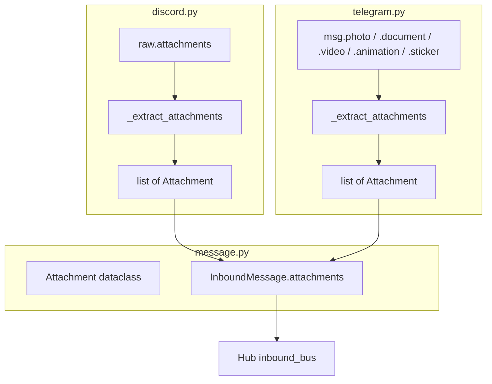
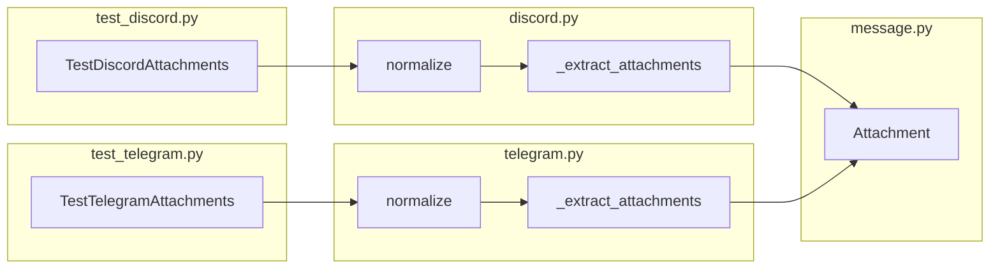

## Summary

Populate the existing `Attachment` dataclass in `InboundMessage.attachments` for non-audio attachments (images, documents, videos, files) in both Discord and Telegram adapters. Lazy approach: store URLs/file_ids, no byte downloads. Add `_extract_attachments()` helpers to each adapter and wire into `normalize()`.

## Architecture

### Data flow



### File × Function map



## Agents

| Agent | Tasks | Files |
|-------|-------|-------|
| backend-dev | 1, 2, 3, 5, 6 | `message.py`, `discord.py`, `telegram.py` |
| tester | 4, 7, 8 | `test_discord.py`, `test_telegram.py` |

## Consistency Report

17/17 success criteria covered. 0 uncovered. 0 untraced.

## Micro-Tasks

### Slice V1: Discord attachment extraction

**T1 — Update Attachment docstring** `[P]` `[backend-dev]`
- **File:** `src/lyra/core/message.py`
- **Spec trace:** SC-15
- **Description:** Update `Attachment` docstring to document `tg:file_id:` prefix contract and `url_or_bytes` semantics per platform.
- **Code snippet:**
```python
@dataclass(frozen=True)
class Attachment:
    """A file or media attachment on an InboundMessage.

    url_or_bytes stores platform-specific references:
    - Discord: direct CDN URL (str) — fetchable with HTTP GET.
    - Telegram: prefixed file_id (str, "tg:file_id:{id}") — resolve via
      Bot API getFile. Detect with url_or_bytes.startswith("tg:file_id:").
    - Raw bytes (bytes) — for pre-downloaded media (future).
    """
    type: str  # "image" | "audio" | "video" | "file"
    url_or_bytes: str | bytes
    mime_type: str
    filename: str | None = None
```
- **Verify:** `uv run ruff check src/lyra/core/message.py && uv run pyright src/lyra/core/message.py`
- **Expected:** No errors
- **Difficulty:** 1

---

**T2 — Discord `_extract_attachments()` helper** `[P]` `[backend-dev]`
- **File:** `src/lyra/adapters/discord.py`
- **Spec trace:** SC-1, SC-2, SC-3, SC-4, SC-5, SC-6
- **Description:** Add module-level `_extract_attachments(raw_attachments)` that filters out audio, maps each to `Attachment`.
- **Code snippet:**
```python
def _extract_attachments(raw_attachments: list) -> list[Attachment]:
    """Extract non-audio Attachment objects from Discord message.attachments."""
    result: list[Attachment] = []
    for a in raw_attachments:
        ct = getattr(a, "content_type", None) or ""
        if ct in _AUDIO_MIME_TYPES:
            continue
        if ct.startswith("image/"):
            att_type = "image"
        elif ct.startswith("video/"):
            att_type = "video"
        else:
            att_type = "file"
        result.append(Attachment(
            type=att_type,
            url_or_bytes=a.url,
            mime_type=ct or "application/octet-stream",
            filename=getattr(a, "filename", None),
        ))
    return result
```
- **Verify:** `uv run ruff check src/lyra/adapters/discord.py && uv run pyright src/lyra/adapters/discord.py`
- **Expected:** No errors
- **Difficulty:** 2

---

**T3 — Wire Discord `normalize()` to use `_extract_attachments()`** `[depends: T2]` `[backend-dev]`
- **File:** `src/lyra/adapters/discord.py`
- **Spec trace:** SC-1, SC-2, SC-3, SC-5, SC-6
- **Description:** In `normalize()`, call `_extract_attachments(raw.attachments or [])` and pass result as `attachments=` kwarg to `InboundMessage()`.
- **Code snippet:**
```python
# In normalize(), before return:
attachments = _extract_attachments(getattr(raw, "attachments", None) or [])

return InboundMessage(
    ...
    attachments=attachments,
    ...
)
```
- **Verify:** `uv run pytest tests/adapters/test_discord.py -x -q`
- **Expected:** All existing tests pass (attachments defaults to [] when raw has no attachments attr)
- **Difficulty:** 2

---

**T4 — Discord attachment tests** `[depends: T3]` `[tester]`
- **File:** `tests/adapters/test_discord.py`
- **Spec trace:** SC-1, SC-2, SC-3, SC-4, SC-5, SC-6
- **Description:** Add `TestDiscordAttachments` class with tests for: image, document, multiple, audio exclusion, text-only, text+image. Follow existing SimpleNamespace pattern.
- **Tests:**
  - `test_normalize_image_attachment` — image content_type → `type="image"`, CDN URL, mime_type
  - `test_normalize_document_attachment` — non-image/video/audio → `type="file"`, filename
  - `test_normalize_multiple_attachments` — 2 non-audio → 2 in list
  - `test_normalize_audio_attachment_excluded` — audio content_type → NOT in attachments
  - `test_normalize_text_only_empty_attachments` — no attachments attr → empty list
  - `test_normalize_text_and_image` — text + image → both text and attachments populated
- **Verify:** `uv run pytest tests/adapters/test_discord.py -x -q`
- **Expected:** All tests pass
- **Difficulty:** 3

---

### RED-GATE V1
After T4 passes: Discord slice complete. All SC-1 through SC-6 green.

---

### Slice V2: Telegram attachment extraction

**T5 — Telegram `_extract_attachments()` helper** `[P]` `[backend-dev]`
- **File:** `src/lyra/adapters/telegram.py`
- **Spec trace:** SC-7, SC-9, SC-10, SC-11, SC-12
- **Description:** Add `_extract_attachments(msg)` that checks `.photo`, `.document`, `.video`, `.animation`, `.sticker` and builds `Attachment` list with `tg:file_id:` prefix.
- **Code snippet:**
```python
def _extract_attachments(msg: Any) -> list[Attachment]:
    """Extract non-audio Attachment objects from a Telegram message."""
    result: list[Attachment] = []
    # photo: list of PhotoSize, take largest (last)
    if getattr(msg, "photo", None):
        largest = msg.photo[-1]
        result.append(Attachment(
            type="image",
            url_or_bytes=f"tg:file_id:{largest.file_id}",
            mime_type="image/jpeg",
        ))
    if getattr(msg, "document", None):
        doc = msg.document
        result.append(Attachment(
            type="file",
            url_or_bytes=f"tg:file_id:{doc.file_id}",
            mime_type=getattr(doc, "mime_type", None) or "application/octet-stream",
            filename=getattr(doc, "file_name", None),
        ))
    if getattr(msg, "video", None):
        vid = msg.video
        result.append(Attachment(
            type="video",
            url_or_bytes=f"tg:file_id:{vid.file_id}",
            mime_type=getattr(vid, "mime_type", None) or "video/mp4",
        ))
    if getattr(msg, "animation", None):
        anim = msg.animation
        result.append(Attachment(
            type="image",
            url_or_bytes=f"tg:file_id:{anim.file_id}",
            mime_type="image/gif",
        ))
    if getattr(msg, "sticker", None):
        sticker = msg.sticker
        # Only static WebP stickers; skip animated (.tgs) and video (.webm)
        if not getattr(sticker, "is_animated", False) and not getattr(sticker, "is_video", False):
            result.append(Attachment(
                type="image",
                url_or_bytes=f"tg:file_id:{sticker.file_id}",
                mime_type="image/webp",
            ))
    return result
```
- **Verify:** `uv run ruff check src/lyra/adapters/telegram.py && uv run pyright src/lyra/adapters/telegram.py`
- **Expected:** No errors
- **Difficulty:** 3

---

**T6 — Wire Telegram `normalize()` + caption handling** `[depends: T5]` `[backend-dev]`
- **File:** `src/lyra/adapters/telegram.py`
- **Spec trace:** SC-7, SC-8, SC-14
- **Description:** In `normalize()`: call `_extract_attachments(raw)`, pass as `attachments=`. For captions: use `raw.caption` as text when `raw.text` is None/empty (Telegram sends captions in `.caption`, not `.text`).
- **Code snippet:**
```python
# In normalize():
text = raw.text or raw.caption or ""
# ... existing logic ...
attachments = _extract_attachments(raw)

return InboundMessage(
    ...
    text=text,
    text_raw=text,
    attachments=attachments,
    ...
)
```
- **Verify:** `uv run pytest tests/adapters/test_telegram.py -x -q`
- **Expected:** All existing tests pass
- **Difficulty:** 2

---

**T7 — Telegram attachment tests** `[depends: T6]` `[tester]`
- **File:** `tests/adapters/test_telegram.py`
- **Spec trace:** SC-7, SC-8, SC-9, SC-10, SC-11, SC-12, SC-13, SC-14
- **Description:** Add `TestTelegramAttachments` class with tests for: photo, photo+caption, document, video, animated sticker skip, static sticker, text-only. Follow existing SimpleNamespace pattern.
- **Tests:**
  - `test_normalize_photo_attachment` — `.photo` list → `type="image"`, `tg:file_id:`, `image/jpeg`
  - `test_normalize_photo_with_caption` — `.photo` + `.caption` → caption in `text`, photo in `attachments`
  - `test_normalize_document_attachment` — `.document` → `type="file"`, mime_type, filename
  - `test_normalize_video_attachment` — `.video` → `type="video"`
  - `test_normalize_animated_sticker_skipped` — `.sticker` with `is_animated=True` → NOT in attachments
  - `test_normalize_static_sticker` — `.sticker` with `is_animated=False, is_video=False` → `type="image"`, `image/webp`
  - `test_normalize_text_only_empty_attachments` — no media attrs → empty list
- **Verify:** `uv run pytest tests/adapters/test_telegram.py -x -q`
- **Expected:** All tests pass
- **Difficulty:** 3

---

### RED-GATE V2
After T7 passes: Telegram slice complete. All SC-7 through SC-14 green.

---

**T8 — Full test suite** `[depends: T4, T7]` `[tester]`
- **Spec trace:** SC-16
- **Description:** Run the complete test suite to verify no regressions.
- **Verify:** `uv run pytest -x -q`
- **Expected:** All tests pass
- **Difficulty:** 1

## Reference Patterns

- **Test pattern:** `tests/adapters/test_discord.py` — `SimpleNamespace` stubs for Discord messages, `_make_discord_adapter()` helper
- **Test pattern:** `tests/adapters/test_telegram.py` — `SimpleNamespace` stubs for Telegram messages, `_make_telegram_adapter()` helper
- **Adapter pattern:** `discord.py:167-248` — `normalize()` builds `InboundMessage` from raw message
- **Adapter pattern:** `telegram.py:197-259` — `normalize()` builds `InboundMessage` from raw message
