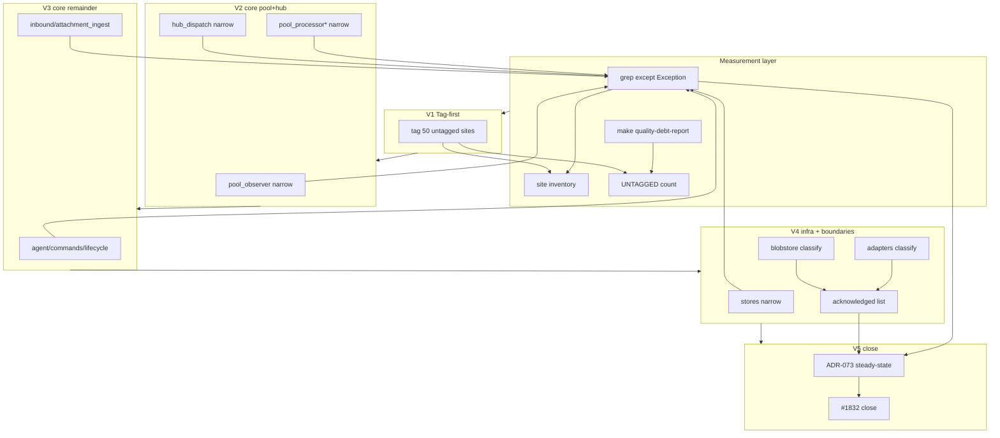
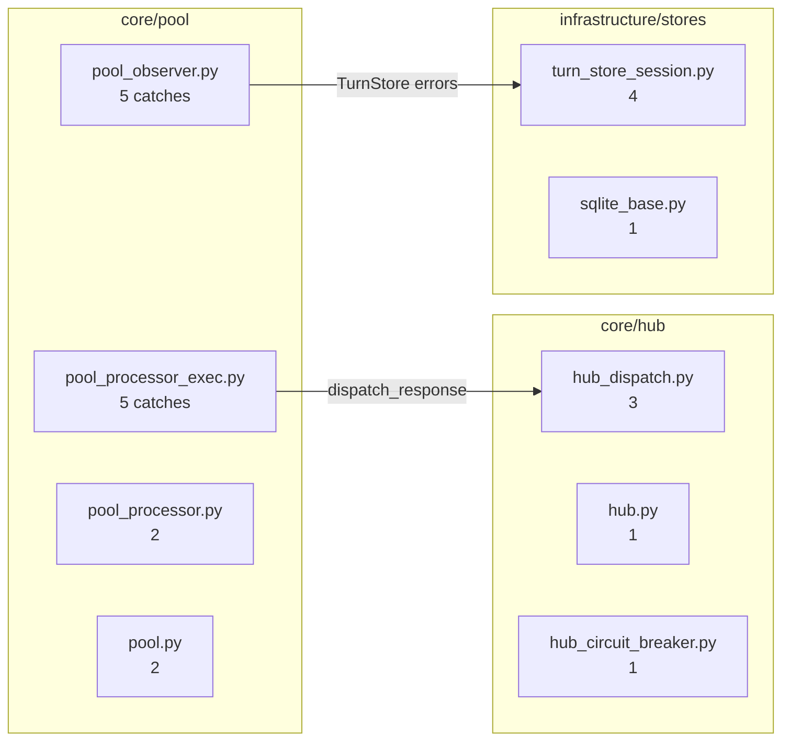

## Summary

Shape 3 hybrid burn-down in 5 PR slices under the **Implementation Mandate** (Mickael 2026-06-24):
every change must fix root axial drift — not bookkeeping. Slice 1 inventories untagged sites but
**narrows immediately** where the fix is clear (infra jobs/stores, core-adjacent); defers tag-only to
true external I/O boundaries (adapters/blobstore/transport) pending V4 classification. Slices 2–3
narrow `core/pool`, `core/hub`, remaining core/inbound. Slice 4 finishes infra + adapter/blobstore
with narrow-first, acknowledge-only survivors. Slice 5 updates ADR-073 and closes #1832.

## Implementation Mandate

**Prerogative (2026-06-24):** Tous les changements traitent le problème de fond — corriger l'axial
drift, pas masquer la dette. Architecture et qualité de code ++.

| Rule | Meaning | Forbidden |
|------|---------|-----------|
| **R1 Narrow-first** | Default action = eliminate `except Exception` via specific types, re-raise, or move catch to the correct stage boundary | Bulk `DEBT:` append without code change |
| **R2 Axial justification** | Every surviving catch needs `# boundary: <stage> — <why broad is correct here>` tied to ADR-073 layer (transport/adapters/inbound/outbound/core) | Tag-only to silence audit |
| **R3 Re-raise over swallow** | In `core/` and `infrastructure/`: if catch hides a stage violation, remove it or propagate after structured logging | log-and-continue on store/pipeline failures without typed fallback |
| **R4 No laundering** | Acknowledged I/O boundaries only at true wire edges (HTTP handler, NATS decode, adapter send/retry) | Classifying `core/pool` or `hub` catches as "boundary" |
| **R5 Quality bar** | Each PR: fewer broad catches than before, tests pass, PII gate green, per-site commit message rationale in PR description table | Mechanical 50-file tag PR with zero narrowing |
| **R6 Defer explicit** | `core/cli/` subprocess → tag + defer #1812 only; must state defer reason inline | Refactor subprocess out of scope sneak |

**Slice 1 revised:** tag-only allowed for adapter/blobstore/outbound/transport **only when** the site
is a genuine wire boundary AND narrowing needs API research; infra sites in the untagged 50
(`dlq_router`, `active_jobs_refresher`, `turn_writer/health`) are **narrowed in V1**, not tagged.

## Architecture

### Data flow — fix pipeline

### File × function map — Slice 2 hotspots

## Bootstrap Context

From `artifacts/analyses/1832-boundary-broad-catch-burn-down-analysis.mdx`:
- Baseline 2026-06-24: **168 sites / 102 files**, 50 untagged BLE001, 57 DEBT-tagged.
- Shape 3 approved; `POLICY:` dismantled (#1175) — use `# boundary: <reason>` for acknowledged I/O sites.
- `core/cli/` subprocess catches: tag + defer (#1812), do not narrow in this epic.
- Ref pattern: read existing narrowed catches in `core/agent/agent_commands.py` (ValueError then
  Exception fallback) and `adapters/shared/_shared.py` (type-sanitized retry boundary).

## Agents

| Agent instance | Slice | Tasks | Files |
|---|---|---|---|
| backend-dev-A | V1 adapters+blobstore tag | T1,T2,T3 | 17 adapter + 9 blobstore files |
| backend-dev-B | V1 outbound+transport+nats | T4,T5 | outbound/, transport/, nats/ |
| backend-dev-C | V1 infra+tools+misc tag | T6,T7 | jobs/, turn_writer/, tools/, cli/bot, agent_cmd |
| backend-dev-D | V1 RED-GATE | T8 | audit + grep verification |
| backend-dev-E | V2 pool | T9,T10,T11 | pool/*.py (5 files) |
| backend-dev-F | V2 hub | T12,T13 | hub/**/*.py |
| backend-dev-G | V3 core remainder | T14,T15 | agent/, commands/, lifecycle/, processors/, inbound/ |
| backend-dev-H | V4 infra stores | T16,T17 | stores/**/*.py, turn_writer/ |
| backend-dev-I | V4 adapters classify | T18,T19 | adapters/ selective narrow |
| doc-writer-A | V5 | T20 | adr/073 + debt registry |
| tester-A | V2–V4 | T21 | pytest subset per slice |

## Wave Structure

5 waves (one per slice PR). Slice 1 max 4 parallel agents. Elapsed ~5 PR cycles vs 1 monolithic PR.

| Wave | Trigger | Agents | Tasks |
|------|---------|--------|-------|
| 1 | start | 4 ∥ | backend-dev-A: T1→T2→T3 · backend-dev-B: T4→T5 · backend-dev-C: T6→T7 · backend-dev-D: T8 (RED-GATE) |
| 2 | Wave 1 merged | 3 ∥ | backend-dev-E: T9→T10→T11 · backend-dev-F: T12→T13 · tester-A: T21a |
| 3 | Wave 2 merged | 2 ∥ | backend-dev-G: T14→T15 · tester-A: T21b |
| 4 | Wave 3 merged | 3 ∥ | backend-dev-H: T16→T17 · backend-dev-I: T18→T19 · tester-A: T21c |
| 5 | Wave 4 merged | 1 | doc-writer-A: T20 (RED-GATE close) |

### Budget — per task

| Task | Items | Class | Est. ops | Split? |
|------|-------|-------|----------|--------|
| T1 tag adapters/discord+telegram+omp | 17 | bounded | 12 | — |
| T2 tag adapters/nats+shared | 6 | bounded | 5 | — |
| T3 tag blobstore 9 sites | 9 | trivial | 6 | — |
| T4 tag outbound+transport | 7 | bounded | 5 | — |
| T5 tag nats_channel_proxy | 1 | trivial | 2 | — |
| T6 tag infra jobs+stores+turn_writer | 7 | bounded | 5 | — |
| T7 tag tools+cli+bot+agent_cmd | 7 | bounded | 5 | — |
| T8 V1 RED-GATE audit | 1 | judgmental | 4 | — |
| T9 pool_observer narrow 5 | 5 | judgmental | 15 | — |
| T10 pool_processor* narrow 7 | 7 | judgmental | 18 | — |
| T11 pool.py narrow 2 | 2 | judgmental | 6 | — |
| T12 hub_dispatch narrow 3 | 3 | judgmental | 10 | — |
| T13 hub remainder narrow 6 | 6 | judgmental | 12 | — |
| T14 core agent/commands/lifecycle | 9 | judgmental | 15 | — |
| T15 inbound+processors remainder | 5 | judgmental | 10 | — |
| T16 infra stores narrow 12 | 12 | judgmental | 20 | — |
| T17 turn_writer+jobs narrow | 6 | judgmental | 10 | — |
| T18 adapter narrow selective | 10 | judgmental | 15 | — |
| T19 blobstore classify | 9 | judgmental | 10 | — |
| T20 ADR + debt registry + close | 1 | bounded | 6 | — |
| T21 test smoke per slice | 3 | bounded | 9 | — |

**Total estimated ops: ~180** (split across 5 PRs)

### Budget — per agent instance

| Instance | Tasks | Σ ops | Subjects | Split? |
|----------|-------|-------|----------|--------|
| backend-dev-A | T1,T2,T3 | 23 | adapters, blobstore | — |
| backend-dev-B | T4,T5 | 7 | outbound, transport | — |
| backend-dev-C | T6,T7 | 10 | infra, tools | — |
| backend-dev-D | T8 | 4 | audit | — |
| backend-dev-E | T9,T10,T11 | 39 | pool | — |
| backend-dev-F | T12,T13 | 22 | hub | — |
| backend-dev-G | T14,T15 | 25 | core, inbound | — |
| backend-dev-H | T16,T17 | 30 | stores | — |
| backend-dev-I | T18,T19 | 25 | adapters | — |
| doc-writer-A | T20 | 6 | adr | — |
| tester-A | T21 | 9 | tests | — |

## Consistency Report

Covered: 12/12 success criteria.
SC(grep≤30)→T9–T19,T20 · SC(boundary justification)→T1–T19 · SC(0 untagged)→T8 ·
SC(pool_observer)→T9 · SC(pool≤5)→T9–T11 · SC(hub≤4)→T12,T13 · SC(stores narrow)→T16 ·
SC(PII gate)→T8,T21 · SC(ADR update)→T20 · SC(closing PR measure)→T20 · SC(debt registry)→T20 ·
SC(no re-baseline)→T20.
Uncovered: none. Untraced: none.

## Micro-Tasks

### V1 — Tag-first inventory (Slice 1 PR)

**T1** [P] [adapters] Tag 17 untagged adapter sites: append `— DEBT:boundary-broad-catch` for debt
sites OR `— boundary: <reason>` for true I/O boundaries (discord_formatter, discord_outbound,
jetstream_audio_*, omp_*, telegram_*, _shared.py). One-line `# boundary:` reason required for I/O
keeps. Phase: GREEN · Verify: `grep -n 'except Exception' <file>` shows tag on each line ·
Files: list in Bootstrap untagged report · Spec: SC3, SC2.

**T2** [P] [adapters] blockedBy none — tag 6 nats/shared remaining untagged in adapters/nats/ +
adapters/shared/_shared.py. Phase: GREEN · Spec: SC3.

**T3** [P] [blobstore] Tag all 9 blobstore untagged sites with `— boundary: HTTP/NATS handler maps
failure to status code` (ADR-082). Phase: GREEN · Spec: SC2, SC3.

**T4** [P] [outbound] Tag 7 outbound+transport sites (4 outbound, 3 transport). Phase: GREEN ·
Spec: SC3.

**T5** [P] [nats] Tag `nats_channel_proxy.py:195`. Phase: GREEN · Spec: SC3.

**T6** [P] [infra] **Narrow-first (R1,R3):** `dlq_router` (4), `active_jobs_refresher` (2),
`turn_writer/health` (1) — replace `Exception` with typed errors (`nats.errors`, `sqlite3.Error`,
`ConnectionError`, etc.) or re-raise after log. Tag only if a catch survives narrowing. Phase: GREEN ·
Spec: SC3, SC7, Mandate R1.

**T7** [P] [misc] Narrow where obvious; `bot_display_name` → `sqlite3.Error`/store errors.
`tools/gh_token` + `cli/bot` + `agent_cmd`: narrow or `# boundary:` with axial reason. Phase: GREEN ·
Spec: SC3, Mandate R1.

**T8** [audit] RED-GATE — blockedBy T1–T7: run `make quality-debt-report`; assert 0 UNTAGGED BLE001
under `src/factory/`; record grep baseline in PR body; run `bash tools/check_str_exc_bus_bound.sh`.
Phase: RED-GATE · Verify: `python3 -c "import json; r=json.load(open('artifacts/quality-debt-report.json'))['rows']; print(sum(1 for x in r if x.get('rule')=='BLE001' and x.get('bucket')=='UNTAGGED' and x['path'].startswith('src/factory/')))"` → 0 · Spec: SC3, SC8.

### V2 — core/pool + core/hub (Slice 2 PR)

**T9** [pool] Narrow `pool_observer.py` 5 catches: replace `Exception` with store/publisher-specific
errors (`sqlite3.Error`, custom store errors) where possible; retain max 1 resilient catch with
`# boundary: turn persistence non-fatal`. Phase: GREEN · Verify: `grep -c 'except Exception' src/factory/core/pool/pool_observer.py` ≤ 1 · Spec: SC4, SC5.

**T10** [pool] blockedBy T9 — narrow `pool_processor_exec.py` (5), `pool_processor.py` (2),
`pool_processor_streaming.py` (1): re-raise where circuit breaker needs raw exc; narrow pre/post
hooks. Phase: GREEN · Spec: SC5.

**T11** [pool] blockedBy T10 — narrow `pool.py` 2 catches (resume/publish_start_session). Phase: GREEN ·
Verify: `grep -c 'except Exception' src/factory/core/pool/` ≤ 5 · Spec: SC5.

**T12** [hub] [P] Narrow `hub_dispatch.py` 3 catches (dispatch_audio, dispatch paths). Phase: GREEN ·
Spec: SC6.

**T13** [hub] blockedBy T12 — narrow hub.py, hub_circuit_breaker, middleware, outbound_errors (6 sites).
Verify: `grep -c 'except Exception' src/factory/core/hub/` ≤ 4 · Spec: SC6.

**T21a** [tests] blockedBy T11,T13 — `uv run pytest tests/ -k "pool or hub" -q --tb=no` + PII gate.
Spec: SC8.

### V3 — core remainder + inbound (Slice 3 PR)

**T14** [core] Narrow agent/, commands/, lifecycle/, memory/, trace/, tts_dispatch (exclude cli/).
Defer `core/cli/` subprocess per X1. Phase: GREEN · Spec: SC1 trajectory.

**T15** [inbound] Narrow `inbound/attachment_ingest.py` (3) + `processors/` residual. Phase: GREEN ·
Spec: SC1.

**T21b** [tests] blockedBy T14,T15 — targeted pytest + PII gate. Spec: SC8.

### V4 — infrastructure + adapter classify (Slice 4 PR)

**T16** [stores] Narrow `infrastructure/stores/**` — sqlite3.Error, aiosqlite errors, connection errors.
Phase: GREEN · Spec: SC7.

**T17** [infra] Narrow turn_writer/, jobs/dlq_router remaining. Phase: GREEN · Spec: SC7.

**T18** [adapters] Selective narrow ~10 adapter sites where exception type is known; remainder →
`# boundary: adapter I/O — type varies` acknowledged. Phase: GREEN · Spec: SC1, SC2.

**T19** [blobstore] Classify 9 blobstore sites: keep ≤6 acknowledged HTTP boundaries; narrow disk/NATS
connect where typed. Phase: GREEN · Verify: total grep ≤ 30 · Spec: SC1.

**T21c** [tests] blockedBy T16–T19 — full pytest smoke + PII gate. Spec: SC8.

### V5 — ADR steady-state + close (Slice 5 PR)

**T20** [docs] RED-GATE — Update `docs/architecture/adr/073-axial-stage-of-pipeline-decomposition.mdx`
revisit-trigger with steady-state count + acknowledged site appendix; update
`artifacts/debt/boundary-broad-catch.md`; PR body with measurement commands; close #1832.
Phase: RED-GATE · Verify: grep ≤ 30 · Spec: SC1, SC9, SC10, SC11, SC12.

## Task Seeding Blueprint

### Wave 1 — Slice 1 PR (start now)

| Task | Agent instance | blockedBy | Subject |
|------|---------------|-----------|---------|
| T1 | backend-dev-A | — | adapters |
| T2 | backend-dev-A | — | adapters |
| T3 | backend-dev-A | — | blobstore |
| T4 | backend-dev-B | — | outbound |
| T5 | backend-dev-B | — | nats |
| T6 | backend-dev-C | — | infra |
| T7 | backend-dev-C | — | tools |
| T8 | backend-dev-D | T1,T2,T3,T4,T5,T6,T7 | audit |

### Wave 2 — after Slice 1 merge

| Task | Agent instance | blockedBy | Subject |
|------|---------------|-----------|---------|
| T9 | backend-dev-E | T8 | pool |
| T10 | backend-dev-E | T9 | pool |
| T11 | backend-dev-E | T10 | pool |
| T12 | backend-dev-F | T8 | hub |
| T13 | backend-dev-F | T12 | hub |
| T21a | tester-A | T11,T13 | tests |

### Waves 3–5

See Wave Structure table — T14/T15 (V3), T16–T19 (V4), T20 (V5 close).

## Task IDs

<!-- Generated by /plan. Populated by /implement on seed. -->
- T1: pending — adapters tag (backend-dev-A)
- T2: pending — nats/shared tag (backend-dev-A)
- T3: pending — blobstore tag (backend-dev-A)
- T4: pending — outbound/transport tag (backend-dev-B)
- T5: pending — nats proxy tag (backend-dev-B)
- T6: pending — infra tag (backend-dev-C)
- T7: pending — misc tag (backend-dev-C)
- T8: pending — V1 RED-GATE (backend-dev-D)
- T9: pending — pool_observer (backend-dev-E)
- T10: pending — pool_processor* (backend-dev-E)
- T11: pending — pool.py (backend-dev-E)
- T12: pending — hub_dispatch (backend-dev-F)
- T13: pending — hub remainder (backend-dev-F)
- T14: pending — core remainder (backend-dev-G)
- T15: pending — inbound (backend-dev-G)
- T16: pending — stores (backend-dev-H)
- T17: pending — infra remainder (backend-dev-H)
- T18: pending — adapters classify (backend-dev-I)
- T19: pending — blobstore classify (backend-dev-I)
- T20: pending — ADR close (doc-writer-A)
- T21: pending — tests (tester-A)