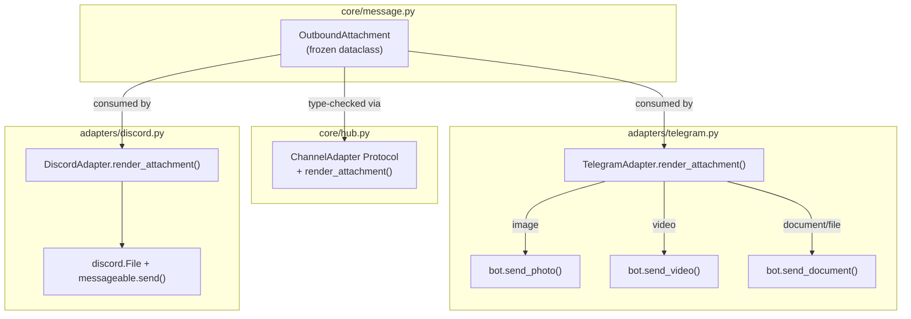
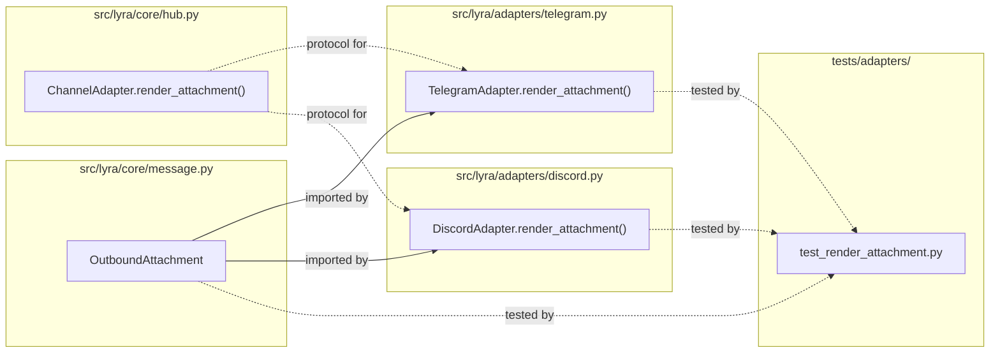

## Summary

Add a frozen `OutboundAttachment` dataclass to `core/message.py` and implement `render_attachment()` on both Telegram and Discord adapters, mirroring the existing `render_audio()` pattern. Update the `ChannelAdapter` Protocol to include the new method.

## Architecture

### Data Flow

### File x Function Map

## Agents

| Agent | Task count | Files |
|-------|-----------|-------|
| backend-dev | 4 | `core/message.py`, `core/hub.py`, `adapters/telegram.py`, `adapters/discord.py` |
| tester | 5 | `tests/adapters/test_render_attachment.py` |

## Consistency Report

- Criteria covered: 8/8
- Uncovered criteria: none
- Tasks without spec backing: none
- Gold plating exemptions applied: 0

## Micro-Tasks

### Slice V1: OutboundAttachment dataclass

#### Task 1: Add OutboundAttachment frozen dataclass [P] → backend-dev
- **File:** `src/lyra/core/message.py`
- **Snippet:** `@dataclass(frozen=True) class OutboundAttachment: data: bytes; type: Literal["image","video","document","file"]; mime_type: str; filename: str | None = None; caption: str | None = None; reply_to_id: str | None = None`
- **Verify:** `uv run python -c "from lyra.core.message import OutboundAttachment; a = OutboundAttachment(data=b'x', type='image', mime_type='image/png'); print(a.type)"` (ready)
- **Expected:** `image`
- **Time:** 3 min | **Difficulty:** 1
- **Traces:** SC-1, SC-7, N1→V1 | **Phase:** GREEN

#### Task 2: Write tests for OutboundAttachment construction and frozen enforcement → tester
- **File:** `tests/adapters/test_render_attachment.py`
- **Snippet:** `def test_outbound_attachment_fields(): ...; def test_outbound_attachment_frozen(): ...`
- **Verify:** `uv run pytest tests/adapters/test_render_attachment.py -k "test_outbound_attachment" -v` (ready)
- **Expected:** 2 passed
- **Time:** 3 min | **Difficulty:** 1
- **Traces:** SC-1, N1→V1 | **Phase:** RED

#### RED-GATE: RED complete V1 → tester
- **Verify:** All test tasks for V1 marked complete
- **Phase:** RED-GATE

### Slice V2: Telegram render_attachment

#### Task 3: Implement TelegramAdapter.render_attachment() → backend-dev
- **File:** `src/lyra/adapters/telegram.py`
- **Snippet:** `async def render_attachment(self, msg: OutboundAttachment, inbound: InboundMessage) -> None: # platform guard, routing key guard, type dispatch to send_photo/send_video/send_document`
- **Verify:** `uv run pyright src/lyra/adapters/telegram.py` (ready)
- **Expected:** 0 errors
- **Time:** 5 min | **Difficulty:** 2
- **Traces:** SC-2, SC-4, SC-5, N2→V2 | **Phase:** GREEN

#### Task 4: Write tests for Telegram render_attachment (photo, video, document, guards, caption, reply_to, topic) → tester
- **File:** `tests/adapters/test_render_attachment.py`
- **Snippet:** `class TestTelegramRenderAttachment: test_send_photo, test_send_video, test_send_document, test_platform_guard, test_missing_chat_id, test_caption, test_reply_to_override, test_topic_threading`
- **Verify:** `uv run pytest tests/adapters/test_render_attachment.py -k "Telegram" -v` (ready)
- **Expected:** 8 passed
- **Time:** 8 min | **Difficulty:** 2
- **Traces:** SC-2, SC-4, SC-5, SC-8, N2→V2 | **Phase:** RED

#### RED-GATE: RED complete V2 → tester
- **Verify:** All test tasks for V2 marked complete
- **Phase:** RED-GATE

### Slice V3: Discord render_attachment

#### Task 5: Implement DiscordAdapter.render_attachment() → backend-dev
- **File:** `src/lyra/adapters/discord.py`
- **Snippet:** `async def render_attachment(self, msg: OutboundAttachment, inbound: InboundMessage) -> None: # platform guard, routing key guard, discord.File + send/reply`
- **Verify:** `uv run pyright src/lyra/adapters/discord.py` (ready)
- **Expected:** 0 errors
- **Time:** 5 min | **Difficulty:** 2
- **Traces:** SC-3, SC-4, SC-5, N3→V3 | **Phase:** GREEN

#### Task 6: Write tests for Discord render_attachment (send, guards, caption, reply, thread, fallback) → tester
- **File:** `tests/adapters/test_render_attachment.py`
- **Snippet:** `class TestDiscordRenderAttachment: test_send_file, test_platform_guard, test_missing_channel_id, test_caption, test_reply_to, test_thread, test_reply_fallback`
- **Verify:** `uv run pytest tests/adapters/test_render_attachment.py -k "Discord" -v` (ready)
- **Expected:** 7 passed
- **Time:** 8 min | **Difficulty:** 2
- **Traces:** SC-3, SC-4, SC-5, SC-8, N3→V3 | **Phase:** RED

#### RED-GATE: RED complete V3 → tester
- **Verify:** All test tasks for V3 marked complete
- **Phase:** RED-GATE

### Slice V4: ChannelAdapter protocol update

#### Task 7: Add render_attachment to ChannelAdapter Protocol [P] → backend-dev
- **File:** `src/lyra/core/hub.py`
- **Snippet:** `async def render_attachment(self, msg: OutboundAttachment, inbound: InboundMessage) -> None: ...`
- **Verify:** `uv run pyright src/lyra/core/hub.py` (ready)
- **Expected:** 0 errors
- **Time:** 2 min | **Difficulty:** 1
- **Traces:** SC-6, N4→V4 | **Phase:** GREEN

#### Task 8: Add OutboundAttachment to hub.py imports → backend-dev
- **File:** `src/lyra/core/hub.py`
- **Snippet:** `from .message import (..., OutboundAttachment)`
- **Verify:** `uv run pyright src/lyra/core/hub.py` (ready)
- **Expected:** 0 errors
- **Time:** 2 min | **Difficulty:** 1
- **Traces:** SC-6, SC-7, N4→V4 | **Phase:** GREEN

#### Task 9: Run full typecheck and test suite → tester
- **File:** (all)
- **Snippet:** —
- **Verify:** `uv run pyright && uv run pytest tests/adapters/test_render_attachment.py -v` (ready)
- **Expected:** 0 pyright errors, all tests passed
- **Time:** 3 min | **Difficulty:** 1
- **Traces:** SC-1–SC-8 | **Phase:** GREEN

## Reference Patterns

- `OutboundAudio` dataclass: `src/lyra/core/message.py:89-101`
- `TelegramAdapter.render_audio()`: `src/lyra/adapters/telegram.py:596-645`
- `DiscordAdapter.render_audio()`: `src/lyra/adapters/discord.py:533-590`
- `test_render_audio.py`: `tests/adapters/test_render_audio.py`
