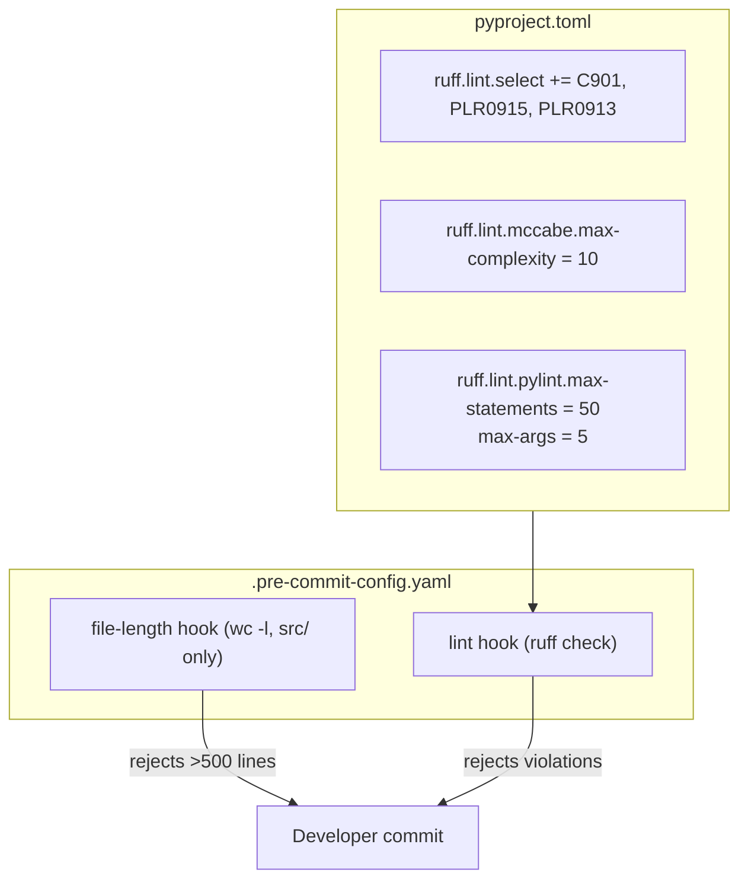

## Summary

Enable ruff complexity/size rules (C901, PLR0915, PLR0913) with standard Pylint/McCabe thresholds, fix or justify all 31 existing violations, and add a pre-commit hook for file length enforcement (>500 lines, excluding tests).

## Architecture

## Agents

| Agent | Tasks | Files |
|-------|-------|-------|
| devops | Config + file length hook + verification | `pyproject.toml`, `.pre-commit-config.yaml` |
| backend-dev | Fix/justify src violations (C901, PLR0915, PLR0913) | 11 src files |
| tester | Fix/justify test violations (PLR0913) | 3 test files |

## Violation Inventory (post-rebase)

| Rule | Src | Tests | Total |
|------|-----|-------|-------|
| C901 (complexity ≤10) | 14 | 0 | 15 (incl. tools/) |
| PLR0915 (statements ≤50) | 4 | 0 | 4 |
| PLR0913 (args ≤5) | 8 | 4 | 12 |
| **Total** | **26** | **4** | **31** (incl. tools/license_check.py) |

## Files >500 lines (src only, tests excluded)

| File | Lines |
|------|-------|
| `src/lyra/adapters/telegram.py` | 782 |
| `src/lyra/adapters/discord.py` | 690 |
| `src/lyra/core/hub.py` | 648 |
| `src/lyra/core/agent.py` | 576 |
| `src/lyra/__main__.py` | 527 |

## Micro-Tasks

### Slice 1 — Ruff rule config

**T1.1** Add rules to pyproject.toml
- File: `pyproject.toml`
- Edit `[tool.ruff.lint]` select to include `"C901"`, `"PLR0915"`, `"PLR0913"`
- Add `[tool.ruff.lint.mccabe]` with `max-complexity = 10`
- Add `[tool.ruff.lint.pylint]` with `max-statements = 50`, `max-args = 5`
- Verify: `uv run ruff check --select C901,PLR0915,PLR0913 . 2>&1 | head -5` shows violations detected
- Spec trace: SC-1, SC-2, SC-3

### Slice 2 — Fix existing violations

**T2.1** Fix/justify C901 violations (15 functions)
- Files: `__main__.py`, `discord.py`, `telegram.py`, `agent.py`, `cli_pool.py`, `command_router.py`, `hub.py`, `outbound_dispatcher.py`, `runtime_config.py`, `llm/drivers/sdk.py`, `tools/license_check.py`
- Strategy: refactor where feasible (extract helpers), `noqa` only for inherent complexity
- Verify: `uv run ruff check --select C901 . 2>&1 | grep -c C901` → 0
- Spec trace: SC-4, SC-6

**T2.2** Fix/justify PLR0915 violations (4 functions)
- Files: `__main__.py:_main`, `agent.py:load_agent_config`, `hub.py:_audio_loop`, `hub.py:run`
- Strategy: extract logical sections into helper functions
- Verify: `uv run ruff check --select PLR0915 . 2>&1 | grep -c PLR0915` → 0
- Spec trace: SC-4, SC-6

**T2.3** Fix/justify PLR0913 violations in src (8 functions)
- Files: `__main__.py`, `_shared.py`, `discord.py`, `telegram.py`, `anthropic_agent.py`, `simple_agent.py`, `agent.py`, `command_router.py`, `hub.py`
- Strategy: group related args into dataclass/config objects, or `noqa` for `__init__` methods where args map 1:1 to deps
- Verify: `uv run ruff check --select PLR0913 src/ . 2>&1 | grep -c PLR0913` → 0
- Spec trace: SC-4, SC-6

**T2.4** Fix/justify PLR0913 violations in tests (4 functions)
- Files: `test_telegram.py`, `test_telegram_voice.py`, `test_pairing.py`
- Strategy: `noqa` acceptable for test factory helpers
- Verify: `uv run ruff check --select PLR0913 tests/ 2>&1 | grep -c PLR0913` → 0
- Spec trace: SC-4, SC-6

### Slice 3 — File length enforcement

**T3.1** Add pre-commit hook for file length
- File: `.pre-commit-config.yaml`
- Add local hook: `check-file-length` that runs `find src/ -name '*.py' -exec awk 'END{if(NR>500){print FILENAME": "NR" lines (max 500)"; err=1}} END{exit err}' {} +`
- Exclude `tests/` (test files are naturally longer)
- Verify: `pre-commit run check-file-length --all-files` flags the 5 oversized files
- Spec trace: SC-5

### Verification

**T4.1** Full verification
- `uv run ruff check .` → 0 violations
- `pre-commit run --all-files` → all hooks pass (after file length violations are addressed)
- Every `noqa` has format `# noqa: RULE — reason`
- Spec trace: SC-4, SC-5, SC-6

## Consistency Report

| Criterion | Covered by |
|-----------|-----------|
| SC-1: select includes rules | T1.1 |
| SC-2: mccabe threshold | T1.1 |
| SC-3: pylint thresholds | T1.1 |
| SC-4: ruff check passes | T2.1–T2.4, T4.1 |
| SC-5: pre-commit file length | T3.1, T4.1 |
| SC-6: noqa justification | T2.1–T2.4, T4.1 |

**Coverage: 6/6 (100%)**
