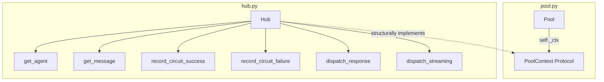
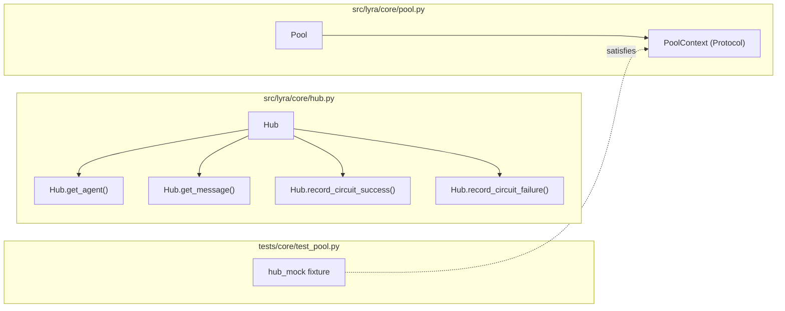

## Summary

Extract a `PoolContext` Protocol in `pool.py` that encapsulates the 6 Hub surface points Pool uses. Update Pool to depend on the protocol, add thin wrapper methods to Hub, and update all test fixtures to use the new constructor signature.

## Architecture





## Agents

| Agent | Tasks | Files |
|-------|-------|-------|
| backend-dev | T1–T5 | pool.py, hub.py, test_pool.py |

## Consistency Report

| SC | Task | Status |
|----|------|--------|
| SC-1: PoolContext exists with 6 methods | T1 | covered |
| SC-2: Pool accepts PoolContext | T2 | covered |
| SC-3: Pool zero runtime hub imports | T2 | covered |
| SC-4: Hub satisfies PoolContext (pyright) | T3 | covered |
| SC-5: All tests pass | T4, T5 | covered |
| SC-6: No behavioral changes | T1–T5 | covered |

Coverage: 6/6 (100%)

## Micro-Tasks

### Slice 1 — Define PoolContext + update Pool

**T1: Define PoolContext Protocol in pool.py** `[P]`
- **File:** `src/lyra/core/pool.py`
- **Description:** Add `PoolContext(Protocol)` class with 6 methods: `get_agent(name) → AgentBase | None`, `get_message(key) → str | None`, `dispatch_response(msg, response) → awaitable`, `dispatch_streaming(msg, chunks) → awaitable`, `record_circuit_success() → None`, `record_circuit_failure(exc) → None`
- **Code snippet:**
  ```python
  class PoolContext(Protocol):
      def get_agent(self, name: str) -> AgentBase | None: ...
      def get_message(self, key: str) -> str | None: ...
      async def dispatch_response(self, msg: InboundMessage, response: Response | OutboundMessage) -> None: ...
      async def dispatch_streaming(self, msg: InboundMessage, chunks: AsyncIterator[str], outbound: OutboundMessage | None = None) -> None: ...
      def record_circuit_success(self) -> None: ...
      def record_circuit_failure(self, exc: BaseException) -> None: ...
  ```
- **Verify:** `uv run pyright src/lyra/core/pool.py`
- **Spec trace:** SC-1
- **Phase:** RED
- **Difficulty:** 1

**T2: Update Pool to use PoolContext instead of Hub** `[P]`
- **File:** `src/lyra/core/pool.py`
- **Description:** Change `__init__` param from `hub: Hub` to `ctx: PoolContext`. Replace all `self._hub.*` with `self._ctx.*` calls. Remove `_msg`, `_record_cb_success`, `_record_cb_failure` methods — delegate to protocol methods. Remove TYPE_CHECKING import of Hub.
- **Depends on:** T1
- **Verify:** `uv run pyright src/lyra/core/pool.py`
- **Spec trace:** SC-2, SC-3
- **Phase:** GREEN
- **Difficulty:** 2

### RED-GATE: `uv run pytest tests/core/test_pool.py` (expect failures — Hub mock shape mismatch)

### Slice 2 — Hub implements PoolContext + wire up

**T3: Add PoolContext wrapper methods to Hub**
- **File:** `src/lyra/core/hub.py`
- **Description:** Add `get_agent(name) → AgentBase | None` (wraps `agent_registry.get`), `get_message(key) → str | None` (wraps `_msg_manager.get` if set), `record_circuit_success()`, `record_circuit_failure(exc)`. Update `Pool(hub=self)` call to `Pool(ctx=self)`.
- **Depends on:** T2
- **Verify:** `uv run pyright src/lyra/core/hub.py`
- **Spec trace:** SC-4
- **Phase:** GREEN
- **Difficulty:** 2

**T4: Update test_pool.py fixtures to match PoolContext**
- **File:** `tests/core/test_pool.py`
- **Description:** Replace `hub_mock` fixture attributes (`agent_registry`, `_msg_manager`, `circuit_registry`, `dispatch_response`, `dispatch_streaming`) with PoolContext method mocks (`get_agent`, `get_message`, `dispatch_response`, `dispatch_streaming`, `record_circuit_success`, `record_circuit_failure`). Update Pool() calls from `hub=` to `ctx=`.
- **Depends on:** T2
- **Verify:** `uv run pytest tests/core/test_pool.py -x`
- **Spec trace:** SC-5
- **Phase:** GREEN
- **Difficulty:** 2

**T5: Run full test suite and pyright**
- **File:** all
- **Description:** Ensure no regressions across the entire codebase.
- **Depends on:** T3, T4
- **Verify:** `uv run pytest && uv run pyright`
- **Spec trace:** SC-5, SC-6
- **Phase:** REFACTOR
- **Difficulty:** 1
