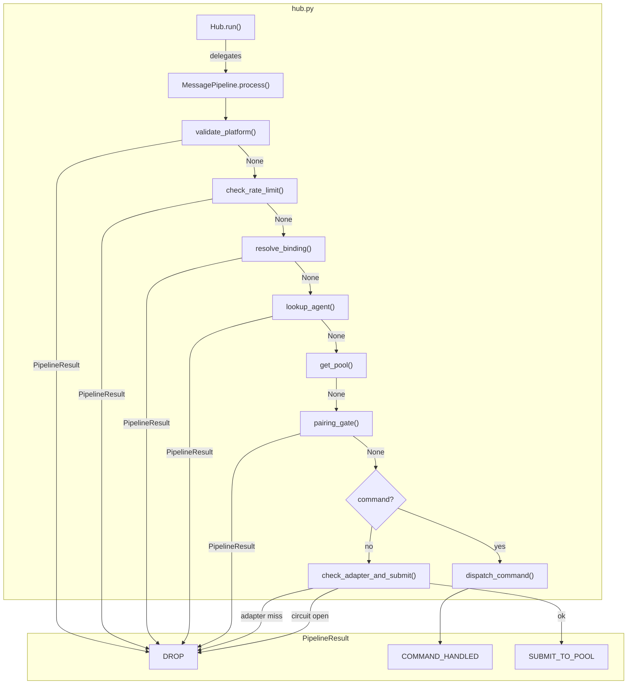
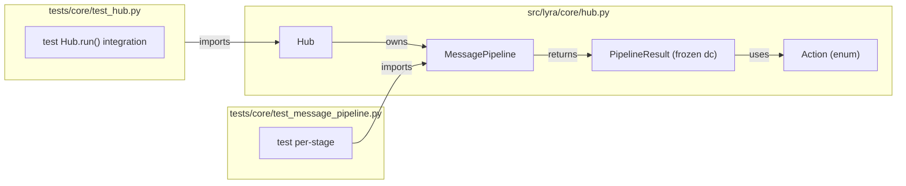

## Summary

Extract a `MessagePipeline` class from the monolithic `Hub.run()` loop (cyclomatic complexity ~15) into a fail-fast stage chain, fix the silent `except Exception: pass` in `_pairing_gate_drop`, and remove the `# noqa: C901` suppression. Pure refactor — no behavioral changes.

## Architecture





## Agents

| Agent | Tasks | Files |
|-------|-------|-------|
| backend-dev | 6 | `src/lyra/core/hub.py` |
| tester | 3 | `tests/core/test_message_pipeline.py`, `tests/core/test_hub.py` |

## Consistency Report

| Spec criteria | Covered | Task |
|--------------|---------|------|
| SC-1: _pairing_gate_drop logs exceptions | ✓ | T1 |
| SC-2: Hub.run() delegates to MessagePipeline | ✓ | T3–T5 |
| SC-3: Complexity ≤ 5, no noqa | ✓ | T6 |
| SC-4: Existing tests pass | ✓ | T9 |
| SC-5: New unit tests per stage | ✓ | T7, T8 |
| SC-6: No behavior change | ✓ | T9 |

6/6 covered, 0 uncovered, 0 untraced.

## Micro-Tasks

### Slice 1 — Fix silent except

**T1 — Fix silent except in _pairing_gate_drop** `[backend-dev]` `[SC-1]` `[V1]` `[GREEN]` `[D:1]`
- **File:** `src/lyra/core/hub.py:648-649`
- **Description:** Replace `except Exception: pass` with `except Exception: log.exception("dispatch_response failed for pairing rejection")` matching `_circuit_breaker_drop` pattern (line 670).
- **Code snippet:**
  ```python
  except Exception:
      log.exception("dispatch_response failed for pairing rejection")
  ```
- **Verify:** `uv run pytest tests/core/test_hub.py -x -q`
- **Expected:** All tests pass.
- **Time:** 2 min

**T2 — Test: _pairing_gate_drop logs on dispatch failure** `[tester]` `[SC-1]` `[V1]` `[GREEN]` `[D:1]`
- **File:** `tests/core/test_hub.py`
- **Description:** Add test that triggers `_pairing_gate_drop` with a failing `dispatch_response` and asserts `log.exception` is called (not silently swallowed).
- **Verify:** `uv run pytest tests/core/test_hub.py -k "pairing_gate_log" -x -q`
- **Expected:** 1 passed.
- **Time:** 5 min

---
**RED-GATE V1** — `uv run pytest tests/core/test_hub.py -x -q` — all pass, new test covers logged exception.

---

### Slice 2 — Extract MessagePipeline

**T3 — Add Action enum and PipelineResult dataclass** `[P]` `[backend-dev]` `[SC-2]` `[V2]` `[RED]` `[D:1]`
- **File:** `src/lyra/core/hub.py` (above `Hub` class)
- **Description:** Add `Action` enum (DROP, COMMAND_HANDLED, SUBMIT_TO_POOL) and frozen `PipelineResult` dataclass with fields `action`, `response` (optional), `pool` (optional).
- **Code snippet:**
  ```python
  import enum

  class Action(enum.Enum):
      DROP = "drop"
      COMMAND_HANDLED = "command_handled"
      SUBMIT_TO_POOL = "submit_to_pool"

  @dataclass(frozen=True)
  class PipelineResult:
      action: Action
      response: Response | None = None
      pool: Pool | None = None
  ```
- **Verify:** `uv run pyright src/lyra/core/hub.py`
- **Expected:** 0 errors.
- **Time:** 3 min

**T4 — Extract MessagePipeline class** `[backend-dev]` `[SC-2]` `[V2]` `[GREEN]` `[D:2]` `[depends: T3]`
- **File:** `src/lyra/core/hub.py`
- **Description:** Create `MessagePipeline` class that receives the Hub's registries/managers as constructor args. Implement `async def process(self, msg: InboundMessage) -> PipelineResult` with the fail-fast stage chain extracted from `Hub.run()` lines 678–736. Each guard (platform validation, rate limit, binding, agent, pairing gate) becomes a private method returning `PipelineResult | None`. Terminal branches (command dispatch, adapter+circuit+pool) return `PipelineResult` directly.
- **Verify:** `uv run pyright src/lyra/core/hub.py`
- **Expected:** 0 errors.
- **Time:** 10 min

**T5 — Rewire Hub.run() to use MessagePipeline** `[backend-dev]` `[SC-2]` `[V2]` `[GREEN]` `[D:2]` `[depends: T4]`
- **File:** `src/lyra/core/hub.py`
- **Description:** Replace the body of `Hub.run()` with: instantiate/store `MessagePipeline` (lazily or in constructor), call `pipeline.process(msg)`, act on `PipelineResult.action` (dispatch_response for COMMAND_HANDLED, pool.submit for SUBMIT_TO_POOL, noop for DROP). Keep `task_done()` in the existing `finally` block. Remove `# noqa: C901`.
- **Code snippet:**
  ```python
  async def run(self) -> None:
      while True:
          msg = await self.inbound_bus.get()
          try:
              result = await self._pipeline.process(msg)
              if result.action == Action.COMMAND_HANDLED and result.response and result.response.content:
                  try:
                      await self.dispatch_response(msg, result.response)
                  except Exception as exc:
                      log.exception("dispatch_response() failed: %s", exc)
              elif result.action == Action.SUBMIT_TO_POOL and result.pool:
                  result.pool.submit(msg)
          finally:
              self.inbound_bus.task_done()
  ```
- **Verify:** `uv run pytest tests/core/test_hub.py -x -q`
- **Expected:** All existing tests pass.
- **Time:** 8 min

**T7 — Test: MessagePipeline stage isolation** `[tester]` `[SC-5]` `[V2]` `[GREEN]` `[D:2]` `[depends: T5]`
- **File:** `tests/core/test_message_pipeline.py` (new)
- **Description:** Create dedicated test file for `MessagePipeline`. Test each guard stage independently: unknown platform → DROP, rate limited → DROP, no binding → DROP, no agent → DROP, pairing gate → DROP. Test terminal: command dispatch → COMMAND_HANDLED with response, pool submit → SUBMIT_TO_POOL with pool ref. Use minimal Hub setup from conftest fixtures.
- **Verify:** `uv run pytest tests/core/test_message_pipeline.py -x -q`
- **Expected:** All new tests pass.
- **Time:** 10 min

**T8 — Test: MessagePipeline happy path end-to-end** `[tester]` `[SC-5,SC-6]` `[V2]` `[GREEN]` `[D:2]` `[depends: T7]`
- **File:** `tests/core/test_message_pipeline.py`
- **Description:** Add integration test: valid message flows through all stages → SUBMIT_TO_POOL. Valid command message → COMMAND_HANDLED. Verify behavior matches pre-refactor Hub.run().
- **Verify:** `uv run pytest tests/core/test_message_pipeline.py -x -q`
- **Expected:** All pass.
- **Time:** 5 min

---
**RED-GATE V2** — `uv run pytest tests/ -x -q` — full suite green.

---

### Slice 3 — Verify complexity

**T6 — Remove noqa and verify complexity** `[backend-dev]` `[SC-3]` `[V3]` `[REFACTOR]` `[D:1]` `[depends: T5]`
- **File:** `src/lyra/core/hub.py`
- **Description:** Confirm `# noqa: C901` is already removed (T5). Run `ruff check` to verify no C901 violation. If complexity still > 5, further decompose.
- **Verify:** `uv run ruff check src/lyra/core/hub.py --select C901`
- **Expected:** No violations.
- **Time:** 2 min

**T9 — Full regression** `[tester]` `[SC-4,SC-6]` `[V3]` `[GREEN]` `[D:1]` `[depends: T6]`
- **File:** all tests
- **Description:** Run full test suite to confirm no regressions.
- **Verify:** `uv run pytest -x -q`
- **Expected:** All tests pass, no failures.
- **Time:** 3 min

---
**RED-GATE V3** — `uv run pytest -x -q && uv run ruff check src/lyra/core/hub.py --select C901` — all green, complexity ≤ 5.
