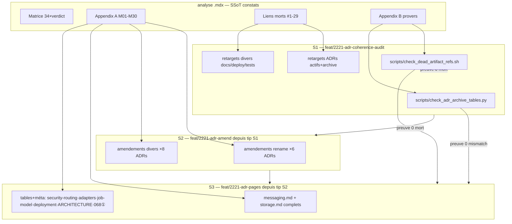
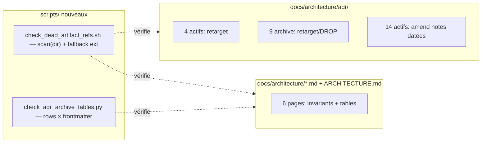

## Summary

Exécuter les 3 slices du spec (S1 liens+provers → S2 amend 14 ADRs → S3 pages+tables) en 3 branches stacked depuis ce worktree, 10 micro-tasks, 6 instances doc-writer/devops parallélisées par slice. SSoT des constats : l'analyse (`artifacts/analyses/2221-adr-coherence-audit-analysis.mdx`) — matrice, Appendix A (M01-M30), table Liens morts (#1-29), Appendix B (provers canoniques).

## Architecture

## Bootstrap Context

- Constats : analyse § Matrice + Appendix A (M01-M30, chaque M porte fix_type + PR cible) + § Liens morts (#1-29 avec retarget par row) + § Sweeps (rows tables) + § Page findings.
- Règle N1 : re-résoudre CHAQUE site par grep du contenu — lignes as-of `59d62150b`, HEAD a avancé (cas avéré : plan 1331 = adr/075:136, la :135 est déjà la spec vivante → DROP la ligne).
- Vérifier `git show <ref>` résout AVANT d'écrire toute ref tombstone.
- Échelle : code > page > ADR-pourquoi ; append-only, jamais de rewrite Context/Decision.

## Ref Patterns

| Pattern | Fichier de référence |
|---|---|
| Étiquette inline datée | `docs/architecture/adr/046-*.mdx:87` — `*(2026-07-01: the successor is … — see Amendment.)*` |
| Note frontmatter-adjacente + section | `046-*.mdx:18-22` (« Amended 2026-07-01 … ») + `### Amendment (2026-07-01)` |
| Section `## Amendment: <titre> (#issue)` | `001-*.mdx:127` |
| Table « ADR archive » normalisée | `docs/architecture/messaging.md:292-305` (« Superseded by ADR-N — archived (…) ») |
| Banner + row cohérents | `messaging.md` row 001 (« Accepted — amended by #125 ») |

## Agents

| Instance | Tâches | Fichiers |
|---|---|---|
| devops-A | T1 | scripts/check_dead_artifact_refs.sh, scripts/check_adr_archive_tables.py |
| doc-writer-A | T2 | adr/{071,075,079,087} + adr/archive/{003,028,032,044,050,066,070,085} |
| doc-writer-B | T3 | runbooks/gh-key-rotation.md, deploy/omp/README.md, scripts/smoke/image-request.py, packages/…/voice/models.py, tests/runbooks/…, tests/nats/… |
| doc-writer-C | T5 | adr/{065,076,046,068,071,083} |
| doc-writer-D | T6 | adr/{079,091,092,052,059,055,101,001} |
| doc-writer-E | T8 | messaging.md, storage.md |
| doc-writer-F | T9 | security-routing.md, adapters.md, job-model.md, deployment.md, ARCHITECTURE.md, adr/068-*, adr/archive/068-* |
| lead (session) | T4, T7, T10 | RED-GATEs : provers + diff-discipline + commits/branches |

## Wave Structure

3 waves (= slices, séquentielles par construction de branches), max 3 agents ∥. Élapsed ~1 session vs ~2 en séquentiel pur.

| Wave | Trigger | Agents | Tasks |
|---|---|---|---|
| 1 | start | 3 ∥ | devops-A: T1 · doc-writer-A: T2 · doc-writer-B: T3 → lead: T4 (gate) |
| 2 | T4 done (branche S2 créée) | 2 ∥ | doc-writer-C: T5 · doc-writer-D: T6 → lead: T7 (gate) |
| 3 | T7 done (branche S3 créée) | 2 ∥ | doc-writer-E: T8 · doc-writer-F: T9 → lead: T10 (gate) |

### Budget — per task

| Task | Items | Class | Est. ops | Split? |
|---|---|---|---|---|
| T1 | 2 scripts | bounded | 6 | — |
| T2 | 16 sites | judgmental (léger) | 40 | — |
| T3 | 7 sites | bounded | 21 | — |
| T4 | gate S1 | bounded | 5 | — |
| T5 | 6 ADRs | judgmental | 30 | — |
| T6 | 8 ADRs | judgmental | 32 | — |
| T7 | gate S2 | bounded | 5 | — |
| T8 | 2 pages | judgmental | 30 | — |
| T9 | 7 fichiers | judgmental | 35 | — |
| T10 | gate S3 | bounded | 5 | — |

**Total estimated ops : ~209**

### Budget — per agent instance

| Instance | Tasks | Σ ops | Subjects | Split? |
|---|---|---|---|---|
| devops-A | T1 | 6 | provers | — |
| doc-writer-A | T2 | 40 | liens-adr | — |
| doc-writer-B | T3 | 21 | liens-divers | — |
| doc-writer-C | T5 | 30 | amend-rename | — |
| doc-writer-D | T6 | 32 | amend-divers | — |
| doc-writer-E | T8 | 30 | pages-msg-storage | — |
| doc-writer-F | T9 | 35 | tables-méta | — |
| lead | T4, T7, T10 | 15 | gates | — |

Aucun split requis (toutes instances ≤50 ops, ≤2 sujets, ≤4 tâches).

## Consistency Report

- Couverture : 8/8 SC tracés — SC1←T1/T4/T10 · SC2←T1/T10 · SC3←T9+T10 · SC4←T4/T7/T10 (mapping M-ID collé aux corps de PR) · SC5←T7 · SC6←T9 · SC7←étapes pr/ci-watch du pipeline · SC8←fermeture issue (PR3).
- Breadboard : U1←T2/T3 · U2←T5/T6 · U3←T8 · U4←T8/T9 · N1←toutes · S1b/S2b←T1.
- Untraced : 0. Exemptions : lows opportunistes (Out of Scope du spec) ; SC7/SC8 vivent dans les étapes pipeline aval, pas dans une micro-task.
- T8/T9 sans fichier partagé (messaging+storage entiers en T8) ; seul chevauchement inter-slices = adr/068 actif (T5 wave 2 vs T9 wave 3, séquencé).

## Micro-Tasks

### Slice S1 — branche courante `feat/2221-adr-coherence-audit` (PR1)

**T1 — Écrire les 2 provers** `[P]` — devops-A · provers · SC1/SC2 · S1 · GREEN · diff 2/5 · ~8 min
Fichiers : `scripts/check_dead_artifact_refs.sh` (bash, +x), `scripts/check_adr_archive_tables.py` (python3 stdlib).
Shape : logique canonique = analyse Appendix B ; sortie liste `DEAD file:line -> target` / `MISMATCH page:line ADR-N …` ; exit 0 ssi liste vide ; exclusions : refs `git show …`, placeholders `YYYY-MM`, `CURRENT.generated.md` ; périmètre scan = docs/ deploy/ scripts/ src/ packages/ tools/ tests/ .github/ README.md.
Verify : `bash scripts/check_dead_artifact_refs.sh; echo exit=$?` → liste les ~25 morts actuels, exit≠0. `python3 scripts/check_adr_archive_tables.py; echo exit=$?` → liste ~19 mismatches actuels, exit≠0.

**T2 — Retargets liens ADRs (actifs + archive)** `[P]` — doc-writer-A · liens-adr · SC1, U1 · S1 · GREEN · 3/5 · ~25 min
Sites (re-grep N1, retargets = rows #1-4, #6-22 de la table Liens morts) : actifs 071 (1105→tombstone), 075 (ligne plan 1331 → DROP, la spec vivante est déjà citée), 079 ligne plan 1521→tombstone (¬toucher code-subjects.json), 087 (review→tombstone) ; archive 003/028/032 (`git show cc05650ee^:…`), 044/050×2 (idem), 066×3 (`git show 84423dacb^:…`), 070:141 (DROP + reformulation « Slice 3 requiert une sous-analyse »), 085×2 (tag 2026-06).
Verify : `bash scripts/check_dead_artifact_refs.sh | grep 'adr/'` → 0 ligne.

**T3 — Retargets divers hors adr/** `[P]` — doc-writer-B · liens-divers · SC1, U1 · S1 · GREEN · 2/5 · ~15 min
Sites : `docs/runbooks/gh-key-rotation.md` (lien Plan #1078 → forme tombstone, pattern déjà en :21) ; `deploy/omp/README.md` (spike 1807 → tombstone) ; `scripts/smoke/image-request.py` docstring → `artifacts/evidence/` (¬la cible 754 du retargeteur — réfutée) ; `packages/roxabi-contracts/src/roxabi_contracts/voice/models.py:7` → `docs/architecture/contracts.md` + ADR-084 ; `tests/runbooks/v4_provision_idempo.md` ×2 + `tests/nats/test_gen_nkeys_acls.sh` ×1 → tombstones.
Verify : `bash scripts/check_dead_artifact_refs.sh | grep -v 'adr/'` → 0 ligne.

**T4 — RED-GATE S1** — lead · gates · SC1/SC4 · S1 · RED-GATE · 2/5 · ~10 min
Verify : `bash scripts/check_dead_artifact_refs.sh; echo $?` → **0 sortie, exit 0**. Commit S1 (scripts + retargets), message `docs(lot2): retarget liens morts artifacts/ + provers (#2221 S1)`. Préparer mapping M06/M13/M25/M28→PR1 pour le corps de PR. Créer branche S2 : `git checkout -b feat/2221-adr-amend`.

### Slice S2 — branche `feat/2221-adr-amend` (PR2, base = branche PR1)

**T5 — Amendements rename lyra→factory** `[P]` — doc-writer-C · amend-rename · SC5, M01-M03/M09/M17/M22/M26 · S2 · GREEN · 3/5 · ~25 min
ADRs : 065 (M01 `lyra-nats`→`factory-nats`, M02 volume/chemin), 076 (M03 préfixe table plane + low `factory.progress`), 046 (M17 secrets S8), 068 (M09 Application Map), 071 (M26 unit+secret), 083 (M22 env var).
Shape : étiquette inline `*(2026-07-04 : …réel… — voir code)*` au claim, OU note fraîche `### Amendment (2026-07-04)` si ≥3 claims dans le même ADR ; blocs 2026-07-01 existants INTACTS ; frontmatter `status: amended` si pas déjà.
Verify : `grep -nE 'lyra-nats|lyra-jetstream|~/.lyra|lyra-clipool|lyra-claude-oauth|lyra-blobstore|LYRA_MAX_AUDIO' docs/architecture/adr/{065,076,046,068,071,083}-*.mdx` → chaque hit porte une étiquette datée sur sa ligne ou est dans une section Amendment.

**T6 — Amendements divers** `[P]` — doc-writer-D · amend-divers · SC5, M05/M14/M15/M16/M24/M27/M29 + lows · S2 · GREEN · 3/5 · ~25 min
ADRs : 079 (M05 : `code-subjects.json`→`RESOURCES` dans `scripts/check_grants.py`, **5 occurrences re-grep**), 091 (M14 note : 096 amende plane ① ingress 4-segments), 092 (M15 banner : engines trace+log déployés), 052 (M16 segment `generate`), 059 (M24 P1-6/7 done), 055 (M27 publish.yml bake self-contained), 101 (M29 core.css+reset.css), 001 (low extract_scope_id → historique as-of #125).
Verify : `grep -c 'code-subjects.json' docs/architecture/adr/079-*.mdx` → chaque occurrence restante étiquetée ; spot-grep des autres claims → étiquetés.

**T7 — RED-GATE S2** — lead · gates · SC5/SC4 · S2 · RED-GATE · 2/5 · ~10 min
Verify : `git diff feat/2221-adr-coherence-audit..HEAD -- docs/architecture/adr/ | grep '^-'` → aucune ligne supprimée dans les sections Context/Decision hors remplacements étiquetés (inspection) ; blocs 2026-07-01 intacts (`git diff … | grep -c 'Amendment (2026-07-01)'` → 0 suppression). Commit S2 `docs(lot2): amend 14 ADRs actifs — sections opératoires vs code (#2221 S2)`. Mapping M→PR2 pour corps de PR. Créer branche S3 : `git checkout -b feat/2221-adr-pages`.

### Slice S3 — branche `feat/2221-adr-pages` (PR3, base = branche PR2)

**T8 — messaging.md + storage.md complets** `[P]` — doc-writer-E · pages-msg-storage · M04/M07/M10/M11/M12 + Page findings · S3 · GREEN · 3/5 · ~25 min
messaging.md : :28 extract_scope_id → « computed by adapter (`_make_scope_id`), carried as `InboundMessage.scope_id` » ; :65 producers Persistence → `hub` ; :66/102 Typing = live ; row 076 → « Accepted — amended 2026-07-02 (absorbe ADR-035) ».
storage.md : :158 CLI `factory blobstore serve` ; :159 data dir `blobstore/` ; §memory : mention hand-off cortex (ADR-087, `roxabi.memory.query.assemble`) ; rows : 008 amended, 068 amended, 075 « Accepted — turn-writer sublayer en vigueur (¬superseded, corrigé 2026-07-01) », +row 087, rows archivés 024/029/063/082 « Superseded by ADR-N — archived » ; header Last-updated + Source ADRs rafraîchis ; lows opportunistes (blob_grants→agent_grants, chemin L2).
Verify : `python3 scripts/check_adr_archive_tables.py | grep -E 'messaging|storage'` → 0 ligne.

**T9 — Tables + méta + 068** `[P]` — doc-writer-F · tables-méta · M18-M21/M23/M30 + sweeps + ①②③ · S3 · GREEN · 4/5 · ~30 min
security-routing.md : §nats-infra ×4 (gen_nkeys.py / `_inbox.` minuscule / roster 19 réel / `factory-check-flows` + `scripts/_loader.py`) + **création `## ADR archive`** (rows 046 amended, 051, 090). adapters.md : row 073 amended + résumé axe système, +row 083, 7 rows archivés normalisées, header. job-model.md : re-grep `superseded by ADR-078` → 3 occurrences supprimées/corrigées (M30), row 049 amended. deployment.md : **création table** (row 055 amended). ARCHITECTURE.md ¶ « Decision archive » (:26) : mention prose 086 + 101 (¬table). adr/068-* ×2 : notes croisées ① (format du spec).
Verify : `python3 scripts/check_adr_archive_tables.py; echo $?` → 0 sortie, exit 0 ; `grep -c 'superseded by ADR-078' docs/architecture/job-model.md` → 0.

**T10 — RED-GATE S3** — lead · gates · SC1-SC4/SC6 · S3 · RED-GATE · 2/5 · ~10 min
Verify : les 2 provers → 0/0 exit 0 ; `grep -rn '068' docs/architecture/adr/068-*.mdx adr/archive/068-*.mdx | grep -i 'numéro partagé'` → 2 hits ; commit S3 `docs(lot2): domain pages + tables ADR archive — index véridique (#2221 S3)`. Mapping M→PR3.

## Task Seeding Blueprint

<!-- Used by /implement to seed TaskCreate calls on session start.
     Format: T{n} | agent-instance | blockedBy | subject -->

### Wave 1 — no deps, 3 agents ∥

| Task | Agent instance | blockedBy | Subject |
|------|---------------|-----------|---------|
| T1 | devops-A | — | provers |
| T2 | doc-writer-A | — | liens-adr |
| T3 | doc-writer-B | — | liens-divers |
| T4 | lead | T1, T2, T3 | gates |

### Wave 2 — after T4 (branche S2), 2 agents ∥

| Task | Agent instance | blockedBy | Subject |
|------|---------------|-----------|---------|
| T5 | doc-writer-C | T4 | amend-rename |
| T6 | doc-writer-D | T4 | amend-divers |
| T7 | lead | T5, T6 | gates |

### Wave 3 — after T7 (branche S3), 2 agents ∥

| Task | Agent instance | blockedBy | Subject |
|------|---------------|-----------|---------|
| T8 | doc-writer-E | T7 | pages-msg-storage |
| T9 | doc-writer-F | T7 | tables-méta |
| T10 | lead | T8, T9 | gates |

## Task IDs

<!-- Generated by /plan. Used by /implement to resume tasks on session restart. -->
- T1: 11 — provers
- T2: 12 — liens-adr
- T3: 13 — liens-divers
- T4: 14 — gates (RED-GATE S1)
- T5: 15 — amend-rename
- T6: 16 — amend-divers
- T7: 17 — gates (RED-GATE S2)
- T8: 18 — pages-msg-storage
- T9: 19 — tables-méta
- T10: 20 — gates (RED-GATE S3)
