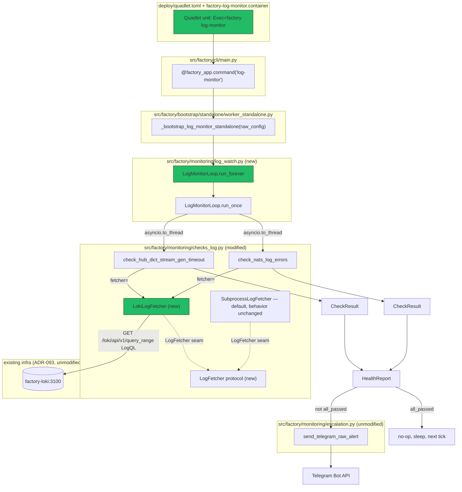
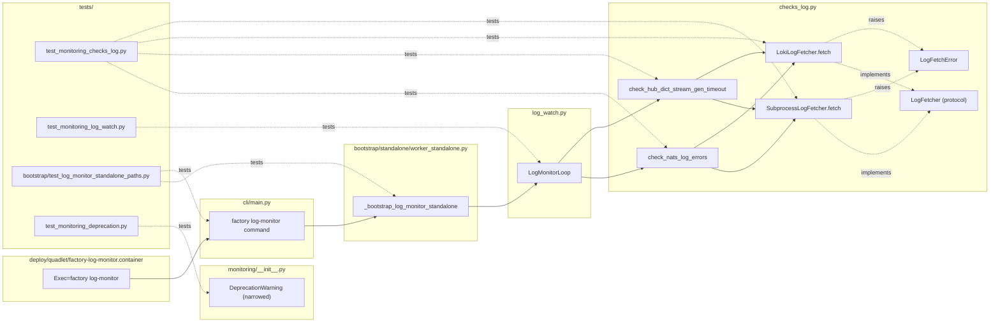

## Summary

Refactor `checks_log.py`'s two log-check functions behind an injectable, synchronous
`LogFetcher` seam (subprocess default unchanged + new Loki-backed fetcher), compose
them into a new `LogMonitorLoop` scheduler, wire it to a `factory log-monitor` CLI
subcommand and a new Quadlet unit that reuses the existing `svc-runtime` image — no
new container image, no Podman-socket mount, no host-timer, no event-bus code.

## Architecture

### Data flow



### File × Function map



## Agents

| Agent | Instances | Task count | Files |
|-------|-----------|------------|-------|
| backend-dev | A, B | 6 (A: 3, B: 3) | `src/factory/monitoring/checks_log.py`, `src/factory/monitoring/log_watch.py` (new), `src/factory/monitoring/__init__.py`, `src/factory/bootstrap/standalone/worker_standalone.py`, `src/factory/cli/main.py` |
| tester | A | 4 | `tests/test_monitoring_checks_log.py` (new), `tests/test_monitoring_log_watch.py` (new), `tests/bootstrap/test_log_monitor_standalone_paths.py` (new), `tests/test_monitoring_deprecation.py` (new) |
| devops | A | 3 | `deploy/quadlet/factory-log-monitor.container` (new), `deploy/quadlet.toml` |

No frontend-dev (no UI surface), no architect/security-auditor/doc-writer instance needed for
implementation — architecture and security tradeoffs (Podman-socket rejection, Loki pivot) were
already resolved at `/spec` Step 4 expert review; SL6 (PR design note) is a `/pr`-step deliverable,
not an implementation micro-task.

## Consistency Report

Every Success Criterion (SC1–SC10, SC3b) traces to ≥1 micro-task; every micro-task traces to
≥1 SC or Slice. No orphans.

| SC | Covered by |
|----|-----------|
| SC1 (≤5min interval, no systemctl/host-timer) | T5, T9 |
| SC2 (Loki fetch, no Podman socket/CLI, no new image) | T2, T9 |
| SC3 (default-fetcher behavior unchanged) | T1, T3, T4 |
| SC3b (unified `LogFetchError`) | T1, T2, T3, T4 |
| SC4 (Telegram alert on failure) | T5, T6 |
| SC5 (all-pass → zero Telegram calls) | T5, T6 |
| SC6 (`lyra-monitor.*` zero diff) | verified at `/pr` (`git diff --stat deploy/lyra-monitor.*` — no task touches this path by construction) |
| SC7 (deprecation warning narrowing) | T12, T13 |
| SC8 (PR design note) | SL6 — `/pr`-step deliverable, not an implementation task |
| SC9 (`quadlet-lint` passes) | T9, T10, T11 |
| SC10 (no event/metric bus producer) | T5, T7, T8 |

Slices: SL1→T1–T4, SL2→T5–T6, SL3→T7–T8, SL4→T9–T11, SL5→T12–T13, SL6→exempted (PR-description
deliverable, written during `/pr`, not a code micro-task — consistent with `/plan`'s "Tier F"
process, which generates micro-tasks for code slices only).

Covered: 11/11 SC · 6/6 slices (5 code slices → 13 tasks, 1 doc slice → PR-step). Uncovered: none.

## Reference Patterns (Step 3)

- CLI subcommand registration: `src/factory/cli/main.py:175` (`@factory_app.command("turn-writer")`
  → `_boot(_bootstrap_turn_writer_standalone)`) — mirror exactly for `log-monitor`.
- Standalone bootstrap function shape: `src/factory/bootstrap/standalone/worker_standalone.py:108`
  (`_bootstrap_turn_writer_standalone(raw_config: dict) -> None`).
- `_boot(coro_factory)` (`src/factory/cli/main.py:104`) is generic — loads config, sets up logging,
  `asyncio.run(coro_factory(raw_config))`. Not NATS-specific; safe to reuse for a non-NATS loop.
- Quadlet unit conventions: `deploy/quadlet/factory-turn-writer.container` (hardening flags,
  `UserNS=keep-id`, `Secret=...,type=mount,...` for nkey) and `deploy/quadlet/factory-clipool.container`
  (`Secret=<name>,type=env,target=<VAR>` — the pattern to mirror for `TELEGRAM_TOKEN`/
  `TELEGRAM_ADMIN_CHAT_ID`).
- `deploy/quadlet.toml`: 20 `[component.*]` entries already present (e.g. `[component.turn-writer]`
  at line 42) — add `[component.log-monitor]` following the same shape.
- Test precedent: `tests/bootstrap/test_turn_writer_standalone_paths.py` — mirror for
  `tests/bootstrap/test_log_monitor_standalone_paths.py`.
- **Verified via grep: no existing tests reference `check_nats_log_errors` or
  `check_hub_dict_stream_gen_timeout` anywhere in the tree today** (only `checks_log.py` and
  `checks.py` itself reference the symbols). SC3's "all pre-existing tests... pass without
  modification" is vacuously true — but this means T4 must **write new regression/baseline tests**
  for current default-fetcher behavior (not just add Loki-fetcher tests), so the refactor has any
  coverage at all. Folded into T4 below.
- Quadlet CI gate: `.github/workflows/quadlet-lint.yml` — `podman quadlet --dryrun --user` (env
  `QUADLET_UNIT_DIRS=deploy/quadlet`) + `HealthCmd=` double-quote grep + inline-`#`-comment grep +
  `tools/check_quadlet_template_purity.sh`. Requires Podman ≥5 (not guaranteed on the local dev
  box) — CI is the authoritative gate; T11 runs what's locally available and defers full
  confirmation to `/ci-watch`.
- `pyproject.toml:123` — existing `ignore:factory.monitoring is deprecated:DeprecationWarning`
  pytest filter, to be updated in lockstep with T12.

## Wave Structure

3 waves, max 3 parallel agent instances. Elapsed ~3 sequential stages vs 13 tasks fully serial —
roughly 4-5x parallelism inside Wave 1.

| Wave | Trigger | Agents | Tasks |
|------|---------|--------|-------|
| 1 | start | 3 ∥ | backend-dev-A: T1→T2→T3 · backend-dev-B: T12 · devops-A: T9→T10→T11 |
| 2 | Wave 1 done | 2 ∥ | backend-dev-B: T5→T7 · tester-A: T4, T13 |
| 3 | Wave 2 done | 1 | tester-A: T6, T8 |

### Budget — per task

| Task | Items | Class | Est. ops | Split? |
|------|-------|-------|----------|--------|
| T1 — LogFetcher protocol + LogFetchError + SubprocessLogFetcher | 1 | judgmental | 5 | — |
| T2 — LokiLogFetcher | 1 | judgmental | 5 | — |
| T3 — wire `fetcher` param into both check functions | 2 | bounded | 3 | — |
| T4 — regression + Loki-fetcher tests | 3 | judgmental | 6 | — |
| T5 — LogMonitorLoop | 1 | judgmental | 6 | — |
| T6 — LogMonitorLoop tests | 3 | judgmental | 5 | — |
| T7 — bootstrap fn + CLI command registration | 2 | bounded | 4 | — |
| T8 — CLI/bootstrap smoke test + bus-producer grep check | 2 | bounded | 3 | — |
| T9 — `factory-log-monitor.container` unit | 1 | bounded | 4 | — |
| T10 — `[component.log-monitor]` in `quadlet.toml` | 1 | trivial | 2 | — |
| T11 — quadlet-lint local run + fixups | 1 | trivial | 2 | — |
| T12 — narrow `DeprecationWarning` + `pyproject.toml` filter | 2 | bounded | 3 | — |
| T13 — deprecation-warning test | 1 | bounded | 3 | — |

**Total estimated ops: 51**

### Budget — per agent instance

| Instance | Tasks | Σ ops | Subjects | Split? |
|----------|-------|-------|----------|--------|
| backend-dev-A | T1, T2, T3 | 13 | monitoring | — |
| backend-dev-B | T5, T7, T12 | 13 | monitoring | — |
| tester-A | T4, T6, T8, T13 | 17 | monitoring | — |
| devops-A | T9, T10, T11 | 8 | deploy | — |

No force-splits required — all instances ≤4 tasks, ≤50 ops, 1 subject each.

## Task Seeding Blueprint

<!-- Used by /implement to seed TaskCreate calls on session start.
     Format: T{n} | agent-instance | blockedBy | subject
     blockedBy refs T-numbers within this list (not session task IDs).
     Agent instances are named (tester-A/B, backend-dev-A/B/C, devops-A/B)
     so parallel tasks map to distinct spawned agents.
     Seed in wave order; within a wave all rows are parallel (∥). -->

### Wave 1 — no deps, 3 agents ∥

| Task | Agent instance | blockedBy | Subject |
|------|---------------|-----------|---------|
| T1 | backend-dev-A | — | monitoring |
| T2 | backend-dev-A | T1 | monitoring |
| T3 | backend-dev-A | T2 | monitoring |
| T12 | backend-dev-B | — | monitoring |
| T9 | devops-A | — | deploy |
| T10 | devops-A | T9 | deploy |
| T11 | devops-A | T10 | deploy |

### Wave 2 — after Wave 1, 2 agents ∥

| Task | Agent instance | blockedBy | Subject |
|------|---------------|-----------|---------|
| T5 | backend-dev-B | T3 | monitoring |
| T7 | backend-dev-B | T5 | monitoring |
| T4 | tester-A | T3 | monitoring |
| T13 | tester-A | T12 | monitoring |

### Wave 3 — after Wave 2, 1 agent

| Task | Agent instance | blockedBy | Subject |
|------|---------------|-----------|---------|
| T6 | tester-A | T5 | monitoring |
| T8 | tester-A | T7 | monitoring |

## Micro-Tasks

### Slice SL1 — Injectable log-fetch seam (`checks_log.py`)

#### T1 — Add `LogFetchError` + `LogFetcher` protocol + `SubprocessLogFetcher`

- **Description:** In `src/factory/monitoring/checks_log.py`, add a `LogFetchError(Exception)`
  class, a `LogFetcher` `Protocol` with `fetch(self, container_name: str, since_minutes: int) -> str`,
  and a `SubprocessLogFetcher` class whose `fetch()` body is the current inline
  `subprocess.run(["podman", "logs", "--since", f"{max_age_minutes}m", container_name], ...)` call,
  moved verbatim (same args, same timeout, same text decoding) so behavior is byte-for-byte
  unchanged. Map the existing `_LOG_EXCEPTIONS` tuple (`subprocess.TimeoutExpired`,
  `FileNotFoundError`, `subprocess.CalledProcessError`) to `raise LogFetchError(...) from e` inside
  `SubprocessLogFetcher.fetch()`.
- **File:** `src/factory/monitoring/checks_log.py`
- **Snippet skeleton:**
  ```python
  class LogFetchError(Exception):
      """Raised by any LogFetcher implementation on fetch failure."""

  class LogFetcher(Protocol):
      def fetch(self, container_name: str, since_minutes: int) -> str: ...

  class SubprocessLogFetcher:
      def fetch(self, container_name: str, since_minutes: int) -> str:
          try:
              result = subprocess.run(
                  ["podman", "logs", "--since", f"{since_minutes}m", container_name],
                  capture_output=True, text=True, timeout=..., check=True,
              )
          except _LOG_EXCEPTIONS as e:
              raise LogFetchError(str(e)) from e
          return result.stdout
  ```
- **Verify:** `.venv/bin/python -c "from factory.monitoring.checks_log import LogFetchError, LogFetcher, SubprocessLogFetcher"`
- **Expected:** import succeeds, no `ImportError`/`AttributeError`.
- **Time:** 8 min · **Difficulty:** 3 · **Trace:** SC3, SC3b · **Slice:** SL1 · **Phase:** GREEN

#### T2 — Add `LokiLogFetcher`

- **Description:** Add a `LokiLogFetcher` class to `checks_log.py` with `loki_url: str` (default
  `http://factory-loki:3100`) and a synchronous `fetch(container_name, since_minutes)` that issues
  `GET {loki_url}/loki/api/v1/query_range` with LogQL query
  `{{systemd_unit="{container_name}.service"}}` over a `since_minutes`-wide time window (epoch-ns
  `start`/`end` params), using `httpx.Client` (sync, matching the sync `LogFetcher` protocol — no
  `asyncio` inside this class). Concatenate matched log lines into a single string (same return
  shape as `SubprocessLogFetcher.fetch`). On HTTP error, timeout, or malformed JSON response, raise
  `LogFetchError`.
- **File:** `src/factory/monitoring/checks_log.py`
- **Snippet skeleton:**
  ```python
  class LokiLogFetcher:
      def __init__(self, loki_url: str = "http://factory-loki:3100") -> None:
          self.loki_url = loki_url

      def fetch(self, container_name: str, since_minutes: int) -> str:
          query = f'{{systemd_unit="{container_name}.service"}}'
          try:
              resp = httpx.get(
                  f"{self.loki_url}/loki/api/v1/query_range",
                  params={"query": query, "start": ..., "end": ..., "limit": 5000},
                  timeout=10.0,
              )
              resp.raise_for_status()
              data = resp.json()
          except (httpx.HTTPError, ValueError) as e:
              raise LogFetchError(str(e)) from e
          return "\n".join(_extract_lines(data))
  ```
- **Verify:** `.venv/bin/python -c "from factory.monitoring.checks_log import LokiLogFetcher; LokiLogFetcher()"`
- **Expected:** instantiates without error; no network call at import/construction time.
- **Time:** 10 min · **Difficulty:** 4 · **Trace:** SC2, SC3b · **Slice:** SL1 · **Phase:** GREEN

#### T3 — Wire `fetcher` param into both check functions

- **Description:** Update `check_nats_log_errors(container_name, max_age_minutes, fetcher:
  LogFetcher = SubprocessLogFetcher())` and `check_hub_dict_stream_gen_timeout(container_name,
  max_age_minutes, threshold, fetcher: LogFetcher = SubprocessLogFetcher())` to call
  `fetcher.fetch(container_name, max_age_minutes)` instead of the inline `subprocess.run` call, and
  catch `LogFetchError` (replacing the old direct `_LOG_EXCEPTIONS` catch at the call site — the
  exception mapping now lives inside the fetcher). Preserve exact counting/threshold logic
  ("permissions violation" substring count; `_dict_stream_gen timeout` case-insensitive count vs
  `threshold`) unchanged.
- **File:** `src/factory/monitoring/checks_log.py`
- **Verify:** `grep -n "fetcher: LogFetcher" src/factory/monitoring/checks_log.py | wc -l` → `2`
- **Expected:** both function signatures show the new param; `grep -c "subprocess.run" src/factory/monitoring/checks_log.py` → `1` (only inside `SubprocessLogFetcher.fetch`, not duplicated at call sites).
- **Time:** 6 min · **Difficulty:** 2 · **Trace:** SC1, SC3, SC3b · **Slice:** SL1 · **Phase:** GREEN

#### T4 — Regression + Loki-fetcher tests [RED-GATE]

- **Description:** Create `tests/test_monitoring_checks_log.py`. **No tests currently exist for
  either check function (grep-confirmed empty) — this task establishes the baseline, not just new
  coverage.** Cover: (a) `check_nats_log_errors`/`check_hub_dict_stream_gen_timeout` with the
  default `SubprocessLogFetcher` — mock `subprocess.run` to return known log text, assert correct
  pass/fail + counts (permissions-violation substring, `_dict_stream_gen timeout` case-insensitive
  vs threshold); (b) same two functions with an injected fake/mock `LogFetcher` returning
  controlled text, proving the fetcher seam actually decouples fetch from logic; (c)
  `LokiLogFetcher.fetch` against a mocked `httpx` response — success (matched lines), malformed
  JSON, and HTTP error → all three assert `LogFetchError` is raised where applicable; (d) confirm
  `SubprocessLogFetcher` failure paths (`TimeoutExpired`, `FileNotFoundError`,
  `CalledProcessError`) all surface as `LogFetchError`.
- **File:** `tests/test_monitoring_checks_log.py` (new)
- **Verify:** `.venv/bin/pytest tests/test_monitoring_checks_log.py -v`
- **Expected:** all new tests pass; this is the RED-GATE for SL1 — before T1–T3 exist, these tests
  fail/don't-collect; after, they pass. Run once before T1 starts (RED) and again after T3
  completes (GREEN) to falsify the refactor didn't silently change counting behavior.
- **Time:** 15 min · **Difficulty:** 3 · **Trace:** SC3, SC3b · **Slice:** SL1 · **Phase:** RED-GATE

### Slice SL2 — `LogMonitorLoop` (`log_watch.py`)

#### T5 — `LogMonitorLoop`

- **Description:** Create `src/factory/monitoring/log_watch.py` with a `LogMonitorLoop` class:
  `__init__(self, interval_minutes: int = 5, fetcher: LogFetcher | None = None)` (default to
  `LokiLogFetcher()`); `async def run_once(self) -> HealthReport` — calls
  `check_nats_log_errors("factory-nats", ..., fetcher=self.fetcher)` and
  `check_hub_dict_stream_gen_timeout("factory-hub", ..., fetcher=self.fetcher)` each via
  `asyncio.to_thread` (matching the existing pattern already used in `checks.py`), assembles a
  `HealthReport`; `async def run_forever(self) -> None` — loops `run_once()`, calls
  `escalation.send_telegram_raw_alert(report)` iff `not report.all_passed`, then
  `asyncio.sleep(self.interval_minutes * 60)`.
- **File:** `src/factory/monitoring/log_watch.py` (new)
- **Verify:** `.venv/bin/python -c "from factory.monitoring.log_watch import LogMonitorLoop; import inspect, asyncio; assert asyncio.iscoroutinefunction(LogMonitorLoop.run_once)"`
- **Expected:** no import error; `run_once`/`run_forever` are coroutine functions.
- **Time:** 12 min · **Difficulty:** 3 · **Trace:** SC1, SC4, SC5 · **Slice:** SL2 · **Phase:** GREEN

#### T6 — `LogMonitorLoop` tests [RED-GATE]

- **Description:** Create `tests/test_monitoring_log_watch.py`. Mock `check_nats_log_errors` and
  `check_hub_dict_stream_gen_timeout` (or mock the fetcher and let real check logic run) plus
  `escalation.send_telegram_raw_alert`. Assert: all-pass → `send_telegram_raw_alert` NOT called
  (SC5); one-fail → called once with a `HealthReport` containing both results (SC4); both-fail →
  called once, single alert listing both failures (per spec's edge-case table — no per-check
  duplicate alerts).
- **File:** `tests/test_monitoring_log_watch.py` (new)
- **Verify:** `.venv/bin/pytest tests/test_monitoring_log_watch.py -v`
- **Expected:** all pass. RED before T5 exists (import fails), GREEN after.
- **Time:** 12 min · **Difficulty:** 3 · **Trace:** SC4, SC5 · **Slice:** SL2 · **Phase:** RED-GATE

### Slice SL3 — CLI subcommand

#### T7 — Bootstrap function + CLI registration

- **Description:** Add `_bootstrap_log_monitor_standalone(raw_config: dict) -> None` (async) to
  `src/factory/bootstrap/standalone/worker_standalone.py`, mirroring
  `_bootstrap_turn_writer_standalone`'s shape: construct `MonitoringConfig` from `raw_config`
  (reads `TELEGRAM_TOKEN`/`TELEGRAM_ADMIN_CHAT_ID` per its existing contract), construct
  `LogMonitorLoop(interval_minutes=config.check_interval_minutes)`, `await loop.run_forever()`.
  Register `@factory_app.command("log-monitor")` in `src/factory/cli/main.py` (next to the
  `"turn-writer"` command at line ~175) calling `_boot(_bootstrap_log_monitor_standalone)`. Add a
  test-only single-tick path (e.g. a `--once` flag or `FACTORY_LOG_MONITOR_ONCE=1` env check) that
  calls `run_once()` instead of `run_forever()` and exits 0/1 based on `HealthReport.all_passed` —
  needed for T8's smoke test and for manual verification without waiting a full interval.
- **File:** `src/factory/bootstrap/standalone/worker_standalone.py`, `src/factory/cli/main.py`
- **Verify:** `.venv/bin/python -m factory.cli.main log-monitor --help` (or equivalent Typer help
  invocation)
- **Expected:** command listed, `--help` exits 0, no import-time side effects (no network call
  before invocation).
- **Time:** 10 min · **Difficulty:** 3 · **Trace:** SC1, SC10 · **Slice:** SL3 · **Phase:** GREEN

#### T8 — CLI/bootstrap smoke test + bus-producer grep check [RED-GATE]

- **Description:** Create `tests/bootstrap/test_log_monitor_standalone_paths.py` mirroring
  `tests/bootstrap/test_turn_writer_standalone_paths.py`'s structure. Mock `LogMonitorLoop` (or its
  dependencies) to smoke-test that `_bootstrap_log_monitor_standalone`/the `--once` CLI path exits
  0 on all-pass and non-zero on a failed check. Add a static grep-based test asserting no
  `factory.event.*` or `factory.metric.*` subject string appears in
  `src/factory/monitoring/log_watch.py`, `worker_standalone.py`'s new function, or the CLI
  registration — guarding SC10 (no event/metric bus producer introduced).
- **File:** `tests/bootstrap/test_log_monitor_standalone_paths.py` (new)
- **Verify:** `.venv/bin/pytest tests/bootstrap/test_log_monitor_standalone_paths.py -v`
- **Expected:** all pass. RED before T7 exists, GREEN after.
- **Time:** 10 min · **Difficulty:** 2 · **Trace:** SC10 · **Slice:** SL3 · **Phase:** RED-GATE

### Slice SL4 — Quadlet unit + manifest entry

#### T9 — `factory-log-monitor.container` Quadlet unit

- **Description:** Create `deploy/quadlet/factory-log-monitor.container`, mirroring
  `factory-turn-writer.container`'s structure: `Image=ghcr.io/roxabi/factory:staging-svc` (reuse
  `svc-runtime`, no new image), `Exec=factory log-monitor`, `Network=roxabi.network`,
  `After=factory-hub.service factory-nats.service factory-loki.service` (no `Requires=` — matches
  the "adapter pattern" the spec calls for, not a hard dependency), hardening flags
  (`NoNewPrivileges=true`, `ReadOnly=true`, `DropCapability=all`, `UserNS=keep-id:uid=1500,gid=1500`
  per ADR-053/ADR-054), and Telegram secret wiring via `Secret=<name>,type=env,target=TELEGRAM_TOKEN`
  / `Secret=<name>,type=env,target=TELEGRAM_ADMIN_CHAT_ID`, mirroring `factory-clipool.container`'s
  `type=env` secret pattern. Resolve the exact secret name(s) against whatever already-provisioned
  Telegram bot secret identity the existing `factory-telegram`/`factory-discord` components use
  (grep `deploy/quadlet/factory-telegram.container` and `deploy/quadlet.toml`'s
  `[component.telegram]` `required_secrets` for the established name) — do not mint a new bot
  token unless none exists.
- **File:** `deploy/quadlet/factory-log-monitor.container` (new)
- **Verify:** `grep -c "^Exec=factory log-monitor$" deploy/quadlet/factory-log-monitor.container` →
  `1`; no inline `#` comment on any value line (`grep -P '^\s*[^#;].*[[:space:]]#'` → no match).
- **Expected:** unit file present, passes the two greps above.
- **Time:** 10 min · **Difficulty:** 3 · **Trace:** SC1, SC2, SC9 · **Slice:** SL4 · **Phase:** GREEN

#### T10 — `[component.log-monitor]` in `deploy/quadlet.toml`

- **Description:** Add a `[component.log-monitor]` entry to `deploy/quadlet.toml`, mirroring the
  shape of `[component.turn-writer]` (line 42) — component name, unit file reference, any
  `required_secrets` list matching T9's `Secret=` lines.
- **File:** `deploy/quadlet.toml`
- **Verify:** `python3 -c "import tomllib; tomllib.load(open('deploy/quadlet.toml','rb'))"` — no
  `TOMLDecodeError`.
- **Expected:** file parses; `grep -n "\[component.log-monitor\]" deploy/quadlet.toml` → 1 match.
- **Time:** 5 min · **Difficulty:** 1 · **Trace:** SC9 · **Slice:** SL4 · **Phase:** GREEN

#### T11 — Quadlet lint (local best-effort)

- **Description:** Run the checks from `.github/workflows/quadlet-lint.yml` locally against the new
  unit where the local toolchain allows: `HealthCmd=` double-quote grep, inline-`#`-comment grep,
  and `bash tools/check_quadlet_template_purity.sh`. If `podman quadlet --dryrun --user` (Podman
  ≥5) is unavailable locally, note it explicitly and defer full confirmation to CI (`/ci-watch`) —
  do not skip silently.
- **File:** `deploy/quadlet/factory-log-monitor.container`, `deploy/quadlet.toml` (verification only, no new edits unless lint fails)
- **Verify:** `bash tools/check_quadlet_template_purity.sh` (exit 0); `grep -nP 'HealthCmd=(?!python3 -c '"'"').*"' deploy/quadlet/*.container` (no match, or only the pre-existing exempted pattern)
- **Expected:** purity script exits 0; no double-quote or inline-comment violations introduced.
- **Time:** 8 min · **Difficulty:** 2 · **Trace:** SC9 · **Slice:** SL4 · **Phase:** GREEN

### Slice SL5 — Deprecation-warning narrowing

#### T12 — Narrow `DeprecationWarning`

- **Description:** Edit `src/factory/monitoring/__init__.py` so the package-level
  `DeprecationWarning` ("factory.monitoring is deprecated... will be removed when v2 lands") no
  longer fires on `import factory.monitoring.checks_log` / `import factory.monitoring.escalation`.
  Preferred approach: remove the blanket `warnings.warn(...)` from `__init__.py` and move an
  equivalent warning into `checks.py` and `__main__.py`'s own module top-level (the two modules
  that remain dormant/host-bound) — so the warning becomes module-scoped rather than
  package-scoped. Update `pyproject.toml:123`'s
  `"ignore:factory.monitoring is deprecated:DeprecationWarning"` pytest filter in lockstep (keep it
  if the warning text/category is unchanged and still needed to silence `checks.py`/`__main__.py`
  imports in other tests; adjust the match string only if the warning's wording changes).
- **File:** `src/factory/monitoring/__init__.py`, `pyproject.toml`
- **Verify:** `.venv/bin/python -W error::DeprecationWarning -c "import factory.monitoring.checks_log, factory.monitoring.escalation"`
- **Expected:** exits 0 (no `DeprecationWarning` raised as error).
- **Time:** 8 min · **Difficulty:** 2 · **Trace:** SC7 · **Slice:** SL5 · **Phase:** GREEN

#### T13 — Deprecation-warning test [RED-GATE]

- **Description:** Create `tests/test_monitoring_deprecation.py` asserting (a) `import
  factory.monitoring.checks_log` and `import factory.monitoring.escalation` emit no
  `DeprecationWarning` (use `pytest.warns(None)`/`warnings.catch_warnings(record=True)` and assert
  empty), and (b) `import factory.monitoring.checks` / `import factory.monitoring.__main__` still
  do emit it (whichever module now carries the warning per T12's implementation).
- **File:** `tests/test_monitoring_deprecation.py` (new)
- **Verify:** `.venv/bin/pytest tests/test_monitoring_deprecation.py -v`
- **Expected:** all pass. RED before T12 (checks_log/escalation still warn), GREEN after.
- **Time:** 8 min · **Difficulty:** 2 · **Trace:** SC7 · **Slice:** SL5 · **Phase:** RED-GATE

### Slice SL6 — PR design note (not a code task)

No micro-task generated. SL6's deliverable is prose in the PR description, written during `/pr`
(design note: ADR-091 plane③ V1-pull framing, explicit non-host-timer/non-Sentinelle framing, Loki-
availability residual-risk statement — content already drafted in spec §Expected Behavior point 7).
SC6 (`lyra-monitor.*` zero diff) is verified the same way — by construction, since no task above
touches that path; confirm via `git diff --stat origin/staging..HEAD -- deploy/lyra-monitor.*`
returning empty at `/pr` time.

## Task IDs

<!-- Generated by /plan. TaskCreate/TaskList tools are unavailable in this session
     (confirmed via ToolSearch during /frame and /spec — same gap, consistent handling).
     No session task IDs were minted. The Task Seeding Blueprint above (T1-T13, wave-grouped,
     with agent-instance + blockedBy + subject) is the authoritative machine-readable task list
     for /implement to consume directly from this committed artifact — per this skill's own
     documentation, "artifacts remain authoritative across sessions." -->

- T1–T13: no task_id (TaskCreate unavailable) — see `## Task Seeding Blueprint` and
  `## Micro-Tasks` above for the full spec (agent instance, dependencies, subject, verify
  command) that `/implement` should re-derive tasks from.
