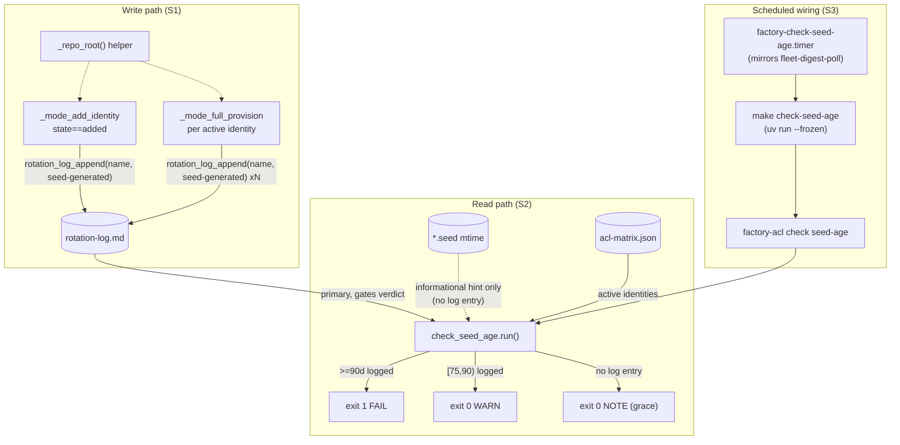
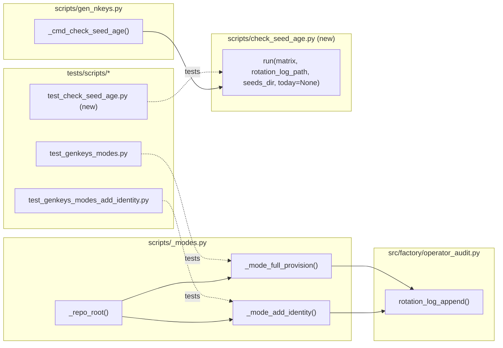

## Summary

Wire `rotation_log_append()` into the two routine nkey-rotation paths (`_mode_add_identity`, `_mode_full_provision`), add a new pure-function checker `scripts/check_seed_age.py` + `factory-acl check seed-age` CLI + `make check-seed-age`, and schedule it via a systemd timer on M₁ (never CI-blocking). 15 micro-tasks across 3 slices, 6 agent instances, 3 waves.

## Architecture

### Data Flow

### File × Function Map

## Ref Patterns

- `scripts/check_grants.py` — shape reference for the new `scripts/check_seed_age.py`: module-level constants, standalone `run(matrix)`-style function, stderr error printing, exit-code convention.
- `deploy/systemd/factory-fleet-digest-poll.{service,timer}` — shape reference for the new `factory-check-seed-age.{service,timer}` (host `WorkingDirectory=`/`PATH=` + `uv run --frozen`), per devops review finding — **not** `factory-operator-logrotate` (bare bash, wrong shape).
- `Makefile:337` `nats-add-identity` target — reference for `uv run --frozen --project .` invocation style.

## Agents

| Agent | Task count | Files |
|-------|-----------|-------|
| tester-A | 3 | tests/scripts/test_genkeys_modes_add_identity.py, tests/scripts/test_genkeys_modes.py |
| tester-B | 2 | tests/scripts/test_check_seed_age.py, (validation only, no file) |
| backend-dev-A | 3 | scripts/_modes.py |
| backend-dev-B | 2 | scripts/check_seed_age.py, scripts/gen_nkeys.py |
| devops-A | 3 | Makefile, deploy/systemd/factory-check-seed-age.service, deploy/systemd/factory-check-seed-age.timer |
| doc-writer-A | 2 | docs/runbooks/nkey-rotation.md, docs/runbooks/operator-log.md, deploy/AGENTS.md |

## Wave Structure

3 waves, max 5 parallel agents. Elapsed ~1 session vs ~3 sequential.

| Wave | Trigger | Agents | Tasks |
|------|---------|--------|-------|
| 1 | start | 5 ∥ | tester-A: T1,T3,T4 · tester-B: T7 · backend-dev-A: T2 · devops-A: T10,T11,T12 · doc-writer-A: T14,T15 |
| 2 | Wave 1 done | 2 ∥ | backend-dev-A: T5→T6 · backend-dev-B: T8→T9 |
| 3 | Wave 2 done | 1 | tester-B: T16 |

### Budget — per task

| Task | Items | Class | Est. ops | Split? |
|------|-------|-------|----------|--------|
| T1 — harden hermeticity (2 files, subprocess + monkeypatch) | 2 | judgmental | 6 | — |
| T2 — `_repo_root()` helper | 1 | bounded | 2 | — |
| T3 — RED test N1 (state==added gating) | 1 | judgmental | 5 | — |
| T4 — RED test N2 (N entries per full provision) | 1 | judgmental | 5 | — |
| T5 — implement N1 wiring | 1 | bounded | 3 | — |
| T6 — implement N2 wiring | 1 | bounded | 3 | — |
| T7 — RED test check_seed_age (boundary matrix) | 1 | exploratory | 10 | — |
| T8 — implement check_seed_age.py (new module) | 1 | exploratory | 12 | — |
| T9 — CLI wiring (`check seed-age` subcommand) | 1 | bounded | 3 | — |
| T10 — Makefile `check-seed-age:` target | 1 | trivial | 2 | — |
| T11 — systemd service+timer (new files) | 2 | judgmental | 5 | — |
| T12 — Makefile `quadlet-sync-install` registration | 1 | bounded | 3 | — |
| T14 — nkey-rotation.md doc update | 1 | judgmental | 4 | — |
| T15 — operator-log.md + AGENTS.md doc update | 2 | judgmental | 5 | — |
| T16 — final QA gate (pytest + ruff + pyright) | 1 | bounded | 3 | — |

**Total estimated ops: 71**

### Budget — per agent instance

Caps: `Σ ops > 50` OR `|tasks| > 4` OR `distinct subjects > 2` → split into new instance.

| Instance | Tasks | Σ ops | Subjects | Split? |
|----------|-------|-------|----------|--------|
| tester-A | T1, T3, T4 | 16 | hermeticity, rotation-wiring | — |
| tester-B | T7, T16 | 13 | seed-age-check, qa-gate | — |
| backend-dev-A | T2, T5, T6 | 8 | plumbing, rotation-wiring | — |
| backend-dev-B | T8, T9 | 15 | seed-age-check, cli-wiring | — |
| devops-A | T10, T11, T12 | 10 | build-target, systemd-unit | — |
| doc-writer-A | T14, T15 | 9 | docs | — |

All instances within caps — no forced split required.

## Consistency Report

- Criteria covered: 12/12 (all `## Success Criteria` checkboxes traced to ≥1 task)
- Uncovered criteria: none
- Tasks without spec backing: none (T16 exempt as the final QA/build-quality gate — sole purpose: verification, not a new criterion)
- Gold plating exemptions applied: 1 (T16 — infra/quality-gate task, no dedicated SC line)

## Micro-Tasks

### Slice S1 — Wire the write path (N1, N2, N3, N9, N10)

#### Task 1: Harden existing tests for ROTATION_LOG/OPERATOR_LOG hermeticity [P] → tester
- **File:** `tests/scripts/test_genkeys_modes_add_identity.py`, `tests/scripts/test_genkeys_modes.py`
- **Snippet:** add `"ROTATION_LOG": str(tmp_path / "rotation-log.md"), "OPERATOR_LOG": str(tmp_path / "operator.log")` to every `env={...}` dict exercising `_mode_add_identity`/`_mode_full_provision`/`_mode_regenerate`; add matching `monkeypatch.setenv("ROTATION_LOG", ...)` + `monkeypatch.setenv("OPERATOR_LOG", ...)` to in-process call sites (e.g. `test_full_provision_returns_externals_list` near line 677, `_mode_regenerate` rollback test near line 921)
- **Verify:** `uv run pytest tests/scripts/test_genkeys_modes_add_identity.py tests/scripts/test_genkeys_modes.py -q` (ready)
- **Expected:** existing suite stays green; no behavior change yet (N1/N2 don't exist), purely defensive
- **Time:** 8 min | **Difficulty:** 2
- **Traces:** N9 | **Phase:** GREEN

#### Task 2: Add `_repo_root()` helper [P] → backend-dev
- **File:** `scripts/_modes.py`
- **Snippet:** `def _repo_root() -> Path: return Path(__file__).resolve().parents[1]` (mirrors `gen_nkeys.py::_REPO_ROOT`)
- **Verify:** `uv run python -c "from scripts._modes import _repo_root; print(_repo_root())"` (ready)
- **Expected:** prints repo root path
- **Time:** 3 min | **Difficulty:** 1
- **Traces:** N3 | **Phase:** GREEN

#### Task 3: RED — write failing test for N1 gating [P] → tester
- **File:** `tests/scripts/test_genkeys_modes_add_identity.py`
- **Snippet:** assert `rotation-log.md` (via `ROTATION_LOG` fixture) gains one `secret:<name>` line when `state=="added"`, and gains **no** line when state is `"repaired"` or `"noop"`
- **Verify:** `uv run pytest tests/scripts/test_genkeys_modes_add_identity.py -k rotation_log -q` (expected: FAIL — no wiring yet)
- **Expected:** test fails with assertion error (log file empty/missing), not a collection error
- **Time:** 8 min | **Difficulty:** 3
- **Traces:** SC1 (N1, N10) | **Phase:** RED

#### Task 4: RED — write failing test for N2 gating [P] → tester
- **File:** `tests/scripts/test_genkeys_modes.py`
- **Snippet:** run `_mode_full_provision` against a fixture matrix with K active identities, assert `rotation-log.md` gains exactly K lines, one `secret:` per identity
- **Verify:** `uv run pytest tests/scripts/test_genkeys_modes.py -k rotation_log -q` (expected: FAIL)
- **Expected:** test fails (0 lines written), not a collection error
- **Time:** 8 min | **Difficulty:** 3
- **Traces:** SC2 (N2, N10) | **Phase:** RED

#### RED-GATE: RED complete S1 → tester
- **Verify:** T3 and T4 both fail for the expected reason (missing log lines), not import/collection errors
- **Phase:** RED-GATE

#### Task 5: GREEN — implement N1 wiring → backend-dev
- **File:** `scripts/_modes.py`
- **Snippet:** in `_mode_add_identity`, after `_add_identity_write(...)`: `if state == "added": rotation_log_append(_repo_root(), name, "seed-generated", trigger="factory-acl-add-identity")` — explicit guard, since `_add_identity_write` also runs for `state == "repaired"`
- **Verify:** `uv run pytest tests/scripts/test_genkeys_modes_add_identity.py -k rotation_log -q` (expected: PASS)
- **Expected:** T3 now passes
- **Time:** 5 min | **Difficulty:** 2
- **Traces:** SC1 (N1) | **Phase:** GREEN

#### Task 6: GREEN — implement N2 wiring → backend-dev
- **File:** `scripts/_modes.py`
- **Snippet:** in `_mode_full_provision`, inside `for name in active:` after `pubkeys[name] = provider.pubkey_from_seed(seed)`: `rotation_log_append(_repo_root(), name, "seed-generated", trigger="factory-acl-genkeys")`
- **Verify:** `uv run pytest tests/scripts/test_genkeys_modes.py -k rotation_log -q` (expected: PASS)
- **Expected:** T4 now passes
- **Time:** 5 min | **Difficulty:** 2
- **Traces:** SC2 (N2) | **Phase:** GREEN

### Slice S2 — `make check-seed-age` (N4, N5, N6, N11)

#### Task 7: RED — write failing tests for `check_seed_age.run()` [P] → tester
- **File:** `tests/scripts/test_check_seed_age.py` (new)
- **Contract (pin this — do not deviate):** `run(matrix, rotation_log_path, seeds_dir, *, today=None) -> tuple[list[str], list[str], list[str]]` returning `(warnings, failures, notes)`. Pure function — it **returns** strings, it never prints; printing `WARN:`/`FAIL:`/`NOTE:` to stderr is the CLI's job (Task 9, `scripts/gen_nkeys.py`), not this module's.
- **Snippet:** parametrized boundary cases — 74d ok (empty warnings/failures/notes), 75d → 1 warning, 89d → 1 warning, 90d → 1 failure, 91d → 1 failure (all with a real log entry); zero log entries → always ok (empty warnings/failures) regardless of mtime, including a synthetic mtime that would be >90d if it were gating — a `NOTE:`-style string for that identity appears in `notes` only; no log entry + no seed file → grace, `notes` empty for that identity too (nothing to report); malformed line skipped; non-active `secret:` ignored
- **Verify:** `UV_NO_SYNC=1 uv run --frozen pytest tests/scripts/test_check_seed_age.py -q` (expected: FAIL — module doesn't exist)
- **Expected:** collection/import error or explicit failures, confirming no implementation yet
- **Time:** 10 min | **Difficulty:** 4
- **Traces:** SC (warn/fail boundaries, grace, informational-mtime-never-gates) (N4, N11) | **Phase:** RED

#### RED-GATE: RED complete S2 → tester
- **Verify:** T7 fails for the expected reason (module missing)
- **Phase:** RED-GATE

#### Task 8: GREEN — implement `scripts/check_seed_age.py` → backend-dev
- **File:** `scripts/check_seed_age.py` (new, mirrors `scripts/check_grants.py` shape)
- **Contract (pin this — do not deviate, matches T7's tests exactly):** `WARN_DAYS = 75`, `FAIL_DAYS = 90`; `def run(matrix, rotation_log_path, seeds_dir, *, today=None) -> tuple[list[str], list[str], list[str]]` returning `(warnings, failures, notes)`; `today` defaults to `datetime.now(timezone.utc).date()`. **Pure — returns strings, never prints.** Printing is Task 9's job (CLI layer).
- **Snippet:** parse `rotation-log.md` via regex matching `operator-log.sh:77`'s exact format, skip header/malformed lines, keep latest date per `secret:`, ignore non-active identities; identity with a log entry → real age gates into `warnings`/`failures`; identity with no entry → grace (never appended to `warnings`/`failures`), read `{name}.seed` mtime if present and append an informational string to `notes` (e.g. `"telegram-adapter has no rotation-log entry; seed mtime is 75d old (informational, not policy-enforced — bootstrap grace applies)"`) — `notes` entries never feed `warnings`/`failures`
- **Verify:** `UV_NO_SYNC=1 uv run --frozen pytest tests/scripts/test_check_seed_age.py -q` (expected: PASS)
- **Expected:** all T7 cases pass
- **Time:** 15 min | **Difficulty:** 4
- **Traces:** SC (N4, N11) | **Phase:** GREEN

#### Task 9: GREEN — wire `factory-acl check seed-age` CLI → backend-dev
- **File:** `scripts/gen_nkeys.py`
- **Snippet:** `_cmd_check_seed_age(args)` (mirrors `_cmd_check_grants`) lazily imports `scripts.check_seed_age.run`; `ck_seed_age = ck_sub.add_parser("seed-age", ...)` with `--matrix` arg; reads `ROTATION_LOG` env (default `~/.roxabi/factory/rotation-log.md`) and `scripts._modes._seeds_dir()`; unpacks `(warnings, failures, notes) = run(...)`; **CLI owns all printing**: prints each `notes` entry prefixed `NOTE:`, each `warnings` entry prefixed `WARN:`, each `failures` entry prefixed `FAIL:`, all to stderr; `sys.exit(1)` iff `failures` non-empty, else `sys.exit(0)`
- **Verify:** `UV_NO_SYNC=1 uv run --frozen factory-acl check seed-age --help` exits 0; `grep -q '"seed-age"' scripts/gen_nkeys.py`
- **Expected:** subcommand registered and callable
- **Time:** 8 min | **Difficulty:** 2
- **Traces:** SC (N5) | **Phase:** GREEN

### Slice S3 — Scheduled wiring + docs (N7, N8, N12)

#### Task 10: Add `check-seed-age:` Makefile target [P] → devops
- **File:** `Makefile`
- **Snippet:** `check-seed-age: ## warn/fail on stale nkey seeds\n\tuv run --frozen factory-acl check seed-age` (placed after the `nats-add-identity` block; `--frozen` required — bare `uv run` on M1 prod dirtied `uv.lock` and jammed deploy for 12h on 2026-07-02)
- **Verify:** `grep -q 'check-seed-age:' Makefile && grep -A1 'check-seed-age:' Makefile | grep -q -- '--frozen'`
- **Expected:** target exists with `--frozen`
- **Time:** 3 min | **Difficulty:** 1
- **Traces:** SC (N6) | **Phase:** GREEN

#### Task 11: Create systemd service + timer [P] → devops
- **File:** `deploy/systemd/factory-check-seed-age.service`, `deploy/systemd/factory-check-seed-age.timer`
- **Snippet:** mirrors `factory-fleet-digest-poll.{service,timer}` (NOT `factory-operator-logrotate`): `Type=oneshot`, `WorkingDirectory=%h/projects/roxabi-factory`, `Environment="PATH=%h/projects/roxabi-factory/.venv/bin:%h/.local/bin:/usr/local/bin:/usr/bin:/bin"`, `ExecStart=... make check-seed-age`; timer `OnCalendar=daily`, `Persistent=true`
- **Verify:** `test -f deploy/systemd/factory-check-seed-age.service && test -f deploy/systemd/factory-check-seed-age.timer && grep -q 'WorkingDirectory=' deploy/systemd/factory-check-seed-age.service`
- **Expected:** both files exist, structurally match the fleet-digest-poll shape
- **Time:** 8 min | **Difficulty:** 2
- **Traces:** SC (N7) | **Phase:** GREEN

#### Task 12: Register timer in `quadlet-sync-install` → devops
- **File:** `Makefile`
- **Snippet:** add `cp` + `systemctl --user enable --now factory-check-seed-age.timer` lines to the `quadlet-sync-install:` target, mirroring the 5 existing timer registrations
- **Verify:** `grep -c 'factory-check-seed-age' Makefile` returns ≥3 (target + cp + enable)
- **Expected:** timer registered alongside existing 5
- **Time:** 5 min | **Difficulty:** 1
- **Traces:** SC (N8) | **Phase:** GREEN

#### Task 14: Update nkey-rotation.md → doc-writer
- **File:** `docs/runbooks/nkey-rotation.md`
- **Snippet:** one-line addition near Path A.2/B.2 noting rotation is now auto-logged; "Bootstrap grace" callout explaining log-gates/mtime-is-informational-only design
- **Verify:** `grep -q 'rotation_log_append\|auto-logged' docs/runbooks/nkey-rotation.md`
- **Expected:** doc mentions auto-logging + grace design
- **Time:** 8 min | **Difficulty:** 2
- **Traces:** SC (N12) | **Phase:** GREEN

#### Task 15: Update operator-log.md + AGENTS.md → doc-writer
- **File:** `docs/runbooks/operator-log.md`, `deploy/AGENTS.md`
- **Snippet:** replace the stale "future nkey rotations" placeholder in operator-log.md's "What gets logged automatically" table with two concrete rows (`_mode_add_identity`/`_mode_full_provision` → `rotation-log.md`); same fix in `deploy/AGENTS.md`'s operator-audit section
- **Verify:** `! grep -rq 'future nkey rotations' docs/runbooks/operator-log.md deploy/AGENTS.md`
- **Expected:** no stale placeholder remains in either file
- **Time:** 8 min | **Difficulty:** 2
- **Traces:** SC (N12) | **Phase:** GREEN

#### RED-GATE: RED complete S2/S3 build tasks verified → tester
- **Verify:** T8, T9, T10, T11, T12 all pass their individual verify commands; `.claude/stack.yml` gains no `check-seed-age`/`check_seed_age` entry (`! grep -q 'check-seed-age\|check_seed_age' .claude/stack.yml`)
- **Phase:** RED-GATE

#### Task 16: Final QA gate → tester
- **File:** none (validation only)
- **Snippet:** run full test suite + lint + typecheck
- **Verify:** `uv run pytest tests/scripts/test_genkeys_modes.py tests/scripts/test_genkeys_modes_add_identity.py tests/scripts/test_check_seed_age.py tests/test_operator_audit.py tests/cli/test_cli_secrets_reset.py -q && uv run ruff check . && uv run pyright`
- **Expected:** all green, zero lint/type errors
- **Time:** 5 min | **Difficulty:** 2
- **Traces:** SC (final pytest line) | **Phase:** GREEN

## Task Seeding Blueprint

<!-- Used by /implement to seed TaskCreate calls on session start.
     Format: T{n} | agent-instance | blockedBy | subject
     blockedBy refs T-numbers within this list (not session task IDs).
     Agent instances are named (tester-A/B, backend-dev-A/B, devops-A, doc-writer-A)
     so parallel tasks map to distinct spawned agents.
     Seed in wave order; within a wave all rows are parallel (∥). -->

### Wave 1 — no deps, 5 agents ∥

| Task | Agent instance | blockedBy | Subject |
|------|---------------|-----------|---------|
| T1 | tester-A | — | hermeticity |
| T3 | tester-A | — | rotation-wiring |
| T4 | tester-A | — | rotation-wiring |
| T7 | tester-B | — | seed-age-check |
| T2 | backend-dev-A | — | plumbing |
| T10 | devops-A | — | build-target |
| T11 | devops-A | — | systemd-unit |
| T12 | devops-A | T11 | build-target |
| T14 | doc-writer-A | — | docs |
| T15 | doc-writer-A | T14 | docs |

### Wave 2 — after Wave 1, 2 agents ∥

| Task | Agent instance | blockedBy | Subject |
|------|---------------|-----------|---------|
| T5 | backend-dev-A | T2, T3 | rotation-wiring |
| T6 | backend-dev-A | T2, T4, T5 | rotation-wiring |
| T8 | backend-dev-B | T7 | seed-age-check |
| T9 | backend-dev-B | T8 | cli-wiring |

### Wave 3 — after Wave 2, 1 agent

| Task | Agent instance | blockedBy | Subject |
|------|---------------|-----------|---------|
| T16 | tester-B | T1, T5, T6, T8, T9, T10, T11, T12, T14, T15 | qa-gate |

## Task IDs

<!-- Generated by /plan. This execution environment has no TaskCreate/TaskUpdate/TaskList
     tooling available (session tool inventory checked via ToolSearch: no match) — the
     interactive Claude Code native task-tracking system this section normally references
     is not present here. Rather than fabricate task IDs, this plan's T-numbers (T1-T16)
     in the Task Seeding Blueprint above are the authoritative, sole identity for each
     micro-task; /implement executes directly against that blueprint (spawning one Agent
     call per named instance, honoring wave order + blockedBy) instead of re-attaching to
     session tasks. -->
- No session task IDs seeded (environment gap, noted above) — blueprint T1-T16 is authoritative.
