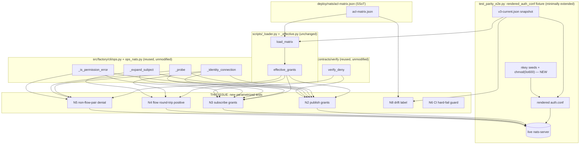
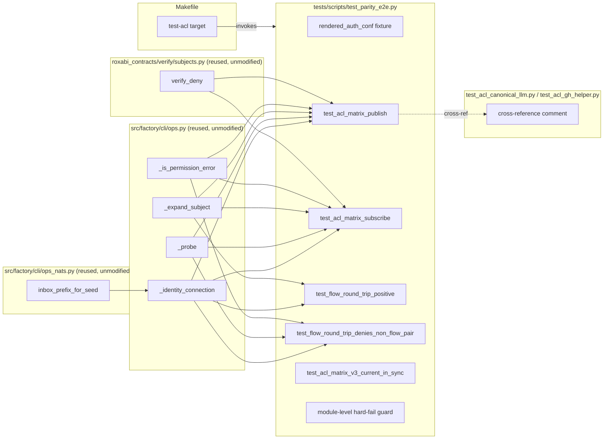

## Summary

Extend `tests/scripts/test_parity_e2e.py` with matrix-driven live ACL parametrization (N2/N3 over `effective_grants()`), flow round-trip tests (N4 positive, N5 non-flow-pair denial), a drift-label test (N8), and a stricter CI hard-fail guard (N6) — reusing `factory.cli.ops`'s live-ACL primitives and `roxabi_contracts.verify.verify_deny` rather than reimplementing them. Add a `make test-acl` alias (N1) and one-line cross-references in the two static per-identity test files (N7). No new per-identity test file, no `acl-matrix.json` changes.

## Architecture

### Data Flow

Config (`acl-matrix.json`) → canonical expansion (`effective_grants`) → new parametrized live tests, driven through the pre-existing reused connect/probe/concretize/deny-subject primitives against a real `nats-server` booted from the unchanged `v3-current.json` snapshot.

### File x Function Map

New test functions all live in one file and are new *consumers* of pre-existing, unmodified primitives in `ops.py`/`ops_nats.py`/`roxabi_contracts/verify` — no fan-out into those modules.

## Bootstrap Context

None — no `artifacts/analyses/2247-*` exists; the spec's Context section (source-verified during Step 4 expert review: architect/doc-writer/product-lead/devops) already carries the equivalent grounding.

## Agents

| Agent | Task count | Files |
|-------|-----------|-------|
| devops-A | 1 | `Makefile` |
| tester-A | 4 | `tests/scripts/test_parity_e2e.py` (fixture chmod + imports, N2, N3) |
| tester-B | 4 | `tests/scripts/test_parity_e2e.py` (N4, N5, N8) |
| tester-C | 3 | `tests/scripts/test_parity_e2e.py` (N6) + `test_acl_canonical_llm.py` + `test_acl_gh_helper.py` (N7) |
| tester-D | 1 | `tests/scripts/test_parity_e2e.py` (full-file verification) |

## Wave Structure

4 waves, max 2 parallel agents. Nearly all work lands in one file (`test_parity_e2e.py`), so testers are sequenced (same-file edits are not safely parallelizable); only the Makefile edit is truly independent. Elapsed ~1 session vs ~1 session sequential (this issue is small enough that the wave split is mainly a context-window/subject-diversity control, not a wall-clock parallelism win — flagged for `/implement` as a judgment call: may execute directly in one continuous session rather than spawning 4 short-lived tester instances for a single file).

| Wave | Trigger | Agents | Tasks |
|------|---------|--------|-------|
| 1 | start | 2 ∥ | devops-A: T0 · tester-A: T1→T2→T3→T4 |
| 2 | Wave 1 (tester-A) done | 1 | tester-B: T5→T6→T7→T8 |
| 3 | Wave 2 done | 1 | tester-C: T9→T10→T11 |
| 4 | Wave 3 done | 1 | tester-D: T12 |

### Budget — per task

| Task | Items | Class | Est. ops | Split? |
|------|-------|-------|----------|--------|
| T0 — Makefile `test-acl` target | 1 | trivial | 2 | — |
| T1 — `chmod(0o600)` + import reused primitives | 1 | bounded | 3 | — |
| T2 — N2 publish parametrized test | 1 | judgmental | 6 | — |
| T3 — N3 subscribe parametrized test + local helper | 1 | judgmental | 6 | — |
| T4 — RED-GATE S1 (run + fix) | 1 | judgmental | 6 | — |
| T5 — N4 flow round-trip positive | 1 | judgmental | 6 | — |
| T6 — N5 non-flow-pair denial (incl. T-selection logic) | 1 | judgmental | 7 | — |
| T7 — N8 drift-label test | 1 | bounded | 3 | — |
| T8 — RED-GATE S2 (run + fix) | 1 | judgmental | 5 | — |
| T9 — N6 CI hard-fail guard extension | 1 | bounded | 4 | — |
| T10 — N7 cross-reference comments ×3 | 3 | trivial | 3 | — |
| T11 — RED-GATE S3 (run + fix) | 1 | bounded | 4 | — |
| T12 — Full-file verification + `make test-acl` sanity | 1 | judgmental | 6 | — |

**Total estimated ops: 61**

### Budget — per agent instance

Caps: `Σ ops > 50` OR `|tasks| > 4` OR `distinct subjects > 2` → split into new instance.

| Instance | Tasks | Σ ops | Subjects | Split? |
|----------|-------|-------|----------|--------|
| devops-A | T0 | 2 | build | — |
| tester-A | T1, T2, T3, T4 | 21 | fixture, grants | — |
| tester-B | T5, T6, T7, T8 | 21 | flows, drift | — |
| tester-C | T9, T10, T11 | 11 | guards, docs | — |
| tester-D | T12 | 6 | verify | — |

All instances within caps — no force-split required.

## Consistency Report

- Criteria covered: 10/10 Success Criteria, 8/8 Breadboard IDs (N1–N8)
- Uncovered criteria: none
- Tasks without spec backing: none
- Gold plating exemptions applied: 0

## Micro-Tasks

### Slice V1 (S1): Matrix-driven grant parametrization + Makefile alias — N1, N2, N3

#### Task 0: Add `make test-acl` target [P] → devops-A
- **File:** `Makefile`
- **Snippet:** `test-acl:\n\tuv run pytest tests/scripts/test_parity_e2e.py -v`
- **Verify:** `make test-acl -- --collect-only` (ready)
- **Expected:** Collects the parity file's test nodes without invoking pytest directly by hand.
- **Time:** 3 min
- **Difficulty:** 1
- **Traces:** N1, SC "make test-acl exists and runs exactly test_parity_e2e.py"
- **Phase:** GREEN

#### Task 1: `chmod(0o600)` seed files + import reused primitives → tester-A
- **File:** `tests/scripts/test_parity_e2e.py`
- **Snippet:** In `rendered_auth_conf` fixture, after `seed_path.write_bytes(seed + b"\n")` add `os.chmod(seed_path, 0o600)`. Add imports: `from factory.cli.ops import _identity_connection, _probe, _expand_subject, _is_permission_error`, `from factory.cli.ops_nats import inbox_prefix_for_seed`, `from roxabi_contracts.verify import verify_deny`.
- **Verify:** `uv run python -c "import tests.scripts.test_parity_e2e"` (ready)
- **Expected:** Imports succeed; no circular-import or path errors.
- **Time:** 8 min
- **Difficulty:** 2
- **Traces:** SC "seed files chmod(0o600)", Design Note item 3
- **Phase:** RED

#### Task 2: N2 — per-identity publish parametrized test → tester-A
- **File:** `tests/scripts/test_parity_e2e.py`
- **Snippet:** `@pytest.mark.parametrize("identity", active_identities())\ndef test_acl_matrix_publish(identity, rendered_auth_conf, nats_server):\n    pub, _ = effective_grants(matrix)[identity]\n    async with _identity_connection(...) as (nc, errors):\n        for subj in pub:\n            await _probe(nc, _expand_subject(subj), errors, expect_deny=False)\n        await _probe(nc, verify_deny(identity), errors, expect_deny=True)`
- **Verify:** `uv run pytest tests/scripts/test_parity_e2e.py -v -k test_acl_matrix_publish` (deferred — needs `nats-server`/`nk` locally)
- **Expected:** One green node per active identity (18 nodes), including empty-list identities (`dashboard-reader`) passing on the deny-probe alone.
- **Time:** 20 min
- **Difficulty:** 3
- **Traces:** N2, SC1
- **Phase:** RED

#### Task 3: N3 — per-identity subscribe parametrized test + local subscribe-probe helper → tester-A
- **File:** `tests/scripts/test_parity_e2e.py`
- **Snippet:** New local helper `async def _probe_subscribe(nc, subject, errors, *, expect_deny): ...` mirroring `_probe`'s flush+yield idiom for `subscribe()` instead of `publish()`. Parametrized test mirrors N2 for the subscribe direction.
- **Verify:** `uv run pytest tests/scripts/test_parity_e2e.py -v -k test_acl_matrix_subscribe` (deferred)
- **Expected:** One green node per active identity, including `gh-helper`/`ingress` (empty subscribe lists) passing on the deny-probe alone.
- **Time:** 20 min
- **Difficulty:** 3
- **Traces:** N3, SC1
- **Phase:** RED

#### RED-GATE: S1 green → tester-A
- **Verify:** `uv run pytest tests/scripts/test_parity_e2e.py -v -k "acl_matrix"` — all nodes pass locally with `nats-server`/`nk` installed
- **Expected:** 36 nodes green (18 publish + 18 subscribe), zero xfail/xpass surprises
- **Time:** 15 min
- **Difficulty:** 3
- **Traces:** Slice S1 demo
- **Phase:** RED-GATE

### Slice V2 (S2): Flow round-trip (positive) + non-flow-pair denial (negative) + drift label — N4, N5, N8

#### Task 5: N4 — flow round-trip positive test → tester-B
- **File:** `tests/scripts/test_parity_e2e.py`
- **Snippet:** `@pytest.mark.parametrize("flow", request_reply_flows(), ids=flow_id)\ndef test_flow_round_trip_positive(flow, rendered_auth_conf, nats_server):\n    subject = _expand_subject(flow["subject"])\n    async with _identity_connection(requester) as (req_nc, _), _identity_connection(responder) as (resp_nc, _):\n        await resp_nc.subscribe(subject, cb=respond)\n        reply = await req_nc.request(subject, b"ping", timeout=2)\n        assert reply.data == b"pong"`
- **Verify:** `uv run pytest tests/scripts/test_parity_e2e.py -v -k test_flow_round_trip_positive` (deferred)
- **Expected:** 9 green nodes, one per `request_reply_flows` entry.
- **Time:** 20 min
- **Difficulty:** 3
- **Traces:** N4, SC2
- **Phase:** RED

#### Task 6: N5 — non-flow-pair denial (one-way publish check) → tester-B
- **File:** `tests/scripts/test_parity_e2e.py`
- **Snippet:** Helper to pick `T` per flow: `T != Z`, `(Y, T)` not itself a `(responder, requester)` flow pair. `async with _identity_connection(responder=Y) as (nc, errors): await _probe(nc, f"_inbox.{T}.token", errors, expect_deny=True)`. Assert `_is_permission_error` on the captured error.
- **Verify:** `uv run pytest tests/scripts/test_parity_e2e.py -v -k test_flow_round_trip_denies_non_flow_pair` (deferred)
- **Expected:** 9 green nodes, each a deterministic captured-violation assertion (no timeout-only pass path).
- **Time:** 25 min
- **Difficulty:** 4
- **Traces:** N5, SC2, Design Note item 2
- **Phase:** RED

#### Task 7: N8 — drift-labeling test → tester-B
- **File:** `tests/scripts/test_parity_e2e.py`
- **Snippet:** `def test_acl_matrix_v3_current_in_sync():\n    assert effective_grants(load_matrix(ACL_MATRIX_PATH)) == effective_grants(load_matrix(V3_CURRENT_PATH)), "acl-matrix.json and v3-current.json fixture have drifted — regenerate the fixture"`
- **Verify:** `uv run pytest tests/scripts/test_parity_e2e.py -v -k test_acl_matrix_v3_current_in_sync` (ready — no live server needed)
- **Expected:** Passes today (verified equal, 18/18 identities, zero diff, during spec Step 4).
- **Time:** 10 min
- **Difficulty:** 1
- **Traces:** N8, SC3
- **Phase:** GREEN

#### RED-GATE: S2 green → tester-B
- **Verify:** `uv run pytest tests/scripts/test_parity_e2e.py -v -k "flow_round_trip or v3_current"`
- **Expected:** 9 + 9 + 1 = 19 nodes green
- **Time:** 15 min
- **Difficulty:** 3
- **Traces:** Slice S2 demo
- **Phase:** RED-GATE

### Slice V3 (S3): CI hard-fail guard + cross-reference — N6, N7

#### Task 9: N6 — extend CI hard-fail guard → tester-C
- **File:** `tests/scripts/test_parity_e2e.py`
- **Snippet:** Extend existing guard condition to `if os.getenv("GITHUB_ACTIONS") == "true" and not (NATS_AVAILABLE and NK_AVAILABLE and NATS_PY_AVAILABLE): pytest.fail(...)` at module import time, replacing/augmenting the prior `CI`-keyed or skip-only check.
- **Verify:** `GITHUB_ACTIONS=true PATH=/usr/bin uv run pytest tests/scripts/test_parity_e2e.py` (ready)
- **Expected:** Hard collection failure with a clear message, not "N skipped."
- **Time:** 12 min
- **Difficulty:** 2
- **Traces:** N6, SC5, Judgment Call (`GITHUB_ACTIONS` vs `CI`)
- **Phase:** RED

#### Task 10: N7 — cross-reference comments → tester-C
- **File:** `tests/scripts/test_acl_canonical_llm.py`, `tests/scripts/test_acl_gh_helper.py`, `tests/scripts/test_parity_e2e.py`
- **Snippet:** One-liner in each static file's module docstring: `"See tests/scripts/test_parity_e2e.py for the live-broker matrix-driven ACL round-trip layer."`; reciprocal line in `test_parity_e2e.py`'s docstring.
- **Verify:** `git grep -n "test_parity_e2e" tests/scripts/test_acl_*.py` (ready)
- **Expected:** Both static files show the cross-reference; no functional change to either.
- **Time:** 5 min
- **Difficulty:** 1
- **Traces:** N7, SC7
- **Phase:** GREEN

#### RED-GATE: S3 green → tester-C
- **Verify:** `GITHUB_ACTIONS=true PATH=/usr/bin uv run pytest tests/scripts/test_parity_e2e.py` fails loudly; unset `GITHUB_ACTIONS` → same command skips gracefully; `git grep` cross-reference passes.
- **Expected:** Both guard states behave per spec; cross-reference present.
- **Time:** 10 min
- **Difficulty:** 2
- **Traces:** Slice S3 demo
- **Phase:** RED-GATE

### Final verification (no slice — whole-file gate)

#### Task 12: Full-file local verification + `make test-acl` sanity → tester-D
- **File:** `tests/scripts/test_parity_e2e.py` (read-only verification pass)
- **Snippet:** N/A — verification only
- **Verify:** `uv run pytest tests/scripts/test_parity_e2e.py -v` (full file), then `make test-acl`
- **Expected:** All nodes green (pre-existing + N2/N3/N4/N5/N8), `make test-acl` runs the same file to the same result. Quality gate (pre-commit/pre-push hooks) also run clean.
- **Time:** 15 min
- **Difficulty:** 2
- **Traces:** SC9 (all pass locally)
- **Phase:** RED-GATE

## Task Seeding Blueprint

<!-- No native session task-tracking tool is available in this environment (TaskCreate/TaskList
     are not present in this harness's toolset) — T-numbers below are the plan's own logical IDs,
     tracked via this artifact and via /implement's own step-by-step execution, not via seeded
     session Task objects. Format retained for downstream readability. -->

### Wave 1 — no deps, 2 agents ∥

| Task | Agent instance | blockedBy | Subject |
|------|---------------|-----------|---------|
| T0 | devops-A | — | build |
| T1 | tester-A | — | fixture |

### Wave 2 — after T1, 1 agent

| Task | Agent instance | blockedBy | Subject |
|------|---------------|-----------|---------|
| T2 | tester-A | T1 | grants |
| T3 | tester-A | T2 | grants |
| T4 | tester-A | T3 | grants |

### Wave 3 — after Wave 2 (T4), 1 agent

| Task | Agent instance | blockedBy | Subject |
|------|---------------|-----------|---------|
| T5 | tester-B | T4 | flows |
| T6 | tester-B | T5 | flows |
| T7 | tester-B | T6 | drift |
| T8 | tester-B | T7 | flows |

### Wave 4 — after Wave 3 (T8), 1 agent

| Task | Agent instance | blockedBy | Subject |
|------|---------------|-----------|---------|
| T9 | tester-C | T8 | guards |
| T10 | tester-C | T9 | docs |
| T11 | tester-C | T10 | guards |

### Wave 5 — after Wave 4 (T11), 1 agent

| Task | Agent instance | blockedBy | Subject |
|------|---------------|-----------|---------|
| T12 | tester-D | T11 | verify |

## Task IDs

<!-- No TaskCreate tool available in this harness — logical T-numbers above (Task Seeding
     Blueprint) serve as the durable IDs; /implement resumes by re-reading this artifact
     rather than by re-attaching to seeded session Task objects. -->

- T0: logical — build (Makefile)
- T1: logical — fixture (chmod + imports)
- T2: logical — grants (N2 publish)
- T3: logical — grants (N3 subscribe)
- T4: logical — grants (RED-GATE S1)
- T5: logical — flows (N4 positive)
- T6: logical — flows (N5 negative)
- T7: logical — drift (N8)
- T8: logical — flows (RED-GATE S2)
- T9: logical — guards (N6)
- T10: logical — docs (N7)
- T11: logical — guards (RED-GATE S3)
- T12: logical — verify (full-file gate)
