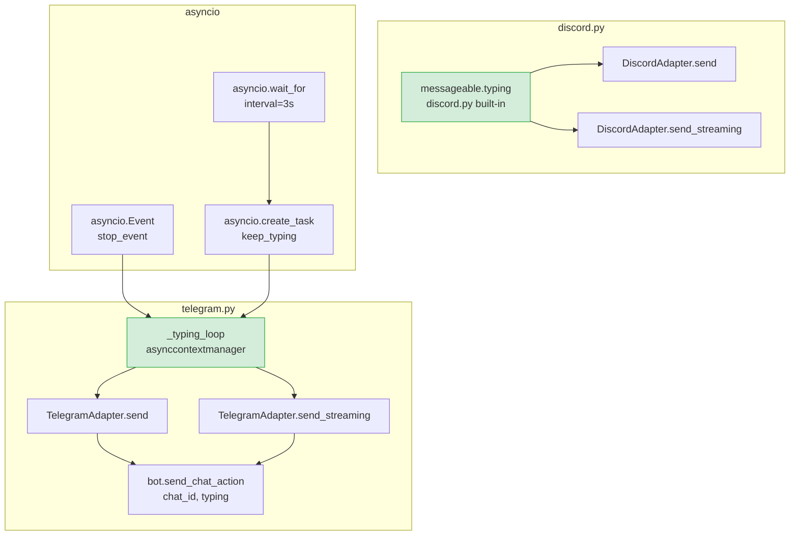
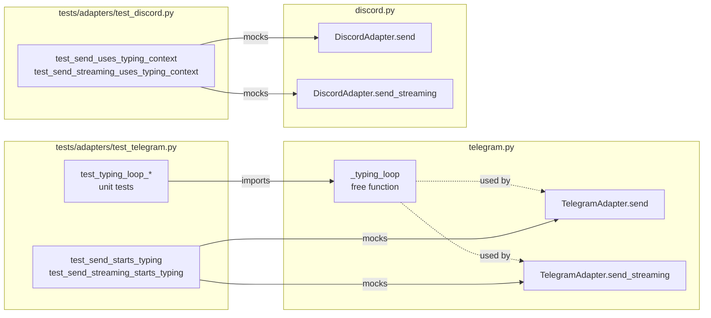

## Summary

Add a typing indicator to `TelegramAdapter` (via `_typing_loop` asynccontextmanager) and `DiscordAdapter` (via `discord.py` built-in `typing()`) by wrapping `send()` and `send_streaming()` in both adapters. No changes outside the two adapter files.

## Architecture





## Agents

| Agent | Tasks | Files |
|-------|-------|-------|
| backend-dev | T1.1, T1.2, T1.3, T2.1, T2.2 | `src/lyra/adapters/telegram.py`, `src/lyra/adapters/discord.py` |
| tester | T1.4, T1.5, T2.3 | `tests/adapters/test_telegram.py`, `tests/adapters/test_discord.py` |

## Consistency Report

- Covered: 8/8 success criteria
- SC1: T1.2, T1.3 (Telegram typing appears before reply)
- SC2: T1.4 (refresh every 3s tested)
- SC3: T1.5 (stops after send completes)
- SC4: T1.4 (exception cleanup via finally)
- SC5: T2.1, T2.2 (Discord typing appears)
- SC6: T2.3 (Discord context exits cleanly)
- SC7: no pyproject.toml changes
- SC8: all existing tests preserved (no signature changes)
- Untraced: none
- Exemptions: SC7 (dependency check) verified at commit time via pyproject.toml diff

## Micro-Tasks

### V1 — Telegram typing indicator

---

**T1.1** [RED] Add imports and `_typing_loop` context manager to telegram.py

- **File:** `src/lyra/adapters/telegram.py`
- **Phase:** RED
- **Agent:** backend-dev
- **Spec trace:** SC1, SC2, SC4
- **Slice:** V1
- **Difficulty:** 2
- **Time:** 5 min
- **Parallel:** N (foundation for T1.2, T1.3)

**Code shape:**
```python
# Add to imports (stdlib section):
import asyncio
from contextlib import asynccontextmanager

# Add as module-level free function, before TelegramAdapter class:
@asynccontextmanager
async def _typing_loop(
    bot: Any,
    chat_id: int,
    interval: float = 3.0,
) -> AsyncIterator[None]:
    """Send typing indicator immediately and refresh every *interval* seconds.

    Telegram expires the typing action after ~5s. The background task
    re-sends it every *interval* seconds until the context exits.
    stop_event.set() must precede task.cancel() for clean loop exit.
    """
    stop_event = asyncio.Event()
    try:
        await bot.send_chat_action(chat_id, "typing")
    except Exception:
        pass

    async def keep_typing() -> None:
        while not stop_event.is_set():
            try:
                await asyncio.wait_for(stop_event.wait(), timeout=interval)
                break
            except asyncio.TimeoutError:
                try:
                    await bot.send_chat_action(chat_id, "typing")
                except Exception:
                    pass

    task = asyncio.create_task(keep_typing())
    try:
        yield
    finally:
        stop_event.set()
        task.cancel()
        try:
            await task
        except asyncio.CancelledError:
            pass
```

**Verify:**
```bash
uv run python -c "from lyra.adapters.telegram import _typing_loop; print('ok')"
```
**Expected:** `ok`

---

**T1.2** [GREEN] Wrap `TelegramAdapter.send()` with `_typing_loop`

- **File:** `src/lyra/adapters/telegram.py`
- **Phase:** GREEN
- **Agent:** backend-dev
- **Spec trace:** SC1, SC3, SC4 (U1)
- **Slice:** V1
- **Difficulty:** 1
- **Time:** 3 min
- **Parallel:** N (depends on T1.1)

**Code shape** (insertion after `chat_id` validation, before content processing):
```python
async def send(self, original_msg: InboundMessage, outbound: OutboundMessage) -> None:
    ...
    chat_id: int | None = original_msg.platform_meta.get("chat_id")
    if chat_id is None:
        raise ValueError("platform_meta missing required key 'chat_id' for send()")

    async with _typing_loop(self.bot, chat_id):
        # Flatten content parts to plain text, escape and chunk
        text = outbound.to_text()
        ...  # rest of send body unchanged
```

**Verify:**
```bash
uv run ruff check src/lyra/adapters/telegram.py && uv run pyright src/lyra/adapters/telegram.py
```
**Expected:** no errors

---

**T1.3** [GREEN] Wrap `TelegramAdapter.send_streaming()` with `_typing_loop`

- **File:** `src/lyra/adapters/telegram.py`
- **Phase:** GREEN
- **Agent:** backend-dev
- **Spec trace:** SC1, SC2 (U2)
- **Slice:** V1
- **Difficulty:** 1
- **Time:** 3 min
- **Parallel:** N (depends on T1.1)

**Code shape** (insertion after `chat_id` validation):
```python
async def send_streaming(self, original_msg, chunks, outbound=None) -> None:
    ...
    chat_id: int | None = original_msg.platform_meta.get("chat_id")
    if chat_id is None:
        raise ValueError(...)

    async with _typing_loop(self.bot, chat_id):
        parts: list[str] = []
        # Send placeholder
        ...  # rest of send_streaming body unchanged
```

**Note:** Telegram platform cancels the typing indicator when the placeholder is sent — this is expected/by design. The indicator covers the pre-placeholder latency gap.

**Verify:**
```bash
uv run ruff check src/lyra/adapters/telegram.py && uv run pyright src/lyra/adapters/telegram.py
```
**Expected:** no errors

---

**T1.4** [GREEN] Unit tests for `_typing_loop`

- **File:** `tests/adapters/test_telegram.py`
- **Phase:** GREEN
- **Agent:** tester
- **Spec trace:** SC2, SC4
- **Slice:** V1
- **Difficulty:** 3
- **Time:** 8 min
- **Parallel:** Y (independent of T1.2, T1.3)

**Test cases:**
```python
# test_typing_loop_sends_immediately: bot.send_chat_action called on entry
# test_typing_loop_refreshes_after_interval: called again after interval
# test_typing_loop_cancels_on_exit: stop_event set, task cancelled in finally
# test_typing_loop_swallows_send_exception: send_chat_action raises → no propagation
# test_typing_loop_cancels_on_body_exception: body raises → finally still cancels loop
```

**Verify:**
```bash
uv run pytest tests/adapters/test_telegram.py -k "typing_loop" -v
```
**Expected:** 5 tests pass

---

**T1.5** [GREEN] Integration tests: `send()` and `send_streaming()` start typing indicator

- **File:** `tests/adapters/test_telegram.py`
- **Phase:** GREEN
- **Agent:** tester
- **Spec trace:** SC1, SC3
- **Slice:** V1
- **Difficulty:** 2
- **Time:** 5 min
- **Parallel:** Y (independent of T1.4)

**Test cases:**
```python
# test_send_calls_send_chat_action: mock bot.send_chat_action, call adapter.send(),
#   assert send_chat_action("typing") called with correct chat_id
# test_send_streaming_calls_send_chat_action: same for send_streaming()
```

**Verify:**
```bash
uv run pytest tests/adapters/test_telegram.py -k "chat_action or typing" -v
```
**Expected:** all pass

---

> 🔴 RED-GATE V1 — run before starting V2 (or in parallel with T2.x):
> ```bash
> uv run pytest tests/adapters/test_telegram.py -v
> ```
> All Telegram adapter tests must pass.

---

### V2 — Discord typing indicator

---

**T2.1** [GREEN] Wrap `DiscordAdapter.send()` with `messageable.typing()`

- **File:** `src/lyra/adapters/discord.py`
- **Phase:** GREEN
- **Agent:** backend-dev
- **Spec trace:** SC5, SC6 (U3)
- **Slice:** V2
- **Difficulty:** 1
- **Time:** 3 min
- **Parallel:** Y (independent of V1 tasks)

**Code shape** (insertion after `messageable` is resolved):
```python
messageable = await self._resolve_channel(send_to_id)

async with messageable.typing():
    text = outbound.to_text()
    ...  # rest of send body unchanged
```

**Note:** No new imports needed. `discord.py >= 2.0` exposes `typing()` on `discord.abc.Messageable`. Exception cleanup is guaranteed by discord.py's `finally` internally.

**Verify:**
```bash
uv run ruff check src/lyra/adapters/discord.py && uv run pyright src/lyra/adapters/discord.py
```
**Expected:** no errors

---

**T2.2** [GREEN] Wrap `DiscordAdapter.send_streaming()` with `messageable.typing()`

- **File:** `src/lyra/adapters/discord.py`
- **Phase:** GREEN
- **Agent:** backend-dev
- **Spec trace:** SC5, SC6 (U4)
- **Slice:** V2
- **Difficulty:** 1
- **Time:** 3 min
- **Parallel:** Y (independent of V1 tasks)

**Code shape** (insertion after `messageable` is resolved):
```python
messageable = await self._resolve_channel(send_to_id)

async with messageable.typing():
    parts: list[str] = []
    # Send placeholder
    ...  # rest of send_streaming body unchanged
```

**Note:** `messageable.typing()` continues refreshing even after the placeholder is sent — the indicator remains throughout the full streaming session (discord.py does not cancel on bot messages).

**Verify:**
```bash
uv run ruff check src/lyra/adapters/discord.py && uv run pyright src/lyra/adapters/discord.py
```
**Expected:** no errors

---

**T2.3** [GREEN] Tests: Discord `send()` and `send_streaming()` use typing context

- **File:** `tests/adapters/test_discord.py`
- **Phase:** GREEN
- **Agent:** tester
- **Spec trace:** SC5, SC6
- **Slice:** V2
- **Difficulty:** 2
- **Time:** 5 min
- **Parallel:** Y (independent of V1 tasks)

**Test cases:**
```python
# test_send_uses_typing_context: mock messageable.typing() as AsyncMock context manager,
#   call adapter.send(), assert typing() was entered
# test_send_streaming_uses_typing_context: same for send_streaming()
```

**Pattern (from existing tests):** use `MagicMock()` + `AsyncMock()` for channel, patch `_resolve_channel`.

**Verify:**
```bash
uv run pytest tests/adapters/test_discord.py -k "typing" -v
```
**Expected:** all pass

---

> 🔴 RED-GATE V2:
> ```bash
> uv run pytest tests/adapters/test_discord.py -v
> ```
> All Discord adapter tests must pass.

---

## Final Validation

```bash
uv run pytest tests/adapters/ -v
uv run ruff check src/lyra/adapters/telegram.py src/lyra/adapters/discord.py
uv run pyright src/lyra/adapters/telegram.py src/lyra/adapters/discord.py
```
