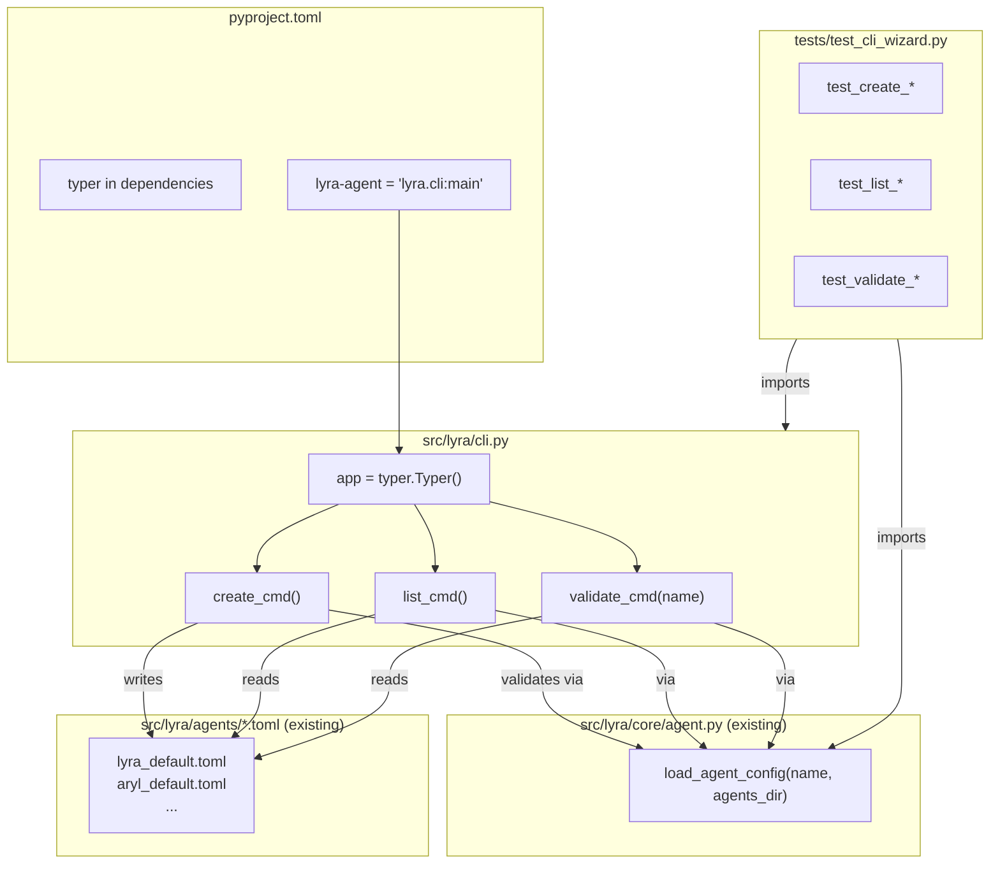
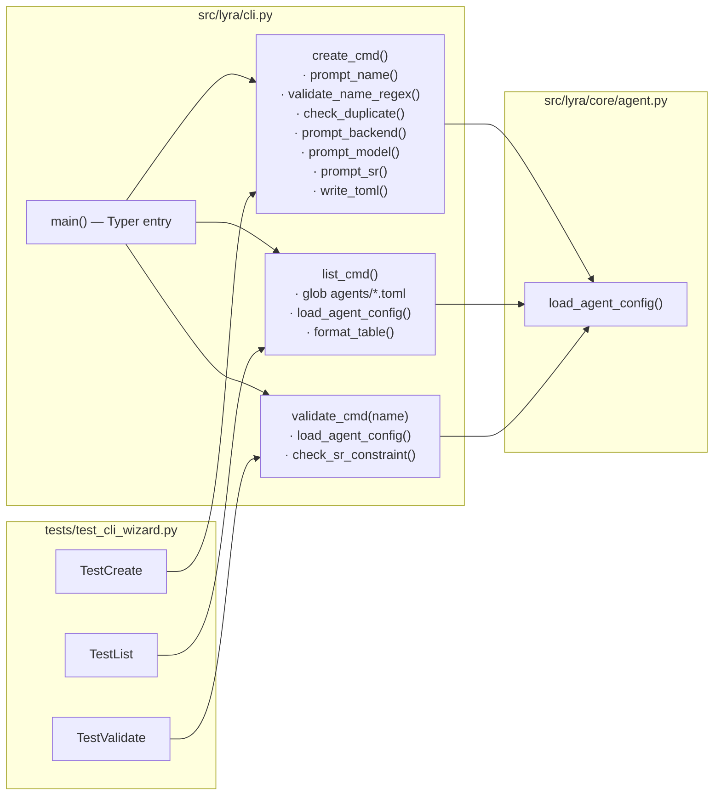

## Summary

Add `lyra-agent create | list | validate` CLI sub-commands via Typer. One new source file (`src/lyra/cli.py`), one new test file, one `pyproject.toml` change. `__main__.py` is untouched.

## Architecture





## Reference Patterns

- **Test fixture style:** `tests/core/test_agent.py` — `tmp_path` pytest fixture, `(tmp_path / "<name>.toml").write_text(toml_content)`, `load_agent_config(name, agents_dir=tmp_path)`
- **TOML template:** `src/lyra/agents/lyra_default.toml` — canonical section order (`[agent]` → `[model]` → `[agent.smart_routing]` → `[agent.smart_routing.models]` → `[plugins]`)

## Agents

| Agent | Task count | Files |
|-------|-----------|-------|
| devops | 1 | `pyproject.toml` |
| backend-dev | 8 | `src/lyra/cli.py` |
| tester | 6 | `tests/test_cli_wizard.py` |

## Consistency Report

- **Success criteria covered:** 16/16
- **Slices covered:** 3/3 (V1, V2, V3)
- **Uncovered criteria:** none
- **Untraced tasks:** none
- **Exemptions:** SC-2 (`python -m lyra` no regression) verified at RED-GATE V1 via shell check, not a dedicated unit test (no code changes to `__main__.py` so a unit test would be trivial)

---

## Micro-Tasks

### V1 — Create wizard

---

**T-001** `[devops]` `[P]` Add typer dependency + script entry to pyproject.toml
- **File:** `pyproject.toml`
- **Snippet:**
  ```toml
  dependencies = [
      ...
      "typer>=0.12",
  ]

  [project.scripts]
  lyra-agent = "lyra.cli:main"
  ```
- **Verify:** `uv sync && uv run lyra-agent --help`
- **Expected:** Typer help text, exit 0
- **Time:** 3 min
- **Parallel-safe:** Y
- **Spec trace:** SC-1, SC-3
- **Phase:** RED

---

**T-002** `[backend-dev]` Create `src/lyra/cli.py` with Typer app skeleton + `create` command stub
- **File:** `src/lyra/cli.py` (new)
- **Snippet:**
  ```python
  import typer
  from pathlib import Path

  app = typer.Typer(name="lyra-agent", help="Lyra agent management CLI.")

  @app.command()
  def create() -> None:
      """Interactive wizard to create a new agent TOML."""
      ...

  def main() -> None:
      app()
  ```
- **Verify:** `uv run lyra-agent create --help`
- **Expected:** `create` subcommand appears in help
- **Time:** 3 min
- **Parallel-safe:** N (T-001 must complete first for uv sync)
- **Spec trace:** SC-1, SC-3
- **Phase:** RED

---

**T-003** `[backend-dev]` Implement `create_cmd` — prompts, name validation, dir mkdir, TOML write
- **File:** `src/lyra/cli.py`
- **Snippet:**
  ```python
  import re, tomllib
  from lyra.core.agent import load_agent_config, _AGENTS_DIR

  _VALID_NAME = re.compile(r"^[a-zA-Z0-9_-]+$")
  _BACKENDS = ["claude-cli", "anthropic-sdk"]
  _MODELS = ["claude-haiku-4-5-20251001", "claude-sonnet-4-6", "claude-opus-4-6"]

  @app.command()
  def create(agents_dir: Path = _AGENTS_DIR) -> None:
      name = typer.prompt("Agent name")
      if not _VALID_NAME.match(name):
          typer.echo(f"Error: invalid name {name!r} — only [a-zA-Z0-9_-] allowed")
          raise typer.Exit(1)
      toml_path = agents_dir / f"{name}.toml"
      if toml_path.exists():
          typer.echo(f"Error: Agent '{name}' already exists at {toml_path}")
          raise typer.Exit(1)
      # ... (remaining prompts)
      agents_dir.mkdir(parents=True, exist_ok=True)
      toml_path.write_text(_render_toml(wizard_state))
      typer.echo(f"✅ Created {toml_path}")
      _print_next_steps(name)
  ```
- **Verify:** `uv run lyra-agent create` → fill prompts → file exists
- **Expected:** TOML file written, `load_agent_config(name, agents_dir)` raises no error
- **Time:** 10 min
- **Parallel-safe:** N (T-002 must exist)
- **Spec trace:** SC-4, SC-5, SC-6, SC-7, SC-8, SC-10
- **Phase:** GREEN

---

**T-004** `[backend-dev]` Add smart_routing constraint enforcement inside `create_cmd`
- **File:** `src/lyra/cli.py`
- **Snippet:**
  ```python
  sr_enabled = typer.confirm("Enable smart routing?", default=False)
  if sr_enabled and backend == "claude-cli":
      typer.echo("⚠ smart_routing requires backend=anthropic-sdk. Disabling smart_routing.")
      sr_enabled = False
  ```
- **Verify:** Run wizard with backend=`claude-cli`, enable SR → `⚠` warning, TOML has `enabled = false`
- **Expected:** Written TOML has `[agent.smart_routing] enabled = false`
- **Time:** 3 min
- **Parallel-safe:** N (inside T-003 implementation)
- **Spec trace:** SC-9
- **Phase:** GREEN

---

**T-005** `[backend-dev]` Implement `_render_toml()` — render wizard state to TOML string with correct section order
- **File:** `src/lyra/cli.py`
- **Snippet:**
  ```python
  def _render_toml(w: WizardState) -> str:
      lines = [
          "[agent]",
          f'name = "{w.name}"',
          f'memory_namespace = "{w.name}"',
          "permissions = []",
      ]
      if w.persona:
          lines.append(f'persona = "{w.persona}"')
      lines.append(f"show_intermediate = {str(w.show_intermediate).lower()}")
      lines += ["", "[model]", f'backend = "{w.backend}"', ...]
      # [agent.smart_routing], [agent.smart_routing.models], [plugins]
      return "\n".join(lines) + "\n"
  ```
- **Verify:** Parse output with `tomllib.loads()` — no error; `load_agent_config(name, agents_dir)` passes
- **Expected:** All sections present in correct order
- **Time:** 8 min
- **Parallel-safe:** N (part of T-003 scope)
- **Spec trace:** SC-5, TOML section mapping table
- **Phase:** GREEN

---

**T-006** `[tester]` `[P]` Write `tests/test_cli_wizard.py` — create happy-path test
- **File:** `tests/test_cli_wizard.py` (new)
- **Snippet:**
  ```python
  from typer.testing import CliRunner
  from lyra.cli import app
  from lyra.core.agent import load_agent_config

  runner = CliRunner()

  class TestCreate:
      def test_happy_path(self, tmp_path):
          result = runner.invoke(app, ["create"], input="my_agent\nclaude-cli\nclaude-sonnet-4-6\n\n10\ndefault\n\nN\nN\necho\n", catch_exceptions=False, env={"LYRA_AGENTS_DIR": str(tmp_path)})
          assert result.exit_code == 0
          agent = load_agent_config("my_agent", agents_dir=tmp_path)
          assert agent.name == "my_agent"
  ```
- **Verify:** `uv run pytest tests/test_cli_wizard.py::TestCreate::test_happy_path -v`
- **Expected:** PASSED
- **Time:** 8 min
- **Parallel-safe:** Y (new file)
- **Spec trace:** SC-4, SC-5
- **Phase:** RED

---

**T-007** `[tester]` `[P]` Test name validation, duplicate guard, dir creation, SR constraint
- **File:** `tests/test_cli_wizard.py`
- **Snippet:**
  ```python
  def test_invalid_name_rejected(self, tmp_path): ...
  def test_duplicate_name_exits_nonzero(self, tmp_path): ...
  def test_creates_agents_dir_if_missing(self, tmp_path): ...
  def test_sr_forced_off_on_claude_cli(self, tmp_path): ...
  ```
- **Verify:** `uv run pytest tests/test_cli_wizard.py::TestCreate -v`
- **Expected:** all PASSED
- **Time:** 8 min
- **Parallel-safe:** Y
- **Spec trace:** SC-6, SC-7, SC-8, SC-9
- **Phase:** GREEN

---

⛔ **RED-GATE V1** — All V1 tasks must pass before V2 begins.

Verify commands:
```bash
uv run pytest tests/test_cli_wizard.py::TestCreate -v        # all pass
uv run lyra-agent create                                      # happy path manual check
python -m lyra --help 2>&1 | grep -v "lyra-agent"            # no regression in server entry
```

---

### V2 — List agents

---

**T-008** `[backend-dev]` Implement `list_cmd` — glob, load, format plain-text table
- **File:** `src/lyra/cli.py`
- **Snippet:**
  ```python
  @app.command("list")
  def list_cmd(agents_dir: Path = _AGENTS_DIR) -> None:
      """List all registered agents."""
      header = f"{'NAME':<20} {'BACKEND':<15} {'MODEL':<35} {'SMART ROUTING'}"
      typer.echo(header)
      if not agents_dir.exists():
          return
      for toml_path in sorted(agents_dir.glob("*.toml")):
          name = toml_path.stem
          try:
              cfg = load_agent_config(name, agents_dir=agents_dir)
          except Exception:
              continue
          sr = "enabled" if (cfg.smart_routing and cfg.smart_routing.enabled) else "disabled"
          typer.echo(f"{cfg.name:<20} {cfg.model_config.backend:<15} {cfg.model_config.model:<35} {sr}")
  ```
- **Verify:** `uv run lyra-agent list`
- **Expected:** Table with all agents in `src/lyra/agents/`
- **Time:** 5 min
- **Parallel-safe:** N (T-002 must exist)
- **Spec trace:** SC-11, SC-12
- **Phase:** RED + GREEN (single atomic task)

---

**T-009** `[tester]` `[P]` Tests for list: populated dir, empty dir, absent dir
- **File:** `tests/test_cli_wizard.py`
- **Snippet:**
  ```python
  class TestList:
      def test_lists_agents(self, tmp_path): ...      # 1 toml → 1 row
      def test_empty_dir_exits_zero(self, tmp_path): ...
      def test_absent_dir_exits_zero(self, tmp_path): ...
  ```
- **Verify:** `uv run pytest tests/test_cli_wizard.py::TestList -v`
- **Expected:** all PASSED
- **Time:** 5 min
- **Parallel-safe:** Y
- **Spec trace:** SC-11, SC-12
- **Phase:** GREEN

---

⛔ **RED-GATE V2**

```bash
uv run pytest tests/test_cli_wizard.py::TestList -v
uv run lyra-agent list                              # shows real agents
```

---

### V3 — Validate agent

---

**T-010** `[backend-dev]` Implement `validate_cmd` — hard errors (non-zero) + soft warnings (exit 0)
- **File:** `src/lyra/cli.py`
- **Snippet:**
  ```python
  import sys, tomllib

  @app.command()
  def validate(name: str, agents_dir: Path = _AGENTS_DIR) -> None:
      """Validate an agent TOML (schema + constraint checks)."""
      typer.echo(f"Validating {name}...")
      try:
          cfg = load_agent_config(name, agents_dir=agents_dir)
      except FileNotFoundError as e:
          typer.echo(f"Error: {e}")
          raise typer.Exit(1)
      except (ValueError, tomllib.TOMLDecodeError) as e:
          typer.echo(f"Error: schema error — {e}")
          raise typer.Exit(1)
      typer.echo("✅ Schema: OK")
      # Soft constraint check
      if cfg.smart_routing and cfg.smart_routing.enabled and cfg.model_config.backend != "anthropic-sdk":
          typer.echo(f"⚠ smart_routing.enabled=true but backend={cfg.model_config.backend!r} — smart routing will be ignored at runtime")
      else:
          typer.echo(f"✅ smart_routing: backend={cfg.model_config.backend!r} — constraint satisfied")
  ```
- **Verify:** All 4 validate scenarios (valid, sr+cli, nonexistent, invalid TOML)
- **Expected:** exit 0 for valid + warning; non-zero for errors
- **Time:** 5 min
- **Parallel-safe:** N (T-002 must exist)
- **Spec trace:** SC-13, SC-14, SC-15, SC-16
- **Phase:** RED + GREEN

---

**T-011** `[tester]` `[P]` Tests for validate: valid, sr+cli warning, nonexistent, invalid TOML
- **File:** `tests/test_cli_wizard.py`
- **Snippet:**
  ```python
  class TestValidate:
      def test_valid_agent_exits_zero(self, tmp_path): ...
      def test_sr_cli_mismatch_warns_exits_zero(self, tmp_path): ...
      def test_nonexistent_exits_nonzero(self, tmp_path): ...
      def test_invalid_toml_exits_nonzero(self, tmp_path): ...
  ```
- **Verify:** `uv run pytest tests/test_cli_wizard.py::TestValidate -v`
- **Expected:** all PASSED
- **Time:** 5 min
- **Parallel-safe:** Y
- **Spec trace:** SC-13, SC-14, SC-15, SC-16
- **Phase:** GREEN

---

⛔ **RED-GATE V3 (final)**

```bash
uv run pytest tests/test_cli_wizard.py -v           # all 15+ tests pass
uv run lyra-agent validate lyra_default              # ✅ exit 0
uv run lyra-agent validate nonexistent               # Error: not found, exit 1
uv run lyra-agent --help                             # usage, exit 0 (no server start)
python -m lyra --help 2>&1 | head -3                 # no regression
```
