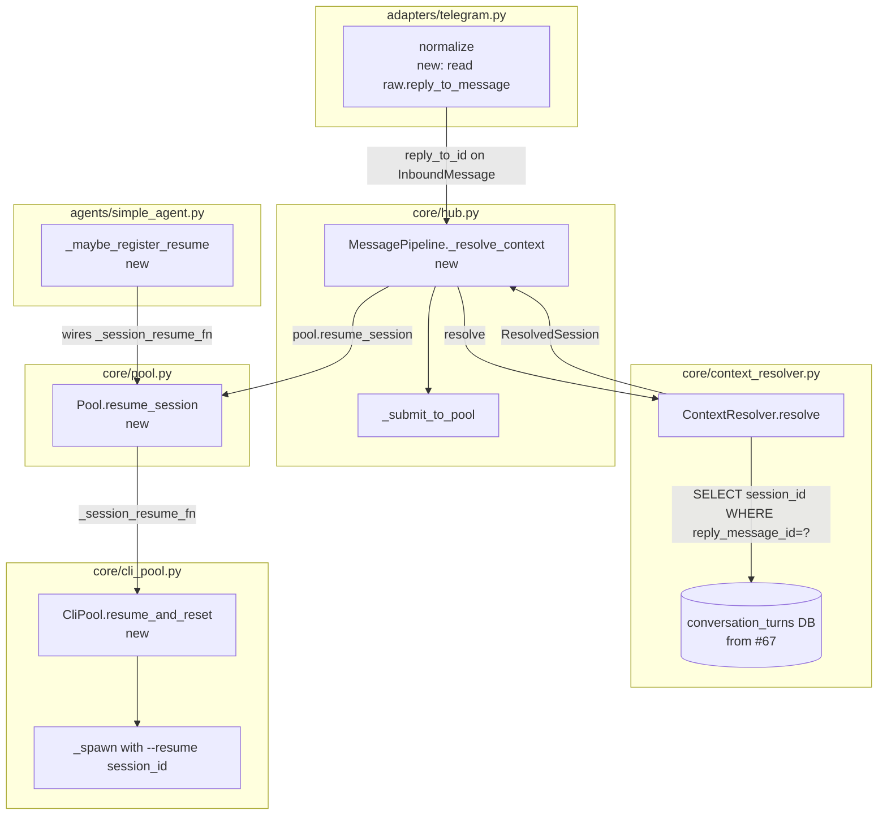
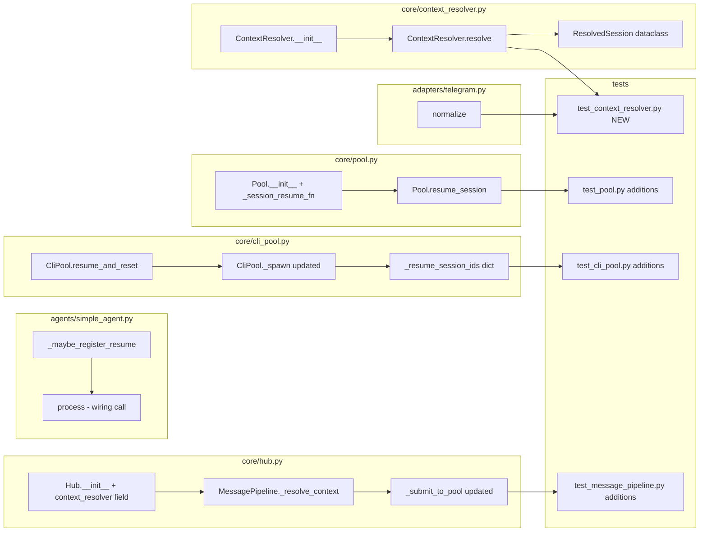

## Summary

Implement reply-to-resume in 4 vertical slices: (1) capture `reply_to_id` in the Telegram adapter, (2) add `ContextResolver` for DB lookup, (3) add `resume_session()` to the Pool/CliPool layer, (4) wire context resolution into the hub pipeline. All slices can be built and tested now — the feature activates automatically at runtime when #83 → #67 populate `conversation_turns`.

## Architecture





## Agents

| Agent | Tasks | Files |
|-------|-------|-------|
| backend-dev | T1.1, T2.1, T2.2, T3.1, T3.2, T3.3, T4.1, T4.2, T4.3 | telegram.py, context_resolver.py (new), pool.py, cli_pool.py, simple_agent.py, hub.py |
| tester | T2.3, T3.4, T4.4 | test_context_resolver.py (new), test_pool.py, test_cli_pool.py, test_message_pipeline.py |

## Reference Patterns

- `src/lyra/core/pairing.py` — aiosqlite open/query/close pattern; graceful table creation
- `src/lyra/agents/simple_agent.py:102–116` — `_maybe_register_reset()` pattern for lazy callback wiring
- `src/lyra/core/cli_pool.py:206–210` — `_cwd_overrides` one-shot dict pattern for `resume_and_reset`
- `src/lyra/adapters/telegram.py:404–479` — `normalize()` structure to locate where to add `reply_to_message` read

## Consistency Report

| Criteria | Trace | Status |
|---------|-------|--------|
| SC-1: reply_to_id set in normalize | T1.1 | ✓ |
| SC-2: ContextResolver match returns ResolvedSession | T2.1, T2.2 | ✓ |
| SC-3: ContextResolver returns None on missing DB | T2.2 | ✓ |
| SC-4: Pool.resume_session delegates via _session_resume_fn | T3.1 | ✓ |
| SC-5: CliPool.resume_and_reset sets next spawn to --resume | T3.2 | ✓ |
| SC-6: Non-reply messages unaffected | T4.2, T4.4 | ✓ |
| SC-7: Cross-pool resume rejected | T4.2, T4.4 | ✓ |
| SC-8: Busy pool skips resume | T4.2, T4.4 | ✓ |
| SC-9: Fallback transparent to user | T4.2, T4.4 | ✓ |
| SC-10: Slices 1-3 testable without #67 | T2.3, T3.4 | ✓ |

Covered: 10/10 | Uncovered: 0 | Untraced: 0

---

## Micro-Tasks

### V1 — Adapter: capture reply_to_id

**T1.1** — Read `raw.reply_to_message` in `TelegramAdapter.normalize()`
- **File:** `src/lyra/adapters/telegram.py`
- **Snippet:**
  ```python
  # After: attachments = _extract_attachments(raw)
  message_id = getattr(raw, "message_id", None)
  reply_to_message = getattr(raw, "reply_to_message", None)
  reply_to_id = (
      str(reply_to_message.message_id)
      if reply_to_message is not None
      else None
  )
  ```
  Then pass `reply_to_id=reply_to_id` to `InboundMessage(...)`.
- **Verify:** `uv run pytest tests/adapters/test_telegram.py -k reply_to`
- **Expected:** new test for reply_to_id passes; existing normalize tests unchanged
- **Time:** 5 min | **Agent:** backend-dev | **SC trace:** SC-1 | **Phase:** GREEN | **[P]:** Y

---

### V2 — ContextResolver

**T2.1** — Create `context_resolver.py` with `ResolvedSession` and `ContextResolver` skeleton
- **File:** `src/lyra/core/context_resolver.py` (new)
- **Snippet:**
  ```python
  from __future__ import annotations
  from dataclasses import dataclass
  from pathlib import Path
  import logging
  import aiosqlite

  log = logging.getLogger(__name__)

  @dataclass(frozen=True)
  class ResolvedSession:
      session_id: str
      pool_id: str

  class ContextResolver:
      def __init__(self, db_path: Path) -> None:
          self._db_path = db_path

      async def resolve(self, reply_to_id: str) -> ResolvedSession | None:
          ...
  ```
- **Verify:** `uv run python -c "from lyra.core.context_resolver import ContextResolver, ResolvedSession"`
- **Expected:** import succeeds
- **Time:** 5 min | **Agent:** backend-dev | **SC trace:** SC-2 | **Phase:** RED | **[P]:** N

**T2.2** — Implement `ContextResolver.resolve()` with aiosqlite + graceful handling
- **File:** `src/lyra/core/context_resolver.py`
- **Snippet:**
  ```python
  async def resolve(self, reply_to_id: str) -> ResolvedSession | None:
      if not self._db_path.exists():
          return None
      try:
          async with aiosqlite.connect(str(self._db_path)) as db:
              async with db.execute(
                  "SELECT session_id, pool_id FROM conversation_turns"
                  " WHERE reply_message_id = ? LIMIT 1",
                  (reply_to_id,),
              ) as cursor:
                  row = await cursor.fetchone()
                  if row is None:
                      return None
                  return ResolvedSession(session_id=row[0], pool_id=row[1])
      except Exception:
          log.debug("ContextResolver.resolve failed for reply_to_id=%r", reply_to_id, exc_info=True)
          return None
  ```
- **Verify:** `uv run pytest tests/core/test_context_resolver.py`
- **Expected:** all ContextResolver tests pass
- **Time:** 8 min | **Agent:** backend-dev | **SC trace:** SC-2, SC-3 | **Phase:** GREEN | **[P]:** N

**T2.3** — Unit tests for `ContextResolver`
- **File:** `tests/core/test_context_resolver.py` (new)
- **Snippet:**
  ```python
  import pytest, aiosqlite
  from pathlib import Path
  from lyra.core.context_resolver import ContextResolver, ResolvedSession

  @pytest.fixture
  async def db_with_turn(tmp_path):
      db_path = tmp_path / "vault.db"
      async with aiosqlite.connect(str(db_path)) as db:
          await db.execute(
              "CREATE TABLE conversation_turns"
              " (id INTEGER PRIMARY KEY, pool_id TEXT, session_id TEXT,"
              " role TEXT, platform TEXT, user_id TEXT, content TEXT,"
              " message_id TEXT, reply_message_id TEXT, timestamp TEXT)"
          )
          await db.execute(
              "INSERT INTO conversation_turns VALUES (1,'pool:tg:main','sess-abc',"
              "'assistant','telegram','u1','hi',NULL,'tg-msg-42','2026-01-01T00:00:00Z')"
          )
          await db.commit()
      return db_path

  async def test_resolve_hit(db_with_turn):
      resolver = ContextResolver(db_with_turn)
      result = await resolver.resolve("tg-msg-42")
      assert result == ResolvedSession(session_id="sess-abc", pool_id="pool:tg:main")

  async def test_resolve_miss(db_with_turn):
      resolver = ContextResolver(db_with_turn)
      assert await resolver.resolve("nonexistent") is None

  async def test_resolve_no_db(tmp_path):
      resolver = ContextResolver(tmp_path / "missing.db")
      assert await resolver.resolve("any") is None

  async def test_resolve_no_table(tmp_path):
      db_path = tmp_path / "empty.db"
      async with aiosqlite.connect(str(db_path)) as db:
          await db.execute("CREATE TABLE other (id INTEGER PRIMARY KEY)")
          await db.commit()
      resolver = ContextResolver(db_path)
      assert await resolver.resolve("any") is None
  ```
- **Verify:** `uv run pytest tests/core/test_context_resolver.py -v`
- **Expected:** 4 tests pass
- **Time:** 8 min | **Agent:** tester | **SC trace:** SC-2, SC-3, SC-10 | **Phase:** GREEN | **[P]:** Y

**🔴 RED-GATE V2→V3:** `uv run pytest tests/core/test_context_resolver.py` must pass before V3.

---

### V3 — Pool handoff API

**T3.1** — Add `_session_resume_fn` + `resume_session()` to `Pool`
- **File:** `src/lyra/core/pool.py`
- **Snippet:**
  ```python
  # In Pool.__init__:
  self._session_resume_fn: Callable[[str], Awaitable[None]] | None = None

  # New method:
  async def resume_session(self, session_id: str) -> None:
      """Resume a specific Claude session. No-op for SDK-backed pools."""
      if self._session_resume_fn is not None:
          await self._session_resume_fn(session_id)
  ```
- **Verify:** `uv run pytest tests/core/test_pool.py`
- **Expected:** existing tests pass; new resume_session test passes
- **Time:** 5 min | **Agent:** backend-dev | **SC trace:** SC-4 | **Phase:** RED | **[P]:** N

**T3.2** — Add `_resume_session_ids` + `resume_and_reset()` to `CliPool`; update `_spawn()`
- **File:** `src/lyra/core/cli_pool.py`
- **Snippet:**
  ```python
  # In CliPool.__init__:
  self._resume_session_ids: dict[str, str] = {}

  # New method:
  async def resume_and_reset(self, pool_id: str, session_id: str) -> None:
      """Kill process; next _spawn() will use --resume <session_id>."""
      await self._kill(pool_id)
      self._resume_session_ids[pool_id] = session_id
      log.info("[pool:%s] resume_and_reset: next spawn will use --resume %s", pool_id, session_id)

  # In _spawn(), replace:
  #   cmd = self._build_cmd(model_config, system_prompt=system_prompt)
  # with:
  resume_session_id = self._resume_session_ids.pop(pool_id, None)
  cmd = self._build_cmd(model_config, session_id=resume_session_id, system_prompt=system_prompt)
  ```
- **Verify:** `uv run pytest tests/core/test_cli_pool.py`
- **Expected:** existing tests pass; new resume_and_reset test passes
- **Time:** 8 min | **Agent:** backend-dev | **SC trace:** SC-5 | **Phase:** GREEN | **[P]:** N

**T3.3** — Add `_maybe_register_resume()` to `SimpleAgent`
- **File:** `src/lyra/agents/simple_agent.py`
- **Snippet:**
  ```python
  def _maybe_register_resume(self, pool: Pool) -> None:
      """Register session resume callback on the pool the first time we process.

      Hub calls pool.resume_session(session_id) → delegates here → CliPool.resume_and_reset().
      """
      if pool._session_resume_fn is None:
          resume_fn = getattr(self._provider, "resume_and_reset", None)
          if resume_fn is not None:
              _pool_id = pool.pool_id
              pool._session_resume_fn = lambda sid: resume_fn(_pool_id, sid)
  ```
  Call `self._maybe_register_resume(pool)` alongside `self._maybe_register_reset(pool)` inside `process()`.
- **Verify:** `uv run pytest tests/core/test_agent.py`
- **Expected:** existing tests pass
- **Time:** 5 min | **Agent:** backend-dev | **SC trace:** SC-4, SC-5 | **Phase:** GREEN | **[P]:** N

**T3.4** — Tests: `Pool.resume_session()` + `CliPool.resume_and_reset()`
- **Files:** `tests/core/test_pool.py`, `tests/core/test_cli_pool.py`
- **Snippets:**
  ```python
  # test_pool.py addition
  async def test_resume_session_calls_fn():
      called_with = []
      pool = Pool("p1", "agent", ctx=make_mock_ctx())
      pool._session_resume_fn = lambda sid: called_with.append(sid) or asyncio.sleep(0)
      await pool.resume_session("sess-xyz")
      assert called_with == ["sess-xyz"]

  async def test_resume_session_noop_when_fn_none():
      pool = Pool("p1", "agent", ctx=make_mock_ctx())
      await pool.resume_session("sess-xyz")  # must not raise

  # test_cli_pool.py addition
  async def test_resume_and_reset_sets_session_id(cli_pool_fixture):
      await cli_pool_fixture.resume_and_reset("pool:tg:chat:1", "sess-abc")
      # _resume_session_ids set
      assert cli_pool_fixture._resume_session_ids.get("pool:tg:chat:1") == "sess-abc"
  ```
- **Verify:** `uv run pytest tests/core/test_pool.py tests/core/test_cli_pool.py`
- **Expected:** all existing + new tests pass
- **Time:** 8 min | **Agent:** tester | **SC trace:** SC-4, SC-5, SC-10 | **Phase:** GREEN | **[P]:** Y

**🔴 RED-GATE V3→V4:** `uv run pytest tests/core/test_pool.py tests/core/test_cli_pool.py tests/core/test_agent.py` must pass before V4.

---

### V4 — Hub pipeline wiring

**T4.1** — Add `ContextResolver` field to `Hub.__init__()`
- **File:** `src/lyra/core/hub.py`
- **Snippet:**
  ```python
  # Import:
  from .context_resolver import ContextResolver

  # In Hub.__init__() signature:
  context_resolver: ContextResolver | None = None,

  # In Hub.__init__() body:
  self._context_resolver = context_resolver
  ```
- **Verify:** `uv run python -c "from lyra.core.hub import Hub; h = Hub(); print('ok')"`
- **Expected:** Hub instantiates cleanly with no context_resolver (None default)
- **Time:** 5 min | **Agent:** backend-dev | **SC trace:** SC-6 | **Phase:** RED | **[P]:** N

**T4.2** — Add `_resolve_context()` to `MessagePipeline`
- **File:** `src/lyra/core/hub.py`
- **Snippet:**
  ```python
  async def _resolve_context(self, msg: InboundMessage, pool: Pool, pool_id: str) -> None:
      """Attempt to resume old session when msg is a reply-to. No-op on any failure."""
      if msg.reply_to_id is None:
          return
      resolver = self._hub._context_resolver
      if resolver is None:
          return
      resolved = await resolver.resolve(msg.reply_to_id)
      if resolved is None:
          return
      if resolved.pool_id != pool_id:
          log.info(
              "reply-to-resume: cross-pool mismatch (resolved=%r current=%r) — skipping",
              resolved.pool_id, pool_id,
          )
          return
      if not pool.is_idle:
          log.info(
              "reply-to-resume: pool %r busy — skipping resume of session %r",
              pool_id, resolved.session_id,
          )
          return
      log.info(
          "reply-to-resume: resuming session %r for pool %r",
          resolved.session_id, pool_id,
      )
      await pool.resume_session(resolved.session_id)
  ```
- **Verify:** `uv run python -c "from lyra.core.hub import MessagePipeline; print('ok')"`
- **Expected:** import succeeds
- **Time:** 8 min | **Agent:** backend-dev | **SC trace:** SC-6, SC-7, SC-8, SC-9 | **Phase:** GREEN | **[P]:** N

**T4.3** — Call `_resolve_context()` in `_submit_to_pool()`
- **File:** `src/lyra/core/hub.py`
- **Snippet:**
  ```python
  async def _submit_to_pool(self, msg, pool, key) -> PipelineResult:
      if (key.platform, msg.bot_id) not in self._hub.adapter_registry:
          ...
          return _DROP
      if await self._hub._circuit_breaker_drop(msg):
          return _DROP
      # NEW: attempt context-aware session resume before submit
      await self._resolve_context(msg, pool, pool.pool_id)
      return PipelineResult(action=Action.SUBMIT_TO_POOL, pool=pool)
  ```
- **Verify:** `uv run pytest tests/core/test_message_pipeline.py`
- **Expected:** existing pipeline tests pass
- **Time:** 5 min | **Agent:** backend-dev | **SC trace:** SC-6 | **Phase:** GREEN | **[P]:** N

**T4.4** — Integration tests: reply→resume + all fallback paths
- **File:** `tests/core/test_message_pipeline.py`
- **Snippet:**
  ```python
  # Stub ContextResolver that returns a canned ResolvedSession
  class _StubResolver:
      def __init__(self, result): self._result = result
      async def resolve(self, _): return self._result

  async def test_reply_to_resume_calls_pool_resume(make_hub, make_inbound):
      resolved = ResolvedSession(session_id="sess-1", pool_id="telegram:main:chat:42")
      hub = make_hub(context_resolver=_StubResolver(resolved))
      pool = hub.get_or_create_pool("telegram:main:chat:42", "agent")
      resumed = []
      pool._session_resume_fn = lambda sid: resumed.append(sid) or asyncio.sleep(0)
      msg = make_inbound(scope_id="chat:42", reply_to_id="tg-msg-99")
      pipeline = MessagePipeline(hub)
      await pipeline._resolve_context(msg, pool, pool.pool_id)
      assert resumed == ["sess-1"]

  async def test_no_resume_when_reply_to_id_none(make_hub, make_inbound):
      ...  # resolver never called

  async def test_no_resume_on_cross_pool(make_hub, make_inbound):
      ...  # resolved.pool_id != current pool_id → skipped

  async def test_no_resume_when_pool_busy(make_hub, make_inbound):
      ...  # pool.is_idle == False → skipped
  ```
- **Verify:** `uv run pytest tests/core/test_message_pipeline.py -v`
- **Expected:** all existing + 4 new tests pass
- **Time:** 10 min | **Agent:** tester | **SC trace:** SC-6, SC-7, SC-8, SC-9, SC-10 | **Phase:** GREEN | **[P]:** Y
