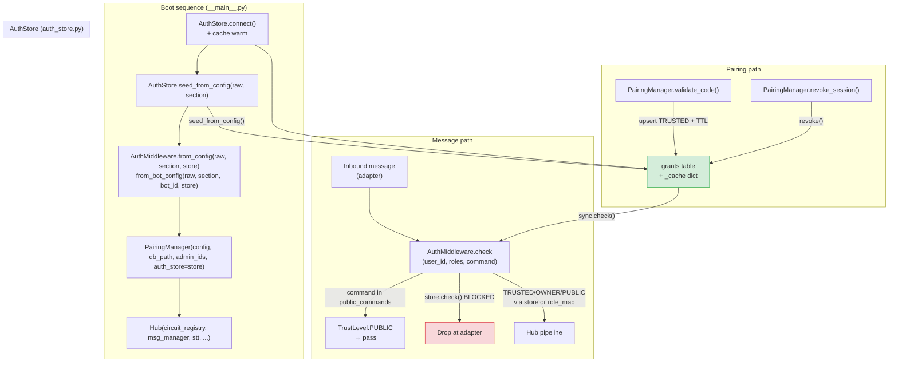
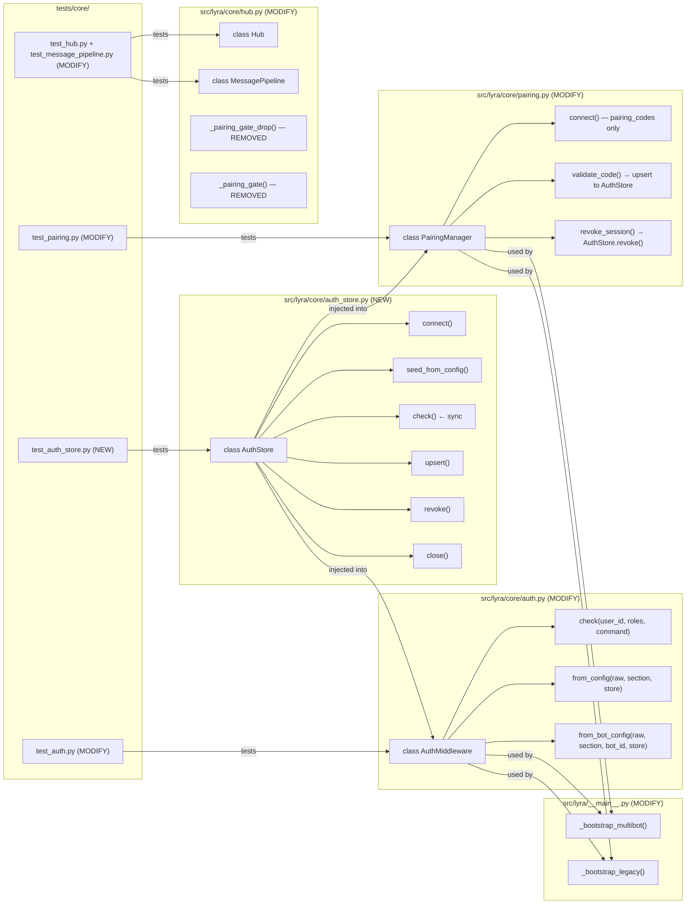

## Summary

Introduce `AuthStore` (SQLite + write-through in-memory cache) as the single source of truth for user-level grants, replacing the in-memory `user_map` dict in `AuthMiddleware` and the `paired_sessions` table in `PairingManager`. Five sequential slices; hub pairing gate removed once `AuthStore` write path is verified end-to-end.

## Architecture





## Agents

| Agent | Task Count | Files |
|-------|-----------|-------|
| backend-dev | 18 | auth_store.py, auth.py, pairing.py, hub.py, __main__.py |
| tester | 11 | test_auth_store.py, test_auth.py, test_pairing.py, test_hub.py, test_message_pipeline.py |

## Consistency Report

| Spec criterion | Covered by tasks |
|----------------|-----------------|
| SC-1: grants table with UNIQUE + WAL | T01, T02 |
| SC-2: cache warm on connect | T03 |
| SC-3: seed_from_config, no permanent downgrade | T04, T05 |
| SC-4: public_commands bypass | T07, T08 |
| SC-5: check() returns seeded trust | T06, T08 |
| SC-6: validate_code upserts TRUSTED + paired user passes | T12, T13 |
| SC-7: paired_sessions not created/queried | T11 |
| SC-8: _pairing_gate_drop + _pairing_gate removed | T14, T15 |
| SC-9: revoke() True/False + eviction | T09, T10 |
| SC-10: close() in shutdown | T17 |
| SC-11: existing tests pass; new tests cover 4 cases | T20–T29 |

Uncovered: none. Untraced: none.

---

## Micro-Tasks

---

### SLICE S1 — AuthStore class

---

**T01** `[P: N]` — Create `grants` DDL + `connect()`
- **File:** `src/lyra/core/auth_store.py`
- **Agent:** backend-dev
- **Phase:** RED
- **Slice:** S1
- **Spec trace:** SC-1, U1
- **Difficulty:** 2
- **Time:** 5 min
- **Description:** Create `auth_store.py` with `AuthStore` class. `connect()` opens aiosqlite, executes WAL pragma and `CREATE TABLE IF NOT EXISTS grants` DDL with `UNIQUE` on `identity_key`, then loads all non-expired rows into `self._cache: dict[str, tuple[TrustLevel, datetime | None]]`.
- **Code shape:**
```python
_CREATE_GRANTS = """
CREATE TABLE IF NOT EXISTS grants (
    id           INTEGER PRIMARY KEY,
    identity_key TEXT NOT NULL UNIQUE,
    trust_level  TEXT NOT NULL,
    expires_at   TEXT,
    granted_by   TEXT NOT NULL,
    source       TEXT NOT NULL,
    created_at   TEXT NOT NULL DEFAULT (datetime('now'))
)
"""

class AuthStore:
    def __init__(self, db_path: str | Path, default: TrustLevel = TrustLevel.PUBLIC) -> None:
        self._db_path = str(db_path)
        self._default = default
        self._cache: dict[str, tuple[TrustLevel, datetime | None]] = {}
        self._db: aiosqlite.Connection | None = None

    async def connect(self) -> None:
        self._db = await aiosqlite.connect(self._db_path)
        await self._db.execute("PRAGMA journal_mode=WAL")
        await self._db.execute(_CREATE_GRANTS)
        await self._db.commit()
        await self._warm_cache()

    async def _warm_cache(self) -> None:
        now_iso = _utc_now().isoformat()
        async with self._db.execute(
            "SELECT identity_key, trust_level, expires_at FROM grants "
            "WHERE expires_at IS NULL OR expires_at > ?", (now_iso,)
        ) as cur:
            async for row in cur:
                self._cache[row[0]] = (TrustLevel(row[1]), ...)
```
- **Verify:** `uv run pytest tests/core/test_auth_store.py::TestAuthStoreConnect -x`
- **Expected output:** `1 passed`

---

**T02** `[P: N]` — Implement `check()` (sync cache lookup + lazy expiry evict)
- **File:** `src/lyra/core/auth_store.py`
- **Agent:** backend-dev
- **Phase:** RED
- **Slice:** S1
- **Spec trace:** SC-2, U1
- **Difficulty:** 2
- **Time:** 4 min
- **Description:** `check(identity_key)` reads `self._cache`. On hit: if `expires_at` is not None and `_utc_now() > expires_at`, schedule eviction (DB delete + cache pop) as a fire-and-forget coroutine via `asyncio.ensure_future`, return `self._default`. On non-expired hit: return the cached `TrustLevel`. On miss: return `self._default`. Keep the method synchronous (no `await`).
- **Code shape:**
```python
def check(self, identity_key: str) -> TrustLevel:
    entry = self._cache.get(identity_key)
    if entry is None:
        return self._default
    trust, expires_at = entry
    if expires_at is not None and _utc_now() > expires_at:
        asyncio.ensure_future(self._evict(identity_key))
        return self._default
    return trust
```
- **Verify:** `uv run pytest tests/core/test_auth_store.py::TestAuthStoreCheck -x`
- **Expected output:** `passed`

---

**T03** `[P: N]` — Implement `upsert()` and `revoke()`
- **File:** `src/lyra/core/auth_store.py`
- **Agent:** backend-dev
- **Phase:** RED
- **Slice:** S1
- **Spec trace:** SC-9, U1
- **Difficulty:** 2
- **Time:** 4 min
- **Description:** `upsert(identity_key, trust_level, expires_at, granted_by, source)` writes to DB with `ON CONFLICT(identity_key) DO UPDATE SET trust_level=excluded.trust_level, expires_at=excluded.expires_at, granted_by=excluded.granted_by, source=excluded.source` then updates `self._cache`. `revoke(identity_key)` deletes from DB, pops from cache, returns `True` if existed else `False`.
- **Code shape:**
```python
async def upsert(self, identity_key: str, trust_level: TrustLevel,
                 expires_at: datetime | None, granted_by: str, source: str) -> None:
    exp_iso = expires_at.isoformat() if expires_at else None
    await self._db.execute(
        "INSERT INTO grants (identity_key, trust_level, expires_at, granted_by, source) "
        "VALUES (?, ?, ?, ?, ?) "
        "ON CONFLICT(identity_key) DO UPDATE SET "
        "trust_level=excluded.trust_level, expires_at=excluded.expires_at, "
        "granted_by=excluded.granted_by, source=excluded.source",
        (identity_key, trust_level.value, exp_iso, granted_by, source),
    )
    await self._db.commit()
    self._cache[identity_key] = (trust_level, expires_at)

async def revoke(self, identity_key: str) -> bool:
    async with self._db.execute(
        "SELECT id FROM grants WHERE identity_key = ?", (identity_key,)
    ) as cur:
        row = await cur.fetchone()
    if row is None:
        return False
    await self._db.execute("DELETE FROM grants WHERE identity_key = ?", (identity_key,))
    await self._db.commit()
    self._cache.pop(identity_key, None)
    return True
```
- **Verify:** `uv run pytest tests/core/test_auth_store.py::TestAuthStoreUpsertRevoke -x`
- **Expected output:** `passed`

---

**T04** `[P: N]` — Implement `seed_from_config()` with permanent-grant conflict rule
- **File:** `src/lyra/core/auth_store.py`
- **Agent:** backend-dev
- **Phase:** RED
- **Slice:** S1
- **Spec trace:** SC-3, U1
- **Difficulty:** 2
- **Time:** 4 min
- **Description:** `seed_from_config(raw, section)` reads `auth_block[section]` (or `auth_block[f"{section}_bots"]` — flat section only). For each `owner_users` entry upsert with `TrustLevel.OWNER`, `expires_at=None`, `granted_by="config"`, `source="config.toml"`. For `trusted_users` upsert `TrustLevel.TRUSTED`. Conflict rule: use `ON CONFLICT DO UPDATE SET ... WHERE grants.expires_at IS NOT NULL` — only update if the existing grant is not permanent (i.e., do not downgrade a permanent config grant with a pairing grant, and do not re-overwrite on re-seed).
- **Code shape:**
```python
async def seed_from_config(self, raw: dict, section: str) -> None:
    auth_block = raw.get("auth", {})
    section_cfg = auth_block.get(section)
    if section_cfg is None:
        return
    entries: list[tuple[str, TrustLevel]] = []
    for uid in section_cfg.get("owner_users", []):
        entries.append((str(uid), TrustLevel.OWNER))
    for uid in section_cfg.get("trusted_users", []):
        entries.append((str(uid), TrustLevel.TRUSTED))
    for identity_key, trust in entries:
        await self._db.execute(
            "INSERT INTO grants (identity_key, trust_level, expires_at, granted_by, source) "
            "VALUES (?, ?, NULL, 'config', 'config.toml') "
            "ON CONFLICT(identity_key) DO UPDATE SET "
            "trust_level=excluded.trust_level, granted_by='config', source='config.toml' "
            "WHERE grants.expires_at IS NOT NULL",
            (identity_key, trust.value),
        )
        self._cache[identity_key] = (trust, None)
    await self._db.commit()
```
- **Verify:** `uv run pytest tests/core/test_auth_store.py::TestSeedFromConfig -x`
- **Expected output:** `passed`

---

**T05** `[P: N]` — Add `close()` and module `__all__`
- **File:** `src/lyra/core/auth_store.py`
- **Agent:** backend-dev
- **Phase:** RED
- **Slice:** S1
- **Spec trace:** SC-10
- **Difficulty:** 1
- **Time:** 2 min
- **Description:** Add `close()` method (`await self._db.close(); self._db = None`). Add `__all__ = ["AuthStore"]`. Add module docstring mirroring `auth.py` style.
- **Verify:** `uv run ruff check src/lyra/core/auth_store.py && uv run pyright src/lyra/core/auth_store.py`
- **Expected output:** no errors

---

#### RED-GATE S1
> All S1 tasks complete: `uv run pytest tests/core/test_auth_store.py -v` must pass before proceeding to S2.

---

### SLICE S2 — AuthMiddleware refactored

---

**T06** `[P: N]` — Refactor `AuthMiddleware.__init__` to accept `AuthStore`
- **File:** `src/lyra/core/auth.py`
- **Agent:** backend-dev
- **Phase:** RED
- **Slice:** S2
- **Spec trace:** SC-4, SC-5, U2
- **Difficulty:** 3
- **Time:** 8 min
- **Description:** Replace `user_map: dict[str, TrustLevel]` param with `store: AuthStore | None`. Add `public_commands: list[str] | None = None` param (defaults to `["/join"]`). Update `check(user_id, roles, command=None)` to implement resolution order: (a) command in public_commands → `TrustLevel.PUBLIC`; (b) `store.check(user_id)` if store → if not the store's `_default`, return it; (c) role_map; (d) default. Keep `_TRUST_ORDER` and role resolution unchanged.
- **Code shape:**
```python
class AuthMiddleware:
    def __init__(
        self,
        store: AuthStore | None,
        role_map: dict[str, TrustLevel],
        default: TrustLevel,
        public_commands: list[str] | None = None,
    ) -> None:
        self._store = store
        self._role_map = role_map
        self._default = default
        self._public_commands: frozenset[str] = frozenset(
            public_commands if public_commands is not None else ["/join"]
        )

    def check(self, user_id: str | None, roles: Sequence[str] = (),
              command: str | None = None) -> TrustLevel:
        if command is not None and command in self._public_commands:
            return TrustLevel.PUBLIC
        if self._store is not None and user_id is not None:
            level = self._store.check(user_id)
            if level != self._store._default:
                return level
        if roles:
            # existing role_map resolution unchanged
            ...
        return self._default
```
- **Verify:** `uv run pytest tests/core/test_auth.py -x`
- **Expected output:** existing tests pass (may need minor fixture updates)

---

**T07** `[P: N]` — Update `from_config()` and `from_bot_config()` factories
- **File:** `src/lyra/core/auth.py`
- **Agent:** backend-dev
- **Phase:** RED
- **Slice:** S2
- **Spec trace:** U2
- **Difficulty:** 2
- **Time:** 5 min
- **Description:** Add `store: AuthStore | None = None` parameter to both `from_config(cls, raw, section, store=None)` and `from_bot_config(cls, raw, section, bot_id, store=None)`. Remove `user_map` construction from both factories (user_map is no longer built from config; it was the point of migration). Pass `store` to `__init__`. Keep `role_map` and `default` parsing unchanged. Update `__all__` to export `AuthStore` (re-export from `auth_store`).
- **Verify:** `uv run pytest tests/core/test_auth.py -v`
- **Expected output:** all pass

---

#### RED-GATE S2
> `uv run pytest tests/core/test_auth.py -v` must pass. Also verify: `AuthMiddleware.check("unknown_user")` returns `default` (no store crash).

---

### SLICE S3 — PairingManager → AuthStore

---

**T08** `[P: N]` — Refactor `PairingManager.__init__` to accept `AuthStore`
- **File:** `src/lyra/core/pairing.py`
- **Agent:** backend-dev
- **Phase:** RED
- **Slice:** S3
- **Spec trace:** SC-6, SC-7, U3
- **Difficulty:** 2
- **Time:** 4 min
- **Description:** Add `auth_store: AuthStore | None = None` param. Keep `db_path` for the `pairing_codes` table (PairingManager still owns its own DB connection). Store `self._auth_store = auth_store`.
- **Code shape:**
```python
def __init__(
    self,
    config: PairingConfig,
    db_path: str | Path,
    admin_user_ids: set[str],
    auth_store: AuthStore | None = None,
) -> None:
    ...
    self._auth_store = auth_store
```
- **Verify:** `uv run pytest tests/core/test_pairing.py -x`
- **Expected output:** existing tests still pass (auth_store=None is backward-compat)

---

**T09** `[P: N]` — Remove `_CREATE_PAIRED_SESSIONS` DDL and `paired_sessions` from `connect()`
- **File:** `src/lyra/core/pairing.py`
- **Agent:** backend-dev
- **Phase:** RED
- **Slice:** S3
- **Spec trace:** SC-7, U3
- **Difficulty:** 1
- **Time:** 3 min
- **Description:** Delete `_CREATE_PAIRED_SESSIONS` constant. Remove the `await self._db.execute(_CREATE_PAIRED_SESSIONS)` line from `connect()`. `connect()` now only creates `pairing_codes`.
- **Verify:** `uv run python -c "from lyra.core.pairing import _CREATE_PAIRED_SESSIONS"` must fail with ImportError/AttributeError
- **Expected output:** `AttributeError: module 'lyra.core.pairing' has no attribute '_CREATE_PAIRED_SESSIONS'`

---

**T10** `[P: N]` — Refactor `validate_code()` to upsert into `AuthStore`
- **File:** `src/lyra/core/pairing.py`
- **Agent:** backend-dev
- **Phase:** RED
- **Slice:** S3
- **Spec trace:** SC-6, U3
- **Difficulty:** 3
- **Time:** 8 min
- **Description:** Inside the `BEGIN IMMEDIATE` block in `validate_code()`, replace the `INSERT INTO paired_sessions ... ON CONFLICT ... DO UPDATE` block with `await self._auth_store.upsert(identity_key, TrustLevel.TRUSTED, session_expires_at, granted_by="invite", source=code_hash)` — if `self._auth_store` is not None. Keep all code-validation logic (attempt_count, expiry, TOCTOU) identical. Log the upsert.
- **Verify:** `uv run pytest tests/core/test_pairing.py::TestValidateCode -v`
- **Expected output:** all pass (with test fixture updated to pass auth_store mock)

---

**T11** `[P: N]` — Remove `is_paired()`, update `revoke_session()`
- **File:** `src/lyra/core/pairing.py`
- **Agent:** backend-dev
- **Phase:** RED
- **Slice:** S3
- **Spec trace:** U3
- **Difficulty:** 2
- **Time:** 4 min
- **Description:** Remove `is_paired()` method entirely. Update `revoke_session(identity_key)` to call `await self._auth_store.revoke(identity_key)` if `_auth_store` is not None (else return False). Remove the old SQLite `DELETE FROM paired_sessions` block.
- **Verify:** `uv run python -c "from lyra.core.pairing import PairingManager; import inspect; assert 'is_paired' not in dir(PairingManager)"`
- **Expected output:** no output (assertion passes)

---

#### RED-GATE S3
> **Do not proceed to S4 until:** `uv run pytest tests/core/test_pairing.py -v` passes AND a manual/integration check confirms that calling `validate_code()` correctly upserts a TRUSTED grant into a real `AuthStore` and `AuthMiddleware.check()` returns TRUSTED for that user.

---

### SLICE S4 — Hub cleanup

---

**T12** `[P: N]` — Remove `_pairing_gate_drop()` from `Hub`
- **File:** `src/lyra/core/hub.py`
- **Agent:** backend-dev
- **Phase:** REFACTOR
- **Slice:** S4
- **Spec trace:** SC-8, U4
- **Difficulty:** 2
- **Time:** 4 min
- **Description:** Delete `Hub._pairing_gate_drop()` method entirely (lines ~732–755). Remove the `_is_group_message` helper only if no other code references it after the gate is removed (check with grep). Keep `Hub.__init__(pairing_manager=...)` param for backward compatibility but remove all gate usage.
- **Verify:** `grep -n "_pairing_gate_drop\|_pairing_gate\b" src/lyra/core/hub.py` → empty
- **Expected output:** no output

---

**T13** `[P: N]` — Remove `MessagePipeline._pairing_gate()` stage
- **File:** `src/lyra/core/hub.py`
- **Agent:** backend-dev
- **Phase:** REFACTOR
- **Slice:** S4
- **Spec trace:** SC-8, U4
- **Difficulty:** 2
- **Time:** 4 min
- **Description:** Delete `MessagePipeline._pairing_gate()` method (~lines 952–960). Remove the `result = await self._pairing_gate(msg, router, key)` call from `MessagePipeline.process()`. Remove the `from lyra.core.pairing import PairingManager` TYPE_CHECKING import if now unused.
- **Verify:** `uv run pytest tests/core/test_message_pipeline.py -v`
- **Expected output:** all pass (pairing gate tests removed or updated)

---

#### RED-GATE S4
> `uv run pytest tests/core/test_hub.py tests/core/test_message_pipeline.py -v` must pass.

---

### SLICE S5 — Wiring in `__main__.py`

---

**T14** `[P: N]` — Create `AuthStore` in `_bootstrap_multibot()` before `AuthMiddleware`
- **File:** `src/lyra/__main__.py`
- **Agent:** backend-dev
- **Phase:** RED
- **Slice:** S5
- **Spec trace:** SC-10, U1
- **Difficulty:** 3
- **Time:** 8 min
- **Description:** Import `AuthStore` from `lyra.core.auth_store`. In `_bootstrap_multibot()`: after `vault_dir` creation, instantiate `auth_store = AuthStore(vault_dir / "pairing.db")`. `await auth_store.connect()`. Call `await auth_store.seed_from_config(raw_config, "telegram")` and `await auth_store.seed_from_config(raw_config, "discord")`. Pass `store=auth_store` to all `AuthMiddleware.from_bot_config()` calls. Pass `auth_store=auth_store` to `PairingManager(...)`. Add `auth_store.close()` to the shutdown/finally block.
- **Verify:** `uv run pytest tests/test_main.py -x -k multibot`
- **Expected output:** relevant tests pass

---

**T15** `[P: N]` — Create `AuthStore` in `_bootstrap_legacy()` before `AuthMiddleware`
- **File:** `src/lyra/__main__.py`
- **Agent:** backend-dev
- **Phase:** RED
- **Slice:** S5
- **Spec trace:** SC-10, U1
- **Difficulty:** 3
- **Time:** 8 min
- **Description:** Mirror T14 for `_bootstrap_legacy()`. Instantiate `auth_store`, `await auth_store.connect()`, seed for `"telegram"` and `"discord"`, pass `store=auth_store` to `AuthMiddleware.from_config()` calls, `auth_store=auth_store` to `PairingManager(...)`, `await auth_store.close()` in shutdown.
- **Verify:** `uv run pytest tests/test_main.py -x -k legacy`
- **Expected output:** relevant tests pass

---

**T16** `[P: N]` — Verify boot order: AuthStore.connect + seed precedes AuthMiddleware construction
- **File:** `src/lyra/__main__.py`
- **Agent:** backend-dev
- **Phase:** GREEN
- **Slice:** S5
- **Spec trace:** spec boot sequence constraint
- **Difficulty:** 1
- **Time:** 2 min
- **Description:** Code review / inspection only — confirm by reading both bootstrap functions that `auth_store.connect()` and `seed_from_config()` appear strictly before any `AuthMiddleware.from_config()` / `from_bot_config()` call. No code changes; this is a verification step.
- **Verify:** visual grep: `grep -n "auth_store.connect\|seed_from_config\|from_config\|from_bot_config" src/lyra/__main__.py`
- **Expected output:** `connect` and `seed_from_config` appear on lower line numbers than `from_config`/`from_bot_config` in both bootstrap functions

---

#### RED-GATE S5
> Full integration: `uv run pytest -x` must pass. Run `uv run python -m lyra --help` (dry-run smoke test) to confirm import chain is clean.

---

### Tests

---

**T17** `[P: N]` — Create `tests/core/test_auth_store.py` — CRUD + expiry + seed + revoke
- **File:** `tests/core/test_auth_store.py`
- **Agent:** tester
- **Phase:** RED (spec-first)
- **Slice:** S1
- **Spec trace:** SC-1–SC-3, SC-9, SC-10, SC-11(a–d)
- **Difficulty:** 3
- **Time:** 10 min
- **Description:** Write `TestAuthStoreConnect`, `TestAuthStoreCheck`, `TestAuthStoreUpsertRevoke`, `TestSeedFromConfig` test classes using `tmp_path` for DB isolation. Must cover: (a) `check()` returns correct level after `upsert`; (b) expired grant returns default; (c) `seed_from_config()` twice does not duplicate or downgrade permanent grants; (d) `revoke()` returns `False` for absent key; (e) cache warm on `connect()` re-loads persisted grants; (f) WAL mode enabled.
- **Verify:** `uv run pytest tests/core/test_auth_store.py -v`
- **Expected output:** all pass

---

**T18** `[P: Y]` — Update `tests/core/test_auth.py` — add `AuthStore` fixture, test `public_commands` bypass
- **File:** `tests/core/test_auth.py`
- **Agent:** tester
- **Phase:** GREEN
- **Slice:** S2
- **Spec trace:** SC-4, SC-5
- **Difficulty:** 2
- **Time:** 6 min
- **Description:** Add fixture that creates a real `AuthStore` (tmp_path). Update `AuthMiddleware` instantiation in existing tests to pass `store=None` (backward compat) so existing tests still pass. Add new test class `TestAuthMiddlewareWithStore`: (1) seeded OWNER user returns OWNER; (2) seeded BLOCKED user returns BLOCKED; (3) `command="/join"` returns PUBLIC regardless of grant; (4) `store=None` path still uses role_map + default as before.
- **Verify:** `uv run pytest tests/core/test_auth.py -v`
- **Expected output:** all pass

---

**T19** `[P: Y]` — Update `tests/core/test_pairing.py` — inject `AuthStore`, remove `is_paired` tests
- **File:** `tests/core/test_pairing.py`
- **Agent:** tester
- **Phase:** GREEN
- **Slice:** S3
- **Spec trace:** SC-6, SC-7
- **Difficulty:** 3
- **Time:** 10 min
- **Description:** Update `PairingManager` construction in fixtures to pass `auth_store=<real AuthStore>`. Replace `TestIsPaired` class tests (now removed method) with `TestGrantAfterPairing`: after `validate_code()`, `auth_store.check(identity_key)` returns `TrustLevel.TRUSTED`. Add test: `revoke_session()` delegates to `auth_store.revoke()`. Remove `TestHubGate` class (hub gate removed in S4). Verify `paired_sessions` is never created.
- **Verify:** `uv run pytest tests/core/test_pairing.py -v`
- **Expected output:** all pass

---

**T20** `[P: Y]` — Update `tests/core/test_hub.py` + `test_message_pipeline.py` — remove gate tests
- **File:** `tests/core/test_hub.py`, `tests/core/test_message_pipeline.py`
- **Agent:** tester
- **Phase:** REFACTOR
- **Slice:** S4
- **Spec trace:** SC-8
- **Difficulty:** 2
- **Time:** 6 min
- **Description:** Remove all tests that test `_pairing_gate_drop()` or `_pairing_gate()` behaviour. Grep for `pairing_gate` references. Verify no remaining tests construct `Hub` with a `PairingManager` in a way that relied on the gate logic. Update `Hub()` constructor calls in tests to remove `pairing_manager=` if not needed.
- **Verify:** `uv run pytest tests/core/test_hub.py tests/core/test_message_pipeline.py -v`
- **Expected output:** all pass

---

**T21** `[P: N]` — Full suite green
- **File:** all
- **Agent:** tester
- **Phase:** GREEN
- **Slice:** S5
- **Spec trace:** SC-11
- **Difficulty:** 1
- **Time:** 3 min
- **Description:** Run full test suite. Fix any remaining import errors or fixture gaps surfaced by cross-slice integration.
- **Verify:** `uv run pytest -v`
- **Expected output:** all pass, no errors
