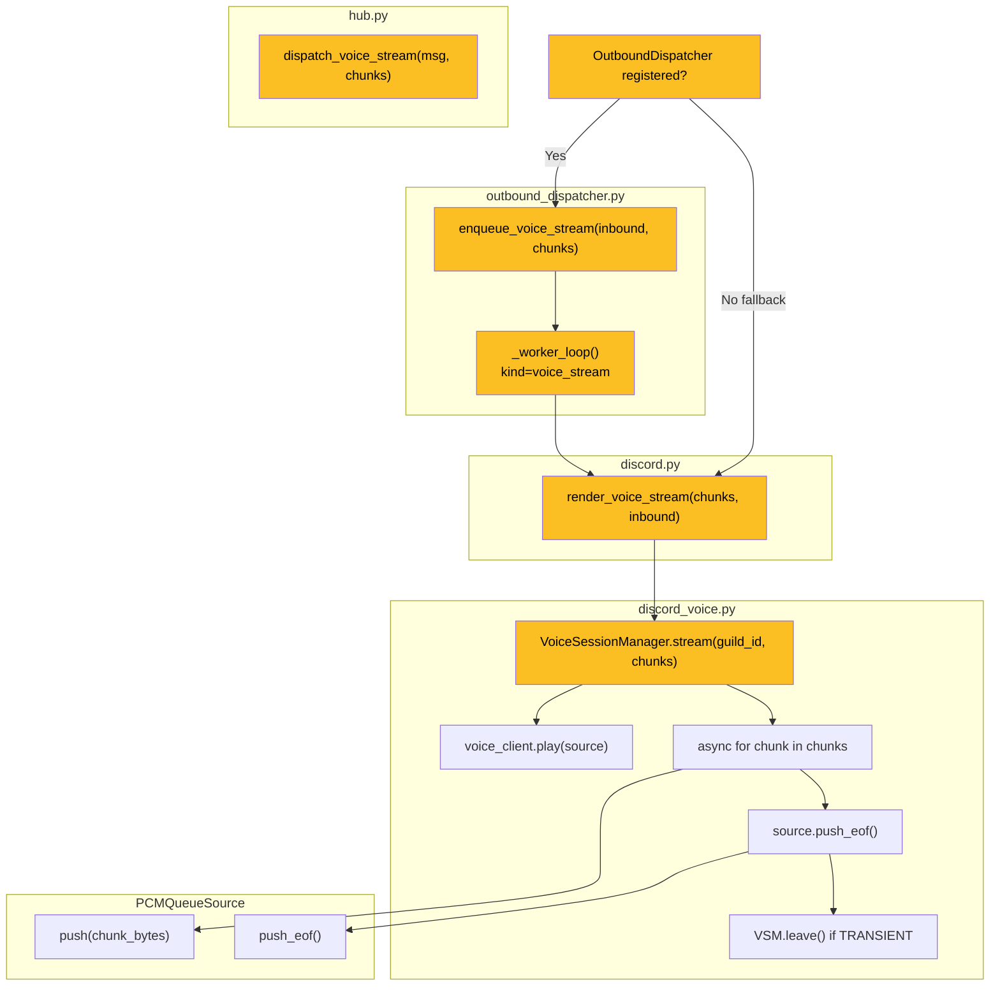
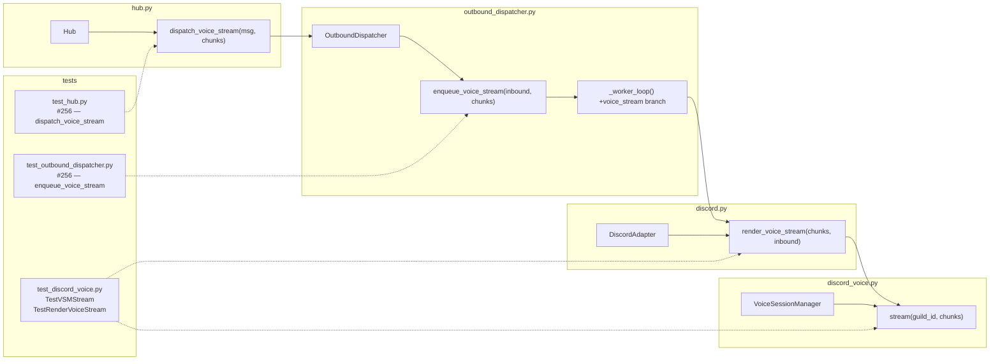

## Summary

Wire the Hub→OutboundDispatcher→DiscordAdapter→VoiceSessionManager→PCMQueueSource chain
by adding four small, pattern-following additions: `VSM.stream()`, `render_voice_stream()`,
`dispatch_voice_stream()`, and `enqueue_voice_stream()`. Every piece mirrors its `audio_stream`
counterpart exactly.

## Architecture





## Agents

| Agent | Tasks | Files |
|-------|-------|-------|
| backend-dev | 8 | `discord_voice.py`, `discord.py`, `hub.py`, `outbound_dispatcher.py` |
| tester | 6 | `test_discord_voice.py`, `test_hub.py`, `test_outbound_dispatcher.py` |

## Consistency Report

| Metric | Count |
|--------|-------|
| Success criteria covered | 12/12 |
| Uncovered criteria | 0 |
| Untraced tasks | 0 |

All 12 success criteria map to at least one task. SC-8 (discord.py[voice] present) is a precondition — verified by B3 task T14 (confirm no pyproject.toml change needed).

---

## Micro-Tasks

### Slice B1 — VSM.stream() + DiscordAdapter.render_voice_stream()

---

**T1** `[backend-dev]` — Add `VoiceSessionManager.stream()` to `discord_voice.py`
**File:** `src/lyra/adapters/discord_voice.py`
**Phase:** RED (new method — tests fail until implemented)
**Difficulty:** 3
**Spec trace:** SC-3, SC-4, SC-6, SC-7, SC-8, SC-10

```python
async def stream(
    self,
    guild_id: str,
    chunks: AsyncIterator[OutboundAudioChunk],
) -> None:
    """Drain TTS chunks into the active voice session's PCMQueueSource.

    Starts VoiceClient.play() if not already playing.
    Calls push_eof() unconditionally after the loop (safety net for
    non-conforming producers). Auto-leaves if mode is TRANSIENT.
    """
    session = self._sessions.get(guild_id)
    if session is None:
        log.warning("No active voice session for guild %s", guild_id)
        return
    if session.voice_client.is_playing():
        log.warning("Already streaming to guild %s — concurrent stream dropped", guild_id)
        return
    session.voice_client.play(session.source)
    async for chunk in chunks:
        session.source.push(chunk.chunk_bytes)
        if chunk.is_final:
            session.source.push_eof()
    session.source.push_eof()  # safety net: idempotent
    if session.mode == VoiceMode.TRANSIENT:
        await self.leave(guild_id)
```

**Verify:** `uv run pytest tests/adapters/test_discord_voice.py -k stream -x`
**Expected:** RED (tests not written yet — confirms method exists)

---

**T2** `[backend-dev]` — Add `DiscordAdapter.render_voice_stream()` to `discord.py`
**File:** `src/lyra/adapters/discord.py`
**Phase:** RED
**Difficulty:** 2
**Spec trace:** SC-3, SC-4, SC-5
**Pattern:** mirrors `render_audio_stream(chunks, inbound)` at line 911

```python
async def render_voice_stream(
    self,
    chunks: AsyncIterator[OutboundAudioChunk],
    inbound: InboundMessage,
) -> None:
    """Route TTS stream to the active Discord voice session for this guild."""
    if inbound.platform != Platform.DISCORD.value:
        log.warning(
            "render_voice_stream() called with non-discord message id=%s",
            inbound.id,
        )
        return
    guild_id = inbound.platform_meta.get("guild_id")
    if guild_id is None:
        log.warning(
            "render_voice_stream: platform_meta missing 'guild_id' for msg id=%s",
            inbound.id,
        )
        return
    await self._vsm.stream(str(guild_id), chunks)
```

**Verify:** `uv run pyright src/lyra/adapters/discord.py`
**Expected:** 0 errors

---

**T3** `[tester]` — Add `TestVSMStream` tests to `test_discord_voice.py`
**File:** `tests/adapters/test_discord_voice.py`
**Phase:** GREEN
**Difficulty:** 3
**Spec trace:** SC-3, SC-4, SC-6, SC-7, SC-8, SC-10

Tests to write:
- `test_stream_calls_play_and_drains_chunks` — active session → `play()` called, chunks pushed
- `test_stream_no_session_logs_warning` — `vsm.get()` returns None → `play()` not called, WARNING logged
- `test_stream_already_playing_logs_warning` — `is_playing()` True → drops gracefully, WARNING logged
- `test_stream_is_final_calls_push_eof` — `is_final=True` chunk → `push_eof()` called
- `test_stream_safety_net_push_eof_always_called` — no `is_final` chunk → `push_eof()` still called after loop
- `test_stream_transient_autoleave` — TRANSIENT mode + `is_final=True` → `leave()` called
- `test_stream_persistent_no_autoleave` — PERSISTENT mode → `leave()` NOT called

**Verify:** `uv run pytest tests/adapters/test_discord_voice.py::TestVSMStream -v`
**Expected:** 7 passed

---

**T4** `[tester]` — Add `TestRenderVoiceStream` tests to `test_discord_voice.py`
**File:** `tests/adapters/test_discord_voice.py`
**Phase:** GREEN
**Difficulty:** 2
**Spec trace:** SC-3, SC-4, SC-5

Tests to write:
- `test_render_voice_stream_calls_vsm_stream` — active mock session → `vsm.stream()` awaited
- `test_render_voice_stream_non_discord_platform` — non-discord platform → WARNING, `vsm.stream()` not called
- `test_render_voice_stream_missing_guild_id` — `platform_meta` has no `guild_id` → WARNING, not called

**Verify:** `uv run pytest tests/adapters/test_discord_voice.py::TestRenderVoiceStream -v`
**Expected:** 3 passed

**RED-GATE B1:** `uv run pytest tests/adapters/test_discord_voice.py -x -q`
All B1 tests pass before proceeding to B2.

---

### Slice B2 — Hub.dispatch_voice_stream() + OutboundDispatcher.enqueue_voice_stream()

---

**T5** `[backend-dev]` — Add `Hub.dispatch_voice_stream()` to `hub.py`
**File:** `src/lyra/core/hub.py`
**Phase:** RED
**Difficulty:** 2
**Spec trace:** SC-1, SC-2
**Pattern:** copy of `dispatch_audio_stream` (lines 548–575), s/audio/voice/

```python
async def dispatch_voice_stream(
    self,
    msg: InboundMessage,
    chunks: AsyncIterator[OutboundAudioChunk],
) -> None:
    """Stream TTS audio to an active Discord voice session.

    Routes through the OutboundDispatcher when one is registered (fire-and-forget).
    Falls back to a direct adapter call when no dispatcher is registered.
    """
    platform = Platform(msg.platform)
    dispatcher = self.outbound_dispatchers.get((platform, msg.bot_id))
    if dispatcher is not None:
        dispatcher.enqueue_voice_stream(msg, chunks)
        self._last_processed_at = time.monotonic()
        return
    adapter = self.adapter_registry.get((platform, msg.bot_id))
    if adapter is None:
        raise KeyError(
            f"No adapter registered for ({msg.platform!r}, {msg.bot_id!r}). "
            "Call register_adapter() before dispatching voice stream."
        )
    await adapter.render_voice_stream(chunks, msg)
    self._last_processed_at = time.monotonic()
```

**Verify:** `uv run pyright src/lyra/core/hub.py`
**Expected:** 0 errors

---

**T6** `[backend-dev]` — Add `enqueue_voice_stream()` to `OutboundDispatcher`
**File:** `src/lyra/core/outbound_dispatcher.py`
**Phase:** RED
**Difficulty:** 2
**Spec trace:** SC-1, SC-11
**Pattern:** copy of `enqueue_audio_stream` (lines 125–135)

```python
def enqueue_voice_stream(
    self,
    inbound: InboundMessage,
    chunks: AsyncIterator[OutboundAudioChunk],
) -> None:
    """Enqueue a voice stream for delivery via render_voice_stream().

    Fire-and-forget. Worker drains iterator before circuit check.
    """
    self._queue.put_nowait(("voice_stream", inbound, chunks))
```

**Verify:** `uv run pyright src/lyra/core/outbound_dispatcher.py`
**Expected:** 0 errors

---

**T7** `[backend-dev]` — Extend `_worker_loop` in `outbound_dispatcher.py` for `voice_stream`
**File:** `src/lyra/core/outbound_dispatcher.py`
**Phase:** RED
**Difficulty:** 3
**Spec trace:** SC-1, SC-11

Three existing branches to extend (add `"voice_stream"` to each):

1. **Destructuring branch** (line 173): `kind in ("send", "audio", "audio_stream", "attachment")` → add `"voice_stream"`
2. **Routing branch** (line 188): `elif kind in ("audio", "audio_stream", "attachment")` → add `"voice_stream"`
3. **Drain check** (line 193 + 205): `kind in ("streaming", "audio_stream")` → add `"voice_stream"` to both drain conditionals
4. **Dispatch branch** (after line 218): add `elif kind == "voice_stream": await self._adapter.render_voice_stream(payload, msg)`

**Verify:** `uv run pytest tests/core/test_outbound_dispatcher.py -x -q`
**Expected:** existing tests still pass

---

**T8** `[tester]` — Add hub `dispatch_voice_stream` tests to `test_hub.py`
**File:** `tests/core/test_hub.py`
**Phase:** GREEN
**Difficulty:** 2
**Spec trace:** SC-1, SC-2
**Pattern:** mirror `#182 — dispatch_audio_stream` tests (lines 499–567)

Tests to write:
- `test_dispatch_voice_stream_routes_to_dispatcher` — dispatcher registered → `enqueue_voice_stream` called once with `(msg, chunks)`
- `test_dispatch_voice_stream_fallback_direct` — no dispatcher → `adapter.render_voice_stream` awaited with `(chunks, msg)`
- `test_dispatch_voice_stream_raises_if_no_adapter` — no dispatcher, no adapter → `KeyError`

**Verify:** `uv run pytest tests/core/test_hub.py -k voice_stream -v`
**Expected:** 3 passed

---

**T9** `[tester]` — Add `enqueue_voice_stream` + worker tests to `test_outbound_dispatcher.py`
**File:** `tests/core/test_outbound_dispatcher.py`
**Phase:** GREEN
**Difficulty:** 2
**Spec trace:** SC-1, SC-11
**Pattern:** mirror `test_enqueue_audio_stream` pattern

Tests to write:
- `test_enqueue_voice_stream_delivers_via_adapter` — worker calls `adapter.render_voice_stream(chunks, inbound)`
- `test_voice_stream_circuit_open_drains_iterator` — circuit open → iterator drained (no generator leak)
- `test_voice_stream_routing_mismatch_drains_iterator` — routing mismatch → iterator drained

**Verify:** `uv run pytest tests/core/test_outbound_dispatcher.py -k voice_stream -v`
**Expected:** 3 passed

**RED-GATE B2:** `uv run pytest tests/core/test_hub.py tests/core/test_outbound_dispatcher.py -x -q`
All B2 tests pass before proceeding to B3.

---

### Slice B3 — PCMQueueSource regression guard [P]

---

**T10** `[tester]` — Verify/add TRANSIENT auto-leave + is_final regression test
**File:** `tests/adapters/test_discord_voice.py`
**Phase:** GREEN
**Difficulty:** 1
**Spec trace:** SC-9 (re-framing — already covered by `test_reframing_multi`), SC-10 (TRANSIENT)

Check if `test_stream_transient_autoleave` from T3 covers SC-10. If re-framing byte formula
test is missing (frame_count × 3840 == total bytes), add:
- `test_pcm_reframing_frame_count_formula` — push N bytes non-aligned → verify `frame_count × 3840 == len(all_frames_combined)`

Note: `test_reframing_multi` already verifies `len(frames) == 3` and `all(len(f) == 3840)` —
this is sufficient for SC-9. Only add the above if a gap is found.

**Verify:** `uv run pytest tests/adapters/test_discord_voice.py::TestPCMQueueSource -v`
**Expected:** all pass (existing + new if added)

---

**T11** `[tester]` — Final regression run — all voice tests pass unmodified
**Phase:** GREEN
**Difficulty:** 1
**Spec trace:** SC-12

**Verify:** `uv run pytest tests/adapters/test_discord_voice.py tests/adapters/test_render_audio_stream.py tests/adapters/test_discord_audio.py -v`
**Expected:** all pass; zero pre-existing failures

---

**T12** `[backend-dev]` — Pyright full-pass
**Phase:** REFACTOR
**Difficulty:** 1
**Spec trace:** all

**Verify:** `uv run pyright src/lyra/adapters/discord_voice.py src/lyra/adapters/discord.py src/lyra/core/hub.py src/lyra/core/outbound_dispatcher.py`
**Expected:** 0 errors

---

**T13** `[tester]` — Full test suite green
**Phase:** REFACTOR
**Difficulty:** 1
**Spec trace:** all

**Verify:** `uv run pytest -x -q`
**Expected:** all pass

---

**T14** `[backend-dev]` — Confirm `discord.py[voice]` precondition (no change)
**File:** `pyproject.toml`
**Phase:** REFACTOR
**Difficulty:** 1
**Spec trace:** Precondition (SC-8 in spec — already satisfied)

**Verify:** `grep "discord.py\[voice\]" pyproject.toml`
**Expected:** line present — no edit needed

---
