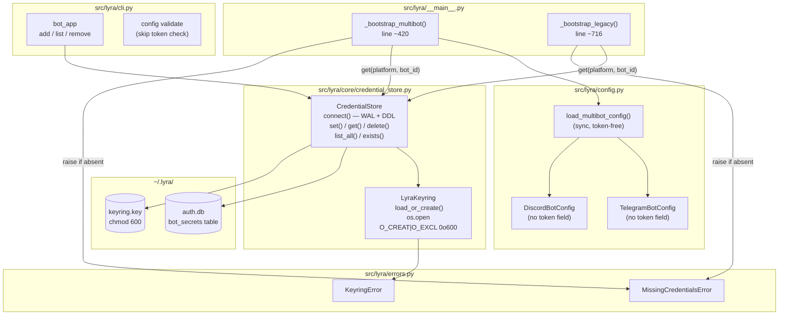
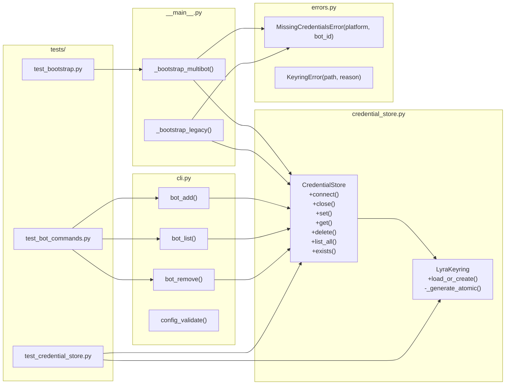

## Summary

Adds `CredentialStore` (Fernet-encrypted SQLite) and `LyraKeyring` (atomic machine-local key), wires credential resolution into the bootstrap pipeline, and exposes a `lyra bot add/list/remove` CLI. `config.toml` becomes token-free; startup raises `MissingCredentialsError` if any configured bot has no DB entry.

## Architecture





## Reference Patterns

- `src/lyra/core/auth_store.py` — reference for `CredentialStore`: WAL setup, `CREATE TABLE IF NOT EXISTS`, async CRUD, `tmp_path` test fixture
- `tests/core/test_auth_store.py` — reference for `test_credential_store.py` structure and `make_store` / `auth_store` fixture pattern

## Agents

| Agent | Task count | Files |
|-------|-----------|-------|
| backend-dev | 10 | `core/credential_store.py`, `errors.py`, `pyproject.toml`, `config.py`, `__main__.py`, `cli.py` |
| tester | 6 | `tests/core/test_credential_store.py`, `tests/test_bootstrap.py`, `tests/cli/test_bot_commands.py` |

## Consistency Report

| Criterion | Traced to task(s) |
|-----------|------------------|
| SC-1: `lyra bot add` stores encrypted | T3, T5 |
| SC-2: Overwrite requires confirm | T4, T12 |
| SC-3: `lyra bot list` masks token | T6, T13 |
| SC-4: `lyra bot list` empty state | T6, T13 |
| SC-5: `lyra bot remove` confirm + output | T6, T14 |
| SC-6: `lyra bot remove` not-found output | T6, T14 |
| SC-7: `lyra start` with DB credentials | T7, T8, T9, T10 |
| SC-8: `MissingCredentialsError` on missing cred | T7, T8, T9, T10 |
| SC-9: Tokens encrypted in DB | T3, T5 |
| SC-10: Keyring atomic creation, `KeyringError` | T4, T5 |
| SC-11: `cryptography` in pyproject.toml | T1 |
| SC-12: Unit tests all branches | T5, T6, T10, T16 |
| SC-13: `config validate` no token warning | T15, T16 |

Coverage: 13/13 criteria traced. No uncovered criteria.

## Micro-Tasks

---

### Slice S1 — CredentialStore + LyraKeyring + DB schema

<!-- RED-GATE prerequisite: none -->

**T1** `[P]` — Add `cryptography` dependency
- **File:** `pyproject.toml`
- **Agent:** backend-dev
- **Phase:** GREEN
- **Spec trace:** SC-11
- **Difficulty:** 1
- **Time:** 2 min
- **Action:** Add `"cryptography>=42.0"` to `dependencies` list.
- **Verify:** `uv sync && python -c "from cryptography.fernet import Fernet; print('ok')"`
- **Expected:** `ok`

**T2** `[P]` — Add `MissingCredentialsError` and `KeyringError` to `errors.py`
- **File:** `src/lyra/errors.py`
- **Agent:** backend-dev
- **Phase:** GREEN
- **Spec trace:** SC-8, SC-10
- **Difficulty:** 1
- **Time:** 3 min
- **Shape:**
  ```python
  class MissingCredentialsError(Exception):
      def __init__(self, platform: str, bot_id: str) -> None:
          super().__init__(f"No credentials found for {platform}/{bot_id}. Run: lyra bot add --platform {platform} --bot-id {bot_id} --token <token>")
          self.platform = platform
          self.bot_id = bot_id

  class KeyringError(Exception):
      def __init__(self, path: str, reason: str) -> None:
          super().__init__(f"Keyring error at {path}: {reason}. Check file permissions or re-create with: rm {path} && lyra bot add ...")
          self.path = path
          self.reason = reason
  ```
- **Verify:** `python -c "from lyra.errors import MissingCredentialsError, KeyringError; print('ok')"`
- **Expected:** `ok`

**T3** — Create `CredentialStore` + `LyraKeyring` skeleton with DDL
- **File:** `src/lyra/core/credential_store.py` (new)
- **Agent:** backend-dev
- **Phase:** RED → GREEN
- **Spec trace:** SC-1, SC-9
- **Difficulty:** 3
- **Time:** 8 min
- **Shape:**
  ```python
  _CREATE_BOT_SECRETS = """
  CREATE TABLE IF NOT EXISTS bot_secrets (
      id                       INTEGER PRIMARY KEY,
      platform                 TEXT NOT NULL,
      bot_id                   TEXT NOT NULL,
      encrypted_token          BLOB NOT NULL,
      encrypted_webhook_secret BLOB,
      created_at               TEXT NOT NULL DEFAULT (datetime('now')),
      updated_at               TEXT NOT NULL DEFAULT (datetime('now')),
      UNIQUE (platform, bot_id)
  )
  """

  @dataclass
  class BotSecretRow:
      platform: str
      bot_id: str
      encrypted_token: bytes
      encrypted_webhook_secret: bytes | None
      updated_at: str

  class LyraKeyring:
      def __init__(self, key_path: Path) -> None: ...
      def load_or_create(self) -> bytes: ...
      def _generate_atomic(self) -> bytes: ...  # os.open O_CREAT|O_EXCL|0o600

  class CredentialStore:
      def __init__(self, db_path: Path, key_path: Path) -> None: ...
      async def connect(self) -> None: ...   # WAL + CREATE TABLE IF NOT EXISTS
      async def close(self) -> None: ...
      async def set(self, platform: str, bot_id: str, token: str, webhook_secret: str | None = None) -> None: ...
      async def get(self, platform: str, bot_id: str) -> tuple[str, str | None] | None: ...
      async def exists(self, platform: str, bot_id: str) -> bool: ...
      async def delete(self, platform: str, bot_id: str) -> bool: ...
      async def list_all(self) -> list[BotSecretRow]: ...
  ```
- **Verify:** `python -c "from lyra.core.credential_store import CredentialStore, LyraKeyring; print('ok')"`
- **Expected:** `ok`

**T4** — Implement `LyraKeyring.load_or_create()` with atomic creation
- **File:** `src/lyra/core/credential_store.py`
- **Agent:** backend-dev
- **Phase:** GREEN
- **Spec trace:** SC-10
- **Difficulty:** 3
- **Time:** 5 min
- **Key detail:** Use `os.open(path, os.O_WRONLY | os.O_CREAT | os.O_EXCL, 0o600)` for new key; wrap unreadable file in `KeyringError`.
- **Shape:**
  ```python
  def load_or_create(self) -> bytes:
      if self.key_path.exists():
          try:
              return self.key_path.read_bytes()
          except PermissionError as e:
              raise KeyringError(str(self.key_path), "not readable — check permissions") from e
      return self._generate_atomic()

  def _generate_atomic(self) -> bytes:
      key = Fernet.generate_key()
      fd = os.open(str(self.key_path), os.O_WRONLY | os.O_CREAT | os.O_EXCL, 0o600)
      try:
          os.write(fd, key)
      finally:
          os.close(fd)
      return key
  ```
- **Verify:** `uv run pytest tests/core/test_credential_store.py::TestLyraKeyring -x`

**T5** — Implement `CredentialStore` CRUD with Fernet encrypt/decrypt
- **File:** `src/lyra/core/credential_store.py`
- **Agent:** backend-dev
- **Phase:** GREEN
- **Spec trace:** SC-1, SC-3, SC-5, SC-9
- **Difficulty:** 3
- **Time:** 8 min
- **Key details:**
  - `connect()`: enable WAL (`PRAGMA journal_mode=WAL`), run DDL
  - `set()`: `Fernet(key).encrypt(token.encode())`, upsert with `ON CONFLICT(platform, bot_id) DO UPDATE`
  - `get()`: fetch row, `Fernet(key).decrypt(row[encrypted_token]).decode()`
  - Decrypted values held in local scope only — never assigned to instance attributes, never logged
- **Verify:** `uv run pytest tests/core/test_credential_store.py -x`
- **Expected:** All CRUD tests pass

**T6** — Write `tests/core/test_credential_store.py`
- **File:** `tests/core/test_credential_store.py` (new)
- **Agent:** tester
- **Phase:** RED → GREEN
- **Spec trace:** SC-1, SC-2, SC-3, SC-4, SC-5, SC-6, SC-9, SC-10, SC-12
- **Difficulty:** 3
- **Time:** 8 min
- **Reference:** `tests/core/test_auth_store.py` — `make_store` / `auth_store` fixture pattern
- **Tests to cover:**
  - `test_set_and_get_roundtrip` — store token, retrieve, assert decrypted matches
  - `test_token_encrypted_in_db` — raw sqlite3 read shows no plaintext token
  - `test_set_overwrites` — second set() on same (platform, bot_id) updates row
  - `test_get_returns_none_for_missing` — get() on absent key returns None
  - `test_delete_existing` — delete returns True, subsequent get returns None
  - `test_delete_nonexistent` — delete returns False
  - `test_list_all_empty` — returns []
  - `test_list_all_multiple` — returns all rows as BotSecretRow
  - `test_exists_true_false`
  - `test_keyring_atomic_creation` — key file created with 0o600, content is valid Fernet key
  - `test_keyring_load_existing` — second load_or_create() returns same key
  - `test_keyring_unreadable_raises_keyring_error` — chmod 000, assert KeyringError raised
- **Verify:** `uv run pytest tests/core/test_credential_store.py -v`
- **Expected:** All 12 tests pass

<!-- RED-GATE S1 -->
> **🔴 RED-GATE S1** — `uv run pytest tests/core/test_credential_store.py`
> All tests must pass before S2 or S3 begins.

---

### Slice S2 — Bootstrap integration (depends S1)

**T7** — Strip `token`/`webhook_secret` from `TelegramBotConfig`, `DiscordBotConfig`
- **File:** `src/lyra/config.py`
- **Agent:** backend-dev
- **Phase:** RED (breaks existing uses)
- **Spec trace:** SC-7, SC-8
- **Difficulty:** 2
- **Time:** 5 min
- **Action:** Remove `token: str = field(repr=False)` and `webhook_secret: str = field(repr=False)` from both dataclasses. Remove token resolution from `_parse_telegram_bots()` and `_parse_discord_bots()`. Remove `_resolve_value()` calls for token/secret fields (keep function if used elsewhere; otherwise remove).
- **Verify:** `uv run pyright src/lyra/config.py` (will show errors in `__main__.py` — expected at this step)

**T8** — Wire `CredentialStore` into `_bootstrap_multibot()`
- **File:** `src/lyra/__main__.py`
- **Agent:** backend-dev
- **Phase:** GREEN
- **Spec trace:** SC-7, SC-8
- **Difficulty:** 3
- **Time:** 8 min
- **Action:**
  1. Import `CredentialStore` from `lyra.core.credential_store`, `MissingCredentialsError` from `lyra.errors`
  2. After `AuthStore.connect()` (~line 422), create and connect `CredentialStore(db_path=vault_dir / "auth.db", key_path=vault_dir / "keyring.key")`
  3. For each `bot_cfg` in `tg_multi_cfg.bots`: call `await cred_store.get("telegram", bot_cfg.bot_id)` — raise `MissingCredentialsError` if None, else inject `token`/`webhook_secret` into `TelegramAdapter(...)` directly (no longer from `bot_cfg`)
  4. Same for `dc_multi_cfg.bots` → `DiscordAdapter`
  5. `await cred_store.close()` in finally block alongside `AuthStore.close()`
- **Verify:** `uv run pyright src/lyra/__main__.py`

**T9** — Wire `CredentialStore` into `_bootstrap_legacy()`
- **File:** `src/lyra/__main__.py`
- **Agent:** backend-dev
- **Phase:** GREEN
- **Spec trace:** SC-7, SC-8
- **Difficulty:** 2
- **Time:** 5 min
- **Action:** Same pattern as T8 but for legacy path (single bot). Resolve token from `cred_store.get("telegram", "main")` and `cred_store.get("discord", "main")`.
- **Verify:** `uv run pyright src/lyra/__main__.py`

**T10** `[P]` — Write `tests/test_bootstrap.py` for credential resolution
- **File:** `tests/test_bootstrap.py` (new or extend existing)
- **Agent:** tester
- **Phase:** RED → GREEN
- **Spec trace:** SC-7, SC-8, SC-12
- **Difficulty:** 3
- **Time:** 8 min
- **Tests:**
  - `test_missing_credentials_raises` — start bootstrap with empty CredentialStore and a configured bot_id, assert `MissingCredentialsError` with correct platform/bot_id
  - `test_credentials_resolved_from_db` — seed CredentialStore, assert adapters receive correct token (mock adapters)
- **Verify:** `uv run pytest tests/test_bootstrap.py -v`
- **Expected:** Both tests pass

<!-- RED-GATE S2 -->
> **🔴 RED-GATE S2** — `uv run pytest tests/test_bootstrap.py`
> Startup credential resolution must be fully tested before S3 merges.

---

### Slice S3 — `lyra bot` CLI commands (depends S1, parallel with S2)

**T11** — Register `bot_app` Typer group
- **File:** `src/lyra/cli.py`
- **Agent:** backend-dev
- **Phase:** GREEN
- **Spec trace:** SC-1, SC-3, SC-5
- **Difficulty:** 1
- **Time:** 3 min
- **Action:** Add `bot_app = typer.Typer(name="bot", help="Manage bot credentials.")` and `lyra_app.add_typer(bot_app, name="bot")` following the `agent_app`/`config_app` pattern (lines 56–60).
- **Verify:** `uv run lyra --help` shows `bot` subcommand

**T12** — Implement `lyra bot add`
- **File:** `src/lyra/cli.py`
- **Agent:** backend-dev
- **Phase:** GREEN
- **Spec trace:** SC-1, SC-2
- **Difficulty:** 3
- **Time:** 5 min
- **Shape:**
  ```python
  @bot_app.command("add")
  def bot_add(
      platform: str = typer.Option(..., help="telegram | discord"),
      bot_id: str = typer.Option(...),
      token: str = typer.Option(...),
      webhook_secret: str | None = typer.Option(None),
  ) -> None:
      store = _open_credential_store()
      if asyncio.run(store.exists(platform, bot_id)):
          typer.confirm(f"Credentials already exist for {platform}/{bot_id}. Overwrite?", abort=True)
      asyncio.run(store.set(platform, bot_id, token, webhook_secret))
      typer.echo(f"✓ Credentials stored for {platform}/{bot_id}")
  ```
- **Verify:** `uv run lyra bot add --help`

**T13** — Implement `lyra bot list`
- **File:** `src/lyra/cli.py`
- **Agent:** backend-dev
- **Phase:** GREEN
- **Spec trace:** SC-3, SC-4
- **Difficulty:** 2
- **Time:** 5 min
- **Key detail:** Mask token as `***...{token[-4:]}`. Decrypted value held in local variable only.
- **Verify:** `uv run lyra bot list` (with test DB seeded)

**T14** — Implement `lyra bot remove`
- **File:** `src/lyra/cli.py`
- **Agent:** backend-dev
- **Phase:** GREEN
- **Spec trace:** SC-5, SC-6
- **Difficulty:** 2
- **Time:** 4 min
- **Shape:** `typer.confirm()` before delete; print `✓ Removed` or `✗ Not found for {platform}/{bot_id}`.
- **Verify:** `uv run lyra bot remove --help`

**T15** — Update `config validate` to skip token field checks
- **File:** `src/lyra/cli.py`
- **Agent:** backend-dev
- **Phase:** GREEN
- **Spec trace:** SC-13
- **Difficulty:** 1
- **Time:** 3 min
- **Action:** In `config_validate` (lines 402–437): remove the warnings for missing `token`, `webhook_secret`, `env:` references. Credentials are no longer in config. Keep other validations (bot_id, agent name, etc.).
- **Verify:** `uv run lyra config validate` with credential-free config.toml exits 0 with no warnings

**T16** `[P]` — Write `tests/cli/test_bot_commands.py`
- **File:** `tests/cli/test_bot_commands.py` (new)
- **Agent:** tester
- **Phase:** RED → GREEN
- **Spec trace:** SC-1, SC-2, SC-3, SC-4, SC-5, SC-6, SC-12, SC-13
- **Difficulty:** 3
- **Time:** 8 min
- **Reference:** Typer test runner pattern (`CliRunner` from `typer.testing`)
- **Tests:**
  - `test_bot_add_stores_credential`
  - `test_bot_add_overwrite_requires_confirm`
  - `test_bot_list_shows_masked_token`
  - `test_bot_list_empty_state_message`
  - `test_bot_remove_existing`
  - `test_bot_remove_nonexistent_message`
  - `test_config_validate_no_token_warning`
- **Verify:** `uv run pytest tests/cli/test_bot_commands.py -v`
- **Expected:** All 7 tests pass

<!-- RED-GATE S3 -->
> **🔴 RED-GATE S3** — `uv run pytest tests/cli/test_bot_commands.py`
> All CLI tests must pass.

---

## Final Verify

```bash
uv run pytest tests/core/test_credential_store.py tests/test_bootstrap.py tests/cli/test_bot_commands.py -v
uv run pyright src/lyra/
uv run ruff check .
```
