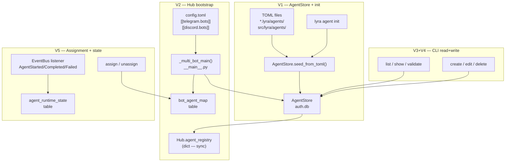
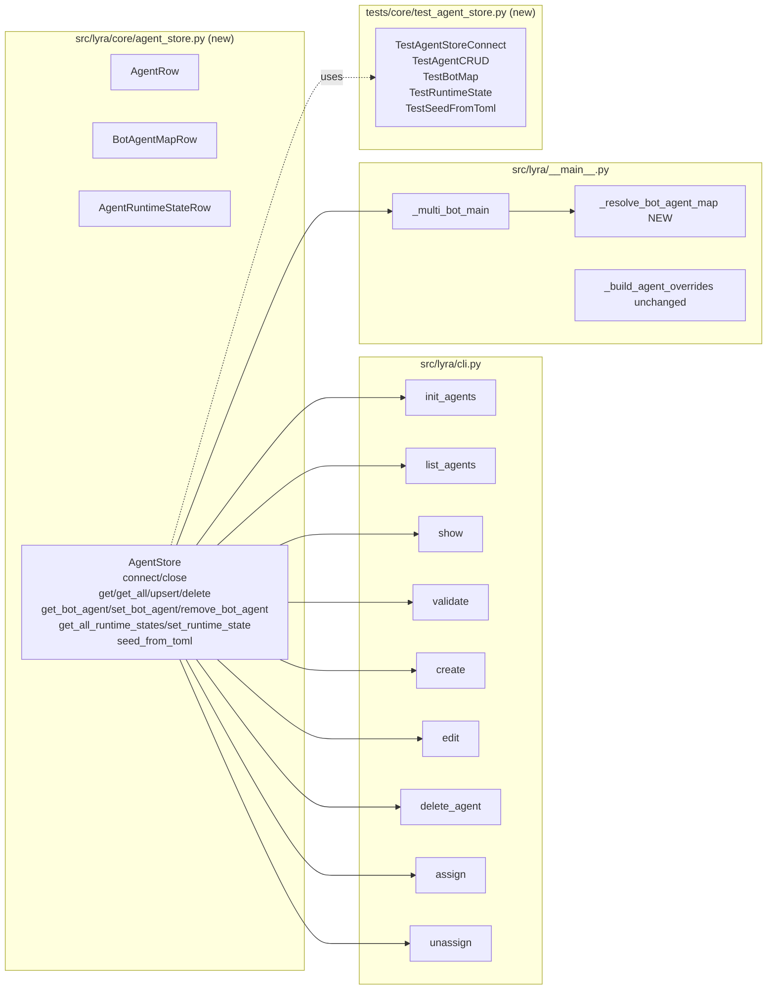

## Summary

New `AgentStore` class in `auth.db` (aiosqlite + WAL + write-through cache), full 9-command
`lyra agent` CLI overhaul, and Hub bootstrap migration from TOML file scanning to DB cache
reads. Follows the `AuthStore` pattern exactly. 5 slices; S5 is the optional cut line.

---

## Architecture





---

## Bootstrap Context

Reference: `src/lyra/core/auth_store.py` — the exact pattern to follow.
- `_require_db()` guard pattern
- `connect()` → WAL → CREATE TABLE IF NOT EXISTS → warm cache → log
- `close()` → `await self._db.close()` + None reset
- Write-through: DB write first, then cache update (same tx)
- `aiosqlite.connect()` → separate connection per store (WAL mode allows concurrent readers)

Vault dir: `Path.home() / ".lyra"` — `auth.db` lives here. For CLI commands use:
```python
def _get_db_path() -> Path:
    return Path(os.environ.get("LYRA_VAULT_DIR", str(Path.home() / ".lyra"))) / "auth.db"
```

Hub bootstrap key: `_build_agent_overrides()` stays — machine-local config.toml overlays
applied at runtime on top of DB rows, same as today.

---

## Agents

| Agent | Task count | Files |
|-------|-----------|-------|
| backend-dev | 18 | `agent_store.py` (new), `cli.py`, `__main__.py` |
| tester | 6 | `tests/core/test_agent_store.py` (new), `tests/cli/test_agent_cli.py` (new) |

---

## Consistency Report

| Spec element | Covered | Tasks |
|-------------|---------|-------|
| SC-1: `lyra agent init` imports TOML files | ✓ | T5, T6 |
| SC-2: init idempotent | ✓ | T6, T-test |
| SC-3: init --force overwrites | ✓ | T6, T-test |
| SC-4: Hub resolves from bot_agent_map | ✓ | T12 |
| SC-5: Hub fallback + seed | ✓ | T12 |
| SC-6: Hub logs error on missing agent | ✓ | T12 |
| SC-7: create → DB only | ✓ | T15 |
| SC-8: list reads DB | ✓ | T13 |
| SC-9: show reads DB | ✓ | T14 |
| SC-10: validate exits 0/1 | ✓ | T14 |
| SC-11: edit updates DB | ✓ | T16 |
| SC-12: delete guards bot assignment | ✓ | T17 |
| SC-13: assign upserts bot_agent_map | ✓ | T19 |
| SC-14: unassign no-op safe | ✓ | T19 |
| SC-15: runtime state after turn | ✓ | T20, T21 |
| SC-16: get_agent stays sync | ✓ | T12 (no-touch) |
| SC-17: tables idempotent on connect | ✓ | T1, T-test |
| SC-18: close() + use-after-close raises | ✓ | T1, T-test |

**Coverage: 18/18 (100%). Untraced: 0.**

---

## Micro-Tasks

### V1 — AgentStore foundation + `lyra agent init` [RED-GREEN]

---

**T1** — Write RED tests for AgentStore
**File:** `tests/core/test_agent_store.py`
**Agent:** tester
**Phase:** RED
**Slice:** V1
**Difficulty:** 2
**Time:** 8 min
**Spec trace:** SC-1, SC-2, SC-3, SC-17, SC-18
**Parallel-safe:** N (must be first)

```python
"""Tests for AgentStore (issue #268)."""
import asyncio
from pathlib import Path
import pytest
from lyra.core.agent_store import AgentStore, AgentRow, BotAgentMapRow

@pytest.fixture
async def store(tmp_path):
    s = AgentStore(db_path=tmp_path / "auth.db")
    await s.connect()
    yield s
    await s.close()

class TestAgentStoreConnect:
    async def test_connect_creates_tables(self, store, tmp_path):
        import aiosqlite
        async with aiosqlite.connect(tmp_path / "auth.db") as db:
            async with db.execute("SELECT name FROM sqlite_master WHERE type='table'") as cur:
                tables = {row[0] async for row in cur}
        assert {"agents", "bot_agent_map", "agent_runtime_state"}.issubset(tables)

    async def test_connect_idempotent(self, tmp_path):
        s = AgentStore(db_path=tmp_path / "auth.db")
        await s.connect()
        await s.connect()  # must not raise
        await s.close()

    async def test_close_then_get_raises(self, tmp_path):
        s = AgentStore(db_path=tmp_path / "auth.db")
        await s.connect()
        await s.close()
        with pytest.raises(RuntimeError, match="connect"):
            s.get("any")

class TestAgentCRUD:
    async def test_upsert_and_get(self, store):
        row = AgentRow(name="test", backend="claude-cli", model="m", max_turns=5,
                       tools_json="[]", persona=None, show_intermediate=False,
                       smart_routing_json=None, plugins_json="[]",
                       memory_namespace=None, cwd=None, source="db")
        await store.upsert(row)
        assert store.get("test") is not None

    async def test_get_missing_returns_none(self, store):
        assert store.get("nonexistent") is None

    async def test_delete(self, store):
        row = AgentRow(name="del_me", backend="claude-cli", model="m", max_turns=5,
                       tools_json="[]", persona=None, show_intermediate=False,
                       smart_routing_json=None, plugins_json="[]",
                       memory_namespace=None, cwd=None, source="db")
        await store.upsert(row)
        await store.delete("del_me")
        assert store.get("del_me") is None

    async def test_delete_raises_if_bot_assigned(self, store):
        row = AgentRow(name="busy", backend="claude-cli", model="m", max_turns=5,
                       tools_json="[]", persona=None, show_intermediate=False,
                       smart_routing_json=None, plugins_json="[]",
                       memory_namespace=None, cwd=None, source="db")
        await store.upsert(row)
        await store.set_bot_agent("telegram", "bot1", "busy")
        with pytest.raises(ValueError, match="assigned"):
            await store.delete("busy")

class TestBotMap:
    async def test_set_and_get_bot_agent(self, store):
        row = AgentRow(name="a1", backend="claude-cli", model="m", max_turns=5,
                       tools_json="[]", persona=None, show_intermediate=False,
                       smart_routing_json=None, plugins_json="[]",
                       memory_namespace=None, cwd=None, source="db")
        await store.upsert(row)
        await store.set_bot_agent("telegram", "bot1", "a1")
        assert store.get_bot_agent("telegram", "bot1") == "a1"

    async def test_remove_bot_agent(self, store):
        row = AgentRow(name="a2", backend="claude-cli", model="m", max_turns=5,
                       tools_json="[]", persona=None, show_intermediate=False,
                       smart_routing_json=None, plugins_json="[]",
                       memory_namespace=None, cwd=None, source="db")
        await store.upsert(row)
        await store.set_bot_agent("discord", "b2", "a2")
        await store.remove_bot_agent("discord", "b2")
        assert store.get_bot_agent("discord", "b2") is None

class TestSeedFromToml:
    async def test_seed_imports_toml(self, store, tmp_path):
        toml_path = tmp_path / "test_agent.toml"
        toml_path.write_text(
            '[agent]\nname = "test_agent"\nmemory_namespace = "test"\n'
            'permissions = []\nshow_intermediate = false\n'
            '[model]\nbackend = "claude-cli"\nmodel = "claude-sonnet-4-6"\n'
            'max_turns = 10\ntools = []\n'
            '[agent.smart_routing]\nenabled = false\n'
            '[plugins]\nenabled = []\n'
        )
        count = await store.seed_from_toml(toml_path)
        assert count == 1
        assert store.get("test_agent") is not None

    async def test_seed_idempotent(self, store, tmp_path):
        toml_path = tmp_path / "agent2.toml"
        toml_path.write_text(
            '[agent]\nname = "agent2"\nmemory_namespace = "a2"\n'
            'permissions = []\nshow_intermediate = false\n'
            '[model]\nbackend = "claude-cli"\nmodel = "m"\n'
            'max_turns = 5\ntools = []\n'
            '[agent.smart_routing]\nenabled = false\n'
            '[plugins]\nenabled = []\n'
        )
        await store.seed_from_toml(toml_path)
        count2 = await store.seed_from_toml(toml_path)
        assert count2 == 0  # skipped, already present
```

**Verify:** `uv run pytest tests/core/test_agent_store.py -x 2>&1 | head -5`
**Expected:** ImportError or ModuleNotFoundError (RED phase — module doesn't exist yet)

---

**T2** — Implement `src/lyra/core/agent_store.py`
**File:** `src/lyra/core/agent_store.py` (new)
**Agent:** backend-dev
**Phase:** GREEN
**Slice:** V1
**Difficulty:** 4
**Time:** 10 min
**Spec trace:** N1–N12, SC-17, SC-18
**Parallel-safe:** N (depends on T1 for test shape)

```python
"""AgentStore: SQLite + write-through cache for agent config (issue #268).

Follows the AuthStore pattern: aiosqlite + WAL + write-through in-memory cache.
Shares auth.db with AuthStore, CredentialStore, PrefsStore under WAL mode.
"""
from __future__ import annotations
import json
import logging
import tomllib
from dataclasses import dataclass, field
from pathlib import Path
from datetime import datetime, timezone

import aiosqlite

log = logging.getLogger(__name__)
__all__ = ["AgentStore", "AgentRow", "BotAgentMapRow", "AgentRuntimeStateRow"]

_CREATE_AGENTS = """
CREATE TABLE IF NOT EXISTS agents (
    name               TEXT PRIMARY KEY,
    backend            TEXT NOT NULL CHECK(backend IN ('claude-cli','anthropic-sdk','ollama')),
    model              TEXT NOT NULL,
    max_turns          INTEGER NOT NULL DEFAULT 10,
    tools_json         TEXT NOT NULL DEFAULT '[]',
    persona            TEXT,
    show_intermediate  INTEGER NOT NULL DEFAULT 0,
    smart_routing_json TEXT,
    plugins_json       TEXT NOT NULL DEFAULT '[]',
    memory_namespace   TEXT,
    cwd                TEXT,
    source             TEXT NOT NULL DEFAULT 'db' CHECK(source IN ('db','toml-seed')),
    created_at         TEXT NOT NULL DEFAULT (datetime('now')),
    updated_at         TEXT NOT NULL DEFAULT (datetime('now'))
)
"""
_CREATE_BOT_AGENT_MAP = """
CREATE TABLE IF NOT EXISTS bot_agent_map (
    platform    TEXT NOT NULL CHECK(platform IN ('telegram','discord')),
    bot_id      TEXT NOT NULL,
    agent_name  TEXT NOT NULL,
    updated_at  TEXT NOT NULL DEFAULT (datetime('now')),
    PRIMARY KEY (platform, bot_id)
)
"""
_CREATE_RUNTIME_STATE = """
CREATE TABLE IF NOT EXISTS agent_runtime_state (
    agent_name     TEXT PRIMARY KEY,
    last_active_at TEXT,
    updated_at     TEXT NOT NULL DEFAULT (datetime('now')),
    pool_count     INTEGER NOT NULL DEFAULT 0,
    status         TEXT NOT NULL DEFAULT 'idle' CHECK(status IN ('idle','active','error'))
)
"""

@dataclass
class AgentRow:
    name: str
    backend: str
    model: str
    max_turns: int = 10
    tools_json: str = "[]"
    persona: str | None = None
    show_intermediate: bool = False
    smart_routing_json: str | None = None
    plugins_json: str = "[]"
    memory_namespace: str | None = None
    cwd: str | None = None
    source: str = "db"
    created_at: str = field(default_factory=lambda: datetime.now(timezone.utc).isoformat())
    updated_at: str = field(default_factory=lambda: datetime.now(timezone.utc).isoformat())

@dataclass
class BotAgentMapRow:
    platform: str
    bot_id: str
    agent_name: str
    updated_at: str = field(default_factory=lambda: datetime.now(timezone.utc).isoformat())

@dataclass
class AgentRuntimeStateRow:
    agent_name: str
    last_active_at: str | None = None
    updated_at: str = field(default_factory=lambda: datetime.now(timezone.utc).isoformat())
    pool_count: int = 0
    status: str = "idle"


class AgentStore:
    """SQLite-backed agent config store with write-through in-memory cache.

    Shares auth.db with AuthStore/CredentialStore/PrefsStore under WAL mode.
    get() / get_all() / get_bot_agent() are synchronous (cache reads, no I/O).
    """

    def __init__(self, db_path: str | Path) -> None:
        self._db_path = str(db_path)
        self._db: aiosqlite.Connection | None = None
        self._agents: dict[str, AgentRow] = {}
        self._bot_map: dict[tuple[str, str], str] = {}  # (platform, bot_id) → agent_name

    def _require_db(self) -> aiosqlite.Connection:
        if self._db is None:
            raise RuntimeError("call connect() first")
        return self._db

    async def connect(self) -> None:
        if self._db is not None:
            return
        self._db = await aiosqlite.connect(self._db_path)
        await self._db.execute("PRAGMA journal_mode=WAL")
        await self._db.execute(_CREATE_AGENTS)
        await self._db.execute(_CREATE_BOT_AGENT_MAP)
        await self._db.execute(_CREATE_RUNTIME_STATE)
        await self._db.commit()
        await self._warm_cache()
        log.info("AgentStore connected (db=%s)", self._db_path)

    async def _warm_cache(self) -> None:
        db = self._require_db()
        self._agents.clear()
        async with db.execute(
            "SELECT name,backend,model,max_turns,tools_json,persona,show_intermediate,"
            "smart_routing_json,plugins_json,memory_namespace,cwd,source,created_at,updated_at "
            "FROM agents"
        ) as cur:
            async for row in cur:
                ar = AgentRow(
                    name=row[0], backend=row[1], model=row[2], max_turns=row[3],
                    tools_json=row[4], persona=row[5], show_intermediate=bool(row[6]),
                    smart_routing_json=row[7], plugins_json=row[8],
                    memory_namespace=row[9], cwd=row[10], source=row[11],
                    created_at=row[12], updated_at=row[13],
                )
                self._agents[ar.name] = ar
        self._bot_map.clear()
        async with db.execute("SELECT platform,bot_id,agent_name FROM bot_agent_map") as cur:
            async for row in cur:
                self._bot_map[(row[0], row[1])] = row[2]

    async def close(self) -> None:
        if self._db is not None:
            await self._db.close()
            self._db = None
            log.info("AgentStore closed")

    # ── cache reads (sync) ─────────────────────────────────────────────────

    def get(self, name: str) -> AgentRow | None:
        return self._agents.get(name)

    def get_all(self) -> list[AgentRow]:
        return list(self._agents.values())

    def get_bot_agent(self, platform: str, bot_id: str) -> str | None:
        return self._bot_map.get((platform, bot_id))

    # ── async writes ───────────────────────────────────────────────────────

    async def upsert(self, row: AgentRow) -> None:
        db = self._require_db()
        now = datetime.now(timezone.utc).isoformat()
        await db.execute(
            "INSERT INTO agents (name,backend,model,max_turns,tools_json,persona,"
            "show_intermediate,smart_routing_json,plugins_json,memory_namespace,cwd,source,"
            "created_at,updated_at) VALUES (?,?,?,?,?,?,?,?,?,?,?,?,?,?) "
            "ON CONFLICT(name) DO UPDATE SET "
            "backend=excluded.backend,model=excluded.model,max_turns=excluded.max_turns,"
            "tools_json=excluded.tools_json,persona=excluded.persona,"
            "show_intermediate=excluded.show_intermediate,"
            "smart_routing_json=excluded.smart_routing_json,plugins_json=excluded.plugins_json,"
            "memory_namespace=excluded.memory_namespace,cwd=excluded.cwd,"
            "source=excluded.source,updated_at=excluded.updated_at",
            (row.name, row.backend, row.model, row.max_turns, row.tools_json,
             row.persona, int(row.show_intermediate), row.smart_routing_json,
             row.plugins_json, row.memory_namespace, row.cwd, row.source,
             row.created_at, now),
        )
        await db.commit()
        row.updated_at = now
        self._agents[row.name] = row

    async def delete(self, name: str) -> None:
        db = self._require_db()
        # CLI-level guard — consistent with AuthStore pattern (no DB FK constraint)
        async with db.execute(
            "SELECT 1 FROM bot_agent_map WHERE agent_name=? LIMIT 1", (name,)
        ) as cur:
            if await cur.fetchone():
                raise ValueError(
                    f"Agent {name!r} is still assigned to one or more bots. "
                    "Run 'lyra agent unassign' first."
                )
        await db.execute("DELETE FROM agents WHERE name=?", (name,))
        await db.commit()
        self._agents.pop(name, None)

    async def set_bot_agent(self, platform: str, bot_id: str, agent_name: str) -> None:
        db = self._require_db()
        now = datetime.now(timezone.utc).isoformat()
        await db.execute(
            "INSERT INTO bot_agent_map (platform,bot_id,agent_name,updated_at) "
            "VALUES (?,?,?,?) ON CONFLICT(platform,bot_id) DO UPDATE SET "
            "agent_name=excluded.agent_name,updated_at=excluded.updated_at",
            (platform, bot_id, agent_name, now),
        )
        await db.commit()
        self._bot_map[(platform, bot_id)] = agent_name

    async def remove_bot_agent(self, platform: str, bot_id: str) -> None:
        db = self._require_db()
        await db.execute(
            "DELETE FROM bot_agent_map WHERE platform=? AND bot_id=?", (platform, bot_id)
        )
        await db.commit()
        self._bot_map.pop((platform, bot_id), None)

    async def get_all_runtime_states(self) -> dict[str, AgentRuntimeStateRow]:
        db = self._require_db()
        result: dict[str, AgentRuntimeStateRow] = {}
        async with db.execute(
            "SELECT agent_name,last_active_at,updated_at,pool_count,status "
            "FROM agent_runtime_state"
        ) as cur:
            async for row in cur:
                result[row[0]] = AgentRuntimeStateRow(
                    agent_name=row[0], last_active_at=row[1],
                    updated_at=row[2], pool_count=row[3], status=row[4],
                )
        return result

    async def set_runtime_state(
        self, agent_name: str, status: str, pool_count: int
    ) -> None:
        db = self._require_db()
        now = datetime.now(timezone.utc).isoformat()
        await db.execute(
            "INSERT INTO agent_runtime_state (agent_name,last_active_at,updated_at,"
            "pool_count,status) VALUES (?,?,?,?,?) "
            "ON CONFLICT(agent_name) DO UPDATE SET "
            "last_active_at=excluded.last_active_at,updated_at=excluded.updated_at,"
            "pool_count=excluded.pool_count,status=excluded.status",
            (agent_name, now, now, pool_count, status),
        )
        await db.commit()

    async def seed_from_toml(self, path: Path, *, force: bool = False) -> int:
        """Parse a TOML agent file and insert into DB. Returns count inserted (0 if skipped)."""
        try:
            with open(path, "rb") as f:
                data = tomllib.load(f)
        except Exception as e:
            log.warning("AgentStore: skipping %s — parse error: %s", path, e)
            return 0

        agent_section = data.get("agent", {})
        model_section = data.get("model", {})
        sr_section = agent_section.get("smart_routing", {})
        plugins_section = data.get("plugins", {})

        name = agent_section.get("name") or path.stem
        if not name:
            log.warning("AgentStore: skipping %s — no agent name", path)
            return 0

        if not force and self._agents.get(name) is not None:
            return 0  # already present, skip

        tools = model_section.get("tools", [])
        plugins = plugins_section.get("enabled", [])
        sr_json = json.dumps(sr_section) if sr_section else None

        row = AgentRow(
            name=name,
            backend=model_section.get("backend", "claude-cli"),
            model=model_section.get("model", "claude-sonnet-4-6"),
            max_turns=model_section.get("max_turns", 10),
            tools_json=json.dumps(tools),
            persona=agent_section.get("persona"),
            show_intermediate=bool(agent_section.get("show_intermediate", False)),
            smart_routing_json=sr_json,
            plugins_json=json.dumps(plugins),
            memory_namespace=agent_section.get("memory_namespace"),
            cwd=model_section.get("cwd"),
            source="toml-seed",
        )
        await self.upsert(row)
        return 1
```

**Verify:** `uv run pytest tests/core/test_agent_store.py -x 2>&1 | tail -5`
**Expected:** All tests pass (GREEN)

---

**T3** — Add `lyra agent init` command to CLI
**File:** `src/lyra/cli.py`
**Agent:** backend-dev
**Phase:** GREEN
**Slice:** V1
**Difficulty:** 2
**Time:** 5 min
**Spec trace:** SC-1, SC-2, SC-3, U1, N11
**Parallel-safe:** N (depends on T2)

Add to `cli.py` after existing imports:
```python
import asyncio
from lyra.core.agent_store import AgentStore, AgentRow

def _get_db_path() -> Path:
    import os
    return Path(os.environ.get("LYRA_VAULT_DIR", str(Path.home() / ".lyra"))) / "auth.db"

async def _connect_store() -> AgentStore:
    store = AgentStore(db_path=_get_db_path())
    await store.connect()
    return store
```

Add new `init` command to `agent_app`:
```python
@agent_app.command(name="init")
def init_agents(
    force: bool = typer.Option(False, "--force", help="Overwrite existing rows."),
    agents_dir: Optional[Path] = _AGENTS_DIR_OPT,
) -> None:
    """Seed the agent DB from existing TOML files (one-time migration)."""
    async def _run() -> None:
        store = await _connect_store()
        try:
            dirs = [agents_dir] if agents_dir else [_USER_AGENTS_DIR, _SYSTEM_AGENTS_DIR]
            imported = skipped = errors = 0
            for d in dirs:
                if not d.exists():
                    continue
                for toml_file in sorted(d.glob("*.toml")):
                    try:
                        n = await store.seed_from_toml(toml_file, force=force)
                        if n:
                            imported += 1
                            typer.echo(f"  imported: {toml_file.name}")
                        else:
                            skipped += 1
                    except Exception as e:
                        typer.echo(f"  error: {toml_file.name}: {e}", err=True)
                        errors += 1
            typer.echo(f"\nDone: {imported} imported, {skipped} skipped, {errors} errors")
        finally:
            await store.close()
    asyncio.run(_run())
```

**Verify:** `uv run lyra agent init --help`
**Expected:** Help text shown with `--force` option

---

**RED-GATE V1:** All V1 tests pass

`uv run pytest tests/core/test_agent_store.py -x`
Expected: 100% pass

---

### V2 — Hub bootstrap from DB [GREEN]

---

**T4** — Add AgentStore import + bootstrap wiring to `__main__.py`
**File:** `src/lyra/__main__.py`
**Agent:** backend-dev
**Phase:** GREEN
**Slice:** V2
**Difficulty:** 4
**Time:** 10 min
**Spec trace:** SC-4, SC-5, SC-6, B1–B6
**Parallel-safe:** N

Add import at top:
```python
from lyra.core.agent_store import AgentStore
```

In `_multi_bot_main()`, after `await cred_store.connect()` add:
```python
agent_store = AgentStore(db_path=vault_dir_mb / "auth.db")
await agent_store.connect()
```

Add new helper function `_resolve_bot_agent_map()`:
```python
async def _resolve_bot_agent_map(
    agent_store: AgentStore,
    tg_bots: list[TelegramBotConfig],
    dc_bots: list[DiscordBotConfig],
) -> dict[tuple[str, str], str]:
    """Resolve (platform, bot_id) → agent_name from DB, with TOML fallback seeding."""
    resolved: dict[tuple[str, str], str] = {}
    pairs = [("telegram", b.bot_id, b.agent) for b in tg_bots] + \
            [("discord", b.bot_id, b.agent) for b in dc_bots]
    for platform, bot_id, toml_agent in pairs:
        db_name = agent_store.get_bot_agent(platform, bot_id)
        if db_name is not None:
            # Validate agent exists
            if agent_store.get(db_name) is None:
                log.error(
                    "bot_agent_map(%s, %s) references unknown agent %r — skipping adapter",
                    platform, bot_id, db_name,
                )
                continue
            resolved[(platform, bot_id)] = db_name
        elif toml_agent:
            if agent_store.get(toml_agent) is None:
                log.error(
                    "TOML bot_cfg.agent=%r for (%s, %s) not in agents table — skipping adapter",
                    toml_agent, platform, bot_id,
                )
                continue
            await agent_store.set_bot_agent(platform, bot_id, toml_agent)
            resolved[(platform, bot_id)] = toml_agent
            log.info("Seeded bot_agent_map: (%s, %s) → %s", platform, bot_id, toml_agent)
        else:
            log.error(
                "No bot_agent_map row and no TOML agent field for (%s, %s) — skipping",
                platform, bot_id,
            )
    # Log orphaned DB rows (bots in DB not in config.toml)
    all_keys = set(agent_store._bot_map.keys())
    config_keys = {(p, b) for p, b, _ in pairs}
    for k in all_keys - config_keys:
        log.warning("bot_agent_map has row for %s not in config.toml — ignored", k)
    return resolved
```

Replace the existing agent name collection + `load_agent_config()` block:
```python
# OLD: agent_names from bot_cfg.agent → load_agent_config()
# NEW: agent names from AgentStore bot_agent_map
bot_agent_map = await _resolve_bot_agent_map(agent_store, tg_multi_cfg.bots, dc_multi_cfg.bots)
agent_names = set(bot_agent_map.values())

# Load agent configs from AgentStore cache (not TOML files)
from lyra.core.agent import _agent_row_to_config  # helper added in T5
agent_configs = {
    n: _agent_row_to_config(
        agent_store.get(n), instance_overrides=_build_agent_overrides(raw_config, n)
    )
    for n in sorted(agent_names)
    if agent_store.get(n) is not None
}
```

Also add `await agent_store.close()` to the teardown section.

**Verify:** `uv run pytest tests/test_main.py -x -k "multi" 2>&1 | tail -10`
**Expected:** Existing multi-bot tests still pass (or xfail gracefully if they mock TOML loading)

---

**T5** — Add `_agent_row_to_config()` adapter in `agent.py`
**File:** `src/lyra/core/agent.py`
**Agent:** backend-dev
**Phase:** GREEN
**Slice:** V2
**Difficulty:** 3
**Time:** 8 min
**Spec trace:** B4, B5
**Parallel-safe:** N (depends on T2)

Add a new function that converts an `AgentRow` → `Agent` config dataclass (the same type
`load_agent_config()` returns), applying the same JSON parsing logic:

```python
def _agent_row_to_config(
    row: "AgentRow",
    instance_overrides: dict | None = None,
) -> "Agent":
    """Convert an AgentRow (from AgentStore cache) to an Agent config dataclass.

    Applies instance_overrides (machine-local config.toml [agents.<name>] values)
    on top of the DB row — same overlay as load_agent_config().
    """
    import json as _json
    from lyra.core.agent_store import AgentRow as _AR

    tools = _json.loads(row.tools_json) if row.tools_json else []
    plugins = _json.loads(row.plugins_json) if row.plugins_json else []
    sr_data = _json.loads(row.smart_routing_json) if row.smart_routing_json else {}

    overrides = instance_overrides or {}
    cwd_raw = overrides.get("cwd") or row.cwd
    cwd = Path(cwd_raw).expanduser() if cwd_raw else None

    # Build ModelConfig
    model_cfg = ModelConfig(
        backend=row.backend,
        model=row.model,
        max_turns=overrides.get("max_turns", row.max_turns),
        tools=tuple(overrides.get("tools", tools)),
        cwd=cwd,
    )
    # Build SmartRoutingConfig from sr_data
    sr_cfg = _parse_smart_routing(sr_data) if sr_data else SmartRoutingConfig()

    # Persona, workspaces from overrides
    persona_name = overrides.get("persona") or row.persona
    persona_cfg = _load_persona(persona_name) if persona_name else None
    workspaces = overrides.get("workspaces", {})

    return Agent(
        name=row.name,
        memory_namespace=overrides.get("memory_namespace") or row.memory_namespace or row.name,
        permissions=tuple(overrides.get("permissions", [])),
        show_intermediate=overrides.get("show_intermediate", row.show_intermediate),
        model_config=model_cfg,
        smart_routing=sr_cfg,
        persona=persona_cfg,
        workspaces=workspaces,
        plugins=tuple(overrides.get("plugins", {}).get("enabled", plugins)),
    )
```

**Verify:** `uv run python -c "from lyra.core.agent import _agent_row_to_config; print('ok')"`
**Expected:** `ok`

---

**RED-GATE V2:** Hub bootstrap integration test passes

`uv run pytest tests/test_main.py -x 2>&1 | tail -10`
Expected: existing tests pass

---

### V3 — CLI read commands [GREEN]

---

**T6** — Overhaul `list_agents()` to read from DB
**File:** `src/lyra/cli.py`
**Agent:** backend-dev
**Phase:** GREEN
**Slice:** V3
**Difficulty:** 2
**Time:** 5 min
**Spec trace:** SC-8, U3, N2, N9
**Parallel-safe:** N [P] after T3

Replace the existing `list_agents()` function body:
```python
@agent_app.command(name="list")
def list_agents(
    agents_dir: Optional[Path] = _AGENTS_DIR_OPT,
) -> None:
    """List all agents from the DB (or TOML files if --agents-dir given)."""
    if agents_dir is not None:
        # Legacy fallback: TOML-based listing for explicit dir
        _list_from_dir(agents_dir, source_label=None)
        return

    async def _run() -> None:
        store = await _connect_store()
        try:
            rows = store.get_all()
            states = await store.get_all_runtime_states()
            bot_map: dict[str, list[str]] = {}
            for (platform, bot_id), agent_name in store._bot_map.items():
                bot_map.setdefault(agent_name, []).append(f"{platform}:{bot_id}")

            typer.echo(f"{'NAME':<18} {'BACKEND':<14} {'MODEL':<32} {'STATUS':<8} {'BOTS'}")
            for row in sorted(rows, key=lambda r: r.name):
                state = states.get(row.name)
                status = state.status if state else "idle"
                bots = ", ".join(bot_map.get(row.name, [])) or "—"
                typer.echo(
                    f"{row.name:<18} {row.backend:<14} {row.model:<32} {status:<8} {bots}"
                )
        finally:
            await store.close()
    asyncio.run(_run())
```

**Verify:** `uv run lyra agent list 2>&1`
**Expected:** Table output (empty or with seeded agents)

---

**T7** — Add `lyra agent show` command
**File:** `src/lyra/cli.py`
**Agent:** backend-dev
**Phase:** GREEN
**Slice:** V3
**Difficulty:** 2
**Time:** 4 min
**Spec trace:** SC-9, U4, N3
**Parallel-safe:** [P] with T6

```python
@agent_app.command(name="show")
def show(name: str = typer.Argument(..., help="Agent name to show.")) -> None:
    """Print full config for one agent from DB."""
    async def _run() -> None:
        store = await _connect_store()
        try:
            row = store.get(name)
            if row is None:
                typer.echo(f"Error: agent {name!r} not found in DB", err=True)
                raise typer.Exit(1)
            import dataclasses
            for f in dataclasses.fields(row):
                typer.echo(f"  {f.name:<22} {getattr(row, f.name)!r}")
        finally:
            await store.close()
    asyncio.run(_run())
```

**Verify:** `uv run lyra agent show nonexistent; echo "exit:$?"`
**Expected:** `Error: agent 'nonexistent' not found` + `exit:1`

---

**T8** — Overhaul `validate()` to read from DB
**File:** `src/lyra/cli.py`
**Agent:** backend-dev
**Phase:** GREEN
**Slice:** V3
**Difficulty:** 2
**Time:** 4 min
**Spec trace:** SC-10, U5, N3
**Parallel-safe:** [P] with T6

Replace the existing `validate()` body:
```python
@agent_app.command()
def validate(
    name: str = typer.Argument(..., help="Agent name to validate."),
    agents_dir: Optional[Path] = _AGENTS_DIR_OPT,
) -> None:
    """Validate an agent config from DB (or TOML if --agents-dir given)."""
    if agents_dir is not None:
        # Legacy TOML validation path
        try:
            cfg = load_agent_config(name, agents_dir=agents_dir)
        except FileNotFoundError as e:
            typer.echo(f"Error: {e}"); raise typer.Exit(1)
        except (ValueError, tomllib.TOMLDecodeError) as e:
            typer.echo(f"Error: schema error — {e}"); raise typer.Exit(1)
        typer.echo("Schema: OK")
        return

    async def _run() -> None:
        import json as _json
        store = await _connect_store()
        try:
            row = store.get(name)
            if row is None:
                typer.echo(f"Error: agent {name!r} not found in DB", err=True)
                raise typer.Exit(1)
            errors: list[str] = []
            if row.backend not in ("claude-cli", "anthropic-sdk", "ollama"):
                errors.append(f"unknown backend: {row.backend!r}")
            if not row.model:
                errors.append("model is empty")
            if row.smart_routing_json:
                sr = _json.loads(row.smart_routing_json)
                if sr.get("enabled") and row.backend != "anthropic-sdk":
                    errors.append(
                        f"smart_routing.enabled=true but backend={row.backend!r} "
                        "(requires anthropic-sdk)"
                    )
            for field_name in ("tools_json", "plugins_json"):
                val = getattr(row, field_name)
                try:
                    parsed = _json.loads(val)
                    if not isinstance(parsed, list):
                        raise ValueError("not a list")
                except Exception:
                    errors.append(f"{field_name} is not a valid JSON array: {val!r}")
            if errors:
                for e in errors:
                    typer.echo(f"Error: {e}", err=True)
                raise typer.Exit(1)
            typer.echo(f"agent {name!r}: OK")
        finally:
            await store.close()
    asyncio.run(_run())
```

**Verify:** `uv run lyra agent validate nonexistent; echo "exit:$?"`
**Expected:** `Error: agent 'nonexistent' not found` + `exit:1`

---

**RED-GATE V3:** CLI read commands work end-to-end

`uv run lyra agent init && uv run lyra agent list`
Expected: agents from TOML files listed in table

---

### V4 — CLI write commands [GREEN]

---

**T9** — Overhaul `create()` to write to DB
**File:** `src/lyra/cli.py`
**Agent:** backend-dev
**Phase:** GREEN
**Slice:** V4
**Difficulty:** 3
**Time:** 6 min
**Spec trace:** SC-7, U2, N4
**Parallel-safe:** N (serial within slice)

Replace the `create()` function body — preserve wizard prompts, replace `toml_path.write_text()` with DB upsert:
```python
# After all wizard prompts, replace:
# toml_path.write_text(toml_content)
# typer.echo(f"Created {toml_path}")
# With:
import json as _json

async def _save() -> None:
    store = await _connect_store()
    try:
        existing = store.get(name)
        if existing is not None:
            typer.echo(f"Error: agent {name!r} already exists in DB")
            raise typer.Exit(1)
        sr_dict: dict = {"enabled": sr_enabled}
        if sr_enabled and sr_history:
            sr_dict["history_size"] = sr_history
        if sr_enabled and sr_high_cmds:
            sr_dict["high_complexity_commands"] = sr_high_cmds
        if sr_enabled and sr_models:
            sr_dict["models"] = sr_models
        row = AgentRow(
            name=name, backend=backend, model=model, max_turns=max_turns,
            tools_json=_json.dumps(tools), persona=persona_raw.strip() or None,
            show_intermediate=show_intermediate,
            smart_routing_json=_json.dumps(sr_dict) if sr_enabled else None,
            plugins_json=_json.dumps(plugins), memory_namespace=name,
            cwd=cwd_raw.strip() or None, source="db",
        )
        await store.upsert(row)
        typer.echo(f"Created agent {name!r} in DB")
        typer.echo("\nNext steps:")
        typer.echo(f"  lyra agent validate {name}")
        typer.echo("  lyra agent list")
    finally:
        await store.close()
asyncio.run(_save())
```

**Verify:** `echo "test_agent\nclaude-cli\nclaude-sonnet-4-6\n\n10\n\n\nN\n\n" | uv run lyra agent create 2>&1 | tail -3`
**Expected:** `Created agent 'test_agent' in DB`

---

**T10** — Add `lyra agent edit` command
**File:** `src/lyra/cli.py`
**Agent:** backend-dev
**Phase:** GREEN
**Slice:** V4
**Difficulty:** 3
**Time:** 6 min
**Spec trace:** SC-11, U6, N3, N4
**Parallel-safe:** [P] after T9

```python
@agent_app.command(name="edit")
def edit(name: str = typer.Argument(..., help="Agent name to edit.")) -> None:
    """Interactively edit an agent config in DB."""
    async def _run() -> None:
        store = await _connect_store()
        try:
            row = store.get(name)
            if row is None:
                typer.echo(f"Error: agent {name!r} not found", err=True)
                raise typer.Exit(1)
            import dataclasses
            new_vals: dict = {}
            editable = ["backend", "model", "max_turns", "persona",
                        "show_intermediate", "cwd", "memory_namespace"]
            for f in editable:
                current = getattr(row, f)
                val = typer.prompt(f"{f} (current: {current!r}, blank=keep)", default="")
                if val.strip():
                    new_vals[f] = val.strip()
            if not new_vals:
                typer.echo("No changes.")
                return
            updated = dataclasses.replace(row, **new_vals)
            await store.upsert(updated)
            typer.echo(f"Updated: {', '.join(new_vals.keys())}")
        finally:
            await store.close()
    asyncio.run(_run())
```

**Verify:** `uv run lyra agent edit nonexistent; echo "exit:$?"`
**Expected:** `Error: agent 'nonexistent' not found` + `exit:1`

---

**T11** — Add `lyra agent delete` command
**File:** `src/lyra/cli.py`
**Agent:** backend-dev
**Phase:** GREEN
**Slice:** V4
**Difficulty:** 2
**Time:** 4 min
**Spec trace:** SC-12, U7, N5
**Parallel-safe:** [P] after T9

```python
@agent_app.command(name="delete")
def delete_agent(
    name: str = typer.Argument(..., help="Agent name to delete."),
    yes: bool = typer.Option(False, "--yes", "-y", help="Skip confirmation."),
) -> None:
    """Delete an agent from DB. Refuses if any bot is assigned to it."""
    async def _run() -> None:
        store = await _connect_store()
        try:
            if store.get(name) is None:
                typer.echo(f"Error: agent {name!r} not found", err=True)
                raise typer.Exit(1)
            if not yes:
                typer.confirm(f"Delete agent {name!r}?", abort=True)
            await store.delete(name)
            typer.echo(f"Deleted agent {name!r}")
        except ValueError as e:
            typer.echo(f"Error: {e}", err=True)
            raise typer.Exit(1)
        finally:
            await store.close()
    asyncio.run(_run())
```

**Verify:** `uv run lyra agent delete nonexistent; echo "exit:$?"`
**Expected:** `Error: agent 'nonexistent' not found` + `exit:1`

---

**RED-GATE V4:** Full CRUD lifecycle works

```bash
uv run lyra agent init
uv run lyra agent list
uv run lyra agent show lyra_default
uv run lyra agent validate lyra_default
```
Expected: all commands succeed

---

### V5 — Bot assignment + runtime state [GREEN] _(optional cut)_

---

**T12** — Add `lyra agent assign` and `lyra agent unassign` commands
**File:** `src/lyra/cli.py`
**Agent:** backend-dev
**Phase:** GREEN
**Slice:** V5
**Difficulty:** 2
**Time:** 4 min
**Spec trace:** SC-13, SC-14, U8, U9, N7, N8
**Parallel-safe:** [P]

```python
@agent_app.command(name="assign")
def assign(
    agent_name: str = typer.Argument(...),
    bot: str = typer.Option(..., "--bot"),
    platform: str = typer.Option(..., "--platform",
        help="Platform: telegram or discord"),
) -> None:
    """Assign a bot to an agent in DB."""
    if platform not in ("telegram", "discord"):
        typer.echo("Error: --platform must be 'telegram' or 'discord'", err=True)
        raise typer.Exit(1)

    async def _run() -> None:
        store = await _connect_store()
        try:
            if store.get(agent_name) is None:
                typer.echo(f"Error: agent {agent_name!r} not found", err=True)
                raise typer.Exit(1)
            await store.set_bot_agent(platform, bot, agent_name)
            typer.echo(f"Assigned {platform}:{bot} → {agent_name}")
        finally:
            await store.close()
    asyncio.run(_run())


@agent_app.command(name="unassign")
def unassign(
    bot: str = typer.Option(..., "--bot"),
    platform: str = typer.Option(..., "--platform"),
) -> None:
    """Remove a bot↔agent mapping from DB."""
    async def _run() -> None:
        store = await _connect_store()
        try:
            await store.remove_bot_agent(platform, bot)
            typer.echo(f"Unassigned {platform}:{bot}")
        finally:
            await store.close()
    asyncio.run(_run())
```

**Verify:** `uv run lyra agent assign nonexistent --bot b1 --platform telegram; echo "exit:$?"`
**Expected:** `Error: agent 'nonexistent' not found` + `exit:1`

---

**T13** — Add EventBus listener to update `agent_runtime_state`
**File:** `src/lyra/__main__.py`
**Agent:** backend-dev
**Phase:** GREEN
**Slice:** V5
**Difficulty:** 3
**Time:** 6 min
**Spec trace:** SC-15, N10
**Parallel-safe:** N (depends on T4)

In `_multi_bot_main()`, after `hub` is created and `agent_store` is connected:

```python
# Wire runtime state updates via EventBus
from lyra.core.events import AgentCompleted, AgentFailed, AgentIdle

def _on_agent_event(event: object) -> None:
    if isinstance(event, (AgentCompleted, AgentFailed, AgentIdle)):
        agent_name = event.agent_id
        status = "idle" if isinstance(event, AgentIdle) else (
            "active" if isinstance(event, AgentCompleted) else "error"
        )
        # Fire-and-forget — best effort, no blocking
        import asyncio
        try:
            loop = asyncio.get_running_loop()
            loop.create_task(
                agent_store.set_runtime_state(agent_name, status, 0)
            )
        except RuntimeError:
            pass

hub._event_bus.subscribe(_on_agent_event)
```

**Verify:** `uv run pytest tests/core/test_hub.py -x 2>&1 | tail -5`
**Expected:** Existing hub tests still pass

---

**T14** — Add tests for CLI commands and runtime state
**File:** `tests/cli/test_agent_cli.py` (new)
**Agent:** tester
**Phase:** GREEN
**Slice:** V5
**Difficulty:** 2
**Time:** 6 min
**Spec trace:** SC-1, SC-7, SC-13, SC-14
**Parallel-safe:** [P] with T12

```python
"""Tests for lyra agent CLI commands (issue #268)."""
from typer.testing import CliRunner
from lyra.cli import agent_app

runner = CliRunner()

def test_init_help():
    result = runner.invoke(agent_app, ["init", "--help"])
    assert result.exit_code == 0
    assert "--force" in result.output

def test_list_help():
    result = runner.invoke(agent_app, ["list", "--help"])
    assert result.exit_code == 0

def test_show_missing_agent(tmp_path, monkeypatch):
    monkeypatch.setenv("LYRA_VAULT_DIR", str(tmp_path))
    result = runner.invoke(agent_app, ["show", "nonexistent"])
    assert result.exit_code == 1
    assert "not found" in result.output.lower() or "not found" in (result.stderr or "")

def test_delete_missing_agent(tmp_path, monkeypatch):
    monkeypatch.setenv("LYRA_VAULT_DIR", str(tmp_path))
    result = runner.invoke(agent_app, ["delete", "nonexistent", "--yes"])
    assert result.exit_code == 1

def test_assign_unknown_agent(tmp_path, monkeypatch):
    monkeypatch.setenv("LYRA_VAULT_DIR", str(tmp_path))
    result = runner.invoke(agent_app, ["assign", "ghost", "--bot", "b1", "--platform", "telegram"])
    assert result.exit_code == 1
    assert "not found" in result.output.lower() or "not found" in (result.stderr or "")
```

**Verify:** `uv run pytest tests/cli/test_agent_cli.py -x 2>&1 | tail -5`
**Expected:** All pass

---

**RED-GATE V5:** Full pipeline verification

```bash
uv run pytest tests/core/test_agent_store.py tests/cli/test_agent_cli.py -v 2>&1 | tail -20
uv run lyra agent init
uv run lyra agent list
uv run lyra agent assign lyra_default --bot main --platform telegram
uv run lyra agent list
```
Expected: all tests green, assign shown in list output
