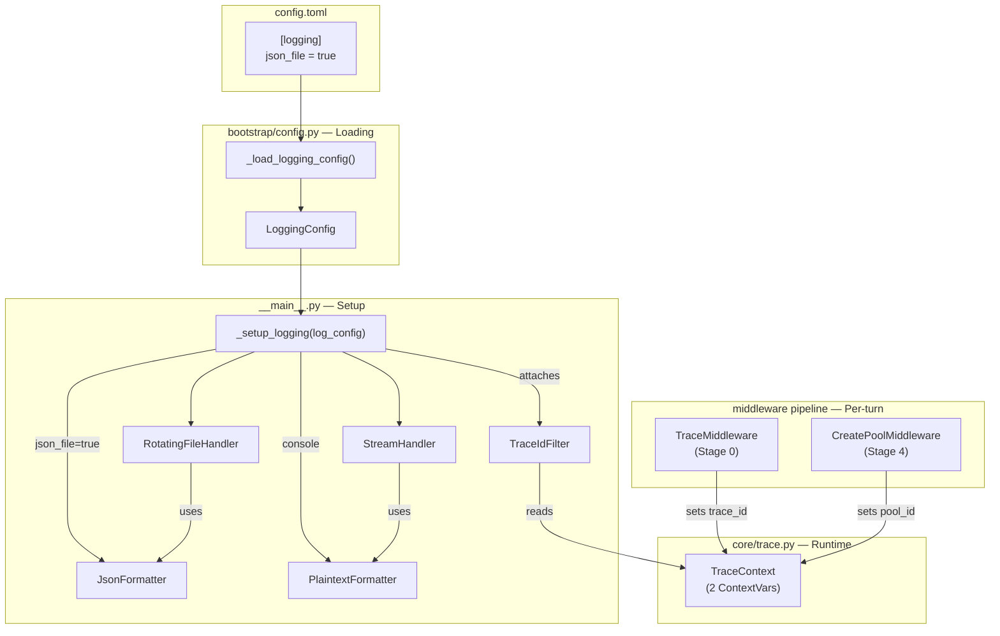
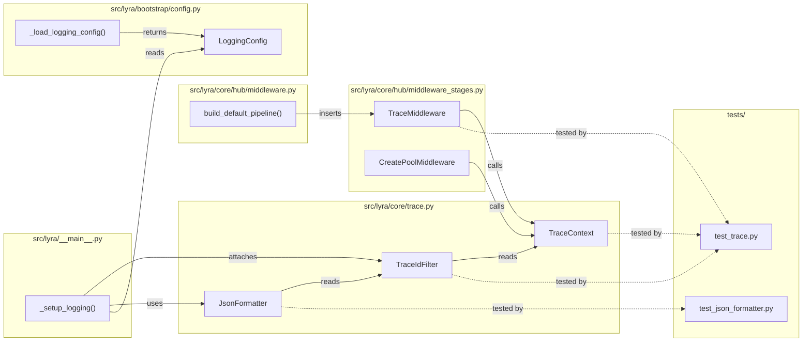

## Summary

Add per-turn trace IDs via `contextvars` and a `TraceIdFilter` that transparently injects `trace_id` + `pool_id` into all log records, plus a `JsonFormatter` for JSONL file output. No existing log call sites are modified — the filter enriches records at the handler level.

## Architecture

### Data Flow

### File x Function Map

## Agents

| Agent | Task count | Files |
|-------|-----------|-------|
| backend-dev | 7 | `core/trace.py`, `hub/middleware_stages.py`, `hub/middleware.py`, `bootstrap/config.py`, `__main__.py`, `config.toml` |
| tester | 3 | `tests/test_trace.py`, `tests/test_json_formatter.py` |
| doc-writer | 1 | `docs/OBSERVABILITY.md` |

## Consistency Report

- Criteria covered: 12/12
- Uncovered criteria: none
- Tasks without spec backing: 1 (Task 11: docs update — exempt: docs)
- Gold plating exemptions applied: 1

| SC | Criteria | Tasks |
|----|----------|-------|
| SC-1 | trace_id generated in TraceMiddleware | T4 |
| SC-2 | trace_id via ContextVar | T3 |
| SC-3 | pool_id via second ContextVar | T5 |
| SC-4 | trace_id in 4 logger modules | T3, T4, T6 |
| SC-5 | JSONL when json_file=true | T10 |
| SC-6 | JSON allowlist fields only | T8 |
| SC-7 | Console unchanged | T10 |
| SC-8 | jq trace_id returns one UUID | T1, T4 |
| SC-9 | Rotation unchanged | T10 (no-op: rotation config untouched) |
| SC-10 | No call-site changes | Architecture (verified in T1) |
| SC-11 | Logging never fails on missing context | T3 (defensive filter) |
| SC-12 | Hub.run() loop omits trace_id | T4 (scope boundary) |

## Micro-Tasks

### Slice V1: Trace context + filter + middleware

#### Task 1: Write TraceContext + TraceIdFilter tests [P] → tester
- **File:** `tests/test_trace.py`
- **Snippet:** `class TestTraceContext` — generate/get/set, `class TestTraceIdFilter` — filter enriches record, missing context handled
- **Verify:** `grep -q 'class TestTraceContext' tests/test_trace.py && grep -q 'class TestTraceIdFilter' tests/test_trace.py` (ready)
- **Expected:** Test file contains both test classes
- **Time:** 5 min | **Difficulty:** 2
- **Traces:** SC-2, SC-11, N1→N2 | **Phase:** RED

#### Task 2: Write TraceMiddleware + pool_id ContextVar tests [P] → tester
- **File:** `tests/test_trace.py`
- **Snippet:** `class TestTraceMiddleware` — sets trace_id before next(), `class TestPoolIdContextVar` — pool_id set in CreatePoolMiddleware
- **Verify:** `grep -q 'class TestTraceMiddleware' tests/test_trace.py` (ready)
- **Expected:** Test file contains middleware test class
- **Time:** 5 min | **Difficulty:** 3
- **Traces:** SC-1, SC-3, SC-12, N4→N5 | **Phase:** RED

#### RED-GATE: RED complete V1 → tester
- **Verify:** All RED tasks for V1 marked complete
- **Phase:** RED-GATE

#### Task 3: Create TraceContext module with ContextVars + TraceIdFilter → backend-dev
- **File:** `src/lyra/core/trace.py`
- **Snippet:** `_trace_id: ContextVar[str] = ContextVar('trace_id')`, `_pool_id: ContextVar[str] = ContextVar('pool_id')`, `class TraceIdFilter(logging.Filter)` — defensive get, sets `record.trace_id` + `record.pool_id`
- **Verify:** `python -c "from lyra.core.trace import TraceContext, TraceIdFilter; print('OK')"` (ready)
- **Expected:** `OK`
- **Time:** 5 min | **Difficulty:** 2
- **Traces:** SC-2, SC-3, SC-11, N1, N2 | **Phase:** GREEN

#### Task 4: Create TraceMiddleware + insert in build_default_pipeline → backend-dev
- **File:** `src/lyra/core/hub/middleware_stages.py` + `src/lyra/core/hub/middleware.py`
- **Snippet:** `class TraceMiddleware` — calls `TraceContext.set_trace_id(TraceContext.generate())` then `await next()`; in `build_default_pipeline()` insert `TraceMiddleware()` as first entry before `ValidatePlatformMiddleware()`
- **Verify:** `python -c "from lyra.core.hub.middleware_stages import TraceMiddleware; print('OK')"` (ready)
- **Expected:** `OK`
- **Time:** 5 min | **Difficulty:** 2
- **Traces:** SC-1, SC-12, N4 | **Phase:** GREEN

#### Task 5: Add pool_id ContextVar injection in CreatePoolMiddleware → backend-dev
- **File:** `src/lyra/core/hub/middleware_stages.py`
- **Snippet:** In `CreatePoolMiddleware.__call__()`, after `ctx.pool = pool` add `TraceContext.set_pool_id(ctx.binding.pool_id)`
- **Verify:** `grep -q 'set_pool_id' src/lyra/core/hub/middleware_stages.py` (ready)
- **Expected:** `set_pool_id` call found in middleware_stages.py
- **Time:** 3 min | **Difficulty:** 1
- **Traces:** SC-3, N5 | **Phase:** GREEN

#### Task 6: Attach TraceIdFilter to handlers in _setup_logging → backend-dev
- **File:** `src/lyra/__main__.py`
- **Snippet:** After handler creation: `trace_filter = TraceIdFilter()`, `file_handler.addFilter(trace_filter)`, `console_handler.addFilter(trace_filter)`
- **Verify:** `grep -q 'TraceIdFilter' src/lyra/__main__.py` (ready)
- **Expected:** TraceIdFilter imported and attached
- **Time:** 3 min | **Difficulty:** 1
- **Traces:** SC-4, SC-10 | **Phase:** GREEN

### Slice V2: JSON formatter + config

#### Task 7: Write JsonFormatter + LoggingConfig tests [P] → tester
- **File:** `tests/test_json_formatter.py`
- **Snippet:** `class TestJsonFormatter` — valid JSON output, allowlist fields only, missing fields omitted; `class TestLoggingConfig` — defaults, TOML override
- **Verify:** `grep -q 'class TestJsonFormatter' tests/test_json_formatter.py` (ready)
- **Expected:** Test file contains both test classes
- **Time:** 5 min | **Difficulty:** 2
- **Traces:** SC-5, SC-6, SC-7, N3, U1 | **Phase:** RED

#### RED-GATE: RED complete V2 → tester
- **Verify:** All RED tasks for V2 marked complete
- **Phase:** RED-GATE

#### Task 8: Add JsonFormatter to trace.py → backend-dev
- **File:** `src/lyra/core/trace.py`
- **Snippet:** `class JsonFormatter(logging.Formatter)` — `FIELD_ALLOWLIST = ("timestamp", "level", "logger", "message", "trace_id", "pool_id")`, `format()` emits `json.dumps()` of allowlisted fields only
- **Verify:** `python -c "from lyra.core.trace import JsonFormatter; print('OK')"` (ready)
- **Expected:** `OK`
- **Time:** 5 min | **Difficulty:** 2
- **Traces:** SC-5, SC-6, N3 | **Phase:** GREEN

#### Task 9: Add LoggingConfig dataclass + [logging] TOML section [P] → backend-dev
- **File:** `src/lyra/bootstrap/config.py` + `config.toml`
- **Snippet:** `class LoggingConfig(BaseModel): json_file: bool = True`; add `_load_logging_config()` following existing pattern; add `[logging]` section to `config.toml`
- **Verify:** `python -c "from lyra.bootstrap.config import LoggingConfig; print(LoggingConfig().json_file)"` (ready)
- **Expected:** `True`
- **Time:** 4 min | **Difficulty:** 2
- **Traces:** SC-5, U1 | **Phase:** GREEN

#### Task 10: Refactor _setup_logging for explicit handler construction + JsonFormatter → backend-dev
- **File:** `src/lyra/__main__.py`
- **Snippet:** Replace `basicConfig` with explicit `root = logging.getLogger()`, `root.addHandler(file_handler)`, `root.addHandler(console_handler)`; file handler gets `JsonFormatter` when `log_config.json_file == True`, else plaintext; console always plaintext; rotation config unchanged
- **Verify:** `python -c "from lyra.__main__ import _setup_logging; print('OK')"` (ready)
- **Expected:** `OK`
- **Time:** 8 min | **Difficulty:** 3
- **Traces:** SC-5, SC-7, SC-9, U1→N3 | **Phase:** GREEN

#### Task 11: Update OBSERVABILITY.md with trace ID docs → doc-writer
- **File:** `docs/OBSERVABILITY.md`
- **Snippet:** New `## Trace IDs` section documenting: generation point, ContextVar propagation, JSON format, grep usage. Update gaps section to mark trace IDs as resolved.
- **Verify:** `grep -q '## Trace IDs' docs/OBSERVABILITY.md` (ready)
- **Expected:** Section header found
- **Time:** 5 min | **Difficulty:** 1
- **Traces:** exempt (docs) | **Phase:** GREEN
