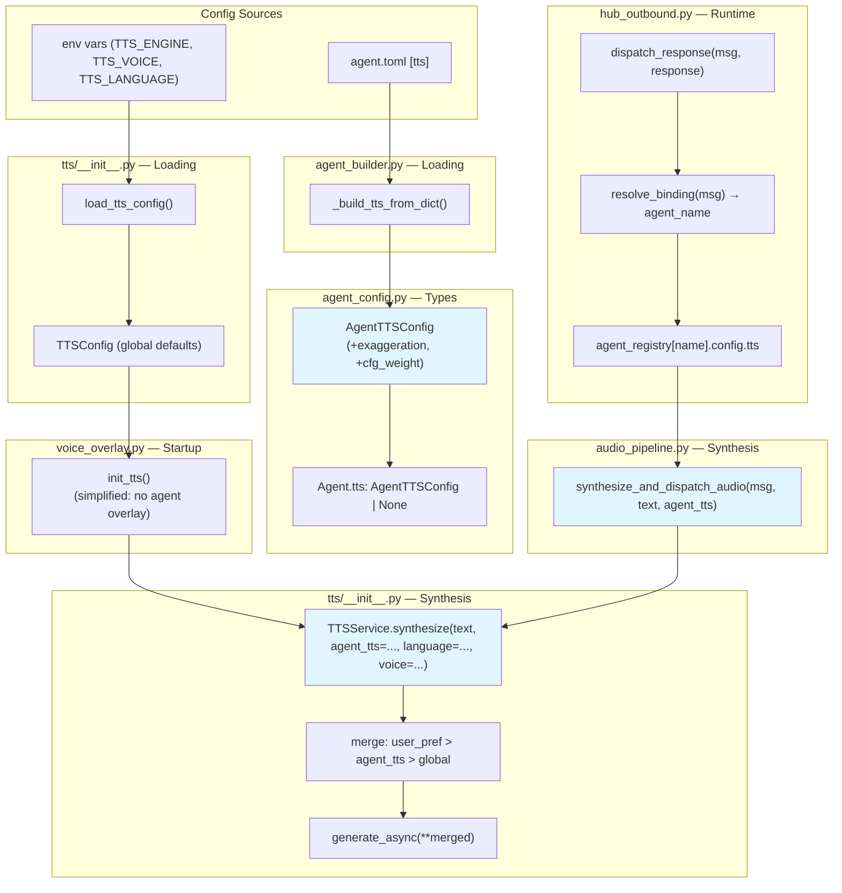
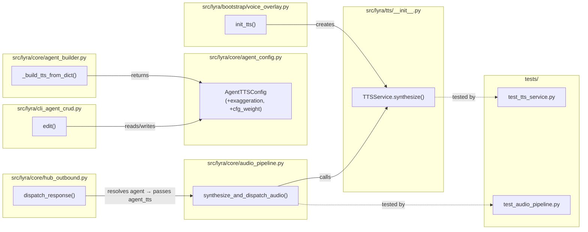

## Summary

Wire per-agent `AgentTTSConfig` through the hub's voice synthesis pipeline so each agent
speaks with its own voice/engine/personality. Add missing voiceCLI fields (`exaggeration`,
`cfg_weight`), remove the single-config startup logic, and expose TTS editing in the CLI.

## Architecture

### Data Flow

### File x Function Map

## Agents

| Agent | Task count | Files |
|-------|-----------|-------|
| backend-dev | 7 | `agent_config.py`, `agent_builder.py`, `tts/__init__.py`, `audio_pipeline.py`, `hub_outbound.py`, `voice_overlay.py`, `multibot.py`, `cli_agent_crud.py` |
| tester | 5 | `tests/tts/test_tts_service.py`, `tests/core/test_audio_pipeline.py` |

## Consistency Report

- Criteria covered: 21/21
- Uncovered criteria: none
- Tasks without spec backing: none
- Gold plating exemptions applied: 0

## Micro-Tasks

### Slice V1: Add `exaggeration`/`cfg_weight` + extend `synthesize()`

#### Task 1: Write tests for synthesize() with agent_tts parameter → tester
- **File:** `tests/tts/test_tts_service.py`
- **Snippet:** `async def test_synthesize_with_agent_tts_forwards_all_fields(): ...`
- **Verify:** `grep -q 'agent_tts' tests/tts/test_tts_service.py` (ready)
- **Expected:** Test file contains agent_tts test cases
- **Time:** 5 min
- **Difficulty:** 3
- **Traces:** SC-4, SC-5, SC-6, SC-7, SC-8, N1
- **Phase:** RED

#### Task 2: Write tests for exaggeration/cfg_weight deserialization → tester
- **File:** `tests/tts/test_tts_service.py`
- **Snippet:** `def test_agent_tts_config_has_exaggeration_and_cfg_weight(): ...`
- **Verify:** `grep -q 'exaggeration' tests/tts/test_tts_service.py` (ready)
- **Expected:** Test file contains field existence and builder tests
- **Time:** 3 min
- **Difficulty:** 2
- **Traces:** SC-1, SC-2, SC-3
- **Phase:** RED

#### RED-GATE: RED complete V1 → tester
- **Verify:** All test tasks for V1 marked complete
- **Phase:** RED-GATE

#### Task 3: Add exaggeration and cfg_weight fields to AgentTTSConfig [P] → backend-dev
- **File:** `src/lyra/core/agent_config.py`
- **Snippet:** `exaggeration: float | None = None` / `cfg_weight: float | None = None`
- **Verify:** `uv run python -c "from lyra.core.agent_config import AgentTTSConfig; c=AgentTTSConfig(exaggeration=0.6, cfg_weight=0.5); assert c.exaggeration==0.6"` (ready)
- **Expected:** No import or instantiation error
- **Time:** 2 min
- **Difficulty:** 1
- **Traces:** SC-1
- **Phase:** GREEN

#### Task 4: Update _build_tts_from_dict() to extract new fields [P] → backend-dev
- **File:** `src/lyra/core/agent_builder.py`
- **Snippet:** `exaggeration=tts_data.get("exaggeration"), cfg_weight=tts_data.get("cfg_weight")`
- **Verify:** `uv run python -c "from lyra.core.agent_builder import _build_tts_from_dict; c=_build_tts_from_dict({'exaggeration':0.6,'cfg_weight':0.5}); assert c.exaggeration==0.6"` (ready)
- **Expected:** Builder extracts both fields
- **Time:** 2 min
- **Difficulty:** 1
- **Traces:** SC-2, SC-3
- **Phase:** GREEN

#### Task 5: Update synthesize() — accept agent_tts, implement merge logic → backend-dev
- **File:** `src/lyra/tts/__init__.py`
- **Snippet:** `async def synthesize(self, text, *, agent_tts=None, language=None, voice=None) -> SynthesisResult:`
- **Verify:** `uv run pytest tests/tts/test_tts_service.py -x -q` (deferred)
- **Expected:** All TTS tests pass including new agent_tts tests
- **Time:** 8 min
- **Difficulty:** 4
- **Traces:** SC-4, SC-5, SC-6, SC-7, SC-8
- **Phase:** GREEN

### Slice V2: Wire per-agent config through hub; remove startup logic

#### Task 6: Write test for synthesize_and_dispatch_audio with agent_tts → tester
- **File:** `tests/core/test_audio_pipeline.py`
- **Snippet:** `async def test_synthesize_dispatch_passes_agent_tts(): ...`
- **Verify:** `grep -q 'agent_tts' tests/core/test_audio_pipeline.py` (ready)
- **Expected:** Test file contains agent_tts wiring test
- **Time:** 5 min
- **Difficulty:** 3
- **Traces:** SC-9, SC-10, SC-11
- **Phase:** RED

#### RED-GATE: RED complete V2 → tester
- **Verify:** All test tasks for V2 marked complete
- **Phase:** RED-GATE

#### Task 7: Update synthesize_and_dispatch_audio() to accept and forward agent_tts → backend-dev
- **File:** `src/lyra/core/audio_pipeline.py`
- **Snippet:** `async def synthesize_and_dispatch_audio(self, msg, text, agent_tts=None):`
- **Verify:** `uv run pytest tests/core/test_audio_pipeline.py -x -q` (deferred)
- **Expected:** Audio pipeline tests pass
- **Time:** 4 min
- **Difficulty:** 2
- **Traces:** SC-10
- **Phase:** GREEN

#### Task 8: Update dispatch_response() to resolve agent and pass tts config → backend-dev
- **File:** `src/lyra/core/hub_outbound.py`
- **Snippet:** `binding = self._hub.resolve_binding(msg); agent = self._hub.agent_registry.get(binding.agent_name); agent_tts = agent.config.tts if agent else None`
- **Verify:** `uv run pytest tests/core/test_audio_pipeline.py -x -q` (deferred)
- **Expected:** Agent TTS config resolved and passed to synthesis
- **Time:** 5 min
- **Difficulty:** 3
- **Traces:** SC-9, SC-11, SC-16
- **Phase:** GREEN

#### Task 9: Simplify init_tts() — remove first-agent-wins and warning → backend-dev
- **File:** `src/lyra/bootstrap/voice_overlay.py`
- **Snippet:** `def init_tts(stt_service, voice_responses_env) -> TTSService | None:`
- **Verify:** `grep -qv 'first alphabetically' src/lyra/bootstrap/voice_overlay.py && grep -qv 'Multiple agents' src/lyra/bootstrap/voice_overlay.py` (ready)
- **Expected:** Warning and first-agent logic removed; init_tts simplified
- **Time:** 5 min
- **Difficulty:** 3
- **Traces:** SC-12, SC-13, SC-14, SC-15
- **Phase:** GREEN

### Slice V3: `lyra agent edit` TTS support

#### Task 10: Write test for lyra agent edit TTS fields → tester
- **File:** `tests/tts/test_tts_service.py`
- **Snippet:** `def test_agent_tts_config_float_coercion(): ...`
- **Verify:** `grep -q 'float' tests/tts/test_tts_service.py` (ready)
- **Expected:** Test covers float coercion for exaggeration/cfg_weight
- **Time:** 3 min
- **Difficulty:** 2
- **Traces:** SC-19
- **Phase:** RED

#### RED-GATE: RED complete V3 → tester
- **Verify:** All test tasks for V3 marked complete
- **Phase:** RED-GATE

#### Task 11: Add TTS editing sub-section to lyra agent edit → backend-dev
- **File:** `src/lyra/cli_agent_crud.py`
- **Snippet:** `# TTS editing after scalar fields loop` / `if row.tts_json is not None: ...` / `else: offer init`
- **Verify:** `grep -q 'tts_json' src/lyra/cli_agent_crud.py && grep -q 'exaggeration' src/lyra/cli_agent_crud.py` (ready)
- **Expected:** TTS editing section added with float coercion
- **Time:** 8 min
- **Difficulty:** 3
- **Traces:** SC-17, SC-18, SC-19
- **Phase:** GREEN

#### Task 12: Verify no regression — existing tests pass → tester
- **File:** `tests/`
- **Snippet:** (full test suite)
- **Verify:** `uv run pytest tests/tts/ tests/core/test_audio_pipeline.py -x -q` (ready)
- **Expected:** All existing + new tests pass
- **Time:** 3 min
- **Difficulty:** 1
- **Traces:** SC-20, SC-21
- **Phase:** GREEN
