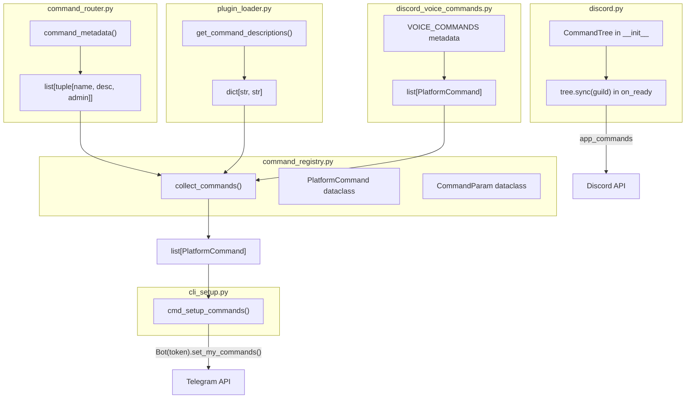
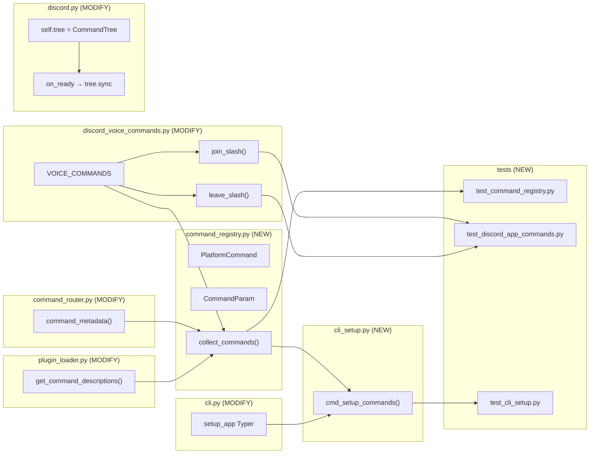

## Summary

Register Lyra's commands with each platform's native command menu. Three slices: (1) shared `PlatformCommand` registry with public `CommandRouter.command_metadata()`, (2) Telegram `set_my_commands()` via `lyra setup commands` CLI, (3) Discord `app_commands` for voice commands with `CommandTree` and guild-scoped sync. Routing layer is untouched — this is purely a cosmetic UX registration.

## Architecture





## Agents

| Agent | Tasks | Files |
|-------|-------|-------|
| backend-dev | 12 | `command_registry.py`, `command_router.py`, `plugin_loader.py`, `discord_voice_commands.py`, `cli_setup.py`, `cli.py`, `discord.py` |
| tester | 5 | `test_command_registry.py`, `test_discord_app_commands.py`, `test_cli_setup.py` |
| doc-writer | 1 | `docs/COMMANDS.md` |

## Consistency Report

- **Success criteria covered:** 15/15
- **Uncovered:** 0
- **Untraced tasks:** 0

## Micro-Tasks

### Slice 1 — Shared Command Registry

---

**T1.1 [P] — Add `command_metadata()` to `CommandRouter`** (backend-dev)
- **File:** `src/lyra/core/command_router.py`
- **Spec trace:** SC-1
- **Phase:** RED → GREEN
- **Difficulty:** 2
- **Description:** Add a public method that returns `list[tuple[str, str, bool]]` — (name, description, admin_only) from `_builtins` + plugin commands. Admin-only derived from description containing `(admin-only)`.
- **Code snippet:**
```python
def command_metadata(self) -> list[tuple[str, str, bool]]:
    """Return (name, description, admin_only) for all registered commands."""
    result: list[tuple[str, str, bool]] = []
    for name, cfg in self._builtins.items():
        admin = "(admin-only)" in cfg.description.lower()
        result.append((name, cfg.description, admin))
    plugin_cmds = self._plugin_loader.get_command_descriptions(self._enabled_plugins)
    for name, desc in plugin_cmds.items():
        result.append((name, desc, False))
    return sorted(result)
```
- **Verify:** `uv run pytest tests/core/test_command_router.py -k command_metadata -x`
- **Expected output:** PASSED
- **Time estimate:** 3 min

---

**T1.2 [P] — Add `get_command_descriptions()` to `PluginLoader`** (backend-dev)
- **File:** `src/lyra/core/plugin_loader.py`
- **Spec trace:** SC-1, SC-4
- **Phase:** RED → GREEN
- **Difficulty:** 1
- **Description:** New method returning `dict[str, str]` — command name → description for all commands in enabled plugins. Reads from loaded plugin manifests.
- **Code snippet:**
```python
def get_command_descriptions(self, enabled: list[str]) -> dict[str, str]:
    """Return {'/cmd': 'description'} for all commands in enabled plugins."""
    result: dict[str, str] = {}
    for name, plugin in self._loaded.items():
        if name in enabled:
            for cmd_spec in plugin.manifest.commands:
                result[f"/{cmd_spec.name}"] = cmd_spec.description
    return result
```
- **Verify:** `uv run pytest tests/core/test_command_router.py -k plugin -x`
- **Expected output:** PASSED
- **Time estimate:** 2 min

---

**T1.3 [P] — Add voice command metadata to `discord_voice_commands.py`** (backend-dev)
- **File:** `src/lyra/adapters/discord_voice_commands.py`
- **Spec trace:** SC-2
- **Phase:** RED → GREEN
- **Difficulty:** 2
- **Description:** Declare module-level `VOICE_COMMANDS` list with command metadata. These are consumed by the registry and later by Discord `app_commands` registration in Slice 3.
- **Code snippet:**
```python
from lyra.core.command_registry import PlatformCommand, CommandParam

VOICE_COMMANDS: list[PlatformCommand] = [
    PlatformCommand(
        name="/join",
        description="Join your voice channel",
        params=[CommandParam(name="mode", description="Connection mode", required=False, choices=["transient", "stay"])],
    ),
    PlatformCommand(
        name="/leave",
        description="Leave the voice channel",
    ),
]
```
- **Verify:** `python -c "from lyra.adapters.discord_voice_commands import VOICE_COMMANDS; print(len(VOICE_COMMANDS))"`
- **Expected output:** `2`
- **Time estimate:** 3 min

---

**T1.4 — Create `command_registry.py` with `PlatformCommand` + `collect_commands()`** (backend-dev)
- **File:** `src/lyra/core/command_registry.py` (NEW)
- **Spec trace:** SC-1, SC-2, SC-3
- **Phase:** RED → GREEN
- **Difficulty:** 3
- **Description:** Dataclasses `PlatformCommand` and `CommandParam`. Function `collect_commands()` takes `command_metadata` output + `plugin_descriptions` + `voice_commands` and returns unified `list[PlatformCommand]`. Depends on T1.1, T1.2, T1.3.
- **Code snippet:**
```python
from __future__ import annotations
from dataclasses import dataclass, field

@dataclass(frozen=True)
class CommandParam:
    name: str
    description: str = ""
    required: bool = False
    choices: list[str] = field(default_factory=list)

@dataclass(frozen=True)
class PlatformCommand:
    name: str
    description: str = ""
    params: list[CommandParam] = field(default_factory=list)
    admin_only: bool = False

def collect_commands(
    builtin_metadata: list[tuple[str, str, bool]],
    plugin_descriptions: dict[str, str],
    voice_commands: list[PlatformCommand],
) -> list[PlatformCommand]:
    """Merge all command sources into a unified PlatformCommand list."""
    commands: list[PlatformCommand] = []
    seen: set[str] = set()
    for name, desc, admin in builtin_metadata:
        commands.append(PlatformCommand(name=name, description=desc, admin_only=admin))
        seen.add(name)
    for name, desc in plugin_descriptions.items():
        if name not in seen:
            commands.append(PlatformCommand(name=name, description=desc))
            seen.add(name)
    for vc in voice_commands:
        if vc.name not in seen:
            commands.append(vc)
            seen.add(vc.name)
    return sorted(commands, key=lambda c: c.name)
```
- **Verify:** `uv run pytest tests/core/test_command_registry.py -x`
- **Expected output:** PASSED
- **Time estimate:** 5 min

---

**T1.5 — Tests for command registry** (tester)
- **File:** `tests/core/test_command_registry.py` (NEW)
- **Spec trace:** SC-1, SC-2, SC-3, SC-4
- **Phase:** RED (write tests first, then T1.4 makes them GREEN)
- **Difficulty:** 2
- **Description:** Test `collect_commands()`: builtins with admin flag, plugin commands included, voice commands included, deduplication, sorted output. Test `command_metadata()` on a real `CommandRouter` instance.
- **Verify:** `uv run pytest tests/core/test_command_registry.py -v`
- **Expected output:** All tests PASSED
- **Time estimate:** 5 min

---

**RED-GATE V1:** `uv run pytest tests/core/test_command_registry.py tests/core/test_command_router.py -x` — all pass before proceeding.

---

### Slice 2 — Telegram `set_my_commands()`

---

**T2.1 — Create `cli_setup.py` with `cmd_setup_commands()`** (backend-dev)
- **File:** `src/lyra/cli_setup.py` (NEW)
- **Spec trace:** SC-5, SC-6, SC-7, SC-8
- **Phase:** RED → GREEN
- **Difficulty:** 4
- **Description:** New Typer app with `commands` subcommand. For each Telegram bot in config: resolve token from `CredentialStore`, build `PluginLoader`, call `CommandRouter.command_metadata()` (class-level `_DEFAULT_BUILTINS` + loaded plugins), merge with voice commands via `collect_commands()`, filter `admin_only=False`, construct `BotCommand` list, call `Bot(token).set_my_commands()`, print confirmation.
- **Code snippet:**
```python
import asyncio
import typer
from lyra.core.command_registry import collect_commands

setup_app = typer.Typer(name="setup", help="One-time platform setup commands.")

@setup_app.command(name="commands")
def cmd_setup_commands(
    config: str = typer.Option("config.toml", "--config", "-c"),
) -> None:
    """Register commands with platform-native menus (Telegram setMyCommands)."""
    asyncio.run(_register_all(config))

async def _register_all(config_path: str) -> None:
    # load config, iterate telegram bots, per-bot: resolve token, collect commands, set_my_commands
    ...
```
- **Verify:** `uv run lyra setup commands --help`
- **Expected output:** Shows help text for the commands subcommand
- **Time estimate:** 8 min

---

**T2.2 — Wire `setup_app` into `cli.py`** (backend-dev)
- **File:** `src/lyra/cli.py`
- **Spec trace:** SC-6
- **Phase:** GREEN
- **Difficulty:** 1
- **Description:** Import `setup_app` from `cli_setup` and register with `lyra_app.add_typer(setup_app, name="setup")`.
- **Code snippet:**
```python
from lyra.cli_setup import setup_app
lyra_app.add_typer(setup_app, name="setup")
```
- **Verify:** `uv run lyra setup --help`
- **Expected output:** Shows `commands` subcommand
- **Time estimate:** 2 min

---

**T2.3 — Tests for CLI setup commands** (tester)
- **File:** `tests/cli/test_cli_setup.py` (NEW)
- **Spec trace:** SC-6, SC-7, SC-8
- **Phase:** RED → GREEN
- **Difficulty:** 3
- **Description:** Test `_register_all()` with mocked `CredentialStore` and `Bot`. Verify: calls `set_my_commands()` with correct `BotCommand` list, admin commands excluded, handles missing token gracefully, idempotent re-run.
- **Verify:** `uv run pytest tests/cli/test_cli_setup.py -v`
- **Expected output:** All tests PASSED
- **Time estimate:** 5 min

---

**RED-GATE V2:** `uv run pytest tests/cli/test_cli_setup.py tests/core/test_command_registry.py -x` — all pass before proceeding.

---

### Slice 3 — Discord `app_commands` for Voice

---

**T3.1 — Add `CommandTree` to `DiscordAdapter.__init__`** (backend-dev)
- **File:** `src/lyra/adapters/discord.py`
- **Spec trace:** SC-9
- **Phase:** RED → GREEN
- **Difficulty:** 2
- **Description:** In `__init__`, after `super().__init__(intents=intents)`, add `self.tree = discord.app_commands.CommandTree(self)`. Import `discord.app_commands`.
- **Code snippet:**
```python
super().__init__(intents=intents)
self.tree = discord.app_commands.CommandTree(self)
```
- **Verify:** `python -c "from lyra.adapters.discord import DiscordAdapter; print('ok')"`
- **Expected output:** `ok`
- **Time estimate:** 2 min

---

**T3.2 — Register `/join` and `/leave` as app_commands** (backend-dev)
- **File:** `src/lyra/adapters/discord_voice_commands.py`
- **Spec trace:** SC-9, SC-10, SC-11
- **Phase:** RED → GREEN
- **Difficulty:** 4
- **Description:** Add functions to register slash commands on a `CommandTree`. `/join` with optional `mode` choice parameter (transient/stay). `/leave` with no params. Both delegate to existing `handle_join_command()` / `handle_leave_command()`. Register via a `register_voice_app_commands(tree, adapter)` function called from `DiscordAdapter.__init__`.
- **Code snippet:**
```python
import discord

def register_voice_app_commands(tree: discord.app_commands.CommandTree, adapter: "DiscordAdapter") -> None:
    @tree.command(name="join", description="Join your voice channel")
    @discord.app_commands.describe(mode="Connection mode: transient (auto-leave) or stay (persistent)")
    @discord.app_commands.choices(mode=[
        discord.app_commands.Choice(name="transient", value="transient"),
        discord.app_commands.Choice(name="stay", value="stay"),
    ])
    async def join_slash(interaction: discord.Interaction, mode: str = "transient") -> None:
        # delegate to handle_join_command via interaction
        ...

    @tree.command(name="leave", description="Leave the voice channel")
    async def leave_slash(interaction: discord.Interaction) -> None:
        # delegate to handle_leave_command via interaction
        ...
```
- **Verify:** `uv run pytest tests/adapters/test_discord_app_commands.py -x`
- **Expected output:** PASSED
- **Time estimate:** 8 min

---

**T3.3 — Guild-scoped `tree.sync()` in `on_ready`** (backend-dev)
- **File:** `src/lyra/adapters/discord.py`
- **Spec trace:** SC-9, SC-13
- **Phase:** GREEN
- **Difficulty:** 2
- **Description:** In `on_ready()`, after existing logic, sync the command tree for each guild. Wrapped in try/except — log warning on failure, don't crash.
- **Code snippet:**
```python
# In on_ready(), after thread restoration:
for guild in self.guilds:
    try:
        await self.tree.sync(guild=guild)
        log.info("Synced app_commands for guild %s", guild.id)
    except Exception:
        log.warning("Failed to sync app_commands for guild %s", guild.id, exc_info=True)
```
- **Verify:** `uv run pytest tests/adapters/test_discord_app_commands.py -k sync -x`
- **Expected output:** PASSED
- **Time estimate:** 3 min

---

**T3.4 — Preserve `!join`/`!leave` text fallback** (backend-dev)
- **File:** `src/lyra/adapters/discord_voice_commands.py`
- **Spec trace:** SC-12
- **Phase:** GREEN (no code change — verify existing tests still pass)
- **Difficulty:** 1
- **Description:** Existing `handle_voice_command()` text parser is unchanged. This task is verification-only.
- **Verify:** `uv run pytest tests/adapters/test_discord_voice.py -x`
- **Expected output:** All existing tests PASSED
- **Time estimate:** 2 min

---

**T3.5 — Tests for Discord app_commands** (tester)
- **File:** `tests/adapters/test_discord_app_commands.py` (NEW)
- **Spec trace:** SC-9, SC-10, SC-11, SC-12, SC-13
- **Phase:** RED → GREEN
- **Difficulty:** 3
- **Description:** Test `register_voice_app_commands()` registers 2 commands on tree. Test `/join` interaction delegates to `handle_join_command()`. Test `/leave` interaction delegates to `handle_leave_command()`. Test `on_ready` sync failure is caught. Test backward compat: text `!join`/`!leave` still work.
- **Verify:** `uv run pytest tests/adapters/test_discord_app_commands.py -v`
- **Expected output:** All tests PASSED
- **Time estimate:** 5 min

---

**RED-GATE V3:** `uv run pytest tests/ -x --ignore=tests/e2e` — full suite passes.

---

### Post-Slice — Documentation

---

**T4.1 — Update `docs/COMMANDS.md` native registration section** (doc-writer)
- **File:** `docs/COMMANDS.md`
- **Spec trace:** SC-14
- **Phase:** GREEN
- **Difficulty:** 1
- **Description:** Replace the "Platform-native command menus" section (lines 92-99) to document the new behavior: Telegram registration via `lyra setup commands`, Discord `app_commands` for voice. Keep note about routing unchanged.
- **Verify:** `grep -c "lyra setup commands" docs/COMMANDS.md`
- **Expected output:** `>= 1`
- **Time estimate:** 3 min
