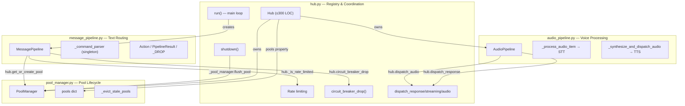
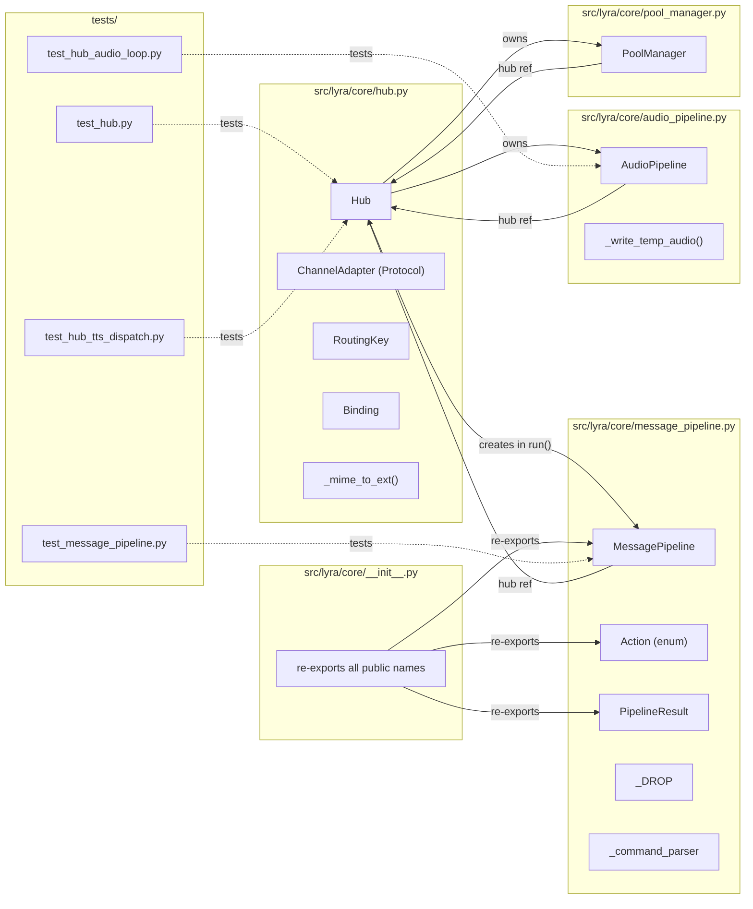

## Summary

Extract three cohesive classes from `core/hub.py` (1,367 LOC) into dedicated modules — `message_pipeline.py`, `audio_pipeline.py`, `pool_manager.py` — then slim Hub to ≤300 LOC as a registry + coordinator. Pure refactoring with zero behavior change, using `TYPE_CHECKING` guards to avoid circular imports.

## Architecture

### Data Flow



### File x Function Map



## Agents

| Agent | Task count | Files |
|-------|-----------|-------|
| backend-dev | 14 | `hub.py`, `message_pipeline.py`, `audio_pipeline.py`, `pool_manager.py`, `__init__.py` |
| tester | 4 | `test_message_pipeline.py`, `test_hub_audio_loop.py`, `test_hub.py`, `test_hub_tts_dispatch.py` |

## Consistency Report

- Criteria covered: 13/13
- Uncovered criteria: none
- Tasks without spec backing: none
- Gold plating exemptions applied: 0

## Micro-Tasks

### Slice V1: Extract MessagePipeline to `core/message_pipeline.py`

#### Task 1: Create `message_pipeline.py` with MessagePipeline, Action, PipelineResult, _DROP → backend-dev
- **File:** `src/lyra/core/message_pipeline.py`
- **Snippet:**
```python
from __future__ import annotations
import enum
from dataclasses import dataclass
from typing import TYPE_CHECKING
if TYPE_CHECKING:
    from .hub import Hub

class Action(enum.Enum): ...
@dataclass(frozen=True)
class PipelineResult: ...
_DROP = PipelineResult(action=Action.DROP)

class MessagePipeline:
    def __init__(self, hub: Hub) -> None: ...
    async def process(self, msg) -> PipelineResult: ...
```
- **Verify:** `uv run python -c "from lyra.core.message_pipeline import MessagePipeline, Action, PipelineResult; print('ok')"` (ready)
- **Expected:** `ok`
- **Time:** 8 min | **Difficulty:** 3
- **Traces:** SC-1, SC-7, SC-8, S1
- **Phase:** GREEN

#### Task 2: Move `_command_parser` singleton to `message_pipeline.py` → backend-dev
- **File:** `src/lyra/core/message_pipeline.py`
- **Snippet:** `_command_parser = CommandParser()` at module level, remove from `hub.py`
- **Verify:** `uv run python -c "from lyra.core.message_pipeline import MessagePipeline; print('ok')"` (ready)
- **Expected:** `ok`
- **Time:** 2 min | **Difficulty:** 1
- **Traces:** SC-7, S1
- **Phase:** GREEN

#### Task 3: Update `hub.py` — remove MessagePipeline class, import from new module, re-export → backend-dev
- **File:** `src/lyra/core/hub.py`
- **Snippet:**
```python
from .message_pipeline import Action, MessagePipeline, PipelineResult, _DROP
```
- **Verify:** `uv run python -c "from lyra.core.hub import MessagePipeline, Action, PipelineResult; print('ok')"` (ready)
- **Expected:** `ok`
- **Time:** 5 min | **Difficulty:** 2
- **Traces:** SC-1, SC-9, S5
- **Phase:** GREEN

#### Task 4: Verify existing MessagePipeline tests pass → tester
- **File:** `tests/core/test_message_pipeline.py`
- **Verify:** `uv run pytest tests/core/test_message_pipeline.py -x -q` (ready)
- **Expected:** all tests pass
- **Time:** 2 min | **Difficulty:** 1
- **Traces:** SC-10
- **Phase:** GREEN

#### RED-GATE: V1 complete → tester
- **Verify:** Tasks 1–4 complete, `uv run pytest tests/core/test_message_pipeline.py tests/core/test_hub_tts_dispatch.py -x -q` passes
- **Phase:** RED-GATE

### Slice V2: Extract AudioPipeline to `core/audio_pipeline.py`

#### Task 5: Create `audio_pipeline.py` with AudioPipeline class → backend-dev
- **File:** `src/lyra/core/audio_pipeline.py`
- **Snippet:**
```python
from __future__ import annotations
import asyncio, logging, os, tempfile, time
from pathlib import Path
from typing import TYPE_CHECKING
if TYPE_CHECKING:
    from .hub import Hub

class AudioPipeline:
    def __init__(self, hub: Hub) -> None:
        self._hub = hub
    async def run(self) -> None: ...  # was _audio_loop
    async def _process_audio_item(self, audio) -> None: ...
    async def _dispatch_audio_reply(self, audio, content, *, reply=True) -> None: ...
    async def _synthesize_and_dispatch_audio(self, msg, text) -> None: ...
    @staticmethod
    def _write_temp_audio(data: bytes, suffix: str) -> str: ...
```
- **Verify:** `uv run python -c "from lyra.core.audio_pipeline import AudioPipeline; print('ok')"` (ready)
- **Expected:** `ok`
- **Time:** 8 min | **Difficulty:** 3
- **Traces:** SC-2, SC-7, S2
- **Phase:** GREEN

#### Task 6: Update `hub.py` — remove audio methods, create AudioPipeline instance, delegate _audio_loop → backend-dev
- **File:** `src/lyra/core/hub.py`
- **Snippet:**
```python
from .audio_pipeline import AudioPipeline
# In Hub.__init__:
self._audio_pipeline = AudioPipeline(self)
# In run() or caller: replace self._audio_loop() with self._audio_pipeline.run()
```
- **Verify:** `uv run python -c "from lyra.core.hub import Hub; h = Hub(); print(hasattr(h, '_audio_pipeline'))"` (ready)
- **Expected:** `True`
- **Time:** 5 min | **Difficulty:** 2
- **Traces:** SC-2, SC-4, S5
- **Phase:** GREEN

#### Task 7: Verify existing audio tests pass → tester
- **File:** `tests/core/test_hub_audio_loop.py`
- **Verify:** `uv run pytest tests/core/test_hub_audio_loop.py -x -q` (ready)
- **Expected:** all tests pass
- **Time:** 2 min | **Difficulty:** 1
- **Traces:** SC-10
- **Phase:** GREEN

#### RED-GATE: V2 complete → tester
- **Verify:** Tasks 5–7 complete, `uv run pytest tests/core/test_hub_audio_loop.py -x -q` passes
- **Phase:** RED-GATE

### Slice V3: Extract PoolManager to `core/pool_manager.py`

#### Task 8: Create `pool_manager.py` with PoolManager class → backend-dev
- **File:** `src/lyra/core/pool_manager.py`
- **Snippet:**
```python
from __future__ import annotations
import asyncio, logging, time
from typing import TYPE_CHECKING
if TYPE_CHECKING:
    from .hub import Hub

class PoolManager:
    def __init__(self, hub: Hub) -> None:
        self._hub = hub
        self.pools: dict[str, Pool] = {}
        self._last_eviction_check: float = 0.0
    def get_or_create_pool(self, pool_id: str, agent_name: str) -> Pool: ...
    def _evict_stale_pools(self) -> None: ...
    async def flush_pool(self, pool_id: str, reason: str = "end") -> None: ...
    def set_debounce_ms(self, ms: int) -> None: ...
```
- **Verify:** `uv run python -c "from lyra.core.pool_manager import PoolManager; print('ok')"` (ready)
- **Expected:** `ok`
- **Time:** 8 min | **Difficulty:** 3
- **Traces:** SC-3, SC-7, S3, S4
- **Phase:** GREEN

#### Task 9: Update `hub.py` — remove pool methods, create PoolManager, add pools delegating property → backend-dev
- **File:** `src/lyra/core/hub.py`
- **Snippet:**
```python
from .pool_manager import PoolManager
# In Hub.__init__:
self._pool_manager = PoolManager(self)
# Delegating property:
@property
def pools(self) -> dict[str, Pool]:
    return self._pool_manager.pools
# Delegate methods:
def get_or_create_pool(self, pool_id, agent_name):
    return self._pool_manager.get_or_create_pool(pool_id, agent_name)
async def flush_pool(self, pool_id, reason="end"):
    await self._pool_manager.flush_pool(pool_id, reason)
def set_debounce_ms(self, ms):
    self._pool_manager.set_debounce_ms(ms)
```
- **Verify:** `uv run python -c "from lyra.core.hub import Hub; h = Hub(); print(type(h.pools))"` (ready)
- **Expected:** `<class 'dict'>`
- **Time:** 5 min | **Difficulty:** 2
- **Traces:** SC-3, SC-4, SC-5, S5, S6
- **Phase:** GREEN

#### Task 10: Promote `_circuit_breaker_drop` to `circuit_breaker_drop` (public) → backend-dev
- **File:** `src/lyra/core/hub.py`, `src/lyra/core/message_pipeline.py`
- **Snippet:** Rename `_circuit_breaker_drop` → `circuit_breaker_drop` in hub.py, update call in `message_pipeline.py`
- **Verify:** `uv run python -c "from lyra.core.hub import Hub; print(hasattr(Hub, 'circuit_breaker_drop'))"` (ready)
- **Expected:** `True`
- **Time:** 3 min | **Difficulty:** 1
- **Traces:** SC-6
- **Phase:** REFACTOR

#### Task 11: Update `shutdown()` to delegate pool iteration to PoolManager → backend-dev
- **File:** `src/lyra/core/hub.py`
- **Snippet:**
```python
async def shutdown(self):
    for pool_id in list(self._pool_manager.pools.keys()):
        await self._pool_manager.flush_pool(pool_id, "shutdown")
    # ... drain memory tasks, close memory, close turn store
```
- **Verify:** `uv run python -c "from lyra.core.hub import Hub; import asyncio; h = Hub(); asyncio.run(h.shutdown()); print('ok')"` (ready)
- **Expected:** `ok`
- **Time:** 3 min | **Difficulty:** 2
- **Traces:** SC-4, S6
- **Phase:** GREEN

#### Task 12: Verify existing hub + pool tests pass → tester
- **File:** `tests/core/test_hub.py`
- **Verify:** `uv run pytest tests/core/test_hub.py -x -q` (ready)
- **Expected:** all tests pass
- **Time:** 2 min | **Difficulty:** 1
- **Traces:** SC-10
- **Phase:** GREEN

#### RED-GATE: V3 complete → tester
- **Verify:** Tasks 8–12 complete, `uv run pytest tests/core/test_hub.py -x -q` passes
- **Phase:** RED-GATE

### Slice V4: Slim Hub + update imports + re-exports

#### Task 13: Update `core/__init__.py` to import from new modules → backend-dev
- **File:** `src/lyra/core/__init__.py`
- **Snippet:**
```python
from .hub import ChannelAdapter, Hub, RoutingKey
from .message_pipeline import Action, MessagePipeline, PipelineResult
# AudioPipeline and PoolManager are internal — not re-exported
```
- **Verify:** `uv run python -c "from lyra.core import Hub, MessagePipeline, Action, PipelineResult, ChannelAdapter, RoutingKey; print('ok')"` (ready)
- **Expected:** `ok`
- **Time:** 3 min | **Difficulty:** 1
- **Traces:** SC-8, SC-9
- **Phase:** GREEN

#### Task 14: Verify hub.py ≤ 300 LOC → backend-dev
- **File:** `src/lyra/core/hub.py`
- **Verify:** `wc -l src/lyra/core/hub.py` (ready)
- **Expected:** ≤ 300 lines
- **Time:** 2 min | **Difficulty:** 1
- **Traces:** SC-4
- **Phase:** GREEN

#### Task 15: Full test suite + lint + typecheck → tester
- **File:** all
- **Verify:** `uv run pytest -x -q && uv run ruff check . && uv run pyright` (ready)
- **Expected:** all pass, zero failures, zero violations, zero new errors
- **Time:** 5 min | **Difficulty:** 1
- **Traces:** SC-10, SC-11, SC-12, SC-13
- **Phase:** GREEN

#### RED-GATE: V4 complete → tester
- **Verify:** Tasks 13–15 complete, full suite green
- **Phase:** RED-GATE
