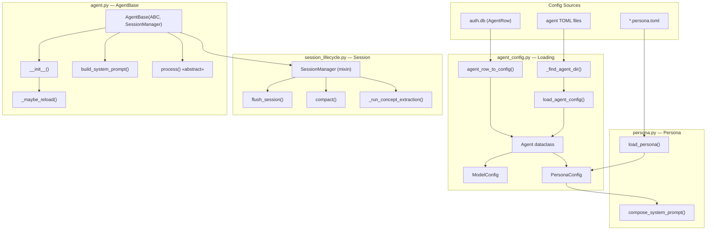
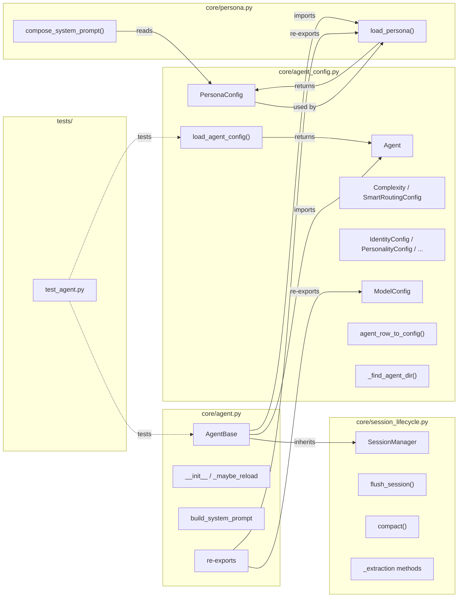

## Summary

Extract four concerns from the 1,218-line `core/agent.py` into three new focused modules (`agent_config.py`, `persona.py`, `session_lifecycle.py`) and slim `AgentBase` to ~300 LOC. All existing imports preserved via re-exports — zero consumer changes.

## Architecture

### Data Flow



### File x Function Map



## Agents

| Agent | Task count | Files |
|-------|-----------|-------|
| backend-dev | 10 | `core/agent_config.py`, `core/persona.py`, `core/session_lifecycle.py`, `core/agent.py` |
| tester | 4 | RED-GATE verification per slice |

## Consistency Report

- Criteria covered: 9/9
- Uncovered criteria: none
- Tasks without spec backing: none
- Gold plating exemptions applied: 0

## Micro-Tasks

### Slice V1: Extract `agent_config.py`

#### Task 1: Create `agent_config.py` with all dataclasses and constants → backend-dev
- **File:** `src/lyra/core/agent_config.py`
- **Snippet:**
```python
from __future__ import annotations
# Move: ModelConfig, Complexity, SmartRoutingConfig, IdentityConfig,
# PersonalityConfig, ExpertiseConfig, VoiceConfig, PersonaConfig,
# AgentTTSConfig, AgentSTTConfig, Agent
# Move: _VALID_BACKENDS, _MAX_PROMPT_BYTES, _USER_AGENTS_DIR,
# _SYSTEM_AGENTS_DIR, _AGENTS_DIR, AGENTS_DIR, _WORKSPACE_BUILTIN_CONFLICTS
```
- **Verify:** `uv run python -c "from lyra.core.agent_config import Agent, ModelConfig, Complexity; print('ok')"` (ready)
- **Expected:** `ok`
- **Time:** 5 min
- **Difficulty:** 2
- **Traces:** SC-2 (agent_config.py exists), U1, N1, N2
- **Phase:** GREEN

#### Task 2: Move `_find_agent_dir`, `load_agent_config`, `agent_row_to_config` to `agent_config.py` → backend-dev
- **File:** `src/lyra/core/agent_config.py`
- **Snippet:**
```python
def _find_agent_dir(name: str, agents_dir: Path | None) -> Path: ...
def load_agent_config(...) -> Agent: ...
def agent_row_to_config(...) -> Agent: ...
```
- **Verify:** `uv run python -c "from lyra.core.agent_config import load_agent_config, agent_row_to_config; print('ok')"` (ready)
- **Expected:** `ok`
- **Time:** 5 min
- **Difficulty:** 3
- **Traces:** SC-2, N1, N2
- **Phase:** GREEN

#### Task 3: Add re-exports in `agent.py` for all moved names → backend-dev
- **File:** `src/lyra/core/agent.py`
- **Snippet:**
```python
from .agent_config import (
    AGENTS_DIR, Agent, AgentSTTConfig, AgentTTSConfig, Complexity,
    ExpertiseConfig, IdentityConfig, ModelConfig, PersonaConfig,
    PersonalityConfig, SmartRoutingConfig, VoiceConfig,
    _AGENTS_DIR, _SYSTEM_AGENTS_DIR, _USER_AGENTS_DIR,
    _VALID_BACKENDS, _WORKSPACE_BUILTIN_CONFLICTS, _MAX_PROMPT_BYTES,
    _find_agent_dir, agent_row_to_config, load_agent_config,
)
```
- **Verify:** `uv run python -c "from lyra.core.agent import Agent, ModelConfig, load_agent_config, agent_row_to_config, Complexity, SmartRoutingConfig; print('ok')"` (ready)
- **Expected:** `ok`
- **Time:** 3 min
- **Difficulty:** 2
- **Traces:** SC-6 (all re-exports work)
- **Phase:** GREEN

#### RED-GATE: RED complete V1 → tester
- **Verify:** `uv run pytest tests/core/test_agent.py -x -q` (ready)
- **Expected:** All tests pass
- **Phase:** RED-GATE

### Slice V2: Extract `persona.py`

#### Task 4: Create `persona.py` with `load_persona` and `compose_system_prompt` → backend-dev
- **File:** `src/lyra/core/persona.py`
- **Snippet:**
```python
from __future__ import annotations
from .agent_config import (
    ExpertiseConfig, IdentityConfig, PersonaConfig,
    PersonalityConfig, VoiceConfig, _MAX_PROMPT_BYTES,
)

_VAULT_DIR = ...
_PERSONAS_DIR = ...

def load_persona(name: str, personas_dir: Path | None = None) -> PersonaConfig: ...
def compose_system_prompt(persona: PersonaConfig) -> str: ...
```
- **Verify:** `uv run python -c "from lyra.core.persona import load_persona, compose_system_prompt; print('ok')"` (ready)
- **Expected:** `ok`
- **Time:** 5 min
- **Difficulty:** 2
- **Traces:** SC-3, U3, N3, N4
- **Phase:** GREEN

#### Task 5: Add persona re-exports in `agent.py` → backend-dev
- **File:** `src/lyra/core/agent.py`
- **Snippet:**
```python
from .persona import _PERSONAS_DIR, _VAULT_DIR, compose_system_prompt, load_persona
```
- **Verify:** `uv run python -c "from lyra.core.agent import load_persona, compose_system_prompt; print('ok')"` (ready)
- **Expected:** `ok`
- **Time:** 2 min
- **Difficulty:** 1
- **Traces:** SC-6
- **Phase:** GREEN

#### RED-GATE: RED complete V2 → tester
- **Verify:** `uv run pytest tests/core/test_agent.py -x -q` (ready)
- **Expected:** All tests pass
- **Phase:** RED-GATE

### Slice V3: Extract `session_lifecycle.py`

#### Task 6: Create `session_lifecycle.py` with `SessionManager` mixin → backend-dev
- **File:** `src/lyra/core/session_lifecycle.py`
- **Snippet:**
```python
from __future__ import annotations
import asyncio, json, logging
from typing import TYPE_CHECKING
if TYPE_CHECKING:
    from .memory import MemoryManager, SessionSnapshot
    from .pool import Pool

MODEL_CONTEXT_TOKENS = 200_000
COMPACT_THRESHOLD = int(0.8 * MODEL_CONTEXT_TOKENS)
COMPACT_TAIL = 10

class SessionManager:
    """Mixin owning session flush, compaction, and extraction."""
    # Typed attribute stubs for pyright
    _memory: "MemoryManager | None" = None
    _task_registry: set | None = None
    _compact_context_tokens: int = MODEL_CONTEXT_TOKENS

    async def flush_session(self, pool: "Pool", reason: str = "end") -> None: ...
    async def _summarize_session(self, pool: "Pool") -> str: ...
    async def compact(self, pool: "Pool") -> None: ...
    def _schedule_extraction(self, ...) -> None: ...
    async def _extraction_llm_call(self, prompt: str) -> str: ...
    async def _run_concept_extraction(self, ...) -> None: ...
    async def _run_preference_extraction(self, ...) -> None: ...
```
- **Verify:** `uv run python -c "from lyra.core.session_lifecycle import SessionManager, MODEL_CONTEXT_TOKENS; print('ok')"` (ready)
- **Expected:** `ok`
- **Time:** 8 min
- **Difficulty:** 3
- **Traces:** SC-4, SC-5, U4, N5, N6, N7, N8
- **Phase:** GREEN

#### Task 7: Make `AgentBase` inherit `SessionManager` and remove moved methods → backend-dev
- **File:** `src/lyra/core/agent.py`
- **Snippet:**
```python
from .session_lifecycle import MODEL_CONTEXT_TOKENS, SessionManager, COMPACT_TAIL

class AgentBase(ABC, SessionManager):
    # flush_session, compact, _summarize_session, etc. removed
    # __init__ still sets self._memory, self._task_registry, self._compact_context_tokens
```
- **Verify:** `uv run python -c "from lyra.core.agent import AgentBase; print(AgentBase.__mro__)"` (ready)
- **Expected:** MRO includes `SessionManager` before `ABC`
- **Time:** 5 min
- **Difficulty:** 3
- **Traces:** SC-4, SC-5, S1
- **Phase:** GREEN

#### Task 8: Add session_lifecycle re-exports in `agent.py` → backend-dev
- **File:** `src/lyra/core/agent.py`
- **Snippet:**
```python
from .session_lifecycle import COMPACT_TAIL, COMPACT_THRESHOLD, MODEL_CONTEXT_TOKENS, SessionManager
```
- **Verify:** `uv run python -c "from lyra.core.agent import MODEL_CONTEXT_TOKENS, COMPACT_THRESHOLD; print('ok')"` (ready)
- **Expected:** `ok`
- **Time:** 2 min
- **Difficulty:** 1
- **Traces:** SC-6
- **Phase:** GREEN

#### RED-GATE: RED complete V3 → tester
- **Verify:** `uv run pytest tests/core/test_agent.py -x -q` (ready)
- **Expected:** All tests pass
- **Phase:** RED-GATE

### Slice V4: Slim `agent.py` + full verification

#### Task 9: Clean up `agent.py` — remove dead imports, verify line count → backend-dev
- **File:** `src/lyra/core/agent.py`
- **Snippet:** Remove unused imports (`tomllib`, `Enum`, `os` if no longer needed). Verify `_PLUGINS_DIR` stays. Ensure `_update_persona_tracking` imports `_PERSONAS_DIR` from `.persona`.
- **Verify:** `wc -l src/lyra/core/agent.py` (ready)
- **Expected:** ≤ 350 lines
- **Time:** 5 min
- **Difficulty:** 2
- **Traces:** SC-1, S2, S3, S4
- **Phase:** REFACTOR

#### Task 10: Verify `core/__init__.py` unchanged and all re-exports work → backend-dev
- **File:** `src/lyra/core/__init__.py`
- **Snippet:** No changes needed — still imports `Agent, AgentBase` from `.agent`.
- **Verify:** `uv run python -c "from lyra.core import Agent, AgentBase; print('ok')"` (ready)
- **Expected:** `ok`
- **Time:** 2 min
- **Difficulty:** 1
- **Traces:** SC-6, S4
- **Phase:** GREEN

#### RED-GATE: RED complete V4 → tester
- **Verify:** `uv run pytest -x -q && uv run ruff check . && uv run pyright` (ready)
- **Expected:** All pass — 0 failures, 0 lint errors, 0 type errors
- **Phase:** RED-GATE
