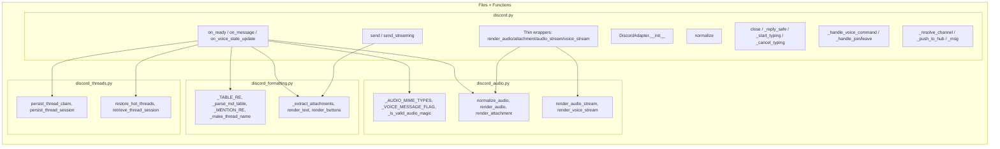

## Summary

Extract three concern modules from `adapters/discord.py` (1,452 LOC): formatting (~80 LOC), audio (~300 LOC), threads (~100 LOC). The adapter keeps gateway-coupled logic and delegates via thin wrappers. Pure structural refactor — no behavior changes.

## Architecture

```mermaid
flowchart TD
    subgraph "discord.py (≤1,000 LOC after)"
        DA[DiscordAdapter]
        DML[DISCORD_MAX_LENGTH]
        DC[DiscordConfig]
        TW1["render_audio → thin wrapper"]
        TW2["render_attachment → thin wrapper"]
        TW3["render_audio_stream → thin wrapper"]
        TW4["render_voice_stream → thin wrapper"]
    end
    subgraph "discord_formatting.py (~80 LOC)"
        FMT_TABLE["_TABLE_RE + _parse_md_table"]
        FMT_THREAD["_MENTION_RE + _make_thread_name"]
        FMT_ATT["_extract_attachments"]
        FMT_RENDER["render_text + render_buttons"]
    end
    subgraph "discord_audio.py (~300 LOC)"
        AUD_CONST["_AUDIO_MIME_TYPES + _VOICE_MESSAGE_FLAG"]
        AUD_MAGIC["_is_valid_audio_magic"]
        AUD_NORM["normalize_audio"]
        AUD_SEND["render_audio + render_attachment"]
        AUD_STREAM["render_audio_stream + render_voice_stream"]
    end
    subgraph "discord_threads.py (~100 LOC)"
        THR_CLAIM["persist_thread_claim"]
        THR_SESSION["persist_thread_session"]
        THR_HOT["restore_hot_threads"]
        THR_GET["retrieve_thread_session"]
    end
    subgraph "_shared.py (unchanged)"
        SH["chunk_text, buffer_audio_chunks, parse_reply_to_id, sanitize_filename, truncate_caption"]
    end

    DA --> FMT_RENDER & FMT_THREAD & FMT_ATT
    DA --> AUD_MAGIC & AUD_NORM
    TW1 --> AUD_SEND
    TW2 --> AUD_SEND
    TW3 --> AUD_STREAM
    TW4 --> AUD_STREAM
    DA --> THR_CLAIM & THR_SESSION & THR_HOT & THR_GET
    FMT_RENDER --> DML
    FMT_ATT -.-> AUD_CONST
    AUD_SEND --> DML
    FMT_RENDER --> SH
    AUD_SEND --> SH
    AUD_STREAM --> SH
```





## Agents

| Agent | Tasks | Files |
|-------|-------|-------|
| backend-dev | 10 | `discord_formatting.py`, `discord_audio.py`, `discord_threads.py`, `discord.py` |
| tester | 2 | `test_discord.py`, `test_discord_audio.py` |

## Reference Patterns

- `discord_voice.py` — existing extracted module, same pattern (free functions + classes, explicit deps, imports from `core.message`)
- `_shared.py` — shared utilities already imported by `discord.py`

## Consistency Report

| Spec criterion | Tasks covering | Status |
|---|---|---|
| SC-1: `discord_formatting.py` symbols | T1.1, T1.2, T1.3 | Covered |
| SC-2: `discord_audio.py` symbols | T2.1, T2.2, T2.3 | Covered |
| SC-3: `discord_threads.py` symbols | T3.1, T3.2 | Covered |
| SC-4: `discord.py` ≤ 1,000 LOC | T4.1 | Covered |
| SC-5: No `_shared.py` duplication | T4.1 | Covered |
| SC-6: All imports updated | T1.3, T2.3, T3.2, T4.1 | Covered |
| SC-7: No files outside adapters/ | T4.1 | Covered |
| SC-8: pytest passes | T4.1 | Covered |
| SC-9: ruff clean | T4.1 | Covered |
| SC-10: No behavior change | T4.1, T4.2 | Covered |

Covered: 10/10. Uncovered: 0. Untraced: 0.

---

## Micro-Tasks

### Slice 1: Extract formatting

#### T1.1 — Create `discord_formatting.py` with constants and free functions [P]
- **Agent:** backend-dev
- **File:** `src/lyra/adapters/discord_formatting.py` (new)
- **Description:** Create module with `_TABLE_RE`, `_parse_md_table`, `_MENTION_RE`, `_make_thread_name`, `_extract_attachments`. Move these verbatim from `discord.py`. `_extract_attachments` imports `_AUDIO_MIME_TYPES` from `discord_audio` (created in T2.1).
- **Code snippet:**
```python
"""Text formatting and UI helpers for DiscordAdapter."""
from __future__ import annotations
import re
from typing import Any
import discord
from tabulate import tabulate
from lyra.adapters._shared import chunk_text
from lyra.adapters.discord_audio import _AUDIO_MIME_TYPES
from lyra.core.message import Attachment

_TABLE_RE = re.compile(...)  # move from discord.py:64-69
def _parse_md_table(match: re.Match[str]) -> str: ...  # discord.py:72-89
_MENTION_RE = re.compile(r"<@!?\d+>")  # discord.py:233
def _make_thread_name(content: str, fallback: str) -> str: ...  # discord.py:236-246
def _extract_attachments(raw_attachments: list[Any]) -> list[Attachment]: ...  # discord.py:249-270
```
- **Verify:** `python -c "from lyra.adapters.discord_formatting import _parse_md_table, _make_thread_name, _extract_attachments, _TABLE_RE, _MENTION_RE"`
- **Spec trace:** SC-1
- **Slice:** V1
- **Phase:** RED
- **Difficulty:** 2
- **Time:** 5 min

#### T1.2 — Add `render_text` and `render_buttons` to `discord_formatting.py` [P]
- **Agent:** backend-dev
- **File:** `src/lyra/adapters/discord_formatting.py`
- **Description:** Extract `self._render_text` → `render_text(text, max_length)` and `self._render_buttons` → `render_buttons(buttons)`. These have no instance state. `render_text` imports `DISCORD_MAX_LENGTH` from `discord.py` and `chunk_text` from `_shared`.
- **Code snippet:**
```python
from lyra.adapters.discord import DISCORD_MAX_LENGTH

def render_text(text: str, max_length: int = DISCORD_MAX_LENGTH) -> list[str]:
    text = _TABLE_RE.sub(_parse_md_table, text)
    return chunk_text(text, max_length)

def render_buttons(buttons: list) -> discord.ui.View | None:
    if not buttons:
        return None
    view = discord.ui.View()
    for b in buttons:
        view.add_item(discord.ui.Button(label=b.text, custom_id=b.callback_data))
    return view
```
- **Verify:** `python -c "from lyra.adapters.discord_formatting import render_text, render_buttons"`
- **Spec trace:** SC-1
- **Slice:** V1
- **Phase:** GREEN
- **Difficulty:** 1
- **Time:** 3 min

#### T1.3 — Update `discord.py` to import from `discord_formatting` [P]
- **Agent:** backend-dev
- **File:** `src/lyra/adapters/discord.py`
- **Description:** Remove moved code (constants, functions). Add imports from `discord_formatting`. Replace `self._render_text(...)` → `render_text(...)` and `self._render_buttons(...)` → `render_buttons(...)` in `send()` and `send_streaming()`. Replace `_extract_attachments(...)` call in `on_message`. Replace `_make_thread_name(...)` call.
- **Verify:** `uv run ruff check src/lyra/adapters/discord.py src/lyra/adapters/discord_formatting.py`
- **Spec trace:** SC-1, SC-6
- **Slice:** V1
- **Phase:** GREEN
- **Difficulty:** 2
- **Time:** 5 min

---

### Slice 2: Extract audio

#### T2.1 — Create `discord_audio.py` with constants and detection [P]
- **Agent:** backend-dev
- **File:** `src/lyra/adapters/discord_audio.py` (new)
- **Description:** Create module with `_AUDIO_MIME_TYPES`, `_VOICE_MESSAGE_FLAG`, `_is_valid_audio_magic`. Move verbatim from `discord.py`.
- **Code snippet:**
```python
"""Audio detection, normalization, and rendering for DiscordAdapter."""
from __future__ import annotations
_VOICE_MESSAGE_FLAG = 8192
_AUDIO_MIME_TYPES = frozenset({...})  # discord.py:108-118
def _is_valid_audio_magic(data: bytes) -> bool: ...  # discord.py:121-150
```
- **Verify:** `python -c "from lyra.adapters.discord_audio import _AUDIO_MIME_TYPES, _VOICE_MESSAGE_FLAG, _is_valid_audio_magic"`
- **Spec trace:** SC-2
- **Slice:** V2
- **Phase:** RED
- **Difficulty:** 1
- **Time:** 3 min

#### T2.2 — Add `normalize_audio` and render functions to `discord_audio.py`
- **Agent:** backend-dev
- **File:** `src/lyra/adapters/discord_audio.py`
- **Description:** Extract `normalize_audio` (pass `bot_id` explicitly), `render_audio` (pass `bot_id`, `resolve_channel`, `http`), `render_attachment` (pass `resolve_channel`), `render_audio_stream` (pass `render_audio_fn` callback), `render_voice_stream` (pass `vsm`). All as async free functions. Import `Platform`, `RoutingContext`, `InboundAudio`, etc. from `core.message`. Import `parse_reply_to_id`, `sanitize_filename`, `truncate_caption`, `buffer_audio_chunks`, `_PartialAudioError`, `_AUDIO_EXTS` from `_shared`. Import `DISCORD_MAX_LENGTH` from `discord`.
- **Code snippet:**
```python
from lyra.adapters._shared import (
    _AUDIO_EXTS, _PartialAudioError, buffer_audio_chunks,
    parse_reply_to_id, sanitize_filename, truncate_caption,
)
from lyra.adapters.discord import DISCORD_MAX_LENGTH
from lyra.core.message import (
    InboundAudio, InboundMessage, OutboundAttachment, OutboundAudio,
    OutboundAudioChunk, Platform, RoutingContext,
)

def normalize_audio(raw, audio_bytes, mime_type, *, bot_id, trust_level) -> InboundAudio: ...
async def render_audio(msg, inbound, *, bot_id, resolve_channel, http) -> None: ...
async def render_attachment(msg, inbound, *, resolve_channel, attachment_exts) -> None: ...
async def render_audio_stream(chunks, inbound, render_audio_fn) -> None: ...
async def render_voice_stream(chunks, inbound, vsm) -> None: ...
```
- **Verify:** `python -c "from lyra.adapters.discord_audio import normalize_audio, render_audio, render_attachment, render_audio_stream, render_voice_stream"`
- **Spec trace:** SC-2
- **Slice:** V2
- **Phase:** GREEN
- **Difficulty:** 3
- **Time:** 8 min

#### T2.3 — Update `discord.py`: remove audio code, add thin wrappers
- **Agent:** backend-dev
- **File:** `src/lyra/adapters/discord.py`
- **Description:** Remove `_AUDIO_MIME_TYPES`, `_VOICE_MESSAGE_FLAG`, `_is_valid_audio_magic`, `normalize_audio`, `render_audio`, `render_attachment`, `render_audio_stream`, `render_voice_stream` from `discord.py`. Import from `discord_audio`. Add thin wrappers for the 4 render methods (2–4 lines each, pass `self` deps). Update `on_message` to call `discord_audio._is_valid_audio_magic` and `discord_audio.normalize_audio` with `bot_id=self._bot_id`.
- **Code snippet (thin wrapper example):**
```python
async def render_audio(self, msg: OutboundAudio, inbound: InboundMessage) -> None:
    await discord_audio.render_audio(
        msg, inbound, bot_id=self._bot_id,
        resolve_channel=self._resolve_channel, http=self.http,
    )
```
- **Verify:** `uv run ruff check src/lyra/adapters/discord.py src/lyra/adapters/discord_audio.py`
- **Spec trace:** SC-2, SC-6
- **Slice:** V2
- **Phase:** GREEN
- **Difficulty:** 3
- **Time:** 8 min

---

### Slice 3: Extract threads

#### T3.1 — Create `discord_threads.py` with all 4 functions [P]
- **Agent:** backend-dev
- **File:** `src/lyra/adapters/discord_threads.py` (new)
- **Description:** Create module with:
  - `persist_thread_claim(thread_store, thread_id, bot_id, channel_id, guild_id)` — extracted from `self._persist_thread_claim`
  - `persist_thread_session(thread_store, msg, session_id, pool_id, bot_id, cache)` — extracted from `self._persist_thread_session`, takes `cache: dict` as mutable arg for `_thread_sessions` update
  - `restore_hot_threads(thread_store, bot_id, hot_hours)` → `set[int]` — new function extracted from inlined `on_ready` logic (lines 393–413)
  - `retrieve_thread_session(thread_store, thread_id, bot_id, cache)` → `(str|None, str|None)` — new function extracted from inlined `on_message` logic (lines 967–997)
- **Code snippet:**
```python
"""Thread ownership tracking and session persistence for DiscordAdapter."""
from __future__ import annotations
import logging
from typing import TYPE_CHECKING, Any
if TYPE_CHECKING:
    from lyra.core.message import InboundMessage
    from lyra.core.thread_store import ThreadStore

log = logging.getLogger(__name__)

async def persist_thread_claim(
    thread_store: "ThreadStore", thread_id: int, bot_id: str,
    channel_id: int, guild_id: int | None,
) -> None: ...

async def persist_thread_session(
    thread_store: "ThreadStore", msg: "InboundMessage",
    session_id: str, pool_id: str, bot_id: str,
    cache: dict[str, tuple[str, str]],
) -> None:
    # ... DB persist ...
    cache[str(thread_id)] = (session_id, pool_id)  # mutate caller's dict

async def restore_hot_threads(
    thread_store: "ThreadStore", bot_id: str, hot_hours: int,
) -> set[int]: ...

async def retrieve_thread_session(
    thread_store: "ThreadStore", thread_id: str, bot_id: str,
    cache: dict[str, tuple[str, str]],
) -> tuple[str | None, str | None]: ...
```
- **Verify:** `python -c "from lyra.adapters.discord_threads import persist_thread_claim, persist_thread_session, restore_hot_threads, retrieve_thread_session"`
- **Spec trace:** SC-3
- **Slice:** V3
- **Phase:** RED
- **Difficulty:** 3
- **Time:** 8 min

#### T3.2 — Update `discord.py`: remove thread code, delegate to `discord_threads`
- **Agent:** backend-dev
- **File:** `src/lyra/adapters/discord.py`
- **Description:** Remove `_persist_thread_claim`, `_persist_thread_session`. Replace inlined thread restoration in `on_ready` with `self._owned_threads = await restore_hot_threads(self._thread_store, self._bot_id, self._thread_hot_hours)`. Replace inlined session retrieval in `on_message` with `_stored_session_id, _stored_pool_id = await retrieve_thread_session(self._thread_store, ...)`. Update `_persist_thread_session` callback in `platform_meta` to use `discord_threads.persist_thread_session` with `cache=self._thread_sessions`.
- **Verify:** `uv run ruff check src/lyra/adapters/discord.py src/lyra/adapters/discord_threads.py`
- **Spec trace:** SC-3, SC-6
- **Slice:** V3
- **Phase:** GREEN
- **Difficulty:** 3
- **Time:** 5 min

---

### Slice 4: Verify & clean

#### RED-GATE — All slices must be complete before proceeding.

#### T4.1 — Run full test suite + linter, verify LOC target
- **Agent:** tester
- **File:** all adapters
- **Description:** Run `uv run pytest tests/adapters/test_discord.py tests/adapters/test_discord_audio.py -x`, then `uv run ruff check src/lyra/adapters/`. Verify `wc -l src/lyra/adapters/discord.py` ≤ 1,000. Verify no imports from `_shared` are duplicated in new modules (only imports, no copy-paste of function bodies). Verify no files outside `src/lyra/adapters/` were modified.
- **Verify:** `uv run pytest tests/ -x && uv run ruff check . && wc -l src/lyra/adapters/discord.py`
- **Expected output:** All tests pass, no lint errors, LOC ≤ 1,000
- **Spec trace:** SC-4, SC-5, SC-7, SC-8, SC-9, SC-10
- **Slice:** V4
- **Phase:** RED-GATE
- **Difficulty:** 1
- **Time:** 3 min

#### T4.2 — Fix any test import breakage
- **Agent:** tester
- **File:** `tests/adapters/test_discord.py`, `tests/adapters/test_discord_audio.py`
- **Description:** If tests import symbols that moved (e.g. `_is_valid_audio_magic`, `_AUDIO_MIME_TYPES` from `discord`), update imports to point to new modules. Existing test logic should not change — only import paths.
- **Verify:** `uv run pytest tests/adapters/test_discord.py tests/adapters/test_discord_audio.py -x -v`
- **Spec trace:** SC-8, SC-10
- **Slice:** V4
- **Phase:** REFACTOR
- **Difficulty:** 2
- **Time:** 5 min
