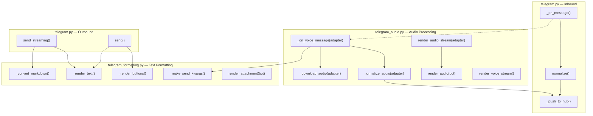
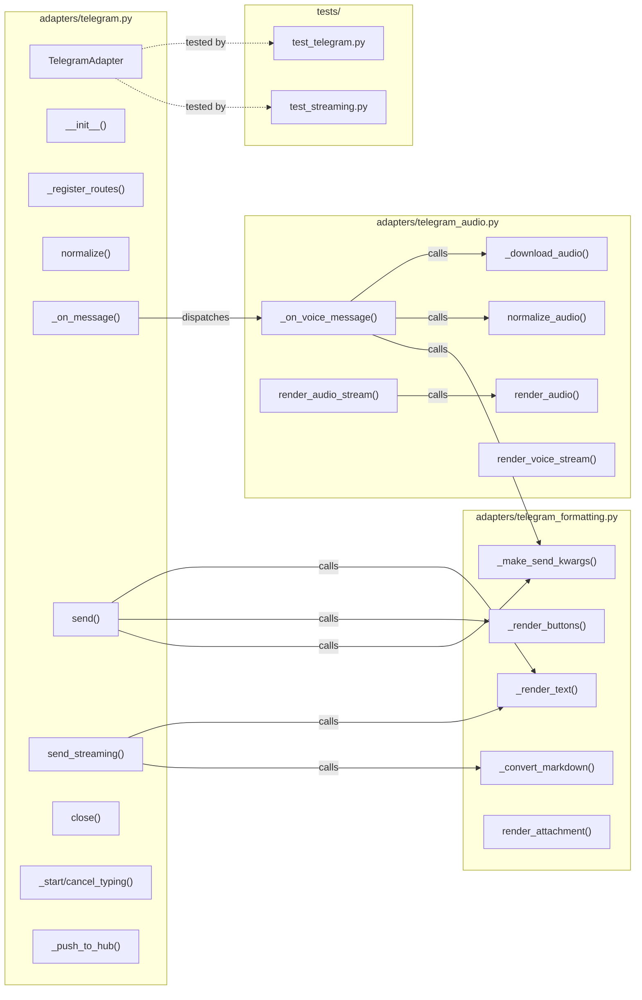

## Summary

Mechanical refactor: extract formatting constants/functions and audio methods from the 1,143-line `telegram.py` into two focused modules (`telegram_formatting.py` ~105 LOC, `telegram_audio.py` ~310 LOC), leaving core adapter logic at ~730 LOC. All extracted instance methods become free functions with explicit adapter/bot arguments.

## Architecture

### Data Flow

### File x Function Map

## Agents

| Agent | Task count | Files |
|-------|-----------|-------|
| backend-dev | 11 | `telegram.py`, `telegram_formatting.py`, `telegram_audio.py` |

## Consistency Report

- Criteria covered: 8/8
- Uncovered criteria: none
- Tasks without spec backing: none
- Gold plating exemptions applied: 0

## Reference Pattern

Discord adapter follows the same single-file pattern (1,500+ LOC in `discord.py`). The `discord_voice.py` extraction is the closest prior art — it extracted voice session methods into a standalone module with the adapter passed as first argument.

## Micro-Tasks

### Slice V1: Extract formatting

#### Task 1: Create `telegram_formatting.py` with constants and formatting functions [P] → backend-dev
- **File:** `src/lyra/adapters/telegram_formatting.py`
- **Snippet:** Move from `telegram.py`: `_ATTACHMENT_EXTS` (lines 53-62), `TELEGRAM_MAX_LENGTH` (line 64), `_MARKDOWNV2_SPECIAL` (line 71), `_convert_markdown` (lines 73-85), `_make_send_kwargs` (lines 88-93), and create free functions `_render_text(text)`, `_render_buttons(buttons)`, `render_attachment(bot, msg, inbound)` from the corresponding instance methods (lines 781-801, 1039-1099). Add necessary imports from `_shared`, `aiogram.types`, and `lyra.core.message`.
- **Verify:** `test -f src/lyra/adapters/telegram_formatting.py && uv run ruff check src/lyra/adapters/telegram_formatting.py` (ready)
- **Expected:** File exists, ruff clean
- **Time:** 8 min | **Difficulty:** 3
- **Traces:** SC-1, SC-5, E1
- **Phase:** GREEN

#### Task 2: Wire formatting imports in `telegram.py` → backend-dev
- **File:** `src/lyra/adapters/telegram.py`
- **Snippet:** Remove extracted function/constant definitions. Add `from .telegram_formatting import (TELEGRAM_MAX_LENGTH, _ATTACHMENT_EXTS, _convert_markdown, _make_send_kwargs, _render_text, _render_buttons, render_attachment)`. Update `send()` to call `_render_text(text)` and `_render_buttons(buttons)` instead of `self._render_text(text)` and `self._render_buttons(buttons)`. Update `send_streaming()` to use imported `_convert_markdown`. Update `render_attachment` dispatch to call `render_attachment(self.bot, msg, inbound)`. Keep `send()` and `send_streaming()` as instance methods.
- **Verify:** `uv run ruff check src/lyra/adapters/telegram.py` (ready)
- **Expected:** Ruff clean
- **Time:** 5 min | **Difficulty:** 2
- **Traces:** SC-3, SC-5, E3
- **Phase:** GREEN

#### Task 3: Verify ruff clean on full project → backend-dev
- **Verify:** `uv run ruff check .` (ready)
- **Expected:** No errors
- **Time:** 2 min | **Difficulty:** 1
- **Traces:** SC-7
- **Phase:** GREEN

#### Task 4: Verify pytest passes after formatting extraction → backend-dev
- **Verify:** `uv run pytest tests/adapters/test_telegram.py tests/adapters/test_streaming.py -x -q` (ready)
- **Expected:** All tests pass
- **Time:** 3 min | **Difficulty:** 1
- **Traces:** SC-6, SC-8
- **Phase:** GREEN

#### RED-GATE: V1 complete → backend-dev
- **Verify:** Tasks 1-4 complete, ruff + pytest green
- **Phase:** RED-GATE

### Slice V2: Extract audio

#### Task 5: Create `telegram_audio.py` with audio functions → backend-dev
- **File:** `src/lyra/adapters/telegram_audio.py`
- **Snippet:** Move from `telegram.py`: `normalize_audio` (lines 513-578), `_download_audio` (lines 580-620), `_on_voice_message` (lines 622-710), `render_audio` (lines 969-1037), `render_audio_stream` (lines 1101-1129), `render_voice_stream` (lines 1131-1143). All become free functions. `normalize_audio(adapter, raw, audio_bytes, mime_type, *, trust_level)` — uses `adapter._bot_id`, `adapter._make_scope_id()`. `_download_audio(adapter, file_id, duration)` — uses `adapter.bot`, `adapter._max_audio_bytes`, `adapter._audio_tmp_dir`. `_on_voice_message(adapter, msg)` — uses `adapter._auth`, `adapter._make_scope_id`, `adapter._hub`, `adapter._circuit_registry`, `adapter._msg`, `adapter.bot`, `adapter._start_typing`, `adapter._cancel_typing`, `adapter.normalize_audio` (redirect to module-level). Import `_make_send_kwargs` from `.telegram_formatting`. `render_audio(bot, msg, inbound)`, `render_audio_stream(adapter, chunks, inbound)`, `render_voice_stream(chunks, inbound)`.
- **Verify:** `test -f src/lyra/adapters/telegram_audio.py && uv run ruff check src/lyra/adapters/telegram_audio.py` (ready)
- **Expected:** File exists, ruff clean
- **Time:** 10 min | **Difficulty:** 4
- **Traces:** SC-2, SC-5, E2
- **Phase:** GREEN

#### Task 6: Wire audio imports in `telegram.py` → backend-dev
- **File:** `src/lyra/adapters/telegram.py`
- **Snippet:** Remove extracted method definitions. Add `from .telegram_audio import (normalize_audio, _download_audio, _on_voice_message, render_audio, render_audio_stream, render_voice_stream)`. Update dispatcher registration in `__init__` to use `_on_voice_message(self, msg)` wrapper or lambda. Update `render_audio_stream` dispatch to call `render_audio_stream(self, chunks, inbound)`. Keep `normalize_audio` accessible as `self.normalize_audio` by assigning in `__init__` or delegating.
- **Verify:** `uv run ruff check src/lyra/adapters/telegram.py` (ready)
- **Expected:** Ruff clean
- **Time:** 5 min | **Difficulty:** 3
- **Traces:** SC-3, SC-5, E3
- **Phase:** GREEN

#### Task 7: Verify ruff clean on full project → backend-dev
- **Verify:** `uv run ruff check .` (ready)
- **Expected:** No errors
- **Time:** 2 min | **Difficulty:** 1
- **Traces:** SC-7
- **Phase:** GREEN

#### Task 8: Verify pytest passes after audio extraction → backend-dev
- **Verify:** `uv run pytest tests/adapters/test_telegram.py tests/adapters/test_streaming.py -x -q` (ready)
- **Expected:** All tests pass
- **Time:** 3 min | **Difficulty:** 1
- **Traces:** SC-6, SC-8
- **Phase:** GREEN

#### RED-GATE: V2 complete → backend-dev
- **Verify:** Tasks 5-8 complete, ruff + pytest green
- **Phase:** RED-GATE

### Slice V3: Final cleanup

#### Task 9: Remove dead imports from `telegram.py` → backend-dev
- **File:** `src/lyra/adapters/telegram.py`
- **Snippet:** Remove any stdlib/third-party imports that are no longer used after extraction (e.g., `tempfile` if only used by `_download_audio`, `BytesIO` if only used by `render_audio`/`render_attachment`). Run `uv run ruff check --select F401 src/lyra/adapters/telegram.py` to identify.
- **Verify:** `uv run ruff check --select F401 src/lyra/adapters/telegram.py` (ready)
- **Expected:** No F401 errors
- **Time:** 3 min | **Difficulty:** 1
- **Traces:** SC-5, SC-7
- **Phase:** REFACTOR

#### Task 10: Verify no circular imports → backend-dev
- **Verify:** `python3 -c "from lyra.adapters.telegram import TelegramAdapter; from lyra.adapters.telegram_formatting import _render_text; from lyra.adapters.telegram_audio import normalize_audio; print('OK')"` (ready)
- **Expected:** Prints "OK" with no ImportError
- **Time:** 2 min | **Difficulty:** 1
- **Traces:** SC-4
- **Phase:** REFACTOR

#### Task 11: Verify LOC distribution → backend-dev
- **Verify:** `wc -l src/lyra/adapters/telegram.py src/lyra/adapters/telegram_formatting.py src/lyra/adapters/telegram_audio.py` (ready)
- **Expected:** telegram.py ~730, telegram_formatting.py ~105, telegram_audio.py ~310
- **Time:** 1 min | **Difficulty:** 1
- **Traces:** SC-1, SC-2, SC-3
- **Phase:** REFACTOR
