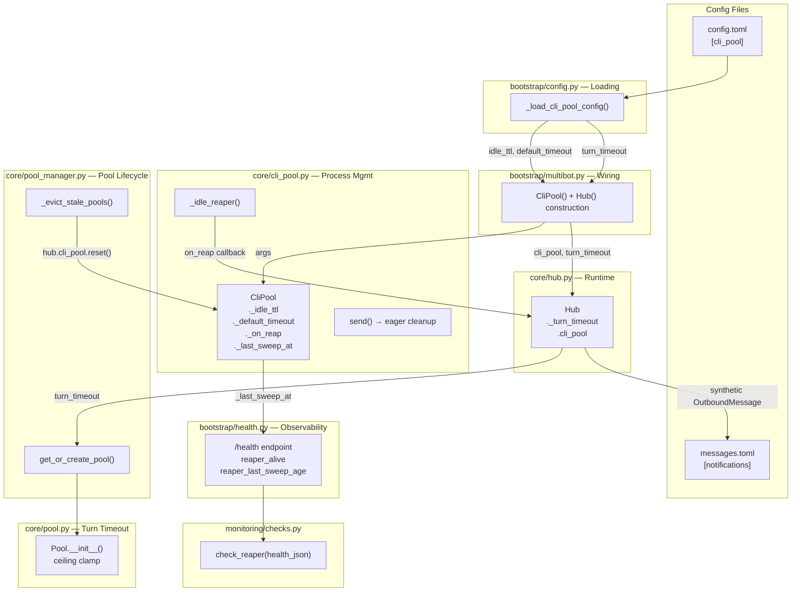
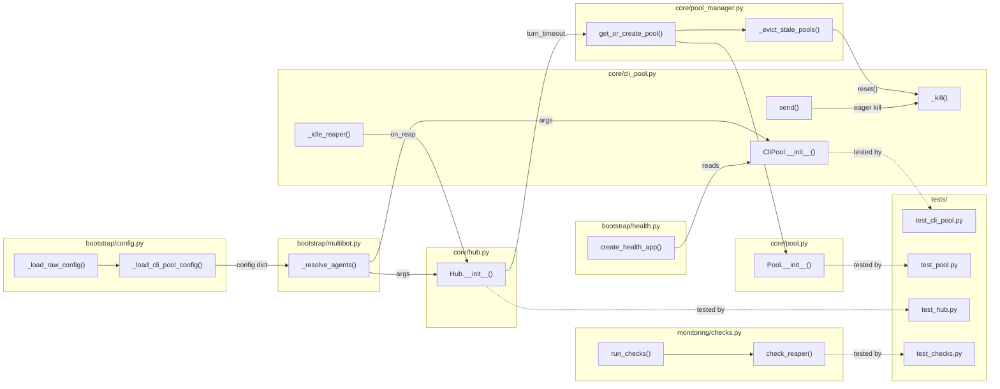

## Summary

Wire CLI pool timeout parameters (`idle_ttl`, `default_timeout`, `turn_timeout`) through config.toml → bootstrap → Hub → CliPool/Pool, add eager dead-process cleanup and pool-eviction process killing, and implement reaper notifications + health monitoring. 14 micro-tasks across 3 slices.

## Architecture

### Data Flow

### File x Function Map

## Agents

| Agent | Task count | Files |
|-------|-----------|-------|
| backend-dev | 9 | config.py, multibot.py, hub.py, pool.py, pool_manager.py, cli_pool.py, health.py, checks.py, messages.toml |
| tester | 5 | test_cli_pool.py, test_pool.py, test_hub.py, test_checks.py |

## Consistency Report

- Criteria covered: 13/13
- Uncovered criteria: none
- Tasks without spec backing: none
- Gold plating exemptions applied: 0

## Reference Patterns

- **Config loading:** `_load_circuit_config()` in `bootstrap/config.py:56-84` — read TOML section with defaults
- **Fire-and-forget:** `PoolObserver._fire_and_forget()` in `pool_observer.py:69-80` — schedule coroutine with error logging
- **Health fields:** `bootstrap/health.py:62-69` — response dict with age-in-seconds pattern
- **Monitoring checks:** `check_idle()` in `monitoring/checks.py:81-125` — threshold-based health check returning CheckResult
- **Pool construction:** `pool_manager.py:34` — `Pool()` constructor call with keyword args

## Micro-Tasks

### Slice V1: Config wiring (Evo 1 + 2)

#### Task 1: Write tests for _load_cli_pool_config() [P] → tester
- **File:** `tests/bootstrap/test_config.py`
- **Snippet:** `def test_load_cli_pool_config_defaults(): ...` + `def test_load_cli_pool_config_from_toml(): ...`
- **Verify:** `grep -q 'cli_pool_config' tests/bootstrap/test_config.py` (ready)
- **Expected:** Test file contains config loading tests with default fallback + TOML override cases
- **Time:** 4 min
- **Difficulty:** 2
- **Traces:** SC-1, U1→N1
- **Phase:** RED

#### Task 2: Write tests for Pool turn_timeout ceiling clamp [P] → tester
- **File:** `tests/core/test_pool.py`
- **Snippet:** `def test_turn_timeout_uses_ceiling_when_no_override(): ...` + `def test_turn_timeout_clamped_to_ceiling(): ...`
- **Verify:** `grep -q 'turn_timeout.*clamp\|ceiling' tests/core/test_pool.py` (ready)
- **Expected:** Tests for: default from ceiling, agent override below ceiling, agent override clamped to ceiling with warning log
- **Time:** 4 min
- **Difficulty:** 2
- **Traces:** SC-4, SC-5, N4
- **Phase:** RED

#### RED-GATE: RED complete V1 → tester
- **Verify:** All RED tasks for V1 marked complete
- **Phase:** RED-GATE

#### Task 3: Add _load_cli_pool_config() to bootstrap/config.py [P] → backend-dev
- **File:** `src/lyra/bootstrap/config.py`
- **Snippet:** `def _load_cli_pool_config(raw: dict) -> dict: section = raw.get("cli_pool", {}); return {"idle_ttl": section.get("idle_ttl", 1200), "default_timeout": section.get("default_timeout", 300), "turn_timeout": section.get("turn_timeout", None)}`
- **Verify:** `uv run pytest tests/bootstrap/test_config.py -k cli_pool -x` (deferred)
- **Expected:** Config loader tests pass
- **Time:** 3 min
- **Difficulty:** 1
- **Traces:** SC-1, U1→N1
- **Phase:** GREEN

#### Task 4: Add on_reap + _last_sweep_at to CliPool.__init__() [P] → backend-dev
- **File:** `src/lyra/core/cli_pool.py`
- **Snippet:** Add `on_reap: Callable[[str, str], Awaitable[None]] | None = None` param, store as `self._on_reap`; add `self._last_sweep_at: float | None = None`
- **Verify:** `uv run python -c "from lyra.core.cli_pool import CliPool; cp = CliPool(on_reap=None); assert cp._last_sweep_at is None"` (ready)
- **Expected:** CliPool accepts new params without error
- **Time:** 3 min
- **Difficulty:** 1
- **Traces:** SC-7, N2
- **Phase:** GREEN

#### Task 5: Add cli_pool + _turn_timeout to Hub, add ceiling clamp to Pool, wire in multibot + pool_manager → backend-dev
- **File:** `src/lyra/core/hub.py`, `src/lyra/core/pool.py`, `src/lyra/bootstrap/multibot.py`, `src/lyra/core/pool_manager.py`
- **Snippet:**
  - hub.py: Add `turn_timeout: float | None = None` param + `self._turn_timeout = turn_timeout`; add `self.cli_pool: CliPool | None = None` attribute
  - pool.py: In `__init__()`, accept `turn_timeout_ceiling: float | None = None`; if both `turn_timeout` and ceiling: `self._turn_timeout = min(turn_timeout, turn_timeout_ceiling)` with warning log; if no override: `self._turn_timeout = turn_timeout_ceiling`
  - multibot.py: Call `_load_cli_pool_config(raw)`, pass `idle_ttl`/`default_timeout` to `CliPool()`, pass `turn_timeout` to `Hub()`, set `hub.cli_pool = cli_pool`
  - pool_manager.py: In `get_or_create_pool()`, pass `turn_timeout_ceiling=self._hub._turn_timeout` to `Pool()`
- **Verify:** `uv run pytest tests/core/test_pool.py -k turn_timeout -x` (deferred)
- **Expected:** Pool ceiling clamp tests pass
- **Time:** 8 min
- **Difficulty:** 3
- **Traces:** SC-1, SC-2, SC-3, SC-4, SC-5, SC-13, N1→N2→N3→N4
- **Phase:** GREEN

### Slice V2: Eager cleanup + eviction fix (Evo 4 + 6)

#### Task 6: Write tests for send() eager cleanup + eviction reset [P] → tester
- **File:** `tests/core/test_cli_pool.py`
- **Snippet:** `async def test_send_kills_on_terminated(): ...` + `async def test_evict_stale_pools_resets_cli_pool(): ...`
- **Verify:** `grep -q 'terminated' tests/core/test_cli_pool.py` (ready)
- **Expected:** Tests verify _kill() called on "terminated" error and cli_pool.reset() called on eviction
- **Time:** 4 min
- **Difficulty:** 2
- **Traces:** SC-9, SC-10, N6, N7
- **Phase:** RED

#### RED-GATE: RED complete V2 → tester
- **Verify:** All RED tasks for V2 marked complete
- **Phase:** RED-GATE

#### Task 7: Expand send() error check to include "terminated" → backend-dev
- **File:** `src/lyra/core/cli_pool.py`
- **Snippet:** Change `if not result.ok and "Timeout" in result.error:` to `if not result.ok and ("Timeout" in result.error or "terminated" in result.error):`
- **Verify:** `uv run pytest tests/core/test_cli_pool.py -k terminated -x` (deferred)
- **Expected:** Eager cleanup test passes
- **Time:** 2 min
- **Difficulty:** 1
- **Traces:** SC-10, N6→S3
- **Phase:** GREEN

#### Task 8: Add cli_pool.reset() call in _evict_stale_pools() → backend-dev
- **File:** `src/lyra/core/pool_manager.py`
- **Snippet:** After existing eviction logic, add: `if self._hub.cli_pool is not None: await self._hub.cli_pool.reset(pool_id)`
- **Verify:** `uv run pytest tests/core/test_cli_pool.py -k evict -x` (deferred)
- **Expected:** Eviction reset test passes
- **Time:** 3 min
- **Difficulty:** 2
- **Traces:** SC-9, N7→S3
- **Phase:** GREEN

### Slice V3: Reaper notification + monitoring (Evo 3 + 5)

#### Task 9: Write tests for on_reap callback + failure isolation [P] → tester
- **File:** `tests/core/test_cli_pool.py`
- **Snippet:** `async def test_reaper_calls_on_reap_for_idle(): ...` + `async def test_reaper_survives_on_reap_failure(): ...`
- **Verify:** `grep -q 'on_reap' tests/core/test_cli_pool.py` (ready)
- **Expected:** Tests verify callback invoked with (pool_id, "idle") and that exception in callback doesn't crash reaper
- **Time:** 4 min
- **Difficulty:** 3
- **Traces:** SC-6, SC-7, N5→S2
- **Phase:** RED

#### Task 10: Write tests for /health reaper fields + check_reaper() [P] → tester
- **File:** `tests/monitoring/test_checks.py`
- **Snippet:** `def test_check_reaper_healthy(): ...` + `def test_check_reaper_stale(): ...` + `def test_check_reaper_null_before_first_sweep(): ...`
- **Verify:** `grep -q 'check_reaper' tests/monitoring/test_checks.py` (ready)
- **Expected:** Tests for healthy (age < 120s), stale (age > 120s), and null state
- **Time:** 4 min
- **Difficulty:** 2
- **Traces:** SC-11, SC-12, N8, U2
- **Phase:** RED

#### RED-GATE: RED complete V3 → tester
- **Verify:** All RED tasks for V3 marked complete
- **Phase:** RED-GATE

#### Task 11: Add idle_eviction message to messages.toml [P] → backend-dev
- **File:** `src/lyra/config/messages.toml`
- **Snippet:** Add `[notifications.en]` section with `idle_eviction = "Session timed out after inactivity."`
- **Verify:** `grep -q 'idle_eviction' src/lyra/config/messages.toml` (ready)
- **Expected:** Message key present in TOML
- **Time:** 2 min
- **Difficulty:** 1
- **Traces:** SC-8, U3
- **Phase:** GREEN

#### Task 12: Enhance _idle_reaper() — update _last_sweep_at, call on_reap → backend-dev
- **File:** `src/lyra/core/cli_pool.py`
- **Snippet:** In `_idle_reaper()`: add `self._last_sweep_at = time.monotonic()` after sleep; after `_kill()` for idle processes, fire-and-forget `self._on_reap(pool_id, reason)` wrapped in try/except
- **Verify:** `uv run pytest tests/core/test_cli_pool.py -k on_reap -x` (deferred)
- **Expected:** on_reap callback tests pass
- **Time:** 5 min
- **Difficulty:** 3
- **Traces:** SC-6, SC-7, N5→S1, N5→S2
- **Phase:** GREEN

#### Task 13: Add reaper fields to /health endpoint → backend-dev
- **File:** `src/lyra/bootstrap/health.py`
- **Snippet:** Compute `reaper_alive` (bool: cli_pool._reaper_task exists and not done) and `reaper_last_sweep_age` (float: `time.monotonic() - cli_pool._last_sweep_at` or None); add to response dict
- **Verify:** `uv run pytest tests/bootstrap/ -k health -x` (deferred)
- **Expected:** Health endpoint returns reaper fields
- **Time:** 3 min
- **Difficulty:** 2
- **Traces:** SC-11, S1→U2
- **Phase:** GREEN

#### Task 14: Add check_reaper() to monitoring/checks.py → backend-dev
- **File:** `src/lyra/monitoring/checks.py`
- **Snippet:** `def check_reaper(health_json: dict) -> CheckResult:` — read `reaper_last_sweep_age`, warn if > 120; add call in `run_checks()` after `check_circuits` block
- **Verify:** `uv run pytest tests/monitoring/test_checks.py -k reaper -x` (deferred)
- **Expected:** check_reaper tests pass
- **Time:** 3 min
- **Difficulty:** 2
- **Traces:** SC-12, U2→N8
- **Phase:** GREEN
