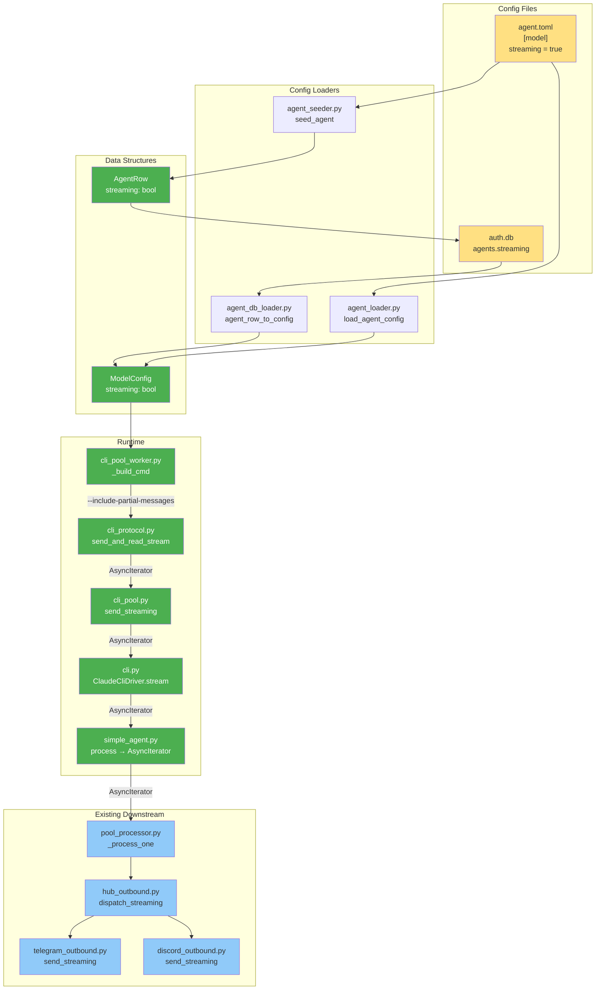
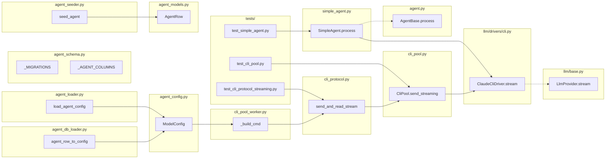

## Summary

Wire the Claude CLI's `--include-partial-messages` flag through the CLI protocol, pool, driver, and agent layers so that streaming-enabled agents return `AsyncIterator[str]` — connecting to the existing downstream plumbing (`dispatch_streaming`, adapter `send_streaming`). 4 slices, strict dependency chain, all Python backend.

## Architecture





## Bootstrap Context

Reference pattern: `skip_permissions` field follows the identical config plumbing path (TOML → seeder → DB → db_loader → ModelConfig). Use it as the template for adding `streaming`.

Key files for pattern reference:
- `agent_schema.py:44` — migration for `skip_permissions`
- `agent_seeder.py:87` — reading `skip_permissions` from TOML
- `agent_db_loader.py:60` — passing `skip_permissions` to `ModelConfig`
- `agent_loader.py:116` — TOML fallback for `skip_permissions`

## Agents

| Agent | Tasks | Files |
|-------|-------|-------|
| backend-dev | 14 | `agent_config.py`, `agent_schema.py`, `agent_models.py`, `agent_seeder.py`, `agent_db_loader.py`, `agent_loader.py`, `cli_pool_worker.py`, `cli_protocol.py`, `cli_pool.py`, `cli.py`, `base.py`, `agent.py`, `simple_agent.py` |
| tester | 7 | `test_cli_pool.py`, `test_cli_protocol_streaming.py` (new), `test_simple_agent.py` |

## Consistency Report

**Covered:** 21/21 success criteria mapped to tasks.
**Uncovered:** 0
**Untraced tasks:** 0 (all trace to spec criteria)

## Micro-Tasks

### Slice 1: Config Plumbing

---

#### V1-T1: Add `streaming` field to `ModelConfig` [P]

- **Agent:** backend-dev
- **File:** `src/lyra/core/agent_config.py`
- **Spec trace:** SC-1, SC-2
- **Phase:** RED
- **Difficulty:** 1
- **Time:** 2 min

Add `streaming: bool = False` to the `ModelConfig` frozen dataclass. Field participates in `__eq__` (no `compare=False`).

```python
# After skip_permissions
streaming: bool = False
```

**Verify:**
```bash
uv run python -c "from lyra.core.agent_config import ModelConfig; m1 = ModelConfig(streaming=True); m2 = ModelConfig(streaming=False); assert m1 != m2; print('OK')"
```
**Expected:** `OK`

---

#### V1-T2: Add `streaming` column to DB schema [P]

- **Agent:** backend-dev
- **File:** `src/lyra/core/agent_schema.py`
- **Spec trace:** SC-1
- **Phase:** RED
- **Difficulty:** 1
- **Time:** 2 min

Add migration to `_MIGRATIONS` list and update `_AGENT_COLUMNS` and `_UPSERT_SET`.

```python
# In _MIGRATIONS list:
"ALTER TABLE agents ADD COLUMN streaming INTEGER NOT NULL DEFAULT 0",

# In _AGENT_COLUMNS — add 'streaming' after 'commands_json':
"..., commands_json, streaming"

# In _UPSERT_SET — add:
"streaming=excluded.streaming, "
```

**Verify:**
```bash
uv run python -c "from lyra.core.agent_schema import _AGENT_COLUMNS; assert 'streaming' in _AGENT_COLUMNS; print('OK')"
```
**Expected:** `OK`

---

#### V1-T3: Add `streaming` field to `AgentRow` [P]

- **Agent:** backend-dev
- **File:** `src/lyra/core/agent_models.py`
- **Spec trace:** SC-1
- **Phase:** RED
- **Difficulty:** 1
- **Time:** 2 min

Add `streaming: bool = False` to the `AgentRow` dataclass and include in `from_tuple()`.

```python
# After commands_json field:
streaming: bool = False
```

**Verify:**
```bash
uv run python -c "from lyra.core.agent_models import AgentRow; r = AgentRow(name='test'); assert r.streaming == False; print('OK')"
```
**Expected:** `OK`

---

#### V1-T4: Read `streaming` from TOML in seeder

- **Agent:** backend-dev
- **File:** `src/lyra/core/agent_seeder.py`
- **Spec trace:** SC-1
- **Phase:** RED
- **Difficulty:** 1
- **Time:** 3 min
- **Depends on:** V1-T3

Follow the `skip_permissions` pattern. Read from `[model]` section.

```python
streaming = bool(_m("streaming", False))
# Pass to AgentRow constructor:
streaming=streaming,
```

**Verify:**
```bash
uv run python -c "from lyra.core.agent_seeder import seed_agent; print('import OK')"
```
**Expected:** `import OK`

---

#### V1-T5: Pass `streaming` in DB loader

- **Agent:** backend-dev
- **File:** `src/lyra/core/agent_db_loader.py`
- **Spec trace:** SC-1
- **Phase:** RED
- **Difficulty:** 1
- **Time:** 2 min
- **Depends on:** V1-T1

Add `streaming=row.streaming` to the `ModelConfig()` constructor call.

```python
model_cfg = ModelConfig(
    backend=row.backend,
    model=row.model,
    max_turns=row.max_turns,
    tools=tuple(tools),
    cwd=cwd,
    skip_permissions=row.skip_permissions,
    streaming=row.streaming,  # NEW
)
```

**Verify:**
```bash
uv run python -c "from lyra.core.agent_db_loader import agent_row_to_config; print('import OK')"
```
**Expected:** `import OK`

---

#### V1-T6: Read `streaming` in TOML fallback loader

- **Agent:** backend-dev
- **File:** `src/lyra/core/agent_loader.py`
- **Spec trace:** SC-1
- **Phase:** RED
- **Difficulty:** 1
- **Time:** 2 min
- **Depends on:** V1-T1

Follow the `skip_permissions` pattern in `load_agent_config()`.

```python
streaming=bool(model_section.get("streaming", False)),
```

**Verify:**
```bash
uv run python -c "from lyra.core.agent_loader import load_agent_config; print('import OK')"
```
**Expected:** `import OK`

---

#### V1-GATE: Slice 1 RED-GATE

**Verify all Slice 1 tasks:**
```bash
uv run pytest tests/core/test_agent_config.py tests/core/test_agent_loader.py -x -q 2>&1 | tail -5
```
**Expected:** All existing tests pass. `ModelConfig` has `streaming` field that participates in equality.

---

### Slice 2: CLI Protocol Streaming Generator

---

#### V2-T1: Add `--include-partial-messages` to `_build_cmd()`

- **Agent:** backend-dev
- **File:** `src/lyra/core/cli_pool_worker.py`
- **Spec trace:** SC-3, SC-4
- **Phase:** RED
- **Difficulty:** 1
- **Time:** 2 min
- **Depends on:** V1-T1

Add the flag when `model_config.streaming` is True.

```python
if model_config.streaming:
    cmd.append("--include-partial-messages")
```

**Verify:**
```bash
uv run python -c "
from lyra.core.agent_config import ModelConfig
from lyra.core.cli_pool_worker import _CliPoolWorker
w = _CliPoolWorker()
mc_on = ModelConfig(streaming=True)
mc_off = ModelConfig(streaming=False)
cmd_on = w._build_cmd(mc_on)
cmd_off = w._build_cmd(mc_off)
assert '--include-partial-messages' in cmd_on
assert '--include-partial-messages' not in cmd_off
print('OK')
"
```
**Expected:** `OK`

---

#### V2-T2: Implement `send_and_read_stream()` async generator

- **Agent:** backend-dev
- **File:** `src/lyra/core/cli_protocol.py`
- **Spec trace:** SC-5, SC-6, SC-7, SC-8, SC-9a, SC-9b, SC-11
- **Phase:** RED
- **Difficulty:** 4
- **Time:** 10 min
- **Depends on:** V1-T1

Core task. Implement async generator that:
1. Writes NDJSON message to stdin (same as `send_and_read`)
2. Reads stdout lines, handling `system/init` → capture `session_id`
3. On `stream_event` with `content_block_delta` and `delta.type == "text_delta"` → yield `delta.text`
4. Skip `input_json_delta` (tool-use blocks)
5. On `result` → update `session_id`, stop iteration
6. On EOF / process death → stop iteration
7. `finally` block: reset idle timeout counter
8. Generator object gets `.session_id` attribute set by caller

The generator captures `pool` and `pool_id` via closure for cleanup in `finally`.

```python
async def send_and_read_stream(
    entry: object,
    message: str,
    pool_id: str,
    *,
    pool_reset_fn: Callable[[], Awaitable[None]] | None = None,
    default_timeout: float = 300,
) -> AsyncGenerator[str, None]:
    """Write message then yield text_delta chunks until result event."""
    # ... write stdin (same as send_and_read)
    # ... read loop yielding text_delta chunks
    # ... finally: if pool_reset_fn: await pool_reset_fn()
```

**Verify:**
```bash
uv run python -c "from lyra.core.cli_protocol import send_and_read_stream; print('import OK')"
```
**Expected:** `import OK`

---

#### V2-T3: Unit tests for `send_and_read_stream()` [P]

- **Agent:** tester
- **File:** `tests/core/test_cli_protocol_streaming.py` (NEW)
- **Spec trace:** SC-5, SC-6, SC-7, SC-8, SC-9a, SC-9b
- **Phase:** GREEN
- **Difficulty:** 3
- **Time:** 8 min
- **Depends on:** V2-T2

Test cases:
1. Yields `text_delta` chunks from `content_block_delta` events
2. Skips `input_json_delta` events
3. Captures `session_id` from `system/init`
4. Stops on `result` event
5. `session_id` attribute is non-None after normal completion
6. `session_id` attribute is None when generator closed early
7. EOF/process death raises StopAsyncIteration

Use mock subprocess with pre-built NDJSON lines (pattern from `tests/core/test_cli_pool.py`).

**Verify:**
```bash
uv run pytest tests/core/test_cli_protocol_streaming.py -x -q
```
**Expected:** All tests pass.

---

#### V2-GATE: Slice 2 RED-GATE

```bash
uv run pytest tests/core/test_cli_protocol_streaming.py tests/core/test_cli_pool.py -x -q 2>&1 | tail -5
```
**Expected:** All tests pass. No regressions in existing CLI pool tests.

---

### Slice 3: Pool + Driver Streaming Methods

---

#### V3-T1: Add `send_streaming()` to `CliPool`

- **Agent:** backend-dev
- **File:** `src/lyra/core/cli_pool.py`
- **Spec trace:** SC-12, SC-19, SC-20
- **Phase:** RED
- **Difficulty:** 4
- **Time:** 8 min
- **Depends on:** V2-T2

New method. Locking model: acquire `entry._lock` → write stdin → release lock → return iterator. Iterator is consumed externally by pool_processor.

```python
async def send_streaming(
    self,
    pool_id: str,
    message: str,
    model_config: ModelConfig,
    system_prompt: str = "",
) -> AsyncIterator[str]:
    """Send message, return streaming iterator. Lock released before first yield."""
    entry = self._entries.get(pool_id)
    if entry is None or not entry.is_alive():
        entry = await self._spawn(pool_id, model_config, system_prompt)
        if entry is None:
            raise RuntimeError("Failed to spawn CLI process")
    # ... model_config mismatch check (same as send())
    async with entry._lock:
        # Write stdin inside lock
        # ... payload write
    # Lock released — return iterator
    gen = send_and_read_stream(entry, message, pool_id, pool_reset_fn=lambda: self.reset(pool_id))
    gen.session_id = None
    entry.last_activity = time.time()
    return gen
```

**Verify:**
```bash
uv run python -c "from lyra.core.cli_pool import CliPool; assert hasattr(CliPool, 'send_streaming'); print('OK')"
```
**Expected:** `OK`

---

#### V3-T2: Add `stream()` to `LlmProvider` protocol

- **Agent:** backend-dev
- **File:** `src/lyra/llm/base.py`
- **Spec trace:** SC-17
- **Phase:** RED
- **Difficulty:** 1
- **Time:** 2 min

Add optional `stream()` method to the protocol class. Must not break existing providers that don't implement it.

```python
# In LlmProvider protocol (not abstract — optional):
def stream(
    self,
    pool_id: str,
    text: str,
    model_cfg: ModelConfig,
    system_prompt: str,
) -> Any: ...  # AsyncIterator[str] at runtime
```

**Verify:**
```bash
uv run python -c "from lyra.llm.base import LlmProvider; print('OK')"
```
**Expected:** `OK`

---

#### V3-T3: Add `stream()` to `ClaudeCliDriver` + update capabilities

- **Agent:** backend-dev
- **File:** `src/lyra/llm/drivers/cli.py`
- **Spec trace:** SC-13, SC-14
- **Phase:** RED
- **Difficulty:** 2
- **Time:** 3 min
- **Depends on:** V3-T1, V3-T2

```python
capabilities: dict = {"streaming": True, "auth": "oauth_only"}

async def stream(
    self,
    pool_id: str,
    text: str,
    model_cfg: ModelConfig,
    system_prompt: str,
) -> AsyncIterator[str]:
    return await self._pool.send_streaming(pool_id, text, model_cfg, system_prompt)
```

**Verify:**
```bash
uv run python -c "from lyra.llm.drivers.cli import ClaudeCliDriver; assert ClaudeCliDriver.capabilities['streaming'] == True; print('OK')"
```
**Expected:** `OK`

---

#### V3-T4: Tests for `CliPool.send_streaming()` and lock lifecycle

- **Agent:** tester
- **File:** `tests/core/test_cli_pool.py`
- **Spec trace:** SC-12, SC-19
- **Phase:** GREEN
- **Difficulty:** 3
- **Time:** 8 min
- **Depends on:** V3-T1

Test cases:
1. `send_streaming()` spawns process and returns `AsyncIterator`
2. Lock is released before first chunk yielded (concurrent `reset()` must not deadlock)
3. `aclose()` on iterator calls pool reset
4. Config mismatch with `streaming` toggled triggers respawn

**Verify:**
```bash
uv run pytest tests/core/test_cli_pool.py -x -q 2>&1 | tail -5
```
**Expected:** All tests pass.

---

#### V3-GATE: Slice 3 RED-GATE

```bash
uv run pytest tests/core/test_cli_pool.py tests/core/test_cli_protocol_streaming.py -x -q 2>&1 | tail -5
```
**Expected:** All tests pass.

---

### Slice 4: Agent Integration

---

#### V4-T1: Broaden `AgentBase.process()` return type

- **Agent:** backend-dev
- **File:** `src/lyra/core/agent.py`
- **Spec trace:** SC-18
- **Phase:** RED
- **Difficulty:** 1
- **Time:** 2 min

Change return type annotation from `Response` to `Response | AsyncIterator[str]`.

```python
@abstractmethod
async def process(
    self,
    msg: InboundMessage,
    pool: Pool,
    *,
    on_intermediate: "Callable[[str], Awaitable[None]] | None" = None,
) -> "Response | AsyncIterator[str]": ...
```

**Verify:**
```bash
uv run python -c "from lyra.core.agent import AgentBase; print('OK')"
```
**Expected:** `OK`

---

#### V4-T2: `SimpleAgent.process()` returns `AsyncIterator` when streaming

- **Agent:** backend-dev
- **File:** `src/lyra/agents/simple_agent.py`
- **Spec trace:** SC-15, SC-16
- **Phase:** RED
- **Difficulty:** 3
- **Time:** 5 min
- **Depends on:** V4-T1, V3-T3

When `self.config.model_config.streaming` is True and provider has `stream()`, call `provider.stream()` instead of `provider.complete()`. Return the `AsyncIterator` directly.

```python
model_cfg = self.config.model_config

if model_cfg.streaming and hasattr(self._provider, "stream"):
    return await self._provider.stream(
        pool.pool_id,
        text,
        model_cfg,
        pool._system_prompt or self.config.system_prompt,
    )

# Existing non-streaming path unchanged
cb = on_intermediate if self.config.show_intermediate else None
result = await self._provider.complete(...)
```

**Verify:**
```bash
uv run python -c "from lyra.agents.simple_agent import SimpleAgent; print('OK')"
```
**Expected:** `OK`

---

#### V4-T3: Tests for streaming agent path

- **Agent:** tester
- **File:** `tests/agents/test_simple_agent.py`
- **Spec trace:** SC-15, SC-16, SC-21
- **Phase:** GREEN
- **Difficulty:** 3
- **Time:** 5 min
- **Depends on:** V4-T2

Test cases:
1. `process()` returns `AsyncIterator` when `model_config.streaming == True`
2. `process()` returns `Response` when `model_config.streaming == False`
3. Non-streaming path is unchanged (regression)

**Verify:**
```bash
uv run pytest tests/agents/test_simple_agent.py -x -q 2>&1 | tail -5
```
**Expected:** All tests pass.

---

#### V4-T4: Full regression + typecheck

- **Agent:** tester
- **File:** (all)
- **Spec trace:** SC-21
- **Phase:** REFACTOR
- **Difficulty:** 2
- **Time:** 5 min
- **Depends on:** V4-T3

```bash
uv run pyright
uv run pytest -x -q 2>&1 | tail -10
```
**Expected:** No type errors. All tests pass.

---

#### V4-GATE: Slice 4 RED-GATE (Final)

```bash
uv run ruff check . && uv run pyright && uv run pytest -x -q
```
**Expected:** All quality gates pass. Feature complete.
