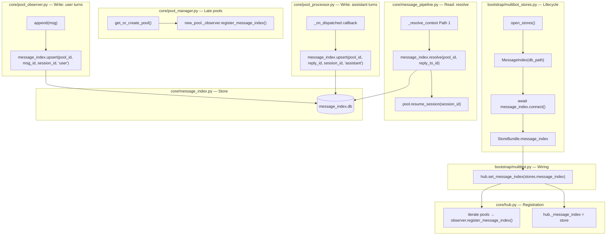
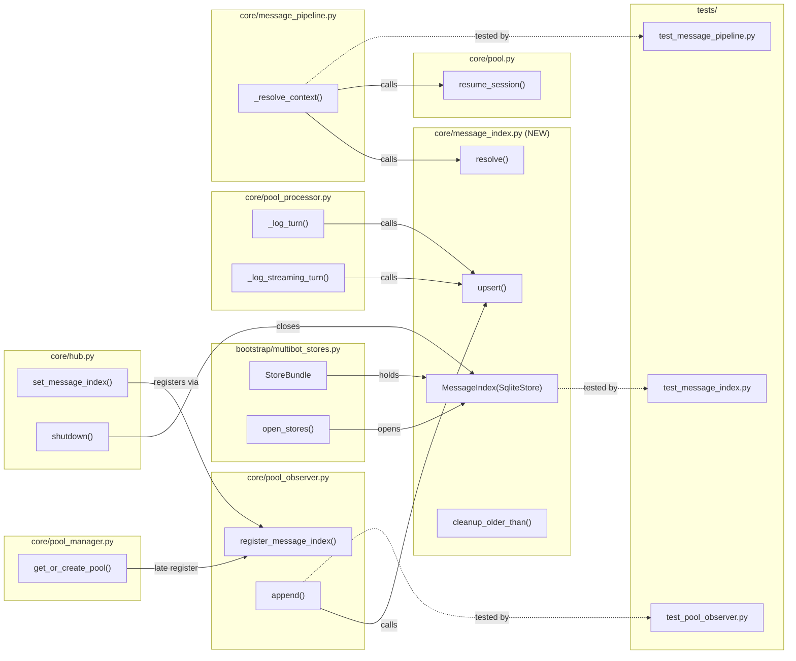

## Summary

Add a dedicated `MessageIndex` SQLite store that maps `(pool_id, platform_msg_id) → session_id` for both user and assistant messages. Wire it through the existing Hub → PoolObserver pattern (mirroring TurnStore), replace the broken `ContextResolver` with an O(1) PK lookup in `_resolve_context`, and fix the `_session_persisted` reset on resume.

## Architecture

### Data Flow



### File x Function Map



## Bootstrap Context

From `artifacts/analyses/341-message-index-architecture.md`:

- **Selected shape:** Dedicated `message_index` table with `PRIMARY KEY (pool_id, platform_msg_id)`. `pool_id` encodes `platform:bot_id:scope_id`, eliminating Telegram cross-chat collisions. `INSERT OR IGNORE` preserves original session mapping on message edits.
- **Reference pattern:** `TurnStore(SqliteStore)` — `connect()` creates schema, `close()` is idempotent. Wired via `Hub.set_turn_store()` → `PoolObserver.register_turn_store()`. Late pools registered in `PoolManager.get_or_create_pool()`.
- **Key insight:** `resolve()` returns `str | None` (not `ResolvedSession`). Cross-pool guard in `_resolve_context` is structurally dead with pool-scoped PK — remove it.

## Agents

| Agent | Task count | Files |
|-------|-----------|-------|
| backend-dev | 10 | `core/message_index.py`, `bootstrap/multibot_stores.py`, `core/hub.py`, `core/pool_observer.py`, `core/pool_manager.py`, `bootstrap/multibot.py`, `core/pool_processor.py`, `core/message_pipeline.py`, `core/pool.py`, `core/context_resolver.py` |
| tester | 4 | `tests/core/test_message_index.py`, `tests/core/test_pool_observer.py`, `tests/core/test_message_pipeline.py`, `tests/core/test_context_resolver.py` |

## Consistency Report

- Criteria covered: 19/19 (15 implementation + 4 behavioral)
- Uncovered criteria: none
- Tasks without spec backing: none
- Gold plating exemptions applied: 0

## Micro-Tasks

### Slice V1: Store + Wiring

#### Task 1: Write MessageIndex store unit tests [P] → tester
- **File:** `tests/core/test_message_index.py`
- **Snippet:**
```python
class TestMessageIndex:
    async def test_connect_creates_table(self, tmp_path): ...
    async def test_upsert_and_resolve(self, tmp_path): ...
    async def test_upsert_normalizes_to_str(self, tmp_path): ...
    async def test_upsert_skips_none_msg_id(self, tmp_path): ...
    async def test_upsert_ignore_on_conflict(self, tmp_path): ...
    async def test_resolve_not_found(self, tmp_path): ...
    async def test_cleanup_older_than(self, tmp_path): ...
```
- **Verify:** `grep -q 'class TestMessageIndex' tests/core/test_message_index.py` (ready)
- **Expected:** Test file contains all test methods
- **Time:** 5 min | **Difficulty:** 2
- **Traces:** SC-1, SC-2, SC-3, SC-4, SC-14 | **Phase:** RED

#### Task 2: Write Hub/PoolManager message_index wiring tests [P] → tester
- **File:** `tests/core/test_pool_observer.py` (extend existing)
- **Snippet:**
```python
class TestMessageIndexRegistration:
    def test_register_message_index(self): ...
    def test_register_message_index_none_by_default(self): ...
```
- **Verify:** `grep -q 'TestMessageIndexRegistration' tests/core/test_pool_observer.py` (ready)
- **Expected:** Test class exists with registration tests
- **Time:** 3 min | **Difficulty:** 2
- **Traces:** SC-6, SC-12 | **Phase:** RED

#### RED-GATE: RED complete V1 → tester
- **Verify:** All test tasks for V1 marked complete
- **Phase:** RED-GATE

#### Task 3: Create MessageIndex store → backend-dev
- **File:** `src/lyra/core/message_index.py` (new)
- **Snippet:**
```python
class MessageIndex(SqliteStore):
    async def connect(self) -> None: ...
    async def upsert(self, pool_id: str, platform_msg_id: str | None, session_id: str, role: str) -> None: ...
    async def resolve(self, pool_id: str, platform_msg_id: str) -> str | None: ...
    async def cleanup_older_than(self, days: int) -> int: ...
```
- **Verify:** `uv run pytest tests/core/test_message_index.py -x` (deferred)
- **Expected:** All MessageIndex unit tests pass
- **Time:** 5 min | **Difficulty:** 3
- **Traces:** S1, SC-1, SC-2, SC-3, SC-4, SC-14 | **Phase:** GREEN

#### Task 4: Add MessageIndex to StoreBundle + open_stores lifecycle → backend-dev
- **File:** `src/lyra/bootstrap/multibot_stores.py`
- **Snippet:**
```python
@dataclass
class StoreBundle:
    ...
    message_index: MessageIndex

# In open_stores():
message_index = MessageIndex(db_path=vault_dir / "message_index.db")
await message_index.connect()
# In finally:
await message_index.close()
```
- **Verify:** `uv run pyright src/lyra/bootstrap/multibot_stores.py` (ready)
- **Expected:** No type errors
- **Time:** 3 min | **Difficulty:** 2
- **Traces:** S2, SC-5 | **Phase:** GREEN

#### Task 5: Add Hub.set_message_index() + shutdown close → backend-dev
- **File:** `src/lyra/core/hub.py`
- **Snippet:**
```python
def set_message_index(self, store: MessageIndex) -> None:
    self._message_index = store
    for pool in self._pool_manager.pools.values():
        pool._observer.register_message_index(store)

# In shutdown():
if self._message_index is not None:
    await self._message_index.close()
```
- **Verify:** `uv run pyright src/lyra/core/hub.py` (ready)
- **Expected:** No type errors
- **Time:** 4 min | **Difficulty:** 2
- **Traces:** S3, SC-6 | **Phase:** GREEN

#### Task 6: Add PoolObserver.register_message_index() → backend-dev
- **File:** `src/lyra/core/pool_observer.py`
- **Snippet:**
```python
def register_message_index(self, store: MessageIndex) -> None:
    self._message_index = store
```
- **Verify:** `uv run pyright src/lyra/core/pool_observer.py` (ready)
- **Expected:** No type errors
- **Time:** 2 min | **Difficulty:** 1
- **Traces:** S4, SC-6 | **Phase:** GREEN

#### Task 7: Add late-pool registration in pool_manager.py → backend-dev
- **File:** `src/lyra/core/pool_manager.py`
- **Snippet:**
```python
# In get_or_create_pool(), after turn_store registration:
if self._hub._message_index is not None:
    new_pool._observer.register_message_index(self._hub._message_index)
```
- **Verify:** `uv run pyright src/lyra/core/pool_manager.py` (ready)
- **Expected:** No type errors
- **Time:** 2 min | **Difficulty:** 1
- **Traces:** S5, SC-12 | **Phase:** GREEN

#### Task 8: Wire hub.set_message_index in multibot.py → backend-dev
- **File:** `src/lyra/bootstrap/multibot.py`
- **Snippet:**
```python
# After hub.set_turn_store(stores.turn):
hub.set_message_index(stores.message_index)
```
- **Verify:** `uv run pyright src/lyra/bootstrap/multibot.py` (ready)
- **Expected:** No type errors
- **Time:** 2 min | **Difficulty:** 1
- **Traces:** S2→S3, SC-5, SC-6 | **Phase:** GREEN

### Slice V2: Integration

#### Task 9: Write user/assistant turn population tests → tester
- **File:** `tests/core/test_pool_observer.py` (extend existing)
- **Snippet:**
```python
class TestMessageIndexPopulation:
    async def test_append_indexes_user_turn(self): ...
    async def test_append_skips_when_no_message_index(self): ...
```
- **Verify:** `grep -q 'TestMessageIndexPopulation' tests/core/test_pool_observer.py` (ready)
- **Expected:** Test class exists with population tests
- **Time:** 4 min | **Difficulty:** 2
- **Traces:** SC-7, N1 | **Phase:** RED

#### Task 10: Write _resolve_context Path 1 tests with MessageIndex [P] → tester
- **File:** `tests/core/test_message_pipeline.py` (extend existing)
- **Snippet:**
```python
class TestResolveContextMessageIndex:
    async def test_resolve_via_message_index(self): ...
    async def test_resolve_fallback_when_not_found(self): ...
    async def test_resolve_skips_when_pool_busy(self): ...
```
- **Verify:** `grep -q 'TestResolveContextMessageIndex' tests/core/test_message_pipeline.py` (ready)
- **Expected:** Test class exists with Path 1 resolution tests
- **Time:** 4 min | **Difficulty:** 3
- **Traces:** SC-9, SC-13, N4 | **Phase:** RED

#### RED-GATE: RED complete V2 → tester
- **Verify:** All test tasks for V2 marked complete
- **Phase:** RED-GATE

#### Task 11: Populate user turns in PoolObserver.append() → backend-dev
- **File:** `src/lyra/core/pool_observer.py`
- **Snippet:**
```python
# In append(), after log_turn_async:
if self._message_index is not None:
    msg_id = msg.platform_meta.get("message_id")
    if msg_id is not None:
        self._fire_and_forget(
            self._message_index.upsert(self._pool_id, str(msg_id), session_id, "user")
        )
```
- **Verify:** `uv run pytest tests/core/test_pool_observer.py -x -k 'message_index'` (deferred)
- **Expected:** User turn population tests pass
- **Time:** 3 min | **Difficulty:** 2
- **Traces:** N1, SC-7 | **Phase:** GREEN

#### Task 12: Populate assistant turns (non-streaming) in _log_turn [P] → backend-dev
- **File:** `src/lyra/core/pool_processor.py`
- **Snippet:**
```python
# In _log_turn callback, after log_turn_async:
if pool._observer._message_index is not None and _reply_id is not None:
    pool._observer._fire_and_forget(
        pool._observer._message_index.upsert(pool.pool_id, str(_reply_id), pool.session_id, "assistant")
    )
```
- **Verify:** `uv run pyright src/lyra/core/pool_processor.py` (ready)
- **Expected:** No type errors
- **Time:** 3 min | **Difficulty:** 2
- **Traces:** N2, SC-8 | **Phase:** GREEN

#### Task 13: Populate assistant turns (streaming) in _log_streaming_turn [P] → backend-dev
- **File:** `src/lyra/core/pool_processor.py`
- **Snippet:**
```python
# In _log_streaming_turn callback, after log_turn_async:
if pool._observer._message_index is not None and _reply_id is not None:
    pool._observer._fire_and_forget(
        pool._observer._message_index.upsert(pool.pool_id, str(_reply_id), pool.session_id, "assistant")
    )
```
- **Verify:** `uv run pyright src/lyra/core/pool_processor.py` (ready)
- **Expected:** No type errors
- **Time:** 3 min | **Difficulty:** 2
- **Traces:** N3, SC-8 | **Phase:** GREEN

#### Task 14: Rewrite _resolve_context Path 1 with MessageIndex → backend-dev
- **File:** `src/lyra/core/message_pipeline.py`
- **Snippet:**
```python
# Replace ContextResolver.resolve with:
if msg.reply_to_id and self._hub._message_index is not None:
    session_id = await self._hub._message_index.resolve(pool_id, str(msg.reply_to_id))
    if session_id is not None:
        # Remove cross-pool guard (structurally dead with pool-scoped PK)
        if pool.is_group: ...  # keep group guard
        if not pool.is_idle: ...  # keep busy guard
        await pool.resume_session(session_id)
        return
```
- **Verify:** `uv run pytest tests/core/test_message_pipeline.py -x -k 'message_index or resolve_context'` (deferred)
- **Expected:** Path 1 resolution tests pass
- **Time:** 5 min | **Difficulty:** 3
- **Traces:** N4, SC-9, SC-13 | **Phase:** GREEN

#### Task 15: Fix _session_persisted reset in Pool.resume_session() [P] → backend-dev
- **File:** `src/lyra/core/pool.py`
- **Snippet:**
```python
async def resume_session(self, session_id: str) -> None:
    if self._session_resume_fn is not None:
        await self._session_resume_fn(session_id)
    self.reset_session_persisted()  # NEW: ensure resumed session_id is persisted
```
- **Verify:** `uv run pytest tests/core/test_pool.py -x -k 'resume'` (deferred)
- **Expected:** resume_session resets _session_persisted flag
- **Time:** 2 min | **Difficulty:** 1
- **Traces:** N5, SC-11 | **Phase:** GREEN

#### Task 16: Delete ContextResolver + remove from Hub/multibot → backend-dev
- **File:** `src/lyra/core/context_resolver.py` (delete), `src/lyra/core/hub.py`, `src/lyra/bootstrap/multibot.py`, `tests/core/test_context_resolver.py` (delete)
- **Snippet:**
```python
# hub.py: remove context_resolver param from __init__, remove self._context_resolver
# multibot.py: remove ContextResolver import + instantiation + param
# Delete: context_resolver.py, test_context_resolver.py
```
- **Verify:** `uv run pytest tests/ -x --ignore=tests/core/test_context_resolver.py && ! test -f src/lyra/core/context_resolver.py` (deferred)
- **Expected:** All tests pass, context_resolver.py deleted
- **Time:** 5 min | **Difficulty:** 2
- **Traces:** U1, U2, SC-10 | **Phase:** GREEN
