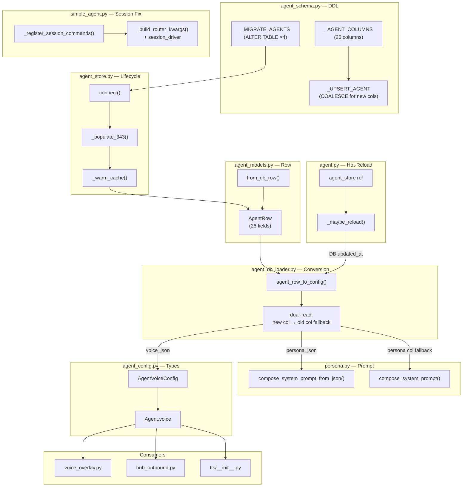
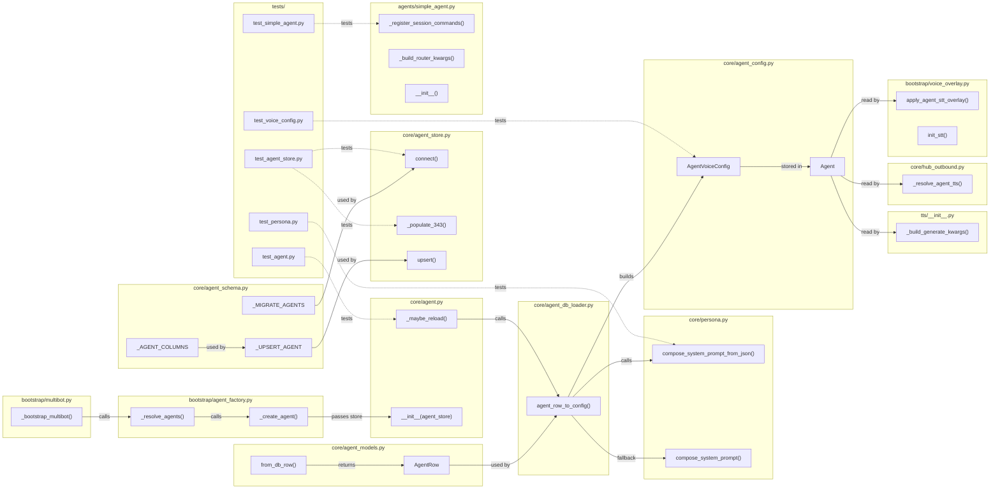

## Summary

Implement PR1 of the DB-first agent config migration: add 4 new columns (persona_json, voice_json, fallback_language, patterns_json) with data migration from old columns, replace TOML mtime hot-reload with DB `updated_at` polling, fix session command registration for SimpleAgent (unblocks `/add`), compose system prompts from inline persona JSON, and merge voice config into a single `voice_json` column with unified `fallback_language`. Deferred: PR2 (taxonomy rename, child issue) and PR3 (cleanup, child issue).

## Architecture

### Data Flow



### File × Function Map



## Bootstrap Context

From analysis #343: Shape 2 (Layered Migration, 3 PRs) selected. PR1 is the minimum shippable unit — unblocks `/add` on deployed bots. PR2 (taxonomy rename) and PR3 (cleanup) are scope-variable within the 2-week cycle, deferred as child issues.

Key architectural conclusions:
- `connect()` operation order: CREATE TABLE → ALTER TABLE → data migration → `_warm_cache()`
- Rollback is non-destructive: old columns never modified, new columns ignored by old code
- `COALESCE(excluded.persona_json, agents.persona_json)` guards against `lyra agent init --force` overwriting
- `SimpleAgent._provider` must be set **before** `super().__init__()` (mirrors AnthropicAgent init order)
- `_maybe_reload()` fully switches from TOML mtime to DB `updated_at` — no TOML fallback after PR1

## Agents

| Agent | Task count | Files |
|-------|-----------|-------|
| backend-dev | 15 | agent_schema.py, agent_models.py, agent_store.py, agent.py, agent_factory.py, simple_agent.py, anthropic_agent.py, multibot.py, persona.py, agent_db_loader.py, agent_config.py, agent_builder.py, voice_overlay.py, hub_outbound.py, tts/__init__.py |
| tester | 10 | test_agent_store.py, test_agent.py, test_simple_agent.py, test_persona.py (new: test_voice_config.py) |

## Consistency Report

- Criteria covered: 12/12
- Uncovered criteria: none
- Tasks without spec backing: none
- Gold plating exemptions applied: 0

| Criterion | Tasks |
|-----------|-------|
| SC-1: `/add <url>` works on Telegram (claude-cli) | V3 Task 11, 13 |
| SC-2: `/explain`, `/summarize` work on both platforms | V3 Task 11, 13 |
| SC-3: `lyra agent edit` changes take effect without restart | V2 Task 7, 9 |
| SC-4: `persona_json` populated from existing persona files | V1 Task 2, 6 |
| SC-5: `voice_json` populated from `tts_json` + `stt_json` | V1 Task 2, 6 |
| SC-6: `fallback_language` populated from `i18n_language` | V1 Task 2, 6 |
| SC-7: TTS uses `fallback_language` when Whisper returns no language | V5 Task 20, 25 |
| SC-8: STT `language_fallback` reads from `fallback_language` | V5 Task 20, 24 |
| SC-9: Agent with `voice_json = NULL` falls back to global defaults | V5 Task 19, 23 |
| SC-10: `lyra agent init --force` preserves existing `persona_json` | V1 Task 2, 4 |
| SC-11: DB unavailable during `_maybe_reload()` → cached config | V2 Task 7, 9 |
| SC-12: Migration handles missing persona file → minimal fallback | V1 Task 2, 6 |

## Micro-Tasks

### Slice V1: DB Schema Migration

#### Task 1: Write tests for 26-column AgentRow and from_db_row [P] → tester
- **File:** `tests/core/test_agent_store.py`
- **Snippet:** `class TestAgentRow343: test_new_fields_present, test_from_db_row_26_cols`
- **Verify:** `grep -q 'TestAgentRow343' tests/core/test_agent_store.py` (ready)
- **Expected:** Test class exists with assertions for persona_json, voice_json, fallback_language, patterns_json fields on AgentRow
- **Time:** 4 min | **Difficulty:** 2
- **Traces:** S1c
- **Phase:** RED

#### Task 2: Write tests for _populate_343 migration and COALESCE upsert [P] → tester
- **File:** `tests/core/test_agent_store.py`
- **Snippet:** `class TestMigration343: test_populate_persona_json_from_persona_file, test_populate_voice_json_from_tts_stt, test_populate_fallback_language, test_coalesce_preserves_existing, test_missing_persona_file_fallback`
- **Verify:** `grep -q 'TestMigration343' tests/core/test_agent_store.py` (ready)
- **Expected:** Test class with 5 test methods covering data migration and COALESCE guard
- **Time:** 8 min | **Difficulty:** 3
- **Traces:** S1a, S1b, SC-4, SC-5, SC-6, SC-10, SC-12
- **Phase:** RED

#### RED-GATE: RED complete V1 → tester
- **Verify:** All test tasks for V1 marked complete
- **Phase:** RED-GATE

#### Task 3: Add ALTER TABLE migrations + update _AGENT_COLUMNS + _UPSERT_AGENT with COALESCE [P] → backend-dev
- **File:** `src/lyra/core/agent_schema.py`
- **Snippet:**
```python
# In _MIGRATE_AGENTS, append:
"ALTER TABLE agents ADD COLUMN persona_json TEXT",
"ALTER TABLE agents ADD COLUMN voice_json TEXT",
"ALTER TABLE agents ADD COLUMN fallback_language TEXT NOT NULL DEFAULT 'en'",
"ALTER TABLE agents ADD COLUMN patterns_json TEXT",
# _AGENT_COLUMNS: 26 columns
# _UPSERT_AGENT: ON CONFLICT uses COALESCE(excluded.persona_json, agents.persona_json) for new cols
```
- **Verify:** `uv run python -c "from lyra.core.agent_schema import _AGENT_COLUMNS; assert 'persona_json' in _AGENT_COLUMNS"` (ready)
- **Expected:** Import succeeds, assertion passes
- **Time:** 5 min | **Difficulty:** 3
- **Traces:** S1a, SC-10
- **Phase:** GREEN

#### Task 4: Add 4 fields to AgentRow dataclass + update from_db_row for 26 columns [P] → backend-dev
- **File:** `src/lyra/core/agent_models.py`
- **Snippet:**
```python
# Add fields after streaming:
persona_json: str | None = None
voice_json: str | None = None
fallback_language: str = "en"
patterns_json: str | None = None
# Update from_db_row: unpack 26-element tuple, add new fields to cls() call
```
- **Verify:** `uv run python -c "from lyra.core.agent_models import AgentRow; r = AgentRow(name='t', backend='x', model='y'); assert r.persona_json is None; assert r.fallback_language == 'en'"` (ready)
- **Expected:** Import + assertions pass
- **Time:** 5 min | **Difficulty:** 3
- **Traces:** S1c
- **Phase:** GREEN

#### Task 5: Implement _populate_343 data migration in agent_store.connect() + update upsert() → backend-dev
- **File:** `src/lyra/core/agent_store.py`
- **Snippet:**
```python
# In connect(), after _MIGRATE_AGENTS loop, before _warm_cache():
await self._populate_343(db)

async def _populate_343(self, db: aiosqlite.Connection) -> None:
    """One-time data migration: populate persona_json, voice_json, fallback_language from old columns."""
    async with db.execute(
        "SELECT name, persona, tts_json, stt_json, i18n_language FROM agents "
        "WHERE persona_json IS NULL"
    ) as cur:
        rows = await cur.fetchall()
    for name, persona_name, tts_json, stt_json, i18n_language in rows:
        persona_json = self._migrate_persona(persona_name)
        voice_json = self._merge_voice(tts_json, stt_json)
        fallback_language = i18n_language or "en"
        await db.execute(
            "UPDATE agents SET persona_json=?, voice_json=?, fallback_language=? WHERE name=?",
            (persona_json, voice_json, fallback_language, name),
        )
    if rows:
        await db.commit()
        log.info("_populate_343: migrated %d agent(s)", len(rows))
# Update upsert(): add 4 new columns to VALUES tuple (26 → 26+4=26 total w/ new fields)
# COALESCE in ON CONFLICT for persona_json, voice_json, patterns_json
```
- **Verify:** `uv run pytest tests/core/test_agent_store.py::TestMigration343 -x` (deferred)
- **Expected:** All migration tests pass
- **Time:** 10 min | **Difficulty:** 4
- **Traces:** S1a, S1b, SC-4, SC-5, SC-6, SC-10, SC-12
- **Phase:** GREEN

### Slice V2: DB Hot-Reload

#### Task 6: Write tests for _maybe_reload DB polling and graceful DB-unavailable fallback → tester
- **File:** `tests/core/test_agent.py`
- **Snippet:** `class TestMaybeReloadDB: test_reload_on_updated_at_change, test_db_unavailable_uses_cached, test_no_reload_when_unchanged`
- **Verify:** `grep -q 'TestMaybeReloadDB' tests/core/test_agent.py` (ready)
- **Expected:** Test class with 3 test methods
- **Time:** 5 min | **Difficulty:** 3
- **Traces:** S4, S5, SC-3, SC-11
- **Phase:** RED

#### RED-GATE: RED complete V2 → tester
- **Verify:** All test tasks for V2 marked complete
- **Phase:** RED-GATE

#### Task 7: Refactor AgentBase: inject agent_store, rewrite _maybe_reload, no-op persona tracking → backend-dev
- **File:** `src/lyra/core/agent.py`
- **Snippet:**
```python
# __init__: add optional agent_store param
def __init__(self, config, ..., agent_store=None, ...):
    self._agent_store = agent_store
    self._last_db_updated_at: str | None = config_updated_at  # from initial load
    # Remove: self._config_path, self._last_mtime, persona tracking fields

# _maybe_reload: DB-first
def _maybe_reload(self):
    if self._agent_store is None:
        return  # no store injected (test mode)
    try:
        row = self._agent_store.get(self.config.name)
    except Exception:
        return  # DB unavailable — keep cached config
    if row is None or row.updated_at == self._last_db_updated_at:
        return
    from .agent_db_loader import agent_row_to_config
    new_config = agent_row_to_config(row, self._instance_overrides)
    if new_config != self.config:
        log.info("Hot-reloaded config for agent %r from DB", self.config.name)
        self.config = new_config
        self._rebuild_command_router()
    self._last_db_updated_at = row.updated_at

# _update_persona_tracking: no-op (persona now inline in DB)
def _update_persona_tracking(self):
    pass  # persona changes detected via DB updated_at
```
- **Verify:** `uv run pytest tests/core/test_agent.py::TestMaybeReloadDB -x` (deferred)
- **Expected:** All hot-reload tests pass
- **Time:** 8 min | **Difficulty:** 4
- **Traces:** S4, S5, SC-3, SC-11
- **Phase:** GREEN

#### Task 8: Thread AgentStore through _create_agent, SimpleAgent, AnthropicAgent, multibot → backend-dev
- **File:** `src/lyra/bootstrap/agent_factory.py`, `src/lyra/bootstrap/multibot.py`, `src/lyra/agents/simple_agent.py`, `src/lyra/agents/anthropic_agent.py`
- **Snippet:**
```python
# agent_factory._create_agent: add agent_store param, pass to agent constructors
def _create_agent(config, ..., agent_store=None):
    ...
    return SimpleAgent(config, provider, ..., agent_store=agent_store)
    # or AnthropicAgent(config, provider, ..., agent_store=agent_store)

# agent_factory._resolve_agents: add agent_store param, pass to _create_agent
def _resolve_agents(agent_configs, ..., agent_store=None):
    agent = _create_agent(..., agent_store=agent_store)

# multibot._bootstrap_multibot: pass stores.agent to _resolve_agents
all_agents = _resolve_agents(..., agent_store=stores.agent)

# SimpleAgent.__init__: accept agent_store, pass to super().__init__
# AnthropicAgent.__init__: accept agent_store, pass to super().__init__
```
- **Verify:** `uv run python -c "from lyra.bootstrap.agent_factory import _create_agent; import inspect; assert 'agent_store' in inspect.signature(_create_agent).parameters"` (ready)
- **Expected:** agent_store param exists in _create_agent signature
- **Time:** 5 min | **Difficulty:** 2
- **Traces:** S4, SC-3
- **Phase:** GREEN

### Slice V3: Session Command Fix

#### Task 9: Write tests for SimpleAgent._register_session_commands → tester
- **File:** `tests/agents/test_simple_agent.py`
- **Snippet:** `class TestSessionCommands: test_register_session_commands_registers_add, test_register_session_commands_registers_explain, test_register_session_commands_registers_summarize, test_session_driver_in_router_kwargs`
- **Verify:** `grep -q 'TestSessionCommands' tests/agents/test_simple_agent.py` (ready)
- **Expected:** Test class with 4 test methods asserting /add, /explain, /summarize registered on command_router
- **Time:** 5 min | **Difficulty:** 3
- **Traces:** S6, S7, SC-1, SC-2
- **Phase:** RED

#### RED-GATE: RED complete V3 → tester
- **Verify:** All test tasks for V3 marked complete
- **Phase:** RED-GATE

#### Task 10: Fix SimpleAgent: reorder init, add _register_session_commands, add session_driver → backend-dev
- **File:** `src/lyra/agents/simple_agent.py`
- **Snippet:**
```python
def __init__(self, config, provider, ..., agent_store=None):
    ...
    self._provider = provider  # BEFORE super().__init__() — session commands need it
    super().__init__(config, ..., agent_store=agent_store)

def _register_session_commands(self) -> None:
    """Register /add, /explain, /summarize — identical to AnthropicAgent."""
    from lyra.core.session_commands import cmd_add, cmd_explain, cmd_summarize
    self.command_router.register_session_command("add", cmd_add, description="Save a URL to the vault: /add <url>", timeout=60.0)
    self.command_router.register_session_command("explain", cmd_explain, description="Explain a URL in plain language: /explain <url>", timeout=60.0)
    self.command_router.register_session_command("summarize", cmd_summarize, description="Summarize a URL in bullet points: /summarize <url>", timeout=60.0)

def _build_router_kwargs(self) -> dict[str, object]:
    return {
        "runtime_config_holder": self._runtime_config_holder,
        "runtime_config_path": self._runtime_config_path,
        "workspaces": self.config.workspaces,
        "session_driver": self._provider,
    }
```
- **Verify:** `uv run pytest tests/agents/test_simple_agent.py::TestSessionCommands -x` (deferred)
- **Expected:** All session command tests pass; /add works on SimpleAgent
- **Time:** 5 min | **Difficulty:** 3
- **Traces:** S6, S7, SC-1, SC-2
- **Phase:** GREEN

### Slice V4: Persona Inline

#### Task 11: Write tests for compose_system_prompt_from_json [P] → tester
- **File:** `tests/core/test_agent.py`
- **Snippet:** `class TestComposeSystemPromptFromJson: test_full_persona_json, test_minimal_persona_json, test_empty_dict_returns_empty, test_64kb_limit`
- **Verify:** `grep -q 'TestComposeSystemPromptFromJson' tests/core/test_agent.py` (ready)
- **Expected:** Test class with 4 test methods
- **Time:** 4 min | **Difficulty:** 2
- **Traces:** S3, SC-4
- **Phase:** RED

#### Task 12: Write tests for agent_row_to_config persona_json dual-read [P] → tester
- **File:** `tests/core/test_agent.py`
- **Snippet:** `class TestPersonaJsonDualRead: test_persona_json_wins_over_persona_column, test_persona_column_fallback_when_json_null, test_both_null_returns_empty_prompt`
- **Verify:** `grep -q 'TestPersonaJsonDualRead' tests/core/test_agent.py` (ready)
- **Expected:** Test class with 3 test methods
- **Time:** 4 min | **Difficulty:** 2
- **Traces:** S2, SC-4
- **Phase:** RED

#### RED-GATE: RED complete V4 → tester
- **Verify:** All test tasks for V4 marked complete
- **Phase:** RED-GATE

#### Task 13: Add compose_system_prompt_from_json to persona.py → backend-dev
- **File:** `src/lyra/core/persona.py`
- **Snippet:**
```python
def compose_system_prompt_from_json(persona_dict: dict) -> str:
    """Build system prompt from inline persona JSON (DB column).

    Accepts the dict deserialized from agents.persona_json.
    Structure: {identity: {display_name, tagline, role, ...}, personality: {traits, style, humor}, expertise: {areas, instructions}}.
    Returns empty string for empty/None input.
    """
    if not persona_dict:
        return ""
    identity = persona_dict.get("identity", {})
    personality = persona_dict.get("personality", {})
    expertise = persona_dict.get("expertise", {})
    # Build prose from dict keys (mirrors compose_system_prompt but from dict not dataclass)
    ...
```
- **Verify:** `uv run pytest tests/core/test_agent.py::TestComposeSystemPromptFromJson -x` (deferred)
- **Expected:** All persona JSON prompt tests pass
- **Time:** 5 min | **Difficulty:** 2
- **Traces:** S3, SC-4
- **Phase:** GREEN

#### Task 14: Update agent_db_loader.agent_row_to_config() for persona_json dual-read → backend-dev
- **File:** `src/lyra/core/agent_db_loader.py`
- **Snippet:**
```python
# In agent_row_to_config():
# NEW: read persona_json first
if row.persona_json:
    persona_dict = json.loads(row.persona_json)
    system_prompt = compose_system_prompt_from_json(persona_dict)
    persona = _persona_dict_to_config(persona_dict)  # for Agent.persona field
else:
    # OLD: fallback to persona column + load_persona()
    persona_name = row.persona or overrides.get("persona")
    ...
```
- **Verify:** `uv run pytest tests/core/test_agent.py::TestPersonaJsonDualRead -x` (deferred)
- **Expected:** All dual-read tests pass
- **Time:** 5 min | **Difficulty:** 3
- **Traces:** S2, SC-4
- **Phase:** GREEN

### Slice V5: Voice Merge

#### Task 15: Write tests for AgentVoiceConfig and voice_json dual-read [P] → tester
- **File:** `tests/core/test_agent.py`
- **Snippet:** `class TestVoiceConfig343: test_agent_voice_config_from_dict, test_voice_json_wins_over_tts_stt, test_tts_stt_fallback_when_voice_null, test_null_voice_returns_none, test_agent_voice_field`
- **Verify:** `grep -q 'TestVoiceConfig343' tests/core/test_agent.py` (ready)
- **Expected:** Test class with 5 test methods
- **Time:** 5 min | **Difficulty:** 3
- **Traces:** S8, S2, SC-5, SC-9
- **Phase:** RED

#### Task 16: Write tests for fallback_language propagation through TTS/STT [P] → tester
- **File:** `tests/core/test_agent.py`
- **Snippet:** `class TestFallbackLanguage: test_fallback_language_in_agent_config, test_tts_receives_fallback_language, test_stt_overlay_uses_fallback_language`
- **Verify:** `grep -q 'TestFallbackLanguage' tests/core/test_agent.py` (ready)
- **Expected:** Test class with 3 test methods
- **Time:** 4 min | **Difficulty:** 2
- **Traces:** S10, SC-7, SC-8
- **Phase:** RED

#### RED-GATE: RED complete V5 → tester
- **Verify:** All test tasks for V5 marked complete
- **Phase:** RED-GATE

#### Task 17: Add AgentVoiceConfig to agent_config.py and add Agent.voice field → backend-dev
- **File:** `src/lyra/core/agent_config.py`
- **Snippet:**
```python
@dataclass(frozen=True)
class AgentVoiceConfig:
    """Unified per-agent voice config wrapping TTS + STT typed configs.
    Replaces separate Agent.tts and Agent.stt fields (kept for backward compat during PR1).
    """
    tts: AgentTTSConfig = field(default_factory=AgentTTSConfig)
    stt: AgentSTTConfig = field(default_factory=AgentSTTConfig)

@dataclass
class Agent:
    ...
    voice: AgentVoiceConfig | None = None  # NEW — populated from voice_json
    tts: AgentTTSConfig | None = None      # DEPRECATED — kept for PR1 backward compat
    stt: AgentSTTConfig | None = None      # DEPRECATED — kept for PR1 backward compat
```
- **Verify:** `uv run python -c "from lyra.core.agent_config import AgentVoiceConfig, Agent; v = AgentVoiceConfig(); assert v.tts is not None"` (ready)
- **Expected:** Import + assertion passes
- **Time:** 3 min | **Difficulty:** 1
- **Traces:** S8
- **Phase:** GREEN

#### Task 18: Update agent_db_loader + agent_builder for voice_json and fallback_language dual-read → backend-dev
- **File:** `src/lyra/core/agent_db_loader.py`, `src/lyra/core/agent_builder.py`
- **Snippet:**
```python
# In agent_row_to_config():
# NEW: read voice_json first
voice: AgentVoiceConfig | None = None
if row.voice_json:
    voice_data = json.loads(row.voice_json)
    voice = AgentVoiceConfig(
        tts=_build_tts_from_dict(voice_data.get("tts", {})),
        stt=_build_stt_from_dict(voice_data.get("stt", {})),
    )
    agent_tts = voice.tts
    agent_stt = voice.stt
else:
    # OLD: fallback to tts_json / stt_json
    ...

# fallback_language: read from row.fallback_language, fall back to row.i18n_language
fallback_language = _validate_i18n_language(
    row.fallback_language or row.i18n_language or "en", row.name
)

# In _assemble_agent: add voice param, set Agent.voice
```
- **Verify:** `uv run pytest tests/core/test_agent.py::TestVoiceConfig343 -x` (deferred)
- **Expected:** All voice config tests pass
- **Time:** 8 min | **Difficulty:** 4
- **Traces:** S2, S8, SC-5, SC-9
- **Phase:** GREEN

#### Task 19: Update voice_overlay, hub_outbound consumers to read Agent.voice → backend-dev
- **File:** `src/lyra/bootstrap/voice_overlay.py`, `src/lyra/core/hub_outbound.py`
- **Snippet:**
```python
# voice_overlay.py init_stt(): read from agent.voice.stt if available
def init_stt(first_agent_config: Agent) -> STTService | None:
    stt_config = first_agent_config.voice.stt if first_agent_config.voice else first_agent_config.stt
    stt_cfg = apply_agent_stt_overlay(stt_config, load_stt_config())
    ...

# hub_outbound.py _resolve_agent_tts(): read from agent.voice.tts if available
def _resolve_agent_tts(self, msg):
    ...
    voice = agent.config.voice
    if voice is not None:
        return voice.tts
    return agent.config.tts  # fallback during transition
```
- **Verify:** `uv run python -c "from lyra.bootstrap.voice_overlay import init_stt; from lyra.core.hub_outbound import HubOutboundMixin"` (ready)
- **Expected:** Imports succeed without error
- **Time:** 5 min | **Difficulty:** 2
- **Traces:** S9, SC-8
- **Phase:** GREEN

#### Task 20: Update TTS _build_generate_kwargs for fallback_language → backend-dev
- **File:** `src/lyra/tts/__init__.py`
- **Snippet:**
```python
def _build_generate_kwargs(self, output, *, agent_tts, language, voice, fallback_language=None):
    # language resolution: user pref > agent_tts > fallback_language > global
    if language is not None:
        effective_lang = language
    elif a is not None and a.language is not None:
        effective_lang = a.language
    elif fallback_language is not None:
        effective_lang = fallback_language
    else:
        effective_lang = self._language
```
- **Verify:** `uv run pytest tests/core/test_agent.py::TestFallbackLanguage -x` (deferred)
- **Expected:** All fallback_language tests pass
- **Time:** 4 min | **Difficulty:** 2
- **Traces:** S10, SC-7
- **Phase:** GREEN
