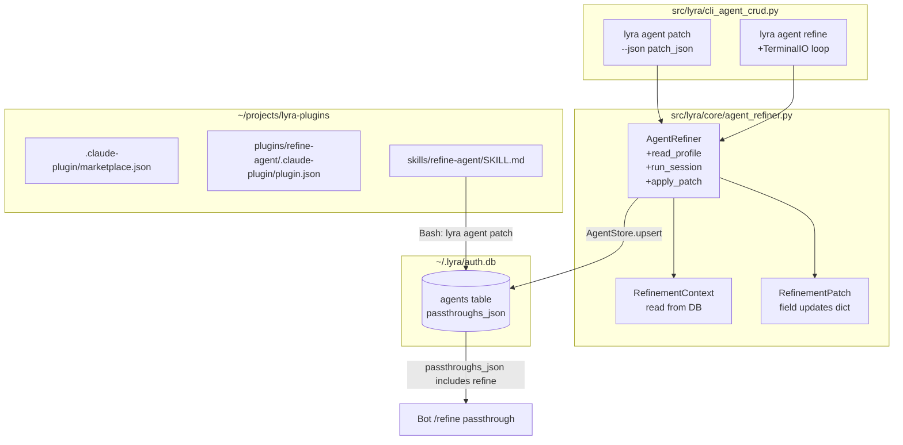

## Summary

Implement agent profile refinement across four surfaces: `AgentRefiner` core +
`lyra agent patch` CLI (V1), `lyra agent refine` interactive CLI (V2), bot `/refine`
passthrough via DB `passthroughs_json` (V3), and a new `lyra-plugins` marketplace
with `refine-agent` skill registered in Claude Code (V4).

## Architecture



```mermaid
flowchart LR
    subgraph "agent_refiner.py"
        RC2[RefinementContext]
        RP2[RefinementPatch]
        AR2[AgentRefiner]
        AR2 --> RC2
        AR2 --> RP2
    end

    subgraph "cli_agent_crud.py"
        PATCH2[patch_agent]
        REFINE2[refine]
        PATCH2 --> AR2
        REFINE2 --> AR2
    end

    subgraph "tests/core/test_agent_refiner.py"
        T1[test_read_profile]
        T2[test_apply_patch]
        T3[test_patch_cmd]
        T4[test_refine_invalid_agent]
        T1 & T2 & T3 & T4 --> AR2
    end

    subgraph "lyra-plugins/skills/refine-agent/SKILL.md"
        SKILL[/refine-agent skill\nBash: lyra agent patch]
        SKILL --> PATCH2
    end
```

## Agents

| Agent | Tasks | Files |
|-------|-------|-------|
| backend-dev | V1–V3: core, CLI commands, DB update | `agent_refiner.py`, `cli_agent_crud.py`, DB |
| doc-writer | V4: skill SKILL.md + marketplace setup | `lyra-plugins/` tree |
| tester | V1–V2: unit + integration tests | `tests/core/test_agent_refiner.py` |

## Reference Patterns

- `src/lyra/core/agent_store.py` — `AgentStore.upsert()` and `AgentRow` patterns
- `src/lyra/cli_agent_crud.py:238` — `edit()` command for CLI structure
- `~/projects/roxabi-plugins/plugins/web-intel/skills/summarize/SKILL.md` — skill format
- `~/projects/roxabi-plugins/sync-plugins.sh` — sync script to adapt
- `~/.claude/settings.json` — `extraKnownMarketplaces` registration format

## Consistency Report

Covered: 9/9 success criteria | Untraced: 0 | Slices: V1–V4 all covered

---

## Micro-Tasks

### V1 — AgentRefiner core + `lyra agent patch`

---

**[RED] T01** — Define `RefinementContext` and `RefinementPatch` dataclasses
- File: `src/lyra/core/agent_refiner.py` (create)
- Snippet:
  ```python
  @dataclass(frozen=True)
  class RefinementContext:
      agent_name: str
      persona: str | None
      voice_tts: dict
      voice_stt: dict
      model: str
      passthroughs: list[str]
      patterns: dict
      plugins: list[str]

  @dataclass
  class RefinementPatch:
      fields: dict[str, Any]
      def as_json(self) -> str: ...
      def to_agent_row(self, existing: AgentRow) -> AgentRow: ...
  ```
- Verify: `uv run python -c "from lyra.core.agent_refiner import RefinementContext, RefinementPatch"`
- Time: 5 min | Agent: backend-dev | Spec: SC-1 | `[P]` N

---

**[RED] T02** — Implement `AgentRefiner` class with `read_profile` and `apply_patch`
- File: `src/lyra/core/agent_refiner.py`
- Snippet:
  ```python
  class AgentRefiner:
      def __init__(self, name: str, store: AgentStore) -> None: ...
      def read_profile(self) -> RefinementContext: ...  # reads from store cache
      def apply_patch(self, patch: RefinementPatch) -> AgentRow: ...  # store.upsert
  ```
- Verify: `uv run python -c "from lyra.core.agent_refiner import AgentRefiner"`
- Time: 8 min | Agent: backend-dev | Spec: SC-1 | `[P]` N | Depends: T01

---

**[RED] T03** — Add `lyra agent patch` CLI command
- File: `src/lyra/cli_agent_crud.py`
- Snippet:
  ```python
  @agent_app.command(name="patch")
  def patch_agent(
      name: str = typer.Argument(...),
      json_patch: str = typer.Option(..., "--json", help="JSON patch dict"),
  ) -> None:
      """Apply a partial JSON patch to an agent in DB."""
  ```
- Verify: `lyra agent patch --help | grep json`
- Time: 8 min | Agent: backend-dev | Spec: SC-1 | `[P]` N | Depends: T02

---

**[GREEN] T04** — Write tests for `RefinementPatch.to_agent_row` and `apply_patch`
- File: `tests/core/test_agent_refiner.py` (create)
- Verify: `uv run pytest tests/core/test_agent_refiner.py -v`
- Time: 10 min | Agent: tester | Spec: SC-1, SC-8 | `[P]` Y | Depends: T02

---

**[GREEN] T05** — Write test for `lyra agent patch` invalid JSON exit code
- File: `tests/core/test_agent_refiner.py`
- Verify: `uv run pytest tests/core/test_agent_refiner.py::test_patch_invalid_json -v`
- Time: 5 min | Agent: tester | Spec: SC-8 | `[P]` Y | Depends: T03, T04

---

**RED-GATE V1** — All V1 tests pass
```bash
uv run pytest tests/core/test_agent_refiner.py -v
lyra agent patch --help
```

---

### V2 — `lyra agent refine` interactive CLI

---

**[RED] T06** — Implement `AgentRefiner.run_session` with `TerminalIO`
- File: `src/lyra/core/agent_refiner.py`
- Snippet:
  ```python
  class TerminalIO:
      def prompt(self, text: str) -> str: return input(text)
      def print(self, text: str) -> None: print(text)

  class AgentRefiner:
      def run_session(self, io: TerminalIO) -> RefinementPatch:
          """LLM-driven Q&A loop: read profile → present → collect changes → return patch."""
  ```
- Note: Uses `claude` subprocess (stream-json) with agent profile in system prompt,
  or Anthropic SDK if `ANTHROPIC_API_KEY` set. Ends when user confirms changes.
- Verify: `uv run python -c "from lyra.core.agent_refiner import AgentRefiner, TerminalIO"`
- Time: 10 min | Agent: backend-dev | Spec: SC-2 | `[P]` N | Depends: T02

---

**[RED] T07** — Add `lyra agent refine` CLI command
- File: `src/lyra/cli_agent_crud.py`
- Snippet:
  ```python
  @agent_app.command(name="refine")
  def refine(name: str = typer.Argument(..., help="Agent name to refine.")) -> None:
      """Interactively refine an agent profile via LLM-guided session."""
  ```
- Verify: `lyra agent refine --help`
- Time: 5 min | Agent: backend-dev | Spec: SC-2, SC-3 | `[P]` N | Depends: T06

---

**[GREEN] T08** — Write test for `lyra agent refine` with unknown agent name
- File: `tests/core/test_agent_refiner.py`
- Verify: `uv run pytest tests/core/test_agent_refiner.py::test_refine_unknown_agent -v`
- Time: 5 min | Agent: tester | Spec: SC-9 | `[P]` Y | Depends: T07

---

**RED-GATE V2** — Interactive refine session runs end-to-end
```bash
lyra agent refine --help
uv run pytest tests/core/test_agent_refiner.py -v
```

---

### V3 — Bot `/refine` passthrough

---

**[GREEN] T09** — Add "refine" to `passthroughs_json` for `lyra_default` and `aryl_default`
- File: `~/.lyra/auth.db` (direct SQL)
- Snippet:
  ```sql
  UPDATE agents SET passthroughs_json=json_insert(
      COALESCE(passthroughs_json, '[]'), '$[#]', 'refine'
  ) WHERE name IN ('lyra_default', 'aryl_default')
    AND NOT json_each.value = 'refine';
  ```
  Or simpler: read current, append, write back.
- Verify: `sqlite3 ~/.lyra/auth.db "SELECT name, passthroughs_json FROM agents;"`
- Time: 3 min | Agent: backend-dev | Spec: SC-4 | `[P]` Y | Depends: T02

---

**RED-GATE V3** — Passthrough registered in DB
```bash
sqlite3 ~/.lyra/auth.db "SELECT name, passthroughs_json FROM agents;"
# expect: both agents include "refine"
```

---

### V4 — `lyra-plugins` marketplace + `refine-agent` skill

---

**[RED] T10** — Initialize `~/projects/lyra-plugins/` repo structure
- Files (create):
  - `~/projects/lyra-plugins/.claude-plugin/marketplace.json`
  - `~/projects/lyra-plugins/plugins/refine-agent/.claude-plugin/plugin.json`
  - `~/projects/lyra-plugins/README.md`
- Snippet (`marketplace.json`):
  ```json
  {
    "name": "lyra-marketplace",
    "version": "1.0.0",
    "description": "Lyra-specific Claude Code plugins — agent management, persona refinement.",
    "owner": { "name": "Roxabi", "url": "https://github.com/Roxabi" },
    "plugins": [
      {
        "name": "refine-agent",
        "description": "Conversationally refine Lyra agent profiles — persona, voice, passthroughs.",
        "source": "./plugins/refine-agent",
        "category": "agent-management"
      }
    ]
  }
  ```
- Verify: `cat ~/projects/lyra-plugins/.claude-plugin/marketplace.json | python3 -m json.tool`
- Time: 8 min | Agent: doc-writer | Spec: V4 | `[P]` N

---

**[RED] T11** — Write `refine-agent` SKILL.md
- File: `~/projects/lyra-plugins/plugins/refine-agent/skills/refine-agent/SKILL.md`
- Snippet:
  ```markdown
  ---
  name: refine-agent
  argument-hint: '[agent-name]'
  description: Conversationally refine a Lyra agent profile — persona, voice, passthroughs.
  allowed-tools: Bash, Read, Glob
  ---
  # Refine Agent
  ...
  ```
- Verify: `cat ~/projects/lyra-plugins/plugins/refine-agent/skills/refine-agent/SKILL.md`
- Time: 15 min | Agent: doc-writer | Spec: SC-6 | `[P]` N | Depends: T10

---

**[RED] T12** — Create `sync-plugins.sh` for `lyra-plugins`
- File: `~/projects/lyra-plugins/sync-plugins.sh`
- Note: Adapted from `~/projects/roxabi-plugins/sync-plugins.sh`.
  Change `MARKETPLACE_REPO` and `CACHE_BASE` to `lyra-marketplace`.
- Verify: `~/projects/lyra-plugins/sync-plugins.sh --local 2>&1 | tail -5`
- Time: 8 min | Agent: doc-writer | Spec: V4 | `[P]` N | Depends: T10

---

**[GREEN] T13** — Register `lyra-marketplace` in `~/.claude/settings.json`
- File: `~/.claude/settings.json`
- Snippet (add to `extraKnownMarketplaces`):
  ```json
  "lyra-marketplace": {
    "source": {
      "source": "local",
      "path": "~/projects/lyra-plugins"
    }
  }
  ```
- Verify: `cat ~/.claude/settings.json | python3 -m json.tool | grep lyra-marketplace`
- Time: 5 min | Agent: doc-writer | Spec: V4 | `[P]` N | Depends: T10

---

**[GREEN] T14** — Sync `lyra-plugins` to local cache and install plugin
- Verify:
  ```bash
  ~/projects/lyra-plugins/sync-plugins.sh --local
  ls ~/.claude/plugins/cache/lyra-marketplace/refine-agent/
  ```
- Time: 5 min | Agent: doc-writer | Spec: V4 | `[P]` N | Depends: T12, T13

---

**RED-GATE V4** — Skill available in Claude Code
```bash
ls ~/.claude/plugins/cache/lyra-marketplace/refine-agent/
# skill appears in Claude Code skill list
```

---

## All tests green

```bash
uv run pytest tests/core/test_agent_refiner.py -v
uv run pytest -x -q
```
