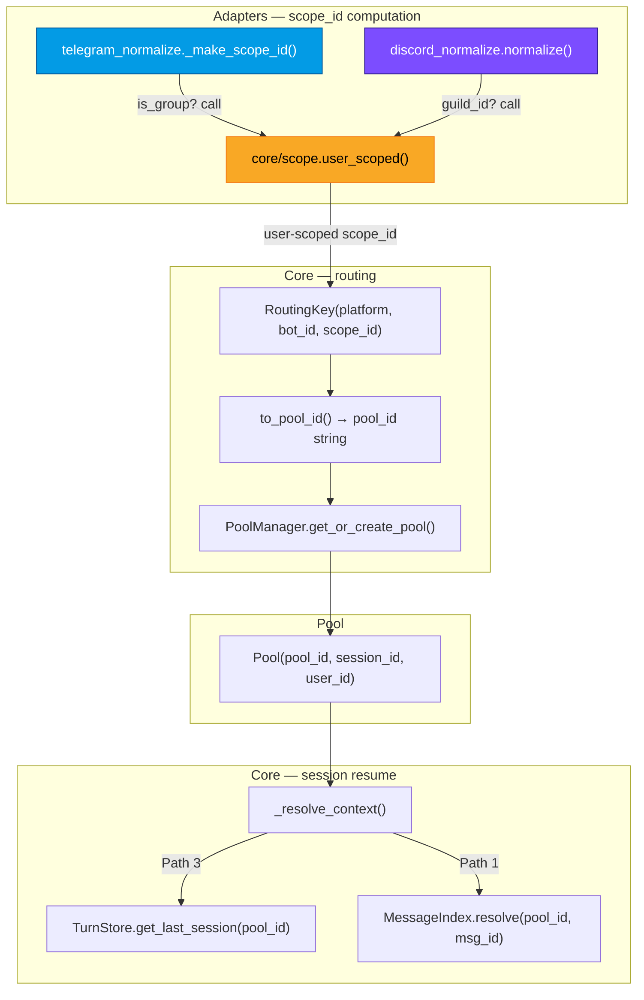
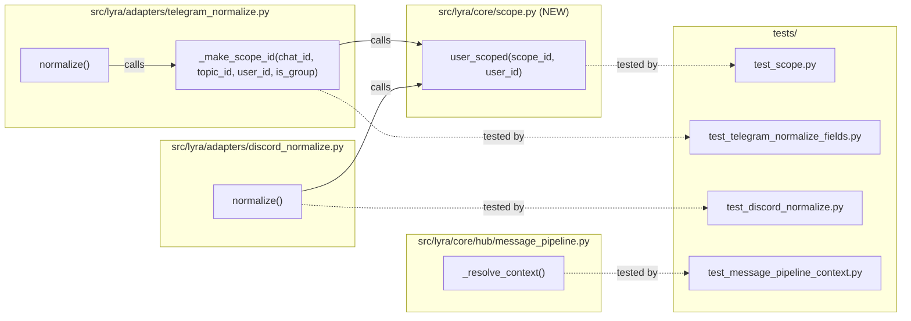

## Summary

Fix cross-user session leaking in Telegram groups and Discord channels by making `scope_id` user-scoped at the adapter layer. Each user in a shared space gets their own pool by construction, eliminating the need for defensive `is_group` guards in the resume pipeline.

## Architecture

### Data Flow



### File x Function Map



## Reference Patterns

- **Telegram tests:** `tests/adapters/test_telegram_normalize_fields.py` — `SimpleNamespace` for aiogram messages, `_ALLOW_ALL` auth, direct assertions on `msg.scope_id`
- **Discord tests:** `tests/adapters/test_discord_normalize.py` — `SimpleNamespace` for discord messages, `_ALLOW_ALL` auth, `adapter._bot_user` setup
- **Pipeline tests:** `tests/core/test_message_pipeline_context.py` — `_make_hub()`, `make_inbound_message()`, `_StubMessageIndex`, `_fake_resume` pattern

## Agents

| Agent | Task count | Files |
|-------|-----------|-------|
| backend-dev | 7 | `src/lyra/core/scope.py`, `src/lyra/adapters/telegram_normalize.py`, `src/lyra/adapters/discord_normalize.py`, `src/lyra/core/hub/message_pipeline.py` |
| tester | 6 | `tests/core/test_scope.py`, `tests/adapters/test_telegram_normalize_fields.py`, `tests/adapters/test_discord_normalize.py`, `tests/core/test_message_pipeline_context.py` |

## Consistency Report

- Criteria covered: 13/13 (SC-1 through SC-13)
- Uncovered criteria: none
- Tasks without spec backing: none
- Gold plating exemptions applied: 0

## Micro-Tasks

### Slice V1: Core helper + Telegram adapter

#### Task 1: Create `user_scoped()` helper [P] → backend-dev
- **File:** `src/lyra/core/scope.py` (NEW)
- **Snippet:**
  ```python
  def user_scoped(scope_id: str, user_id: str) -> str:
      """Append user identity to a scope_id for shared-space isolation."""
      return f"{scope_id}:user:{user_id}"
  ```
- **Verify:** `python -c "from lyra.core.scope import user_scoped; print(user_scoped('chat:42', 'tg:user:1'))"` (ready)
- **Expected:** `chat:42:user:tg:user:1`
- **Time:** 2 min | **Difficulty:** 1
- **Traces:** SC-1 | **Phase:** GREEN

#### Task 2: Write `user_scoped()` unit test [P] → tester
- **File:** `tests/core/test_scope.py` (NEW)
- **Snippet:**
  ```python
  from lyra.core.scope import user_scoped

  def test_user_scoped_appends_user_id():
      assert user_scoped("chat:42", "tg:user:1") == "chat:42:user:tg:user:1"

  def test_user_scoped_with_topic():
      assert user_scoped("chat:42:topic:7", "tg:user:1") == "chat:42:topic:7:user:tg:user:1"
  ```
- **Verify:** `python -m pytest tests/core/test_scope.py -v` (ready)
- **Expected:** 2 passed
- **Time:** 3 min | **Difficulty:** 1
- **Traces:** SC-1 | **Phase:** GREEN

#### Task 3: Modify `_make_scope_id()` to user-scope groups → backend-dev
- **File:** `src/lyra/adapters/telegram_normalize.py`
- **Snippet:**
  ```python
  from lyra.core.scope import user_scoped

  def _make_scope_id(chat_id: int, topic_id: int | None, *, user_id: str, is_group: bool) -> str:
      if topic_id is not None:
          base = f"chat:{chat_id}:topic:{topic_id}"
      else:
          base = f"chat:{chat_id}"
      return user_scoped(base, user_id) if is_group else base
  ```
- **Verify:** `python -c "from lyra.adapters.telegram_normalize import _make_scope_id; print(_make_scope_id(42, None, user_id='tg:user:1', is_group=True))"` (ready)
- **Expected:** `chat:42:user:tg:user:1`
- **Time:** 5 min | **Difficulty:** 2
- **Traces:** SC-2, SC-3, SC-4 | **Phase:** GREEN

#### Task 4: Update `normalize()` call site to pass new args → backend-dev
- **File:** `src/lyra/adapters/telegram_normalize.py`
- **Snippet:** Update line 146: `scope_id = _make_scope_id(chat_id, topic_id, user_id=user_id, is_group=is_group)`
- **Verify:** `python -m pytest tests/adapters/test_telegram_normalize_fields.py -v` (deferred — tests updated in Task 5)
- **Expected:** All existing tests pass (scope_id unchanged for DMs)
- **Time:** 3 min | **Difficulty:** 2
- **Traces:** SC-2, SC-3, SC-4 | **Phase:** GREEN

#### Task 5: Write Telegram scope_id tests (group, forum, DM regression) → tester
- **File:** `tests/adapters/test_telegram_normalize_fields.py`
- **Snippet:**
  ```python
  def test_normalize_group_chat_user_scoped_scope_id():
      # chat.type="group", from_user.id=42 → scope_id="chat:456:user:tg:user:42"
      ...

  def test_normalize_forum_topic_user_scoped_scope_id():
      # chat.type="supergroup", message_thread_id=7 → scope_id="chat:456:topic:7:user:tg:user:42"
      ...

  def test_normalize_private_chat_scope_id_unchanged():
      # Regression: chat.type="private" → scope_id="chat:123" (no user suffix)
      ...
  ```
- **Verify:** `python -m pytest tests/adapters/test_telegram_normalize_fields.py -v -k "scope"` (ready)
- **Expected:** 3+ new tests pass, existing `test_normalize_private_chat_context` still passes
- **Time:** 8 min | **Difficulty:** 3
- **Traces:** SC-2, SC-3, SC-4, SC-8 | **Phase:** GREEN

#### Task 6: Integration test — distinct pool_ids for two users in same group → tester
- **File:** `tests/adapters/test_telegram_normalize_fields.py`
- **Snippet:**
  ```python
  def test_two_users_same_group_get_distinct_pool_ids():
      # Normalize two messages: same chat_id, different from_user.id
      # Assert msg1.scope_id != msg2.scope_id
      # Build RoutingKey for each → assert to_pool_id() differs
      ...
  ```
- **Verify:** `python -m pytest tests/adapters/test_telegram_normalize_fields.py -v -k "distinct_pool"` (ready)
- **Expected:** 1 passed
- **Time:** 5 min | **Difficulty:** 2
- **Traces:** SC-8 | **Phase:** GREEN

#### RED-GATE: V1 complete → tester
- **Verify:** `python -m pytest tests/core/test_scope.py tests/adapters/test_telegram_normalize_fields.py -v`
- **Expected:** All V1 tests pass
- **Phase:** RED-GATE

### Slice V2: Discord adapter

#### Task 7: Modify Discord `normalize()` to user-scope guild channels → backend-dev
- **File:** `src/lyra/adapters/discord_normalize.py`
- **Snippet:**
  ```python
  from lyra.core.scope import user_scoped

  # After scope_id computation (line 55-59), add:
  is_guild_channel = raw.guild is not None and not resolved_thread_id
  if is_guild_channel:
      scope_id = user_scoped(scope_id, user_id)
  ```
- **Verify:** `python -m pytest tests/adapters/test_discord_normalize.py -v` (deferred — tests updated in Task 8)
- **Expected:** Existing tests updated to expect user-scoped scope_id for guild channels
- **Time:** 5 min | **Difficulty:** 2
- **Traces:** SC-5, SC-6, SC-7 | **Phase:** GREEN

#### Task 8: Write Discord scope_id tests (guild channel, DM, thread regression) → tester
- **File:** `tests/adapters/test_discord_normalize.py`
- **Snippet:**
  ```python
  def test_normalize_guild_channel_user_scoped_scope_id():
      # guild != None, no thread → scope_id="channel:333:user:dc:user:42"
      ...

  def test_normalize_dm_scope_id_unchanged():
      # guild=None → scope_id="channel:333" (no user suffix)
      ...

  def test_normalize_thread_scope_id_unchanged():
      # thread → scope_id="thread:777" (no user suffix)
      ...

  def test_two_users_same_guild_channel_get_distinct_pool_ids():
      # Same channel, different authors → different scope_ids
      ...
  ```
- **Verify:** `python -m pytest tests/adapters/test_discord_normalize.py -v -k "scope"` (ready)
- **Expected:** 4 new tests pass, existing tests pass
- **Time:** 8 min | **Difficulty:** 3
- **Traces:** SC-5, SC-6, SC-7, SC-9 | **Phase:** GREEN

#### Task 9: Update existing Discord test assertions → tester
- **File:** `tests/adapters/test_discord_normalize.py`
- **Snippet:** Update `test_normalize_builds_correct_discord_context` — `msg.scope_id` now includes user suffix for guild messages: `assert msg.scope_id == "channel:333:user:dc:user:42"`
- **Verify:** `python -m pytest tests/adapters/test_discord_normalize.py::test_normalize_builds_correct_discord_context -v` (ready)
- **Expected:** 1 passed
- **Time:** 3 min | **Difficulty:** 1
- **Traces:** SC-5, SC-12 | **Phase:** GREEN

#### RED-GATE: V2 complete → tester
- **Verify:** `python -m pytest tests/adapters/test_discord_normalize.py -v`
- **Expected:** All V2 tests pass
- **Phase:** RED-GATE

### Slice V3: Remove `is_group` session guards

> **Deploy constraint:** V3 must not be deployed until V1+V2 are both confirmed in production.

#### Task 10: Remove `is_group` guard from Path 1 (lines 305-309) → backend-dev
- **File:** `src/lyra/core/hub/message_pipeline.py`
- **Snippet:** Remove the `if msg.platform_meta.get("is_group"):` block at lines 305-309. The reply-to-resume now works for groups because pool_id is user-scoped.
- **Verify:** `grep -c "is_group" src/lyra/core/hub/message_pipeline.py` (ready)
- **Expected:** 0 matches (both guards removed)
- **Time:** 3 min | **Difficulty:** 2
- **Traces:** SC-11 | **Phase:** REFACTOR

#### Task 11: Remove `is_group` guard from Path 3 (lines 353-354) → backend-dev
- **File:** `src/lyra/core/hub/message_pipeline.py`
- **Snippet:** Remove the `if msg.platform_meta.get("is_group"): return ResumeStatus.SKIPPED` block at lines 350-354 (keep comment explaining why it's safe now).
- **Verify:** `grep -c "is_group" src/lyra/core/hub/message_pipeline.py` (ready)
- **Expected:** 0 matches
- **Time:** 3 min | **Difficulty:** 2
- **Traces:** SC-11 | **Phase:** REFACTOR

#### Task 12: Update pipeline tests — remove guard tests, add shared-space resume tests → tester
- **File:** `tests/core/test_message_pipeline_context.py`
- **Snippet:**
  ```python
  # Remove or update: test_no_resume_in_group_chat (guard no longer exists)
  # Remove or update: test_path2_rejected_group_chat_returns_skipped

  # Add: test resume works in shared spaces with user-scoped pool_ids
  async def test_reply_to_resume_works_in_group_with_user_scoped_pool():
      """Path 1: reply-to-resume in group uses user-scoped pool_id — correct session."""
      pool_id = "telegram:main:chat:42:user:tg:user:alice"
      mi = _StubMessageIndex({(pool_id, "tg-msg-55"): "sess-alice"})
      ...

  async def test_last_session_resume_works_in_group_with_user_scoped_pool():
      """Path 3: last-active-session in group uses user-scoped pool_id — correct session."""
      ...
  ```
- **Verify:** `python -m pytest tests/core/test_message_pipeline_context.py -v` (ready)
- **Expected:** All tests pass, no `is_group` guard tests remain
- **Time:** 10 min | **Difficulty:** 3
- **Traces:** SC-10, SC-11, SC-12, SC-13 | **Phase:** REFACTOR

#### Task 13: Full regression test suite → tester
- **File:** all test files
- **Verify:** `python -m pytest tests/ -v --timeout=30` (ready)
- **Expected:** All tests pass
- **Time:** 5 min | **Difficulty:** 1
- **Traces:** SC-12 | **Phase:** REFACTOR

#### RED-GATE: V3 complete → tester
- **Verify:** `python -m pytest tests/ -v --timeout=30`
- **Expected:** Full suite green
- **Phase:** RED-GATE
